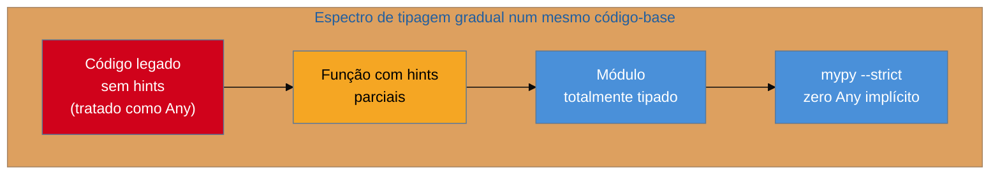

# Type hints — fundamentos e gradual typing

> [!abstract] TL;DR
> **Type hints** são anotações opcionais de tipo em parâmetros, retornos e variáveis (PEP 484, 2014; PEP 526, 2016) — sintaxe como `def soma(a: int, b: int) -> int:`. O ponto que mais gente erra: **o interpretador Python não checa nada disso em runtime**. Uma hint errada não gera `TypeError` na hora de rodar; o código executa exatamente igual, do jeito dinamicamente tipado de sempre. Hints são só **metadados** — guardados no atributo `__annotations__` de funções, classes e módulos — que o CPython majoritariamente ignora, exceto quando algo pede explicitamente para inspecioná-los (`obj.__annotations__` diretamente, ou `typing.get_type_hints()`, que resolve *forward references* e herança). Esse é o conceito de **gradual typing**: Python continua 100% dinamicamente tipado por baixo; hints são uma camada opcional por cima, lida por ferramentas *externas* — checadores estáticos como `mypy`/`pyright` (tema da próxima nota) ou bibliotecas de validação como Pydantic — não pelo próprio interpretador. Vale tipar quando o contrato importa para outra pessoa: funções públicas de biblioteca, código de time, APIs — não necessariamente um script pessoal de uso único.

## O bug que passa despercebido

Um desenvolvedor está revisando uma função que calcula frete:

```python
def calcular_frete(peso: float, distancia: float) -> float:
    return peso * distancia * 0.5
```

As anotações estão lá — `peso: float`, `distancia: float`, retorno `-> float`. O editor mostra tipos ao passar o mouse, o autocomplete funciona, tudo parece rigorosamente tipado, quase como Java ou TypeScript. Então alguém, em outro lugar do código, chama a função assim:

```python
calcular_frete("dois", 10)
```

Passando uma **string** onde a assinatura promete um `float`. Se isso fosse Java, o compilador nem deixaria o projeto buildar. Se fosse TypeScript com `tsc --noEmit` no pipeline, o build falharia antes de qualquer teste rodar. Em Python, puro e simples, sem nenhuma ferramenta adicional configurada:

```python
>>> calcular_frete("dois", 10)
Traceback (most recent call last):
  ...
TypeError: can't multiply sequence by non-int of type 'float'
```

O erro *acontece* — mas não é o Python "checando o type hint e recusando a chamada". É um `TypeError` comum, do tipo que já existia décadas antes de type hints existirem, disparado porque `"dois" * 10 * 0.5` não faz sentido semanticamente (multiplicar string por float não é uma operação válida). Se a função fosse `calcular_frete(peso: float, distancia: float) -> float: return "ok"` — retornando uma string onde prometeu `float` — **nada aconteceria**. Nenhum erro, nenhum aviso, nenhuma exceção. O programa rodaria até o fim, silenciosamente devolvendo um tipo diferente do anunciado na assinatura.

Essa observação — "as hints existem, mas nada as impõe" — é o ponto de partida desta nota. Ela separa duas perguntas que parecem a mesma, mas não são: **"esta função tem um type hint?"** e **"este código foi checado contra os type hints?"**. A resposta para a primeira depende só de você ter escrito `: tipo` na assinatura. A resposta para a segunda depende de uma ferramenta *externa* ter rodado sobre o código — e, sem essa ferramenta, a resposta é sempre "não", não importa quantas anotações existam no arquivo.

## O que é

### Anotações de função: parâmetros e retorno (PEP 484)

A [PEP 484](https://peps.python.org/pep-0484/), aceita em 2014 para o Python 3.5, padronizou uma sintaxe que já existia parcialmente desde a [PEP 3107](https://peps.python.org/pep-3107/) (2006, "Function Annotations" — só a sintaxe, sem convenção de uso) para anotar **parâmetros** e o **valor de retorno** de uma função:

```python
def saudacao(nome: str, animado: bool = False) -> str:
    if animado:
        return f"Oi, {nome}!!!"
    return f"Olá, {nome}."
```

Cada parâmetro pode levar `: <expressão de tipo>` depois do nome, e o retorno vai depois de `->`, antes dos dois-pontos que abrem o corpo da função. Parâmetros com valor padrão continuam funcionando normalmente — a anotação vem antes do `=`:

```python
def repetir(texto: str, vezes: int = 1) -> str:
    return texto * vezes
```

Funções sem retorno explícito (que só executam efeitos colaterais) são anotadas com `-> None` — não porque o Python precise disso para funcionar (uma função sem `return` já devolve `None` naturalmente), mas porque declarar `-> None` explicitamente comunica **intenção**: "esta função existe pelo efeito colateral, não espere usar o valor de retorno dela".

```python
def logar(mensagem: str) -> None:
    print(f"[LOG] {mensagem}")
```

### Anotações de variáveis (PEP 526)

Dois anos depois da PEP 484, a [PEP 526](https://peps.python.org/pep-0526/) (2016, Python 3.6+) estendeu a sintaxe para **variáveis** — algo que a anotação de função sozinha não cobria. Antes da PEP 526, a única forma de "anotar" uma variável era um comentário especial (`x = []  # type: List[int]`), lido só por ferramentas que sabiam procurar esse padrão em comentários — uma solução funcional, mas frágil e feia.

```python
idade: int = 25
nome: str
precos: list[float] = [10.5, 20.0, 15.75]
```

Repare no segundo exemplo (`nome: str`, sem valor): é sintaticamente válido anotar uma variável **sem atribuir** um valor a ela ainda — a anotação fica registrada, mas a variável em si nem existe até que algo a atribua de fato (tentar ler `nome` antes de uma atribuição levanta `NameError`, exatamente como aconteceria sem a anotação). Isso é comum em atributos de classe, onde a anotação documenta o *schema* esperado antes de qualquer instância existir:

```python
class Usuario:
    nome: str
    idade: int
    ativo: bool = True
```

Aqui, `nome` e `idade` são anotações **puras** (sem valor — não criam atributos de classe de fato, só documentam o que cada instância deve ter), enquanto `ativo: bool = True` cria um atributo de classe real com valor padrão `True`. Essa é, inclusive, a base sintática sobre a qual `@dataclass` é construído — mas isso é assunto de outra nota do vault, não desta.

> [!question]- Por que a variável anotada sem valor não dá erro na hora de definir a classe?
> Porque a anotação, sozinha, não é uma instrução de atribuição — é só um registro num dicionário de metadados (`__annotations__`, que a próxima seção detalha). `nome: str` dentro do corpo de `class Usuario` não executa nenhum `nome = algo`; ele só adiciona a entrada `'nome': str` ao `__annotations__` da classe. Quem de fato cria o atributo `self.nome` é o código do `__init__` (escrito à mão, ou gerado automaticamente por algo como `@dataclass`) — a anotação, por si só, é promessa, não execução.

### Gradual typing: o nome do jogo

O termo **gradual typing** não nasceu com Python — foi cunhado por Jeremy Siek e Walid Taha num [artigo acadêmico de 2006](https://peps.python.org/pep-0484/#rationale-and-goals) e adotado depois por várias linguagens (Python, TypeScript, Hack/PHP, Dart) como forma de descrever um sistema de tipos onde **partes do programa podem ser tipadas e partes podem continuar dinâmicas, coexistindo no mesmo código-base, sem exigir tudo-ou-nada**. A PEP 484 adota esse modelo explicitamente como filosofia central: Python não vira uma linguagem estaticamente tipada — ele ganha uma **camada opcional** de tipos por cima de um núcleo que continua 100% dinâmico.

O mecanismo que viabiliza essa coexistência é o tipo especial `Any` (de `typing`), que a própria PEP 484 descreve como **consistente com todos os tipos** — pode ser atribuído a partir de qualquer tipo e atribuído para qualquer tipo, sem que um checador estático reclame. Qualquer valor sem anotação explícita é tratado, para fins de checagem estática, como se fosse `Any` — o que significa: código legado não anotado e código novo totalmente tipado convivem sem conflito, e o processo de adicionar hints pode ser **incremental**, função por função, módulo por módulo, sem precisar de uma reescrita completa de uma vez.



Nenhum desses quatro estágios é "mais Python" que o outro — todos executam exatamente da mesma forma, porque, do ponto de vista do interpretador, tipagem gradual não muda nada sobre *como* o código roda. O que muda é **quanto uma ferramenta externa consegue verificar antes de rodar**. É essa distinção — entre "o que o interpretador faz" e "o que uma ferramenta de análise faz" — que organiza o resto desta nota.

## Por que importa

Entender que type hints são metadados opcionais, não uma mudança de semântica de execução, evita dois erros de calibração comuns:

- **Confiar demais**: achar que "a função tem hint, então está protegida" é um erro perigoso — sem um checador rodando (em CI, no editor, ou manualmente), uma hint incorreta é só um comentário bonito que nunca foi verificado. Times que adicionam hints "porque é boa prática" mas não rodam `mypy`/`pyright` em lugar nenhum do pipeline ganham a aparência de segurança de tipos sem o benefício real.
- **Desconfiar demais**: achar que "não adianta nada, o Python ignora mesmo" descarta um dos ganhos mais citados de hints modernos — mesmo **sem** rodar um checador estático, hints melhoram drasticamente o autocomplete e a navegação de código em editores (VS Code, PyCharm), servem como documentação viva que não descola do código do jeito que um docstring desatualizado descola, e são a base sobre a qual bibliotecas como Pydantic e FastAPI constroem validação **real** em runtime (assunto da nota 06 deste galho) — aí sim, o tipo declarado passa a ser checado de fato, mas por uma biblioteca que decide ler `__annotations__` e agir sobre isso, não pelo interpretador.

O calibre certo é: type hints são um **investimento em comunicação e tooling**, cujo retorno depende inteiramente de quem (ou o quê) vai ler essas anotações depois — um colega de time, o autocomplete do editor, um checador estático em CI, ou uma biblioteca de validação. Sem nenhum leitor, a hint é só texto morto que o interpretador pula por cima.

## Como funciona

### O que o interpretador de fato faz com uma hint

Quando o CPython encontra `def f(x: int) -> str:`, ele **avalia** as expressões de tipo (`int`, `str`) no momento em que a função é definida — porque, sintaticamente, `int` e `str` são só nomes de objetos como quaisquer outros, e o Python precisa resolver o que esses nomes significam para guardá-los em algum lugar. O "algum lugar" é um dicionário especial, `__annotations__`, anexado ao objeto função (ou classe, ou módulo):

```python
def f(x: int, y: str = "a") -> bool:
    return bool(x)

print(f.__annotations__)
```

```text
{'x': <class 'int'>, 'y': <class 'str'>, 'return': <class 'bool'>}
```

Isso — e só isso — é o que o interpretador faz por padrão: **avalia e guarda**. Ele não compara o tipo declarado com o tipo do argumento passado em nenhum momento da chamada `f(...)`. A prova mais direta: como já vimos na abertura, `f("string", 42)` não gera erro de tipo nenhum na hora de chamar — só executaria um erro se o *corpo* da função fizesse algo incompatível com o valor real recebido, e mesmo assim seria o erro de sempre (`TypeError` de operação inválida), não um erro relacionado às hints.

> [!warning] Anotação "errada" não impede a execução — nem sequer é detectada
> ```python
> def dobrar(n: int) -> int:
>     return n * 2
>
> dobrar("ab")   # devolve "abab" — uma str, não um int!
> ```
> A chamada roda sem exceção nenhuma. `n * 2` funciona perfeitamente para strings (repetição), então a função "funciona" no sentido de "não quebra" — mas viola completamente o contrato anunciado (`-> int`). Sem um checador estático rodando sobre esse código, essa violação nunca é detectada, nem em runtime nem em lugar nenhum. É o exemplo mais direto de por que "ter hint" e "ser checado" são coisas diferentes.

Isso vale igualmente para variáveis: `idade: int = "vinte e cinco"` é uma linha perfeitamente válida em runtime — o Python atribui a string normalmente, ignora que a anotação prometia `int`, e segue em frente. A anotação de variável, assim como a de função, não é uma declaração de tipo no sentido de C ou Java (que reservam memória tipada e recusam atribuições incompatíveis) — é só uma entrada a mais no `__annotations__` do escopo onde a atribuição acontece (módulo, classe ou, dentro de uma função, um dicionário local que normalmente nem é populado, salvo casos especiais).

### `__annotations__` vs. `typing.get_type_hints()`

Existem duas formas de **ler** as anotações depois que elas existem, e a diferença entre elas é uma pegadinha real de entrevista e de código de produção:

**`__annotations__` direto** — o dicionário cru, exatamente como foi avaliado na definição:

```python
class Pedido:
    id: int
    total: "float"          # forward reference como string
```

```python
>>> Pedido.__annotations__
{'id': <class 'int'>, 'total': 'float'}
```

Repare: `total` aparece como a **string** `'float'`, não como a classe `float` em si — porque foi escrita entre aspas no código-fonte (uma técnica chamada *forward reference*, usada quando o tipo referenciado ainda não existe no ponto do código onde a anotação aparece — por exemplo, uma classe que se autorreferencia, ou dois tipos que se referenciam mutuamente). `__annotations__` não resolve isso — ele devolve exatamente o que foi escrito, string ou objeto, sem tentar interpretar nada.

**`typing.get_type_hints()`** — a função da biblioteca padrão, [documentada aqui](https://docs.python.org/3/library/typing.html#typing.get_type_hints), que faz o trabalho extra de **resolver** essas strings, avaliando-as no namespace correto (globals/locals do módulo onde a anotação foi escrita):

```python
import typing

>>> typing.get_type_hints(Pedido)
{'id': <class 'int'>, 'total': <class 'float'>}
```

Agora `total` aparece como a classe `float` de verdade, resolvida a partir da string. `get_type_hints()` também tem um segundo comportamento que `__annotations__` não tem: para **classes**, ele percorre o `__mro__` (a cadeia de herança) e **funde** as anotações de todas as classes-base, não só da classe em questão — enquanto `Classe.__annotations__` mostra só o que foi anotado diretamente naquela classe, ignorando o que veio de uma superclasse.

```python
class Base:
    x: int

class Derivada(Base):
    y: str

>>> Derivada.__annotations__
{'y': <class 'str'>}          # só o que Derivada declarou

>>> typing.get_type_hints(Derivada)
{'x': <class 'int'>, 'y': <class 'str'>}   # x herdado de Base, fundido aqui
```

> [!question]- Por que alguém escreveria um tipo entre aspas (forward reference) em vez de direto?
> Porque, no momento em que o Python avalia a anotação (na definição da função/classe), o nome referenciado pode **ainda não existir**. O caso clássico é uma classe cujo método devolve uma instância dela mesma:
> ```python
> class No:
>     def proximo(self) -> "No":   # 'No' ainda não existe no ponto em que a linha é executada
>         ...
> ```
> Sem as aspas, `def proximo(self) -> No:` tentaria avaliar o nome `No` **enquanto a própria classe `No` ainda está sendo construída** — e levantaria `NameError: name 'No' is not defined`, porque o nome só passa a existir no namespace do módulo depois que a instrução `class No:` termina de executar por completo. A string adia essa resolução para quando alguém pedir — via `get_type_hints()`, ou via um checador estático, que lida com forward references como parte do próprio design da linguagem de tipos. Vale registrar, sem aprofundar aqui: a partir do Python 3.14, a [PEP 649](https://peps.python.org/pep-0649/) muda esse mecanismo por baixo dos panos (avaliação **preguiçosa** de anotações via descritores, substituindo a antiga proposta da [PEP 563](https://peps.python.org/pep-0563/)/`from __future__ import annotations`) — o efeito prático para quem escreve código de aplicação é parecido (menos `NameError` em anotações auto-referenciadas), mas o mecanismo interno é outro assunto, fora do escopo desta nota introdutória.

### A promessa e o limite: hint declarado ≠ tipo garantido

Juntando as duas seções anteriores, dá para nomear com precisão a distinção central desta nota:

| | "Ter um type hint" | "Ser checado de fato" |
|---|---|---|
| O que significa | Existe uma anotação `: tipo` no código-fonte | Alguma ferramenta comparou o tipo declarado com o tipo real e reportou incompatibilidades |
| Quem faz | O programador, ao escrever a assinatura | Um checador estático (`mypy`, `pyright` — nota 04 deste galho) rodando **antes** da execução, ou uma biblioteca de validação (Pydantic — nota 06) checando **durante** a execução |
| Quando acontece | Na leitura/definição do código | Num passo separado — CI, editor, ou chamada explícita de validação |
| O interpretador CPython participa? | Sim — avalia a expressão e guarda em `__annotations__` | Não — o CPython nunca compara hint com valor real |
| O que acontece se a hint estiver errada e ninguém checar | Nada — código roda normalmente, hint fica incorreta silenciosamente | N/A (por definição, não há checagem) |

Essa tabela é, em essência, o resumo de toda a nota: **hints existem numa camada separada da execução**. A camada de execução é a de sempre — dinamicamente tipada, checagem de tipo só quando uma operação de fato falha (como `"dois" * 10 * 0.5`). A camada de hints é metadado consultável, e só produz valor real quando algo — humano ou ferramenta — decide consultá-la e agir sobre o que encontrar. As duas próximas notas deste galho cobrem essas duas formas concretas de "agir sobre o que encontrar": checagem estática off-line (`mypy`/`pyright`) e validação em runtime (Pydantic).

**Type hints em uma frase**: são metadados opcionais que o Python guarda mas não impõe — o valor só aparece quando uma ferramenta externa decide lê-los e fazer alguma coisa com eles.

### Anotações também existem em nível de módulo

O mesmo mecanismo — avaliar e guardar em `__annotations__` — se aplica a variáveis anotadas soltas num módulo, fora de qualquer função ou classe:

```python
# config.py
DEBUG: bool = False
MAX_CONEXOES: int = 10
```

```python
>>> import config
>>> config.__annotations__
{'DEBUG': <class 'bool'>, 'MAX_CONEXOES': <class 'int'>}
```

O padrão se repete de ponta a ponta da linguagem: função, classe, módulo — todos os três "contêineres" que aceitam anotação guardam o resultado no mesmo tipo de dicionário, acessível pelo mesmo atributo `__annotations__`, sem nenhum deles impor checagem. É essa uniformidade que permite a uma única função como `typing.get_type_hints()` funcionar igualmente bem em qualquer um dos três — ela só precisa saber onde procurar o dicionário e como resolver o namespace certo para strings pendentes.

### Comparando o "quando checa" entre linguagens

Para quem vem de uma linguagem com tipagem estática obrigatória, vale nomear explicitamente **em que momento** cada uma detecta uma incompatibilidade de tipo — é essa comparação que costuma desfazer a confusão inicial sobre "por que Python deixa isso passar":

| | Java / C# | TypeScript | Python (com hints, sem checador) | Python (com hints + mypy/pyright em CI) |
|---|---|---|---|---|
| Quando checa tipos | Compilação — `javac` recusa o build | Compilação — `tsc` recusa o build (mas gera JS de qualquer jeito, se configurado) | **Nunca** — hints existem, ninguém as lê | Antes do deploy, como um passo separado de CI |
| O artefato final carrega tipos? | `.class` não carrega tipos genéricos completos (type erasure), mas o bytecode é verificado | JS gerado não tem tipos — apagados na compilação | Bytecode do CPython nunca teve tipos | Mesmo bytecode de sempre — a checagem já terminou antes |
| Falha silenciosa possível? | Não, para o que o compilador consegue verificar | Não, para o que `tsc` consegue verificar | **Sim** — é o cenário padrão sem ferramenta extra | Não, para o que o checador consegue verificar — mas ele roda **fora** do interpretador |

A coluna mais reveladora é a última: mesmo com `mypy`/`pyright` rodando em CI, a checagem continua acontecendo **fora** do interpretador, como um passo de análise estática que roda **antes** do código ser executado — nunca dentro do próprio `python app.py`. É uma diferença de arquitetura, não só de rigor: Java e TypeScript embutem o compilador no próprio pipeline de execução (não existe `.class` ou JS gerado sem passar pelo compilador primeiro); Python mantém a checagem de tipos como uma etapa **opcional e desacoplada**, que você pode ligar, desligar, ou nunca ter configurado — e o programa roda de um jeito ou de outro, porque, para o interpretador, a diferença entre um módulo checado e um não checado é zero.

## Quando vale a pena tipar

Se hints não mudam o comportamento em runtime e exigem esforço para escrever e manter, quando compensa o investimento? A resposta não é "sempre" nem "nunca" — depende de **quem mais vai depender do contrato**.

**Vale muito a pena tipar:**

- **Funções públicas de uma biblioteca.** Quem consome sua função via `import minha_lib` nunca vai ler o corpo dela para entender o que aceita e o que devolve — vai ler a assinatura, no editor ou na documentação gerada automaticamente a partir dela. Uma assinatura tipada é, ao mesmo tempo, documentação viva e o material bruto que o autocomplete do consumidor usa para sugerir os métodos certos no valor de retorno.
- **Código de time.** Quando mais de uma pessoa mexe no mesmo módulo, hints reduzem o custo de "entender o que essa função espera" sem precisar ler a implementação inteira ou perguntar no chat do time. Combinado com um checador estático em CI (nota 04), hints também pegam uma classe inteira de bugs de integração — "esse serviço passou um `dict` onde o outro esperava um objeto" — antes de chegar em produção, sem precisar de um teste específico para cada combinação possível de tipos errados.
- **Fronteiras de API** (parâmetros de endpoint, corpo de requisição/resposta, contratos entre serviços). É justamente aqui que hints deixam de ser só documentação e passam a alimentar validação real — o caso do Pydantic/FastAPI, coberto adiante no galho.
- **Refatoração de código legado grande.** Hints em funções críticas, adicionadas incrementalmente (exatamente o espírito do gradual typing), dão ao checador estático uma âncora para pegar regressões de tipo introduzidas durante a refatoração, mesmo que o resto do código-base ainda não esteja tipado.

**Vale menos a pena tipar:**

- **Script pessoal de uso único** — um `.py` de trinta linhas que processa um CSV uma vez e nunca mais será tocado. O custo de escrever e manter anotações supera o benefício, porque não existe "outro leitor" (nem humano, nem ferramenta em CI) que vá se beneficiar delas.
- **Protótipo exploratório** em fase de descoberta, onde a forma dos dados ainda está mudando a cada poucos minutos — tipar cedo demais aqui gera atrito (reescrever hints a cada mudança de ideia) sem o benefício de estabilidade que hints entregam em código já maduro.
- **Notebooks de análise interativa** (Jupyter), onde o padrão de uso — células executadas fora de ordem, variáveis reatribuídas com tipos diferentes ao longo da sessão — combina mal com a promessa de estabilidade que uma anotação sugere.

O critério prático, resumido: tipar é um investimento cujo retorno cresce com o **número de leitores futuros** (humanos e ferramentas) e com a **vida útil** do código. Script descartável tem poucos leitores futuros e vida útil curta — hints custam mais do que valem. Biblioteca pública, código de time e fronteira de API têm muitos leitores futuros e vida útil longa — aí o cálculo se inverte com folga.

| Contexto | Leitores futuros | Vida útil típica | Vale tipar? |
|---|---|---|---|
| Script pessoal de uso único | Só você, uma vez | Minutos a horas | Raramente |
| Protótipo em fase de descoberta | Você, por poucos dias | Dias, depois reescrito ou descartado | Geralmente não — hints cedo demais geram atrito |
| Notebook de análise exploratória | Você, sessão a sessão | Variável, uso repetido mas informal | Raramente — padrão de uso (reexecução fora de ordem) combina mal com hints |
| Função interna de um módulo de time | Colegas que leem o código, eventualmente | Meses a anos | Sim, quando a função é usada por mais de uma pessoa/módulo |
| Função pública de biblioteca | Consumidores externos, via editor e documentação gerada | Anos | Sempre |
| Fronteira de API (request/response) | Outros serviços, outros times, consumidores externos | Anos | Sempre — e aqui hints costumam virar validação real (Pydantic, nota 06) |

## Armadilhas comuns

> [!warning] Achar que uma hint "quebra" a execução quando violada
> Como demonstrado na abertura e na seção de mecanismo, nenhuma hint — de parâmetro, retorno ou variável — gera erro em runtime só por ser incompatível com o valor real. Erros que *parecem* vir da hint são, na verdade, erros comuns de operação inválida (como multiplicar string por float), que aconteceriam exatamente do mesmo jeito num Python sem nenhuma anotação no código.

> [!warning] Confundir `Classe.__annotations__` com o conjunto completo de tipos da classe (incluindo herdados)
> `__annotations__` acessado direto num objeto mostra só as anotações declaradas **naquele** objeto específico — não sobe a cadeia de herança. Para o conjunto completo, incluindo o que veio de superclasses, é `typing.get_type_hints()` que faz esse trabalho, percorrendo o `__mro__`. Confundir os dois é uma fonte real de bugs em código que introspecciona classes dinamicamente (frameworks de serialização, ORMs, validadores customizados).

> [!warning] Esquecer que anotação em string precisa de resolução explícita
> Ler `__annotations__` diretamente e tentar usar o valor como se fosse sempre uma classe (`isinstance(x, anotacao)`, por exemplo) quebra silenciosamente quando a anotação é uma *forward reference* em string — porque, nesse caso, `anotacao` é literalmente o texto `'MinhaClasse'`, não a classe `MinhaClasse`. `typing.get_type_hints()` existe justamente para eliminar essa armadilha, resolvendo strings para os objetos reais antes de devolver o dicionário.

> [!warning] Tipar um script descartável com o mesmo rigor de uma biblioteca pública
> Não é um erro *técnico* — o código roda normalmente de qualquer jeito — mas é um desperdício de esforço quando não há quem se beneficie do contrato documentado. Calibrar o nível de rigor pelo público-alvo do código (visto na seção anterior) evita tanto o exagero num script de uso único quanto, no sentido oposto, a negligência numa função pública de biblioteca.

## Casos práticos

### Cenário 1: adoção incremental num módulo de time

Voltando ao espírito de gradual typing: como isso se parece num projeto de verdade, em vez de num exemplo isolado? Considere um módulo de processamento de pedidos que começou sem nenhuma anotação:

```python
# pedidos.py — versão original, sem hints
def calcular_total(itens, desconto=0):
    subtotal = sum(item["preco"] * item["quantidade"] for item in itens)
    return subtotal - desconto


def aplicar_cupom(pedido, codigo_cupom):
    cupons = carregar_cupons()
    if codigo_cupom in cupons:
        pedido["desconto"] = cupons[codigo_cupom]
    return pedido
```

Funciona, mas quem chama `calcular_total` precisa adivinhar (ou ler o corpo) que `itens` é uma lista de dicionários com chaves `"preco"` e `"quantidade"`, e que `aplicar_cupom` espera um `pedido` que também é um dicionário. O time decide começar a tipar — não o módulo inteiro de uma vez, só a função pública mais usada por outros times primeiro (o critério de "vale a pena tipar" da seção anterior, aplicado):

```python
# pedidos.py — depois da primeira rodada de tipagem incremental
from typing import TypedDict


class ItemPedido(TypedDict):
    preco: float
    quantidade: int


def calcular_total(itens: list[ItemPedido], desconto: float = 0) -> float:
    subtotal = sum(item["preco"] * item["quantidade"] for item in itens)
    return subtotal - desconto


# aplicar_cupom ainda sem hints — próxima rodada
def aplicar_cupom(pedido, codigo_cupom):
    cupons = carregar_cupons()
    if codigo_cupom in cupons:
        pedido["desconto"] = cupons[codigo_cupom]
    return pedido
```

(`TypedDict` — usado aqui para dar forma explícita ao dicionário `itens` — é assunto aprofundado da nota 05 deste galho; aparece só de relance aqui para mostrar como fica a assinatura de uma função tipada de verdade.)

Nada, na execução, mudou entre as duas versões — `calcular_total([{"preco": 10.0, "quantidade": 2}])` roda exatamente igual nas duas. O que mudou é que agora o editor sabe que `itens` é uma lista de estruturas com `"preco"` e `"quantidade"`, sugere essas chaves ao autocompletar, e (uma vez que o galho chegar em `mypy`/`pyright`, nota 04) um checador estático consegue detectar, antes de qualquer deploy, se alguém em outro módulo passar `calcular_total([{"valor": 10}])` — uma estrutura com a chave errada. `aplicar_cupom` continua sem hints por enquanto, porque é uma função interna, menos usada por outros times — exatamente o tipo de priorização que o gradual typing existe para viabilizar: tipar o que compensa primeiro, deixar o resto para depois, sem quebrar nada no meio do caminho.

### Cenário 2: introspecção de anotações numa biblioteca de serialização

Um caso onde `__annotations__`/`get_type_hints()` deixam de ser curiosidade e viram mecanismo real: bibliotecas que geram comportamento **a partir** das anotações, em vez de só documentá-las. Imagine uma função utilitária simples, que converte um dicionário vindo de uma requisição HTTP num objeto, validando os tipos declarados na classe de destino:

```python
import typing


class UsuarioDTO:
    nome: str
    idade: int
    ativo: bool = True


def montar_a_partir_de_dict(classe: type, dados: dict):
    hints = typing.get_type_hints(classe)
    objeto = classe()
    for campo, tipo_esperado in hints.items():
        valor = dados.get(campo)
        if valor is not None and not isinstance(valor, tipo_esperado):
            raise TypeError(
                f"Campo '{campo}' esperava {tipo_esperado.__name__}, "
                f"recebeu {type(valor).__name__}"
            )
        setattr(objeto, campo, valor)
    return objeto


usuario = montar_a_partir_de_dict(UsuarioDTO, {"nome": "Ana", "idade": 30})
# usuario.nome == "Ana", usuario.idade == 30

montar_a_partir_de_dict(UsuarioDTO, {"nome": "Bruno", "idade": "trinta"})
# TypeError: Campo 'idade' esperava int, recebeu str
```

Aqui, pela primeira vez nesta nota, uma violação de tipo **é** pega — mas repare que o mecanismo continua sendo exatamente o previsto: não é o interpretador Python checando nada por conta própria, é a própria função `montar_a_partir_de_dict` chamando `typing.get_type_hints()` explicitamente e comparando cada valor com `isinstance()`, escrita à mão. É essencialmente uma versão simplificada e artesanal do que o Pydantic faz de forma muito mais completa e performática (validação de tipos aninhados, coerção, mensagens de erro estruturadas) — assunto da nota 06. O ponto didático aqui é mostrar, em código pequeno o bastante para ler de uma vez, **como** uma biblioteca de validação transforma metadado passivo em comportamento ativo: lendo `__annotations__`/`get_type_hints()` e decidindo, ela mesma, o que fazer com o que encontra.

## Em entrevista

- **"Type hints em Python são obrigatórios? O interpretador os checa?"** Não são obrigatórios, e o interpretador CPython não os checa em runtime — ele só avalia a expressão de tipo no momento da definição e guarda o resultado em `__annotations__`. A checagem, quando acontece, vem de uma ferramenta externa: um checador estático (`mypy`, `pyright`) rodando antes da execução, ou uma biblioteca como Pydantic validando explicitamente em runtime.
- **"O que é gradual typing?"** É o modelo de tipos que permite partes de um programa serem tipadas e partes continuarem dinâmicas, convivendo no mesmo código-base sem exigir uma migração completa. Python implementa isso tratando qualquer valor sem hint explícito como `Any` — um tipo consistente com todos os outros para fins de checagem estática — o que viabiliza adotar hints incrementalmente, função por função.
- **"Qual a diferença entre `obj.__annotations__` e `typing.get_type_hints(obj)`?"** `__annotations__` devolve o dicionário cru, exatamente como foi escrito — incluindo *forward references* ainda como string, e só o que foi anotado diretamente naquele objeto (sem herança). `get_type_hints()` resolve as strings para os tipos reais e, para classes, funde anotações herdadas de toda a cadeia do `__mro__`.
- **"Se hints não são checados pelo interpretador, por que usar?"** Documentação viva que não descola do código (diferente de docstrings, que podem ficar desatualizados sem que nada avise), suporte de editor (autocomplete, navegação), e a base de dados que ferramentas externas — checadores estáticos e bibliotecas de validação — consomem para entregar valor real. O ganho não vem do interpretador; vem de tudo o que é construído *em cima* das hints.
- **"Quando você não tiparia um trecho de código?"** Script pessoal descartável, protótipo em fase de descoberta rápida, ou notebook interativo — qualquer contexto onde o número de leitores futuros (humanos ou ferramentas) é baixo o suficiente para o custo de escrever e manter anotações não compensar.

> [!question]- O entrevistador pergunta: "então tipar Python é só cosmético?"
> Não — é uma pergunta que soa cética mas tem uma resposta precisa: hints são metadados **opcionais para o interpretador**, não cosméticos no sentido de "sem efeito nenhum". Sozinhas, elas já melhoram a experiência de desenvolvimento (autocomplete, documentação viva). Combinadas com ferramentas — checadores estáticos em CI, ou bibliotecas de validação como Pydantic — elas viram a espinha dorsal de contratos de API real, capazes de rejeitar dados inválidos antes de eles causarem dano. A palavra certa não é "cosmético", é "opcional e composicional": o valor de uma hint depende inteiramente do que é construído em cima dela, mas quando algo *é* construído em cima, o efeito é bem real.

## How to explain in English

> Python type hints — standardized by PEP 484 (2014) for function parameters and return values, and PEP 526 (2016) for variable annotations — are optional metadata, not enforced types. The interpreter evaluates the annotation expression at definition time and stores it in the object's `__annotations__` dictionary, but it never compares that declared type against the actual value passed at call time. Calling a fully-annotated function with the wrong type doesn't raise a type error unless the function body happens to do something the real value can't support — the same `TypeError` you'd get without any hints at all. That's the essence of gradual typing: Python stays fully dynamically typed at runtime, and hints are an optional layer read by external tools — static type checkers like mypy or pyright, or runtime validation libraries like Pydantic — never by the interpreter itself. There's a real difference between "having a type hint" and "being type-checked": the first just means someone wrote `: type` in the source; the second means some tool actually compared the declared type against reality and reported mismatches. Whether hints are worth adding depends on who else depends on the contract — public library functions, team-shared code, and API boundaries benefit heavily; one-off personal scripts and fast-moving prototypes usually don't justify the upkeep cost.

| PT-BR | English |
|---|---|
| anotação de tipo / type hint | type hint / type annotation |
| tipagem gradual | gradual typing |
| checagem em tempo de execução | runtime type checking |
| checagem estática de tipos | static type checking |
| metadados de tipo | type metadata |
| referência adiantada (forward reference) | forward reference |
| resolver anotações | resolve annotations |
| avaliação adiada de anotações | deferred/postponed evaluation of annotations |
| contrato de função | function contract |
| adoção incremental de tipos | incremental typing adoption |

## O que vem a seguir

Esta nota estabeleceu o alicerce: como escrever hints (PEP 484/526), o que o interpretador realmente faz com elas (guardar em `__annotations__`, nunca comparar), e a distinção central entre ter uma hint e ser checado de fato. As duas próximas notas do galho respondem, cada uma à sua maneira, à pergunta "e quem *lê* essas hints, então?" — [[02 - Union, Optional e o operador |02 — Union, Optional e o operador `|`]] amplia o vocabulário de tipos que dá para expressar (tipos opcionais, uniões), ainda dentro da mesma regra de "metadado sem enforcement automático" vista aqui; mais adiante, [[04 - mypy e pyright — checagem estática na prática|04 — mypy e pyright]] mostra a primeira ferramenta que de fato compara hint com realidade, e [[06 - Pydantic — validação em runtime|06 — Pydantic]] mostra a segunda — dessa vez, checando durante a execução, não antes dela.

- [[02 - Union, Optional e o operador |02 — Union, Optional e o operador `|`]] — próxima nota: tipos opcionais e uniões, ainda em cima do mesmo modelo de hints-sem-enforcement.
- [[04 - mypy e pyright — checagem estática na prática|04 — mypy e pyright: checagem estática na prática]] — a primeira ferramenta que efetivamente compara hint com valor real, off-line, antes do código rodar.
- [[06 - Pydantic — validação em runtime|06 — Pydantic: validação em runtime]] — a segunda forma de checagem real, desta vez em runtime, ao instanciar um modelo.

## Veja também

- [[03-Dominios/Tecnologia/Python/OO e Data Model/06 - ABC e Protocol — tipagem estrutural|OO e Data Model/06 — ABC e Protocol]] — tipagem estrutural aplicada a classes (Protocol), pré-requisito deste galho; não repetida aqui.
- [[03-Dominios/Tecnologia/Python/Tipagem moderna/index|Tipagem moderna]] — MOC do galho.
- [[03-Dominios/Tecnologia/Python/index|Trilha Python]] — MOC central.

## Fontes

- Python Software Foundation. *PEP 484 — Type Hints*. peps.python.org, 2014 (aceita para Python 3.5). https://peps.python.org/pep-0484/ (acessado em 2026-07-10)
- Python Software Foundation. *PEP 526 — Syntax for Variable Annotations*. peps.python.org, 2016 (aceita para Python 3.6). https://peps.python.org/pep-0526/ (acessado em 2026-07-10)
- Python Software Foundation. *PEP 3107 — Function Annotations*. peps.python.org, 2006 (aceita para Python 3.0). https://peps.python.org/pep-3107/ (acessado em 2026-07-10)
- Python Software Foundation. *PEP 563 — Postponed Evaluation of Annotations*. peps.python.org, 2017. https://peps.python.org/pep-0563/ (acessado em 2026-07-10)
- Python Software Foundation. *PEP 649 — Deferred Evaluation Of Annotations Using Descriptors*. peps.python.org, 2021 (implementação prevista para 3.14 via PEP 749). https://peps.python.org/pep-0649/ (acessado em 2026-07-10)
- Python Software Foundation. *typing — Support for type hints*, seção `get_type_hints()`. docs.python.org, versão 3.14. https://docs.python.org/3/library/typing.html#typing.get_type_hints (acessado em 2026-07-10)
- Real Python. *Python Type Checking (Guide)*. https://realpython.com/python-type-checking/ (acessado em 2026-07-10)
- Ramalho, L. *Fluent Python: Clear, Concise, and Effective Programming*, 2ª ed. — capítulo "Type Hints in Functions" (gradual typing, `Any`, hints de parâmetro/retorno). O'Reilly Media, 2022.

Consultado em 2026-07-10.
