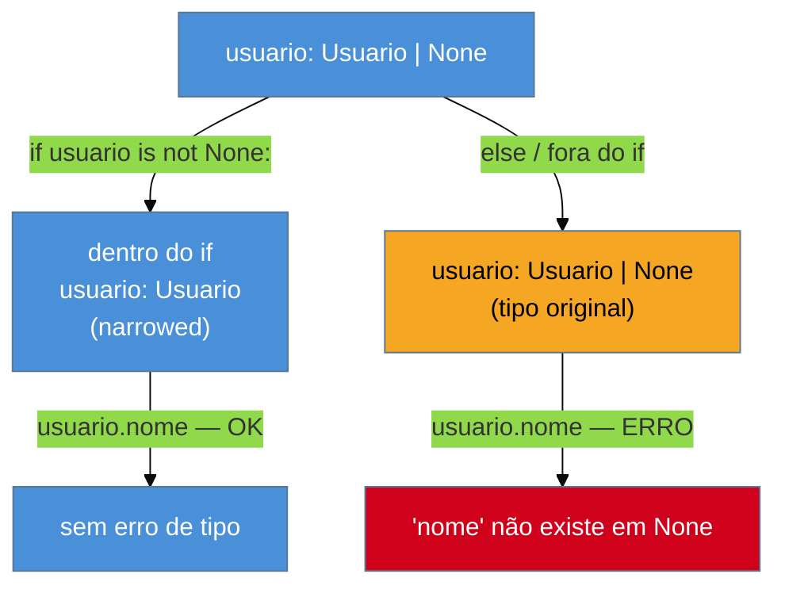

# Union, Optional e o operador `|`

> [!abstract] TL;DR
> `Optional[X]` não significa "esse parâmetro é opcional" — significa "esse valor pode ser `X` **ou** `None`". É só açúcar sintático para `Union[X, None]`, que por sua vez, desde a [PEP 604](https://peps.python.org/pep-0604/) (Python 3.10+), pode ser escrito de forma ainda mais direta como `X | None`. Um type checker (`mypy`, `pyright`) sabe **estreitar** (*narrow*) esse tipo dentro de um bloco `if x is not None:` — dentro do bloco, `x` deixa de ser `X | None` e passa a ser só `X`. A armadilha mais comum: funções Python sem `return` explícito devolvem `None` implicitamente, e isso silenciosamente quebra contratos de tipo que prometem sempre devolver algo. Quem vem de Java estranha a ausência do wrapper `Optional<T>`; quem vem de Kotlin reconhece o modelo — `X | None` é, na prática, o `X?` do Kotlin.

## O problema que motiva isso

Imagine que você está revisando uma função escrita por um colega:

```python
def buscar_usuario(id: int) -> Usuario:
    for u in usuarios:
        if u.id == id:
            return u
```

A assinatura promete: "dado um `id`, devolvo um `Usuario`". Sem exceção, sem ressalva. Só que, se nenhum usuário com aquele `id` existir, o `for` termina sem nunca executar o `return` — e a função, silenciosamente, devolve `None`. O type hint `-> Usuario` **mentiu**. Quem chama essa função e escreve `usuario.nome` sem checar nada vai, mais cedo ou mais tarde, disparar um `AttributeError: 'NoneType' object has no attribute 'nome'` em produção — o clássico "null pointer" do Python, só que sem o nome pomposo.

A pergunta que esta nota responde é: como o sistema de tipos do Python — que você já conhece pela [[01 - Type hints — fundamentos e gradual typing|nota anterior]] — expressa "esse valor pode não existir", e como fazer o type checker **forçar** você a lidar com essa possibilidade antes que ela vire um bug em produção?

## `Optional[X]` é `Union[X, None]`, nada mais

Antes de `Optional`, existe `Union`. `Union[A, B]` diz ao type checker: "este valor é do tipo `A` **ou** do tipo `B`, e eu não sei qual até rodar o código". É a forma de tipo que Python usa para modelar o que outras linguagens fariam com uma interface comum, um `enum` de variantes, ou um *sum type* (Rust, Haskell). Um exemplo direto:

```python
from typing import Union

def formatar_id(id: Union[int, str]) -> str:
    return str(id)
```

`id` pode chegar como `int` (`42`) ou como `str` (`"42"`) — a função aceita os dois, e o corpo tem que lidar com ambos os casos (aqui, `str()` já resolve os dois).

`Optional` é um caso particular e frequente de `Union`: "esse valor é do tipo `X`, **ou** é `None`". A [documentação oficial do módulo `typing`](https://docs.python.org/3/library/typing.html#typing.Optional) é explícita sobre isso: `Optional[X]` é equivalente a `Union[X, None]`. Não existe nenhuma semântica extra — `Optional` não cria um tipo novo, não embrulha o valor em nada, é literalmente reescrito para `Union[X, None]` internamente.

```python
from typing import Optional

def buscar_usuario(id: int) -> Optional[Usuario]:
    for u in usuarios:
        if u.id == id:
            return u
    return None
```

Agora a assinatura conta a verdade: "devolvo um `Usuario`, **ou** `None` se não achar". Quem chama essa função — e roda um type checker — é forçado a lidar com o caso `None` antes de acessar qualquer atributo do resultado. É esse contrato, verificado estaticamente, que fecha a lacuna do exemplo de abertura.

> [!question]- "Optional" não devia significar "parâmetro opcional, com valor default"?
> Essa é a confusão mais comum com o nome, e vale desfazer de uma vez. Em Python, um parâmetro com valor default é declarado assim: `def f(x: int = 0): ...` — e isso **não tem nada a ver** com `Optional`. Você pode ter um parâmetro obrigatório tipado como `Optional[int]` (aceita `int` ou `None`, mas tem que ser passado) e um parâmetro opcional tipado como `int` puro (tem default, mas nunca aceita `None`). São dois eixos ortogonais: "precisa ser passado?" (default) e "pode ser `None`?" (`Optional`). A [documentação oficial do `typing`](https://docs.python.org/3/library/typing.html#typing.Optional) chama atenção pra isso: `Optional[str]` não é o mesmo conceito que "argumento opcional com default" — o nome é historicamente infeliz, herdado de uma época em que a convenção informal era usar `None` como valor default de argumentos opcionais, e a PEP 484 emprestou o nome sem necessariamente amarrar os dois conceitos.

**`Optional[X]` em uma frase:** é `Union[X, None]` com um nome mais legível — nada mais, nada de "opcional" no sentido de "você pode não passar".

## PEP 604: a forma moderna, `X | None`

Por quase seis anos — desde a [PEP 484](https://peps.python.org/pep-0484/), que introduziu type hints no Python 3.5 (2015) — `Union[X, Y]` e `Optional[X]` foram a única forma de expressar uniões. Cada arquivo que usava tipagem precisava de um `from typing import Union, Optional` no topo, e assinaturas com várias alternativas ficavam visualmente pesadas: `Union[int, str, float, None]` para dizer "número (inteiro ou de ponto flutuante), texto, ou nada".

A partir do Python 3.10 (2021), a [PEP 604](https://peps.python.org/pep-0604/) — *"Allow writing union types as X | Y"* — permite sobrecarregar o operador `|` (bitwise-or) sobre tipos, para escrever uniões sem precisar importar `Union` nem `Optional` de `typing`. A equivalência é exata e documentada na própria PEP: `int | str == typing.Union[int, str]`. A mesma união de quatro alternativas do parágrafo anterior vira `int | float | str | None` — mais curta, sem import, e lida da esquerda pra direita como uma frase.

```python
# Antes (typing.Union / typing.Optional — ainda válido, mas verboso)
from typing import Union, Optional

def formatar_id(id: Union[int, str]) -> str: ...
def buscar_usuario(id: int) -> Optional[Usuario]: ...

# Depois (PEP 604 — Python 3.10+)
def formatar_id(id: int | str) -> str: ...
def buscar_usuario(id: int) -> Usuario | None: ...
```

Repare que `Optional[Usuario]` virou `Usuario | None` — não existe um `X | Optional` separado; `Optional` simplesmente deixou de ser necessário porque `| None` expressa a mesma coisa de forma literal. O guia de tipos comparados da comunidade resume bem essa transição: antes do 3.10, `Optional[str]` era o idioma padrão; a partir do 3.10, a recomendação é preferir `X | None` — mais conciso, mais legível, e sem precisar de um import extra.

A PEP também estende o `|` para funcionar dentro de `isinstance()` e `issubclass()`, algo que `Union` nunca permitiu:

```python
def normalizar(valor: int | str) -> str:
    if isinstance(valor, int | str):   # válido a partir do 3.10
        return str(valor)
    raise TypeError
```

(Na prática, a maioria do código continua escrevendo `isinstance(valor, (int, str))` com tupla — o suporte a `|` em `isinstance` existe, mas não substituiu a convenção antiga.)

> [!warning] Runtime `X | None` exige Python 3.10+; a string de anotação, não
> A sintaxe `X | None` como **objeto real em tempo de execução** (`types.UnionType`, o que `isinstance(valor, int | str)` precisa) só funciona a partir do CPython 3.10. Mas se o seu código só usa a anotação como *string* — o que já é o padrão em código moderno via `from __future__ import annotations`, que transforma toda anotação em string automaticamente e adia a avaliação — a sintaxe `X | None` funciona como *hint* mesmo em Python 3.7+, porque o interpretador nunca tenta avaliar `X | None` como expressão real, só guarda o texto. É por isso que times com um `mínimo suportado` mais antigo (3.8, 3.9) às vezes já usam `X | None` nas anotações, desde que tenham esse `__future__ import` no topo do arquivo — mas não podem usar `X | None` fora de anotação (ex.: `isinstance(x, int | None)`) sem o runtime 3.10+.

**PEP 604 em uma frase:** `X | Y` é `Union[X, Y]` (e `X | None` é `Optional[X]`) escritos com o operador `|` em vez de um genérico importado — mesma semântica, sintaxe mais enxuta, exigindo Python 3.10+ para uso em runtime.

## Narrowing: como o type checker "estreita" o tipo dentro de um `if`

Ter `Usuario | None` na assinatura resolve a honestidade do contrato, mas cria um problema novo: se o **tipo declarado** de uma variável é `Usuario | None`, como o type checker permite que você chame `usuario.nome` em algum lugar do código, já que `None` não tem atributo `nome`?

A resposta é **narrowing** (estreitamento de tipo): dentro de um bloco de código onde o type checker consegue *provar* estaticamente que um valor não pode ser `None` — por exemplo, dentro do corpo de um `if x is not None:` — ele passa a tratar `x` como se fosse só `Usuario`, não mais `Usuario | None`, só **para aquele bloco**.

```python
def cumprimentar(usuario: Usuario | None) -> str:
    if usuario is not None:
        # Aqui dentro, o type checker "sabe" que usuario: Usuario
        return f"Olá, {usuario.nome}!"
    return "Olá, visitante!"
```

Fora do `if`, ou no ramo `else`, `usuario` continua sendo `Usuario | None` do ponto de vista do checker. É um raciocínio puramente estático — o `mypy`/`pyright` não roda o código, só analisa o fluxo de controle e sabe que, para chegar dentro daquele `if`, a condição `usuario is not None` precisou ser verdadeira.



Narrowing não é exclusivo de `is not None`. Qualquer construção que o type checker reconheça como "prova de tipo" estreita — `isinstance(x, int)`, `assert x is not None`, `if not isinstance(x, str): return`, comparações de `Literal`, entre outras. Para uniões com mais de dois membros, o checker vai eliminando alternativas ramo a ramo:

```python
def processar(valor: int | str | None) -> str:
    if valor is None:
        return "vazio"
    if isinstance(valor, int):
        return str(valor * 2)   # aqui, valor: int
    return valor.upper()        # aqui, valor: str (únicas opções restantes)
```

Cada `if`/`return` antecipado elimina uma possibilidade da união para o restante da função — no último `return`, só sobra `str`, e o checker sabe disso sem você precisar de outro `isinstance`.

> [!question]- E se eu checar `is not None` numa variável, guardar numa outra variável, e usar essa segunda variável depois?
> O narrowing é amarrado à **variável específica** analisada no fluxo, não ao valor em abstrato. Se você fizer `if usuario is not None: outro = usuario`, `outro` herda o tipo estreitado (`Usuario`) no ponto da atribuição — mas se a checagem for sobre um atributo de objeto (`if obj.usuario is not None: ...`), muitos checkers **não** conseguem estreitar `obj.usuario` de forma confiável, porque entre a checagem e o uso outra thread (ou outro código) poderia ter mudado o atributo. Esse é um ponto onde `mypy` e `pyright` divergem em robustez — vale conferir na prática ao trocar de ferramenta (aprofundado na [[04 - mypy e pyright — checagem estática na prática|nota 04]]).

### Narrowing combinado com o operador *walrus* (`:=`)

Um padrão comum em código Python moderno é checar e nomear o resultado de uma busca na mesma linha, usando o operador de atribuição em expressão (`:=`, PEP 572, Python 3.8+):

```python
if (usuario := buscar_usuario(id)) is not None:
    print(usuario.nome)   # narrowing funciona igual: usuario é Usuario aqui
```

O type checker aplica o mesmo raciocínio de narrowing sobre o resultado do walrus: como a condição do `if` prova que `usuario` (o nome atribuído dentro do parêntese) não é `None`, o corpo do bloco trata `usuario` como `Usuario`. Esse padrão é preferível a chamar `buscar_usuario(id)` duas vezes (uma na condição, outra dentro do bloco) — além de mais conciso, evita o risco de a segunda chamada devolver um resultado diferente da primeira (por exemplo, se a função consulta um banco de dados que pode mudar entre as duas chamadas).

**Narrowing em uma frase:** dentro de um bloco onde o fluxo do código prova que `None` foi descartado, o type checker trata a variável como o tipo mais estreito que sobrou — sem exigir cast nem verificação em runtime além da que você já escreveu.

## A armadilha do `None` implícito

Toda função Python que "cai pro final" sem executar um `return` explícito devolve `None` — isso é semântica de linguagem, não coisa de tipagem:

```python
def talvez_loga(msg: str, verbose: bool) -> None:
    if verbose:
        print(msg)
    # sem return explícito aqui — a função devolve None de qualquer forma
```

Isso é inofensivo quando a assinatura já promete `-> None` (função que só produz efeito colateral, como a de cima). O problema aparece quando a assinatura promete um tipo **não-`None`** e algum caminho de execução esquece o `return`:

```python
def calcular_desconto(valor: float, cupom: str) -> float:
    if cupom == "PROMO10":
        return valor * 0.9
    if cupom == "PROMO20":
        return valor * 0.8
    # esqueceu o `else` — se cupom for qualquer outra coisa, cai aqui
    # e a função devolve None, mesmo prometendo -> float
```

> [!warning] mypy nem sempre pega isso automaticamente
> Segundo discussões abertas no próprio [issue tracker do mypy](https://github.com/python/mypy/issues/6687), o comportamento padrão é permissivo: mypy costuma emitir `error: Missing return statement` quando existe **algum** caminho de código que não termina em `return`/`raise` — o exemplo acima de fato dispara esse erro, porque o `if`/`if` não cobre todos os casos e o controle "cai pro fim" da função sem devolver nada. Mas há relatos de casos-limite (geradores, funções com `Optional` no tipo de retorno, blocos `try`/`finally` complexos) onde o checker não detecta a lacuna com a mesma confiabilidade. A lição prática: não trate "mypy não reclamou" como prova de que todos os caminhos retornam o tipo certo — cubra explicitamente o caso `else`, ou declare o retorno como `float | None` se `None` for de fato um resultado válido e não um esquecimento.

A correção mais honesta, quando `None` é de fato um resultado possível (cupom inválido não deveria estourar exceção, por exemplo), é declarar isso no tipo:

```python
def calcular_desconto(valor: float, cupom: str) -> float | None:
    if cupom == "PROMO10":
        return valor * 0.9
    if cupom == "PROMO20":
        return valor * 0.8
    return None  # explícito: cupom desconhecido não dá desconto
```

Agora o `None` deixou de ser um acidente de fluxo de controle e virou parte do contrato — e qualquer código que chama `calcular_desconto` é forçado, pelo type checker, a lidar com a possibilidade de `None` antes de usar o resultado numa conta.

**A armadilha em uma frase:** "cair pro fim de uma função" sempre devolve `None` em runtime, tipado ou não — a tipagem só ajuda se você declarar esse `None` explicitamente em vez de deixar o type checker (ou, pior, ninguém) descobrir depois.

## Casos práticos

### Cenário 1: campo opcional numa resposta de API

Um endpoint de e-commerce devolve o pedido de um cliente, mas o campo `cupom_aplicado` só existe se o cliente de fato usou um cupom:

```python
from dataclasses import dataclass

@dataclass
class Pedido:
    id: int
    total: float
    cupom_aplicado: str | None = None

def formatar_resumo(pedido: Pedido) -> str:
    base = f"Pedido #{pedido.id}: R$ {pedido.total:.2f}"
    if pedido.cupom_aplicado is not None:
        # narrowing: aqui dentro, pedido.cupom_aplicado é str, não str | None
        return f"{base} (cupom: {pedido.cupom_aplicado})"
    return base
```

O `str | None = None` no campo do dataclass diz duas coisas ao mesmo tempo: o tipo (`str` ou ausência) e o comportamento de instanciação (se ninguém passar `cupom_aplicado`, o default é `None`). É o padrão mais comum de "campo opcional" em APIs Python tipadas — o mesmo padrão que, na [[06 - Pydantic — validação em runtime|nota 06 sobre Pydantic]], ganha validação em runtime além da checagem estática.

### Cenário 2: `dict.get()` e a união implícita que ele sempre devolve

Um erro sutil e frequente: tratar o retorno de `dict.get()` como se fosse sempre o tipo do valor, esquecendo que a assinatura de `.get()` sem segundo argumento devolve `V | None`:

```python
config: dict[str, int] = {"timeout": 30, "retries": 3}

def carregar_timeout(config: dict[str, int]) -> int:
    timeout = config.get("timeout")  # tipo real: int | None, não int
    return timeout * 2  # ERRO de tipo: None não suporta multiplicação
```

O type checker aponta o erro porque `dict.get(chave)` — sem um segundo argumento de *default* — tem tipo de retorno `V | None` na própria assinatura da biblioteca padrão: se a chave não existir, `.get()` devolve `None` em vez de lançar `KeyError` (diferente de `config["timeout"]`, que lançaria exceção). A correção mais comum é dar um default explícito compatível com o tipo, ou fazer a checagem de `None` antes de operar:

```python
def carregar_timeout(config: dict[str, int]) -> int:
    timeout = config.get("timeout", 0)   # default int — tipo real vira só int
    return timeout * 2  # OK
```

Esse caso ilustra bem por que `Optional`/`X | None` não é um detalhe acadêmico: ele aparece silenciosamente em métodos comuníssimos da biblioteca padrão (`dict.get`, `re.match`, `os.environ.get`), e ignorar essa possibilidade é uma fonte real e recorrente de `AttributeError`/`TypeError` em produção.

### Cenário 3: `re.match` e o `Match | None` que todo mundo esquece de checar

`re.match()`/`re.search()` são outro exemplo clássico do mesmo padrão — a assinatura da biblioteca padrão devolve `re.Match[str] | None`, não `re.Match[str]`, porque nem toda tentativa de casamento de regex encontra algo:

```python
import re

def extrair_ano(texto: str) -> str:
    m = re.search(r"\d{4}", texto)
    return m.group()  # ERRO de tipo: m pode ser None aqui
```

```python
import re

def extrair_ano(texto: str) -> str | None:
    m = re.search(r"\d{4}", texto)
    if m is not None:
        return m.group()   # narrowing: m é re.Match[str] aqui dentro
    return None
```

O padrão se repete: qualquer API que "procura algo que pode não existir" — buscas em texto, buscas em coleções, buscas em banco — tende a expressar essa possibilidade como `X | None` no tipo de retorno, e o narrowing é o mecanismo que transforma essa possibilidade, verificada estaticamente, em código que o type checker aceita sem reclamar.

## Armadilhas comuns

> [!warning] Usar `None` como default mutável em vez de valor mutável direto
> `def f(items: list[str] = []):` parece inofensivo, mas o valor default de uma função em Python é avaliado **uma única vez**, na definição da função — não a cada chamada. Se o corpo modificar essa lista (`items.append(...)`), todas as chamadas subsequentes que não passarem `items` explicitamente vão **compartilhar** a mesma lista mutada, acumulando estado entre chamadas que deveriam ser independentes. O padrão correto usa `None` como sentinela e cria a lista dentro do corpo: `def f(items: list[str] | None = None): items = items if items is not None else []`. Aqui, `list[str] | None` não é só sobre nulidade — é o mecanismo que evita esse bug clássico de mutabilidade compartilhada, comum o bastante para ter um nome informal na comunidade Python ("mutable default argument trap").

> [!warning] `isinstance(x, int | str)` só funciona em runtime a partir do Python 3.10
> A PEP 604 estende o `|` para `isinstance`/`issubclass`, mas isso depende do objeto `types.UnionType` existir em runtime — só a partir do CPython 3.10. Em código que precisa rodar em 3.8/3.9 (mesmo usando `from __future__ import annotations` para anotações), a forma de `isinstance` continua sendo a tupla clássica: `isinstance(x, (int, str))`. Confundir os dois — usar `X | Y` dentro de `isinstance` num projeto que ainda suporta Python 3.9 — quebra em runtime com `TypeError: unsupported operand type(s) for |`, um erro que só aparece quando aquele trecho de código de fato executa, não na análise estática do type checker (que pode estar configurado para uma versão mais nova do Python do que a que roda em produção).

> [!warning] `X | None` como parâmetro sem default `= None` continua exigindo o argumento
> `def f(x: int | None):` não é o mesmo que `def f(x: int | None = None):`. A primeira forma **ainda exige** que a chamada passe algo para `x` — só que esse algo pode ser `None`. Quem espera que `Optional`/`| None` implique "e portanto tem default automático" se surpreende com `TypeError: f() missing 1 required positional argument: 'x'` ao tentar chamar `f()` sem argumentos. Nulidade de tipo e valor default continuam sendo dois mecanismos independentes, como já visto na primeira seção desta nota — vale reforçar porque esse é o erro mais comum de quem aprendeu a distinção em teoria mas ainda escreve o código no automático.

## Comparando com `Optional`/nullable de outras linguagens

Quem chega em Python vindo de linguagens estaticamente tipadas costuma trazer um modelo mental pronto para "valor que pode não existir". Vale comparar os três mais comuns:

| Linguagem | Mecanismo | Como se parece | Diferença-chave |
|---|---|---|---|
| **Python** | `X \| None` (`Optional[X]`) | Anotação de tipo pura — `None` é um valor comum da linguagem, o tipo só documenta que ele é possível | Não muda o runtime. Sem checker rodando, `X \| None` não impede nada — é só metadado (retomando o [[01 - Type hints — fundamentos e gradual typing|gradual typing]] da nota anterior) |
| **Java** | `Optional<T>` | Uma **classe wrapper** — você recebe um objeto `Optional`, chama `.isPresent()`/`.get()`/`.orElse()` pra extrair o valor | `Optional<T>` é um objeto de verdade em runtime, alocado na heap, com API própria. `T` continua podendo ser `null` diretamente (Java não impede isso) — `Optional` é uma convenção adotada em pontos específicos (principalmente retornos de método), não uma garantia do compilador |
| **Kotlin** | `T?` (tipo nullable) | Sufixo `?` no próprio tipo — `String?` é um tipo diferente de `String` para o compilador | O compilador Kotlin **recusa compilar** código que acessa um membro de `T?` sem checagem prévia (`?.`, `!!`, `if (x != null)`) — é enforcement em tempo de compilação, não só documentação |

Vale ver o mesmo problema — "buscar um usuário que pode não existir" — resolvido nas três linguagens lado a lado:

```python
# Python
def buscar_usuario(id: int) -> Usuario | None:
    ...

usuario = buscar_usuario(42)
if usuario is not None:
    print(usuario.nome)   # narrowing: usuario é Usuario aqui dentro
```

```java
// Java
public Optional<Usuario> buscarUsuario(int id) {
    ...
}

Optional<Usuario> usuario = buscarUsuario(42);
usuario.ifPresent(u -> System.out.println(u.getNome()));
// ou: usuario.map(Usuario::getNome).orElse("desconhecido");
```

```kotlin
// Kotlin
fun buscarUsuario(id: Int): Usuario? {
    ...
}

val usuario = buscarUsuario(42)
usuario?.let { println(it.nome) }
// ou: println(usuario?.nome ?: "desconhecido")
```

O Java precisa do `Optional` como **objeto intermediário** — `usuario` não é um `Usuario`, é um `Optional<Usuario>`, e só vira `Usuario` depois de `.get()`/`.map()`/`.ifPresent()`. Python e Kotlin não têm esse intermediário: `usuario` já É `Usuario | None`/`Usuario?` diretamente, e o "desembrulhar" acontece via checagem de fluxo (narrowing em Python, *smart cast* em Kotlin — mesmo mecanismo, nomes diferentes), não via chamada de método sobre um wrapper.

A comparação mais precisa, tecnicamente, é **Python `X | None` ↔ Kotlin `T?`**: os dois são o próprio tipo com uma anotação de nulidade embutida, sem wrapper, sem alocação extra, sem API de acesso. A diferença real entre eles não é de modelo, é de **enforcement**: o compilador Kotlin recusa compilar um `T?.membro` sem checagem — é impossível gerar o `.class` final sem lidar com o `null`. Já o Python só tem o type checker como guarda, e o type checker é **opcional e externo** ao runtime: nada impede alguém de rodar `python app.py` direto, ignorando qualquer erro que `mypy` teria acusado. É o mesmo tema de gradual typing da [[01 - Type hints — fundamentos e gradual typing|nota anterior]], agora aplicado especificamente ao caso de nulidade.

`Optional<T>` do Java é o mais diferente estruturalmente dos três: por ser uma classe (não um modificador de tipo), ele custa uma alocação de objeto por uso, tem uma API rica (`.map()`, `.flatMap()`, `.orElseThrow()`) que Python não replica diretamente sobre `X | None`, e — ironia notada com frequência pela comunidade Java — não impede `null` de aparecer em qualquer outro lugar do código; ele só formaliza a intenção em certos pontos de API, tipicamente valores de retorno. Guias de migração de Java para Kotlin descrevem essa transição como trocar "meta-tipo em cima do tipo" (Java, com `Optional<T>` por fora) por "informação dentro do próprio tipo" (Kotlin, com `T?`) — e é exatamente essa segunda forma que Python adotou com `X | None`.

> [!question]- Então por que Java não simplesmente adotou algo como `T?`?
> Porque `null` em Java é parte do sistema de tipos original desde 1995, presente em toda referência de objeto (`String`, `List<T>`, qualquer classe) — remover essa possibilidade exigiria mudar a linguagem de forma incompatível com décadas de código existente. `Optional<T>` foi introduzido no Java 8 (2014) como uma **convenção de biblioteca**, não uma mudança na linguagem: é só uma classe genérica comum, sem tratamento especial do compilador. Kotlin, sendo uma linguagem nova (2011) desenhada para interoperar com Java mas sem herdar suas decisões antigas, pôde colocar a nulidade **no próprio sistema de tipos** desde o design inicial. Python está numa posição parecida à do Java nesse ponto: `None` sempre foi um valor normal de qualquer tipo, e a tipagem estática via `typing` foi adicionada depois, por cima, como uma camada opcional — por isso `X | None` também é "convenção verificada por ferramenta externa", igual ao `Optional<T>` do Java, e não "regra do próprio compilador", como o `T?` do Kotlin.

## Fundamento teórico: `Union` é um tipo soma

Para quem gosta de amarrar o conceito à teoria de tipos, vale nomear o que `Union` realmente é: um **tipo soma** (*sum type*, também chamado de *tagged union* ou *variante* em linguagens como Haskell, Rust ou OCaml). A distinção formal é:

- Um **tipo produto** (como uma classe/`dataclass` comum, ou uma tupla) representa "isto **e** aquilo, ao mesmo tempo" — uma `Pessoa` tem `nome` **e** `idade` **e** `email`. O número de valores possíveis é o **produto** cartesiano dos tipos de cada campo.
- Um **tipo soma** representa "isto **ou** aquilo, nunca os dois ao mesmo tempo" — `int | str` é um `int` **ou** um `str`, nunca as duas coisas na mesma variável. O número de valores possíveis é a **soma** dos valores possíveis de cada alternativa.

`Optional[X]` é o tipo soma mais simples e mais comum: `X` **ou** o caso degenerado de "só existe um valor possível, chamado `None`" (formalmente, `None` tem o tipo `NoneType`, que só tem um habitante). Linguagens funcionais tornam isso explícito com construtores nomeados — o equivalente Haskell de `Optional[X]` é `Maybe X = Just X | Nothing`; o do Rust é `Option<T> = Some(T) | None`. Python não tem construtores nomeados para os casos de um `Union` (não existe `Just(x)` — o valor `X` "é" `X` diretamente, sem embrulho), o que é mais ergonômico para o caso simples de nulidade, mas menos expressivo quando a união tem mais de duas alternativas que precisam de dados associados diferentes — aí entram `TypedDict`/`Literal`/classes de dados discriminadas, retomadas na [[05 - TypedDict, Literal, NewType e Final|nota 05]].

O narrowing que vimos na seção anterior é, sob esse ângulo, o type checker fazendo **pattern matching implícito** sobre um tipo soma: cada `if isinstance(...)`/`if x is not None` é uma forma de "desconstruir" a união e provar, num ramo do código, qual das alternativas está de fato presente — o mesmo papel que um `match`/`case` (PEP 634, Python 3.10+) faz de forma mais explícita e exaustiva para uniões com muitas alternativas.

Vale notar uma limitação real de Python frente a linguagens com tipos soma nativos e *pattern matching exaustivo*: o compilador de Rust ou Haskell recusa compilar um `match` que não cobre todos os construtores de um tipo soma — se você adicionar uma variante nova ao `enum`/`data` mais tarde, todo `match` desatualizado vira erro de compilação, te forçando a atualizá-lo. `mypy`/`pyright` conseguem sinalizar isso também para `Union`s fechados (checagem de exaustividade via `assert_never`), mas é um recurso opt-in, não o comportamento padrão — outro exemplo do mesmo tema recorrente desta nota: em Python, o rigor de tipos existe, mas é sempre uma camada que você escolhe ativar, nunca um bloqueio automático do runtime. Quem quiser a fundamentação formal completa de tipos soma, produto e exaustividade encontra em [[03-Dominios/Ciência/Paradigmas/10 - Tipos algébricos, pattern matching e erros sem exceção|Tipos algébricos, pattern matching e erros sem exceção]], no domínio de Paradigmas.

## Em entrevista

Duas perguntas aparecem com frequência quando o tema é `Optional`/`Union` em entrevistas de Python para vagas sênior:

**"Qual a diferença entre `Optional[X]` e um parâmetro com valor default `None`?"** — a resposta que diferencia júnior de sênior aponta os dois eixos ortogonais: `Optional[X]` é sobre o **tipo** do valor (pode ser `X` ou `None`); ter um valor default (`= None`) é sobre se o **argumento precisa ser passado** na chamada. Um erro comum e concreto: escrever `def f(x: str = None)` — isso tipa `x` como `str`, mas o default é `None`, o que é uma inconsistência de tipo que o `mypy` sinaliza (`Incompatible default for argument "x"`). O jeito correto é `def f(x: str | None = None)`.

**"O que é narrowing de tipo, e por que ele importa?"** — a resposta madura conecta narrowing ao propósito de fundo de checagem estática: sem narrowing, todo `Optional`/`Union` obrigaria a fazer *type: ignore* ou casts manuais toda vez que o valor fosse acessado depois de uma checagem óbvia — o narrowing é o que torna código com `X | None` prático de escrever sem ruído, porque o checker "acompanha" o raciocínio condicional que você já escreveu no código, em vez de exigir anotações redundantes.

**"Se `def f() -> Usuario:` roda sem erro nenhum e devolve `None` num caso de borda, o `mypy` não deveria ter pego isso?"** — a resposta honesta e tecnicamente correta é "depende do caminho de execução": se **todo** ramo do corpo termina sem `return` de um valor compatível, o `mypy` costuma emitir `error: Missing return statement`. Mas casos de borda (loops que teoricamente sempre executam pelo menos uma iteração aos olhos do checker, blocos `try`/`except` complexos, chamadas para funções que o checker não consegue provar que sempre lançam exceção) escapam dessa checagem com uma frequência real, documentada em issues abertas do próprio projeto `mypy`. A resposta sênior demonstra que checagem estática **reduz** a chance de bug, não a **elimina** — e que declarar `None` explicitamente no tipo de retorno, sempre que ele for de fato possível, é mais robusto do que confiar cegamente na cobertura do checker.

> [!question]- E se o entrevistador perguntar sobre a comparação com Java/Kotlin?
> Vale ser preciso sobre o eixo que realmente diferencia as três linguagens: não é "tem ou não tem conceito de nulidade tipada" (as três têm, de formas diferentes), é **onde mora o enforcement**. Kotlin recusa compilar; Java formaliza via convenção de biblioteca sem forçar nada; Python formaliza via anotação verificada por uma ferramenta externa e opcional (`mypy`/`pyright`), que não bloqueia a execução do programa se ninguém rodar o checker. Mencionar esse ponto — "gradual typing, enforcement é opt-in" — sinaliza entendimento de arquitetura de tipos, não só sintaxe decorada.

## How to explain in English

| PT-BR | English |
|---|---|
| tipo união | union type |
| açúcar sintático | syntactic sugar |
| estreitamento de tipo | type narrowing |
| tipo anulável | nullable type |
| valor de retorno implícito | implicit return value |
| checagem estática | static type checking |
| verificação em runtime | runtime check |
| operador elvis (Kotlin) | elvis operator |

**Ready-made sentence for interviews:**

> "`Optional[X]` in Python is just syntactic sugar for `Union[X, None]` — since Python 3.10, the idiomatic way to write it is `X | None`, per PEP 604. What makes it useful in practice is type narrowing: once you check `if x is not None:`, the type checker treats `x` as the non-None type for the rest of that block, so you don't need redundant casts. Unlike Kotlin, where the compiler refuses to compile code that dereferences a nullable type without a check, Python's enforcement is entirely opt-in — `mypy` or `pyright` catch it statically, but nothing stops the program from running and hitting an `AttributeError` on `None` at runtime if nobody ran the checker."

## O que vem a seguir

Com `Union`/`Optional`/`|` e narrowing resolvidos, o próximo passo natural é tipar estruturas que carregam **mais de um tipo de valor internamente** — não uma variável que é "isto ou aquilo", mas uma classe ou função genérica que opera sobre um tipo qualquer definido por quem a usa. É esse o assunto da próxima nota.

- [[03 - Generics — TypeVar, Generic e sintaxe moderna|03 — Generics: `TypeVar`, `Generic` e sintaxe moderna]] — como parametrizar uma classe ou função sobre um tipo `T`, sequência natural depois de dominar uniões simples.
- [[04 - mypy e pyright — checagem estática na prática|04 — `mypy` e `pyright`: checagem estática na prática]] — aprofunda como cada ferramenta lida com narrowing em casos mais complexos (atributos, closures, `assert`).
- [[01 - Type hints — fundamentos e gradual typing|01 — Type hints: fundamentos e gradual typing]] — pré-requisito desta nota, caso ainda não lido.

## Fontes

- Documentação oficial — módulo `typing`, `Optional`: https://docs.python.org/3/library/typing.html#typing.Optional
- PEP 604 — *Allow writing union types as X | Y*: https://peps.python.org/pep-0604/
- PEP 484 — *Type Hints* (origem de `Optional`/`Union`): https://peps.python.org/pep-0484/
- mypy — *Type hints cheat sheet*: https://mypy.readthedocs.io/en/stable/cheat_sheet_py3.html
- mypy issue tracker — *Implicit None return value is not type checked* (#6687): https://github.com/python/mypy/issues/6687
- python-type-hints.com — *Union and Optional Types Guide*: https://python-type-hints.com/core-type-hints-fundamentals/union-and-optional-types/
- Mouse Vs Python — *Python 3.10: Simplifies Unions in Type Annotations*: https://www.blog.pythonlibrary.org/2021/09/11/python-3-10-simplifies-unions-in-type-annotations/
- Dave Leeds on Kotlin — *Java Optionals and Kotlin Nulls*: https://typealias.com/guides/java-optionals-and-kotlin-nulls/
- Fatih Coşkun (Medium) — *Kotlin Nullable Types vs. Java Optional*: https://medium.com/@fatihcoskun/kotlin-nullable-types-vs-java-optional-988c50853692

Consultado em 2026-07-10.
