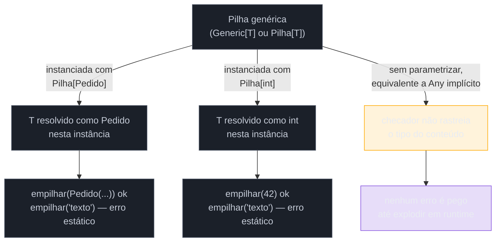
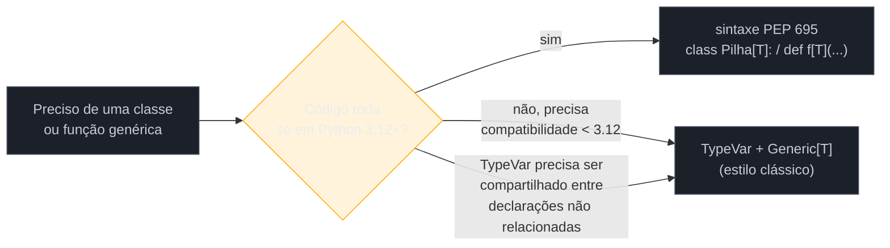

# Generics — TypeVar, Generic e sintaxe moderna

> [!abstract] TL;DR
> Generics resolvem um problema específico: como escrever uma função ou classe que funciona com **qualquer tipo**, sem jogar fora a checagem estática que faria isso valer a pena — a alternativa ingênua, `Any`, reusa o código mas desliga o checador de tipos por completo. `TypeVar` cria uma variável de tipo que amarra entrada e saída (`def primeiro(itens: list[T]) -> T`), e `Generic[T]` faz o mesmo para classes (`class Pilha(Generic[T])`). Desde a **PEP 585** (Python 3.9), os próprios builtins (`list`, `dict`, `tuple`, `set`) aceitam parametrização direta — `list[int]` em vez de `typing.List[int]`, que está formalmente depreciado (sem prazo de remoção definido). Desde a **PEP 695** (Python 3.12), existe uma sintaxe nova embutida na linguagem — `class Pilha[T]:` e `def f[T](x: T) -> T:` — que elimina o `TypeVar` explícito e o import de `Generic` para os casos comuns, com escopo léxico automático e variância inferida pelo checador. `TypeVar` continua existindo (inclusive é o que a sintaxe nova gera por baixo) e ainda é necessário para casos com `bound` complexo compartilhado entre múltiplas declarações ou em código que precisa rodar em versões anteriores a 3.12. Dois refinamentos importantes: `bound=X` restringe o tipo a `X` ou subtipos dele (polimorfismo com hierarquia); `TypeVar("T", int, str)` restringe a um conjunto fechado e específico de tipos (sem subtipos aceitos fora da lista).

## O problema que generics resolvem

Imagine que você está escrevendo uma estrutura de dados simples — uma pilha (`Pilha`, ou `Stack`) — para reusar em vários lugares do sistema: uma pilha de `int` para um parser de expressões, uma pilha de `Pedido` para um fluxo de undo, uma pilha de `str` para uma pilha de navegação de breadcrumbs. Você não quer escrever três classes quase idênticas — `PilhaDeInt`, `PilhaDePedido`, `PilhaDeStr` — só porque o tipo do conteúdo muda. A solução óbvia é escrever a lógica **uma vez** e deixar o tipo do conteúdo como parâmetro:

```python
class Pilha:
    def __init__(self):
        self._itens = []

    def empilhar(self, item):
        self._itens.append(item)

    def desempilhar(self):
        return self._itens.pop()
```

Isso funciona em runtime para qualquer tipo — Python nunca exigiu declarar o tipo do conteúdo de uma lista. Mas assim que você tenta usar essa `Pilha` num código maior, um problema aparece silenciosamente:

```python
pilha_de_pedidos: Pilha = Pilha()
pilha_de_pedidos.empilhar(Pedido(id=1))
pilha_de_pedidos.empilhar("oops, um texto por engano")   # nenhum erro aqui

pedido = pilha_de_pedidos.desempilhar()
pedido.aprovar()   # AttributeError em runtime, se "oops..." for desempilhado primeiro
```

Nada no código acima é sinalizado como suspeito por um checador estático (`mypy`, `pyright`) — porque `desempilhar()` devolve o quê? A assinatura não diz. Sem uma anotação melhor, o tipo de retorno é implicitamente `Any` (ou, na melhor das hipóteses, o tipo da lista genérica sem parametrização), e `Any` é um buraco negro de checagem: qualquer operação sobre um valor `Any` é aceita silenciosamente, mesmo que essa operação não exista naquele tipo em runtime. É exatamente esse buraco que faz o bug do exemplo acima escapar da checagem estática e só explodir em produção.

> [!question]- Por que não simplesmente anotar `desempilhar(self) -> Pedido`?
> Porque isso quebra o reuso que motivou a `Pilha` genérica em primeiro lugar — a classe voltaria a estar amarrada a um único tipo (`Pedido`), e a pilha de `int` do parser, ou a pilha de `str` dos breadcrumbs, precisariam de outra classe (ou de `Any`/`object`, que reintroduz o mesmo buraco de checagem). O problema real não é "que tipo essa pilha guarda" — é "como declarar que **o tipo que entra é o mesmo tipo que sai**, seja lá qual for, sem fixar esse tipo de antemão". É exatamente essa amarração — "mesmo tipo em pontos diferentes da assinatura, resolvido caso a caso" — que uma variável de tipo genérica resolve.

Generics existem para fechar essa lacuna: permitir que uma classe ou função seja escrita **uma vez**, reusável para qualquer tipo, mas ainda assim preservando o vínculo entre "o tipo que entra" e "o tipo que sai" — de forma que o checador estático consiga rastrear esse vínculo e sinalizar o `AttributeError` do exemplo acima **antes** de rodar, não depois. `Any` reusa o código mas descarta esse vínculo por completo; generics reusam o código **e** preservam o vínculo. Essa é a diferença que justifica a engenharia extra de aprender `TypeVar`/`Generic`.

## `TypeVar`: uma variável para o tipo, não para o valor

O mecanismo central, desde a [PEP 484](https://peps.python.org/pep-0484/#user-defined-generic-types) (2014), é `typing.TypeVar` — um objeto que representa "algum tipo específico, a ser determinado no ponto de uso", análogo a como uma variável comum representa "algum valor específico, a ser determinado em runtime". A analogia vale a pena esticar: assim como `x = 5` não significa "x é literalmente o símbolo x", `T = TypeVar("T")` não cria um tipo chamado `T` — cria um **placeholder** que o checador de tipos substitui, a cada chamada, pelo tipo concreto inferido daquele uso específico.

```python
from typing import TypeVar

T = TypeVar("T")

def primeiro(itens: list[T]) -> T:
    return itens[0]

primeiro([1, 2, 3])          # T é inferido como int; retorno: int
primeiro(["a", "b", "c"])    # T é inferido como str; retorno: str
primeiro([Pedido(1), Pedido(2)])   # T é inferido como Pedido; retorno: Pedido
```

O ponto crucial: **as duas ocorrências de `T` na assinatura de `primeiro` amarram o mesmo tipo**. O checador sabe que "o tipo do elemento dentro da lista" e "o tipo do valor retornado" são, necessariamente, o mesmo `T` — não dois tipos quaisquer compatíveis com `Any`. Isso permite que o checador detecte, estaticamente, um uso incorreto do valor de retorno:

```python
resultado = primeiro([1, 2, 3])
resultado.upper()   # mypy: error — "int" has no attribute "upper"
```

Sem `TypeVar`, a assinatura mais honesta que se poderia escrever sem generics seria `def primeiro(itens: list[Any]) -> Any`, e essa chamada a `.upper()` sobre um `int` passaria batido pelo checador — o mesmo buraco negro do exemplo da `Pilha`.

> [!question]- `T` é uma convenção de nome, ou o Python exige exatamente essa letra?
> É convenção — herdada de linguagens como Java e C#, onde `T` significa "Type" por costume, e letras seguintes (`U`, `V`, `K`, `S`) aparecem quando mais de uma variável de tipo é necessária na mesma assinatura. O primeiro argumento de `TypeVar(...)` é uma **string** com o nome, e o Python não valida que ela bata com o nome da variável Python — mas a convenção universal (reforçada pela [documentação oficial do módulo `typing`](https://docs.python.org/3/library/typing.html#typing.TypeVar)) é manter os dois idênticos: `T = TypeVar("T")`, nunca `T = TypeVar("Elemento")`. Fugir dessa convenção não quebra nada tecnicamente, mas confunde qualquer ferramenta ou colega que espera o padrão.

## `Generic[T]`: o mesmo mecanismo aplicado a classes

`TypeVar` sozinho resolve funções genéricas. Para uma **classe** genérica — como a `Pilha` do exemplo de abertura — o mecanismo clássico (pré-3.12) é herdar de `typing.Generic`, parametrizado pela mesma `TypeVar`:

```python
from typing import Generic, TypeVar

T = TypeVar("T")

class Pilha(Generic[T]):
    def __init__(self) -> None:
        self._itens: list[T] = []

    def empilhar(self, item: T) -> None:
        self._itens.append(item)

    def desempilhar(self) -> T:
        return self._itens.pop()

    def esta_vazia(self) -> bool:
        return not self._itens
```

Agora o checador consegue rastrear o tipo do conteúdo por instância, porque cada `Pilha[X]` concreta "fixa" `T` como `X` no momento da instanciação (implícita, por inferência, ou explícita):

```python
pilha_de_pedidos: Pilha[Pedido] = Pilha()
pilha_de_pedidos.empilhar(Pedido(id=1))
pilha_de_pedidos.empilhar("oops")   # mypy: error — Argument has incompatible type "str"; expected "Pedido"

pedido = pilha_de_pedidos.desempilhar()   # tipo inferido: Pedido
pedido.aprovar()   # ok — checador sabe que "pedido" é Pedido, não Any
```

É exatamente o `AttributeError` do exemplo de abertura, agora pego **estaticamente**, antes de o código rodar — o ganho concreto que justifica a engenharia extra de `Generic[T]` sobre uma classe "crua" sem tipagem.



Repare que `Pilha[Pedido]` não cria uma classe nova em runtime — é a mesma classe `Pilha`, com metadados extras (uma `_GenericAlias`) que o checador estático consulta. Em runtime, `Pilha[Pedido]().empilhar("texto")` **não** levanta exceção nenhuma — type hints, como visto em [[01 - Type hints — fundamentos e gradual typing|01 — Type hints: fundamentos e gradual typing]], não mudam o comportamento do interpretador. O ganho é inteiramente do checador estático para trás (`mypy`/`pyright`, cobertos na [[04 - mypy e pyright — checagem estática na prática|nota 04]] deste galho) — a checagem acontece **antes** de rodar, não durante.

> [!warning] `Generic[T]` não substitui herança múltipla comum — ela se combina com ela
> Uma classe pode herdar de `Generic[T]` **e** de outras classes normais ao mesmo tempo — `class RepositorioDePedidos(Generic[T], RepositorioBase):` é válido, e a ordem entre `Generic[T]` e as outras bases não muda a semântica de tipo (embora afete a MRO, como qualquer herança múltipla em Python). O erro comum é achar que `Generic[T]` "consome" o slot de herança e força a classe a não ter mais nenhuma outra base — não é o caso.

**Generics em uma frase:** uma variável de tipo (`TypeVar`) amarra "o tipo que entra" e "o tipo que sai" numa mesma assinatura ou classe, permitindo reusar código para qualquer tipo sem abrir mão da checagem estática que `Any` descartaria.

## PEP 585: generics nos próprios builtins

Antes da [PEP 585](https://peps.python.org/pep-0585/) (implementada no **Python 3.9**, 2020), os tipos embutidos do Python — `list`, `dict`, `tuple`, `set`, `frozenset`, `type` — não suportavam parametrização em runtime: escrever `list[int]` levantava `TypeError: 'type' object is not subscriptable` em versões anteriores a 3.9, porque `list.__class_getitem__` simplesmente não existia. Por isso, o módulo `typing` mantinha uma hierarquia paralela inteira de aliases genéricos — `typing.List`, `typing.Dict`, `typing.Tuple`, `typing.Set`, `typing.Type` — cuja única razão de existir era servir de "casca" parametrizável em cima dos builtins não-parametrizáveis:

```python
# Estilo pré-3.9 (ainda funciona, mas depreciado)
from typing import List, Dict, Tuple

def processar(nomes: List[str], contagens: Dict[str, int]) -> Tuple[int, ...]:
    ...
```

A PEP 585 elimina a necessidade dessa hierarquia paralela ao dar aos próprios builtins a capacidade de aceitar parametrização diretamente, via `__class_getitem__`:

```python
# Estilo 3.9+ — sem import de typing para isso
def processar(nomes: list[str], contagens: dict[str, int]) -> tuple[int, ...]:
    ...
```

Segundo a [documentação oficial do `typing`](https://docs.python.org/3/library/typing.html#deprecated-aliases), os aliases genéricos do módulo `typing` que correspondem a builtins — `List`, `Dict`, `Tuple`, `Set`, `FrozenSet`, `Type`, e também variantes de `collections`/`collections.abc` como `typing.Deque`, `typing.DefaultDict` — estão formalmente **depreciados** desde essa mudança: o guia de estilo recomenda usar a forma builtin (`list`, `dict[str, int]`, `collections.abc.Sequence`) em código novo, e ferramentas de lint como o [Ruff sinalizam esse uso via a regra `UP006`](https://docs.astral.sh/ruff/rules/non-pep585-annotation/).

> [!question]- "Depreciado" aqui significa que `typing.List` vai parar de funcionar em algum momento?
> Não necessariamente — e essa é uma nuance que vale saber para não espalhar pânico infundado em code review. A PEP 585, no texto original, chegou a propor uma data de remoção ("a funcionalidade depreciada será removida na primeira versão lançada 5 anos após o Python 3.9.0"), mas essa remoção **nunca foi confirmada como plano ativo** — discussões subsequentes na comunidade (ver a [thread "Concern about PEP 585 removals" no fórum oficial](https://discuss.python.org/t/concern-about-pep-585-removals/15901)) e a própria documentação atual tratam `typing.List`/`typing.Dict` como depreciados **sem prazo de remoção definido**. Na prática: continuam funcionando em qualquer versão atual do Python, checadores estáticos apenas recomendam migrar, e não há `DeprecationWarning` emitido em runtime (a documentação é explícita sobre isso, justamente para não gerar ruído em bases de código legadas que ainda não migraram). Ainda assim, código novo deveria usar a forma builtin — é mais curta, não exige import extra, e é o padrão que qualquer time formado depois de 2020 já espera ver.

```python
# collections.abc também ganhou parametrização direta com a PEP 585
from collections.abc import Sequence, Mapping, Iterable

def somar_valores(dados: Mapping[str, int]) -> int:
    return sum(dados.values())

def achatar(listas: Iterable[list[int]]) -> list[int]:
    resultado: list[int] = []
    for lista in listas:
        resultado.extend(lista)
    return resultado
```

**PEP 585 em uma frase:** desde o Python 3.9, os builtins e os tipos de `collections.abc` aceitam parametrização direta (`list[int]`, `dict[str, int]`), tornando os aliases paralelos de `typing` (`List`, `Dict`, `Tuple`...) desnecessários e formalmente depreciados — sem prazo de remoção confirmado.

## PEP 695: sintaxe nova de parâmetros de tipo (Python 3.12+)

A [PEP 695](https://peps.python.org/pep-0695/), implementada no **Python 3.12** (outubro de 2023), ataca um problema diferente: mesmo com a PEP 585 simplificando os *tipos parametrizados*, declarar um `TypeVar` continuava exigindo cerimônia — um import, uma atribuição de módulo (`T = TypeVar("T")`), e o fato incômodo de que essa `TypeVar` vivia como uma variável **de módulo**, sem escopo claramente amarrado à classe ou função que a usava (duas classes genéricas não relacionadas no mesmo arquivo podiam, por engano, compartilhar ou colidir num `T` mal nomeado).

A PEP 695 introduz uma sintaxe embutida na própria gramática da linguagem — colchetes logo após o nome da classe ou função — que elimina o `TypeVar` explícito e o `Generic[T]` para os casos comuns:

```python
# Estilo clássico (TypeVar + Generic) — ainda válido, funciona em qualquer versão
from typing import Generic, TypeVar

T = TypeVar("T")

class Pilha(Generic[T]):
    def empilhar(self, item: T) -> None: ...
    def desempilhar(self) -> T: ...

def primeiro(itens: list[T]) -> T: ...
```

```python
# Estilo PEP 695 (Python 3.12+) — sem import de typing para isso
class Pilha[T]:
    def empilhar(self, item: T) -> None: ...
    def desempilhar(self) -> T: ...

def primeiro[T](itens: list[T]) -> T: ...
```

As duas formas são **semanticamente equivalentes** para o checador estático — a sintaxe nova não é um recurso paralelo com regras próprias, é açúcar sintático que, por baixo, ainda gera algo equivalente a um `TypeVar` (agora implícito e escopado automaticamente, sem precisar de nome de módulo nem import). A [PEP explicitamente documenta duas mudanças de comportamento](https://peps.python.org/pep-0695/), além da economia de digitação:

- **Escopo léxico automático**: o `T` declarado em `class Pilha[T]:` existe **só** dentro daquela classe (e de seus métodos) — diferente do `TypeVar` clássico, que é uma variável de módulo, visível (e potencialmente reusável por engano) em qualquer outro lugar do arquivo.
- **Variância inferida, não declarada**: o estilo clássico exige declarar variância explicitamente (`TypeVar("T_co", covariant=True)`) quando relevante; na sintaxe nova, o checador estático **infere** se o parâmetro de tipo é invariante, covariante ou contravariante a partir de como ele é usado dentro da classe — um detalhe que fica além do escopo desta nota introdutória, mas que elimina uma fonte comum de erro de configuração manual.

> [!warning] As duas sintaxes não devem ser misturadas na mesma declaração
> A própria PEP 695 é explícita: "`TypeVar`s, `TypeVarTuple`s e `ParamSpec`s tradicionais são mantidos por compatibilidade retroativa, mas não devem ser combinados com parâmetros de tipo alocados pela sintaxe nova" dentro da mesma classe ou função. Ou seja: `class Pilha[T](Generic[U]):`, misturando a sintaxe nova com um `TypeVar` clássico `U` na mesma declaração, é o tipo de código que confunde tanto o leitor quanto o checador — escolha uma sintaxe por declaração, não combine as duas.

Vale a pena marcar com clareza o que a nota da spec deste galho já adiantou: **para código que roda em Python 3.12+, a sintaxe PEP 695 é hoje a forma recomendada** para os casos comuns de generics simples — é mais curta, escopada corretamente por padrão, e infere variância sem configuração manual. O `TypeVar` explícito com `Generic[T]` continua sendo necessário em três situações concretas: (1) bibliotecas que precisam rodar em versões anteriores a 3.12 (a maior parte do ecossistema Python em produção hoje, dado que 3.12 é recente); (2) casos onde o mesmo `TypeVar` precisa ser **compartilhado** entre múltiplas declarações independentes — uma função livre e uma classe não relacionada, por exemplo, que precisam amarrar o mesmo tipo entre si; (3) usos avançados de `ParamSpec`/`TypeVarTuple` combinados com padrões que a sintaxe nova ainda não cobre completamente em todas as ferramentas (cobertura de `mypy`/`pyright` para PEP 695 amadureceu ao longo de 2023-2024, mas bases de código que precisam de compatibilidade ampla ainda preferem o estilo clássico por segurança).



**PEP 695 em uma frase:** a partir do Python 3.12, `class Pilha[T]:` e `def f[T](x: T) -> T:` substituem `TypeVar` + `Generic[T]` explícitos para os casos comuns, com escopo automático e variância inferida — mas o estilo clássico continua válido e necessário para compatibilidade com versões anteriores.

## Bound vs. constrained: dois jeitos de restringir o tipo

Um `TypeVar` sem restrições (`T = TypeVar("T")`) aceita **qualquer** tipo — o checador não sabe nada sobre `T` além de "é algum tipo, o mesmo em todos os pontos amarrados". Isso é suficiente para a `Pilha` do exemplo de abertura, porque uma pilha genuinamente não precisa saber nada sobre o tipo do conteúdo além de guardá-lo e devolvê-lo. Mas muitas funções genéricas **precisam** de alguma garantia sobre o tipo — por exemplo, uma função que ordena uma lista precisa que os elementos sejam comparáveis entre si (`__lt__` definido), não apenas "algum tipo qualquer". `TypeVar` oferece dois mecanismos distintos para expressar esse tipo de restrição, e confundir os dois é um erro comum.

### `bound`: um teto na hierarquia de tipos

`TypeVar("T", bound=X)` diz: "`T` pode ser `X` **ou qualquer subtipo de `X`**" — uma restrição por hierarquia, como um teto de herança.

```python
from typing import Protocol, TypeVar

class Comparavel(Protocol):
    def __lt__(self, outro: "Comparavel") -> bool: ...

TComparavel = TypeVar("TComparavel", bound=Comparavel)

def maior_valor(itens: list[TComparavel]) -> TComparavel:
    maior = itens[0]
    for item in itens[1:]:
        if maior < item:
            maior = item
    return maior
```

Aqui, `TComparavel` pode ser resolvido como `int`, `str`, `Pedido` (se `Pedido` implementar `__lt__`) — qualquer tipo que satisfaça o protocolo `Comparavel`, incluindo subtipos dele. Sem `bound`, o checador rejeitaria `maior < item` dentro da função, porque um `T` totalmente livre não tem garantia nenhuma de suportar `<`.

> Sobre o `Protocol` usado no exemplo acima — a forma idiomática de expressar "qualquer tipo que tenha este método", sem exigir herança explícita — ver [[03-Dominios/Tecnologia/Python/OO e Data Model/06 - ABC e Protocol — tipagem estrutural|OO e Data Model/06 — ABC e Protocol]], que já cobriu esse mecanismo em profundidade; esta nota não repete aquele conteúdo, só o reusa como `bound`.

### Constrained: um conjunto fechado, sem subtipos aceitos

`TypeVar("T", tipo1, tipo2, ...)` — passando os tipos como argumentos posicionais, não via `bound=` — diz algo mais restrito: "`T` só pode ser **exatamente** um destes tipos listados, nenhum outro, nem mesmo um subtipo deles".

```python
from typing import TypeVar

TNumerico = TypeVar("TNumerico", int, float)

def dobrar(valor: TNumerico) -> TNumerico:
    return valor * 2

dobrar(21)      # ok — TNumerico resolvido como int
dobrar(21.5)    # ok — TNumerico resolvido como float
dobrar(True)    # tecnicamente aceito (bool é subtipo de int em Python),
                # mas o checador resolve TNumerico como int, não bool
```

A diferença entre os dois fica clara quando o exemplo usa uma classe com subclasses:

```python
class Animal: ...
class Cachorro(Animal): ...

TBound = TypeVar("TBound", bound=Animal)
TConstrained = TypeVar("TConstrained", Animal, str)  # constrained — só Animal OU str, exatos

def funcao_bound(x: TBound) -> TBound:
    return x

def funcao_constrained(x: TConstrained) -> TConstrained:
    return x

funcao_bound(Cachorro())          # ok — Cachorro é subtipo de Animal
funcao_constrained(Cachorro())    # mypy: error — Cachorro não é um dos tipos exatos listados
```

`bound` aceita `Cachorro()` porque `Cachorro` é subtipo de `Animal` — a restrição é "até este teto, incluindo tudo abaixo dele na hierarquia". A versão *constrained* rejeita `Cachorro()` porque a lista de tipos aceitos (`Animal, str`) é **fechada**: o tipo resolvido precisa bater exatamente com um item da lista, sem margem para subtipos não listados explicitamente.

| | `bound=X` | `TypeVar("T", X, Y, ...)` (constrained) |
|---|---|---|
| O que aceita | `X` e qualquer subtipo de `X` | Exatamente `X` ou `Y` — sem subtipos extras |
| Quando usar | Polimorfismo com hierarquia — "qualquer coisa que se comporte como X" | Conjunto fechado e conhecido de tipos — "só isso, nada mais" |
| Exemplo típico | `bound=Comparavel`, `bound=Hashable`, `bound=BaseModel` | `TypeVar("AnyStr", str, bytes)` — o próprio `typing.AnyStr` da stdlib |
| Equivalente PEP 695 | `def f[T: Comparavel](x: T) -> T:` | `def f[T: (str, bytes)](x: T) -> T:` |

A sintaxe PEP 695 replica os dois mecanismos com a mesma economia sintática das seções anteriores: `T: TipoUnico` para `bound`, `T: (Tipo1, Tipo2)` para constrained — usando dois-pontos em vez do argumento nomeado `bound=` ou da lista de argumentos posicionais do `TypeVar` clássico.

```python
# PEP 695 — equivalentes aos exemplos acima
def maior_valor[T: Comparavel](itens: list[T]) -> T: ...
def dobrar[T: (int, float)](valor: T) -> T: ...
```

> [!question]- Na prática, quando eu realmente preciso de `constrained` em vez de `bound`?
> Bem menos vezes do que parece à primeira vista — e essa é uma armadilha real: `constrained` parece "mais preciso", mas na prática costuma ser restritivo demais. O exemplo canônico de uso legítimo é `typing.AnyStr` da própria stdlib (`AnyStr = TypeVar("AnyStr", str, bytes)`), usado em funções que processam texto de forma genérica sobre `str` **ou** `bytes`, mas nunca misturando os dois na mesma chamada — não existe uma hierarquia de herança sensata entre `str` e `bytes` que `bound` pudesse expressar (nenhum é subtipo do outro), então `constrained` é a ferramenta certa. Fora de casos como esse — um conjunto pequeno, fechado, e sem relação de herança entre os tipos — `bound` tende a ser a escolha certa por padrão, porque generaliza melhor: se amanhã aparecer um subtipo novo do tipo-teto (uma subclasse de `Pedido`, por exemplo), `bound` já aceita automaticamente; `constrained` exigiria editar a lista de tipos aceitos manualmente.

**Bound vs. constrained em uma frase:** `bound=X` aceita `X` e qualquer subtipo dele (hierarquia aberta), enquanto `TypeVar("T", X, Y)` aceita só os tipos exatos listados (conjunto fechado, sem subtipos extras) — `bound` é a escolha por padrão; `constrained` serve para conjuntos pequenos e sem relação de herança sensata entre si, como o `AnyStr` da própria stdlib.

## Casos práticos

### Cenário 1: repositório genérico sobre um ORM

Um time de backend tem vários repositórios quase idênticos — `RepositorioDeUsuarios`, `RepositorioDePedidos`, `RepositorioDeProdutos` — cada um só variando o tipo da entidade manipulada. Generics eliminam a duplicação sem perder a checagem por entidade:

```python
from typing import Generic, TypeVar
from abc import ABC, abstractmethod

TEntidade = TypeVar("TEntidade", bound="EntidadeBase")

class EntidadeBase:
    id: int

class RepositorioBase(Generic[TEntidade], ABC):
    @abstractmethod
    def buscar_por_id(self, id: int) -> TEntidade | None: ...

    @abstractmethod
    def salvar(self, entidade: TEntidade) -> None: ...


class Pedido(EntidadeBase):
    valor: float


class RepositorioDePedidos(RepositorioBase[Pedido]):
    def buscar_por_id(self, id: int) -> Pedido | None:
        ...   # consulta real ao banco

    def salvar(self, entidade: Pedido) -> None:
        ...   # persistência real
```

`RepositorioBase[Pedido]` amarra `TEntidade` como `Pedido` só para essa subclasse — `buscar_por_id` devolve `Pedido | None`, não `EntidadeBase | None` genérico, e um `RepositorioDeUsuarios(RepositorioBase[Usuario])` ao lado teria sua própria checagem independente, sem repetir a interface `abstractmethod` a cada entidade nova.

### Cenário 2: função de cache genérica tipada com sintaxe PEP 695

Uma função utilitária de cache em memória, usada em vários pontos do sistema, precisa preservar o tipo do valor cacheado — sem isso, todo `.get()` do cache devolveria `Any`, perdendo autocompletar e checagem no ponto de uso:

```python
from collections.abc import Callable

# Python 3.12+, sintaxe PEP 695
class CacheSimples[T]:
    def __init__(self) -> None:
        self._dados: dict[str, T] = {}

    def obter_ou_calcular(self, chave: str, calcular: Callable[[], T]) -> T:
        if chave not in self._dados:
            self._dados[chave] = calcular()
        return self._dados[chave]


cache_de_pedidos = CacheSimples[Pedido]()
pedido = cache_de_pedidos.obter_ou_calcular("pedido-42", lambda: buscar_pedido(42))
pedido.aprovar()   # checador sabe que "pedido" é Pedido, não Any
```

Note o contraste com a versão de produção real de memoização vista em [[03-Dominios/Tecnologia/Python/Funcional e idiomas avançados/07 - functools — ferramentas funcionais|Funcional e idiomas avançados/07 — functools]]: `@lru_cache`/`@cache` já resolvem a mecânica de cache pronta e testada; o ganho deste exemplo é puramente de **tipagem** — mostrar como `[T]` preserva o tipo do valor cacheado através de uma estrutura própria, quando `lru_cache` não é aplicável (por exemplo, quando a chave de cache não é diretamente os argumentos da função).

## Armadilhas comuns

> [!warning] Usar `Any` "para simplificar" em vez de investir num `TypeVar`
> A armadilha mais comum, e a mais cara a longo prazo: sob pressão de prazo, é tentador anotar um parâmetro genérico como `Any` só para o checador parar de reclamar. O problema é que `Any` não é "tipo desconhecido, mas seguro" — é **desligamento completo da checagem** para aquele valor e para tudo que deriva dele. Um `Any` que se propaga por várias funções encadeadas cria um "buraco" de checagem que cresce silenciosamente, exatamente como no exemplo de abertura desta nota. `TypeVar` sem restrições (`T = TypeVar("T")`) já é estritamente melhor que `Any` para o caso genérico simples — preserva o vínculo entre entrada e saída sem custo de restrição nenhum.

> [!warning] Reusar a mesma `TypeVar` de módulo entre classes/funções não relacionadas
> No estilo clássico, `T = TypeVar("T")` declarado uma vez no topo do módulo e reusado em várias classes genéricas não relacionadas *funciona* tecnicamente (cada uso resolve `T` de forma independente, contextual à declaração), mas confunde quem lê o código — parece que existe uma relação entre `Pilha(Generic[T])` e `Fila(Generic[T])` só porque compartilham o símbolo `T`, quando na verdade são amarrações completamente independentes. A sintaxe PEP 695 elimina essa armadilha por construção, porque `T` fica escopado à declaração (`class Pilha[T]:` não vaza `T` para `class Fila[T]:` ao lado). No estilo clássico, a prática recomendada é nomes de `TypeVar` específicos por contexto (`TEntidade`, `TComparavel`) em vez de um `T` genérico reusado sem necessidade.

> [!warning] Misturar `list[int]` novo com `typing.List[int]` antigo no mesmo módulo, sem critério
> Tecnicamente inofensivo — as duas formas são equivalentes para o checador —, mas gera inconsistência visual que atrapalha revisão de código e sinaliza, para quem lê, incerteza sobre qual é o padrão do time. A prática recomendada (reforçada por lint automatizado, como a regra `UP006` do Ruff) é escolher a forma builtin (`list[int]`) para todo código que roda em Python 3.9+ — o que hoje é a esmagadora maioria dos projetos ativos — e reservar `typing.List` só para bases de código que precisam rodar em Python 3.8 ou anterior (fora de suporte oficial desde outubro de 2024).

> [!warning] Achar que `constrained` é sempre "mais seguro" que `bound`
> Como visto na seção de bound vs. constrained, um `TypeVar` *constrained* rejeita subtipos não listados explicitamente — o que parece mais rigoroso, mas na prática costuma ser rígido demais para hierarquias de classes reais, onde subclasses novas aparecem com o tempo. Escolher `constrained` por padrão, "para garantir", tende a gerar erros de checagem estática toda vez que uma subclasse legítima aparece e precisa ser adicionada manualmente à lista de tipos aceitos — um atrito que `bound` evita por design, ao aceitar a hierarquia inteira automaticamente.

## Em entrevista

Generics em Python aparecem com frequência crescente em entrevistas de nível pleno/sênior, sobretudo com candidatos vindos de Java/TypeScript/C# que já têm o modelo mental pronto e estranham (ou subestimam) as particularidades do Python.

- **"Por que usar `TypeVar`/generics em vez de simplesmente `Any`?"** `Any` reusa código para qualquer tipo, mas desliga completamente a checagem estática para esse valor e para tudo que deriva dele — um bug de tipo incompatível só aparece em runtime, como `AttributeError`. Generics preservam o vínculo entre "tipo de entrada" e "tipo de saída" numa mesma assinatura, permitindo que o checador pegue incompatibilidades antes do código rodar, sem sacrificar o reuso.
- **"Qual a diferença entre `bound` e uma `TypeVar` com múltiplos tipos (`constrained`)?"** `bound=X` aceita `X` e qualquer subtipo — restrição por hierarquia, "até este teto". `TypeVar("T", X, Y)` aceita só os tipos exatos listados, sem subtipos fora da lista — conjunto fechado. `bound` é a escolha por padrão para polimorfismo com herança; `constrained` serve para conjuntos pequenos e sem relação hierárquica sensata, como `typing.AnyStr` (`str`/`bytes`).
- **"O que a PEP 695 mudou, e por que ela existe se `TypeVar`/`Generic` já resolviam o problema?"** A PEP 695 (Python 3.12) não resolve um problema novo de tipagem — resolve um problema de **ergonomia**: elimina o import de `TypeVar`/`Generic`, dá escopo léxico automático ao parâmetro de tipo (em vez de uma variável solta no módulo) e infere variância automaticamente em vez de exigir configuração manual (`covariant=True`). Semanticamente, `class Pilha[T]:` e `class Pilha(Generic[T]):` (com `T` definido corretamente) são equivalentes para o checador.
- **"O que é a PEP 585, e o que ela tem a ver com `typing.List`?"** A PEP 585 (Python 3.9) deu aos builtins (`list`, `dict`, `tuple`, `set`) a capacidade de aceitar parametrização direta (`list[int]`), eliminando a necessidade da hierarquia paralela de aliases genéricos do módulo `typing` (`List`, `Dict`, `Tuple`). Esses aliases estão formalmente depreciados desde então — sem prazo de remoção confirmado — e o código novo deveria preferir a forma builtin.
- **"`typing.List` vai deixar de funcionar em algum momento?"** Não há um plano ativo de remoção confirmado, apesar de uma data ter sido mencionada no texto original da PEP 585. Discussões públicas da equipe core deixaram claro que a remoção não é prioridade — o objetivo real da depreciação é orientar código novo para a forma builtin, não quebrar código existente.

> [!question]- O entrevistador pergunta: "isso tudo afeta a performance em runtime?"
> Não, e essa é uma resposta que demonstra domínio real do assunto, não só decoreba de sintaxe: `TypeVar`, `Generic`, a sintaxe PEP 695 e a parametrização PEP 585 são, todos, mecanismos de **tipagem estática** — informação consumida por ferramentas como `mypy`/`pyright` antes do código rodar, e (na esmagadora maioria dos casos) descartada em runtime. `list[int]` executa exatamente tão rápido quanto `list` sem anotação nenhuma; o CPython não olha para `[int]` para nada durante a execução normal do programa (fora de introspecção explícita via `typing.get_type_hints()` ou bibliotecas de validação como Pydantic, que são um caso à parte, coberto na [[06 - Pydantic — validação em runtime|nota 06]] deste galho). Isso é a mesma distinção de "type hints são metadados opcionais, não comandos ao interpretador" já estabelecida em [[01 - Type hints — fundamentos e gradual typing|01 — Type hints: fundamentos e gradual typing]] — generics não mudam essa regra, só adicionam mais expressividade ao vocabulário de metadados.

## How to explain in English

| PT | EN |
|---|---|
| variável de tipo | type variable |
| tipo genérico | generic type |
| parâmetro de tipo | type parameter |
| limite superior (bound) | upper bound |
| tipo restrito (constrained) | constrained type |
| escopo léxico | lexical scope |
| variância inferida | inferred variance |
| covariante / contravariante / invariante | covariant / contravariant / invariant |
| tipos embutidos | built-in types |
| depreciado | deprecated |

**Ready-made sentence for interviews:**

> "Generics let you write a class or function once and reuse it for any type without losing static type checking — a `TypeVar` ties the input type to the output type in the same signature, so a type checker like mypy can catch an incompatible type before the code ever runs, unlike `Any`, which silently accepts anything. Since Python 3.9, PEP 585 lets built-ins like `list` and `dict` be parameterized directly — `list[int]` instead of `typing.List[int]` — which deprecated the old `typing` aliases. And since Python 3.12, PEP 695 adds native syntax — `class Stack[T]:` and `def first[T](items: list[T]) -> T:` — that removes the explicit `TypeVar`/`Generic` boilerplate for the common case, with automatic lexical scoping and inferred variance. The classic `TypeVar` + `Generic` approach still works and is still needed for pre-3.12 compatibility."

## O que vem a seguir

Generics dão o vocabulário para reusar código sem perder checagem de tipo — mas até aqui assumimos que o checador estático (`mypy`/`pyright`) já está configurado e rodando. A próxima nota do galho, [[04 - mypy e pyright — checagem estática na prática|04 — mypy e pyright: checagem estática na prática]], mostra como instalar e configurar essas ferramentas de fato, incluindo o modo `strict` (que torna erros como o `Any` implícito do exemplo de abertura desta nota visíveis por padrão) e como tipar incrementalmente uma base de código legada sem generics nenhum.

- [[04 - mypy e pyright — checagem estática na prática|04 — mypy e pyright: checagem estática na prática]] — as ferramentas que de fato leem e aplicam tudo isso
- [[06 - Pydantic — validação em runtime|06 — Pydantic: validação em runtime]] — Pydantic usa generics extensivamente (`BaseModel` genérico) e é a exceção que faz algo em runtime com as anotações
- [[03-Dominios/Tecnologia/Python/OO e Data Model/06 - ABC e Protocol — tipagem estrutural|OO e Data Model/06 — ABC e Protocol]] — pré-requisito conceitual: `Protocol` usado como `bound` nesta nota
- [[03-Dominios/Tecnologia/Python/Funcional e idiomas avançados/07 - functools — ferramentas funcionais|Funcional e idiomas avançados/07 — functools]] — memoização de produção (`lru_cache`), contrastada com o `CacheSimples[T]` do Cenário 2
- [[03-Dominios/Tecnologia/Python/Tipagem moderna/index|Tipagem moderna]] (MOC do galho)

## Fontes

- van Rossum, G. et al. *PEP 484 — Type Hints* — seção "User-defined generic types" (origem de `TypeVar`/`Generic`). peps.python.org, 2014. https://peps.python.org/pep-0484/#user-defined-generic-types (acessado em 2026-07-10)
- Levkivskyi, I. et al. *PEP 585 — Type Hinting Generics In Standard Collections*. peps.python.org, 2020. https://peps.python.org/pep-0585/ (acessado em 2026-07-10)
- Hastings, E. *PEP 695 — Type Parameter Syntax*. peps.python.org, 2022 (implementada em Python 3.12, 2023). https://peps.python.org/pep-0695/ (acessado em 2026-07-10)
- Python Software Foundation. *typing — Support for type hints* — seção "Generics", `TypeVar`, e "Deprecated aliases". docs.python.org, versão 3.14. https://docs.python.org/3/library/typing.html (acessado em 2026-07-10)
- typing.python.org — *Generics* (especificação viva do sistema de tipos, mantida pelo Typing Council). https://typing.python.org/en/latest/spec/generics.html (acessado em 2026-07-10)
- typing.python.org — *Historical and deprecated features* (contexto sobre os aliases `List`/`Dict`/`Tuple` e ausência de prazo confirmado de remoção). https://typing.python.org/en/latest/spec/historical.html (acessado em 2026-07-10)
- Real Python — *Python 3.12 Preview: Static Typing Improvements* (cobertura da PEP 695 no contexto do release 3.12). https://realpython.com/python312-typing/ (acessado em 2026-07-10)
- Astral / Ruff — regra `UP006`, *non-pep585-annotation* (lint automatizado para migrar `typing.List` → `list`). https://docs.astral.sh/ruff/rules/non-pep585-annotation/ (acessado em 2026-07-10)
- Python.org Discussions — *Concern about PEP 585 removals* (discussão da core team sobre a ausência de plano ativo de remoção). https://discuss.python.org/t/concern-about-pep-585-removals/15901 (acessado em 2026-07-10)
- Ramalho, L. *Fluent Python*, 2ª ed. — Capítulo 15, "More About Type Hints" (generics, `TypeVar`, variância). O'Reilly Media, 2022.

Consultado em 2026-07-10.

