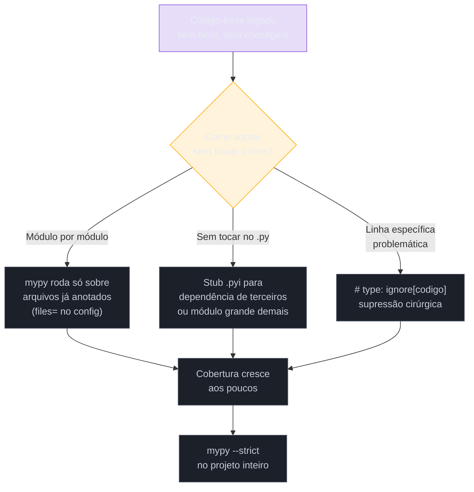

# mypy e pyright — checagem estática na prática

> [!abstract] TL;DR
> **Type hints sozinhas não checam nada** ([[03-Dominios/Tecnologia/Python/Tipagem moderna/01 - Type hints — fundamentos e gradual typing|nota 01]]) — quem faz o trabalho de comparar o tipo declarado com o tipo real é um **checador estático** rodando *antes* da execução, como um passo de análise separado. **mypy** é o checador original do ecossistema (mantido pela comunidade, com apoio da própria PSF), escrito em Python, com anos de maturidade em casos de borda; **pyright** é da Microsoft (a mesma equipe do TypeScript), escrito em TypeScript/Node, e alimenta o **Pylance** — a extensão de Python padrão do VS Code. A diferença mais importante entre os dois não é velocidade (pyright costuma ser 3-5x mais rápido em bases grandes) nem maturidade — é **o que cada um checa por padrão**: mypy ignora funções sem anotação a menos que você mande explicitamente checá-las; pyright infere tipos e checa **todo** o código, anotado ou não, desde o modo básico. Nenhum dos dois substitui teste automatizado: checagem estática prova ausência de uma *classe* de erro (incompatibilidade de tipo) sem executar uma linha de código; teste prova que a lógica produz o resultado certo, mas só para os casos que você lembrou de escrever. São complementares, não concorrentes.

## O bug que passou pelo code review, mas não passaria pelo mypy

Um time está revisando um pull request. A função recebe um `Optional[Usuario]` — o usuário pode não existir, se o ID buscado não bater com nada no banco:

```python
def formatar_boas_vindas(usuario: Optional[Usuario]) -> str:
    return f"Olá, {usuario.nome}!"
```

O revisor lê o corpo, lê o teste que acompanha o PR (`test_formatar_boas_vindas_usuario_existente`, que só testa o caso feliz), aprova. O código sobe. Duas semanas depois, em produção, alguém busca um ID que não existe, `usuario` chega como `None`, e a aplicação quebra com `AttributeError: 'NoneType' object has no attribute 'nome'` — no meio de um horário de pico, sem nenhum teste automatizado para pegar exatamente esse cenário, porque ninguém pensou em escrever `test_formatar_boas_vindas_usuario_none`.

Se esse mesmo código tivesse passado por `mypy` ou `pyright` **antes** do merge, o erro apareceria sem precisar rodar uma linha sequer:

```text
error: Item "None" of "Optional[Usuario]" has no attribute "nome"  [union-attr]
```

Essa é a demonstração mais direta do porquê desta nota existe: as duas notas anteriores do galho ensinaram a *escrever* hints corretas (`Optional[Usuario]`, uniões, generics) — esta ensina a ferramenta que de fato **lê** essas hints e reclama quando o código as contradiz, sem precisar de um teste específico para cada jeito de violar o contrato.

## O que é

### Dois checadores, duas origens, um objetivo

Um checador estático de tipos Python lê o código-fonte (sem executá-lo), reconstrói o mesmo tipo de árvore de sintaxe que o interpretador usaria ([[03-Dominios/Tecnologia/Python/Core/01 - O que é Python e como ele executa|Core/01]]), mas em vez de compilar para bytecode e rodar, ele **infere e compara tipos** em cada expressão, chamada e atribuição — e reporta toda incompatibilidade encontrada contra as hints declaradas (ou inferidas, quando não há hint explícita).

Existem dois checadores dominantes no ecossistema Python hoje:

- **[mypy](https://mypy-lang.org/)** — o checador original, iniciado por Jukka Lehtinen em 2012 e hoje um projeto guarda-chuva sob a Python Software Foundation. Escrito em Python, distribuído via `pip`, é o checador contra o qual boa parte da [documentação oficial de `typing`](https://docs.python.org/3/library/typing.html) e das próprias PEPs de tipagem foi validada historicamente — quando uma PEP de tipos é aceita, mypy costuma ser o primeiro a implementar suporte.
- **[pyright](https://microsoft.github.io/pyright/)** — criado pela Microsoft, escrito em TypeScript, rodando sobre Node.js. É o motor de análise por trás do **[Pylance](https://marketplace.visualstudio.com/items?itemName=ms-python.vscode-pylance)**, a extensão de Python mais usada no VS Code — o que significa que, se você já usa VS Code para escrever Python, provavelmente já está vendo avisos de pyright no editor, mesmo sem nunca ter instalado nada manualmente.

> [!question]- Se os dois "fazem a mesma coisa", por que o ecossistema não convergiu num só?
> Porque eles nasceram com objetivos de design diferentes, e essas escolhas ainda moldam o comportamento de cada um. mypy nasceu como uma ferramenta de linha de comando, pensada para rodar em CI, com um design historicamente mais conservador — preferir menos falsos positivos a mais cobertura, porque um `mypy --strict` gritando em código legado não-anotado seria inutilizável. pyright nasceu como o motor de um *language server* — precisa responder em milissegundos enquanto você digita, então foi otimizado para performance de análise incremental desde o primeiro dia, e adotou uma filosofia mais agressiva de inferência (analisar tudo, mesmo sem hint, porque um editor que só sublinha código explicitamente anotado seria pouco útil). Nenhum dos dois "venceu" — muitos times usam pyright no editor (feedback instantâneo, via Pylance) e mypy em CI (gate de merge, configuração compartilhada em `pyproject.toml`), e é perfeitamente comum ver as duas ferramentas configuradas no mesmo projeto sem conflito, porque cada uma serve a um momento diferente do fluxo de trabalho.

### Instalação e uso via CLI

Ambos são instaláveis via `pip` (ou `uv`, `poetry`, `pipx` — qualquer gerenciador de pacotes Python), e o fluxo básico de uso é simétrico:

```bash
# mypy
pip install mypy
mypy caminho/para/arquivo.py
mypy caminho/para/pacote/          # checa um pacote inteiro, recursivamente

# pyright
pip install pyright
pyright caminho/para/arquivo.py
pyright caminho/para/pacote/
```

`pyright`, apesar de instalado via `pip`, na verdade empacota (ou baixa, na primeira execução) um binário Node.js internamente — um detalhe de implementação que raramente importa no dia a dia, mas explica por que a primeira execução de `pyright` costuma ser mais lenta que as seguintes (ele baixa o motor JS na primeira vez, se ainda não estiver em cache).

Rodando `mypy` sobre o exemplo da abertura:

```python
# usuarios.py
from typing import Optional


class Usuario:
    def __init__(self, nome: str) -> None:
        self.nome = nome


def formatar_boas_vindas(usuario: Optional[Usuario]) -> str:
    return f"Olá, {usuario.nome}!"
```

```text
$ mypy usuarios.py
usuarios.py:10: error: Item "None" of "Optional[Usuario]" has no attribute "nome"  [union-attr]
Found 1 error in 1 file (checked 1 source file)
```

O mesmo arquivo, rodado com `pyright`:

```text
$ pyright usuarios.py
/caminho/usuarios.py:10:29 - error: "nome" is not a known attribute of "None" (reportOptionalMemberAccess)
1 error, 0 warnings, 0 informations
```

Repare que os dois pegam **o mesmo bug real**, mas com nomes de erro diferentes: mypy usa **error codes** entre colchetes (`[union-attr]`) — um sistema documentado na [lista oficial de códigos de erro](https://mypy.readthedocs.io/en/stable/error_code_list.html); pyright usa **rule names** em `camelCase` (`reportOptionalMemberAccess`) — documentados na [configuração de regras do pyright](https://microsoft.github.io/pyright/#/configuration). Ambos os identificadores servem ao mesmo propósito prático — permitir suprimir ou ajustar a severidade de um tipo específico de erro sem desligar o checador inteiro — só que com vocabulários próprios, não intercambiáveis.

**Mnemônico em uma frase**: mypy fala em *error codes* entre colchetes, pyright fala em *rule names* que começam com `report`.

## Por que importa

Sem um checador rodando em algum ponto do fluxo — editor, pré-commit ou CI — as hints escritas nas três notas anteriores deste galho são, na prática, comentário estruturado: existem, mas nada as valida contra a realidade do código. É essa lacuna que mypy e pyright fecham, cada um a seu jeito:

- **No editor** (via Pylance/pyright, ou uma extensão de mypy), o feedback é instantâneo — o erro aparece sublinhado *enquanto* você escreve, antes mesmo de salvar o arquivo.
- **Em CI** (mypy costuma ser a escolha mais comum aqui, mas pyright também roda em CI sem problema), o feedback vira um **gate**: o pull request não pode ser mesclado se o checador reportar erro, transformando "espero que ninguém tenha esquecido de checar tipo" numa garantia mecânica.
- **Em código legado**, os dois oferecem caminhos de adoção incremental (detalhados adiante) que evitam o cenário de "ligar o checador e receber 4000 erros de uma vez, ninguém nunca vai corrigir isso" — o tipo de fricção que mata a adoção de tipagem estática num projeto grande antes mesmo de começar.

## Como funciona

### O modo `strict`: o que ele liga de fato

Rodar `mypy arquivo.py` sem nenhuma configuração adicional é, propositalmente, permissivo — por padrão, mypy **ignora funções sem nenhuma anotação de tipo**, tratando o corpo delas como código dinamicamente tipado comum, sem checagem. Essa é uma decisão de design deliberada: um projeto legado enorme, sem uma única hint, rodando `mypy` pela primeira vez, não deveria ser inundado de milhares de erros — deveria simplesmente não reportar nada até que alguém comece a anotar.

O modo `--strict` muda esse comportamento padrão, ligando um conjunto específico de flags de uma vez. Segundo a [documentação oficial do mypy 2.2](https://mypy.readthedocs.io/en/stable/command_line.html#cmdoption-mypy-strict), `--strict` equivale a ligar, entre outras:

| Flag | O que exige |
|---|---|
| `--disallow-untyped-defs` | Toda função precisa ter anotação completa de parâmetros e retorno — sem isso, mypy reporta erro em vez de simplesmente pular a função |
| `--disallow-incomplete-defs` | Proíbe anotação **parcial** (alguns parâmetros tipados, outros não) — ou tipa tudo, ou nada |
| `--disallow-untyped-calls` | Uma função já tipada não pode **chamar** uma função sem tipo sem gerar erro — impede que código "limpo" dependa silenciosamente de código não verificado |
| `--check-untyped-defs` | Mesmo funções sem anotação alguma têm o **corpo** checado internamente (tipos inferidos), embora a assinatura em si não seja exigida |
| `--disallow-any-generics` | Proíbe genéricos implícitos sem parâmetro de tipo (ex.: `list` sozinho, sem `list[int]`) |
| `--disallow-subclassing-any` | Impede herdar de uma classe cujo tipo é `Any` sem declarar isso explicitamente |
| `--warn-return-any` | Alerta quando uma função tipada retorna um valor de tipo `Any`, mesmo que sintaticamente "bata" com a assinatura |
| `--warn-unused-ignores` | Reporta `# type: ignore` que não está mais suprimindo erro nenhum (código morto de supressão) |
| `--no-implicit-reexport` | Um `import X` dentro de um módulo não reexporta `X` automaticamente para quem importar esse módulo — precisa de `__all__` ou re-export explícito |
| `--strict-equality` | Reporta comparações (`==`, `!=`) entre tipos que nunca poderiam ser iguais em runtime (ex.: comparar `str` com `int` diretamente) |
| `--extra-checks` | Um conjunto de checagens adicionais consideradas experimentais/estritas demais para o padrão, mas úteis em `--strict` |

`--strict` **não é uma flag única e monolítica** — é um atalho de conveniência para ligar cerca de dez flags individuais de uma vez. A prática recomendada pela própria comunidade (documentada em guias como o da [pydevtools sobre configuração de mypy strict](https://pydevtools.com/handbook/how-to/how-to-configure-mypy-strict-mode/)) é **não** simplesmente jogar `--strict` num projeto legado do dia para a noite — em vez disso, ligar as flags individuais uma a uma, começando por `--disallow-untyped-defs` (a mais impactante e a mais fácil de justificar: "toda função nova precisa ter tipo"), e ir somando as demais conforme o código-base for absorvendo cada nível de rigor.

Fora do modo `--strict`, uma flag isolada merece menção separada por ser um exemplo perfeito de "pequeno detalhe, grande efeito de segurança": `no_implicit_optional`. Antes dessa flag existir (e antes de virar padrão no mypy moderno), escrever `def f(x: int = None)` era tratado *implicitamente* como `Optional[int]` — o `None` como valor padrão "contaminava" o tipo declarado sem avisar. Isso violava a leitura direta da assinatura (alguém lendo `x: int` esperaria um `int`, não um `int | None`) e é exatamente o tipo de comportamento silenciosamente perigoso que a [nota 02 deste galho](03-Dominios/Tecnologia/Python/Tipagem%20moderna/02%20-%20Union%2C%20Optional%20e%20o%20operador%20%7C.md) trata com cuidado. Com `no_implicit_optional` ligado (padrão desde mypy 0.990, e parte de `--strict`), essa mesma assinatura passa a exigir `Optional[int]`/`int | None` explícito — o comportamento implícito antigo vira erro.

> [!question]- E o pyright — ele também tem um "modo strict"?
> Tem, mas com um modelo diferente: em vez de um `--strict` que liga flags booleanas específicas (como mypy), pyright tem **cinco níveis de severidade** configuráveis via `typeCheckingMode` — `off`, `basic` (padrão), `standard`, `strict`, e `all`. Cada nível ajusta a severidade de dezenas de regras individuais (de "desligado" para "aviso" para "erro"). O nível `strict` do pyright já é bem mais agressivo que o `basic` padrão — ele passa a exigir, por exemplo, que toda função pública tenha tipo de retorno explícito, algo que o `basic` só sugere como aviso opcional. A diferença filosófica central permanece: mesmo no nível mínimo (`basic`), pyright **já está checando** código sem anotação, usando inferência — mypy, no padrão sem `--strict` nem `--check-untyped-defs`, simplesmente **pula** essa função sem checar nada.

### Tipagem incremental em código legado

A pergunta mais prática para quem herda um código-base de centenas de milhares de linhas sem uma única hint não é "como ligo `--strict`?" — é "como ligo *qualquer* checagem sem travar o time com milhares de erros no primeiro dia?". Os dois checadores oferecem mecanismos específicos para essa adoção gradual.

**`# type: ignore[código]` — suprimir uma linha específica, com cirurgia**

```python
resultado = funcao_legada_sem_tipo()  # type: ignore[no-untyped-call]
```

O comentário `# type: ignore` sozinho suprime **qualquer** erro naquela linha — uma ferramenta grosseira que, se usada sem o código entre colchetes, também esconde erros futuros não relacionados ao motivo original da supressão (um `# type: ignore` genérico, colocado para calar um erro de `no-untyped-call`, silenciosamente engoliria também um erro completamente diferente introduzido meses depois na mesma linha). Por isso, a [documentação oficial recomenda fortemente](https://mypy.readthedocs.io/en/stable/common_issues.html#silencing-errors-based-on-error-codes) qualificar sempre com o código entre colchetes — `# type: ignore[no-untyped-call]` — que restringe a supressão a **exatamente aquele tipo de erro**, deixando qualquer outro problema na mesma linha visível. A flag `--warn-unused-ignores` (parte de `--strict`) reporta quando um `# type: ignore` parou de suprimir qualquer coisa — sinal de que o código abaixo dele mudou e a supressão virou lixo esquecido.

`pyright` usa uma sintaxe irmã: `# pyright: ignore[reportOptionalMemberAccess]`, com o mesmo princípio de especificidade.

**`reveal_type()` — perguntar ao checador "o que você acha que isso é?"**

```python
def processar(dados: list[dict[str, int]]) -> None:
    total = sum(d["valor"] for d in dados)
    reveal_type(total)  # mypy: Revealed type is "builtins.int"
```

`reveal_type()` não é uma função Python de verdade — é reconhecida **especialmente** por mypy e pyright durante a análise estática, sem precisar de import. Ela imprime, no output do checador, qual tipo ele **inferiu** para a expressão naquele ponto — inestimável para depurar por que um checador está reclamando de algo que "parece óbvio", porque frequentemente o tipo inferido pelo checador é mais amplo (ou mais estreito) do que a intuição sugere. Como a própria documentação alerta, `reveal_type()` precisa ser **removida antes de rodar o código de verdade** — ela não existe em runtime, e chamá-la fora de um checador ativo gera `NameError`.

**Arquivos `.pyi` (stub files) — tipar sem tocar no código-fonte**

Quando o código-fonte é grande demais para anotar linha por linha de uma vez, ou quando é uma dependência de terceiros sem hints, mypy e pyright suportam **arquivos stub** — arquivos `.pyi` com o mesmo nome do módulo, contendo *só* as assinaturas tipadas, sem implementação:

```python
# calculos.pyi — stub para calculos.py
def calcular_frete(peso: float, distancia: float) -> float: ...
def aplicar_desconto(valor: float, percentual: float) -> float: ...
```

Quando um checador encontra um `.pyi` ao lado (ou no caminho de busca de stubs) de um `.py`, ele **prioriza o stub** sobre o corpo real do arquivo `.py` para fins de checagem de tipo — o `.py` continua sendo o que de fato executa, mas o `.pyi` é o que o checador lê para saber os tipos. Essa separação é a base de todo o ecossistema `typeshed` (o repositório que mantém stubs para a biblioteca padrão e para bibliotecas populares sem hints nativas) e de pacotes `types-*` no PyPI (`types-requests`, `types-PyYAML`) — formas de adicionar tipagem a uma dependência de terceiros **sem** precisar modificar o código-fonte dela.

**`--follow-imports=skip` — a ponte de emergência para código não tipado**

Por padrão, quando `mypy` encontra um `import outro_modulo`, ele segue esse import e também checa `outro_modulo` — o que é ótimo quando o projeto inteiro é tipado, mas se torna um problema quando `outro_modulo` é um trecho legado gigantesco que ainda não recebeu nenhum tratamento. A flag `--follow-imports=skip` instrui mypy a **não seguir** imports para módulos que ainda não foram explicitamente listados para checagem — tratando o que vem de lá como `Any`, sem tentar analisar o arquivo importado. A própria documentação classifica esse uso como "fortemente desencorajado, necessário só em situações relativamente de nicho" — é uma válvula de escape para destravar a adoção inicial num monólito legado, não uma configuração para deixar ligada permanentemente. O caminho recomendado, segundo o [guia oficial de adoção em código existente](https://mypy.readthedocs.io/en/stable/existing_code.html), é: começar rodando mypy só sobre os módulos novos/já tipados (via `files =` no `mypy.ini`/`pyproject.toml`), e ir expandindo essa lista aos poucos — em vez de rodar sobre tudo com `--follow-imports=skip` ligado indefinidamente.



**Tipagem incremental em uma frase**: você nunca precisa tipar um código-base inteiro de uma vez — `files=` restringe o escopo checado, `.pyi` tipa sem tocar no fonte, `# type: ignore[código]` silencia cirurgicamente um ponto específico, e `--follow-imports=skip` é a válvula de emergência para destravar o primeiro dia.

### mypy vs. pyright: a tabela de decisão

| | mypy | pyright |
|---|---|---|
| Mantido por | Comunidade Python / PSF | Microsoft |
| Escrito em | Python | TypeScript (roda sobre Node.js) |
| Lançamento | 2012 | 2019 |
| Checa função sem hint por padrão? | **Não** — pula, salvo `--check-untyped-defs`/`--strict` | **Sim** — infere tipos e checa mesmo sem anotação, desde o modo `basic` |
| Modo de rigor | `--strict` liga ~10 flags booleanas específicas | 5 níveis (`off`/`basic`/`standard`/`strict`/`all`) via `typeCheckingMode` |
| Identificador de erro | *Error code* entre colchetes, ex. `[union-attr]` | *Rule name*, ex. `reportOptionalMemberAccess` |
| Velocidade em bases grandes | Referência histórica, mais lento | Tipicamente 3-5x mais rápido (arquitetura incremental, otimizada para IDE) |
| Integração de editor | Extensões de terceiros (menos onipresente) | Nativo via **Pylance** no VS Code |
| Uso típico | CI / gate de merge, configuração em `pyproject.toml` | Editor (feedback instantâneo) + CI |
| Suporte a PEPs novas de tipos | Historicamente o primeiro a implementar | Costuma acompanhar de perto, às vezes empata ou lidera em recursos específicos |

Nenhum dos dois é estritamente "melhor" — são otimizados para pontos diferentes do mesmo problema. A configuração mais comum em times profissionais, segundo relatos recorrentes da comunidade (ver a comparação técnica publicada pelo [próprio time do pyright](https://github.com/microsoft/pyright/blob/main/docs/mypy-comparison.md)), é usar os dois ao mesmo tempo: pyright/Pylance no editor para feedback instantâneo enquanto se escreve, e mypy em CI como gate formal de merge — porque a configuração de mypy costuma já existir há mais tempo no projeto, e trocar o gate de CI para pyright exigiria reconfigurar todas as supressões e exceções acumuladas ao longo dos anos.

> [!warning] Um mesmo trecho de código pode passar num checador e falhar no outro
> Como os dois inferem tipo de forma diferente em casos de borda (principalmente em código sem anotação, generics complexos, ou overloads), é perfeitamente possível — e acontece na prática — que `mypy arquivo.py` passe limpo enquanto `pyright arquivo.py` reporta um erro no mesmo arquivo, ou vice-versa. Isso não significa que um dos dois "está errado" no sentido absoluto: a especificação de tipos do Python (as PEPs) deixa zonas cinzentas onde diferentes implementações de checador são livres para divergir. Times que rodam os dois em CI precisam decidir, explicitamente, qual das duas opiniões é a que bloqueia o merge — geralmente a que já estava configurada primeiro no projeto.

### Integração em CI: pre-commit e GitHub Actions

Rodar o checador manualmente antes de cada commit funciona até alguém esquecer — e mais cedo ou mais tarde, alguém esquece. As duas formas padrão de tornar a checagem **obrigatória**, não opcional, são hooks de pre-commit e um passo de CI.

**pre-commit hook**, usando o framework [`pre-commit`](https://pre-commit.com/) (não confundir com o conceito genérico "hook de pre-commit do Git" — é uma ferramenta específica, muito adotada no ecossistema Python, que gerencia hooks declarados em `.pre-commit-config.yaml`):

```yaml
# .pre-commit-config.yaml
repos:
  - repo: https://github.com/pre-commit/mirrors-mypy
    rev: v1.14.0
    hooks:
      - id: mypy
        additional_dependencies: [types-requests]
```

Um ponto que costuma surpreender quem configura isso pela primeira vez: o hook `mirrors-mypy` roda mypy dentro de um **virtualenv isolado**, criado só para o hook — sem acesso automático às dependências reais do projeto. Isso significa que, se o código importa `requests` e usa tipos vindos dela, o hook precisa declarar `additional_dependencies: [types-requests]` explicitamente (ou o pacote real, se ele já embutir hints via `py.typed`), senão mypy reporta erros de "import não encontrado" que não têm nada a ver com bugs reais de tipo — um problema de configuração, não de código. Existe um mirror equivalente para pyright, mantido pela comunidade ([`ComPWA/pyright-pre-commit`](https://github.com/ComPWA/pyright-pre-commit)), com a mesma lógica de instalar dependências extras.

**GitHub Actions**, como passo de CI independente do pre-commit local (roda mesmo se alguém pular o hook local, ou não tiver o `pre-commit` instalado):

```yaml
# .github/workflows/type-check.yml
name: Type check
on: [pull_request]

jobs:
  mypy:
    runs-on: ubuntu-latest
    steps:
      - uses: actions/checkout@v4
      - uses: actions/setup-python@v5
        with:
          python-version: "3.13"
      - run: pip install mypy types-requests
      - run: mypy .
```

O padrão mais robusto combina os dois: o hook de `pre-commit` dá feedback rápido *localmente*, antes mesmo do commit sair da máquina do desenvolvedor; o passo de GitHub Actions é o **gate de verdade** — porque hooks locais podem ser pulados (`git commit --no-verify`), mas um `required check` de CI configurado como obrigatório no GitHub bloqueia o merge do PR até o checador passar, independente do que aconteceu (ou não) na máquina de quem escreveu o código.

## O que checagem estática pega — e o que não pega

Essa é, talvez, a confusão mais cara para calibrar mal em entrevista ou em decisão de arquitetura: tipagem estática e testes automatizados **não são substitutos um do outro** — cobrem categorias de erro diferentes, e um projeto maduro precisa dos dois.

**O que checagem estática pega, que teste normalmente não pega:**

- **Toda combinação possível de chamada**, não só as que alguém lembrou de testar. `formatar_boas_vindas(None)` é pego pelo checador mesmo que nenhum teste jamais chame a função com `None` — o checador analisa a *assinatura* contra o *uso*, estaticamente, sem precisar executar o caminho específico.
- **Erros em código morto ou raramente executado** — um branch de tratamento de erro que quase nunca roda em produção, mas que, se rodasse, quebraria por incompatibilidade de tipo. Teste só cobre o que é executado; checagem estática analisa o arquivo inteiro, executado ou não.
- **Refatorações em cascata**: renomear um campo de uma classe, mudar o tipo de retorno de uma função usada em cinquenta lugares — o checador aponta *todos* os pontos de uso incompatíveis de uma vez, antes de rodar um único teste. Sem checador, cada um desses pontos só quebraria quando (e se) um teste específico o exercitasse — ou, pior, em produção.

**O que teste pega, que checagem estática não pega — e nunca vai pegar:**

- **Lógica de negócio incorreta com tipos corretos.** `def calcular_desconto(preco: float, percentual: float) -> float: return preco + percentual` tem assinatura perfeitamente tipada e passa em `mypy --strict` sem nenhum erro — mas é logicamente errada (soma em vez de aplicar percentual). Tipo bate, comportamento não. Só um teste (`calcular_desconto(100, 10) == 90`) pega isso.
- **Efeitos colaterais e integração real** — se uma função grava no banco de dados certo, se uma chamada de API externa retorna o formato esperado *na prática* (não só no tipo declarado pelo stub), se uma race condition existe sob concorrência real. Checagem estática nunca executa o código — não tem como observar comportamento em runtime.
- **Erros de runtime que não são de tipo**: `ZeroDivisionError`, um índice fora do range, um arquivo que não existe no disco. `def dividir(a: int, b: int) -> float: return a / b` está perfeitamente tipada; `dividir(10, 0)` quebra em runtime, e nenhum checador estático prevê isso — a análise de tipos não modela *valores*, só *formas* de dado.

> [!warning] "Passou no mypy --strict" não significa "está correto"
> É um erro de calibração comum, principalmente em quem está adotando tipagem estática pela primeira vez, tratar um `mypy --strict` limpo como sinônimo de "código sem bugs". Não é — é sinônimo de "uma classe específica de bug (incompatibilidade de tipo) está ausente". Um projeto pode ter zero erros de tipo e estar cheio de bugs de lógica, condição de corrida, ou erro de integração — categorias que só teste, revisão de código e observabilidade em produção pegam. A analogia mais precisa: checagem de tipo está para "o formato dos dados está certo" assim como um teste de contrato de API está para "o schema do JSON está certo" — nenhum dos dois garante que o *conteúdo* faz sentido.

| Categoria de erro | Checagem estática (mypy/pyright) | Teste automatizado |
|---|---|---|
| Passar tipo errado (`str` onde espera `int`) | ✅ Pega, sem executar código | ⚠️ Só se houver teste específico pro caso |
| `None` não tratado (`Optional` sem checagem) | ✅ Pega (com `--strict`/checagem de union) | ⚠️ Só se houver teste específico pro caso |
| Lógica de negócio incorreta com tipo correto | ❌ Nunca pega | ✅ Pega, se o teste cobrir o cenário |
| Efeito colateral incorreto (grava errado no banco) | ❌ Nunca pega | ✅ Pega, com teste de integração |
| `ZeroDivisionError`, `IndexError`, outros erros de valor | ❌ Nunca pega (não modela valores, só tipos) | ✅ Pega, se o teste cobrir o caso limite |
| Refatoração quebra 50 pontos de uso | ✅ Pega todos de uma vez, estaticamente | ⚠️ Só os pontos com teste existente |
| Race condition sob concorrência real | ❌ Nunca pega | ⚠️ Difícil, exige teste específico de concorrência |

## Casos práticos

### Cenário 1: adotando mypy num monólito Django de cinco anos

Um time herda uma aplicação Django de cinco anos, ~80 mil linhas, zero type hints, zero checagem estática. A ideia de rodar `mypy --strict .` no primeiro dia é descartada de cara — geraria dezenas de milhares de erros, a maioria sem relação com bugs reais, só "isso nunca foi anotado". O plano adotado, seguindo o espírito do [guia oficial de adoção em código existente](https://mypy.readthedocs.io/en/stable/existing_code.html):

1. **Semana 1**: instalar mypy, configurar `pyproject.toml` com `files = ["app/pagamentos/"]` — só o módulo de pagamentos, o mais crítico e o que mais gera bugs de produção relacionados a tipo (valores `None` não tratados, principalmente).
2. **Semana 1, mesmo dia**: rodar `mypy app/pagamentos/` sem `--strict` primeiro — só para ver o volume de erros com a configuração mais permissiva possível. Um punhado de erros genuínos aparece (dois `Optional` não tratados, um retorno inconsistente).
3. **Semanas 2-3**: corrigir os erros reais encontrados (não suprimir — os dois `Optional` não tratados eram, de fato, bugs latentes, exatamente como no exemplo de abertura desta nota), e então ligar `disallow_untyped_defs = true` **só para o módulo de pagamentos**, via `[[tool.mypy.overrides]]` no `pyproject.toml` mirando esse pacote especificamente.
4. **Mês 2 em diante**: expandir `files=` módulo por módulo, sempre na mesma ordem — rodar sem `--strict`, corrigir o que aparecer, então subir o rigor daquele módulo específico — até o projeto inteiro estar coberto.
5. Só quando **todo** o código-base estiver anotado (meses depois, não semanas) o time liga `--strict` globalmente, e a partir daí qualquer módulo novo já nasce sob esse rigor desde o primeiro commit.

O ponto central do cenário: nunca existiu um momento de "ligar tudo de uma vez" — cada expansão de escopo foi uma decisão deliberada, sobre um pedaço de código pequeno o suficiente para corrigir os erros reais que apareceram, sem acumular uma dívida de `# type: ignore` espalhados por todo lado só para calar o checador.

### Cenário 2: pyright pego numa inferência diferente de mypy

Um desenvolvedor escreve uma função que devolve tipos diferentes dependendo de um parâmetro booleano — um padrão comum, mas ambíguo para checadores estáticos:

```python
def buscar(id: int, como_dict: bool = False):
    usuario = repositorio.buscar_por_id(id)
    if como_dict:
        return usuario.__dict__
    return usuario
```

Sem anotação de retorno explícita, mypy (no modo padrão, sem `--strict`) **pula** essa função inteira — nenhuma checagem acontece, porque a função não tem hints e mypy não checa funções não-anotadas por padrão. pyright, no modo `basic` (também padrão), **infere** o tipo de retorno como uma união entre o tipo de `usuario.__dict__` (um `dict[str, Any]`) e o tipo de `usuario` — e, dependendo de como o resto do código usa o valor de retorno dessa função, pode gerar um aviso sobre o tipo de retorno ser ambíguo demais para uso seguro em outro ponto do código, mesmo sem nenhuma anotação explícita na assinatura. O mesmo arquivo, rodando limpo em `mypy` e gerando aviso em `pyright` — não porque um dos dois "erra", mas porque um pula funções não-anotadas por padrão e o outro sempre tenta inferir algo, mesmo sem hint nenhuma. A correção, nos dois casos, é a mesma: anotar explicitamente o retorno (usando `@overload` para expressar os dois formatos possíveis — assunto da [[03-Dominios/Tecnologia/Python/Tipagem moderna/07 - Typing avançado — overload, Self, ParamSpec|nota 07 deste galho]], que ainda vem por aí), e o comportamento dos dois checadores converge.

## Armadilhas comuns

> [!warning] Usar `# type: ignore` sem código entre colchetes
> `# type: ignore` sozinho suprime **qualquer** erro naquela linha, incluindo erros futuros completamente diferentes do motivo original da supressão. Um `# type: ignore[no-untyped-call]` só suprime aquela categoria específica — qualquer outro erro na mesma linha continua visível. Times que adotam `# type: ignore` sem qualificar acumulam supressões que escondem regressões reais meses depois.

> [!warning] Confundir "mypy passou sem erro" com "função foi checada"
> Como visto no Cenário 2, uma função **sem nenhuma anotação** passa por `mypy` (modo padrão) sem gerar erro — não porque está correta, mas porque mypy simplesmente não a analisa. Um projeto com muitas funções não anotadas pode ter "zero erros de mypy" e, ao mesmo tempo, zero cobertura de checagem real. `--disallow-untyped-defs` (ou `--strict`) existe exatamente para fechar essa lacuna, transformando "não tem hint" de silêncio em erro explícito.

> [!warning] Deixar `--follow-imports=skip` ligado permanentemente
> Como a própria documentação do mypy alerta, essa flag é uma ponte de emergência para destravar a primeira execução num código-base gigante — não uma configuração de longo prazo. Deixada ligada indefinidamente, ela mascara qualquer incompatibilidade de tipo entre o módulo checado e os módulos que ele importa (tratados como `Any`), reduzindo drasticamente o valor real da checagem sem que isso apareça em lugar nenhum do relatório de erros.

> [!warning] Achar que zero erros de tipo é sinônimo de "sem bugs"
> Como a tabela da seção anterior deixa explícito, tipagem estática cobre uma fatia específica do espaço de bugs possíveis — incompatibilidade de tipo. Lógica de negócio errada, efeitos colaterais incorretos, erros de runtime que não são de tipo (`ZeroDivisionError`, `IndexError`) passam despercebidos por qualquer checador, por mais estrito que seja configurado. Testes automatizados continuam necessários, não opcionais, mesmo num projeto com `mypy --strict` totalmente limpo.

## Em entrevista

- **"Qual a diferença entre mypy e pyright?"** A diferença mais concreta não é maturidade nem velocidade (embora pyright costume ser 3-5x mais rápido em bases grandes) — é o comportamento **padrão** com código sem anotação: mypy ignora funções não-anotadas a menos que você peça explicitamente para checá-las (`--check-untyped-defs`/`--strict`); pyright infere tipos e checa **tudo**, anotado ou não, desde o modo `basic`. mypy é mantido pela comunidade/PSF, escrito em Python; pyright é da Microsoft, escrito em TypeScript, e alimenta o Pylance do VS Code.
- **"O que `mypy --strict` liga, de fato?"** Não é uma flag monolítica — é um atalho para ligar cerca de dez flags booleanas específicas de uma vez (`disallow-untyped-defs`, `disallow-incomplete-defs`, `no-implicit-reexport`, `warn-unused-ignores`, entre outras). A prática recomendada em código legado é ligar essas flags individualmente, uma a uma, em vez de aplicar `--strict` de uma tacada só sobre um projeto sem hints.
- **"Como você adotaria tipagem estática num projeto legado sem hints?"** Incrementalmente: restringir o escopo checado via `files=`/`include` a um módulo pequeno e crítico primeiro, corrigir os erros reais que aparecerem (não suprimir), só então subir o rigor daquele módulo específico via overrides, e repetir módulo por módulo — nunca ligar `--strict` globalmente num código-base inteiro de uma vez.
- **"Checagem estática de tipo substitui teste automatizado?"** Não — são complementares, cobrindo categorias de erro diferentes. Checagem estática pega incompatibilidade de tipo sem executar código (inclusive em caminhos raramente exercitados); teste pega lógica de negócio incorreta, efeitos colaterais errados e erros de runtime que não são de tipo (`ZeroDivisionError`, por exemplo) — nenhum checador estático analisa *valor*, só *forma* de dado. Um projeto maduro precisa dos dois.
- **"O que é `# type: ignore[código]`, e por que qualificar o código importa?"** É a forma de suprimir um erro específico numa linha específica. Sem o código entre colchetes, a supressão é genérica e esconde qualquer erro futuro naquela linha, não só o original. Qualificar com o código (`# type: ignore[union-attr]`, por exemplo) restringe a supressão àquela categoria de erro exata.

> [!question]- O entrevistador pergunta: "seu time usa mypy ou pyright?"
> A resposta mais forte não escolhe um lado — é explicar que os dois resolvem problemas diferentes e frequentemente coexistem: pyright/Pylance no editor, porque o feedback instantâneo enquanto se digita reduz o ciclo de correção a segundos; mypy em CI, como gate formal de merge, porque a configuração histórica do projeto (arquivos `mypy.ini`/seção `[tool.mypy]` acumulada ao longo de anos, com suas exceções e overrides) já existe e reconfigurar tudo para pyright teria um custo de migração sem ganho equivalente. Se o entrevistador perguntar "e se fosse um projeto novo, do zero?", uma resposta honesta é que pyright sozinho já cobre bem os dois papéis (editor + CI) num projeto sem bagagem histórica — a escolha de manter os dois é mais sobre bagagem acumulada do que sobre um dos dois ser objetivamente superior.

## How to explain in English

> mypy and pyright are the two dominant static type checkers for Python. mypy is the original, community/PSF-maintained checker, written in Python — by default it skips unannotated functions entirely, so `--strict` (a shortcut for roughly ten individual flags like `disallow-untyped-defs` and `no-implicit-reexport`) is needed to enforce full coverage. pyright, built by Microsoft in TypeScript, powers Pylance in VS Code and infers types even for unannotated code from its default `basic` mode onward — a fundamentally different default posture toward untyped code. Neither replaces automated testing: static checking proves the *absence* of one specific error class (type mismatch) without executing a single line, catching every call site of a function at once, even paths that tests never exercise. Tests, in turn, catch correct-typed-but-wrong-logic bugs, side effects, and runtime errors like `ZeroDivisionError` that no type checker ever models, because type checkers reason about shape, not value. Adopting either checker on a legacy codebase incrementally — scoping `files=` to one module at a time, using `.pyi` stubs for untyped dependencies, and qualifying `# type: ignore[code]` with the specific error code rather than suppressing blindly — avoids the common failure mode of turning strict mode on everywhere at once and drowning the team in unrelated noise.

| PT-BR | English |
|---|---|
| checagem estática de tipos | static type checking |
| modo estrito | strict mode |
| tipagem incremental | incremental typing |
| supressão de erro | error suppression |
| arquivo stub | stub file |
| código de erro | error code |
| nome de regra | rule name |
| gate de merge | merge gate |
| dívida de tipo | type debt |
| checador estático | static type checker |

## O que vem a seguir

Esta nota fechou o ciclo iniciado na [[03-Dominios/Tecnologia/Python/Tipagem moderna/01 - Type hints — fundamentos e gradual typing|nota 01]]: hints são metadados sem enforcement automático — mypy e pyright são as ferramentas que de fato comparam essas hints com a realidade do código, *antes* de qualquer linha rodar. As próximas notas do galho voltam ao vocabulário de tipos, agora com o checador como leitor implícito de tudo que vier a seguir: [[03-Dominios/Tecnologia/Python/Tipagem moderna/05 - TypedDict, Literal, NewType e Final|05 — TypedDict, Literal, NewType e Final]] cobre formas mais específicas de expressar contrato (um dict com schema fixo, um valor entre opções restritas, um tipo distinto sobre um `int` cru) que mypy/pyright checam com o mesmo rigor visto aqui; depois, [[03-Dominios/Tecnologia/Python/Tipagem moderna/06 - Pydantic — validação em runtime|06 — Pydantic]] muda de eixo — de checagem *estática* (antes de rodar) para validação *em runtime* (ao instanciar), fechando a outra metade da pergunta "quem lê as hints, de fato?" que a nota 01 deixou em aberto.

- [[03-Dominios/Tecnologia/Python/Tipagem moderna/05 - TypedDict, Literal, NewType e Final|05 — TypedDict, Literal, NewType e Final]] — próxima nota: tipos mais expressivos, ainda checados pelas mesmas ferramentas vistas aqui.
- [[03-Dominios/Tecnologia/Python/Tipagem moderna/06 - Pydantic — validação em runtime|06 — Pydantic: validação em runtime]] — a segunda forma de "agir sobre a hint", desta vez checando de fato ao instanciar, não antes de rodar.
- [[03-Dominios/Tecnologia/Python/Tipagem moderna/01 - Type hints — fundamentos e gradual typing|01 — Type hints: fundamentos e gradual typing]] — volta ao ponto de partida: por que hints, sozinhas, não bastam.

## Veja também

- [[03-Dominios/Engenharia/Testes/index|Engenharia/Testes]] — a metade complementar da estratégia de qualidade: o que checagem estática nunca vai pegar, teste automatizado cobre.
- [[03-Dominios/Tecnologia/Python/Tipagem moderna/index|Tipagem moderna]] — MOC do galho.
- [[03-Dominios/Tecnologia/Python/index|Trilha Python]] — MOC central.

## Fontes

- mypy. *The mypy command line* — documentação oficial, seção `--strict` e flags individuais. mypy.readthedocs.io, versão 2.2.0. https://mypy.readthedocs.io/en/stable/command_line.html (acessado em 2026-07-10)
- mypy. *Common issues and solutions* — `# type: ignore`, `reveal_type`, error codes. mypy.readthedocs.io. https://mypy.readthedocs.io/en/stable/common_issues.html (acessado em 2026-07-10)
- mypy. *Using mypy with an existing codebase* — guia oficial de adoção incremental, `files=`, `--follow-imports`. mypy.readthedocs.io. https://mypy.readthedocs.io/en/stable/existing_code.html (acessado em 2026-07-10)
- mypy. *Error codes for optional checks* / *Error codes*. mypy.readthedocs.io. https://mypy.readthedocs.io/en/stable/error_code_list.html (acessado em 2026-07-10)
- mypy-lang.org. *Mypy 1.20 Released* (mypy-lang.blogspot.com, mar. 2026) e páginas de release notes. https://mypy-lang.org/news.html (acessado em 2026-07-10)
- Microsoft / pyright. *mypy-comparison.md* — comparação oficial de comportamento padrão, performance e filosofia de design entre pyright e mypy. github.com/microsoft/pyright. https://github.com/microsoft/pyright/blob/main/docs/mypy-comparison.md (acessado em 2026-07-10)
- Microsoft. *Pyright configuration* — `typeCheckingMode`, níveis de severidade, rule names. microsoft.github.io/pyright. https://microsoft.github.io/pyright/#/configuration (acessado em 2026-07-10)
- pre-commit. *mirrors-mypy* — hook oficial de pre-commit para mypy, isolamento de virtualenv, `additional_dependencies`. github.com/pre-commit/mirrors-mypy. https://github.com/pre-commit/mirrors-mypy (acessado em 2026-07-10)
- ComPWA. *pyright-pre-commit* — mirror comunitário de hook pre-commit para pyright. github.com/ComPWA/pyright-pre-commit (acessado em 2026-07-10)
- pydevtools. *How to configure mypy strict mode* / *How do mypy, pyright, and ty compare?*. pydevtools.com/handbook. https://pydevtools.com/handbook/how-to/how-to-configure-mypy-strict-mode/ (acessado em 2026-07-10)
- Real Python. *Python Type Checking (Guide)*. https://realpython.com/python-type-checking/ (acessado em 2026-07-10)
- Ramalho, L. *Fluent Python: Clear, Concise, and Effective Programming*, 2ª ed. — capítulo "Type Hints in Functions" (uso de checadores estáticos em pipelines reais). O'Reilly Media, 2022.

Consultado em 2026-07-10.
