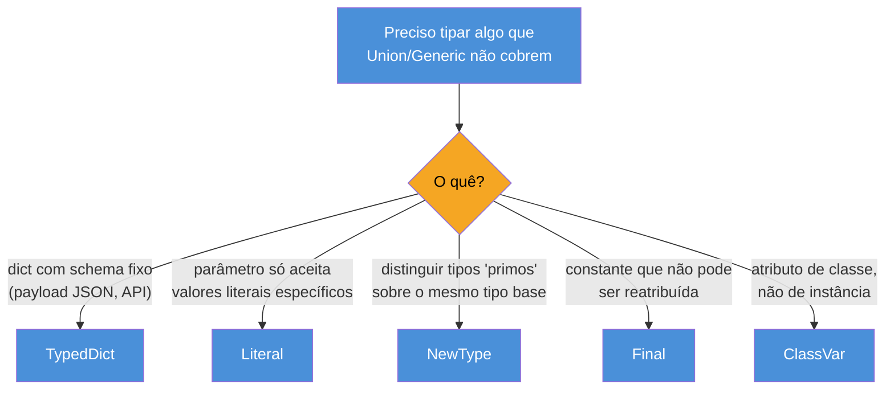
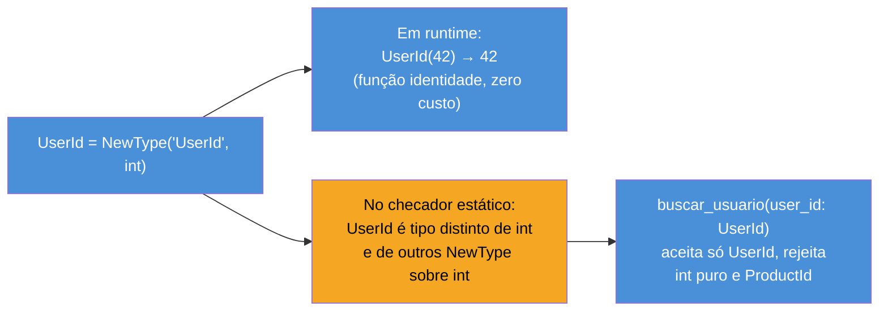
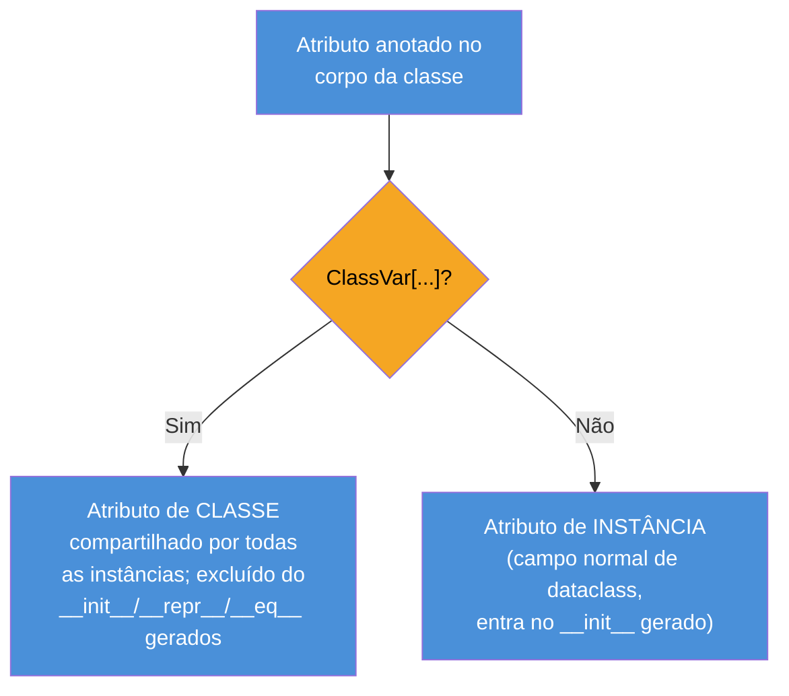

# TypedDict, Literal, NewType e Final

> [!abstract] TL;DR
> Quatro ferramentas pequenas do módulo `typing`, cada uma fechando uma lacuna específica que `Union`/`Generic` não cobrem. `TypedDict` ([PEP 589](https://peps.python.org/pep-0589/)) declara o **schema estático de um dicionário** — chaves fixas, cada uma com seu tipo — sem transformá-lo num objeto de verdade; é a ponte natural para JSON/payloads de API que precisam continuar sendo `dict` em runtime. `total=False` (ou `Required`/`NotRequired` por campo, [PEP 655](https://peps.python.org/pep-0655/)) marca quais chaves são opcionais. `Literal` ([PEP 586](https://peps.python.org/pep-0586/)) declara que um parâmetro só aceita **valores literais específicos** (`Literal["GET", "POST", "PUT"]`), pegando erros de digitação de string em tempo de checagem — mais leve que `Enum` quando o valor já é o dado real (ex.: um método HTTP que uma lib externa espera como string), mais pesado em segurança quando o conjunto de valores precisa de identidade e comportamento próprios. `NewType` cria um tipo "primo" distinto sobre um tipo base (`UserId = NewType("UserId", int)`) — zero custo em runtime (é a identidade, devolve o argumento sem tocar nele), mas o checador estático passa a rejeitar misturar `UserId` com `int` puro, prevenindo bugs de "dois IDs numéricos trocados por engano". `Final` ([PEP 591](https://peps.python.org/pep-0591/)) marca uma variável, atributo ou método como não-reatribuível/não-sobrescrevível — constantes de verdade, não por convenção `MAIUSCULA`; `ClassVar` marca um atributo de classe (compartilhado entre instâncias) dentro da mesma sintaxe de anotação, distinguindo-o de um atributo de instância declarado no corpo da classe.

## O problema: quatro lacunas que `Union`/`Generic` não fecham

As duas notas anteriores deste galho já deram bastante poder de expressão: [[02 - Union, Optional e o operador |02 — Union, Optional e o operador \|]] tipa "isto ou aquilo", e [[03 - Generics — TypeVar, Generic e sintaxe moderna|03 — Generics]] tipa "o mesmo tipo, reusado em qualquer lugar". Mas um sistema de tipos que só sabe fazer união e generalização ainda deixa passar bugs reais e comuns em código de produção. Considere quatro cenas — cada uma vai virar a seção de uma ferramenta desta nota.

**Cena 1.** Uma API externa devolve um payload JSON com formato fixo: `{"id": int, "nome": str, "ativo": bool}`. O código Python que consome essa resposta guarda isso num `dict` comum — porque é literalmente um `dict`, é o que `json.loads()` devolve, e transformar em objeto custaria uma camada de mapeamento que talvez ninguém precise. Mas `dict[str, Any]` não diz nada sobre quais chaves existem, nem seus tipos — `payload["nome"]` e `payload["nomee"]` (erro de digitação) são igualmente aceitos pelo checador, porque ambos são só "acesso a uma chave de string num dict genérico".

**Cena 2.** Uma função de configuração de rede aceita um parâmetro `metodo: str` que só faz sentido como `"GET"`, `"POST"` ou `"PUT"` — qualquer outra string é um bug. `str` sozinho não impede `metodo="GRAB"` (typo real, comum em bases grandes) de passar despercebido pelo checador; só um teste em runtime (ou pior, o erro 405 do servidor de produção) pega o problema.

**Cena 3.** Um sistema tem `UserId` e `ProductId`, ambos representados como `int` (o formato que vem do banco). Uma função `buscar_usuario(user_id: int)` aceita, sem reclamar, receber por engano um `product_id` — porque, para o checador, os dois são exatamente o mesmo tipo: `int`. O bug só aparece em runtime, como um usuário errado sendo retornado (ou pior, nenhum erro nenhum, só dado errado silencioso).

**Cena 4.** Uma constante de configuração, `TAXA_JUROS_PADRAO = 0.05`, é definida no topo de um módulo com a expectativa implícita de "isso nunca muda". Nada no Python impede `TAXA_JUROS_PADRAO = 0.08` em outro lugar do código — a convenção de nome em maiúsculas é só isso, uma convenção visual, sem imposição nenhuma do interpretador nem do checador.

Quatro problemas diferentes, quatro ferramentas diferentes — mas todas compartilham o mesmo espírito das notas anteriores deste galho: informação que o checador estático consegue usar para pegar um erro **antes** do código rodar, sem custo nenhum em runtime.



## `TypedDict`: schema estático sobre um `dict` de verdade

### O mecanismo

`typing.TypedDict` ([PEP 589](https://peps.python.org/pep-0589/), Python 3.8+) resolve a Cena 1 acima: declara, com a mesma sintaxe de classe usada em `dataclass`, quais chaves um dicionário deve ter e o tipo de cada valor — mas o objeto resultante, em runtime, continua sendo um `dict` comum, não uma instância de uma classe nova.

```python
from typing import TypedDict

class Usuario(TypedDict):
    id: int
    nome: str
    ativo: bool

def processar(payload: Usuario) -> str:
    return f"{payload['nome']} (#{payload['id']})"

usuario: Usuario = {"id": 1, "nome": "Ana", "ativo": True}
processar(usuario)

usuario_invalido: Usuario = {"id": 1, "nomee": "Ana", "ativo": True}
# mypy: error — Extra key "nomee" for TypedDict "Usuario"
# mypy: error — Missing key "nome" for TypedDict "Usuario"
```

O checador agora sabe exatamente quais chaves `Usuario` tem, e sinaliza tanto uma chave extra (o typo `"nomee"`) quanto uma chave faltando (`"nome"`) — o erro da Cena 1 vira `error` de checagem estática, não bug silencioso em produção. `payload["nome"]` também ganha o tipo certo (`str`), então `.upper()` autocompleta e `.append()` (que `str` não tem) seria sinalizado como erro.

> [!question]- Se `Usuario` "parece" uma classe, por que não é uma instância dela em runtime?
> Porque `TypedDict` foi desenhado especificamente para o caso em que os dados **já são um `dict`**, e vão continuar sendo — normalmente porque vieram de fora do programa (JSON de uma API, resposta de banco NoSQL, configuração YAML já parseada) e o código consumidor espera acesso por chave (`payload["nome"]`), não por atributo (`payload.nome`). Por baixo, `class Usuario(TypedDict): id: int` é **apenas uma fábrica de metadados** — em runtime, `Usuario(id=1, nome="Ana", ativo=True)` de fato constrói e devolve um `dict` comum (`{"id": 1, "nome": "Ana", "ativo": True}`), com `type(usuario) is dict` retornando `True`. Não existe `__init__` de instância, não existe herança de comportamento, não existe nenhum método novo — é 100% metadado para o checador, 0% mudança de runtime. Essa é a mesma regra de "type hints não mudam o interpretador" que a [[01 - Type hints — fundamentos e gradual typing|nota 01]] já estabeleceu, aplicada aqui a um caso específico.

### `total=False` e o refinamento por campo (`Required`/`NotRequired`)

Por padrão, **todas** as chaves de um `TypedDict` são obrigatórias — omitir uma na construção é um erro de checagem, mesmo que o `dict` resultante rode sem problema em runtime (de novo: `TypedDict` não valida nada em runtime, só o checador reclama). Quando algumas chaves são genuinamente opcionais — um campo que a API às vezes omite —, `total=False` desliga essa obrigatoriedade para a classe inteira:

```python
from typing import TypedDict

class Endereco(TypedDict, total=False):
    rua: str
    numero: int
    complemento: str   # frequentemente ausente

endereco_completo: Endereco = {"rua": "Av. Paulista", "numero": 1000, "complemento": "sala 5"}
endereco_minimo: Endereco = {"rua": "Av. Paulista", "numero": 1000}   # ok — nada obrigatório
```

O problema de `total=False` na classe inteira é o caso comum na prática: a maioria dos campos é obrigatória, só um ou dois são opcionais — desligar a obrigatoriedade de **todos** de uma vez é rigor demais na direção errada. A [PEP 655](https://peps.python.org/pep-0655/) (Python 3.11+, também disponível via `typing_extensions` para versões anteriores) resolve isso com granularidade por campo: `Required[X]` e `NotRequired[X]`, combináveis com qualquer valor de `total`.

```python
from typing import TypedDict, NotRequired

class Pedido(TypedDict):
    id: int
    valor: float
    cupom: NotRequired[str]   # só este campo é opcional; o resto continua obrigatório

pedido: Pedido = {"id": 42, "valor": 199.90}   # ok — "cupom" pode faltar
pedido_invalido: Pedido = {"valor": 199.90}
# mypy: error — Missing key "id" for TypedDict "Pedido"
```

Segundo a [especificação viva de tipagem sobre TypedDict](https://typing.python.org/en/latest/spec/typeddict.html), um `TypedDict` declarado com `total=False` é **semanticamente equivalente** a um `TypedDict` `total=True` (o padrão) com todos os campos marcados `NotRequired[...]` — as duas formas descrevem o mesmo conjunto de dicionários válidos, `Required`/`NotRequired` só permite misturar os dois regimes dentro da mesma classe.

| Padrão | Sintaxe | Uso típico |
|---|---|---|
| Tudo obrigatório (default) | `class X(TypedDict): campo: tipo` | Schema fixo sem campos opcionais |
| Tudo opcional | `class X(TypedDict, total=False): campo: tipo` | Schema onde a maioria dos campos falta às vezes |
| Maioria obrigatória, poucos opcionais | `class X(TypedDict): ... campo: NotRequired[tipo]` | Caso mais comum em payloads reais de API |
| Maioria opcional, poucos obrigatórios | `class X(TypedDict, total=False): ... campo: Required[tipo]` | Menos comum, mas simétrico ao anterior |

> [!warning] `.get()` com default ainda é necessário para chaves `NotRequired`/`total=False`
> Marcar uma chave como `NotRequired[str]` não muda o comportamento em runtime — o `dict` resultante pode ou não ter essa chave, e acessar `payload["complemento"]` quando ela não existe levanta `KeyError` normalmente, exatamente como em qualquer `dict`. O checador só passa a **exigir** que o código trate a ausência (por exemplo, checando `"complemento" in payload` antes de acessar, ou usando `payload.get("complemento")`) — ele não insere nenhuma proteção de runtime sozinho. `TypedDict` continua sendo puramente informação estática; a responsabilidade de tratar o caso ausente continua sendo do código.

### `TypedDict` vs. `dataclass`: quando usar cada um

A nota [[03-Dominios/Tecnologia/Python/OO e Data Model/05 - Dataclasses|OO e Data Model/05 — Dataclasses]] já cobriu `@dataclass` em profundidade — a decisão entre `TypedDict` e `dataclass` não é "qual é melhor", é "o dado precisa ser um `dict` de verdade, ou pode ser um objeto de verdade":

| | `TypedDict` | `dataclass` |
|---|---|---|
| Tipo em runtime | `dict` comum (`type(x) is dict`) | Instância de classe de verdade |
| Acesso | `payload["campo"]` | `objeto.campo` |
| Métodos/lógica de domínio | Não — é só estrutura de dados | Sim — é uma classe comum |
| `__eq__`/`__repr__` gerados | Não (herdados de `dict`, comparação por conteúdo já funciona) | Sim, gerados pelo decorator |
| Serialização de/para JSON | Trivial — já é um `dict` (`json.dumps(payload)` funciona direto) | Precisa de conversão (`asdict()` ou lib externa) |
| Quando usar | Dado que **entra ou sai** do programa como dict/JSON, sem lógica própria | Dado que **vive** dentro do programa, com métodos, validação, ou identidade própria |

O critério prático: se o valor já nasceu como `dict` (resposta de API REST, documento MongoDB, config YAML já parseada) e o código consumidor só precisa ler campos dele — sem chamar métodos de domínio nele — `TypedDict` documenta esse `dict` sem o custo de conversão para objeto. Se o valor vai carregar comportamento, ser passado entre camadas da aplicação como um conceito de domínio, ou precisar de igualdade estrutural/hash — `dataclass` (ou uma classe manual) é a ferramenta certa. Muitos sistemas de fato usam os dois em sequência: um `TypedDict` na borda (parseando o JSON cru da API externa) e um `dataclass` internamente (depois de mapear/validar aquele `dict` para um objeto de domínio) — um padrão que a nota [[06 - Pydantic — validação em runtime|06 — Pydantic]] deste galho formaliza ainda mais, adicionando validação real em runtime nessa borda.

**`TypedDict` em uma frase:** um `dict` continua sendo um `dict` em runtime, mas ganha um schema estático — chaves e tipos conhecidos pelo checador — o que o torna a ferramenta certa para tipar payloads de API/JSON sem pagar o custo de convertê-los em objetos.

## `Literal`: um tipo que é um valor específico, não uma categoria

### O mecanismo

`typing.Literal` ([PEP 586](https://peps.python.org/pep-0586/), Python 3.8+) resolve a Cena 2: declara que um parâmetro, retorno ou variável só aceita **um conjunto fechado de valores literais exatos** — não "qualquer `str`", mas "só estas strings específicas".

```python
from typing import Literal

def requisitar(url: str, metodo: Literal["GET", "POST", "PUT", "DELETE"]) -> None:
    ...

requisitar("https://api.exemplo.com", "GET")     # ok
requisitar("https://api.exemplo.com", "PATCH")    # mypy: error
requisitar("https://api.exemplo.com", "GRAB")     # mypy: error — pega o typo da Cena 2
```

Segundo a [especificação de tipagem sobre Literal](https://typing.python.org/en/latest/spec/literal.html), `Literal[v]` é tratado como um **subtipo** do tipo de `v` — `Literal["GET"]` é subtipo de `str`, o que significa que qualquer operação válida em `str` (`.lower()`, `.strip()`, concatenação) continua válida sobre um valor `Literal`, mas o inverso não vale: nem todo `str` é aceito onde um `Literal["GET", ...]` é esperado. `Literal[v1, v2, v3]` com múltiplos valores é equivalente a `Literal[v1] | Literal[v2] | Literal[v3]` — uma união de literais individuais, a mesma mecânica de `Union` já vista na [[02 - Union, Optional e o operador |02 — Union, Optional e o operador \|]].

`Literal` aceita `bool`, `int`, `str`, `bytes`, `None` e valores de `Enum` como argumento — não aceita expressões arbitrárias nem valores mutáveis (uma `list` literal como argumento de `Literal` não faz sentido, porque o próprio conceito de "valor exato" pressupõe algo hasheável e comparável por igualdade).

```python
from typing import Literal

Status = Literal["pendente", "aprovado", "rejeitado"]

def atualizar_status(pedido_id: int, novo_status: Status) -> None:
    ...

def processar_por_status(status: Status) -> str:
    if status == "pendente":
        return "Aguardando análise"
    elif status == "aprovado":
        return "Liberado para envio"
    elif status == "rejeitado":
        return "Cancelado"
    else:
        # inalcançável, se o checador em modo strict confirmar
        # exhaustiveness (todos os literais foram cobertos acima)
        raise AssertionError(f"status inesperado: {status}")
```

Um `Literal` nomeado (`Status = Literal[...]`) funciona como um **alias de tipo** reusável — a mesma técnica de dar nome a um `Union` complexo, coberta na nota anterior deste galho, aplicada a um conjunto fechado de valores em vez de tipos.

### `Literal` vs. `Enum`: strings tipadas vs. objetos com identidade

A pergunta natural, para quem já conhece `enum.Enum` da biblioteca padrão: por que não usar `Enum` para o mesmo problema? A resposta é que os dois resolvem a mesma dor superficial ("restringir os valores aceitos") de formas fundamentalmente diferentes — um cria **valores literais tipados**, o outro cria **objetos com identidade própria**.

```python
from enum import Enum
from typing import Literal

# Com Enum — cada membro é um objeto com identidade
class MetodoHTTP(Enum):
    GET = "GET"
    POST = "POST"
    PUT = "PUT"

def requisitar_enum(metodo: MetodoHTTP) -> None: ...
requisitar_enum(MetodoHTTP.GET)          # precisa do objeto Enum, não da string crua
requisitar_enum("GET")                     # mypy: error — "str" não é "MetodoHTTP"

# Com Literal — o valor aceito É a string, sem camada extra
def requisitar_literal(metodo: Literal["GET", "POST", "PUT"]) -> None: ...
requisitar_literal("GET")                  # ok — já é o dado real
```

`Enum` cria um tipo novo, com membros que são objetos distintos (`MetodoHTTP.GET is MetodoHTTP.GET`, mas `MetodoHTTP.GET != "GET"` a menos que a classe herde também de `str`) — ganha identidade, pode ter métodos próprios, aparece de forma legível em debuggers e logs (`<MetodoHTTP.GET: 'GET'>`), e é a escolha certa quando o conjunto de valores é um **conceito de domínio** com comportamento associado (um `StatusPedido` que precisa saber transicionar para outros estados, por exemplo). `Literal`, por outro lado, não cria tipo novo nenhum — o valor aceito **é** o dado primitivo (a string `"GET"` que uma biblioteca HTTP externa já espera literalmente), sem nenhuma camada de indireção, sem precisar converter `MetodoHTTP.GET` para `"GET"` toda vez que uma API externa (que não conhece seu `Enum`) precisar da string crua.

| | `Literal["GET", "POST"]` | `Enum` (`class MetodoHTTP(Enum)`) |
|---|---|---|
| O que é em runtime | Nada — puro metadado de tipo | Um tipo novo, com membros-objeto de verdade |
| O valor aceito | O dado primitivo em si (`"GET"`) | Um objeto (`MetodoHTTP.GET`), não a string crua |
| Custo de adoção | Zero — funciona sobre valores que já existem | Precisa converter dado externo em membro do Enum |
| Métodos/comportamento próprio | Não | Sim (`Enum` pode ter métodos, `@property`, etc.) |
| Serialização direta (JSON, chamadas de API externa) | Trivial — já é o valor primitivo | Precisa de `.value` ou serializador custom |
| Quando usar | Parâmetro de config restrito onde o dado real já é a string/número | Conceito de domínio com identidade e comportamento próprios |

> [!question]- Dá pra combinar os dois — `Literal` sobre valores de um `Enum`?
> Sim — a [especificação de Literal](https://typing.python.org/en/latest/spec/literal.html) permite explicitamente valores de `Enum` como argumento de `Literal`, então `Literal[MetodoHTTP.GET, MetodoHTTP.POST]` é válido e restringe a um subconjunto específico dos membros de um Enum maior (útil quando uma função só aceita alguns dos valores de um Enum com muitos membros, sem precisar declarar um Enum novo e menor só para essa função). Isso é diferente de `Literal["GET", "POST"]`, que restringe direto sobre strings cruas, sem Enum nenhum envolvido — as duas formas coexistem para propósitos distintos, e a escolha entre elas segue a mesma pergunta da tabela acima: o valor "é" o dado primitivo, ou "é" um conceito de domínio com identidade?

**`Literal` em uma frase:** restringe um tipo a um conjunto fechado e específico de valores primitivos — mais leve que `Enum` quando o dado real já é o valor primitivo esperado por fora (uma API externa, um parâmetro de configuração), mais pobre que `Enum` quando o conjunto de valores precisa de identidade e comportamento próprios.

## `NewType`: um tipo "primo" com zero custo em runtime

### O mecanismo

`typing.NewType` resolve a Cena 3: cria um tipo que o checador estático trata como **distinto** do tipo base, mesmo que em runtime seja exatamente o mesmo tipo base, sem overhead nenhum.

```python
from typing import NewType

UserId = NewType("UserId", int)
ProductId = NewType("ProductId", int)

def buscar_usuario(user_id: UserId) -> str:
    ...

meu_id: UserId = UserId(42)
buscar_usuario(meu_id)          # ok

produto_id: ProductId = ProductId(99)
buscar_usuario(produto_id)      # mypy: error — "ProductId" incompatible with "UserId"
buscar_usuario(42)              # mypy: error — "int" incompatible with "UserId"
```

O ganho é exatamente o buraco da Cena 3, fechado: `UserId` e `ProductId` são, os dois, `int` "por dentro" — mesma representação, mesmas operações aritméticas disponíveis, zero mudança de comportamento — mas o checador **não permite misturá-los entre si, nem com `int` puro**, sem uma conversão explícita. `UserId(42)` não cria um objeto novo em runtime: a chamada é, na prática, a função identidade — devolve `42` sem tocar nele. Segundo a [documentação oficial do `typing`](https://docs.python.org/3/library/typing.html#typing.NewType), "em runtime, `Derived = NewType('Derived', Base)` devolve uma função que devolve seu argumento sem modificação" — não há verificação nenhuma acontecendo naquela chamada, é puramente uma etiqueta para o checador ler.



> [!question]- Por que não usar uma subclasse de verdade (`class UserId(int): ...`) em vez de `NewType`?
> Porque subclassificar um tipo builtin imutável como `int` traz overhead real em runtime — cada instância de `UserId` seria um objeto Python de verdade, com seu próprio cabeçalho de objeto, potencialmente mais lento em construção e comparação que um `int` cru, além de exigir cuidado extra com métodos herdados que devolvem `int` puro em vez de `UserId` (quebrando a distinção de tipo de novo). `NewType` evita esse custo inteiramente: não existe objeto `UserId` em runtime, só existe `int`, com uma etiqueta que só o checador enxerga. A troca é justamente essa — `NewType` é **zero-custo em runtime, tipo distinto só em tempo de checagem**; subclassificar é **custo real em runtime, tipo distinto também em runtime** (útil se você realmente precisa que `isinstance(x, UserId)` funcione, o que `NewType` explicitamente não suporta).

### O que `NewType` não é

Uma armadilha comum de quem vem de linguagens com tipos "de verdade" (Haskell, TypeScript com branded types) é esperar que `NewType` se comporte como um tipo novo de fato — não se comporta:

```python
from typing import NewType

UserId = NewType("UserId", int)

isinstance(UserId(42), UserId)   # TypeError — NewType não pode ser usado com isinstance
```

`isinstance()` e `issubclass()` não funcionam com um `NewType`, porque não existe classe nenhuma por trás dele para o runtime consultar — é só uma função identidade com uma anotação de tipo especial que o checador reconhece. Da mesma forma, **não é possível criar um `NewType` sobre um `Union`**, nem subclassificar um `NewType` com outro `NewType` a partir do Python 3.11 em diante para tipos não-classe (a documentação oficial detalha restrições específicas de versão) — `NewType` foi desenhado para o caso simples e comum (um tipo "primo" de um tipo base concreto), não como um sistema geral de tipos nominais.

> [!warning] `NewType` não impede erro de digitação na própria criação — só na mistura entre tipos
> `NewType` pega o bug de "passar `ProductId` onde `UserId` era esperado" — mas não valida, em runtime, que o `int` passado para `UserId(...)` seja de fato um ID de usuário válido (positivo, existente no banco, etc.). `UserId(-1)` funciona sem erro nenhum, porque a validação de valor nunca foi o papel de `NewType` — só a distinção **entre tipos que compartilham a mesma representação**. Validação de valor real, em runtime, é território de `__post_init__` (visto em [[03-Dominios/Tecnologia/Python/OO e Data Model/05 - Dataclasses|Dataclasses]]) ou de Pydantic (nota seguinte deste galho).

Vale registrar uma mudança de implementação, sem efeito no uso: até o Python 3.9, `NewType` era implementado como uma **função** que retornava uma closure; a partir do Python 3.10, `NewType` virou uma **classe** (`typing.NewType`), mudança motivada por desempenho de *pickling* e introspecção — o comportamento observável para quem só usa `NewType("X", int)` é idêntico nas duas versões.

**`NewType` em uma frase:** cria um tipo "primo" que o checador trata como distinto do tipo base (e de outros primos do mesmo tipo base), sem nenhum custo em runtime — a ferramenta certa para prevenir "dois valores do mesmo tipo primitivo trocados por engano" (IDs, quantidades em unidades diferentes, chaves de cache), quando criar uma classe de verdade seria overhead desnecessário.

## `Final` e `ClassVar`: constantes de verdade e o lugar do atributo

### `Final`: reatribuição proibida, não imutabilidade de valor

`typing.Final` ([PEP 591](https://peps.python.org/pep-0591/), Python 3.8+) resolve a Cena 4: marca uma variável, atributo de instância/classe, ou parâmetro como **não-reatribuível** depois da primeira atribuição — uma constante real, verificada pelo checador, não só uma convenção de nome em maiúsculas.

```python
from typing import Final

TAXA_JUROS_PADRAO: Final = 0.05
TAXA_JUROS_PADRAO = 0.08   # mypy: error — Cannot assign to final name "TAXA_JUROS_PADRAO"

TIMEOUT_PADRAO: Final[int] = 30   # Final aceita um tipo explícito junto, opcionalmente
```

`Final` também se aplica a atributos de instância (tipicamente atribuídos uma vez em `__init__`, nunca reatribuídos depois) e a métodos/classes, via o decorator `@final`:

```python
from typing import Final

class ContaBancaria:
    LIMITE_SAQUE_DIARIO: Final[float] = 5000.0   # constante de classe

    def __init__(self, titular: str) -> None:
        self.titular: Final[str] = titular   # atribuído 1x, nunca reatribuído

conta = ContaBancaria("Ana")
conta.titular = "Beto"   # mypy: error — Cannot assign to final attribute "titular"
```

```python
from typing import final

@final
class Configuracao:   # proíbe herdar desta classe
    ...

class SubConfiguracao(Configuracao):   # mypy: error — Cannot inherit from final class "Configuracao"
    ...

class Base:
    @final
    def metodo_travado(self) -> None: ...   # proíbe sobrescrever este método

class Filha(Base):
    def metodo_travado(self) -> None: ...   # mypy: error — Cannot override final attribute "metodo_travado"
```

> [!warning] `Final` só impede reatribuição do nome, não mutação do valor que ele guarda
> Exatamente a mesma armadilha já vista com `frozen=True` em [[03-Dominios/Tecnologia/Python/OO e Data Model/05 - Dataclasses|Dataclasses]]: declarar `LISTA_PADRAO: Final = []` impede `LISTA_PADRAO = [1, 2, 3]` (reatribuição do nome inteiro), mas **não** impede `LISTA_PADRAO.append(1)` (mutação do objeto que o nome referencia) — a lista continua mutável por dentro, só o vínculo entre o nome `LISTA_PADRAO` e aquele objeto específico é travado. A própria [PEP 591 é explícita sobre isso](https://peps.python.org/pep-0591/): "declarar um nome como final só garante que o nome não será reatribuído a outro valor — não torna o valor em si imutável". Para uma constante genuinamente imutável de coleção, combine `Final` com um tipo imutável (`tuple`, `frozenset`) em vez de `list`/`dict`/`set`.

`Final` é puramente uma checagem estática — como todo o resto desta nota, o interpretador CPython não impede reatribuição de um nome marcado `Final` em runtime nenhuma. `TAXA_JUROS_PADRAO = 0.08` **executa sem erro nenhum** fora de um checador de tipos; a proteção existe inteiramente na ferramenta que lê a anotação, não na linguagem em si.

### `ClassVar`: atributo de classe, não de instância

`typing.ClassVar` resolve um problema de ambiguidade que aparece assim que uma classe tem tanto atributos de instância quanto atributos compartilhados entre todas as instâncias: sem `ClassVar`, uma anotação no corpo da classe é ambígua sobre "isso é um campo de instância (com valor default) ou um valor compartilhado por todas as instâncias?" — especialmente relevante dentro de uma `@dataclass`, onde essa distinção **muda o comportamento gerado**.

```python
from dataclasses import dataclass
from typing import ClassVar

@dataclass
class Produto:
    nome: str
    preco: float
    contador_instancias: ClassVar[int] = 0   # NÃO vira parâmetro do __init__ gerado

    def __post_init__(self) -> None:
        Produto.contador_instancias += 1


p1 = Produto("Caneta", 2.50)
p2 = Produto("Caderno", 15.0)

print(Produto.contador_instancias)   # 2 -- compartilhado entre todas as instâncias
print(p1.contador_instancias)         # 2 -- acessível também pela instância, mesmo valor
```

Sem `ClassVar`, `@dataclass` trataria `contador_instancias: int = 0` como **mais um campo de instância** com default — entraria no `__init__` gerado como um parâmetro opcional, e cada instância teria seu próprio `contador_instancias` independente, começando em `0`. `ClassVar` sinaliza ao decorator "isto é compartilhado, não é um campo por instância" — e `dataclass` **exclui explicitamente** campos `ClassVar` do `__init__`, `__repr__` e `__eq__` gerados, exatamente como fez com o exemplo de constante de classe (`LIMITE_SAQUE_DIARIO`) da seção anterior.



`ClassVar` e `Final` respondem perguntas diferentes e **podem ser combinados**: `ClassVar` diz "esse atributo é da classe, não da instância"; `Final` diz "esse nome não pode ser reatribuído depois de definido". Uma constante de classe genuinamente fixa é tipicamente as duas coisas ao mesmo tempo — mas a ordem de composição importa, e a PEP 591 é explícita sobre isso:

```python
from typing import ClassVar, Final

class Config:
    # Errado na maioria dos casos: sem contexto de dataclass, o checador
    # já infere ClassVar para um Final atribuído direto no corpo da classe
    VERSAO: Final = "1.0"

    # Redundante mas válido fora de dataclass; NECESSÁRIO dentro de uma
    # dataclass para evitar que vire campo de instância com default
    TIMEOUT: ClassVar[Final[int]] = 30
```

> [!question]- Por que a ordem é `ClassVar[Final[int]]` e não `Final[ClassVar[int]]`?
> Porque, segundo a [PEP 591](https://peps.python.org/pep-0591/), `Final` só pode aparecer como o qualificador **mais externo** numa anotação — a mesma regra que proíbe `Final` dentro de um argumento de função (`def f(x: Final[int])` é erro) também rejeita `Final` aninhado dentro de `ClassVar`. `ClassVar[Final[int]]` é a única ordem aceita quando as duas qualificações precisam coexistir explicitamente. Na prática isso raramente aparece fora de `dataclass`: em uma classe comum, o checador **já infere `ClassVar` automaticamente** para um atributo `Final` atribuído direto no corpo da classe (sem `self.`), então escrever só `Final` já basta — a combinação explícita `ClassVar[Final[...]]` só é necessária dentro de uma `@dataclass`, justamente para bloquear a inferência padrão do decorator (que trataria a anotação como campo de instância) e forçar o tratamento como atributo de classe verdadeiramente constante.

**`Final`/`ClassVar` em uma frase:** `Final` trava a reatribuição de um nome (não a mutação do valor que ele guarda); `ClassVar` marca um atributo como pertencente à classe, não a cada instância — e dentro de `@dataclass` essa marcação muda de fato o que o decorator gera, excluindo o campo do `__init__`/`__repr__`/`__eq__` automáticos.

## Casos práticos

### Cenário 1: parseando uma resposta de API externa com `TypedDict`

Um serviço de pagamentos consome a API de um gateway externo, que devolve JSON com um formato conhecido e razoavelmente estável, mas nunca vai virar um objeto de domínio próprio — o código só lê alguns campos e repassa a maior parte adiante sem alteração:

```python
from typing import TypedDict, Literal, NotRequired
import httpx

class RespostaGateway(TypedDict):
    id_transacao: str
    status: Literal["aprovado", "recusado", "pendente"]
    valor_centavos: int
    motivo_recusa: NotRequired[str]

def consultar_transacao(id_transacao: str) -> RespostaGateway:
    resposta = httpx.get(f"https://gateway.exemplo.com/transacoes/{id_transacao}")
    return resposta.json()   # o checador confia na anotação de retorno; ver nota abaixo

def processar_resultado(dados: RespostaGateway) -> str:
    if dados["status"] == "recusado":
        motivo = dados.get("motivo_recusa", "motivo não informado")
        return f"Transação recusada: {motivo}"
    return f"Transação {dados['id_transacao']}: {dados['status']}"
```

Note que `resposta.json()` devolve `Any` de verdade (bibliotecas HTTP não sabem o schema da resposta) — a anotação de retorno `-> RespostaGateway` da função é uma **afirmação do desenvolvedor**, não uma validação automática: se o gateway mudar o formato da resposta amanhã, nada aqui detecta isso em runtime. Esse é justamente o limite que a nota [[06 - Pydantic — validação em runtime|06 — Pydantic]] resolve, adicionando validação real na borda em vez de confiar cegamente na anotação.

### Cenário 2: `NewType` prevenindo troca de moedas num sistema financeiro

Um sistema que lida com múltiplas moedas representa valores monetários como `int` (centavos, para evitar erro de ponto flutuante) — mas `Reais` e `Dolares`, ambos `int` por dentro, nunca deveriam ser somados ou comparados diretamente sem conversão explícita:

```python
from typing import NewType

CentavosReais = NewType("CentavosReais", int)
CentavosDolares = NewType("CentavosDolares", int)

TAXA_CAMBIO_ATUAL = 5.20   # 1 USD em BRL, ilustrativo

def converter_para_reais(valor: CentavosDolares) -> CentavosReais:
    return CentavosReais(round(valor * TAXA_CAMBIO_ATUAL))

def somar_saldo_brasil(atual: CentavosReais, novo: CentavosReais) -> CentavosReais:
    return CentavosReais(atual + novo)

saldo_brl = CentavosReais(10_000)      # R$ 100,00
saldo_usd = CentavosDolares(5_000)      # US$ 50,00

somar_saldo_brasil(saldo_brl, saldo_usd)
# mypy: error — Argument 2 to "somar_saldo_brasil" has incompatible type "CentavosDolares"; expected "CentavosReais"

somar_saldo_brasil(saldo_brl, converter_para_reais(saldo_usd))   # ok — conversão explícita
```

Sem `NewType`, `somar_saldo_brasil(saldo_brl, saldo_usd)` compilaria e rodaria silenciosamente — dois `int` sendo somados sem erro nenhum, produzindo um valor numericamente "correto" mas financeiramente sem sentido (centavos de reais somados com centavos de dólares, sem conversão de câmbio). O erro do checador força a conversão explícita a existir no código, no lugar certo.

## Armadilhas comuns

> [!warning] Usar `dict[str, Any]` "porque é mais rápido de escrever" onde `TypedDict` já pagaria por si
> Sob pressão de prazo, é tentador anotar um payload externo como `dict[str, Any]` em vez de investir dois minutos declarando um `TypedDict`. O custo aparece depois: toda leitura de chave (`payload["nome"]`, `payload["nomee"]` por erro de digitação) fica igualmente aceita pelo checador, porque `Any` desliga a checagem daquele valor inteiro — exatamente o mesmo buraco de `Any` já discutido na nota de Generics deste galho, agora aplicado a chaves de dicionário em vez de tipos genéricos. Um `TypedDict` de cinco linhas paga por si na primeira vez que pega um typo de chave antes de chegar em produção.

> [!warning] Achar que `Literal` valida em runtime
> `def f(status: Literal["ativo", "inativo"])` não impede `f("ATIVO")` (maiúsculo) ou `f("qualquer_coisa")` de rodar sem erro nenhum fora de um checador estático — `Literal`, como todo o resto do sistema de tipos, é metadado consumido só por ferramentas como `mypy`/`pyright`. Se o valor vem de fora do programa (entrada de usuário, variável de ambiente, argumento de linha de comando) e precisa ser validado de fato, `Literal` sozinho não basta — é preciso checar o valor manualmente (`if status not in {"ativo", "inativo"}: raise ValueError(...)`) ou usar uma ferramenta de validação em runtime como Pydantic.

> [!warning] Misturar `NewType` de tipos diferentes esperando conversão automática
> `UserId = NewType("UserId", int)` não ganha nenhuma conversão implícita de/para `int` — `soma: int = UserId(5) + 3` funciona (porque `UserId` "herda" as operações de `int` para o checador, já que ele é literalmente um `int` em runtime), mas o **resultado** dessa soma é inferido como `int`, não como `UserId` — o tipo `NewType` "evapora" assim que você opera sobre ele com o tipo base. Isso é esperado (a PEP nunca prometeu que `NewType` se propaga por operações aritméticas), mas surpreende quem espera um comportamento mais parecido com "branded types" de outras linguagens, onde a operação preservaria o tipo distinto automaticamente.

> [!warning] Esquecer que `Final` não bloqueia mutação de coleções
> Já coberto em detalhe na seção de `Final` — repetido aqui como lembrete de armadilha isolada, porque é um erro recorrente: `CONFIG_PADRAO: Final[dict] = {}` impede reatribuir `CONFIG_PADRAO` inteiro, mas não impede `CONFIG_PADRAO["chave"] = "valor"`. Para uma constante de coleção genuinamente imutável, combine `Final` com `tuple`/`frozenset`, ou (se mutabilidade zero for crítica) com `types.MappingProxyType` para dicionários.

## Em entrevista

Estas quatro ferramentas aparecem com frequência crescente em entrevistas de nível pleno/sênior — sobretudo em conversas sobre modelagem de payloads de API e sobre como evitar bugs de "tipos primitivos trocados" em bases de código grandes.

- **"Quando você usaria `TypedDict` em vez de `dataclass`?"** Quando o dado precisa continuar sendo literalmente um `dict` em runtime — normalmente porque veio de fora do programa como JSON/payload de API e vai ser serializado de volta sem virar um objeto de domínio com métodos próprios. `dataclass` é a escolha quando o dado carrega comportamento ou identidade dentro da aplicação.
- **"Qual a diferença prática entre `Literal` e `Enum` para restringir valores aceitos?"** `Literal` restringe a valores primitivos exatos sem criar um tipo novo — o dado aceito já é o valor real (útil quando uma API externa espera a string crua). `Enum` cria um tipo novo com membros-objeto, que têm identidade e podem carregar comportamento — a escolha certa quando o conjunto de valores é um conceito de domínio, não apenas uma restrição de string.
- **"Como `NewType` evita bugs de tipos primitivos trocados, e por que não usar uma subclasse em vez disso?"** `NewType` cria um tipo distinto só para o checador estático — `UserId = NewType("UserId", int)` impede misturar `UserId` com `int` puro ou com outro `NewType` sobre `int` (como `ProductId`), sem nenhum custo em runtime, porque em runtime é literalmente uma função identidade. Uma subclasse de verdade (`class UserId(int)`) também distingue os tipos, mas paga overhead real de objeto em cada instância — `NewType` é a escolha quando só a checagem estática importa.
- **"Qual a diferença entre `Final` e a convenção de nome em `MAIUSCULO`?"** A convenção de maiúsculas é puramente visual — nada no interpretador nem no checador impede reatribuir `TAXA = 0.08` depois de `TAXA = 0.05`. `Final` é uma checagem real do mypy/pyright: reatribuir um nome marcado `Final` é sinalizado como erro estático. Nenhum dos dois impede reatribuição em runtime — ambos dependem inteiramente da ferramenta de checagem estar rodando.
- **"Por que `ClassVar` muda o comportamento de uma `@dataclass`?"** Sem `ClassVar`, o decorator trata qualquer atributo anotado no corpo da classe como campo de instância — entra no `__init__`/`__repr__`/`__eq__` gerados, com um valor default próprio por instância. `ClassVar` sinaliza "isto é compartilhado entre todas as instâncias", e `dataclass` exclui esse atributo dos três métodos gerados — o atributo continua acessível pela classe (ou por qualquer instância), mas nunca aparece como parâmetro do construtor.

> [!question]- O entrevistador pergunta: "isso tudo tem algum custo em runtime?"
> Não — a mesma resposta já dada para generics na nota anterior deste galho se aplica integralmente aqui. `TypedDict` produz um `dict` comum; `Literal` não existe como objeto em runtime nenhum; `NewType` é uma função identidade; `Final` não impede reatribuição fora de um checador rodando. A única exceção parcial é `ClassVar` **dentro de uma `@dataclass`**: ali, a anotação de fato muda o código gerado pelo decorator (o campo sai do `__init__`), mas isso acontece em **tempo de importação** (quando o decorator processa a classe), não a cada instanciação — o custo de runtime por instância continua zero, é o `dataclass` decidindo, uma única vez, quais métodos gerar.

## How to explain in English

| PT | EN |
|---|---|
| dicionário com schema estático | typed dictionary |
| chave obrigatória / opcional | required / optional key |
| valor literal | literal value |
| tipo primo / tipo distinto | distinct type / nominal type |
| custo zero em runtime | zero runtime cost |
| constante | constant |
| reatribuição | reassignment |
| atributo de classe | class attribute / class variable |
| atributo de instância | instance attribute |
| checagem estática | static type checking |

**Ready-made sentence for interviews:**

> "TypedDict, Literal, NewType, and Final all close specific gaps that plain Union or Generic typing don't cover, and all of them are purely static — none of them change runtime behavior. TypedDict declares a fixed schema for a dictionary that stays a real dict at runtime, which makes it the right tool for typing JSON payloads without paying the cost of converting them into full objects — dataclasses are the better fit when the data needs behavior or identity inside the application. Literal restricts a value to an exact, closed set of primitives, catching typos like a misspelled HTTP method at check time, and it's lighter-weight than Enum when the accepted value already is the primitive an external system expects. NewType creates a 'sibling' type over the same base type — like UserId over int — that the type checker treats as distinct, so mixing UserId with a raw int or another NewType like ProductId becomes a static error, at zero runtime cost since NewType is just the identity function under the hood. And Final marks a name as non-reassignable — a real constant enforced by the checker, not just an ALL_CAPS naming convention — though it only locks the binding, not the mutability of whatever the name points to; ClassVar, often combined with Final inside a dataclass, marks an attribute as belonging to the class rather than each instance, which changes what the dataclass decorator actually generates."

## O que vem a seguir

Essas quatro ferramentas fecham a parte de checagem **estática** deste galho — tudo até aqui é metadado que `mypy`/`pyright` consomem, sem nenhuma validação acontecendo quando o código de fato roda. A próxima nota, [[06 - Pydantic — validação em runtime|06 — Pydantic: validação em runtime]], muda esse eixo: mostra como uma biblioteca de terceiros usa a mesma sintaxe de anotação de tipo para **validar de verdade**, em tempo de execução, dados que vêm de fora do programa — fechando exatamente a lacuna que o Cenário 1 desta nota deixou em aberto (a anotação `-> RespostaGateway` era uma promessa não verificada; Pydantic torna essa promessa checada).

- [[06 - Pydantic — validação em runtime|06 — Pydantic: validação em runtime]] — validação real em runtime, incluindo `TypedDict`-like models que de fato checam os dados
- [[03 - Generics — TypeVar, Generic e sintaxe moderna|03 — Generics: TypeVar, Generic e sintaxe moderna]] — o mesmo espírito de "informação estática, custo zero em runtime" aplicado a tipos parametrizados
- [[03-Dominios/Tecnologia/Python/OO e Data Model/05 - Dataclasses|OO e Data Model/05 — Dataclasses]] — contraste direto com `TypedDict`; `frozen=True` tem a mesma limitação de mutabilidade rasa que `Final`
- [[03-Dominios/Tecnologia/Python/Tipagem moderna/index|Tipagem moderna]] (MOC do galho)

## Fontes

- Levkivskyi, I. et al. *PEP 589 — TypedDict: Type Hints for Dictionaries with a Fixed Set of Keys*. peps.python.org, 2019. https://peps.python.org/pep-0589/ (acessado em 2026-07-10)
- Zhu, D.; Levkivskyi, I. *PEP 655 — Marking individual TypedDict items as required or potentially-missing*. peps.python.org, 2021 (implementada no Python 3.11). https://peps.python.org/pep-0655/ (acessado em 2026-07-10)
- typing.python.org — *Typed dictionaries* (especificação viva do sistema de tipos, TypedDict/Required/NotRequired). https://typing.python.org/en/latest/spec/typeddict.html (acessado em 2026-07-10)
- Genannt, I. et al. *PEP 586 — Literal Types*. peps.python.org, 2019 (implementada no Python 3.8). https://peps.python.org/pep-0586/ (acessado em 2026-07-10)
- typing.python.org — *Literals* (especificação viva, semântica de `Literal`, combinação com `Enum`). https://typing.python.org/en/latest/spec/literal.html (acessado em 2026-07-10)
- Levkivskyi, I. *PEP 591 — Adding a final qualifier to typing*. peps.python.org, 2019 (implementada no Python 3.8). https://peps.python.org/pep-0591/ (acessado em 2026-07-10)
- typing.python.org — *Type qualifiers* (especificação viva, `Final`/`ClassVar`, regra de posição mais-externa). https://typing.python.org/en/latest/spec/qualifiers.html (acessado em 2026-07-10)
- Python Software Foundation. *typing — Support for type hints* — seções `TypedDict`, `Literal`, `NewType`, `Final`, `ClassVar`. docs.python.org, versão 3.14. https://docs.python.org/3/library/typing.html (acessado em 2026-07-10)
- Real Python. *Python Type Checking (Guide)*. https://realpython.com/python-type-checking/ (acessado em 2026-07-10)
- Real Python. *typing — Python Standard Library Reference*. https://realpython.com/ref/stdlib/typing/ (acessado em 2026-07-10)
- Ramalho, L. *Fluent Python*, 2ª ed. — Capítulo 15, "More About Type Hints" (contexto de `TypedDict`/`Protocol`/generics como parte do mesmo sistema de tipos). O'Reilly Media, 2022.
- mypy documentation. *TypedDict*. mypy.readthedocs.io. https://mypy.readthedocs.io/en/stable/typed_dict.html (acessado em 2026-07-10)
- mypy documentation. *More types* — seção `NewType`. mypy.readthedocs.io. https://mypy.readthedocs.io/en/stable/more_types.html (acessado em 2026-07-10)

Consultado em 2026-07-10.
