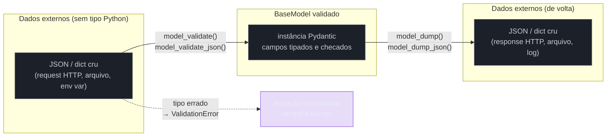

# Pydantic — validação em runtime

> [!abstract] TL;DR
> As três notas anteriores deste galho estabeleceram um limite claro: type hints são metadados que o interpretador CPython avalia e guarda, mas **nunca compara com o valor real** — uma hint errada não impede nada de rodar. **Pydantic vira essa regra de cabeça para baixo.** Uma classe que herda de `BaseModel` transforma cada anotação de tipo num contrato **imposto de fato**: ao instanciar (`Pedido(preco="dez")`), Pydantic checa cada campo contra o tipo declarado e levanta `ValidationError` — com mensagem estruturada, campo a campo — se algo não bater, em vez de aceitar silenciosamente. Não é mágica nem reflexão lenta: desde a **v2** (junho de 2023), todo o trabalho de parsing e validação roda em [`pydantic-core`](https://github.com/pydantic/pydantic-core), uma biblioteca escrita em Rust, o que trouxe ganhos de performance de várias vezes sobre a v1 (ainda comum em código legado, com nomes de método diferentes — `.dict()`/`.json()` em vez de `model_dump()`/`model_dump_json()`). Além de validar, `BaseModel` também serializa (`model_dump()`, `model_dump_json()`) e desserializa (`model_validate()`, `model_validate_json()`) de forma simétrica, e permite validação customizada além do tipo via `@field_validator`. É essa combinação — tipo declarado + validação em runtime + serialização simétrica — que faz do Pydantic a espinha dorsal de bibliotecas como o FastAPI (Galho 10, Web e APIs REST), onde cada `BaseModel` vira automaticamente o schema de um corpo de requisição ou resposta HTTP.

## O bug que as notas anteriores previram — e que não acontece aqui

Relembre o exemplo de abertura da [[01 - Type hints — fundamentos e gradual typing|nota 01]] deste galho: uma função `calcular_frete(peso: float, distancia: float) -> float` que aceita `calcular_frete("dois", 10)` sem reclamar de tipo — o único erro que aparece é um `TypeError` de operação inválida (`"dois" * 10`), não um erro relacionado à hint em si. Agora, o mesmo cenário, mas modelando o pedido como uma classe Pydantic em vez de parâmetros soltos de função:

```python
from pydantic import BaseModel


class Frete(BaseModel):
    peso: float
    distancia: float


Frete(peso="dois", distancia=10)
```

```text
Traceback (most recent call last):
  ...
pydantic_core._pydantic_core.ValidationError: 1 validation error for Frete
peso
  Input should be a valid number, unable to parse string as a number [type=float_parsing, input_value='dois', input_type=str]
```

A diferença salta aos olhos: o próprio ato de **instanciar** o objeto — `Frete(peso="dois", distancia=10)` — já dispara a checagem, e a checagem falha de forma explícita, com uma exceção nomeada (`ValidationError`) que aponta exatamente qual campo (`peso`), o tipo esperado (`float`) e o valor recebido (`'dois'`, uma `str`). Nenhuma ferramenta externa precisou rodar antes — nenhum `mypy`, nenhum `pyright` (nota 04 deste galho). A validação aconteceu **dentro do próprio programa em execução**, no exato momento em que o construtor `Frete(...)` foi chamado.

Essa é a virada conceitual que esta nota inteira desenvolve: as notas 01–05 tratam de uma família de ferramentas que leem hints **antes** do código rodar (checadores estáticos, análise off-line). Pydantic é a primeira ferramenta do galho que lê as mesmas hints e age **durante** a execução — e é exatamente por isso que ela aparece por último na sequência Adepto: só faz sentido depois de entender, com precisão, o que hints puros *não* fazem.

> [!question]- Então Pydantic "conserta" o problema de type hints não serem checados?
> Não exatamente — ela resolve um problema *diferente*, que só coincide em superfície. Type hints continuam sendo metadados opcionais para o interpretador CPython em qualquer contexto — inclusive dentro de uma classe Pydantic, o CPython não muda de comportamento. O que muda é que `BaseModel` **decide ler** essas anotações (via `__annotations__`/`typing.get_type_hints()`, o mesmo mecanismo de introspecção que a nota 01 já mostrou em miniatura no cenário de serialização) e **agir sobre elas** de forma ativa, comparando tipo declarado com valor real a cada instanciação. mypy/pyright pegam a mesma classe de erro **antes** do deploy, olhando o código-fonte sem executar nada; Pydantic pega esses erros **em runtime**, olhando dados reais que chegam de fora do programa (requisição HTTP, arquivo JSON, variável de ambiente) — dados que, por definição, nenhum checador estático consegue prever com antecedência, porque só existem quando o programa já está rodando.

## O que é

### `BaseModel`: a classe que transforma tipo em contrato

O núcleo do Pydantic é uma única ideia: você declara um schema como se fosse uma `dataclass` comum — atributos de classe anotados — mas herdando de [`pydantic.BaseModel`](https://pydantic.dev/docs/validation/latest/concepts/models/) em vez de usar `@dataclass`:

```python
from pydantic import BaseModel


class Usuario(BaseModel):
    nome: str
    idade: int
    ativo: bool = True
```

Sintaticamente, isso é quase indistinguível de uma `dataclass` ou de uma classe com anotações puras, como a `UsuarioDTO` que a nota 01 usou para ilustrar introspecção manual de `__annotations__`. A diferença inteira está no **construtor herdado de `BaseModel`**: ele não é um `__init__` gerado ingenuamente (que só atribui `self.nome = nome` sem checar nada), é um construtor que, para cada campo declarado, **valida o valor recebido contra o tipo anotado antes de aceitar a atribuição**:

```python
>>> u = Usuario(nome="Ana", idade=30)
>>> u
Usuario(nome='Ana', idade=30, ativo=True)

>>> Usuario(nome="Bruno", idade="trinta")
Traceback (most recent call last):
  ...
pydantic_core._pydantic_core.ValidationError: 1 validation error for Usuario
idade
  Input should be a valid integer, unable to parse string as an integer [type=int_parsing, input_value='trinta', input_type=str]
```

Repare em um detalhe sutil que costuma surpreender quem espera checagem "estrita" ao estilo Java: `Usuario(nome="Carla", idade="30")` — com `"30"` como **string numérica**, não `"trinta"` — **não** levanta erro. Pydantic, por padrão, faz **coerção** (converte `"30"` para o inteiro `30`) sempre que a conversão for razoável e sem perda de informação, em vez de exigir que o tipo do valor de entrada seja idêntico byte a byte ao tipo declarado. Essa é uma escolha de design deliberada — Pydantic nasceu para validar dados que chegam de fontes que não têm tipos Python nativos (JSON, formulários web, variáveis de ambiente, todas fontes que só produzem strings/números/booleanos "soltos") — e é configurável via [modo estrito](https://docs.pydantic.dev/latest/concepts/strict_mode/) quando coerção automática não é desejada.

> [!question]- Por que não usar `dataclass` com validação manual no `__post_init__`?
> Dá para fazer — e times fazem, em código legado ou quando não querem a dependência extra. Mas o `__post_init__` de uma `dataclass` exige escrever a validação **à mão**, campo a campo, para cada classe — exatamente o tipo de código repetitivo que a nota 01 mostrou em `montar_a_partir_de_dict()` (uma versão artesanal e simplificada do que Pydantic faz). `BaseModel` generaliza esse padrão: lê a anotação de tipo uma vez, e o motor de validação (`pydantic-core`) sabe como validar `int`, `str`, `list[X]`, `dict[K, V]`, `Optional[X]`, `Literal[...]`, `Union[X, Y]`, sub-`BaseModel`s aninhados, e praticamente qualquer composição desses tipos — sem que você escreva um único `if isinstance(...)`. É o mesmo ganho que motiva usar um ORM em vez de escrever SQL cru para cada query: menos código repetido, motor testado e mantido por terceiros, e uma superfície de erro consistente (sempre `ValidationError`, nunca um `TypeError` genérico misturado com regra de negócio).

### Campos aninhados: o mesmo mecanismo, recursivamente

O que dá a Pydantic seu poder real em cenários de API é validar estruturas **aninhadas** — um `BaseModel` dentro de outro — com a mesma sintaxe de tipo comum:

```python
from pydantic import BaseModel


class Endereco(BaseModel):
    rua: str
    cidade: str
    cep: str


class Cliente(BaseModel):
    nome: str
    endereco: Endereco
    tags: list[str] = []


cliente = Cliente(
    nome="Diego",
    endereco={"rua": "Rua A", "cidade": "Recife", "cep": "50000-000"},
    tags=["vip", "recorrente"],
)
```

Repare: o valor passado para `endereco` foi um **dicionário puro** (`{"rua": ..., "cidade": ..., "cep": ...}`), não uma instância de `Endereco` já construída — e Pydantic constrói o `Endereco` internamente, validando cada campo dele, antes de atribuir o resultado a `cliente.endereco`. Isso é exatamente o formato em que dados chegam de fora do programa (um JSON desserializado por `json.loads()` vira dicionários e listas aninhados, nunca objetos Python tipados) — e é por isso que Pydantic consegue validar o corpo inteiro de uma requisição HTTP recebendo, na prática, só dicionários e strings, sem que quem chama precise pré-construir cada objeto aninhado manualmente.

## Field validators: validação além do tipo

Checar que `idade` é um `int` resolve só parte do problema — muitos contratos de dados têm regras que **nenhuma anotação de tipo consegue expressar**: "idade não pode ser negativa", "e-mail precisa conter `@`", "senha precisa ter no mínimo 8 caracteres". Para esses casos, Pydantic v2 expõe o decorator [`@field_validator`](https://docs.pydantic.dev/latest/api/functional_validators/), aplicado a um método da própria classe:

```python
from pydantic import BaseModel, field_validator


class Usuario(BaseModel):
    nome: str
    idade: int
    email: str

    @field_validator("idade")
    @classmethod
    def idade_deve_ser_positiva(cls, valor: int) -> int:
        if valor < 0:
            raise ValueError("idade não pode ser negativa")
        return valor

    @field_validator("email")
    @classmethod
    def email_deve_ter_arroba(cls, valor: str) -> str:
        if "@" not in valor:
            raise ValueError("e-mail inválido: falta '@'")
        return valor
```

```text
>>> Usuario(nome="Eva", idade=-5, email="eva-sem-arroba")
pydantic_core._pydantic_core.ValidationError: 2 validation errors for Usuario
idade
  Value error, idade não pode ser negativa [type=value_error, ...]
email
  Value error, e-mail inválido: falta '@' [type=value_error, ...]
```

Alguns pontos de mecanismo que valem nomear com precisão:

- **O validator recebe o valor já coercido pelo tipo declarado.** No exemplo, `idade_deve_ser_positiva` recebe um `int` de verdade, não uma string — a validação de tipo (`int`) já rodou antes do validator customizado ser chamado, na ordem padrão (`mode="after"`, o default). Pydantic também suporta `mode="before"`, para interceptar o valor **antes** da coerção de tipo — útil para normalizar um formato bagunçado (`" 30 "` com espaços, por exemplo) antes que a checagem de tipo padrão rejeite algo que, depois de limpo, seria válido.
- **`raise ValueError` é a forma correta de reportar falha dentro de um validator** — Pydantic intercepta essa exceção e a converte automaticamente numa entrada da `ValidationError` agregada, junto com qualquer outro campo que também tenha falhado (repare que, no exemplo acima, `idade` **e** `email` aparecem juntos numa única exceção — Pydantic acumula todos os erros de uma instanciação antes de levantar, em vez de parar no primeiro).
- **O validator deve retornar o valor** (ou uma versão transformada dele) — é esse valor de retorno que efetivamente vira o atributo do objeto, o que permite um validator também **normalizar** dados (`return valor.strip().lower()` para um e-mail, por exemplo), não só rejeitá-los.

Para regras que dependem de **mais de um campo ao mesmo tempo** (ex.: "senha e confirmação de senha precisam ser iguais"), Pydantic oferece `@model_validator(mode="after")`, que roda depois que todos os campos individuais já passaram — fora do escopo desta nota introdutória, mas vale saber que existe como próximo passo natural.

### `Field()`: restrições declarativas, sem escrever um validator

Nem toda regra precisa de um método `@field_validator` inteiro. Para restrições comuns — comprimento mínimo/máximo, intervalo numérico, valor obrigatório com metadado extra — Pydantic expõe [`Field()`](https://pydantic.dev/docs/validation/latest/concepts/fields/), usado como valor padrão do atributo, que descreve a restrição de forma **declarativa**:

```python
from pydantic import BaseModel, Field


class Produto(BaseModel):
    nome: str = Field(min_length=1, max_length=100)
    preco: float = Field(gt=0, description="Preço em reais, deve ser positivo")
    quantidade: int = Field(default=1, ge=0, le=1000)
```

```text
>>> Produto(nome="", preco=10.0)
pydantic_core._pydantic_core.ValidationError: 1 validation error for Produto
nome
  String should have at least 1 character [type=string_too_short, input_value='', input_type=str]

>>> Produto(nome="Caneta", preco=-5.0)
pydantic_core._pydantic_core.ValidationError: 1 validation error for Produto
preco
  Input should be greater than 0 [type=greater_than, input_value=-5.0, input_type=float]
```

A regra prática para escolher entre os dois mecanismos: `Field()` cobre restrições **descritivas** (comprimento, intervalo, regex via `pattern=`, valor obrigatório vs. opcional) que o próprio `pydantic-core`, em Rust, já sabe checar sem rodar nenhum código Python adicional — por isso é a opção mais rápida quando basta. `@field_validator` entra quando a regra exige **lógica** que não se reduz a uma restrição fixa (comparar contra um valor calculado, consultar outro campo, normalizar formato). Nada impede combinar os dois no mesmo campo — `Field()` para a forma, `@field_validator` para a lógica que sobra.

`Field()` também permite renomear como um campo aparece na serialização, via `alias` — útil quando o JSON de entrada usa uma convenção diferente do Python (`camelCase` de uma API JavaScript, por exemplo, mapeado para `snake_case` interno):

```python
class Usuario(BaseModel):
    nome_completo: str = Field(alias="fullName")


Usuario.model_validate({"fullName": "Ana Souza"})
# Usuario(nome_completo='Ana Souza')
```

> [!warning] `@field_validator` (v2) não é a mesma API que `@validator` (v1)
> Código legado escrito para Pydantic v1 usa `@validator("campo")`, sem `@classmethod` explícito e com uma assinatura de parâmetros ligeiramente diferente (`values` como dicionário dos campos já validados, em vez de acesso via `info.data`). A v2 mantém `@validator` funcionando, mas **deprecated** — um aviso de depreciação aparece a cada uso, e a [documentação oficial de migração](https://pydantic.dev/docs/validation/latest/get-started/migration/) recomenda migrar para `@field_validator` explicitamente. Ver mais detalhes na seção v1 vs. v2 adiante.

## Serialização e desserialização: o caminho de volta

Validar dados de entrada é metade do papel de Pydantic — a outra metade é converter um `BaseModel` já validado de volta para formatos "burros" (dicionário puro, JSON), para enviar por rede, salvar em arquivo, ou logar. A API v2 usa o prefixo `model_` para deixar explícito que esses métodos pertencem ao Pydantic, não ao Python (evitando colidir com nomes de campo do usuário, como um campo chamado `dict` ou `json` — um problema real que a v1 tinha, coberto na próxima seção):

```python
class Produto(BaseModel):
    nome: str
    preco: float
    tags: list[str] = []


produto = Produto(nome="Teclado", preco=250.0, tags=["periférico"])

produto.model_dump()
# {'nome': 'Teclado', 'preco': 250.0, 'tags': ['periférico']}

produto.model_dump_json()
# '{"nome":"Teclado","preco":250.0,"tags":["periférico"]}'

Produto.model_validate({"nome": "Mouse", "preco": 80.0})
# Produto(nome='Mouse', preco=80.0, tags=[])

Produto.model_validate_json('{"nome": "Monitor", "preco": 900.0}')
# Produto(nome='Monitor', preco=900.0, tags=[])
```

O padrão de nomenclatura é simétrico e vale memorizar como par:

| Direção | Método | Formato de entrada/saída |
|---|---|---|
| Objeto → dicionário Python | `model_dump()` | `dict` |
| Objeto → string JSON | `model_dump_json()` | `str` (JSON) |
| Dicionário → objeto validado | `model_validate(dado)` | aceita `dict` (ou qualquer mapeamento) |
| String JSON → objeto validado | `model_validate_json(texto)` | aceita `str`/`bytes` de JSON |



**Pydantic em uma frase**: `BaseModel` transforma type hints num contrato checado de fato em runtime — validando na entrada (`model_validate`/construtor) e serializando na saída (`model_dump`) de forma simétrica, com `pydantic-core` (Rust) fazendo o trabalho pesado por baixo.

## Pydantic v2 vs. v1: o que muda, e por que importa saber

A [Pydantic v2 foi lançada em 30 de junho de 2023](https://docs.pydantic.dev/latest/), com o **core de validação inteiramente reescrito em Rust**, empacotado como [`pydantic-core`](https://github.com/pydantic/pydantic-core) e exposto ao Python via [PyO3](https://pyo3.rs/) (bindings Rust↔Python). A v1, escrita majoritariamente em Python puro (com alguma aceleração via Cython opcional), continua existindo — e continua presente em código legado real, especialmente em projetos que ainda não migraram, ou que dependem de bibliotecas de terceiros travadas numa versão antiga do Pydantic.

### Ganho de performance: por que reescrever em Rust

Benchmarks comparando as duas versões mostram ganhos expressivos — a documentação e artigos técnicos independentes citam a v2 rodando **entre 4x e 50x mais rápido** que a v1 dependendo do tipo de dado validado, com uma média frequentemente citada em torno de **17x mais rápido** para um modelo com uma mistura comum de campos. O motivo estrutural: na v1, cada validação de campo passava por várias camadas de código Python interpretado (lento por natureza, como as notas do Galho 1 — Core — já explicaram sobre o pipeline do CPython); na v2, o loop de validação inteiro — percorrer os campos, checar tipo, tentar coerção, montar mensagens de erro — roda como código de máquina nativo compilado a partir de Rust, e o Python só entra em cena para orquestrar a chamada e receber o resultado já pronto.

> [!question]- Isso significa que Pydantic v2 não é mais "Python de verdade"?
> Não no sentido que importa para quem só usa a biblioteca — a API pública (`BaseModel`, `model_dump()`, `@field_validator`, etc.) continua sendo Python comum, importada com `import pydantic` normalmente, sem nenhuma etapa extra de build no seu próprio código. `pydantic-core` é uma **extensão binária** compilada e distribuída via `pip` como qualquer outra dependência com componente em C/Rust (o próprio NumPy tem núcleo em C, como o Galho 1 desta trilha já mencionou de passagem) — o usuário final nunca precisa ter um compilador Rust instalado para simplesmente `pip install pydantic`. O padrão é o mesmo de sempre no ecossistema Python: escrever a API em Python (ergonômica, dinâmica) e empurrar o hot path de performance para uma linguagem de sistemas por baixo.

### Diferenças de nomenclatura: a armadilha real de quem lê código legado

A mudança que mais gera confusão prática — inclusive em entrevistas e em code review de projetos que misturam versões — é o **renomeio sistemático de métodos**, adotando o prefixo `model_` na v2 para evitar colisão com nomes de campos do usuário (um `BaseModel` v1 com um campo chamado `dict` ou `copy` corrompia silenciosamente o método herdado do mesmo nome — um bug de design que a v2 corrigiu de propósito):

| Pydantic v1 | Pydantic v2 | O que faz |
|---|---|---|
| `.dict()` | `.model_dump()` | objeto → `dict` Python |
| `.json()` | `.model_dump_json()` | objeto → string JSON |
| `.parse_obj(dado)` | `.model_validate(dado)` | `dict` → objeto validado |
| `.parse_raw(texto)` | `.model_validate_json(texto)` | string JSON → objeto validado |
| `.copy()` | `.model_copy()` | cópia (rasa ou profunda) do objeto |
| `.construct()` | `.model_construct()` | cria instância **sem** validar (uso avançado) |
| `.schema()` | `.model_json_schema()` | gera JSON Schema da classe |
| `__fields__` | `model_fields` | dicionário de metadados dos campos |
| `class Config:` (classe interna) | `model_config = ConfigDict(...)` | configuração do modelo |
| `@validator` | `@field_validator` | validação customizada de campo |
| `@root_validator` | `@model_validator` | validação cruzada entre campos |

> [!warning] Métodos v1 ainda existem na v2 — mas como camada de compatibilidade deprecated
> Chamar `.dict()` numa classe Pydantic v2 **funciona**, mas emite um aviso de depreciação — é uma ponte de migração, não uma API paralela permanente. Código que mistura `.dict()` (estilo v1) com `model_validate()` (estilo v2) no mesmo projeto normalmente é sinal de uma migração incompleta de v1 para v2, não uma escolha de estilo — vale sinalizar em code review. A [documentação oficial de migração](https://pydantic.dev/docs/validation/latest/get-started/migration/) documenta a lista completa de renomeios e mudanças de comportamento (inclusive validação mais estrita por padrão em alguns tipos, como `int` não aceitar mais `float` truncado silenciosamente).

### Por que isso importa para quem mantém código legado

Times que herdam uma base de código Python com dependências antigas frequentemente encontram Pydantic v1 travado por uma biblioteca de terceiros incompatível com v2 (o caso mais citado historicamente foi o próprio FastAPI antes de suas versões mais recentes garantirem suporte total à v2). Reconhecer `.dict()`/`.json()`/`Config` como "isso é v1" — em vez de assumir que é um estilo de código só um pouco antigo — é o tipo de sinal que orienta rapidamente uma investigação de legado: checar `pip show pydantic` para confirmar a versão instalada antes de propor qualquer refatoração que assuma API v2.

## Casos práticos

### Cenário 1: validar configuração de aplicação a partir de variáveis de ambiente

Um padrão comum em produção: carregar configuração de variáveis de ambiente (que chegam sempre como string, mesmo quando representam número ou booleano) e validar contra um schema antes do resto da aplicação sequer inicializar:

```python
import os
from pydantic import BaseModel, field_validator


class ConfigApp(BaseModel):
    debug: bool
    porta: int
    max_conexoes: int

    @field_validator("porta")
    @classmethod
    def porta_valida(cls, valor: int) -> int:
        if not (1 <= valor <= 65535):
            raise ValueError(f"porta fora do intervalo válido: {valor}")
        return valor


dados_env = {
    "debug": os.environ.get("DEBUG", "false"),
    "porta": os.environ.get("PORTA", "8000"),
    "max_conexoes": os.environ.get("MAX_CONEXOES", "100"),
}

config = ConfigApp.model_validate(dados_env)
```

Se `PORTA=99999` estiver definida no ambiente por engano, `model_validate()` levanta `ValidationError` **antes** de qualquer parte da aplicação tentar abrir um socket nessa porta — falhando cedo e com uma mensagem clara, em vez de um erro obscuro de rede minutos depois. (Na prática, times que fazem exatamente esse padrão em escala tendem a usar [`pydantic-settings`](https://docs.pydantic.dev/latest/concepts/pydantic_settings/), um pacote complementar oficial que automatiza a leitura de variáveis de ambiente para um `BaseSettings` — fora do escopo desta nota, mas vale saber que existe como próximo passo natural depois de dominar `BaseModel`.)

### Cenário 2: a ponte para FastAPI (Galho 10 — Web e APIs REST)

O uso mais visível de Pydantic no ecossistema Python moderno é dentro do [FastAPI](https://fastapi.tiangolo.com/), um framework web que usa `BaseModel` **nativamente** para declarar o corpo (body) esperado de uma requisição HTTP, e valida esse corpo automaticamente antes mesmo do código da rota rodar:

```python
from fastapi import FastAPI
from pydantic import BaseModel

app = FastAPI()


class ItemPedido(BaseModel):
    nome: str
    preco: float
    quantidade: int = 1


@app.post("/pedidos")
def criar_pedido(item: ItemPedido):
    return {"total": item.preco * item.quantidade}
```

Sem uma linha de validação escrita à mão dentro de `criar_pedido`, o FastAPI já garante, antes de a função ser chamada, que o corpo JSON recebido tem `nome` (string), `preco` (número) e, opcionalmente, `quantidade` (inteiro, com default `1`) — e devolve automaticamente um erro HTTP 422 (Unprocessable Entity) estruturado, com os mesmos detalhes campo a campo de uma `ValidationError`, se algo não bater. É exatamente o mecanismo desta nota — `BaseModel` validando ao instanciar — só que a instanciação, nesse caso, é feita pelo próprio FastAPI, a partir do corpo bruto da requisição HTTP, antes de invocar a função da rota. O galho de Web e APIs REST retoma esse padrão em profundidade — inclusive documentação automática de schema (`model_json_schema()`, mencionado na tabela de renomeios acima, é literalmente o que o FastAPI usa para gerar a página `/docs` do Swagger/OpenAPI).

### Cenário 3: agregando erros de uma estrutura aninhada inteira

Um caso que mostra por que a `ValidationError` estruturada vale mais que uma exceção genérica: importar um lote de pedidos vindo de um arquivo CSV convertido para JSON, onde vários registros podem ter problemas diferentes ao mesmo tempo — e o objetivo é reportar **todos** de uma vez, não parar no primeiro erro:

```python
from pydantic import BaseModel, ValidationError


class ItemPedido(BaseModel):
    produto: str
    quantidade: int
    preco_unitario: float


class Pedido(BaseModel):
    cliente: str
    itens: list[ItemPedido]


dados_brutos = {
    "cliente": "Fernanda",
    "itens": [
        {"produto": "Caneta", "quantidade": 3, "preco_unitario": 2.5},
        {"produto": "Caderno", "quantidade": "cinco", "preco_unitario": 15.0},
    ],
}

try:
    pedido = Pedido.model_validate(dados_brutos)
except ValidationError as erro:
    for detalhe in erro.errors():
        print(detalhe["loc"], "-", detalhe["msg"])
```

```text
('itens', 1, 'quantidade') - Input should be a valid integer, unable to parse string as an integer
```

O método `.errors()` de uma `ValidationError` devolve uma lista de dicionários, cada um com `loc` (o **caminho completo** até o campo problemático — aqui, "segundo item da lista `itens`, campo `quantidade`") e `msg` (a mensagem legível). Esse formato estruturado é o que permite a uma aplicação real — seja um endpoint de API, seja um script de importação em lote — transformar uma falha de validação em algo acionável para quem está enviando os dados: apontar exatamente qual linha do CSV original, qual campo, e o que estava errado, em vez de um traceback genérico que exige investigação manual.

## Armadilhas comuns

> [!warning] Achar que Pydantic substitui type hints do resto do código
> `BaseModel` valida em runtime **os campos declarados dentro dele** — não transforma o resto do programa em código com tipos checados. Uma função qualquer que recebe um `Usuario` já validado continua podendo, internamente, atribuir qualquer valor a qualquer variável sem checagem nenhuma (a menos que essa variável também seja um campo de outro `BaseModel`). Pydantic resolve validação **na fronteira** onde dados externos entram no sistema — não é um substituto geral para mypy/pyright (nota 04), que cobrem o código Python "comum" fora de modelos Pydantic.

> [!warning] Confiar que coerção automática sempre faz o que você espera
> Coerção padrão do Pydantic (`"30"` → `30`) é conveniente, mas às vezes surpreende: `bool("false")` em Python puro é `True` (qualquer string não vazia é truthy), mas Pydantic reconhece um conjunto específico de strings como booleano (`"true"`/`"false"`/`"1"`/`"0"`, entre outras) de forma mais criteriosa que o `bool()` nativo — o comportamento exato está documentado em [conversion table](https://docs.pydantic.dev/latest/concepts/conversion_table/) da documentação oficial. Quando o contrato exige tipo exato sem nenhuma coerção (ex.: um sistema financeiro que não quer aceitar `"100"` como equivalente a `100`), o [modo estrito](https://docs.pydantic.dev/latest/concepts/strict_mode/) (`Field(strict=True)` ou `model_config = ConfigDict(strict=True)`) desliga essa conveniência.

> [!warning] Misturar API v1 e v2 num mesmo projeto sem perceber
> Como visto na seção de nomenclatura, `.dict()`/`.json()`/`class Config` funcionam na v2 só como camada de compatibilidade deprecated. Um projeto que tem parte do código chamando `model_dump()` e parte chamando `.dict()` normalmente não é uma escolha de estilo — é sinal de migração incompleta (código novo escrito com a API v2, código antigo nunca atualizado). Vale rodar uma busca pelo projeto (`grep -rn '\.dict()\|\.json()\|@validator\b'`) antes de assumir que uma base de código já está 100% na v2.

> [!warning] Esquecer que `@field_validator` precisa de `@classmethod`
> Diferente de um método de instância comum, `@field_validator` espera ser decorado também com `@classmethod` (a própria assinatura recebe `cls`, não `self` — porque a validação acontece **durante** a construção do objeto, antes de existir um `self` totalmente formado). Omitir `@classmethod` costuma produzir um erro de configuração do Pydantic na hora de definir a classe, não um erro sutil em runtime — o que ao menos facilita notar o problema cedo.

## Em entrevista

- **"Qual a diferença entre type hints puros e Pydantic?"** Type hints (PEP 484/526, nota 01 deste galho) são metadados que o interpretador CPython avalia e guarda, mas nunca compara com o valor real — checagem, quando existe, vem de ferramentas externas *antes* da execução (mypy/pyright, nota 04). Pydantic lê essas mesmas anotações, mas usa-as para validar **de fato**, em runtime, no momento em que um `BaseModel` é instanciado — levantando `ValidationError` se o dado não bater com o tipo declarado, em vez de aceitar silenciosamente.
- **"O que é `pydantic-core` e por que ele existe?"** É o motor de validação da Pydantic v2 (lançada em junho de 2023), escrito em Rust e exposto ao Python via PyO3. Existe porque validar dados campo a campo em Python puro (como a v1 fazia) é relativamente lento; mover esse hot path para código compilado nativo trouxe ganhos de performance citados entre 4x e 50x (média em torno de 17x) sobre a v1, mantendo a API pública em Python comum.
- **"Como validar dados customizados além do tipo declarado?"** `@field_validator("campo")`, decorado também com `@classmethod`, recebendo o valor já coercido pelo tipo (por padrão, `mode="after"`) e podendo levantar `ValueError` para reportar falha — Pydantic converte isso automaticamente numa entrada estruturada da `ValidationError` agregada. Para regras que dependem de múltiplos campos, `@model_validator(mode="after")` é o equivalente cross-field.
- **"Diferença entre v1 e v2 na prática?"** Além do core em Rust, a v2 renomeou sistematicamente os métodos públicos com o prefixo `model_` (`.dict()`→`model_dump()`, `.json()`→`model_dump_json()`, `.parse_obj()`→`model_validate()`) para evitar colisão com campos do usuário que tivessem o mesmo nome de um método antigo, além de trocar `@validator`/`@root_validator` por `@field_validator`/`@model_validator` e `class Config` por `model_config = ConfigDict(...)`. Métodos v1 continuam funcionando na v2, mas como camada deprecated.
- **"Onde Pydantic aparece em produção, além de validação isolada?"** Como base de FastAPI para validar corpo de requisição/resposta HTTP automaticamente (Galho 10, Web e APIs REST) — cada `BaseModel` vira, ao mesmo tempo, contrato de validação e fonte do schema OpenAPI gerado automaticamente. Também aparece em `pydantic-settings` para configuração de aplicação a partir de variáveis de ambiente, e como schema de saída estruturada em bibliotecas de IA/LLM que pedem resposta em formato fixo.

> [!question]- O entrevistador pergunta: "por que não usar `isinstance()` manualmente em vez de trazer uma dependência inteira?"
> Uma resposta de nível sênior separa dois problemas: validar **um** valor contra **um** tipo simples (`isinstance(x, int)`) é trivial e não precisa de biblioteca nenhuma — mas validar uma **estrutura inteira**, com campos aninhados, listas de objetos, tipos opcionais, coerção consistente, regras customizadas e mensagens de erro agregadas e estruturadas por campo, rapidamente vira código repetitivo, difícil de manter e fácil de deixar inconsistente entre módulos diferentes do mesmo projeto (exatamente o problema que `montar_a_partir_de_dict()`, na nota 01, ilustrou em miniatura). Pydantic generaliza esse trabalho, testado por uma comunidade grande, mantido ativamente, e — desde a v2 — rápido o bastante para não ser gargalo nem em código de alto volume, como APIs web de produção.

## How to explain in English

> Type hints in plain Python (PEP 484) are optional metadata the interpreter never checks against real values — Pydantic flips that. A class inheriting from `BaseModel` turns each type annotation into an enforced contract: instantiating it validates every field against its declared type and raises a structured `ValidationError` if something doesn't match, instead of silently accepting bad data. Since Pydantic v2, released in June 2023, all of that validation logic runs in `pydantic-core`, a Rust library exposed to Python via PyO3 — benchmarks put v2 somewhere between 4x and 50x faster than v1, commonly cited around 17x for a typical mixed-field model. Beyond type checking, `field_validator` adds custom rules a type alone can't express (range checks, format rules), and the model round-trips symmetrically through `model_dump()`/`model_dump_json()` for serialization and `model_validate()`/`model_validate_json()` for deserialization — v2's systematic `model_` prefix, replacing v1's `.dict()`/`.json()`/`.parse_obj()`, exists specifically to avoid clashing with user-defined field names. This is also the mechanism FastAPI builds on: every `BaseModel` you declare as a request or response type gets validated automatically before your route function ever runs.

| PT-BR | English |
|---|---|
| validação em runtime | runtime validation |
| checagem em tempo de instanciação | validation on instantiation |
| coerção de tipo | type coercion |
| modo estrito | strict mode |
| validador de campo | field validator |
| validação cruzada entre campos | cross-field validation |
| serialização / desserialização | serialization / deserialization |
| esquema JSON | JSON schema |
| camada de compatibilidade deprecated | deprecated compatibility layer |
| falha cedo (fail fast) | fail fast |

## O que vem a seguir

Esta nota fechou o arco que as notas 01–05 abriram: depois de estabelecer que hints são metadados sem enforcement (01), ampliar o vocabulário de tipos exprimíveis (02–03, 05) e ver a primeira ferramenta que compara hint com realidade *antes* da execução (04, mypy/pyright), Pydantic mostrou a segunda forma de checagem real — desta vez *durante* a execução, ao instanciar um `BaseModel`. As duas formas resolvem problemas complementares, não concorrentes: mypy/pyright pegam erros no seu próprio código-fonte antes do deploy; Pydantic pega erros nos dados que chegam de fora, em runtime, onde nenhum checador estático tem visibilidade.

- [[05 - TypedDict, Literal, NewType e Final|05 — TypedDict, Literal, NewType e Final]] — tipos estruturados que Pydantic também entende nativamente ao validar campos (um `Literal["GET", "POST"]` funciona como valor de campo tanto para mypy quanto para `BaseModel`).
- [[07 - Typing avançado — overload, Self, ParamSpec|07 — Typing avançado: overload, Self, ParamSpec]] — próxima nota do galho, já na fronteira Adepto→Magus.
- [[08 - Capstone — tipagem moderna|08 — Capstone: tipagem moderna]] — recapitula o galho inteiro, incluindo um exemplo de client de API tipado ponta a ponta com Pydantic validando a resposta.

## Veja também

- [[03-Dominios/Tecnologia/Python/Tipagem moderna/index|Tipagem moderna]] — MOC do galho.
- [[03-Dominios/Tecnologia/Python/index|Trilha Python]] — MOC central.
- Galho 10 (Web e APIs REST, ainda não escrito) — cobre FastAPI e o uso de `BaseModel` como schema de requisição/resposta em profundidade.

## Fontes

- Pydantic. *Models*. pydantic.dev, documentação oficial. https://pydantic.dev/docs/validation/latest/concepts/models/ (acessado em 2026-07-10)
- Pydantic. *Validators*. pydantic.dev, documentação oficial. https://pydantic.dev/docs/validation/latest/concepts/validators/ (acessado em 2026-07-10)
- Pydantic. *Functional Validators — `field_validator`, `model_validator`*. docs.pydantic.dev. https://docs.pydantic.dev/latest/api/functional_validators/ (acessado em 2026-07-10)
- Pydantic. *Migration Guide (v1 → v2)*. pydantic.dev. https://pydantic.dev/docs/validation/latest/get-started/migration/ (acessado em 2026-07-10)
- Pydantic. *Introducing Pydantic V2 — Key Features*. pydantic.dev/articles. https://pydantic.dev/articles/pydantic-v2 (acessado em 2026-07-10)
- Pydantic. *Strict Mode*. docs.pydantic.dev. https://docs.pydantic.dev/latest/concepts/strict_mode/ (acessado em 2026-07-10)
- Pydantic. *Conversion Table*. docs.pydantic.dev. https://docs.pydantic.dev/latest/concepts/conversion_table/ (acessado em 2026-07-10)
- pydantic-core (repositório oficial, motor de validação em Rust). GitHub. https://github.com/pydantic/pydantic-core (acessado em 2026-07-10)
- FastAPI. *Documentação oficial* — uso de `BaseModel` para request/response bodies. https://fastapi.tiangolo.com/ (acessado em 2026-07-10)
- Real Python. *Pydantic: Simplify Data Validation in Python*. https://realpython.com/python-pydantic/ (acessado em 2026-07-10)
- Ramalho, L. *Fluent Python: Clear, Concise, and Effective Programming*, 2ª ed. — capítulo "Type Hints in Functions" (contraste entre hints estáticos e validação em runtime). O'Reilly Media, 2022.

Consultado em 2026-07-10.
