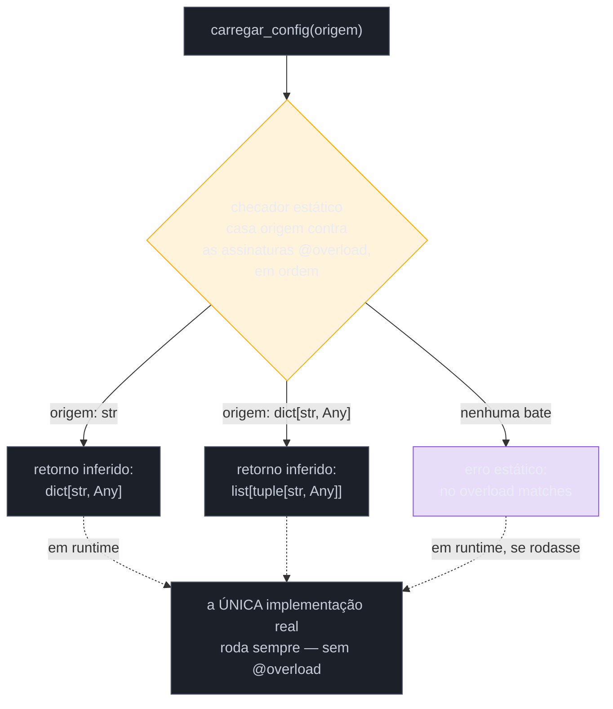
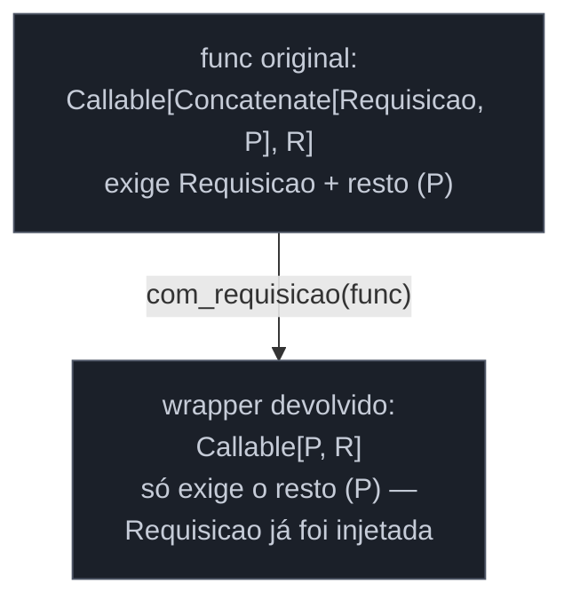
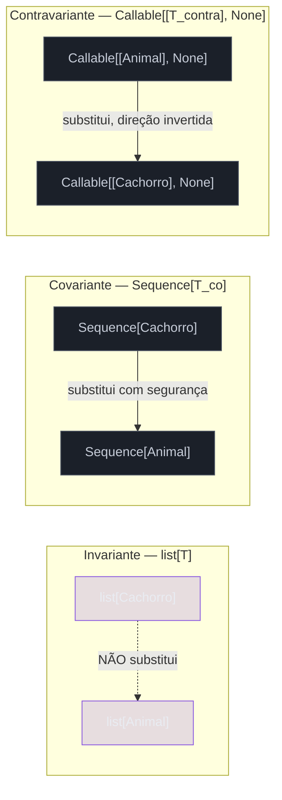

# Typing avançado — overload, Self, ParamSpec

> [!abstract] TL;DR
> Esta nota fecha três lacunas que sobram depois de dominar `TypeVar`/`Generic` ([[03 - Generics — TypeVar, Generic e sintaxe moderna|nota 03]]): funções cujo tipo de retorno depende do **valor do tipo de entrada** (`@typing.overload`, só para o checador — a implementação real fica sem decorator, uma função só); métodos que retornam **a própria instância**, de forma que subclasses não "percam" o tipo ao herdar (`Self`, [PEP 673](https://peps.python.org/pep-0673/), Python 3.11+); e decorators genéricos que **preservam a assinatura exata** da função decorada, sem cair em `*args: Any, **kwargs: Any` (`ParamSpec`/`Concatenate`, [PEP 612](https://peps.python.org/pep-0612/), Python 3.10+). No caminho, retoma `TypeVar`/`Generic` sob um ângulo novo — **variância**: por que `list[Cachorro]` não é um `list[Animal]` seguro, mas `Sequence[Cachorro]` é. Fecha com uma seção deliberadamente honesta: nem todo código merece esse nível de rigor de tipos — `Any` como escape hatch legítimo, e o cálculo de ROI entre tipar um script descartável e tipar uma biblioteca que outras pessoas vão consumir.

## O problema: uma função, vários "contratos" de tipo

A [[03 - Generics — TypeVar, Generic e sintaxe moderna|nota 03]] resolveu "o tipo que entra é o mesmo tipo que sai" com `TypeVar`. Mas existe uma categoria de função comum em bibliotecas de produção onde essa amarração simples não basta — porque o tipo de retorno não depende de "o mesmo T que entrou", depende de **qual variante** da entrada foi usada. Considere uma função utilitária que processa uma configuração, aceitando ou um `dict` cru ou um caminho de arquivo, e devolvendo tipos diferentes conforme o caso:

```python
def carregar_config(origem):
    if isinstance(origem, str):
        with open(origem) as arquivo:
            return json.load(arquivo)   # dict[str, Any]
    return list(origem.items())          # list[tuple[str, Any]]
```

Anotar isso com um `TypeVar` simples não funciona — não existe um único `T` amarrando "string entra, lista de tuplas sai" e "dict entra, dict sai" ao mesmo tempo; são dois contratos **diferentes**, cada um válido para um subconjunto específico dos tipos de entrada. A saída ingênua é anotar o retorno como uma união (`dict[str, Any] | list[tuple[str, Any]]`), mas isso empurra o problema para quem *chama* a função: todo call site precisa de um `isinstance` ou `cast` manual para recuperar o tipo específico, mesmo quando o próprio chamador já sabe, estaticamente, que tipo passou como argumento.

> [!question]- Por que não simplesmente separar em duas funções com nomes diferentes?
> Às vezes é exatamente a solução certa — e vale considerar antes de sacar `@overload`. Mas há casos legítimos onde uma única função pública, com um nome coeso, é a API desejada por quem consome a biblioteca (o exemplo canônico da própria [documentação do `typing`](https://docs.python.org/3/library/typing.html#typing.overload) é `len()`: aceita qualquer `Sized`, mas o comportamento interno varia). Separar em `carregar_config_de_arquivo` e `carregar_config_de_dict` resolve o problema de tipagem trivialmente, ao custo de uma API mais verbosa e menos descobrível. `@overload` existe para os casos em que o custo de duas funções é maior que o custo de aprender mais uma ferramenta de tipagem — não é a ferramenta certa para toda função com `if isinstance`.

## `@typing.overload`: várias assinaturas, uma implementação

`@overload` resolve isso deixando você declarar **múltiplas assinaturas de tipo** para a mesma função — uma por combinação relevante de tipo de entrada/saída — sem escrever múltiplas implementações. Cada assinatura decorada com `@overload` é, para o Python em runtime, só um corpo vazio (`...`); **não é executada nunca**. A implementação real vem por último, sem o decorator, com uma assinatura "genérica o bastante" para cobrir todos os casos anteriores:

```python
from typing import overload

@overload
def carregar_config(origem: str) -> dict[str, Any]: ...
@overload
def carregar_config(origem: dict[str, Any]) -> list[tuple[str, Any]]: ...

def carregar_config(origem: str | dict[str, Any]) -> dict[str, Any] | list[tuple[str, Any]]:
    if isinstance(origem, str):
        with open(origem) as arquivo:
            return json.load(arquivo)
    return list(origem.items())
```

Um checador estático (`mypy`, `pyright` — ver [[04 - mypy e pyright — checagem estática na prática|nota 04]] deste galho) lê as três definições e monta a tabela de despacho estático: chamando `carregar_config("config.json")`, ele casa contra a primeira assinatura `@overload` (`str -> dict`) e infere o retorno como `dict[str, Any]` — sem união, sem `isinstance` do lado de quem chama. Chamando `carregar_config({"a": 1})`, casa contra a segunda, e o retorno é inferido como `list[tuple[str, Any]]`.



> [!warning] A implementação final NÃO leva `@overload`, e sua assinatura precisa cobrir todos os overloads
> O erro mais comum de quem começa a usar `@overload` é esquecer que a função de implementação — a única que de fato roda — não é mais um `@overload` entre outros; ela é o corpo real, e sua assinatura (tipos de parâmetro e retorno) precisa ser **compatível** com cada assinatura declarada acima dela (o checador valida isso). Esquecer o `str | dict[str, Any]` na implementação e deixar só `origem` sem anotação nenhuma ainda funciona em runtime (Python não olha para tipos), mas o checador perde a garantia de que a implementação de fato cumpre os contratos anunciados pelos overloads — um `mypy --strict` sinaliza isso como erro (`Overloaded function implementation does not accept all possible arguments of signature ...`).

**`@typing.overload` em uma frase:** ele declara múltiplos contratos de tipo para uma mesma função pública — "se a entrada for X, a saída é Y; se for W, a saída é Z" — que só o checador estático enxerga; a função que de fato roda em runtime é uma única implementação, sem o decorator, escrita para satisfazer todos os contratos anunciados.

## `Self`: quando o método precisa devolver "a própria classe, seja lá qual for"

Um problema parecido, mas de natureza diferente, aparece em métodos que devolvem a própria instância — o padrão *builder*/método encadeado, muito comum em bibliotecas de configuração fluente (`query.filter(...).order_by(...).limit(10)`). A tentação inicial, ao tipar isso, é anotar o retorno com o nome literal da classe:

```python
class ConstrutorDeQuery:
    def filtrar(self, condicao: str) -> "ConstrutorDeQuery":
        self._condicoes.append(condicao)
        return self

    def ordenar_por(self, campo: str) -> "ConstrutorDeQuery":
        self._ordenacao = campo
        return self
```

Isso funciona — até uma subclasse herdar desse builder e o encadeamento atravessar a fronteira de herança:

```python
class ConstrutorDeQueryComCache(ConstrutorDeQuery):
    def usar_cache(self, ttl: int) -> "ConstrutorDeQueryComCache":
        self._cache_ttl = ttl
        return self

consulta = ConstrutorDeQueryComCache().filtrar("ativo = true").usar_cache(60)
# mypy: error — "ConstrutorDeQuery" has no attribute "usar_cache"
```

`filtrar()`, herdado de `ConstrutorDeQuery`, está anotado para devolver `ConstrutorDeQuery` — literalmente, o nome fixo da classe-mãe. Quando `ConstrutorDeQueryComCache` chama `filtrar()`, o checador confia na anotação escrita: "isso devolve `ConstrutorDeQuery`", mesmo que em runtime o objeto devolvido (`self`) seja de fato uma instância de `ConstrutorDeQueryComCache`. O encadeamento quebra estaticamente porque `.usar_cache(60)` não existe em `ConstrutorDeQuery` — só na subclasse — e o checador, seguindo a anotação escrita à mão, "esqueceu" que o tipo real era mais específico.

> [!question]- Por que não usar `TypeVar` para isso, como fizemos em Generics?
> É exatamente o que se fazia antes da [PEP 673](https://peps.python.org/pep-0673/) (2021, implementada no **Python 3.11**), e ainda é uma alternativa válida para versões anteriores: um `TypeVar` *bound* à própria classe, amarrado no tipo de `self`. `TSelf = TypeVar("TSelf", bound="ConstrutorDeQuery")`, com `def filtrar(self: TSelf, condicao: str) -> TSelf: ...`. Isso resolve o problema — mas exige declarar essa `TypeVar` em **cada classe genérica desse jeito**, anotar `self` explicitamente (algo que o Python normalmente infere sozinho e que a maioria dos devs nunca escreve à mão), e repetir esse boilerplate em toda classe que precisa do mesmo padrão. A [motivação oficial da PEP 673](https://peps.python.org/pep-0673/) cita justamente esse atrito: análise de código real mostrou esse padrão de `TypeVar` bound a `self` aparecendo com uma frequência comparável a tipos populares como `dict` ou `Callable`, o que justificou promovê-lo a sintaxe de primeira classe em vez de deixá-lo como um idioma manual que cada desenvolvedor reinventa.

`Self` resolve isso com uma única palavra, sem `TypeVar` nenhum: significa, literalmente, "o mesmo tipo da instância em que este método foi chamado" — seja qual for essa instância, inclusive numa subclasse ainda não escrita:

```python
from typing import Self

class ConstrutorDeQuery:
    def filtrar(self, condicao: str) -> Self:
        self._condicoes.append(condicao)
        return self

    def ordenar_por(self, campo: str) -> Self:
        self._ordenacao = campo
        return self


class ConstrutorDeQueryComCache(ConstrutorDeQuery):
    def usar_cache(self, ttl: int) -> Self:
        self._cache_ttl = ttl
        return self


consulta = ConstrutorDeQueryComCache().filtrar("ativo = true").usar_cache(60)
# ok — o checador sabe que .filtrar() devolveu ConstrutorDeQueryComCache,
# não ConstrutorDeQuery, porque Self "segue" o tipo real da instância
```


`Self` também funciona em `@classmethod` — outro padrão comum, construtores alternativos (`from_config`, `from_json`) que precisam devolver o tipo exato da subclasse chamada, não a classe-base:

```python
from typing import Self

class Modelo:
    @classmethod
    def from_dict(cls, dados: dict) -> Self:
        instancia = cls()
        instancia._popular(dados)
        return instancia

class Usuario(Modelo):
    nome: str

u = Usuario.from_dict({"nome": "Ana"})   # tipo inferido: Usuario, não Modelo
```

> [!warning] `Self` não é `type[Self]` nem aceita parametrização (`Self[int]`)
> Um erro sutil: `Self` descreve "uma instância do mesmo tipo", não "a classe em si" — para um `@classmethod` que devolve a classe (não uma instância dela), o tipo certo continua sendo `type[Self]`, análogo a como `cls` tem tipo `type[Modelo]` em runtime. Além disso, a própria PEP 673 rejeita explicitamente sintaxe como `Self[int]` para tentar "parametrizar" o `Self` — se a classe já é genérica (`Generic[T]`), `Self` sozinho já preserva os parâmetros de tipo automaticamente: chamar um método anotado com `Self` numa instância de `Container[int]` devolve `Self` resolvido como `Container[int]`, sem precisar (nem poder) escrever `Self[int]` manualmente.

**`Self` em uma frase:** desde o Python 3.11, `Self` tipa "devolve uma instância do mesmo tipo de quem chamou" sem precisar de `TypeVar` explícito nem repetir o nome da classe — essencial em builders encadeados e construtores alternativos que subclasses não podem "perder" ao herdar.

## `ParamSpec`/`Concatenate`: fechando o ciclo dos decorators genéricos

A [[03-Dominios/Tecnologia/Python/Funcional e idiomas avançados/06 - Decorators com argumentos e functools.wraps|nota 06 do Galho 4]] mostrou como escrever decorators de produção — `retry`, `log_chamada`, `requer_papel` — todos com wrappers assinados como `def wrapper(*args, **kwargs)`. Essa assinatura solta funciona em runtime (aceita qualquer combinação de argumentos), mas é uma lacuna de tipagem real: nenhum checador consegue validar, no ponto de chamada de uma função decorada, se os argumentos passados batem com a assinatura da função **original**, porque `*args`/`**kwargs` sem anotação equivalem a `*args: Any, **kwargs: Any` — o mesmo "buraco negro de checagem" que a nota de Generics já descreveu para `Any` em outro contexto.

```python
def cronometrar(func):
    def wrapper(*args, **kwargs):
        inicio = time.perf_counter()
        resultado = func(*args, **kwargs)
        print(f"{func.__name__} levou {time.perf_counter() - inicio:.3f}s")
        return resultado
    return wrapper

@cronometrar
def calcular_frete(peso: float, distancia: float) -> float:
    return peso * distancia * 0.5

calcular_frete("21kg", 100)   # nenhum erro estático — wrapper aceita qualquer coisa
```

O checador não sinaliza `calcular_frete("21kg", 100)` como incompatível — mesmo sabendo que `peso` deveria ser `float` — porque, para ele, `calcular_frete` **agora é** `wrapper`, e `wrapper` aceita `(*args: Any, **kwargs: Any)`. Toda a assinatura precisa e útil de `calcular_frete` (peso e distância são `float`) evapora atrás do decorator.

`ParamSpec` — [PEP 612](https://peps.python.org/pep-0612/), Python 3.10+ — resolve exatamente isso: é uma variável que, em vez de representar **um tipo**, representa **uma assinatura inteira de parâmetros** (posicionais e nomeados, na ordem certa, com os tipos certos). Um decorator genérico tipado com `ParamSpec` "transporta" a assinatura completa da função original até o wrapper, sem enumerar os parâmetros manualmente:

```python
from collections.abc import Callable
from typing import ParamSpec, TypeVar
import time

P = ParamSpec("P")
R = TypeVar("R")

def cronometrar(func: Callable[P, R]) -> Callable[P, R]:
    def wrapper(*args: P.args, **kwargs: P.kwargs) -> R:
        inicio = time.perf_counter()
        resultado = func(*args, **kwargs)
        print(f"{func.__name__} levou {time.perf_counter() - inicio:.3f}s")
        return resultado
    return wrapper

@cronometrar
def calcular_frete(peso: float, distancia: float) -> float:
    return peso * distancia * 0.5

calcular_frete("21kg", 100)
# mypy: error — Argument 1 to "calcular_frete" has incompatible type "str"; expected "float"
calcular_frete(21.0, 100.0)   # ok — retorno inferido: float
```

O mecanismo: `Callable[P, R]` amarra `P` a "toda a assinatura de parâmetros de `func`" e `R` ao seu tipo de retorno — os dois `TypeVar`/`ParamSpec` da assinatura de `cronometrar`. Dentro do wrapper, `*args: P.args` e `**kwargs: P.kwargs` são a sintaxe especial que a [PEP 612 define](https://peps.python.org/pep-0612/) para dizer "estes `*args`/`**kwargs` devem, juntos, bater exatamente com a assinatura capturada por `P`" — não são dois tipos independentes, são **duas metades de uma mesma unidade** que só fazem sentido combinadas. E o retorno de `cronometrar` — `Callable[P, R]` de novo — declara que o wrapper devolvido preserva **a mesma assinatura de entrada** (`P`) e **o mesmo tipo de retorno** (`R`) da função original, então o checador enxerga `calcular_frete` decorada como se ela nunca tivesse passado por um wrapper.

> [!question]- Isso substitui o `*args, **kwargs` da nota 06, ou convive com ele?
> Convive — e a distinção importa. Em **runtime**, o wrapper continua definido exatamente como antes: `def wrapper(*args, **kwargs):`, aceitando qualquer combinação de argumentos posicionais e nomeados — nada no mecanismo de `ParamSpec` muda o Python que de fato executa. A mudança é inteiramente na **anotação** desses parâmetros: `*args: P.args` e `**kwargs: P.kwargs`, em vez de deixá-los sem anotação (equivalente a `Any`) ou tentar (errado) anotá-los com um tipo concreto como `*args: int`. `ParamSpec` é o elo que faltava entre "o decorator escrito com `*args`/`**kwargs` genéricos, do jeito que a nota 06 ensinou a escrever para funcionar com qualquer função" e "o checador estático sabendo, apesar disso, exatamente quais argumentos são válidos para cada função decorada especificamente".

### `Concatenate`: quando o wrapper adiciona ou remove parâmetros

Alguns decorators não só preservam a assinatura — eles **modificam** o primeiro parâmetro, adicionando algo antes dos argumentos originais (um decorator de views web que injeta um objeto de `Request`, por exemplo) ou removendo um parâmetro que o decorator já resolve sozinho. `ParamSpec` sozinho não expressa isso — ele só sabe "transportar a assinatura inteira, sem tocar nela". `Concatenate`, também da PEP 612, resolve o caso de **adicionar** parâmetros à frente:

```python
from collections.abc import Callable
from typing import Concatenate, ParamSpec, TypeVar

P = ParamSpec("P")
R = TypeVar("R")

class Requisicao: ...

def com_requisicao(
    func: Callable[Concatenate[Requisicao, P], R]
) -> Callable[P, R]:
    def wrapper(*args: P.args, **kwargs: P.kwargs) -> R:
        requisicao = Requisicao()   # construída internamente pelo decorator
        return func(requisicao, *args, **kwargs)
    return wrapper

@com_requisicao
def tratar_pedido(requisicao: Requisicao, id_pedido: int) -> str:
    return f"pedido {id_pedido} tratado"

tratar_pedido(42)
# ok — o checador sabe que "requisicao" já foi injetada pelo decorator;
# quem chama tratar_pedido() só precisa passar id_pedido
```

`Concatenate[Requisicao, P]`, na assinatura de `func`, diz: "a função original recebe `Requisicao` como primeiro parâmetro, seguido de qualquer assinatura capturada por `P`". O retorno de `com_requisicao` — `Callable[P, R]`, sem o `Requisicao` — diz: "o wrapper devolvido **não** exige mais esse primeiro parâmetro, porque o próprio decorator já o injeta". É essa assimetria entre a assinatura de `func` (com `Requisicao`) e a assinatura do wrapper devolvido (sem `Requisicao`) que `Concatenate` torna possível expressar com precisão.



> [!warning] `ParamSpec` e `Concatenate` têm suporte real, mas ainda mais frágil que `TypeVar`/`Generic`
> Ao contrário de `TypeVar`/`Generic`, que amadureceram ao longo de mais de uma década de uso, `ParamSpec`/`Concatenate` são mais novos (2021) e cobrem menos casos de borda de forma consistente entre `mypy` e `pyright` — combinações com `@overload`, decorators de métodos de classe (que precisam lidar com `self` separadamente de `P`), e decorators que mudam o número de argumentos de forma mais complexa que "adicionar um `Concatenate` na frente" ainda geram, com alguma frequência, falsos positivos ou falsos negativos nos checadores (há [issues abertas documentando esse tipo de fricção](https://github.com/python/mypy/issues/18027), inclusive envolvendo justamente a combinação `@overload` + `ParamSpec`). Na prática: para decorators simples (preservar assinatura, ou injetar/remover um parâmetro fixo no início), o suporte é sólido; para composições mais elaboradas, vale testar contra o checador real do time antes de assumir que "deveria funcionar segundo a PEP".

**`ParamSpec`/`Concatenate` em uma frase:** `ParamSpec` tipa "toda a assinatura de parâmetros de uma função" como uma unidade transportável através de um decorator; `Concatenate` estende isso para decorators que adicionam (ou removem) um parâmetro fixo antes do resto da assinatura — fechando, do lado da tipagem estática, o mesmo problema que a nota 06 resolveu do lado do runtime com `*args, **kwargs` soltos.

## Variância: retomando `Generic` sob um ângulo novo

A [[03 - Generics — TypeVar, Generic e sintaxe moderna|nota 03]] mencionou, de passagem, que a sintaxe PEP 695 **infere** variância automaticamente — sem explicar o que essa palavra significa. É hora de abrir essa caixa, porque ela explica um comportamento que costuma surpreender quem vem de outras linguagens (ou de Python sem nunca ter parado para pensar nisso): por que `list[Cachorro]` **não** pode ser passado onde um `list[Animal]` é esperado, mesmo que `Cachorro` seja subtipo de `Animal`.

```python
class Animal: ...
class Cachorro(Animal): ...
class Gato(Animal): ...

def adicionar_gato(animais: list[Animal]) -> None:
    animais.append(Gato())

cachorros: list[Cachorro] = [Cachorro()]
adicionar_gato(cachorros)   # mypy: error — Argument has incompatible type "list[Cachorro]"; expected "list[Animal]"
```

Se esse `error` não existisse — se `list[Cachorro]` fosse aceito onde `list[Animal]` é esperado, só porque `Cachorro` é subtipo de `Animal` — o código acima compilaria e quebraria em runtime: `adicionar_gato` receberia uma lista que o chamador acredita conter só `Cachorro`, e injetaria um `Gato` nela. Depois dessa chamada, `cachorros[-1]` seria um `Gato`, mas o tipo declarado da variável (`list[Cachorro]`) prometeria o contrário — o mesmo tipo de bug de confiança quebrada que `Any` permite, só que via um caminho mais sutil (uma lista **mutável**, passada por referência, modificada por dentro de outra função).

> [!question]- Mas em outras linguagens (Java, com generics `? extends`) isso funciona diferente — por quê?
> Porque outras linguagens (e o próprio Python, para os tipos certos) reconhecem que **nem todo genérico é igualmente perigoso** de tratar como "subtipo segue subtipo". A distinção-chave é: o parâmetro de tipo é usado só para **produzir** valores (métodos que devolvem `T`, nunca recebem `T` como argumento de escrita) ou para **consumir/armazenar** valores (métodos que aceitam `T` como parâmetro e podem guardá-lo)? `list` faz as duas coisas — tem `append(item: T)` (consome) e `__getitem__() -> T` (produz) — e é exatamente essa mistura que torna perigoso tratar `list[Cachorro]` como intercambiável com `list[Animal]`. Um tipo que **só produz** `T` (nunca recebe `T` como argumento de escrita) pode, com segurança, seguir a hierarquia de subtipos do parâmetro — porque não há como "injetar" um `Gato` incompatível nele.

Essa distinção tem nome formal — **variância** — e três categorias:

| Variância | Regra | Exemplo típico | Por que é seguro (ou não) |
|---|---|---|---|
| **Invariante** (padrão de `TypeVar` sem flags) | `Caixa[Cachorro]` e `Caixa[Animal]` não são intercambiáveis em nenhuma direção | `list[T]`, `dict[K, V]` — qualquer container **mutável** | Mutação bidirecional (lê e escreve `T`) — aceitar subtipo ou supertipo abriria brecha de injeção incompatível, como no exemplo acima |
| **Covariante** (`TypeVar("T_co", covariant=True)`) | `Produtor[Cachorro]` **é** um `Produtor[Animal]` — segue a direção da hierarquia | `Sequence[T]`, `Iterator[T]`, qualquer tipo **somente leitura** | Só produz `T` (métodos como `__getitem__() -> T`), nunca aceita `T` como argumento de escrita — não há como injetar algo incompatível |
| **Contravariante** (`TypeVar("T_contra", contravariant=True)`) | `Consumidor[Animal]` **é** um `Consumidor[Cachorro]` — direção invertida | `Callable[[T], None]` — funções que só **recebem** `T` como parâmetro | Um `Callable` que sabe processar **qualquer** `Animal` também sabe processar um `Cachorro` especificamente — a direção inverte porque o tipo aparece só como entrada, não como saída |

```python
from typing import TypeVar
from collections.abc import Sequence

T_co = TypeVar("T_co", covariant=True)

class Produtor(Sequence[T_co]):
    ...

def contar_pernas(animais: Sequence[Animal]) -> int:
    return len(animais) * 4   # simplificado

cachorros: Sequence[Cachorro] = [Cachorro(), Cachorro()]
contar_pernas(cachorros)   # ok — Sequence é covariante e read-only, sem risco de injeção
```

`Sequence[T]`, da própria `collections.abc`, é declarada covariante na biblioteca padrão porque não tem nenhum método que aceite `T` como argumento de escrita — só `__getitem__`, `__len__`, `__contains__`, todos "produzindo" ou "consultando" `T`, nunca aceitando um `T` novo para armazenar. É exatamente essa ausência de método mutador que torna seguro deixar `Sequence[Cachorro]` "encaixar" onde `Sequence[Animal]` é esperado — o oposto de `list`, que tem `append`/`__setitem__` e por isso precisa continuar invariante.



> [!question]- E a sintaxe PEP 695 (`class Pilha[T]:`), que a nota 03 disse que "infere variância"? Como isso se encaixa aqui?
> É a mesma tabela acima, só que sem você precisar escrever `covariant=True`/`contravariant=True` manualmente: o checador **olha** como `T` é de fato usado dentro da classe — se `T` só aparece em posições de retorno, ele infere covariância; se só aparece como parâmetro de método, infere contravariância; se aparece nas duas posições (como em `list`), infere invariância, sem margem de escolha. O estilo clássico (`TypeVar("T_co", covariant=True)`) exige que **você** declare essa intenção de antemão, e o checador então **verifica** se o uso dentro da classe é de fato consistente com o que você declarou (rejeitando, por exemplo, uma `TypeVar` marcada covariante que também aparece como parâmetro de um método mutador). A sintaxe nova elimina essa declaração manual — mas o raciocínio de fundo, "produz-só é seguro seguir a hierarquia; consome (ou produz-e-consome) não é", continua sendo exatamente o mesmo.

**Variância em uma frase:** um genérico é seguro para "seguir a hierarquia de subtipos" do seu parâmetro só se ele nunca aceita esse parâmetro como argumento de escrita (covariante, como `Sequence`) ou só se ele nunca o devolve (contravariante, como `Callable[[T], None]`) — genéricos que fazem as duas coisas, como `list`, precisam ficar invariantes para não abrir brecha de injeção de tipo incompatível.

## Quando tipagem custa mais do que ajuda

Depois de sete notas cobrindo `TypeVar`, `Generic`, `TypedDict`, `Literal`, `Pydantic`, `overload`, `Self`, `ParamSpec` e variância, vale uma pausa honesta: nem todo esse ferramental deveria aparecer em todo código Python que você escreve. Tratar tipagem completa como um objetivo em si — em vez de uma ferramenta a serviço de um objetivo real (pegar bugs mais cedo, documentar contratos, permitir refactors seguros) — é uma forma de over-engineering tão real quanto abstrair demais uma arquitetura de software.

**`Any` é um escape hatch legítimo, não uma derrota.** As notas anteriores deste galho trataram `Any` sobretudo como o vilão — o "buraco negro de checagem" que `TypeVar`/`Generic` existem para evitar. Isso é verdade quando `Any` se espalha por acidente, por preguiça, por um dev que só quer o checador "calado". Mas `Any` também é a ferramenta certa, deliberadamente, em situações concretas: interfaces com dados verdadeiramente dinâmicos e sem estrutura previsível (parsing de JSON de origem desconhecida, antes de validar), pontos de integração com bibliotecas sem stubs de tipo, ou — o caso mais comum na prática — o momento inicial de escrever um protótipo, onde investir em tipos completos antes de saber se o design vai sobreviver ao primeiro contato com dados reais é trabalho que será jogado fora.

**O ROI de tipar depende de quem vai ler o contrato, e quantas vezes.** A pergunta que separa "vale a pena" de "over-engineering" não é "esse código é importante?" — é **"quantas vezes esse contrato de tipo vai ser lido ou violado por alguém que não é eu, agora, escrevendo isso"?**

| Contexto | Nível de tipagem recomendado | Por quê |
|---|---|---|
| Script de análise descartável, rodado uma vez, apagado depois | Mínimo — talvez nenhum type hint além do óbvio | Ninguém mais vai ler o contrato; o próprio autor já tem o contexto todo na cabeça, e vai perder de vista amanhã de qualquer forma |
| Função interna de um módulo, usada só ali dentro | Type hints básicos (parâmetros, retorno) | Ajuda o próprio autor a não confundir os tipos ao voltar ao código depois de semanas; `overload`/`ParamSpec`/`Self` raramente compensam aqui |
| Função pública de um módulo, consumida por outras partes do time | Type hints completos + `mypy`/`pyright` no CI | Outras pessoas vão ler a assinatura para decidir como chamar — a assinatura *é* a documentação |
| Biblioteca publicada (interna ou no PyPI), API de builder/decorator genérico | `overload`, `Self`, `ParamSpec`, variância explícita quando relevante | Cada consumidor externo paga o custo de uma assinatura imprecisa; o autor da biblioteca paga o custo de tipar uma vez, todos os consumidores colhem o benefício repetidamente |

> [!warning] Sintoma de over-engineering de tipos: mais tempo tipando do que resolvendo o problema
> Um sinal prático e fácil de observar em code review: se uma função de 8 linhas de lógica de negócio ganha 20 linhas de `@overload` + `ParamSpec` + `TypeVar` com `bound` elaborado, e ninguém no time além de quem escreveu consegue ler essa assinatura sem consultar a documentação do `typing`, o custo de manutenção provavelmente já superou o benefício de checagem estática que a tipagem trouxe. `overload`/`ParamSpec`/`Self`/variância explícita são ferramentas para os **casos que genuinamente precisam delas** — uma API pública com comportamento condicional ao tipo, um builder encadeado numa biblioteca compartilhada, um decorator genérico consumido por dezenas de call sites — não um objetivo de "tipar tudo com o máximo de precisão possível" independente do contexto. Fluent Python (Ramalho) resume esse espírito na discussão sobre tipagem gradual: o valor de `mypy`/`pyright` vem de onde eles pegam erros reais, não da cobertura percentual de anotações.

O critério prático, então, não é "isso é tipável com `overload`/`Self`/`ParamSpec`?" — quase tudo é. É "o número de leituras futuras desse contrato, multiplicado pela chance de alguém usá-lo errado sem o tipo explícito, compensa o custo de escrever e manter a anotação avançada agora?" Para a função privada de um script, quase sempre não. Para o método `filtrar()` de um builder que times inteiros vão encadear por anos, quase sempre sim.

## Casos práticos

### Cenário 1: SDK de cliente HTTP com builder encadeado e overloads

Um time de plataforma mantém um SDK interno, consumido por dezenas de outros times, para montar requisições HTTP de forma fluente. Dois problemas de tipagem aparecem juntos: o builder precisa preservar o tipo exato em cada `.com_header(...)`/`.com_timeout(...)` encadeado (`Self`), e o método `.enviar()` precisa devolver um tipo diferente conforme o parâmetro `esperar_json` — um `dict` já parseado, ou a resposta crua:

```python
from typing import Self, overload, Literal

class RequisicaoHTTP:
    def com_header(self, chave: str, valor: str) -> Self:
        self._headers[chave] = valor
        return self

    def com_timeout(self, segundos: float) -> Self:
        self._timeout = segundos
        return self

    @overload
    def enviar(self, *, esperar_json: Literal[True]) -> dict: ...
    @overload
    def enviar(self, *, esperar_json: Literal[False] = False) -> bytes: ...

    def enviar(self, *, esperar_json: bool = False) -> dict | bytes:
        resposta = self._executar()
        return resposta.json() if esperar_json else resposta.content


class RequisicaoAutenticada(RequisicaoHTTP):
    def com_token(self, token: str) -> Self:
        self._headers["Authorization"] = f"Bearer {token}"
        return self


dados = (
    RequisicaoAutenticada()
    .com_token("abc123")          # Self resolve como RequisicaoAutenticada
    .com_timeout(5.0)             # continua RequisicaoAutenticada
    .enviar(esperar_json=True)    # overload com Literal[True] — tipo inferido: dict
)
```

`Self` mantém o encadeamento funcionando através de `RequisicaoAutenticada` sem repetir `TypeVar` nenhum; os dois `@overload`, usando `Literal[True]`/`Literal[False]` (ver [[05 - TypedDict, Literal, NewType e Final|nota 05]] deste galho) em vez de `bool` genérico, permitem ao checador diferenciar exatamente qual chamada devolve `dict` e qual devolve `bytes` — algo que uma única assinatura com `bool` e retorno `dict | bytes` nunca conseguiria expressar sem forçar `cast()` manual em todo call site.

### Cenário 2: decorator de cache genérico numa biblioteca compartilhada

Uma biblioteca interna de utilitários mantém um decorator de cache com TTL, usado por dezenas de funções em vários serviços diferentes — exatamente o tipo de decorator genérico que `ParamSpec` foi desenhado para tipar sem perder a assinatura de cada função decorada:

```python
from collections.abc import Callable
from typing import ParamSpec, TypeVar
import time

P = ParamSpec("P")
R = TypeVar("R")

def cache_com_ttl(segundos: float) -> Callable[[Callable[P, R]], Callable[P, R]]:
    def decorator(func: Callable[P, R]) -> Callable[P, R]:
        armazenado: dict[tuple, tuple[float, R]] = {}

        def wrapper(*args: P.args, **kwargs: P.kwargs) -> R:
            chave = args
            agora = time.monotonic()
            if chave in armazenado:
                gravado_em, valor = armazenado[chave]
                if agora - gravado_em < segundos:
                    return valor
            resultado = func(*args, **kwargs)
            armazenado[chave] = (agora, resultado)
            return resultado
        return wrapper
    return decorator


@cache_com_ttl(segundos=30)
def buscar_taxa_cambio(moeda_origem: str, moeda_destino: str) -> float:
    ...   # chamada real a uma API externa

buscar_taxa_cambio("USD", 100)
# mypy: error — Argument 2 to "buscar_taxa_cambio" has incompatible type "int"; expected "str"
```

Repare que a assinatura de `cache_com_ttl` combina os dois mecanismos da nota: `ParamSpec` (`P`) para preservar a assinatura de `func` através do decorator, e uma decorator factory de três níveis (`segundos` → `decorator` → `wrapper`), o mesmo padrão da [[03-Dominios/Tecnologia/Python/Funcional e idiomas avançados/06 - Decorators com argumentos e functools.wraps|nota 06 do Galho 4]] — só que agora com tipagem completa em vez de `*args, **kwargs` soltos. O erro de `mypy` no `buscar_taxa_cambio("USD", 100)` é pego **antes** de rodar, mesmo passando por duas camadas de função aninhada e um decorator genérico reusado em dezenas de outras funções da biblioteca.

## Armadilhas comuns

> [!warning] Esquecer que a implementação final de um `@overload` não pode ter o decorator
> Como visto na seção sobre `overload`: a função que de fato roda em runtime nunca leva `@overload` — só as assinaturas-fachada acima dela levam. Decorar a implementação por engano (copiando o padrão visual das assinaturas acima) faz o checador tratá-la como mais um overload sem corpo real, e a função efetivamente desaparece do runtime — um `TypeError` ou comportamento `None` inesperado na primeira chamada.

> [!warning] Anotar `Self[int]` tentando parametrizar, ou usar `Self` fora de um método de instância/classmethod
> A PEP 673 rejeita explicitamente `Self[X]` como sintaxe válida — se a classe já é `Generic[T]`, `Self` sozinho já preserva os parâmetros de tipo automaticamente. Usar `Self` como tipo de retorno de uma função solta (não um método) também não faz sentido — não existe "quem chamou" para `Self` se referir fora do contexto de uma chamada de método, e o checador rejeita esse uso.

> [!warning] Tentar usar `ParamSpec`/`Concatenate` sem testar contra o checador real do time
> Como mencionado na seção sobre `ParamSpec`, o suporte a combinações mais elaboradas (`@overload` + `ParamSpec`, decorators de métodos com `self` separado de `P`) ainda tem [fricção documentada entre ferramentas](https://github.com/python/mypy/issues/18027). Assumir que uma combinação "deveria funcionar segundo a PEP" sem rodar `mypy`/`pyright` de fato contra o código é um jeito comum de descobrir tarde demais — já em code review ou CI — que o checador do time não concorda com a leitura da especificação.

> [!warning] Declarar `TypeVar` como covariante/contravariante sem que o uso interno da classe seja consistente
> `TypeVar("T_co", covariant=True)` é uma **declaração de intenção**, não uma garantia automática — o checador verifica se essa intenção é consistente com como `T_co` de fato é usado dentro da classe, e rejeita, por exemplo, uma `TypeVar` covariante que aparece como parâmetro de um método mutador (`def adicionar(self, item: T_co) -> None`, que "consome" `T_co`, não é seguro numa classe covariante). O erro (`Cannot use a covariant type variable as a parameter`) só aparece quando o checador processa o corpo da classe — reforça por que a sintaxe PEP 695, que infere a variância automaticamente a partir do uso real, elimina uma fonte inteira de erro de configuração manual.

## Em entrevista

Estes tópicos aparecem com frequência em entrevistas de nível sênior, sobretudo quando o candidato já demonstrou fluência em `TypeVar`/`Generic` básico e o entrevistador quer testar profundidade.

- **"Como você tipa uma função cujo retorno depende do tipo do argumento?"** `@typing.overload` — declarar uma assinatura por combinação relevante de entrada/saída, todas com corpo vazio (`...`), seguidas de uma única implementação real sem o decorator, cuja assinatura precisa cobrir todos os overloads anunciados. Só o checador estático enxerga os overloads; em runtime, a implementação final é a única coisa que roda.
- **"O que é `Self`, e por que ele existe se já tínhamos `TypeVar`?"** `Self` (PEP 673, Python 3.11+) tipa "devolve uma instância do mesmo tipo de quem chamou" — essencial em builders encadeados e construtores alternativos (`@classmethod`). Antes, isso exigia um `TypeVar` bound à própria classe, declarado manualmente em cada classe que precisasse do padrão; `Self` elimina esse boilerplate e, ao contrário de um nome de classe fixo escrito à mão, continua correto quando uma subclasse herda o método.
- **"Como um decorator genérico preserva a assinatura da função que ele decora?"** `ParamSpec` (PEP 612, Python 3.10+) captura a assinatura inteira de parâmetros como uma unidade — `Callable[P, R]` na entrada e na saída do decorator, com `*args: P.args, **kwargs: P.kwargs` no wrapper. Sem isso, o wrapper teria `*args: Any, **kwargs: Any`, e o checador perderia toda a validação de argumentos de quem chama a função decorada. `Concatenate` estende isso para decorators que adicionam um parâmetro fixo antes do resto (injeção de dependência via decorator, por exemplo).
- **"O que é variância, e por que `list[Cachorro]` não pode substituir `list[Animal]`?"** Variância descreve se um genérico "segue" a hierarquia de subtipos do seu parâmetro. `list` é invariante porque tem métodos que produzem **e** consomem `T` (`append`, `__getitem__`) — aceitar `list[Cachorro]` onde `list[Animal]` é esperado abriria brecha para injetar um `Gato` numa lista que o chamador acredita conter só `Cachorro`. Tipos somente-leitura, como `Sequence[T]`, são seguros para serem covariantes porque só produzem `T`, nunca aceitam `T` como escrita.
- **"Você tipa tudo sempre, ou existe um limite?"** Não — `Any` é uma ferramenta legítima para dados verdadeiramente dinâmicos, protótipos e integrações sem stubs, e o esforço de tipagem avançada (`overload`, `Self`, `ParamSpec`, variância explícita) deveria ser proporcional a quantas vezes o contrato vai ser lido por outras pessoas: alto para bibliotecas e APIs públicas, baixo para scripts internos descartáveis. Tipar por tipar, sem esse cálculo de ROI, é over-engineering.

> [!question]- O entrevistador pergunta: "isso tudo tem algum custo em runtime?"
> Não — a mesma resposta que já apareceu nas notas anteriores deste galho continua valendo aqui, sem exceção nenhuma: `@overload`, `Self`, `ParamSpec`, `Concatenate` e variância são, todos, mecanismos consumidos exclusivamente por checadores estáticos (`mypy`/`pyright`) antes do código rodar. As assinaturas `@overload` nem chegam a ser executadas — seus corpos são literalmente `...`, descartados assim que o Python monta o objeto função final (que é só a implementação sem decorator). `Self` e `ParamSpec` são só metadados de anotação; em runtime, `self` continua sendo o objeto de sempre, e `*args, **kwargs` continuam aceitando qualquer coisa, exatamente como a nota 06 do Galho 4 descreveu antes de qualquer `ParamSpec` entrar em cena. Vale, aliás, uma ressalva que reforça o tema desta seção: pagar o custo de aprender e manter essas ferramentas só compensa quando o ganho de checagem estática — bugs pegos antes de rodar, refactors mais seguros, autocompletar mais preciso — supera o custo de escrever e ler as anotações. É zero custo de runtime, mas não é zero custo, ponto.

## How to explain in English

| PT | EN |
|---|---|
| sobrecarga de função (tipagem) | function overloading |
| assinatura de tipo | type signature |
| retorno condicional ao tipo de entrada | input-dependent return type |
| tipo do self | self type |
| método encadeado / builder fluente | chained method / fluent builder |
| especificação de parâmetros | parameter specification |
| preservar a assinatura | preserve the signature |
| injetar um parâmetro (decorator) | inject a parameter (decorator) |
| variância / covariante / contravariante / invariante | variance / covariant / contravariant / invariant |
| escape hatch | escape hatch |
| retorno sobre investimento (tipagem) | return on investment (typing) |

**Ready-made sentence for interviews:**

> "`@typing.overload` lets you declare multiple type signatures for one function — the actual runtime implementation has no decorator and just needs to satisfy all the overloads announced above it. `Self`, since Python 3.11, types 'returns an instance of whatever type called this method,' which is exactly what fluent builders and alternate constructors need — without it, a subclass calling an inherited chained method loses its own type. `ParamSpec` and `Concatenate`, since Python 3.10, let a generic decorator preserve — or precisely modify — the exact parameter signature of the function it wraps, instead of falling back to untyped `*args, **kwargs`. And variance explains why `list[Dog]` can't stand in for `list[Animal]` — lists are invariant because they both read and write their element type — while a read-only type like `Sequence[T]` can safely be covariant. None of this has runtime cost; it's all static-checker metadata. And none of it is free to write and maintain either — the right amount of typing rigor scales with how many people will read the contract, not with how tipável the code technically is."

## O que vem a seguir

Esta nota fecha o núcleo de typing avançado do galho — `overload`, `Self`, `ParamSpec`/`Concatenate` e variância cobrem os casos que `TypeVar`/`Generic` básico (nota 03) não alcançavam sozinhos. O próximo passo natural é sair da tipagem *estática* e olhar de novo para onde ela se cruza com runtime: `Protocol` (tipagem estrutural, já visto em OO e Data Model) e `Pydantic` (nota 06 deste galho) são os dois pontos onde anotações deixam de ser só metadados para o checador e passam a ter efeito real em tempo de execução.

- [[06 - Pydantic — validação em runtime|06 — Pydantic: validação em runtime]] — a exceção que faz algo em runtime com anotações; `overload`/`Self` continuam sendo puramente estáticos, ao contrário de `Pydantic`
- [[03 - Generics — TypeVar, Generic e sintaxe moderna|03 — Generics: TypeVar, Generic e sintaxe moderna]] — pré-requisito direto: `TypeVar`, `bound`, e a base sobre a qual `Self`/variância foram construídos nesta nota
- [[03-Dominios/Tecnologia/Python/Funcional e idiomas avançados/06 - Decorators com argumentos e functools.wraps|Funcional e idiomas avançados/06 — Decorators com argumentos]] — o lado runtime que `ParamSpec`/`Concatenate` completam do lado da tipagem
- [[03-Dominios/Tecnologia/Python/OO e Data Model/06 - ABC e Protocol — tipagem estrutural|OO e Data Model/06 — ABC e Protocol]] — tipagem estrutural, o próximo capítulo natural para quem quer ir além de generics nominais
- [[03-Dominios/Tecnologia/Python/Tipagem moderna/index|Tipagem moderna]] (MOC do galho)

## Fontes

- Solem, K.; Levkivskyi, I. *PEP 673 — Self Type*. peps.python.org, 2021 (implementada em Python 3.11, 2022). https://peps.python.org/pep-0673/ (acessado em 2026-07-10)
- Mendoza, M.; van Rossum, G. (sponsor). *PEP 612 — Parameter Specification Variables*. peps.python.org, 2020 (implementada em Python 3.10, 2021). https://peps.python.org/pep-0612/ (acessado em 2026-07-10)
- Python Software Foundation. *typing — Support for type hints* — seções `@overload`, `Self`, `ParamSpec`, `Concatenate`, e "Variance of generic types". docs.python.org, versão 3.14. https://docs.python.org/3/library/typing.html (acessado em 2026-07-10)
- typing.python.org — *Generics* (especificação viva, seção sobre variância de tipos genéricos). https://typing.python.org/en/latest/spec/generics.html (acessado em 2026-07-10)
- mypy documentation — *More types* (`@overload`, `ParamSpec`, variância declarada vs. inferida). https://mypy.readthedocs.io/en/stable/more_types.html (acessado em 2026-07-10)
- python/mypy — issue #18027, *`typing.overload` and `ParamSpec` regression* (exemplo real de fricção entre `overload` e `ParamSpec` em ferramentas). https://github.com/python/mypy/issues/18027 (acessado em 2026-07-10)
- Ramalho, L. *Fluent Python*, 2ª ed. — Capítulo 15, "More About Type Hints" (tipagem gradual, `Protocol`, o valor prático vs. cobertura de anotações). O'Reilly Media, 2022.

Consultado em 2026-07-10.
