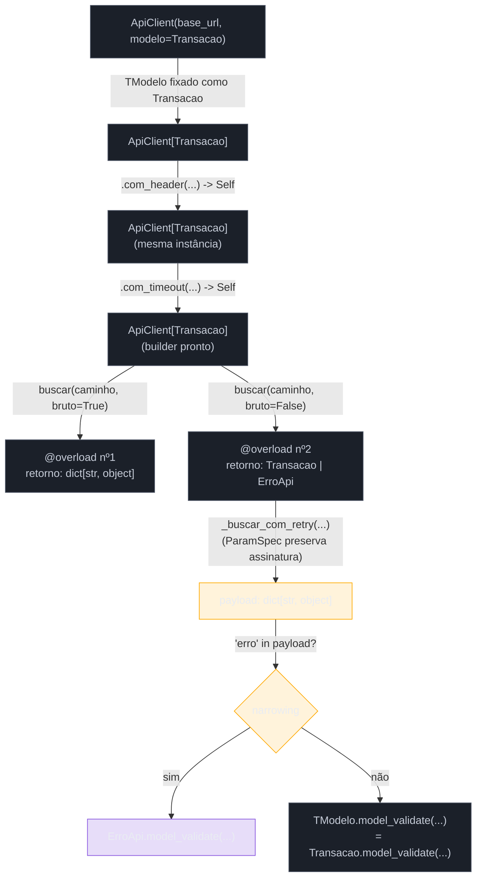
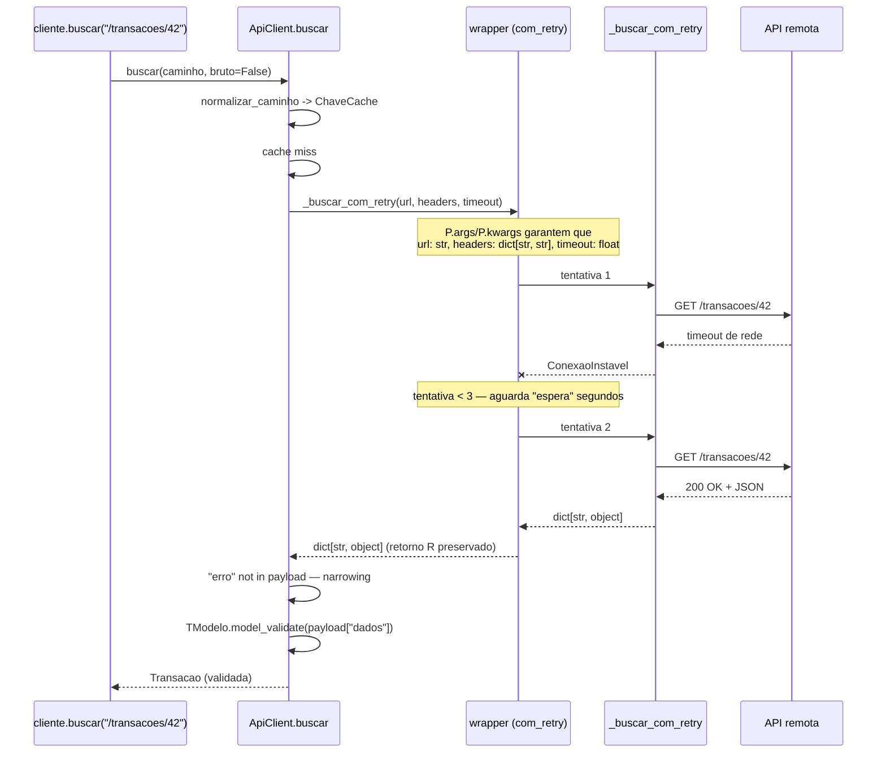

# Capstone — tipagem moderna

> [!abstract] TL;DR
> Esta nota fecha o Galho 5 amarrando as sete peças anteriores num único client de API genérico, `ApiClient[T]` — tipado ponta a ponta o suficiente para passar limpo em `mypy --strict`. [[03 - Generics — TypeVar, Generic e sintaxe moderna|Generics]] (`TypeVar("T", bound=BaseModel)`) amarra "o modelo que valida a resposta" ao tipo devolvido por cada instância; [[06 - Pydantic — validação em runtime|Pydantic]] transforma essa validação numa checagem real, em runtime, ao instanciar o `BaseModel`; [[05 - TypedDict, Literal, NewType e Final|TypedDict/Literal/NewType/Final]] restringem a configuração de cada requisição a um schema fixo, o método HTTP a um conjunto fechado de strings, e distinguem uma chave de cache normalizada de uma string qualquer, sem custo em runtime; [[02 - Union, Optional e o operador |Union/`|`]] modela "a resposta é o modelo validado **ou** um erro estruturado", com narrowing decidindo qual dos dois braços o código está pisando; [[07 - Typing avançado — overload, Self, ParamSpec|`Self`]] mantém um builder fluente (`.com_header(...)`.`com_timeout(...)`) correto através de herança; `@overload` (também nota 07) diferencia o tipo de retorno conforme um parâmetro booleano (`bruto=True` devolve o JSON cru, `bruto=False` devolve o modelo validado ou o erro); e `ParamSpec`/`Concatenate` tipam um decorator de retry que preserva a assinatura exata da função HTTP que ele envolve — o mesmo padrão de decorator factory que o [[03-Dominios/Tecnologia/Python/Funcional e idiomas avançados/06 - Decorators com argumentos e functools.wraps|Galho 4]] ensinou em runtime, agora com tipagem completa por cima. [[04 - mypy e pyright — checagem estática na prática|`mypy --strict`]] roda sobre o arquivo inteiro no fim desta nota, e a saída — `Success: no issues found` — é o que fecha o arco aberto na [[01 - Type hints — fundamentos e gradual typing|nota 01]]: hints, sozinhas, não impõem nada; um checador rodando de fato é o que transforma a promessa em garantia.

## O problema: as sete peças, juntas, num client de API real

Cada nota deste galho isolou um mecanismo — generics amarram entrada e saída sem `Any`, `Union`/`Optional` modela ausência e alternância, `mypy`/`pyright` comparam hint com realidade antes do deploy, `TypedDict`/`Literal`/`NewType`/`Final` fecham lacunas específicas de schema e identidade, Pydantic valida de fato em runtime, e `overload`/`Self`/`ParamSpec` resolvem casos de borda de bibliotecas compartilhadas. Isolados, cada um é um capítulo de manual. O que as sete notas nunca mostraram — porque não era o objetivo de nenhuma delas isoladamente — é como esses sete mecanismos convivem no mesmo trecho de código, sem que um atrapalhe o outro nem o conjunto vire uma sopa de anotações difícil de ler.

Um time de plataforma mantém dezenas de integrações com APIs externas — de gateways de pagamento a serviços de geolocalização — e cada uma dessas integrações reimplementa, com pequenas variações, a mesma lógica: montar a URL, anexar headers de autenticação, tratar timeout, tentar de novo se a rede falhar de forma transitória, parsear o JSON da resposta, e decidir se aquele JSON representa sucesso ou um erro estruturado do serviço remoto. O time decide escrever **um único** `ApiClient` genérico, reusável por qualquer integração nova, que resolva essa lógica uma vez — com uma exigência adicional, não negociável: o client precisa ser tipado o suficiente para que `mypy --strict` pegue, antes do deploy, o tipo errado de header, um parâmetro de configuração inválido, ou um `.model_dump()` chamado sobre algo que pode ser `None`.

Nenhuma dessas exigências, isoladamente, é nova para quem já leu as sete notas anteriores. A pergunta desta capstone é: como tudo isso convive na assinatura de uma única classe, sem que a tipagem em si vire mais difícil de manter do que o problema que ela deveria resolver?

O resto desta nota constrói esse client peça por peça, na ordem em que as notas do galho o ensinaram, e termina com o programa inteiro passando limpo em `mypy --strict`.

## O esqueleto genérico: `ApiClient[T]` validado por um `BaseModel`

A espinha dorsal do client é uma classe genérica sobre o tipo do modelo de resposta — o mesmo problema que a [[03 - Generics — TypeVar, Generic e sintaxe moderna|nota 03]] resolveu para uma `Pilha` reusável: sem `TypeVar`, `ApiClient` teria que devolver `Any` (perdendo toda checagem no ponto de uso) ou seria amarrado a um único tipo de resposta (perdendo o reuso que motiva escrevê-lo uma vez só).

```python
from typing import TypeVar
from pydantic import BaseModel


class ErroApi(BaseModel):
    codigo: int
    mensagem: str


TModelo = TypeVar("TModelo", bound=BaseModel)
```

`TModelo` usa `bound=BaseModel` — não um `TypeVar` livre — porque o client precisa de uma garantia mínima sobre o tipo: qualquer que seja `TModelo`, ele tem que saber validar a si mesmo a partir de um `dict` (via `model_validate`, [[06 - Pydantic — validação em runtime|nota 06]]). Um `TypeVar` sem `bound` aceitaria qualquer tipo, inclusive um que não seja um `BaseModel`, e o corpo da classe não teria como chamar `TModelo.model_validate(...)` com segurança — exatamente a distinção entre `bound` e um `TypeVar` livre que a nota 03 já documentou para o caso de `Comparavel`.

```python
class ApiClient(Generic[TModelo]):
    def __init__(self, base_url: str, modelo: type[TModelo]) -> None:
        self._base_url = base_url
        self._modelo = modelo
        self._headers: dict[str, str] = {}
        self._timeout: float = TIMEOUT_PADRAO
```

`modelo: type[TModelo]` — o parâmetro que recebe **a classe** do modelo, não uma instância dela — é o que amarra `TModelo` no momento da construção: `ApiClient("https://api.pagamentos.com", modelo=Transacao)` fixa `TModelo` como `Transacao` para essa instância inteira, e todo método que devolver `TModelo` daqui em diante devolve, de fato, `Transacao`, não `Any` nem `BaseModel` genérico — o mesmo ganho que a nota 03 demonstrou para `RepositorioBase[TEntidade]` sobre um ORM.

`TIMEOUT_PADRAO`, usado como valor inicial acima, é a primeira aparição de [[05 - TypedDict, Literal, NewType e Final|`Final`]] nesta capstone:

```python
from typing import Final

TIMEOUT_PADRAO: Final[float] = 10.0
```

Uma constante genuína — não por convenção de nome em maiúsculas, mas verificada pelo checador: qualquer `TIMEOUT_PADRAO = 5.0` em outro lugar do módulo é sinalizado como erro estático (`Cannot assign to final name`), mesmo que, em runtime, o CPython execute a reatribuição sem reclamar — a mesma ressalva que a nota 05 fez questão de nomear explicitamente.

## Config restrita: `TypedDict`, `Literal` e `NewType` na fronteira da requisição

Cada chamada ao client monta uma configuração de requisição — método HTTP, headers, timeout — que hoje, em código não tipado, costuma ser só um `dict[str, Any]` solto, com o mesmo risco que a [[05 - TypedDict, Literal, NewType e Final|nota 05]] descreveu na Cena 1: um erro de digitação numa chave (`"metodo"` vs. `"método"`, `"Get"` vs. `"GET"`) passa despercebido por qualquer checador, porque `Any` não tem chaves nem valores fixos para comparar.

```python
from typing import Literal, NotRequired, TypedDict


class ConfigRequisicao(TypedDict):
    metodo: Literal["GET", "POST", "PUT", "DELETE"]
    headers: NotRequired[dict[str, str]]
    timeout: NotRequired[float]
```

`ConfigRequisicao` continua sendo um `dict` comum em runtime — `type(config) is dict` é verdadeiro — mas o checador agora sabe que `metodo` só aceita quatro strings exatas, e que `headers`/`timeout` podem faltar (`NotRequired`, PEP 655) sem que o resto da classe deixe de ser obrigatório. `Literal["GET", "POST", "PUT", "DELETE"]` pega exatamente o tipo de bug que motivou a Cena 2 da nota 05: `metodo="GRAB"` (um typo de `"GET"`) é erro estático, não um `405 Method Not Allowed` descoberto em produção horas depois do deploy.

A última peça desse trio é [[05 - TypedDict, Literal, NewType e Final|`NewType`]], usado aqui para uma distinção mais sutil: o client cacheia respostas já validadas, em memória, por um curto período — mas a chave desse cache não pode ser qualquer string solta, precisa ser um caminho **já normalizado** (sempre com barra inicial, por exemplo), senão `"/pedidos"` e `"pedidos"` cacheariam como entradas diferentes por engano.

```python
from typing import NewType

ChaveCache = NewType("ChaveCache", str)


def normalizar_caminho(caminho: str) -> ChaveCache:
    return ChaveCache(caminho if caminho.startswith("/") else f"/{caminho}")
```

Em runtime, `ChaveCache` é `str` — `normalizar_caminho("pedidos")` só devolve `"/pedidos"`, sem nenhum objeto novo alocado. Mas o checador passa a rejeitar qualquer chamada que tente usar uma `str` crua onde `ChaveCache` é esperado, forçando toda chave de cache a passar por `normalizar_caminho(...)` antes de ser usada — o mesmo mecanismo que a nota 05 descreveu para `UserId`/`ProductId`, aqui prevenindo "duas strings parecidas tratadas como a mesma chave" em vez de "dois IDs numéricos trocados".

## Builder fluente: `Self` sobrevivendo à herança

Configurar o client — headers, timeout — usa o padrão builder encadeado, o mesmo caso de uso que abriu a seção de [[07 - Typing avançado — overload, Self, ParamSpec|`Self`]] na nota 07:

```python
from typing import Self


class ApiClient(Generic[TModelo]):
    # ... __init__ como acima ...

    def com_header(self, chave: str, valor: str) -> Self:
        self._headers[chave] = valor
        return self

    def com_timeout(self, segundos: float) -> Self:
        self._timeout = segundos
        return self
```

Sem `Self`, anotar `com_header` como `-> "ApiClient[TModelo]"` (o nome literal da classe) quebraria exatamente do jeito que a nota 07 demonstrou para `ConstrutorDeQuery`: uma subclasse futura — digamos, `ApiClientComAssinatura`, que adiciona `.com_hmac(segredo)` para assinar requisições — perderia o método extra do encadeamento assim que uma chamada passasse por `com_header()`, herdado da classe-mãe, porque o checador confiaria na anotação fixa "isto devolve `ApiClient`", não no tipo real da instância. `Self` resolve isso com a mesma frase da nota 07: "devolve uma instância do mesmo tipo de quem chamou", preservando inclusive o parâmetro genérico — `Self` numa instância de `ApiClient[Transacao]` continua resolvendo como `ApiClient[Transacao]`, não como `ApiClient` genérico sem o `T` amarrado.

```python
cliente = (
    ApiClient("https://api.pagamentos.com", modelo=Transacao)
    .com_header("Authorization", "Bearer abc123")
    .com_timeout(5.0)
)
```

## Erro como valor: `Union`, narrowing, e o que a resposta pode ser

O método central do client — `buscar` — precisa expressar uma verdade desconfortável sobre qualquer chamada de rede: ela pode devolver o modelo esperado, **ou** um erro estruturado do servidor remoto (código 4xx/5xx com corpo JSON próprio), e a assinatura precisa contar essa verdade sem mentir, exatamente o ponto de partida da [[02 - Union, Optional e o operador |nota 02]] sobre `buscar_usuario(id: int) -> Usuario`, que silenciosamente podia devolver `None`.

```python
def _interpretar_resposta(
    self, payload: dict[str, object]
) -> TModelo | ErroApi:
    if "erro" in payload:
        return ErroApi.model_validate(payload["erro"])
    return self._modelo.model_validate(payload["dados"])
```

`TModelo | ErroApi` é a mesma forma de tipo soma que a nota 02 nomeou formalmente — "isto **ou** aquilo, nunca os dois ao mesmo tempo" — só que aqui as duas alternativas não incluem `None`: o client sempre devolve *algum* objeto Pydantic validado, seja o modelo de domínio esperado, seja o erro. Quem consome `buscar(...)` é obrigado, pelo checador, a lidar com os dois casos antes de tratar o resultado como o modelo de domínio:

```python
resultado = cliente.buscar("/transacoes/42")
if isinstance(resultado, ErroApi):
    # narrowing: aqui dentro, resultado é ErroApi
    registrar_falha(resultado.codigo, resultado.mensagem)
else:
    # narrowing: aqui dentro, resultado é TModelo (Transacao, neste client)
    processar_transacao(resultado)
```

O `isinstance(resultado, ErroApi)` é a mesma forma de narrowing que a nota 02 descreveu para `if usuario is not None:` — só que, em vez de eliminar `None` de uma união, elimina um dos dois braços de um `Union` entre dois `BaseModel` distintos. Repare que essa distinção só é possível porque `TModelo` e `ErroApi` são classes Pydantic **diferentes**: se ambas fossem `dict[str, Any]`, `isinstance` não teria como diferenciá-las, e o checador exigiria uma checagem de chave manual (`"erro" in resultado`) — de novo, o mesmo ganho estrutural que motivou usar `TypedDict`/`BaseModel` em vez de `dict` cru ao longo de todo o galho.

## `@overload`: o mesmo método, dois contratos de retorno

Por padrão, `buscar` devolve `TModelo | ErroApi` — mas em cenários de depuração, o time de plataforma também quer acesso ao JSON cru da resposta, sem passar pela validação Pydantic, via um parâmetro `bruto=True`. Anotar isso com uma única assinatura força todo call site a lidar com uma união de três tipos (`dict[str, object] | TModelo | ErroApi`), mesmo quando o chamador já sabe, estaticamente, qual dos dois modos está usando — exatamente o problema que abriu a seção de [[07 - Typing avançado — overload, Self, ParamSpec|`@overload`]] na nota 07, com o exemplo de `carregar_config`.

```python
from typing import overload


class ApiClient(Generic[TModelo]):
    # ...

    @overload
    def buscar(self, caminho: str, *, bruto: Literal[True]) -> dict[str, object]: ...
    @overload
    def buscar(self, caminho: str, *, bruto: Literal[False] = False) -> TModelo | ErroApi: ...

    def buscar(
        self, caminho: str, *, bruto: bool = False
    ) -> dict[str, object] | TModelo | ErroApi:
        chave = normalizar_caminho(caminho)
        payload = self._buscar_com_retry(f"{self._base_url}{chave}", self._headers, self._timeout)
        if bruto:
            return payload
        resultado = self._interpretar_resposta(payload)
        self._cache[chave] = resultado
        return resultado
```

As duas assinaturas `@overload` — `bruto: Literal[True]` e `bruto: Literal[False] = False` — usam exatamente o `Literal` que a [[05 - TypedDict, Literal, NewType e Final|nota 05]] já introduziu para o método HTTP, agora restringindo não um parâmetro de configuração, mas o **valor exato** que determina qual dos dois contratos de retorno se aplica. Um checador vendo `cliente.buscar("/transacoes/42", bruto=True)` casa contra a primeira assinatura e infere `dict[str, object]`, sem união nenhuma; vendo `cliente.buscar("/transacoes/42")` (sem `bruto`, usando o default `False`), casa contra a segunda e infere `TModelo | ErroApi` — exatamente o ganho que a nota 07 descreveu para `enviar(esperar_json=...)` no exemplo do SDK HTTP fluente. A implementação real, por último, **não** leva `@overload` — sua assinatura (`dict[str, object] | TModelo | ErroApi`) precisa ser larga o bastante para cobrir os dois contratos anunciados acima dela, a mesma regra que a nota 07 marcou como o erro mais comum de quem esquece essa exigência.

## Retry tipado: `ParamSpec` preservando a assinatura da chamada de rede

A chamada HTTP de fato — `_buscar_com_retry` — fala com a rede, então precisa tolerar falhas transitórias, o mesmo problema que o [[03-Dominios/Tecnologia/Python/Funcional e idiomas avançados/06 - Decorators com argumentos e functools.wraps|Galho 4]] resolveu em runtime com um decorator factory de três níveis. Esta capstone reusa exatamente esse padrão, mas tipado com `ParamSpec` — a peça que a [[07 - Typing avançado — overload, Self, ParamSpec|nota 07]] deste galho adicionou por cima do runtime já correto.

```python
import functools
import time
from collections.abc import Callable
from typing import ParamSpec, TypeVar

P = ParamSpec("P")
R = TypeVar("R")


class ConexaoInstavel(Exception):
    pass


def com_retry(
    tentativas: int = 3, espera: float = 0.5
) -> Callable[[Callable[P, R]], Callable[P, R]]:
    def decorator(func: Callable[P, R]) -> Callable[P, R]:
        @functools.wraps(func)
        def wrapper(*args: P.args, **kwargs: P.kwargs) -> R:
            ultimo_erro: ConexaoInstavel | None = None
            for tentativa in range(1, tentativas + 1):
                try:
                    return func(*args, **kwargs)
                except ConexaoInstavel as erro:
                    ultimo_erro = erro
                    if tentativa < tentativas:
                        time.sleep(espera)
            assert ultimo_erro is not None
            raise ultimo_erro
        return wrapper
    return decorator


@com_retry(tentativas=3, espera=0.5)
def _buscar_com_retry(url: str, headers: dict[str, str], timeout: float) -> dict[str, object]:
    resposta = httpx.get(url, headers=headers, timeout=timeout)
    resposta.raise_for_status()
    return resposta.json()
```

`Callable[P, R]` na entrada e na saída de `decorator` amarra `P` — "toda a assinatura de parâmetros de `_buscar_com_retry`" — e `R` — seu tipo de retorno — como uma unidade que atravessa o decorator sem se perder. `*args: P.args, **kwargs: P.kwargs` no `wrapper` são as duas metades dessa unidade, exatamente como a nota 07 descreveu; sem isso, `wrapper(*args, **kwargs)` equivaleria a `*args: Any, **kwargs: Any`, e uma chamada como `_buscar_com_retry(42, {}, "dez")` — URL como `int`, timeout como `str` — passaria batida pelo checador, mesmo sabendo que `_buscar_com_retry` declara `url: str`/`timeout: float`.

> [!question]- Por que `com_retry` decora uma função solta, `_buscar_com_retry`, em vez de decorar diretamente o método `buscar` da classe?
> Porque a nota 07 já registrou, na seção sobre `ParamSpec`, que a combinação de `ParamSpec` com métodos de classe — onde `self` precisa ser tratado separadamente do resto da assinatura capturada por `P` — ainda tem fricção documentada entre `mypy` e `pyright`, mais do que o caso de uma função solta. Decorar `_buscar_com_retry` (uma função de módulo, sem `self`) em vez do método `buscar` evita esse caso de borda inteiramente, sem perder nada do comportamento desejado: `buscar` continua chamando `_buscar_com_retry(...)` internamente, e o retry se aplica exatamente onde importa — na chamada de rede, o ponto que de fato falha de forma transitória. É uma escolha de design deliberada, não uma limitação da capstone: separar "o que precisa de retry" (a chamada HTTP crua) de "o que precisa de `Self`" (os métodos da classe) evita empilhar duas fricções conhecidas de tipagem no mesmo lugar.

## O client completo, de ponta a ponta

Juntando as sete peças — `TypeVar` com `bound` amarrando o modelo de resposta, `TypedDict`/`Literal`/`NewType`/`Final` restringindo configuração e cache, `Self` no builder, `Union` com narrowing para o resultado, `@overload` para o contrato condicional, e `ParamSpec` tipando o retry:

```python
from __future__ import annotations

import functools
import time
from collections.abc import Callable
from typing import (
    Final,
    Generic,
    Literal,
    NewType,
    NotRequired,
    ParamSpec,
    Self,
    TypedDict,
    TypeVar,
    overload,
)

import httpx
from pydantic import BaseModel


class ErroApi(BaseModel):
    codigo: int
    mensagem: str


class ConfigRequisicao(TypedDict):
    metodo: Literal["GET", "POST", "PUT", "DELETE"]
    headers: NotRequired[dict[str, str]]
    timeout: NotRequired[float]


ChaveCache = NewType("ChaveCache", str)
TIMEOUT_PADRAO: Final[float] = 10.0


def normalizar_caminho(caminho: str) -> ChaveCache:
    return ChaveCache(caminho if caminho.startswith("/") else f"/{caminho}")


class ConexaoInstavel(Exception):
    pass


P = ParamSpec("P")
R = TypeVar("R")


def com_retry(
    tentativas: int = 3, espera: float = 0.5
) -> Callable[[Callable[P, R]], Callable[P, R]]:
    def decorator(func: Callable[P, R]) -> Callable[P, R]:
        @functools.wraps(func)
        def wrapper(*args: P.args, **kwargs: P.kwargs) -> R:
            ultimo_erro: ConexaoInstavel | None = None
            for tentativa in range(1, tentativas + 1):
                try:
                    return func(*args, **kwargs)
                except ConexaoInstavel as erro:
                    ultimo_erro = erro
                    if tentativa < tentativas:
                        time.sleep(espera)
            assert ultimo_erro is not None
            raise ultimo_erro
        return wrapper
    return decorator


@com_retry(tentativas=3, espera=0.5)
def _buscar_com_retry(url: str, headers: dict[str, str], timeout: float) -> dict[str, object]:
    try:
        resposta = httpx.get(url, headers=headers, timeout=timeout)
    except httpx.TransportError as erro:
        raise ConexaoInstavel(str(erro)) from erro
    resposta.raise_for_status()
    return resposta.json()


TModelo = TypeVar("TModelo", bound=BaseModel)


class ApiClient(Generic[TModelo]):
    def __init__(self, base_url: str, modelo: type[TModelo]) -> None:
        self._base_url = base_url
        self._modelo = modelo
        self._headers: dict[str, str] = {}
        self._timeout: float = TIMEOUT_PADRAO
        self._cache: dict[ChaveCache, TModelo | ErroApi] = {}

    def com_header(self, chave: str, valor: str) -> Self:
        self._headers[chave] = valor
        return self

    def com_timeout(self, segundos: float) -> Self:
        self._timeout = segundos
        return self

    def _interpretar_resposta(self, payload: dict[str, object]) -> TModelo | ErroApi:
        if "erro" in payload:
            return ErroApi.model_validate(payload["erro"])
        return self._modelo.model_validate(payload["dados"])

    @overload
    def buscar(self, caminho: str, *, bruto: Literal[True]) -> dict[str, object]: ...
    @overload
    def buscar(self, caminho: str, *, bruto: Literal[False] = False) -> TModelo | ErroApi: ...

    def buscar(
        self, caminho: str, *, bruto: bool = False
    ) -> dict[str, object] | TModelo | ErroApi:
        chave = normalizar_caminho(caminho)
        if not bruto and chave in self._cache:
            return self._cache[chave]

        payload = _buscar_com_retry(f"{self._base_url}{chave}", self._headers, self._timeout)
        if bruto:
            return payload

        resultado = self._interpretar_resposta(payload)
        self._cache[chave] = resultado
        return resultado
```

E o uso, do lado de quem consome o client — um modelo `Transacao` concreto, validado pelo mesmo `TModelo` amarrado na construção:

```python
class Transacao(BaseModel):
    id_transacao: str
    valor_centavos: int
    status: Literal["aprovado", "recusado", "pendente"]


cliente: ApiClient[Transacao] = (
    ApiClient("https://api.pagamentos.com", modelo=Transacao)
    .com_header("Authorization", "Bearer abc123")
    .com_timeout(5.0)
)

resultado = cliente.buscar("/transacoes/42")
if isinstance(resultado, ErroApi):
    registrar_falha(resultado.codigo, resultado.mensagem)
else:
    print(f"Transação {resultado.id_transacao}: {resultado.status}")

payload_cru = cliente.buscar("/transacoes/42", bruto=True)
print(payload_cru.keys())
```

Cada linha desse bloco de uso passa por uma peça diferente do galho: `ApiClient[Transacao]` fixa `TModelo` (Generics); `.com_header(...).com_timeout(...)` encadeia graças a `Self`; `cliente.buscar("/transacoes/42")` casa contra o segundo `@overload` e infere `Transacao | ErroApi`; `isinstance(resultado, ErroApi)` faz o narrowing que separa os dois braços do `Union`; e `cliente.buscar(..., bruto=True)` casa contra o primeiro `@overload`, inferindo `dict[str, object]` sem união nenhuma — tudo isso sem que `mypy` precise executar uma linha sequer, só ler as assinaturas.



Repare, no diagrama, que só o nó `G` (o `payload` cru, ainda um `dict[str, object]`) e o nó `H` (a decisão de narrowing) representam informação que só existe **em runtime** — todo o resto (fixação de `TModelo`, `Self`, `@overload`) já está resolvido estaticamente, antes de qualquer requisição HTTP de fato acontecer.

O segundo diagrama detalha a sequência de chamadas quando a rede falha uma vez e se recupera na segunda tentativa — o momento em que `com_retry`/`ParamSpec` entram em ação de verdade:



## Rodando `mypy --strict` sobre o exemplo inteiro

A prova final de que as sete peças se encaixam sem atrito de tipagem é rodar o checador — a ferramenta que a [[04 - mypy e pyright — checagem estática na prática|nota 04]] deste galho descreveu em detalhe — sobre o arquivo inteiro, no modo mais rigoroso disponível:

```bash
$ mypy api_client.py --strict
```

```text
Success: no issues found in 1 source file
```

Nenhum dos ganhos de tipagem construídos nesta nota é gratuito — `--strict` liga, entre outras, `disallow-untyped-defs` (toda função precisa de anotação completa) e `warn-return-any` (nenhuma função tipada pode devolver `Any` sem avisar), e é exatamente esse rigor que teria pego, por exemplo, um `_buscar_com_retry` sem anotação de retorno (o `wrapper` do decorator devolveria `Any`, e o `Union` cuidadosamente construído em `buscar` desmoronaria silenciosamente em `Any` também, o mesmo "buraco negro de checagem" que a nota 03 descreveu para generics mal tipados). Passar em `--strict` não prova que o client está livre de bugs de lógica — a mesma ressalva que a nota 04 fez questão de nomear — mas prova, de forma mecânica e repetível, que toda a superfície de tipos deste arquivo é internamente consistente: nenhum `TModelo` vazando como `Any`, nenhum `Union` sem narrowing antes do uso, nenhuma assinatura de decorator perdendo a forma da função original.

## Casos práticos

### Cenário 1: adicionando uma segunda integração sem tocar em `ApiClient`

Um segundo time, responsável pela integração com um serviço de geolocalização, precisa do mesmo client — mas validando um modelo `Endereco`, não `Transacao`. Graças a `Generic[TModelo]`, isso não exige nenhuma mudança em `ApiClient`:

```python
class Endereco(BaseModel):
    rua: str
    cidade: str
    cep: str


cliente_geo: ApiClient[Endereco] = ApiClient(
    "https://api.geolocalizacao.com", modelo=Endereco
).com_timeout(3.0)

resultado_geo = cliente_geo.buscar("/enderecos/cep/50000000")
if isinstance(resultado_geo, ErroApi):
    registrar_falha(resultado_geo.codigo, resultado_geo.mensagem)
else:
    print(resultado_geo.cidade)   # checador sabe: resultado_geo é Endereco aqui
```

`cliente_geo.buscar(...)` devolve `Endereco | ErroApi`, não `Transacao | ErroApi` — o mesmo mecanismo de `RepositorioBase[TEntidade]` da nota 03, agora aplicado a um client HTTP inteiro em vez de um repositório de persistência. Nenhuma linha de `ApiClient` foi editada; o segundo time só forneceu um `BaseModel` diferente na construção.

### Cenário 2: um novo modo de retorno, via um terceiro `@overload`

Meses depois, um terceiro modo é necessário: `buscar(..., apenas_status=True)` deveria devolver só o código HTTP da resposta, um `int`, sem tocar em Pydantic nem no `dict` bruto inteiro. Estender `@overload` para esse caso segue exatamente o padrão já estabelecido, sem alterar os dois contratos existentes:

```python
@overload
def buscar(self, caminho: str, *, bruto: Literal[True]) -> dict[str, object]: ...
@overload
def buscar(self, caminho: str, *, apenas_status: Literal[True]) -> int: ...
@overload
def buscar(self, caminho: str, *, bruto: Literal[False] = False) -> TModelo | ErroApi: ...

def buscar(
    self,
    caminho: str,
    *,
    bruto: bool = False,
    apenas_status: bool = False,
) -> dict[str, object] | TModelo | ErroApi | int:
    ...  # implementação cobrindo os três contratos
```

Cada `@overload` novo é aditivo — não quebra os dois contratos anteriores, porque o checador casa a chamada contra a primeira assinatura compatível, na ordem declarada. O custo é inteiramente na implementação final, cuja assinatura (`dict[str, object] | TModelo | ErroApi | int`) precisa crescer para cobrir todos os contratos anunciados — o mesmo aviso que a nota 07 fez sobre `overload`: a lista de assinaturas cresce em proporção direta ao número de "modos" reais que a função suporta, e passar disso de dois ou três overloads costuma ser sinal de que a função deveria virar duas funções separadas.

## Armadilhas comuns

> [!warning] Decorar `buscar` diretamente com `com_retry`, em vez de `_buscar_com_retry`
> Como discutido na seção sobre `ParamSpec`, decorar um método de classe (que tem `self` como primeiro parâmetro) com um decorator tipado via `ParamSpec` puro é um dos casos de borda que a nota 07 documentou como ainda frágil entre `mypy` e `pyright`. Extrair a chamada de rede para uma função de módulo separada (`_buscar_com_retry`) evita esse atrito por completo, sem perder o comportamento de retry onde ele realmente importa.

> [!warning] Esquecer que a implementação final de `buscar` não pode levar `@overload`
> Copiar o padrão visual das duas assinaturas `@overload` de cima para a implementação real (a terceira, sem `...` no corpo) faz o checador tratá-la como mais um overload sem corpo executável — a função "desaparece" do runtime, e a primeira chamada real levanta um erro obscuro. A implementação, sempre a última, nunca leva o decorator — exatamente a armadilha que a nota 07 nomeou.

> [!warning] Tratar `TModelo | ErroApi` como se `isinstance` não fosse necessário
> Como o narrowing da nota 02 deixou claro para `Usuario | None`, o mesmo raciocínio vale aqui: `resultado.status` (um atributo só de `Transacao`) chamado sem checar `isinstance(resultado, ErroApi)` antes é rejeitado pelo checador, e corretamente — `ErroApi` não tem atributo `status`. É a mesma classe de bug que motivou toda a seção de `Optional`/narrowing da nota 02, só que entre dois `BaseModel` em vez de entre um tipo e `None`.

> [!warning] Usar `dict[str, Any]` para `ConfigRequisicao` "porque é mais rápido"
> Exatamente a armadilha que a nota 05 nomeou explicitamente: um `TypedDict` de poucas linhas paga por si na primeira vez que pega um `metodo="GRAB"` antes do deploy — o custo de declarar `ConfigRequisicao` é pago uma vez; o custo de não declarar (um bug de configuração em produção) é pago toda vez que o typo passa despercebido.

> [!warning] Achar que `mypy --strict` limpo significa "sem bugs"
> A mesma calibragem que a nota 04 exigiu: `mypy --strict` sobre este `ApiClient` garante ausência de uma classe específica de erro — incompatibilidade de tipo — não ausência de bugs de lógica (um `com_retry(tentativas=0)`, por exemplo, passaria limpo no checador e ainda assim nunca tentaria a chamada de rede nenhuma vez). Testes automatizados continuam sendo a ferramenta certa para essa outra categoria de erro.

## Em entrevista

"Descreva como você tiparia um client de API genérico, reusável para várias integrações diferentes" é o tipo de pergunta de nível sênior que testa exatamente a síntese desta capstone — não decorar cada mecanismo isoladamente, mas saber compor generics, uniões e validação em runtime sem que a tipagem em si vire um fardo.

- **"Por que `TypeVar("TModelo", bound=BaseModel)` em vez de um `TypeVar` livre?"** Porque o corpo da classe precisa chamar `TModelo.model_validate(...)` — uma garantia mínima sobre o tipo que um `TypeVar` sem `bound` não oferece. `bound=BaseModel` aceita `BaseModel` e qualquer subtipo dele (qualquer modelo Pydantic concreto), preservando o reuso genérico sem abrir mão da garantia estrutural necessária.
- **"Como você tiparia uma função cujo retorno depende de um parâmetro booleano, sem forçar todo call site a lidar com uma união ampla?"** `@typing.overload` — uma assinatura por combinação relevante (`bruto=True` → `dict`, `bruto=False` → `TModelo | ErroApi`), com uma única implementação real sem o decorator por baixo. O checador infere o retorno exato em cada ponto de chamada, sem `cast()` manual.
- **"Como um decorator de retry genérico preserva a assinatura da função que ele decora?"** `ParamSpec` captura toda a assinatura de parâmetros como uma unidade — `Callable[P, R]` na entrada e saída do decorator, `*args: P.args, **kwargs: P.kwargs` no wrapper — em vez de `*args: Any, **kwargs: Any`, que descartaria qualquer checagem sobre os argumentos da chamada de rede.
- **"Por que não simplesmente `dict[str, Any]` como retorno de tudo e resolver na mão?"** Porque `Any` desliga a checagem para o valor inteiro e tudo que deriva dele — o mesmo "buraco negro" que a nota de Generics descreveu. `Union`/`Generic`/`TypedDict` preservam informação suficiente para o checador pegar, antes do deploy, um `resultado.status` acessado sem checar se `resultado` é `ErroApi`, ou um `metodo="GRAB"` de configuração inválida.
- **"Isso tudo tem custo em runtime?"** Não — a mesma resposta de todas as notas anteriores do galho. `TypeVar`/`Generic`/`Self`/`@overload`/`ParamSpec`/`Literal`/`NewType`/`Final` são, todos, metadados para `mypy`/`pyright`; a única checagem real em runtime vem de `Pydantic`, no momento em que `TModelo.model_validate(...)` ou `ErroApi.model_validate(...)` de fato executa contra um `dict` vindo da rede.

## How to explain in English

> A generic, fully typed API client ties together everything this branch covered: `ApiClient[TModelo]`, bound to `BaseModel`, lets one class serve any Pydantic model without losing static checking; a `TypedDict` with `Literal` fields restricts request configuration to a fixed, valid shape; `NewType` distinguishes a normalized cache key from a raw string at zero runtime cost; `Self`-typed builder methods (`.com_header(...)`, `.com_timeout(...)`) survive subclassing; the method's actual result is a `Union` between the validated model and a structured error type, narrowed via `isinstance` at the call site instead of trusting an untyped dict; `@overload` gives the same method two distinct, precisely inferred return types depending on a `bruto` flag; and a `ParamSpec`-typed retry decorator preserves the exact signature of the underlying network call it wraps, deliberately applied to a free function rather than a method to sidestep a documented `self`/`ParamSpec` friction. None of it changes runtime behavior — Pydantic is the only piece in the whole file that actually validates data as the program executes — and running `mypy --strict` over the finished file is what turns seven independently-taught mechanisms into one verified guarantee: `Success: no issues found`.

| PT | EN |
|---|---|
| client de API genérico | generic API client |
| modelo validado / erro estruturado | validated model / structured error |
| builder fluente | fluent builder |
| contrato condicional ao parâmetro | parameter-dependent contract |
| chave de cache normalizada | normalized cache key |
| assinatura preservada pelo decorator | signature preserved through the decorator |
| checagem estática limpa | clean static check |
| garantia mecânica e repetível | mechanical, repeatable guarantee |

## Fechamento do Galho 5 — Tipagem moderna

Esta é a última nota do Galho 5. Recapitulando o que as oito notas cobriram juntas:

1. [[01 - Type hints — fundamentos e gradual typing|01 — Type hints: fundamentos e gradual typing]] estabeleceu o alicerce de todo o galho: hints são metadados que o CPython avalia e guarda em `__annotations__`, mas nunca compara com o valor real — a distinção entre "ter uma hint" e "ser checado de fato" que organiza tudo o que veio depois.
2. [[02 - Union, Optional e o operador |02 — Union, Optional e o operador `|`]] deu vocabulário para "isto ou aquilo" — `Optional[X]`/`X | None` como tipo soma, e narrowing como o mecanismo que transforma um `if`/`isinstance` em prova estática de que uma alternativa foi descartada.
3. [[03 - Generics — TypeVar, Generic e sintaxe moderna|03 — Generics: `TypeVar`, `Generic` e sintaxe moderna]] resolveu "reusar código para qualquer tipo sem virar `Any`" — `TypeVar`, `Generic[T]`, PEP 585/695, e a distinção entre `bound` (hierarquia aberta) e *constrained* (conjunto fechado).
4. [[04 - mypy e pyright — checagem estática na prática|04 — `mypy` e `pyright`: checagem estática na prática]] apresentou as duas ferramentas que de fato leem hints e comparam com a realidade do código, antes do deploy — `--strict`, tipagem incremental, e o limite real de "checagem estática pega tipo errado, nunca lógica errada".
5. [[05 - TypedDict, Literal, NewType e Final|05 — `TypedDict`, `Literal`, `NewType` e `Final`]] fechou quatro lacunas específicas que `Union`/`Generic` não cobrem — schema de dict, valores fechados, tipos "primos" sem custo em runtime, e constantes verificadas.
6. [[06 - Pydantic — validação em runtime|06 — Pydantic: validação em runtime]] mudou o eixo de "antes de rodar" para "durante a execução" — `BaseModel` transformando anotação em contrato imposto de fato, com `pydantic-core` em Rust fazendo o trabalho pesado.
7. [[07 - Typing avançado — overload, Self, ParamSpec|07 — Typing avançado: `overload`, `Self`, `ParamSpec`]] cobriu os casos de borda de bibliotecas compartilhadas — retorno condicional ao tipo de entrada, builders que sobrevivem à herança, decorators genéricos que preservam assinatura — e fechou com o cálculo honesto de ROI entre tipar e não tipar.
8. Esta nota fechou amarrando as sete numa classe só: `ApiClient[TModelo]`, um client de API genérico e tipado ponta a ponta, validado por Pydantic, restrito por `TypedDict`/`Literal`/`NewType`/`Final`, fluente via `Self`, com contratos condicionais via `@overload`, retry preservando assinatura via `ParamSpec`, e `mypy --strict` limpo sobre o arquivo inteiro como prova final.

Juntas, essas oito notas formam **o sistema de tipos opcional de Python** aplicado com o rigor que se espera de um time sênior: nada aqui muda como o CPython executa uma única linha de código — a mesma regra que a nota 01 estabeleceu na primeira frase do galho continua valendo até a última linha desta capstone. O que muda é quanto uma ferramenta externa (`mypy`/`pyright`) ou uma biblioteca decidida a agir sobre as anotações (Pydantic) consegue verificar antes — ou durante — a execução, transformando contratos que, em Python puro, seriam só comentários estruturados em garantias mecânicas e repetíveis.

## O que vem a seguir

Todo o vocabulário deste galho — `TypeVar`, `Generic[T]`, `Self`, `ParamSpec` — descreve **tipos formais**: como o checador raciocina sobre o que um valor *deveria* ser, sem nunca olhar para como esse valor de fato existe na memória do processo Python enquanto o programa roda. É exatamente essa lacuna que o **[[03-Dominios/Tecnologia/Python/CPython internals/index|Galho 6 — CPython internals]]** (ainda não escrito) retoma, de um ângulo completamente diferente: se `ApiClient[Transacao]` e `ApiClient[Endereco]` são, para o checador, dois tipos genéricos distintos, o que são eles de fato, em runtime, para o interpretador? A resposta — a mesma classe Python, um único objeto `type` compartilhado, sem nenhuma cópia especializada por parâmetro de tipo — só faz sentido depois de entender por que `sys.getsizeof(cliente)` não muda um byte dependendo de `TModelo`, por que o layout de um objeto Python (o `PyObject` por trás de cada instância) não tem nenhum campo reservado para "qual `TypeVar` esta instância amarrou", e por que a mesma regra de "hints são metadados, não instruções ao interpretador" que abriu esta trilha de tipagem é, na verdade, um caso particular de uma verdade mais funda sobre como o CPython representa objetos por baixo dos panos — o assunto central do próximo galho.

- **[[03-Dominios/Tecnologia/Python/CPython internals/index|Galho 6 — CPython internals]]** — layout de objetos, `PyObject`, por que type hints nunca tocam a representação em memória; degrau natural depois de generics e tipos formais.
- [[06 - Pydantic — validação em runtime|06 — Pydantic]] — a única peça deste galho com efeito real em runtime; `CPython internals` explica o "por baixo dos panos" que faz até essa validação ser possível (introspecção via `__annotations__`, a mesma que a nota 01 já tocou de leve).
- [[03-Dominios/Tecnologia/Python/index|Trilha Python]] — MOC da trilha.

## Fontes

- Python Software Foundation. *PEP 484 — Type Hints*. peps.python.org, 2014. https://peps.python.org/pep-0484/ (acessado em 2026-07-10)
- Python Software Foundation. *PEP 604 — Allow writing union types as X | Y*. peps.python.org, 2021. https://peps.python.org/pep-0604/ (acessado em 2026-07-10)
- Levkivskyi, I. et al. *PEP 585 — Type Hinting Generics In Standard Collections*. peps.python.org, 2020. https://peps.python.org/pep-0585/ (acessado em 2026-07-10)
- Hastings, E. *PEP 695 — Type Parameter Syntax*. peps.python.org, 2022 (implementada em Python 3.12). https://peps.python.org/pep-0695/ (acessado em 2026-07-10)
- Levkivskyi, I. et al. *PEP 589 — TypedDict: Type Hints for Dictionaries with a Fixed Set of Keys*. peps.python.org, 2019. https://peps.python.org/pep-0589/ (acessado em 2026-07-10)
- Genannt, I. et al. *PEP 586 — Literal Types*. peps.python.org, 2019. https://peps.python.org/pep-0586/ (acessado em 2026-07-10)
- Levkivskyi, I. *PEP 591 — Adding a final qualifier to typing*. peps.python.org, 2019. https://peps.python.org/pep-0591/ (acessado em 2026-07-10)
- Solem, K.; Levkivskyi, I. *PEP 673 — Self Type*. peps.python.org, 2021 (implementada em Python 3.11). https://peps.python.org/pep-0673/ (acessado em 2026-07-10)
- Mendoza, M.; van Rossum, G. (sponsor). *PEP 612 — Parameter Specification Variables*. peps.python.org, 2020 (implementada em Python 3.10). https://peps.python.org/pep-0612/ (acessado em 2026-07-10)
- mypy. *The mypy command line* — seção `--strict`. mypy.readthedocs.io, versão 2.2.0. https://mypy.readthedocs.io/en/stable/command_line.html (acessado em 2026-07-10)
- Pydantic. *Models* e *Validators*. pydantic.dev, documentação oficial. https://pydantic.dev/docs/validation/latest/concepts/models/ (acessado em 2026-07-10)
- Python Software Foundation. *typing — Support for type hints*. docs.python.org, versão 3.14. https://docs.python.org/3/library/typing.html (acessado em 2026-07-10)
- Ramalho, L. *Fluent Python: Clear, Concise, and Effective Programming*, 2ª ed. — Capítulo 15, "More About Type Hints". O'Reilly Media, 2022.

Consultado em 2026-07-10.
