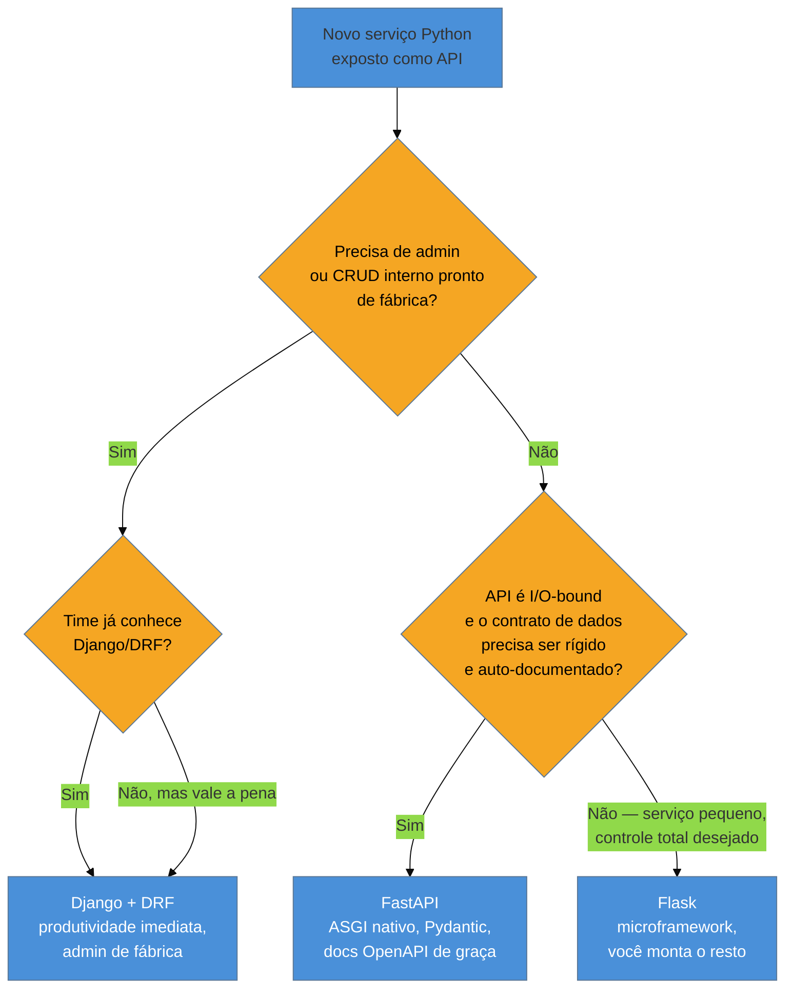

# Django vs. FastAPI vs. Flask — panorama e filosofias

> [!abstract] TL;DR
> Os três frameworks web dominantes do ecossistema Python resolvem o mesmo problema — expor lógica Python como HTTP — com filosofias opostas. **Flask** é um *microframework* WSGI: roteamento e pouco mais, você escolhe e monta ORM, validação, autenticação. **Django** é "baterias inclusas": ORM próprio ([[03-Dominios/Tecnologia/Python/Persistência de dados/04 - Django ORM — QuerySets, managers e migrations nativas|Galho 9, nota 04]]), admin gerado automaticamente, arquitetura MTV opinativa, e hoje roda tanto em WSGI quanto em ASGI. **FastAPI** nasceu ASGI-nativo, usa type hints como contrato de validação via Pydantic, gera documentação OpenAPI de graça, e é hoje a recomendação de mercado predominante no Brasil para APIs novas (fonte: [FastAPI do Zero](https://fastapidozero.dunossauro.com/), Dunossauro). A escolha entre os três não é "qual é melhor" — é qual trade-off seu contexto tolera: Flask quando você precisa de controle total e o projeto é pequeno; Django quando o produto tem CRUD administrativo pesado e o time quer convenção pronta; FastAPI quando a API é o produto, performance de I/O importa, e o contrato de dados precisa ser auto-documentado. O protocolo por baixo de WSGI/ASGI já foi coberto em profundidade em [[03-Dominios/Tecnologia/Python/Programação Reativa e Assíncrona/05 - ASGI e o ecossistema de frameworks assíncronos|Galho 8, nota 05]] — aqui ele só é referenciado.

## A decisão que abre esta nota

Uma squad de quatro pessoas está kickando um projeto novo: uma API que vai servir o catálogo de produtos de um marketplace B2B, consumida por um frontend React e por dois serviços internos. Ninguém no time trabalhou com Python nos últimos dois anos — a última experiência coletiva foi um Django antigo, de 2019, com Django REST Framework por cima.

Na reunião de kickoff, alguém sugere "bora usar Django, é o que a gente já sabe". Outra pessoa, que acabou de sair de um bootcamp, pergunta: "mas não é tudo FastAPI agora? Todo curso novo usa FastAPI". Um terceiro, mais cauteloso, sugere Flask "porque é mais simples, a gente monta só o que precisa".

Ninguém na sala consegue articular **por que** cada opção seria certa ou errada para esse projeto específico — a decisão vira "o que a gente conhece" em vez de "o que o projeto pede". É o mesmo tipo de decisão mal fundamentada que aparece, semanas depois, quando alguém entra num projeto legado e se pergunta: "por que esse serviço aqui é Django e aquele ali é FastAPI? Foi só o dev que escolheu por gosto, ou tinha um motivo?".

> [!question]- Pergunta de entrevista: "Django, Flask ou FastAPI — qual você escolheria para um projeto novo?"
> A resposta errada é escolher um vencedor absoluto. A resposta que demonstra senioridade é enumerar os eixos de decisão — tamanho e maturidade do time, se o serviço precisa de admin/CRUD pronto, se é I/O-bound (API consumindo outras APIs, muito `await`) ou CPU-bound, quão rígido precisa ser o contrato de dados de entrada/saída, e o prazo — e mostrar como cada eixo empurra a resposta para um lado ou outro. Esta nota existe para dar munição a essa resposta.

Os três frameworks não competem em "recursos" no sentido absoluto — eles competem em **onde colocam a opinião**. Entender essa diferença de filosofia é o que orienta qualquer escolha real, e é o mapa que o resto deste galho (roteamento, validação, injeção de dependência, DRF, erros, middleware, docs) vai preencher nota a nota.

## Flask: o microframework — você monta o resto

Flask nasceu em 2010 como uma brincadeira de April Fools' Day de Armin Ronacher que virou framework sério — a proposta original era literalmente "e se um framework Python fosse minúsculo o bastante para caber num arquivo?". Ele roda sobre **WSGI** (a interface síncrona request/response coberta em detalhe em [[03-Dominios/Tecnologia/Python/Programação Reativa e Assíncrona/05 - ASGI e o ecossistema de frameworks assíncronos|Galho 8, nota 05]]) e se autodescreve, na [documentação oficial](https://flask.palletsprojects.com/), como um *"micro"* framework — não porque falte funcionalidade para produção, mas porque o núcleo não decide **nada** por você além de roteamento e um objeto de request/response. Não vem com ORM. Não vem com sistema de autenticação. Não vem com admin. Não vem com validação de dados embutida.

```python
# app.py — Flask
from flask import Flask

app = Flask(__name__)


@app.route("/produtos/<int:produto_id>")
def buscar_produto(produto_id: int):
    return {"id": produto_id, "nome": f"Produto #{produto_id}"}


if __name__ == "__main__":
    app.run(debug=True)
```

`@app.route` é um decorator que registra a função como handler de uma URL — `<int:produto_id>` é um **conversor de tipo** embutido no roteador do Werkzeug (a biblioteca WSGI que o Flask usa por baixo): a URL `/produtos/abc` já devolve 404 antes mesmo do código do handler rodar, porque `abc` não converte para `int`. Fora isso, o handler é uma função Python comum — devolver um dicionário faz o Flask serializar para JSON automaticamente (desde a versão 1.1), mas não há validação do formato de entrada, não há schema declarado, não há geração de documentação. Se você quer validar um corpo de request, você escreve o código de validação à mão, ou soma uma dependência de terceiros (`marshmallow`, `pydantic` usado manualmente, `flask-smorest`).

Essa ausência de opinião é a proposta de valor central do Flask: para um serviço pequeno, um protótipo, ou uma equipe que já sabe exatamente quais peças quer (SQLAlchemy Core em vez de um ORM completo, autenticação customizada, sem admin nenhum), Flask não impõe estrutura nenhuma para desmontar depois. O preço é que **cada decisão arquitetural vira responsabilidade do time**: como organizar módulos num projeto grande (Flask não define isso — `Blueprint` ajuda a modularizar rotas, mas não dita uma estrutura de pastas), como validar entrada, como gerenciar sessão de banco por request. Em times pequenos e disciplinados isso é liberdade; em times grandes e sem convenção, vira "cada serviço Flask organizado de um jeito diferente" — o tipo de inconsistência que Django resolve à força de opinião.

> [!tip] Flask não é "menos capaz" que Django ou FastAPI — é uma escolha deliberada de onde a complexidade mora
> Um serviço Flask de produção real (ex: um webhook receiver, um proxy de autenticação, uma API pequena e estável) frequentemente tem *menos* código de infraestrutura que o equivalente em Django, exatamente porque não carrega peças que o projeto não usa (admin, ORM completo, sistema de templates). A armadilha é achar que Flask é "para brincar" — grandes empresas rodam Flask em produção há mais de uma década (a documentação cita casos como LinkedIn e Pinterest historicamente).

## Django: baterias inclusas — arquitetura MTV, ORM e admin de fábrica

Django é o oposto filosófico: um framework **opinativo**, no sentido positivo do termo — ele toma dezenas de decisões arquiteturais por você, e em troca entrega produtividade imediata para o tipo de aplicação que ele foi desenhado para servir (originalmente, sites de notícias com muito CRUD administrativo; hoje, qualquer aplicação com bastante superfície de dados e telas de gestão). A [documentação oficial](https://docs.djangoproject.com/) resume a proposta: "the web framework for perfectionists with deadlines".

A arquitetura de Django é chamada **MTV** — Model-Template-View — uma variação do MVC clássico com nomenclatura própria que confunde quem já viu MVC em outro framework:

- **Model** — a camada de dados, via [[03-Dominios/Tecnologia/Python/Persistência de dados/04 - Django ORM — QuerySets, managers e migrations nativas|Django ORM]] (já coberto em profundidade no Galho 9 — esta nota não repete `QuerySet`/`Manager`/migrations, só assume que existem).
- **Template** — a camada de apresentação, tipicamente HTML server-rendered (o "View" do MVC clássico) — em uma API REST pura, essa camada em geral não é usada; ela é substituída por serialização JSON via Django REST Framework, que este galho cobre na [[05 - Django REST Framework — serializers, viewsets e routers|nota 05]].
- **View** — o nome de Django para o que MVC chamaria de *controller*: a função (ou classe) que recebe o request, orquestra lógica, e devolve uma resposta (renderizando um Template ou serializando JSON).

```python
# views.py — Django (function-based view, sem DRF ainda)
from django.http import JsonResponse
from django.views.decorators.http import require_GET


@require_GET
def buscar_produto(request, produto_id: int):
    return JsonResponse({"id": produto_id, "nome": f"Produto #{produto_id}"})


# urls.py
from django.urls import path
from . import views

urlpatterns = [
    path("produtos/<int:produto_id>/", views.buscar_produto),
]
```

Repare que, diferente do Flask, a rota não é declarada perto da função — Django separa `urls.py` (o mapeamento de URL) de `views.py` (a lógica), e isso é deliberado: em projetos grandes, ter um arquivo central que lista todas as rotas de um app facilita auditoria, mas cria uma indireção extra que times acostumados com Flask/FastAPI acham desnecessária no início. Esse contraste — decorator inline vs. arquivo de rotas separado — é o assunto da [[02 - Roteamento — decorators, urls.py e path operations|próxima nota deste galho]].

O que Django entrega "de fábrica" e nenhum dos outros dois entrega sem dependência extra:

- **Admin automático** — apontar um `Model` para `admin.py` gera uma interface web completa de CRUD, com autenticação, paginação, busca e filtros, sem escrever uma linha de HTML. Para produtos internos com necessidade real de um painel de gestão de dados, isso economiza semanas.
- **ORM integrado a migrations** — coberto em detalhe na [[03-Dominios/Tecnologia/Python/Persistência de dados/04 - Django ORM — QuerySets, managers e migrations nativas|nota 04 do Galho 9]]; a diferença central frente a SQLAlchemy+Alembic é que `makemigrations`/`migrate` são parte do framework, não uma ferramenta separada.
- **Sistema de autenticação e sessão** prontos (`django.contrib.auth`), com model de usuário, hashing de senha, e middleware de sessão configurados por padrão.
- **Sistema de formulários e validação** (`django.forms`) — mais verboso que Pydantic, mas nativo, sem dependência externa.

O trade-off é o inverso do Flask: Django funciona muito bem **dentro** da forma que ele desenhou (projeto com `settings.py`, `INSTALLED_APPS`, banco relacional, muito CRUD), e cobra atrito real quando o projeto foge desse molde — um serviço que só recebe webhooks e não usa banco nenhum carrega, em Django, uma quantidade de estrutura desproporcional ao que ele realmente precisa.

> [!info] Django hoje não é "só WSGI" — suporte ASGI desde a versão 3.0 (2019)
> Uma confusão comum é achar que Django é puramente síncrono. Desde a 3.0, Django tem suporte nativo a ASGI (rodar sob Uvicorn/Daphne/Hypercorn) e, desde a 4.1, `async def` em views é suportado nativamente. Na prática, a maior parte do ecossistema Django (ORM síncrono por padrão, middlewares legados, o próprio DRF) ainda assume o mundo síncrono — misturar `async def` views com o Django ORM síncrono exige `sync_to_async` explícito, e é um ponto de atrito real que FastAPI simplesmente não tem, por ter nascido assíncrono. Ver [[03-Dominios/Tecnologia/Python/Programação Reativa e Assíncrona/05 - ASGI e o ecossistema de frameworks assíncronos|Galho 8, nota 05]] para o protocolo ASGI em si.

## FastAPI: ASGI nativo, tipagem como contrato

FastAPI é o mais recente dos três (lançado em 2018 por Sebastián Ramírez) e o único desenhado, desde o primeiro commit, em cima de **ASGI** — não WSGI adaptado, ASGI como fundação. Ele é construído sobre **Starlette** (a camada mínima de roteamento e middlewares ASGI) e usa **Pydantic** para validação. A ideia central, segundo a [documentação oficial](https://fastapi.tiangolo.com/): o *type hint* que você já escreveria em Python por boa prática vira, automaticamente, o contrato de validação da API.

```python
# main.py — FastAPI
from fastapi import FastAPI

app = FastAPI()


@app.get("/produtos/{produto_id}")
async def buscar_produto(produto_id: int):
    return {"id": produto_id, "nome": f"Produto #{produto_id}"}
```

À primeira vista, o exemplo parece quase idêntico ao do Flask — decorator, path parameter tipado, retorno de dicionário. A diferença estrutural não aparece no "hello world": aparece no que acontece quando o tipo declarado (`produto_id: int`) não bate com o que chega na URL, ou quando o endpoint espera um corpo de request com formato definido:

```python
from fastapi import FastAPI
from pydantic import BaseModel

app = FastAPI()


class ProdutoEntrada(BaseModel):
    nome: str
    preco_centavos: int
    categoria: str | None = None


@app.post("/produtos")
async def criar_produto(produto: ProdutoEntrada):
    # se o corpo do request não tiver "nome" e "preco_centavos"
    # do tipo certo, o FastAPI já devolveu 422 Unprocessable Entity
    # ANTES desta função ser chamada — nenhuma validação manual aqui.
    return {"id": 1, **produto.model_dump()}
```

Nenhuma linha desse handler valida o corpo do request manualmente. O `BaseModel` do Pydantic — assunto da [[03 - Validação e serialização com Pydantic|nota 03 deste galho]] — descreve o formato esperado, e o FastAPI intercepta o request, tenta popular `ProdutoEntrada` a partir do JSON recebido, e só invoca `criar_produto` se a validação passar; se falhar, devolve `422` com um corpo de erro estruturado apontando exatamente qual campo falhou e por quê. É esse mesmo `BaseModel` — reaproveitado como *contrato de saída* via `response_model` — que gera, automaticamente, a documentação OpenAPI interativa (Swagger UI em `/docs`, ReDoc em `/redoc`), sem nenhuma anotação adicional além dos type hints que o handler já teria por boa prática. Esse é o assunto da [[08 - Documentação automática com OpenAPI|nota 08]].

> [!question]- Por que FastAPI é ASGI nativo mas o exemplo acima também funcionaria em Django 4.1+ com `async def`?
> Suportar `async def` numa view não é a mesma coisa que ser ASGI-nativo de ponta a ponta. Em Django, `async def` numa view funciona, mas o restante do stack (ORM síncrono por padrão, boa parte do middleware do ecossistema) foi desenhado para o mundo síncrono, então misturar exige pontes explícitas (`sync_to_async`/`database_sync_to_async`). Em FastAPI, o próprio framework, o Starlette por baixo, e o servidor (Uvicorn) assumem `async` como o caminho principal desde a raiz — não há um modo "síncrono legado" que o resto do ecossistema ainda espera por padrão. Isso não torna FastAPI "melhor" em abstrato: numa API majoritariamente CPU-bound, sem muito I/O concorrente (chamadas a outras APIs, banco, filas), a vantagem de ser assíncrono desde a raiz simplesmente não se manifesta.

FastAPI não tem ORM próprio, nem admin, nem sistema de autenticação embutido — nesse eixo específico ele é mais parecido com Flask do que com Django: minimalista no núcleo, com a diferença de que **validação e documentação** vêm de fábrica, porque são o problema central que o framework foi desenhado para resolver. A peça que o torna produtivo em aplicações reais é o sistema de injeção de dependência (`Depends`), coberto na [[04 - Injeção de dependência no FastAPI — Depends|nota 04]] — é ele que resolve, de forma limpa, coisas como "abrir uma sessão de banco por request e fechar no fim", sem reinventar o meio-termo entre "sem estrutura nenhuma" (Flask puro) e "framework completo" (Django).

## O mesmo endpoint, três frameworks

Para tornar o contraste concreto, os três blocos abaixo implementam **exatamente o mesmo endpoint**: `GET /produtos/{id}`, recebendo um path parameter inteiro, devolvendo um JSON com `id` e `nome`, e retornando `404` quando o produto não existe.

```python
# ── Flask ──────────────────────────────────────────────
from flask import Flask, abort

app = Flask(__name__)

PRODUTOS = {1: "Teclado mecânico", 2: "Monitor 27''"}


@app.route("/produtos/<int:produto_id>")
def buscar_produto(produto_id: int):
    nome = PRODUTOS.get(produto_id)
    if nome is None:
        abort(404)  # sem corpo estruturado por padrão — você monta o formato
    return {"id": produto_id, "nome": nome}
```

```python
# ── Django (function-based view) ──────────────────────
from django.http import JsonResponse, Http404

PRODUTOS = {1: "Teclado mecânico", 2: "Monitor 27''"}


def buscar_produto(request, produto_id: int):
    nome = PRODUTOS.get(produto_id)
    if nome is None:
        raise Http404("Produto não encontrado")
    return JsonResponse({"id": produto_id, "nome": nome})


# urls.py: path("produtos/<int:produto_id>/", buscar_produto)
```

```python
# ── FastAPI ─────────────────────────────────────────────
from fastapi import FastAPI, HTTPException

app = FastAPI()

PRODUTOS = {1: "Teclado mecânico", 2: "Monitor 27''"}


@app.get("/produtos/{produto_id}")
async def buscar_produto(produto_id: int):
    nome = PRODUTOS.get(produto_id)
    if nome is None:
        raise HTTPException(status_code=404, detail="Produto não encontrado")
    return {"id": produto_id, "nome": nome}
```

Três observações saltam desse comparativo lado a lado, cada uma apontando para uma nota futura do galho:

1. **A conversão de tipo do path parameter** (`<int:produto_id>` no Flask, `<int:produto_id>` no Django, `produto_id: int` no FastAPI) já existe nos três — nenhum deles exige parsing manual de string para inteiro. A sintaxe difere; o mecanismo de "rejeitar antes de chegar no handler" é comum. Detalhado na [[02 - Roteamento — decorators, urls.py e path operations|nota 02]].
2. **O formato do erro 404** é ad-hoc em Flask e Django (você decide o corpo da resposta de erro), e semi-estruturado em FastAPI (`HTTPException` já define um formato JSON consistente `{"detail": "..."}` usado em toda a aplicação). Nenhum dos três impõe, por padrão, um formato como RFC 7807 Problem Details — isso é assunto da [[06 - Tratamento de erros e respostas HTTP padronizadas|nota 06]].
3. **Nenhum dos três exemplos usa validação de corpo de request** (é um `GET` simples) — a diferença mais profunda entre eles só aparece em `POST`/`PUT` com corpo JSON, como no exemplo de `ProdutoEntrada` acima, e é o assunto central da [[03 - Validação e serialização com Pydantic|nota 03]].

## Árvore de decisão



Essa árvore é uma simplificação didática — na prática, os eixos não são binários e frequentemente se combinam (um projeto pode ter admin pesado **e** precisar de I/O concorrente, e nesse caso a resposta comum de mercado é Django + Celery/async tasks, ou até dois serviços separados). Mas ela captura a primeira pergunta que vale fazer antes de qualquer outra: **este serviço precisa de um painel administrativo pronto?** Se sim, o custo de reconstruir isso manualmente em Flask ou FastAPI raramente compensa. Se não, a pergunta seguinte é sobre a natureza do tráfego e a rigidez do contrato.

## Tabela de decisão

| Critério | Flask | Django | FastAPI |
|---|---|---|---|
| Protocolo | WSGI (síncrono) | WSGI ou ASGI (híbrido, desde 3.0) | ASGI nativo |
| Filosofia | Microframework, minimalista | "Baterias inclusas", opinativo | Minimalista + tipagem como contrato |
| ORM nativo | Não (SQLAlchemy é a escolha comum) | Sim — [[03-Dominios/Tecnologia/Python/Persistência de dados/04 - Django ORM — QuerySets, managers e migrations nativas\|Django ORM]] | Não (SQLAlchemy async/SQLModel são as escolhas comuns) |
| Admin pronto | Não | Sim, gerado do `Model` | Não |
| Validação de request | Manual ou lib de terceiros | `django.forms` / DRF `Serializer` | Pydantic, automática via type hints |
| Documentação automática | Não nativa (`flasgger`/`apispec`) | Não nativa (`drf-spectacular`) | Sim, OpenAPI + Swagger UI/ReDoc de graça |
| Curva de aprendizado | Baixa para o núcleo, sobe com as peças que você soma | Média-alta (muita convenção para aprender) | Baixa-média (type hints + Pydantic) |
| Melhor encaixe | Serviço pequeno, webhook, protótipo, controle total | Produto com CRUD administrativo pesado | API-first, alto I/O concorrente, contrato rígido |
| Maturidade (ano de origem) | 2010 | 2005 | 2018 |
| Recomendação de mercado atual (BR) | Nicho, casos específicos | Forte para produtos com admin | Predominante para APIs novas |

> [!warning] Armadilha: escolher pela popularidade do momento, não pelo formato do problema
> É comum ver "vamos usar FastAPI porque é o que todo curso ensina agora" sem examinar se o projeto realmente precisa do que FastAPI faz bem (I/O concorrente, contrato de dados rígido). Um sistema de gestão interna com quinze telas de CRUD, poucos usuários simultâneos, e necessidade forte de painel administrativo é, objetivamente, mais barato de construir em Django — o admin automático sozinho paga o "custo" da opinião do framework. A pergunta certa nunca é "o que está em alta", é "que peças este projeto específico precisa, e qual framework já vem com elas".

> [!warning] Armadilha: achar que FastAPI é "Flask com validação" e ignorar a diferença de protocolo
> A superfície de API do FastAPI (decorators, funções, retorno de dicionário) lembra Flask de propósito — a curva de aprendizado foi desenhada para ser familiar a quem já usou Flask. Mas por baixo, FastAPI é ASGI e Flask é WSGI: se um handler FastAPI faz uma chamada de rede bloqueante sem `await` (uma biblioteca HTTP síncrona, por exemplo), ele **bloqueia o event loop inteiro** para todos os requests concorrentes, algo que não tem equivalente direto no modelo WSGI de "uma thread por request". Rodar código bloqueante corretamente dentro de handlers `async def` do FastAPI exige entender o event loop — assunto já coberto em [[03-Dominios/Tecnologia/Python/Programação Reativa e Assíncrona/01 - Event loop por dentro — selectors, callbacks e a relação Future-Task|Galho 8, nota 01]] — não é gratuito trocar de protocolo.

## Critérios de escolha, em ordem de peso prático

Quando a pergunta chega numa entrevista ou numa reunião de arquitetura real, estes são os eixos que efetivamente movem a decisão, aproximadamente em ordem de impacto:

1. **Precisa de admin/CRUD administrativo pronto de fábrica?** Se sim, Django economiza semanas reais de trabalho que os outros dois exigiriam construir do zero (ou integrar uma lib de terceiros que nunca fica tão polida quanto o admin nativo).
2. **A API é I/O-bound de verdade?** Um serviço que passa a maior parte do tempo esperando banco, outras APIs, ou filas — não CPU rodando cálculo — se beneficia do modelo assíncrono. Se o serviço é majoritariamente CPU-bound (processamento pesado, sem muita espera de I/O concorrente), a vantagem do ASGI simplesmente não aparece, e o GIL limita o ganho de qualquer jeito — assunto que a trilha de concorrência já cobriu em [[03-Dominios/Tecnologia/Python/Concorrência e paralelismo/index|Galho 7]].
3. **Quão rígido precisa ser o contrato de dados?** APIs consumidas por times externos, ou por múltiplos serviços internos que dependem de um schema estável, se beneficiam do contrato via Pydantic e da documentação automática do FastAPI — errar o formato de um payload vira `422` imediato, não um bug silencioso descoberto em produção.
4. **Tamanho e maturidade do time.** Um time pequeno e sênior tira proveito da liberdade do Flask sem se perder. Um time grande, com rotatividade, geralmente se beneficia da convenção forte do Django — menos decisões arquiteturais deixadas ao gosto de cada dev.
5. **Prazo.** Django entrega mais "de graça" no dia 1 (auth, admin, ORM, migrations) se o projeto se encaixa no molde que ele espera. FastAPI entrega contrato de API rápido e documentado, mas cada peça de infraestrutura (auth, persistência) é uma escolha e integração separada.
6. **Ecossistema de bibliotecas de terceiros.** Django tem o ecossistema mais maduro e numeroso (Django tem 20 anos de pacotes de terceiros para praticamente qualquer necessidade — pagamento, CMS, permissões granulares). FastAPI tem um ecossistema mais jovem, mas crescendo rápido, fortemente puxado por tipagem e Pydantic.
7. **Curva de aprendizado para quem entra no time depois.** FastAPI, por se apoiar em type hints que já são boa prática Python moderna, tende a ser mais rápido de onboardar para devs com experiência recente na linguagem; Django tem uma superfície conceitual maior (apps, `settings.py`, ORM próprio, ciclo de vida de middleware) que leva mais tempo para internalizar por completo.

> [!question]- "Um projeto pode misturar os três?" — é uma pergunta capciosa de entrevista
> Tecnicamente sim (é comum ver, numa organização, um Django legado ao lado de novos serviços em FastAPI), mas dentro de **um mesmo processo/aplicação**, misturar não faz sentido — cada framework tem seu próprio ciclo de vida de request, seu próprio jeito de rodar (WSGI vs ASGI), e misturar aumenta a complexidade operacional sem ganho real. O padrão de mercado saudável é "framework por serviço", numa arquitetura de múltiplos serviços, não "framework por endpoint" dentro do mesmo serviço.

## O que vem a seguir

Esta nota deu o mapa: três filosofias — minimalismo (Flask), convenção com baterias inclusas (Django), tipagem como contrato (FastAPI) — e os eixos reais que movem a escolha entre elas. O resto do galho aprofunda os temas que apareceram aqui só de raspão, quase sempre comparando os três lado a lado no mesmo padrão desta nota:

- [[02 - Roteamento — decorators, urls.py e path operations|02 — Roteamento]] — como cada framework mapeia URL para código, incluindo `Blueprint` (Flask), `include()`/class-based views (Django) e `APIRouter` (FastAPI).
- [[03 - Validação e serialização com Pydantic|03 — Validação e serialização com Pydantic]] — aprofunda o `BaseModel` que apareceu de leve no exemplo de `ProdutoEntrada` acima.
- [[04 - Injeção de dependência no FastAPI — Depends|04 — Injeção de dependência no FastAPI]] — o mecanismo que resolve, no FastAPI, o meio-termo entre "sem estrutura" e "framework completo".
- [[05 - Django REST Framework — serializers, viewsets e routers|05 — Django REST Framework]] — a camada REST que Django não tem nativamente, contrastada diretamente com Pydantic.
- [[06 - Tratamento de erros e respostas HTTP padronizadas|06 — Tratamento de erros e respostas HTTP padronizadas]] — o que os três exemplos de 404 acima deixaram em aberto.
- [[07 - Middleware e o ciclo de vida da requisição|07 — Middleware e o ciclo de vida da requisição]] — volta ao protocolo ASGI/WSGI para explicar onde middleware se encaixa em cada um.
- [[08 - Documentação automática com OpenAPI|08 — Documentação automática com OpenAPI]] — por que "docs de graça" é um dos argumentos centrais a favor do FastAPI em entrevista.
- [[09 - Capstone — uma API REST completa de ponta a ponta|09 — Capstone]] — fecha o galho construindo uma API real com FastAPI + a persistência do Galho 9.

## Fontes

- Flask. *Welcome to Flask*. flask.palletsprojects.com, versão estável (3.x). https://flask.palletsprojects.com/ (acessado em 2026-07-11) — filosofia de microframework, `@app.route`, conversores de tipo de URL.
- Django Software Foundation. *Django overview*. docs.djangoproject.com, versão estável (5.x). https://docs.djangoproject.com/en/stable/#the-model-layer (acessado em 2026-07-11) — arquitetura MTV, admin, ORM, sistema de formulários.
- Django Software Foundation. *Asynchronous support*. docs.djangoproject.com, versão estável (5.x). https://docs.djangoproject.com/en/stable/topics/async/ (acessado em 2026-07-11) — suporte ASGI desde 3.0, `async def` views desde 4.1, `sync_to_async`.
- FastAPI. *FastAPI — Documentation*. fastapi.tiangolo.com. https://fastapi.tiangolo.com/ (acessado em 2026-07-11) — type hints como contrato, geração automática de OpenAPI, base em Starlette e Pydantic.
- Ramírez, Sebastián (via FastAPI docs). *Alternatives*. fastapi.tiangolo.com. https://fastapi.tiangolo.com/alternatives/ (acessado em 2026-07-11) — histórico comparativo de FastAPI frente a Flask/Django/outros frameworks Python.
- Dunossauro (Eduardo Mendes). *FastAPI do Zero*. fastapidozero.dunossauro.com. https://fastapidozero.dunossauro.com/ (acessado em 2026-07-11) — referência canônica em português sobre FastAPI em produção; base para a recomendação de mercado citada nesta nota.
- Real Python. *Flask vs. Django: Choosing the Right Python Framework*. realpython.com. https://realpython.com/ (acessado em 2026-07-11) — comparativo de filosofias e casos de uso entre Flask e Django.
- [[03-Dominios/Tecnologia/Python/Programação Reativa e Assíncrona/05 - ASGI e o ecossistema de frameworks assíncronos|05 — ASGI e o ecossistema de frameworks assíncronos]] — nota irmã (Galho 8), base do protocolo WSGI/ASGI referenciado aqui, não repetida nesta nota.
- [[03-Dominios/Tecnologia/Python/Persistência de dados/04 - Django ORM — QuerySets, managers e migrations nativas|04 — Django ORM]] — nota irmã (Galho 9), base do ORM do Django referenciado aqui, não repetida nesta nota.

Consultado em 2026-07-11.
