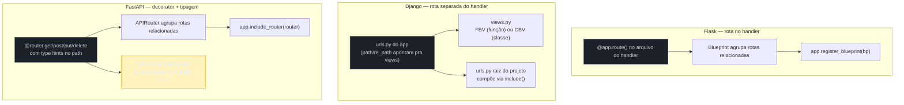

# Roteamento — decorators, urls.py e path operations

> [!abstract] TL;DR
> Os três frameworks resolvem o mesmo problema — mapear um método HTTP + uma URL a uma função — com filosofias distintas de onde a tabela de rotas vive. No **Flask**, a rota é declarada **no próprio handler**, via decorator `@app.route("/caminho", methods=[...])`; `Blueprint` agrupa rotas relacionadas num módulo, registrado depois no app com um prefixo. No **Django**, a rota vive **separada do handler**, num arquivo `urls.py` que mapeia padrões de URL (`path()`/`re_path()`) a views — que podem ser funções (FBV) ou classes (CBV, como `View`/`ListView`); `include()` compõe `urls.py` de apps diferentes num projeto maior, preservando namespacing. No **FastAPI**, o padrão volta a ser decorator-based como o Flask (`@app.get`, `@app.post`...), mas path parameters são **tipados via type hints** (`{item_id: int}`) — e essa tipagem já dispara validação automática antes do handler rodar, o gancho que a próxima nota do galho desenvolve. Um detalhe que parece cosmético — a barra final da URL (`/tarefas` vs. `/tarefas/`) — se comporta de forma **diferente e com consequências reais** nos três frameworks, especialmente em requisições `POST`, e é o fio condutor desta nota.

## O bug que abre esta nota

Uma equipe está construindo a API de um app de tarefas. O time mobile testa localmente contra a API em desenvolvimento e reporta um comportamento estranho: **às vezes** a tarefa é criada duas vezes, **às vezes** não é criada, e o corpo de erro que volta é inconsistente entre ambientes. O backend está em Django; a rota está declarada assim:

```python
# tarefas/urls.py
from django.urls import path
from . import views

urlpatterns = [
    path("tarefas/", views.criar_tarefa),   # nota a barra final
]
```

O cliente mobile, por convenção interna do time (baseada em outra API, feita em Node), faz `POST` sem a barra final:

```
POST /tarefas HTTP/1.1
Content-Type: application/json

{"titulo": "Comprar leite"}
```

A URL cadastrada tem barra final (`tarefas/`); a requisição chegou sem barra (`tarefas`). O Django, por padrão, tem `APPEND_SLASH = True` — quando nenhuma rota bate com a URL exata mas existe uma rota idêntica **com** barra no final, o `CommonMiddleware` responde com um redirecionamento em vez de `404`. Até aqui parece uma conveniência inofensiva. O problema é **o que acontece com o corpo da requisição durante esse redirecionamento**, e a resposta depende do cliente HTTP que fez a chamada:

> [!bug] O que está quebrado, em uma frase
> `APPEND_SLASH` redireciona `POST /tarefas` para `POST /tarefas/`, mas o **código de status do redirecionamento** (301, historicamente) instrui muitos clientes HTTP a converter o método para `GET` e **descartar o corpo** da requisição original — a tarefa nunca chega a ser criada no destino, ou é criada com corpo vazio, dependendo de como aquele cliente específico trata redirects em `POST`.

O comportamento "às vezes duas vezes, às vezes nenhuma" que o time mobile reportou tinha uma causa simples: alguns dispositivos reenviavam o `POST` completo no redirecionamento (comportamento não padronizado, mas comum em clientes HTTP modernos que tratam 301 de forma mais permissiva que a RFC original manda), gerando duas tentativas de criação; outros seguiam a RFC à risca, convertiam para `GET` e descartavam o corpo, e a "criação" nunca acontecia — só um `GET /tarefas/` inofensivo, que o Django atendia listando tarefas (o método `GET` acabou batendo em outra view, por coincidência de rota).

> [!question]- Por que o Django não corrige isso automaticamente para métodos como POST?
> Porque a correção depende do cliente, não do servidor. A documentação do Django é explícita sobre o risco: `APPEND_SLASH` funciona bem para `GET` (onde não há corpo em jogo e um redirect é barato), mas para métodos com corpo (`POST`, `PUT`, `PATCH`) o comportamento correto do cliente diante de um `301`/`308` é ambíguo o suficiente para não ser confiável em produção. A recomendação prática — e o que qualquer time backend sênior faz — é **nunca depender de `APPEND_SLASH` para métodos de escrita**: a rota certa é cadastrada sem ambiguidade, e o cliente é corrigido para bater exatamente na URL esperada, sem contar com o middleware para "consertar" a barra.

Esse é só o Django. Flask e FastAPI resolvem o mesmo problema de barra final de formas diferentes — e entender as três é o que evita reproduzir esse bug num outro stack achando que "resolvido uma vez, resolvido sempre". Antes de voltar a esse tema em profundidade, vale construir o vocabulário de roteamento dos três frameworks.

## Flask: rota dentro do handler

Flask segue a filosofia "a rota é um detalhe do próprio handler" — o decorator `@app.route()` (ou, em versões mais recentes, os atalhos `@app.get()`/`@app.post()`) declara a URL e o(s) verbo(s) HTTP **na mesma linha** onde a função é definida.

```python
from flask import Flask, jsonify, request

app = Flask(__name__)

tarefas_db: dict[int, dict] = {}
proximo_id = 1


@app.route("/tarefas", methods=["GET"])
def listar_tarefas():
    return jsonify(list(tarefas_db.values()))


@app.route("/tarefas/<int:tarefa_id>", methods=["GET"])
def buscar_tarefa(tarefa_id: int):
    tarefa = tarefas_db.get(tarefa_id)
    if tarefa is None:
        return jsonify({"erro": "não encontrada"}), 404
    return jsonify(tarefa)


@app.route("/tarefas", methods=["POST"])
def criar_tarefa():
    global proximo_id
    dados = request.get_json()
    tarefa = {"id": proximo_id, "titulo": dados["titulo"], "concluida": False}
    tarefas_db[proximo_id] = tarefa
    proximo_id += 1
    return jsonify(tarefa), 201
```

Três detalhes de mecanismo valem atenção:

- **`methods=[...]`** é uma lista — um handler pode responder a mais de um verbo na mesma rota, checando `request.method` dentro do corpo se precisar de lógica diferente por verbo (embora seja mais comum, e mais limpo, dividir em handlers separados como acima).
- **Conversores de tipo na URL** (`<int:tarefa_id>`) fazem parte da sintaxe de rota do Werkzeug (a biblioteca de roteamento sob o Flask) — `<tarefa_id>` sozinho captura uma `string`; `<int:tarefa_id>` só bate se o segmento for numérico, e já entrega o valor convertido para `int` no parâmetro da função. Outros conversores nativos: `<float:...>`, `<path:...>` (aceita barras dentro do segmento), `<uuid:...>`.
- **Sem tipagem obrigatória no retorno** — o handler devolve o que quiser (dict, tupla `(corpo, status)`, um objeto `Response`), e é responsabilidade do desenvolvedor serializar com `jsonify()`. Não há validação automática de payload de entrada — isso é justamente uma das lacunas que motiva Pydantic/marshmallow como dependências externas em projetos Flask maiores.

### `Blueprint`: organizando rotas em módulos

Um app Flask real não declara todas as rotas no mesmo arquivo — `Blueprint` é o mecanismo para agrupar rotas relacionadas (por exemplo, tudo que é `/tarefas/*`) num módulo separado, registrado no app principal só depois:

```python
# tarefas/routes.py
from flask import Blueprint, jsonify, request

bp = Blueprint("tarefas", __name__, url_prefix="/tarefas")


@bp.route("", methods=["GET"])
def listar_tarefas():
    ...


@bp.route("/<int:tarefa_id>", methods=["GET"])
def buscar_tarefa(tarefa_id: int):
    ...
```

```python
# app.py
from flask import Flask
from tarefas.routes import bp as tarefas_bp

app = Flask(__name__)
app.register_blueprint(tarefas_bp)   # todas as rotas de bp ganham o prefixo /tarefas
```

`url_prefix` no `Blueprint` funciona como uma composição de path — cada rota interna do blueprint (`""`, `"/<int:tarefa_id>"`) é concatenada ao prefixo no momento do registro. Um `Blueprint` também pode compor outros `Blueprint`s (`bp.register_blueprint(sub_bp)`), o que permite hierarquias de rotas em aplicações grandes sem que um único arquivo cresça sem controle.

> [!tip] `strict_slashes` por rota
> `@app.route()` aceita `strict_slashes=False` para desligar, rota a rota, o comportamento de redirecionamento por barra final descrito no bug de abertura — útil quando se sabe que um cliente específico não segue a convenção padrão do framework.

## Django: rota separada do handler, em `urls.py`

Django inverte a filosofia do Flask: a tabela de rotas vive **fora** dos handlers, num (ou mais) arquivo `urls.py`, que mapeia padrões de URL a *views* — funções ou classes, dependendo do estilo escolhido.

```python
# tarefas/urls.py
from django.urls import path
from . import views

urlpatterns = [
    path("tarefas/", views.listar_tarefas, name="listar_tarefas"),
    path("tarefas/<int:tarefa_id>/", views.buscar_tarefa, name="buscar_tarefa"),
]
```

`path()` usa **conversores de tipo** parecidos com os do Flask — `<int:tarefa_id>` só bate com dígitos e converte automaticamente para `int`; outros built-ins incluem `<str:...>` (padrão, qualquer texto sem barra), `<slug:...>`, `<uuid:...>`, `<path:...>`. Para padrões que os conversores nativos não cobrem (uma regex arbitrária), existe `re_path()`:

```python
from django.urls import re_path

urlpatterns = [
    re_path(r"^tarefas/(?P<tarefa_id>[0-9]{4})/$", views.buscar_tarefa),  # exige exatamente 4 dígitos
]
```

### Function-Based Views (FBV) vs. Class-Based Views (CBV)

Django suporta dois estilos de view, e a diferença não é cosmética — é uma escolha de **como o dispatch por verbo HTTP acontece**.

**FBV** — a view é uma função só; o próprio corpo checa `request.method` (ou o decorator `@require_http_methods` restringe verbos aceitos):

```python
# tarefas/views.py (FBV)
from django.http import JsonResponse
from django.views.decorators.http import require_http_methods

from .models import Tarefa


@require_http_methods(["GET"])
def listar_tarefas(request):
    tarefas = list(Tarefa.objects.values("id", "titulo", "concluida"))
    return JsonResponse(tarefas, safe=False)


@require_http_methods(["POST"])
def criar_tarefa(request):
    import json
    dados = json.loads(request.body)
    tarefa = Tarefa.objects.create(titulo=dados["titulo"])
    return JsonResponse({"id": tarefa.id, "titulo": tarefa.titulo}, status=201)
```

**CBV** — a view é uma classe; cada verbo HTTP vira um **método** (`get`, `post`, `put`, `delete`...) da mesma classe, e o Django despacha automaticamente para o método certo com base no verbo da requisição:

```python
# tarefas/views.py (CBV, herda de View genérica)
import json
from django.http import JsonResponse
from django.views import View

from .models import Tarefa


class TarefaListView(View):
    def get(self, request):
        tarefas = list(Tarefa.objects.values("id", "titulo", "concluida"))
        return JsonResponse(tarefas, safe=False)

    def post(self, request):
        dados = json.loads(request.body)
        tarefa = Tarefa.objects.create(titulo=dados["titulo"])
        return JsonResponse({"id": tarefa.id, "titulo": tarefa.titulo}, status=201)
```

```python
# tarefas/urls.py — CBV precisa de .as_view() no registro
from django.urls import path
from .views import TarefaListView

urlpatterns = [
    path("tarefas/", TarefaListView.as_view(), name="tarefas_list"),
]
```

`as_view()` é o que transforma a classe num handler compatível com o dispatcher do Django — internamente, devolve uma função que instancia a classe a cada requisição e chama `dispatch()`, que por sua vez olha `request.method.lower()` e invoca o método de mesmo nome na instância.

O Django também oferece **generic views** prontas para padrões CRUD comuns (`ListView`, `DetailView`, `CreateView`, `UpdateView`, `DeleteView`) — pensadas originalmente para views que renderizam HTML via template, não para JSON puro; numa API REST feita em Django puro (sem DRF), FBV ou `View` genérica cobrem a maior parte dos casos, e as generic views de alto nível (`ListView` etc.) raramente aparecem — o padrão real para API REST em produção é o [[05 - Django REST Framework — serializers, viewsets e routers|Django REST Framework]], que reintroduz uma camada de CBVs especializadas (`APIView`, `ViewSet`) para esse propósito, tema da nota 05 deste galho.

> [!question]- Por que Django tem os dois estilos, em vez de escolher um?
> Historicamente, FBV veio primeiro (é o estilo mais simples e explícito) e CBV chegou depois, para resolver duplicação: sem CBV, dois endpoints com lógica parecida por verbo (`GET` retorna dados, `POST` cria) acabam repetindo checagem de `request.method` e boilerplate de erro em toda função. CBV também permite herança — uma `View` base com autenticação/paginação comum, estendida por views específicas — algo que FBV só consegue via decorators empilhados, que ficam menos legíveis conforme crescem. Em entrevista, a resposta sênior nomeia o trade-off: FBV é mais direto para endpoints simples e isolados; CBV compensa quando há comportamento compartilhado entre várias views (a mesma razão pela qual DRF é inteiramente construído em cima de CBV).

### `include()`: compondo `urls.py` de apps diferentes

Um projeto Django real tem múltiplos *apps* (módulos de domínio — `tarefas`, `usuarios`, `notificacoes`), cada um com seu próprio `urls.py`. O `urls.py` **raiz** do projeto não lista cada rota individualmente — ele delega blocos inteiros de URL para os `urls.py` de cada app via `include()`:

```python
# projeto/urls.py (raiz)
from django.urls import path, include

urlpatterns = [
    path("api/tarefas/", include("tarefas.urls")),
    path("api/usuarios/", include("usuarios.urls")),
]
```

```python
# tarefas/urls.py (do app, sem o prefixo /api/tarefas — isso já veio do include())
from django.urls import path
from . import views

app_name = "tarefas"   # habilita namespacing: reverse("tarefas:detalhe")

urlpatterns = [
    path("", views.listar_tarefas, name="lista"),
    path("<int:tarefa_id>/", views.buscar_tarefa, name="detalhe"),
]
```

`include()` faz duas coisas ao mesmo tempo: concatena o prefixo (`api/tarefas/` + `` ou `<int:tarefa_id>/`) e, quando o app declara `app_name`, habilita **namespacing** — a URL da tarefa 42 pode ser resolvida de volta com `reverse("tarefas:detalhe", args=[42])` em vez de hardcodar a string `/api/tarefas/42/` em qualquer lugar do código (templates, testes, respostas de API com links). Esse desacoplamento entre "qual é a URL literal" e "qual view eu quero referenciar" é o que permite mudar o prefixo (`api/tarefas/` → `v2/tarefas/`) numa linha só, sem caçar strings hardcoded pelo projeto inteiro.

## FastAPI: decorators tipados, `APIRouter` e path params como contrato

FastAPI volta ao estilo decorator do Flask — rota declarada junto do handler — mas com duas diferenças que mudam a ergonomia por completo: um decorator por verbo HTTP (não uma lista `methods=[...]`) e **tipagem via type hints** nos parâmetros de rota, que a própria assinatura da função já usa para gerar validação.

```python
from fastapi import FastAPI

app = FastAPI()

tarefas_db: dict[int, dict] = {}
proximo_id = 1


@app.get("/tarefas")
def listar_tarefas():
    return list(tarefas_db.values())


@app.get("/tarefas/{tarefa_id}")
def buscar_tarefa(tarefa_id: int):          # tipo int no path param
    if tarefa_id not in tarefas_db:
        return {"erro": "não encontrada"}
    return tarefas_db[tarefa_id]


@app.post("/tarefas", status_code=201)
def criar_tarefa(titulo: str):
    global proximo_id
    tarefa = {"id": proximo_id, "titulo": titulo, "concluida": False}
    tarefas_db[proximo_id] = tarefa
    proximo_id += 1
    return tarefa
```

### Path parameters tipados: o type hint já é o contrato

`tarefa_id: int` na assinatura de `buscar_tarefa` não é decoração cosmética — o FastAPI **lê essa anotação em tempo de execução** (via `inspect` + o motor de validação do Pydantic, que roda por baixo) e usa o tipo declarado para decidir se o segmento da URL bate com a rota:

```python
@app.get("/tarefas/{tarefa_id}")
def buscar_tarefa(tarefa_id: int):
    ...
```

Requisitar `GET /tarefas/abc` (uma string onde o contrato espera `int`) nunca chega ao corpo da função — o FastAPI intercepta a conversão de tipo antes de rodar o handler, e responde automaticamente com `422 Unprocessable Entity`, detalhando qual campo falhou e por quê, sem que o desenvolvedor escreva um `try/except` de conversão manual.

> [!warning] Um path param mal tipado falha, mas não do jeito que a intuição sugere
> A armadilha comum aqui não é o FastAPI aceitar um valor errado — é o desenvolvedor **assumir que a validação cobre mais do que ela cobre**. `tarefa_id: int` garante que o valor é um inteiro válido; não garante que a tarefa com aquele ID **existe**. É comum, especialmente vindo de linguagens onde tipagem estática cobre mais terreno, esperar que "passou a validação de tipo" implique "o recurso está lá" — e escrever `tarefas_db[tarefa_id]` sem checagem, produzindo um `KeyError` não tratado (500) em vez do `404` esperado quando o ID é numericamente válido mas não existe. Tipagem de path param resolve **forma**, não **existência** — a checagem de existência continua sendo responsabilidade explícita do handler, como no exemplo acima (`if tarefa_id not in tarefas_db`).

O mecanismo por trás dessa validação automática — como o Pydantic transforma anotações de tipo em regras de validação, o que acontece com tipos compostos, `Optional`, validadores customizados, e como isso se estende ao corpo da requisição (não só ao path) — é o assunto central da [[03 - Validação e serialização com Pydantic|próxima nota do galho]]; aqui vale reter só que a tipagem do path parameter já é, silenciosamente, a primeira camada de validação de toda API FastAPI.

### Query parameters com defaults

Parâmetros que **não aparecem** no template da URL (`{tarefa_id}` não conta como query param) são inferidos como query parameters automaticamente — a diferença entre path param e query param no FastAPI não é uma anotação especial, é simplesmente **estar ou não estar entre chaves na string da rota**:

```python
@app.get("/tarefas")
def listar_tarefas(concluida: bool | None = None, limite: int = 20, offset: int = 0):
    resultado = list(tarefas_db.values())
    if concluida is not None:
        resultado = [t for t in resultado if t["concluida"] == concluida]
    return resultado[offset : offset + limite]
```

`concluida`, `limite` e `offset` não estão no path (`/tarefas`) — o FastAPI os trata como query params automaticamente, e o valor-default na assinatura (`= 20`, `= 0`, `= None`) faz o parâmetro **opcional** na URL: `GET /tarefas?limite=5&concluida=true` funciona, e `GET /tarefas` sozinho também funciona, caindo nos defaults. Um parâmetro sem valor-default (`tarefa_id: int` no path, ou um query param declarado sem `= ...`) é **obrigatório** — omiti-lo produz `422` com a mensagem "field required".

### `APIRouter`: organizando rotas em módulos

O equivalente FastAPI ao `Blueprint` do Flask é `APIRouter` — um objeto que agrupa rotas relacionadas num módulo separado, "montado" no app principal com `include_router()`:

```python
# tarefas/router.py
from fastapi import APIRouter

router = APIRouter(prefix="/tarefas", tags=["tarefas"])


@router.get("")
def listar_tarefas():
    ...


@router.get("/{tarefa_id}")
def buscar_tarefa(tarefa_id: int):
    ...


@router.post("", status_code=201)
def criar_tarefa(titulo: str):
    ...
```

```python
# main.py
from fastapi import FastAPI
from tarefas.router import router as tarefas_router

app = FastAPI()
app.include_router(tarefas_router)
```

A semelhança com `Blueprint` é deliberada — `prefix` funciona identicamente (concatenado a cada rota interna do router), e `APIRouter`s também podem ser aninhados (`router_pai.include_router(router_filho)`) para hierarquias de módulo em aplicações grandes. `tags=["tarefas"]` é um detalhe que não existe no Flask: agrupa essas rotas visualmente na documentação OpenAPI gerada automaticamente, tema da nota 08 do galho.



## O mesmo CRUD, lado a lado

Para fixar as diferenças de ergonomia, vale ver o **mesmo recurso** — um CRUD simples de tarefas — roteado de ponta a ponta nos três frameworks. A tabela mapeia cada operação ao trecho equivalente:

| Operação | Flask | Django (FBV + urls.py) | FastAPI |
|---|---|---|---|
| Listar | `@app.route("/tarefas", methods=["GET"])` | `path("tarefas/", views.listar)` | `@app.get("/tarefas")` |
| Buscar por ID | `@app.route("/tarefas/<int:id>")` | `path("tarefas/<int:id>/", views.buscar)` | `@app.get("/tarefas/{id}")` com `id: int` |
| Criar | `@app.route("/tarefas", methods=["POST"])` | `path("tarefas/", views.criar)` (mesma URL, verbo checado dentro) | `@app.post("/tarefas")` |
| Atualizar | `@app.route("/tarefas/<int:id>", methods=["PUT"])` | mesma URL, verbo checado dentro (FBV) ou `def put(self, ...)` (CBV) | `@app.put("/tarefas/{id}")` |
| Remover | `@app.route("/tarefas/<int:id>", methods=["DELETE"])` | mesma URL, verbo checado dentro | `@app.delete("/tarefas/{id}")` |

O padrão que salta aos olhos: **Flask e Django FBV compartilham a mesma URL para múltiplos verbos**, diferenciando por `methods=[...]` (Flask) ou checagem manual de `request.method` (Django FBV) — a URL é a chave primária de roteamento, o verbo é um filtro adicional dentro dela. **FastAPI e Django CBV** fazem o oposto: cada verbo tem seu próprio decorator/método nomeado, e a URL some do meio — não existe um "roteador central" onde se declara "esta URL aceita estes verbos", cada combinação verbo+path é sua própria entrada, ainda que compartilhando o mesmo `path`/`prefix`.

## Voltando ao bug: a barra final nos três frameworks

Com o vocabulário de rota estabelecido, vale fechar o círculo do bug de abertura comparando o comportamento de barra final nos três frameworks — porque **cada um trata isso de um jeito diferente**, e assumir que o comportamento de um se aplica aos outros é exatamente o tipo de erro que aparece em produção depois de uma migração de stack.

| Framework | Comportamento padrão | Risco em `POST`/`PUT`/`PATCH` |
|---|---|---|
| **Django** | `APPEND_SLASH = True` por padrão; rota sem barra redireciona (301) para a rota com barra, se ela existir | Alto — 301 historicamente instrui alguns clientes a converter para `GET` e descartar o corpo; a documentação oficial recomenda não depender disso para métodos de escrita |
| **Flask** | `strict_slashes` por rota (padrão `True` para rotas *sem* barra final, comportamento de redirect para rotas *com* barra final ausente na requisição) | Médio — o redirect do Werkzeug usa 308 (Permanent Redirect) por padrão em versões recentes, que **preserva** método e corpo pela especificação HTTP, mas exige que o cliente respeite 308 corretamente (nem todos respeitam) |
| **FastAPI** | `redirect_slashes = True` por padrão (herdado do Starlette); redireciona com **307** (Temporary Redirect), que preserva método e corpo pela especificação | Mais baixo — 307 é o código desenhado especificamente para "repita a mesma requisição, mesmo verbo, mesmo corpo, em outro lugar", mas ainda depende do cliente obedecer a especificação |

> [!warning] "Meu cliente preserva o corpo" não é uma garantia universal
> Mesmo com FastAPI usando 307 (o código HTTP correto para preservar corpo e método em redirect), a decisão de honrar isso é do **cliente**, não do servidor — bibliotecas HTTP antigas, alguns proxies corporativos, e certas configurações de `curl`/ferramentas de teste não seguem 307 à risca. A prática mais segura, independente do framework, continua sendo: **a URL que o cliente chama bate exatamente com a URL cadastrada**, sem depender de nenhum redirecionamento automático para métodos com corpo. Em desenvolvimento, um teste de contrato simples — bater a URL sem barra final contra um endpoint de escrita e checar que o corpo chegou íntegro no handler — pega esse problema antes que ele vire um bug relatado por um time de mobile em produção, como no cenário de abertura.

## Armadilhas comuns

> [!warning] Ambiguidade de rota entre segmento estático e dinâmico
> **O que acontece:** duas rotas quase idênticas — uma com segmento fixo (`/tarefas/proximas`) e outra com path param (`/tarefas/{tarefa_id}`) — são declaradas na ordem errada, e a rota dinâmica "engole" a requisição destinada à estática. **Por quê:** os três frameworks resolvem rotas na ordem de declaração (Flask/FastAPI) ou na ordem do `urlpatterns` (Django) — se `/tarefas/{tarefa_id}` for declarada antes de `/tarefas/proximas`, uma requisição a `/tarefas/proximas` bate primeiro no path param (`tarefa_id = "proximas"`), e só falha no handler quando tenta converter `"proximas"` para `int` (ou nem falha, se o path param for `str`). **Como evitar:** declarar rotas estáticas mais específicas **antes** das dinâmicas mais genéricas — é uma convenção universal nos três frameworks, não um detalhe de implementação de um só.

> [!warning] CBV sem `.as_view()` no `urls.py`
> **O que acontece:** registrar uma classe diretamente em `path("tarefas/", TarefaListView)`, sem chamar `.as_view()`, produz um erro na inicialização (a classe não é *callable* da forma que o dispatcher do Django espera). **Por quê:** `.as_view()` é o que converte a classe numa função de dispatch compatível com o mecanismo de roteamento — sem ela, o Django recebe a classe crua, não uma função handler. **Como evitar:** toda CBV registrada em `urlpatterns` passa por `.as_view()` — é fácil esquecer vindo de FBV, onde a função é passada diretamente sem chamada nenhuma.

> [!warning] Query param obrigatório no FastAPI por engano
> **O que acontece:** um parâmetro pensado como opcional (`limite: int`) é declarado **sem** valor-default, e toda requisição que não passa `?limite=...` recebe `422` inesperado. **Por quê:** no FastAPI, ausência de valor-default na assinatura é o que marca um parâmetro como obrigatório — não existe uma anotação separada tipo `required=True`; o default (ou a ausência dele) *é* o contrato. **Como evitar:** todo query param pensado como opcional recebe um valor-default explícito (`= 20`, `= None`) na assinatura do handler — revisar a assinatura como se fosse a documentação da API, porque, via OpenAPI, ela literalmente é.

## Em entrevista

> [!question]- "Qual a diferença de filosofia entre o roteamento do Flask e do Django?"
> A resposta sênior nomeia o eixo real: no Flask (e no FastAPI), a rota é um detalhe do handler — decorada na própria função, o que favorece "achar a rota lendo o código de cima a baixo" em projetos pequenos, mas espalha a tabela de rotas por múltiplos arquivos em projetos grandes. No Django, a rota é uma entidade separada e explícita (`urls.py`), o que centraliza "toda URL que este projeto responde" num lugar auditável, ao custo de indireção — para entender o que uma URL faz, é preciso saltar do `urls.py` para o `views.py`. Nenhum dos dois é objetivamente melhor; a escolha reflete o valor que o time dá a "descoberta local" (Flask/FastAPI) vs. "auditoria centralizada" (Django).

> [!question]- "Por que o FastAPI não precisa de uma lib de validação separada para path params, e o Flask precisa?"
> Porque o FastAPI constrói a validação em cima do **sistema de tipos da própria linguagem** — `tarefa_id: int` é ao mesmo tempo documentação, contrato de tipo para ferramentas estáticas (mypy) e, via Pydantic rodando por baixo do framework, a fonte da validação em runtime. Flask (e Django, na mesma medida) tratam a rota como uma string com padrão de casamento (o conversor `<int:...>` do Werkzeug converte o segmento, mas não valida nada além disso) — qualquer validação de payload de corpo, tipos compostos, ou regras de negócio precisa de uma biblioteca externa (marshmallow, Pydantic manual, ou validação escrita à mão). É uma diferença de onde a "fonte de verdade" do contrato mora: na assinatura da função (FastAPI) ou em código de validação separado (Flask/Django puro).

### Frase pronta (inglês)

"Flask and FastAPI both put routing right on the handler via decorators — `@app.route()` with a `methods` list in Flask, one decorator per verb (`@app.get`, `@app.post`) in FastAPI. Django inverts that: routes live separately in `urls.py`, mapped to views that can be plain functions or classes. What makes FastAPI distinct is that path parameters are typed via Python type hints — `{item_id: int}` — and that type hint is the validation contract: a non-numeric value never reaches the handler body, it's rejected with a 422 before the function even runs. Query parameters follow the same idea — a parameter not present in the URL template is inferred as a query param automatically, and whether it has a default value in the function signature is what makes it optional or required."

## Como explicar em inglês

| PT | EN |
|----|----|
| roteamento | routing |
| operação de rota / path operation | path operation |
| parâmetro de caminho | path parameter |
| parâmetro de consulta | query parameter |
| view baseada em função | function-based view (FBV) |
| view baseada em classe | class-based view (CBV) |
| despacho por verbo HTTP | HTTP method dispatch |
| conversor de tipo (na URL) | URL converter |
| namespacing de URL | URL namespacing |
| redirecionamento temporário/permanente | temporary/permanent redirect |
| valor-padrão (torna opcional) | default value (makes it optional) |

## O que vem a seguir

Esta nota estabeleceu como cada framework resolve URL → código — decorators no Flask/FastAPI, `urls.py` separado no Django, `Blueprint`/`include()`/`APIRouter` como mecanismo de organização em módulos, e a tipagem de path params do FastAPI como primeira camada (silenciosa) de validação. O próximo passo natural aprofunda exatamente esse último ponto:

- [[03 - Validação e serialização com Pydantic|03 — Validação e serialização com Pydantic]] — como `BaseModel` estende a tipagem de path/query params vista aqui para o corpo inteiro da requisição, com validadores customizados, `response_model` e erros `422` estruturados.
- [[05 - Django REST Framework — serializers, viewsets e routers|05 — Django REST Framework]] — como o DRF reintroduz CBVs especializadas (`APIView`, `ViewSet`, `Router`) sobre o Django puro visto aqui, cobrindo o padrão real usado em produção para APIs REST em Django.
- [[07 - Middleware e o ciclo de vida da requisição|07 — Middleware e o ciclo de vida da requisição]] — onde o `CommonMiddleware` do Django (responsável pelo `APPEND_SLASH` do bug de abertura) se encaixa no pipeline de requisição, junto dos equivalentes em Flask e FastAPI.
- [[01 - Django vs FastAPI vs Flask — panorama e filosofias|01 — Django vs. FastAPI vs. Flask]] — a nota anterior do galho, com o panorama comparativo mais amplo dos três frameworks (esta nota assume esse contexto e não repete critérios de escolha).
- [[03-Dominios/Tecnologia/Python/Web e APIs REST/index|Web e APIs REST (Galho 10)]] — MOC deste galho.

## Fontes

- Flask. *Quickstart — Routing*. flask.palletsprojects.com, versão estável. https://flask.palletsprojects.com/en/latest/quickstart/#routing (acessado em 2026-07-11) — `@app.route()`, `methods`, conversores de URL.
- Flask. *API — Blueprints*. flask.palletsprojects.com, versão estável. https://flask.palletsprojects.com/en/latest/api/#blueprint-objects (acessado em 2026-07-11) — `Blueprint`, `url_prefix`, `register_blueprint()`.
- Django. *URL dispatcher*. docs.djangoproject.com, versão estável (5.x). https://docs.djangoproject.com/en/stable/topics/http/urls/ (acessado em 2026-07-11) — `path()`, `re_path()`, `include()`, namespacing, `APPEND_SLASH`.
- Django. *Class-based views*. docs.djangoproject.com, versão estável (5.x). https://docs.djangoproject.com/en/stable/topics/class-based-views/ (acessado em 2026-07-11) — `View`, `as_view()`, dispatch por verbo.
- Django. *CommonMiddleware — APPEND_SLASH*. docs.djangoproject.com, versão estável (5.x). https://docs.djangoproject.com/en/stable/ref/settings/#append-slash (acessado em 2026-07-11) — comportamento e ressalvas de `APPEND_SLASH` para métodos com corpo.
- FastAPI. *Path Parameters*. fastapi.tiangolo.com. https://fastapi.tiangolo.com/tutorial/path-params/ (acessado em 2026-07-11) — tipagem de path params, validação automática via type hints.
- FastAPI. *Query Parameters*. fastapi.tiangolo.com. https://fastapi.tiangolo.com/tutorial/query-params/ (acessado em 2026-07-11) — inferência de query param, defaults, parâmetros obrigatórios vs. opcionais.
- FastAPI. *Bigger Applications — Multiple Files*. fastapi.tiangolo.com. https://fastapi.tiangolo.com/tutorial/bigger-applications/ (acessado em 2026-07-11) — `APIRouter`, `include_router()`, `prefix`, `tags`.
- Real Python. *Flask by Example* / *Django URL Dispatcher and Views*. realpython.com — exemplos de roteamento FBV/CBV e Blueprint em contexto de aplicação real.
- Dunossauro. *FastAPI do Zero*. fastapidozero.dunossauro.com — referência em português para o padrão idiomático de `APIRouter` e path operations tipadas, citada no panorama do galho (nota 01).
- [[01 - Django vs FastAPI vs Flask — panorama e filosofias|01 — Django vs. FastAPI vs. Flask]] — nota irmã (Galho 10), contexto de filosofia e critério de escolha não repetido aqui.
- [[03-Dominios/Tecnologia/Python/Persistência de dados/04 - Django ORM — QuerySets, managers e migrations nativas|04 — Django ORM]] — nota do Galho 9, referência de tom e formato de frontmatter usada como calibração desta nota.

Consultado em 2026-07-11.
