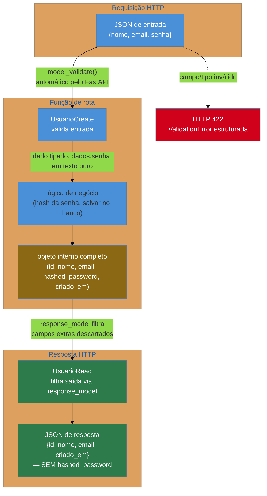

# Validação e serialização com Pydantic

> [!abstract] TL;DR
> O [[03-Dominios/Tecnologia/Python/Tipagem moderna/06 - Pydantic — validação em runtime|Galho 5]] já mostrou que `BaseModel` transforma type hints num contrato checado em runtime. Esta nota mostra o que acontece quando esse contrato vira a **fronteira HTTP** inteira de uma API FastAPI: o corpo de uma requisição (`request body`) é validado automaticamente contra um `BaseModel` antes da função de rota sequer rodar — erro de validação vira **HTTP 422** de graça, sem uma linha de `if` escrita à mão. O ponto que mais separa quem já sofreu em produção de quem só decorou sintaxe é o `response_model`: o modelo de **saída** não precisa (e não deve) ser o mesmo objeto interno que representa a linha do banco — ele é uma **peneira declarativa**, e é a peneira que impede um `hashed_password` de vazar numa resposta JSON só porque alguém esqueceu de filtrar manualmente. O padrão que resolve isso de forma sistemática é ter dois modelos por recurso — `UserCreate` (o que entra) e `UserRead` (o que sai) — nunca um modelo único fazendo os dois papéis.

## O incidente que abre esta nota

Uma startup fictícia, mas o cenário é comum o bastante para valer a pena nomear com precisão: um endpoint de cadastro de usuário, escrito rápido, num sprint sob pressão, usando FastAPI:

```python
from fastapi import FastAPI
from pydantic import BaseModel
from passlib.hash import bcrypt

app = FastAPI()


class Usuario(BaseModel):
    id: int
    nome: str
    email: str
    hashed_password: str


usuarios_db: dict[int, Usuario] = {}
proximo_id = 1


@app.post("/usuarios")
def criar_usuario(dados: Usuario):
    global proximo_id
    usuario = Usuario(
        id=proximo_id,
        nome=dados.nome,
        email=dados.email,
        hashed_password=bcrypt.hash(dados.hashed_password),
    )
    usuarios_db[proximo_id] = usuario
    proximo_id += 1
    return usuario
```

O código roda. Os testes manuais no Swagger UI (gerado automaticamente — [[08 - Documentação automática com OpenAPI|nota 08 deste galho]]) parecem funcionar: manda um `nome`, `email`, `hashed_password` (o campo se chama assim, mas na entrada é a senha em texto puro — outro cheiro de código, mas não o pior), recebe de volta um usuário criado com `id`. Passa em code review porque ninguém abriu a resposta HTTP linha a linha, só conferiu o status `200`.

O problema aparece três semanas depois, quando um usuário mais curioso abre o DevTools do navegador durante o fluxo de cadastro e vê isto na aba Network:

```json
{
  "id": 42,
  "nome": "Fernanda Alves",
  "email": "fernanda@example.com",
  "hashed_password": "$2b$12$KIXQ3n8v.../vazado.no.json.de.resposta"
}
```

> [!bug] O que está quebrado, em uma frase
> A mesma classe `Usuario` foi usada como **modelo de entrada** (o que o cliente manda) e **modelo de saída** (o que o servidor devolve) — e como o campo `hashed_password` existe na classe, ele existe também na resposta JSON, porque não havia nada dizendo ao FastAPI "esconda este campo na hora de responder".

O hash bcrypt de uma senha não é a senha em texto puro — quebrá-lo por força bruta exige tempo e poder computacional real. Mas é um vazamento de dado sensível de qualquer forma: hash exposto é superfície de ataque para ataques offline de dicionário/rainbow table, e é o tipo de achado que qualquer pentest ou auditoria de segurança classifica como falha grave, não como detalhe menor. O bug não estava na lógica de hashing (`bcrypt.hash()` está correto) — estava em **não ter um modelo de saída separado** que simplesmente não inclui o campo sensível.

A correção não precisa de nenhuma lógica nova, só de separar responsabilidades — e é exatamente esse padrão, `UserCreate` vs. `UserRead`, mais o mecanismo `response_model` do FastAPI que o aplica automaticamente, que o resto desta nota desenvolve em profundidade.

## `BaseModel` como contrato de entrada: revisão rápida

O [[03-Dominios/Tecnologia/Python/Tipagem moderna/06 - Pydantic — validação em runtime|Galho 5, nota 06]] já cobriu `BaseModel` em profundidade — construtor que valida contra o tipo declarado, `ValidationError` estruturada, `@field_validator`, serialização simétrica via `model_dump()`/`model_validate()`. Esta nota não repete esse mecanismo; assume-o como conhecido e foca no que muda quando `BaseModel` vira a peça central de uma API HTTP.

O que o FastAPI adiciona por cima do Pydantic puro é **automação na fronteira**: declarar um parâmetro de função com um tipo que é um `BaseModel` faz o framework, sozinho, extrair o corpo JSON da requisição, chamar `model_validate()` (ou o equivalente interno) e só invocar o código da rota se a validação passar.

```python
from fastapi import FastAPI
from pydantic import BaseModel, EmailStr, Field

app = FastAPI()


class UsuarioEntrada(BaseModel):
    nome: str = Field(min_length=1, max_length=100)
    email: EmailStr
    senha: str = Field(min_length=8)


@app.post("/usuarios")
def criar_usuario(dados: UsuarioEntrada):
    # neste ponto, dados.nome, dados.email e dados.senha
    # JÁ foram validados — nenhuma checagem manual é necessária aqui
    return {"nome": dados.nome, "email": dados.email}
```

Repare no que **não** existe na função `criar_usuario`: nenhum `if not dados.get("email")`, nenhum `try/except` em volta de acesso a chave de dicionário, nenhuma checagem de tipo manual. O parâmetro `dados: UsuarioEntrada` é, ao mesmo tempo, documentação (o tipo declara exatamente o que a rota espera) e enforcement (o FastAPI recusa a requisição antes de chamar a função, se o corpo não bater com o schema). Essa é a ideia central que a [[01 - Django vs FastAPI vs Flask — panorama e filosofias|nota 01 deste galho]] descreve como "tipagem como contrato" — o traço que mais diferencia FastAPI de Flask e do Django puro (sem DRF).

> [!question]- De onde o FastAPI sabe que `dados` vem do corpo da requisição, e não de um path parameter ou query parameter?
> Regra de inferência simples, documentada pelo [FastAPI](https://fastapi.tiangolo.com/tutorial/body/): parâmetros de função com tipo primitivo (`str`, `int`, `bool`, ...) que também aparecem na URL da rota (`@app.get("/usuarios/{usuario_id}")`) são **path parameters**; parâmetros primitivos que não aparecem na URL são **query parameters**; parâmetros cujo tipo é um `BaseModel` do Pydantic são automaticamente interpretados como vindos do **corpo (body)** da requisição, serializado em JSON. Não é preciso nenhum decorator ou anotação extra — o próprio tipo já comunica a origem do dado. O [[02 - Roteamento — decorators, urls.py e path operations|Galho 10, nota 02]] cobre path/query parameters em detalhe; esta nota foca só na parte de body.

## `Field()` e validadores customizados na fronteira HTTP

Tudo que o [[03-Dominios/Tecnologia/Python/Tipagem moderna/06 - Pydantic — validação em runtime|Galho 5]] já mostrou sobre `Field()` (constraints declarativas) e `@field_validator` (lógica customizada) se aplica sem alteração nenhuma quando o `BaseModel` é usado como body de uma rota FastAPI — a única diferença é que agora o "input" não é um dicionário Python escrito à mão em teste, é JSON não confiável chegando de qualquer cliente HTTP na internet.

```python
from pydantic import BaseModel, EmailStr, Field, field_validator


class UsuarioEntrada(BaseModel):
    nome: str = Field(min_length=1, max_length=100)
    email: EmailStr
    idade: int = Field(gt=0, le=130)
    senha: str = Field(min_length=8, description="Mínimo de 8 caracteres")

    @field_validator("senha")
    @classmethod
    def senha_deve_ter_numero(cls, valor: str) -> str:
        if not any(char.isdigit() for char in valor):
            raise ValueError("senha deve conter ao menos um número")
        return valor
```

Vale nomear os tipos que aparecem com frequência específica em fronteira de API, mesmo sem serem exclusivos dela:

- **`EmailStr`** — tipo do pacote complementar `pydantic[email]` (requer instalar o extra `email-validator`) que valida formato de e-mail de verdade, além de checar que é uma `str` — algo que `Field(pattern=r"...")` faria de forma mais frágil com regex escrito à mão.
- **`Field(gt=..., le=...)`** — restrições numéricas (`gt`: greater than, `ge`: greater or equal, `lt`: less than, `le`: less or equal) resolvidas inteiramente pelo `pydantic-core`, em Rust, sem custo de um validator Python adicional.
- **`Field(min_length=..., max_length=...)`** — mesma ideia para `str`/`list`, cobrindo o caso comum de "nome não pode ser vazio" e "senha precisa de tamanho mínimo" sem lógica customizada.

A regra prática do Galho 5 continua valendo aqui: `Field()` primeiro (mais rápido, mais declarativo, mais fácil de ler no schema OpenAPI gerado — [[08 - Documentação automática com OpenAPI|nota 08]]), `@field_validator` só quando a regra não se reduz a uma restrição fixa.

## O problema central: `response_model` e a separação entrada/saída

A seção anterior resolveu metade do problema — validar o que entra. A outra metade, a que o incidente de abertura ilustrou, é **controlar o que sai**. O FastAPI resolve isso com o parâmetro `response_model` do decorator de rota:

```python
@app.post("/usuarios", response_model=UsuarioSaida)
def criar_usuario(dados: UsuarioEntrada):
    ...
```

`response_model` diz ao FastAPI: "não importa o que a função `criar_usuario` retornar de verdade (um dicionário, um objeto ORM, uma instância de outra classe) — antes de serializar a resposta HTTP, filtre e valide esse retorno contra `UsuarioSaida`, mantendo só os campos que `UsuarioSaida` declara". Campos extras que o objeto retornado tiver — como `hashed_password`, se a função devolver o objeto interno inteiro — são **descartados silenciosamente** na serialização, nunca chegam ao JSON de resposta.

### O padrão canônico: dois modelos por recurso

A convenção que resolve o incidente de abertura de forma sistemática — não caso a caso, decorando cada rota manualmente para nunca esquecer de filtrar um campo — é nomear dois `BaseModel`s por recurso, um para cada direção do tráfego:

```python
from datetime import datetime
from pydantic import BaseModel, EmailStr, Field


class UsuarioCreate(BaseModel):
    """O que o CLIENTE manda — inclui a senha em texto puro, nunca persistida assim."""
    nome: str = Field(min_length=1, max_length=100)
    email: EmailStr
    senha: str = Field(min_length=8)


class UsuarioRead(BaseModel):
    """O que o SERVIDOR devolve — nunca inclui senha, hash, ou qualquer segredo."""
    id: int
    nome: str
    email: EmailStr
    criado_em: datetime
```

```python
from fastapi import FastAPI
from passlib.hash import bcrypt

app = FastAPI()
usuarios_db: dict[int, dict] = {}
proximo_id = 1


@app.post("/usuarios", response_model=UsuarioRead, status_code=201)
def criar_usuario(dados: UsuarioCreate):
    global proximo_id
    registro = {
        "id": proximo_id,
        "nome": dados.nome,
        "email": dados.email,
        "hashed_password": bcrypt.hash(dados.senha),  # senha em texto puro nunca é salva
        "criado_em": datetime.utcnow(),
    }
    usuarios_db[proximo_id] = registro
    proximo_id += 1
    return registro   # dicionário com hashed_password INCLUÍDO — e não importa
```

Repare no último comentário: a função `criar_usuario` retorna o `registro` inteiro, **incluindo** `hashed_password` — e isso é seguro, porque `response_model=UsuarioRead` intercepta esse retorno antes de virar JSON e mantém só os campos que `UsuarioRead` declara (`id`, `nome`, `email`, `criado_em`). O hash nunca sai do processo do servidor. Não é preciso lembrar de escrever `del registro["hashed_password"]` em cada rota que devolve um usuário — a peneira é declarativa e automática, aplicada pelo framework, não por disciplina do desenvolvedor lembrando de filtrar manualmente toda vez.

> [!tip] `response_model` também funciona como documentação viva
> Além de filtrar, `response_model` é a fonte que o FastAPI usa para gerar a seção "Responses" do schema OpenAPI ([[08 - Documentação automática com OpenAPI|nota 08]]) — qualquer pessoa consumindo a API vê exatamente que campos esperar de volta, sem precisar ler o código da rota. Isso também documenta, por omissão, o que **não** volta: se `hashed_password` não aparece no schema de `UsuarioRead`, fica implícito (e visível no Swagger UI) que a API nunca expõe esse campo.



### Por que não usar um único modelo com campo opcional/oculto

Uma tentação comum é resolver isso com um único `BaseModel`, marcando o campo sensível como "não serializar" via configuração (`exclude=True` no `Field()`, por exemplo), em vez de duas classes separadas:

```python
class Usuario(BaseModel):
    id: int | None = None
    nome: str
    email: EmailStr
    senha: str | None = Field(default=None, exclude=True)
```

Isso **funciona** tecnicamente — Pydantic suporta `exclude=True` em `Field()`, e há um caso de uso legítimo para isso (um único modelo interno de domínio que precisa às vezes incluir, às vezes excluir um campo). Mas para a fronteira de API, o padrão de dois modelos separados (`Create`/`Read`) é preferido pela comunidade FastAPI por um motivo mais forte que estilo: **o modelo de entrada e o de saída raramente têm o mesmo formato de qualquer jeito**. `UsuarioCreate` precisa de `senha` (obrigatória, sem default); `UsuarioRead` precisa de `id` e `criado_em` (que não existem antes do registro ser salvo, e portanto não fazem sentido como parâmetro de entrada). Tentar encaixar os dois papéis numa única classe com campos opcionais em ambas as direções tende a degradar rápido — cada campo vira `Optional`, perdendo a garantia mais valiosa de Pydantic (saber, sem ambiguidade, o que é obrigatório em cada contexto).

> [!question]- Isso não duplica código? `nome` e `email` aparecem em `UsuarioCreate` e `UsuarioRead`
> Duplica, um pouco — e a resposta madura não é eliminar a duplicação a qualquer custo, é reconhecer que ela é **intencional**: `UsuarioCreate` e `UsuarioRead` representam contratos diferentes, que só coincidem em parte porque o recurso "usuário" tem alguns campos que aparecem nos dois lados. Pydantic v2 tem um recurso, `model_config = ConfigDict(from_attributes=True)`, que permite `UsuarioRead.model_validate(objeto_orm)` construir o modelo de saída direto a partir de um objeto ORM (ex: um `Usuario` do SQLAlchemy, [[03-Dominios/Tecnologia/Python/Persistência de dados/02 - SQLAlchemy ORM — Session, mapped classes e relationships|Galho 9, nota 02]]) sem passar por dicionário intermediário — reduzindo boilerplate de conversão, mas sem eliminar a existência das duas classes. Times maiores às vezes extraem um `UsuarioBase` com os campos comuns (`nome`, `email`) e fazem `UsuarioCreate(UsuarioBase)` / `UsuarioRead(UsuarioBase)` herdarem dele — reduz repetição de declaração sem voltar a misturar os dois contratos numa classe só.

```python
from pydantic import BaseModel, ConfigDict, EmailStr


class UsuarioBase(BaseModel):
    nome: str
    email: EmailStr


class UsuarioCreate(UsuarioBase):
    senha: str = Field(min_length=8)


class UsuarioRead(UsuarioBase):
    model_config = ConfigDict(from_attributes=True)  # permite construir a partir de objeto ORM

    id: int
    criado_em: datetime
```

## Tipos opcionais, uniões e modelos aninhados

Duas ferramentas do vocabulário de tipos aparecem o tempo todo em schemas de API real: campos opcionais (que podem não vir na requisição, ou podem ser `null`) e listas/objetos aninhados.

```python
from datetime import datetime
from pydantic import BaseModel


class Endereco(BaseModel):
    rua: str
    cidade: str
    cep: str


class UsuarioCreate(BaseModel):
    nome: str
    email: str
    telefone: str | None = None          # campo opcional, default None (equivalente a Optional[str])
    endereco: Endereco | None = None     # objeto aninhado, também opcional
    tags: list[str] = []                 # lista de valores simples, default vazia


class PedidoCreate(BaseModel):
    cliente_id: int
    itens: list["ItemPedido"]            # lista de MODELOS aninhados — cada item validado individualmente


class ItemPedido(BaseModel):
    produto_id: int
    quantidade: int = Field(gt=0)
```

Um detalhe que costuma confundir quem migra de `typing.Optional[X]` (sintaxe pré-3.10) para `X | None` (PEP 604, Python 3.10+): **do ponto de vista do Pydantic, os dois são idênticos** — ambos declaram "o valor pode ser `X` ou pode ser `None`". A diferença é só de sintaxe do próprio Python, não de comportamento de validação. Isso já foi coberto em profundidade no [[03-Dominios/Tecnologia/Python/Tipagem moderna/index|Galho 5]]; aqui só vale reafirmar que Pydantic entende as duas formas sem distinção.

Para campos que aceitam mais de um tipo **não relacionado a `None`** — por exemplo, um filtro de busca que aceita tanto um `int` (id exato) quanto uma `str` (busca por nome) — a sintaxe é a mesma união:

```python
class FiltroBusca(BaseModel):
    identificador: int | str    # aceita QUALQUER um dos dois; Pydantic tenta na ordem declarada
```

> [!warning] `Union`/`|` tenta os tipos na ordem declarada, e a coerção pode surpreender
> Em `int | str`, Pydantic tenta validar como `int` primeiro; se falhar, tenta como `str`. Isso significa que `identificador="42"` (uma string que parece um número) é coercionado para o `int` `42`, não mantido como string `"42"` — porque `int` vem primeiro na união e a coerção automática de string numérica para `int` é bem-sucedida. Quando essa ambiguidade importa (distinguir "42" de 42 de propósito), o [modo estrito](https://docs.pydantic.dev/latest/concepts/strict_mode/) ou `Field(union_mode="left_to_right")`/`"smart"` (Pydantic v2 tem um modo "smart", default, que tenta escolher o tipo mais específico primeiro) merece ser conferido explicitamente na documentação — não assumir o comportamento sem testar.

## Erros de validação viram HTTP 422 — o formato exato

Quando o corpo da requisição não bate com o `BaseModel` de entrada, o FastAPI não deixa a `ValidationError` do Pydantic vazar como um erro 500 genérico — ele a intercepta automaticamente e converte numa resposta HTTP **422 Unprocessable Entity**, com um corpo JSON estruturado que espelha `.errors()` (o mesmo método que o [[03-Dominios/Tecnologia/Python/Tipagem moderna/06 - Pydantic — validação em runtime|Galho 5]] já mostrou):

```python
import requests

resposta = requests.post("http://localhost:8000/usuarios", json={
    "nome": "",
    "email": "nao-e-um-email",
    "senha": "123",
})

print(resposta.status_code)   # 422
print(resposta.json())
```

```json
{
  "detail": [
    {
      "type": "string_too_short",
      "loc": ["body", "nome"],
      "msg": "String should have at least 1 character",
      "input": "",
      "ctx": {"min_length": 1}
    },
    {
      "type": "value_error",
      "loc": ["body", "email"],
      "msg": "value is not a valid email address: An email address must have an @-sign.",
      "input": "nao-e-um-email"
    },
    {
      "type": "string_too_short",
      "loc": ["body", "senha"],
      "msg": "String should have at least 8 characters",
      "input": "123",
      "ctx": {"min_length": 3}
    }
  ]
}
```

Alguns pontos de mecanismo que valem nomear com precisão, porque aparecem sistematicamente em qualquer resposta de erro 422 do FastAPI:

- **`detail` é sempre uma lista**, mesmo com um único erro — porque, como o Galho 5 já mostrou, Pydantic acumula **todos** os erros de validação numa única exceção, não para no primeiro. O exemplo acima tem três campos errados simultaneamente e os três aparecem juntos, numa única resposta — o cliente não precisa corrigir um campo, reenviar, descobrir o próximo erro, corrigir de novo.
- **`loc`** é o caminho até o campo problemático, começando por `"body"` (distinguindo de erros em `"path"` ou `"query"`, quando o problema é num path/query parameter em vez do corpo) — para campos aninhados, `loc` continua a lista de índices/nomes exatamente como `.errors()` do Pydantic puro (`["body", "itens", 1, "quantidade"]` para o segundo item de uma lista aninhada, por exemplo).
- **`type`/`msg`/`ctx`** vêm diretamente do `pydantic-core` — o FastAPI não reformata a mensagem de erro do Pydantic, só a encapsula no formato de resposta HTTP.

> [!tip] 422, não 400 — e por que isso importa em entrevista
> A escolha de **422 Unprocessable Entity**, e não **400 Bad Request**, é deliberada e vem do padrão HTTP: 400 significa "a requisição está malformada de um jeito que o servidor nem consegue interpretar" (JSON quebrado, sintaticamente inválido); 422 significa "a requisição está bem formada — JSON válido, sintaxe correta — mas o **conteúdo** viola alguma regra semântica" (campo obrigatório faltando, tipo errado, restrição de negócio violada). É a distinção entre um erro de sintaxe e um erro de semântica. A [[06 - Tratamento de erros e respostas HTTP padronizadas|nota 06 deste galho]] aprofunda o vocabulário completo de status codes (400 vs 422 vs 409, entre outros); aqui o ponto é só que o FastAPI já faz essa escolha corretamente de fábrica, sem configuração extra.

## Contraste breve: por que não dataclasses puras

Python tem `@dataclass` (`dataclasses`, stdlib) desde a 3.7, e à primeira vista resolve um problema parecido — declarar campos tipados numa classe sem escrever `__init__` à mão:

```python
from dataclasses import dataclass


@dataclass
class UsuarioEntrada:
    nome: str
    email: str
    senha: str


UsuarioEntrada(nome="Ana", email=123, senha="abc")  # NÃO levanta erro nenhum
```

O ponto crítico, já estabelecido em detalhe no [[03-Dominios/Tecnologia/Python/Tipagem moderna/06 - Pydantic — validação em runtime|Galho 5]]: `@dataclass` gera um `__init__` que só **atribui** os valores recebidos aos atributos — nunca compara o valor real com o tipo anotado. `email=123` (um `int`, não uma `str`) é aceito silenciosamente, porque `dataclass` confia inteiramente na anotação de tipo sem checá-la em runtime. Para código interno, onde o time controla todas as chamadas e um checador estático (mypy/pyright, também Galho 5) já roda no CI, isso costuma ser suficiente. Para uma fronteira HTTP — onde o "chamador" é qualquer cliente arbitrário na internet, que pode mandar JSON malformado, tipos trocados, ou payloads maliciosos de propósito — confiar em anotações não checadas é uma aposta perigosa: o primeiro `TypeError` só aparece na primeira operação que de fato usa o valor errado (uma concatenação, uma comparação numérica), tarde demais, longe do ponto onde o dado ruim entrou, e sem mensagem clara de qual campo da requisição original causou o problema.

É exatamente essa lacuna — checagem real, em runtime, de dados que vêm de fora do programa, com mensagem de erro estruturada por campo — que fez Pydantic (e por extensão FastAPI, construído sobre ele) ganhar tração como a opção padrão de mercado para APIs Python modernas, superando tanto dataclasses quanto validação manual escrita à mão. O [FastAPI do Zero, de Eduardo Mendes (Dunossauro)](https://fastapidozero.dunossauro.com/), referência consolidada da comunidade brasileira, usa Pydantic como peça central do curso inteiro justamente por esse motivo — não é acidente de design, é a razão de ser do framework.

> [!warning] Isso não significa que dataclass é "errada" — é uma ferramenta para outro contexto
> `@dataclass` continua sendo a escolha certa para estruturas de dados **internas**, que nunca cruzam a fronteira de confiança do sistema (um DTO passado entre duas funções do mesmo módulo, por exemplo) — trazer Pydantic para todo lugar só porque valida mais tem custo: overhead de validação (pequeno, mas não zero, mesmo com `pydantic-core` em Rust) e a obrigação de instalar uma dependência externa. A régua sênior é: dado que **entra ou sai do processo através de uma fronteira não confiável** (HTTP, arquivo, variável de ambiente) pede Pydantic; dado que só circula dentro do próprio código, já sob controle do time, pode continuar como dataclass sem perda real.

## E o Django REST Framework?

Quem já trabalhou com Django provavelmente reconhece o padrão inteiro desta nota sob outro nome: o DRF tem `Serializer`/`ModelSerializer`, que fazem exatamente o mesmo trabalho — validar entrada, serializar saída, e permitir modelos de entrada/saída distintos por endpoint. A diferença de ergonomia (DRF acopla mais ao ORM do Django via `ModelSerializer`; Pydantic é agnóstico de banco, validando puramente contra tipos Python) é o assunto central da [[05 - Django REST Framework — serializers, viewsets e routers|nota 05 deste galho]] — esta nota não desenvolve o contraste aqui para não repetir o que a nota 05 cobre em profundidade, mas vale registrar desde já: o problema que `response_model` resolve (nunca vazar campo sensível na saída) é o **mesmo problema estrutural** que `Serializer` do DRF resolve, só que numa gramática de API diferente.

## Armadilhas comuns

> [!warning] Usar um único `BaseModel` para entrada e saída, "por conveniência"
> **O que acontece:** exatamente o incidente de abertura desta nota — um campo sensível (senha, hash, dado interno de auditoria) que existe no modelo porque é conveniente reaproveitar a mesma classe, acaba vazando na resposta HTTP porque nada o filtra. **Por quê:** sem `response_model` apontando para um modelo de saída distinto, o FastAPI serializa o retorno da função exatamente como ele é — se o objeto retornado (dicionário, instância ORM, o que for) tem o campo, ele vai para o JSON. **Como evitar:** dois modelos por recurso (`XCreate`/`XRead`, ou nomenclatura equivalente), com `response_model` explícito em toda rota que retorna dado.

> [!warning] Confiar que omitir o campo no `return` é suficiente, sem `response_model`
> **O que acontece:** a função de rota constrói manualmente um dicionário sem o campo sensível (`return {"id": ..., "nome": ...}`, sem `hashed_password`) e assume que está seguro — mas alguém, num refactor futuro, muda o `return` para devolver o objeto inteiro, sem lembrar da regra implícita "nunca inclua a senha aqui". **Por quê:** filtro manual no `return` é uma convenção informal, sem enforcement — depende de disciplina humana lembrada em cada rota, para sempre, por todo mundo que tocar o código depois. **Como evitar:** `response_model` explícito é enforcement automático e declarativo — mesmo que o `return` mude para devolver um objeto com campos extras, o Pydantic filtra na serialização, não importa o que a função retornou.

> [!warning] Achar que `response_model` valida o retorno como se fosse checagem de tipo estática
> **O que acontece:** confundir `response_model` com uma garantia de tipo em tempo de desenvolvimento (tipo mypy) — na verdade é uma **transformação em runtime**, que roda a cada requisição real, com custo de CPU real (pequeno, mas mensurável em APIs de altíssimo volume). **Por quê:** `response_model` reusa exatamente o mesmo motor `pydantic-core` da validação de entrada — só que aplicado ao dado de saída, a cada resposta enviada. **Como evitar:** não é motivo para evitar `response_model` (o custo é pequeno e o ganho de segurança/documentação vale muito mais), só um lembrete de que ele não substitui checagem estática — mypy/pyright continuam relevantes no CI, cobrindo uma classe diferente de erro.

> [!warning] Misturar `Optional` "porque não sei se é obrigatório" em vez de decidir o contrato
> **O que acontece:** todo campo de `UsuarioCreate` vira `campo: str | None = None` "só para garantir", em vez de decidir de fato quais campos são obrigatórios na criação — o schema perde a informação mais valiosa que Pydantic oferece (o que é garantido presente). **Por quê:** marcar tudo como opcional é o caminho de menor resistência para "fazer a validação passar", mas empurra a checagem de obrigatoriedade para dentro da função de rota (`if dados.email is None: raise ...`), voltando ao mesmo problema que Pydantic existe para resolver. **Como evitar:** decidir, campo a campo, o que é realmente opcional no contrato de negócio — só marcar `Optional`/`| None` quando o campo genuinamente pode estar ausente, não como atalho para "não sei, deixa passar".

## Em entrevista

- **"Como o FastAPI valida o corpo de uma requisição?"** Um parâmetro de função tipado com um `BaseModel` do Pydantic é automaticamente interpretado como vindo do corpo (body) da requisição — o FastAPI extrai o JSON, chama a validação do Pydantic antes de invocar a função da rota, e devolve HTTP 422 com detalhe estruturado por campo se a validação falhar. Não é necessário escrever validação manual dentro da rota.
- **"O que é `response_model` e por que ele importa para segurança?"** É o parâmetro do decorator de rota (`@app.post(..., response_model=X)`) que diz ao FastAPI para filtrar e validar o valor **retornado** pela função contra o schema `X`, antes de serializar a resposta HTTP — campos do objeto retornado que não estão declarados em `X` são descartados. É o mecanismo que impede, por exemplo, um `hashed_password` de vazar numa resposta de API, mesmo que o objeto interno retornado pela função tenha esse campo.
- **"Por que ter dois modelos (`UserCreate`/`UserRead`) em vez de um só?"** Porque entrada e saída raramente têm o mesmo contrato — `UserCreate` precisa de senha (que nunca deveria voltar na resposta) e não tem `id`/`criado_em` (que só existem depois de persistir); `UserRead` é o inverso. Misturar os dois papéis numa classe única tende a degradar o schema — cada campo vira opcional para acomodar os dois usos, perdendo a garantia de obrigatoriedade que é o ponto central de Pydantic.
- **"Por que Pydantic e não dataclasses puras para uma API?"** `@dataclass` gera um `__init__` que atribui valores sem checar contra o tipo anotado — `email: str` aceita um `int` sem erro. Numa fronteira HTTP, onde o "chamador" é um cliente HTTP arbitrário e não confiável, essa ausência de checagem em runtime é uma lacuna real de correção e segurança; Pydantic fecha exatamente essa lacuna, com `ValidationError` estruturada e conversão automática para HTTP 422 no FastAPI.
- **"Qual o status HTTP de um erro de validação de corpo, e por quê?"** 422 Unprocessable Entity, não 400 — porque o JSON em si está sintaticamente correto (400 seria para JSON malformado), mas o **conteúdo** viola uma regra de schema (campo obrigatório ausente, tipo errado, restrição de `Field()` violada). É uma distinção entre erro de sintaxe (400) e erro de semântica (422) que o FastAPI já resolve corretamente de fábrica.

> [!question]- O entrevistador pergunta: "e se o time quiser reaproveitar código entre `UserCreate` e `UserRead`?"
> A resposta madura evita dois extremos — nem "sempre duplicar tudo" nem "sempre herdar de uma base comum sem pensar". `UsuarioBase(BaseModel)` com os campos genuinamente compartilhados (`nome`, `email`), e `UsuarioCreate(UsuarioBase)`/`UsuarioRead(UsuarioBase)` herdando dele e adicionando só o que é específico de cada direção, é o meio-termo padrão da comunidade FastAPI — reduz repetição de declaração sem voltar a misturar os dois contratos numa única classe. O sinal de alerta para não seguir esse caminho: se a base comum acaba precisando de campos `Optional` só para acomodar as duas direções, é sinal de que os dois contratos têm menos em comum do que parecia, e forçar herança ali está reintroduzindo o mesmo problema que a separação resolveu.

## How to explain in English

> FastAPI builds directly on Pydantic's `BaseModel`: a route parameter typed as a `BaseModel` is automatically parsed from the request body and validated before the route function ever runs — a failed validation returns HTTP 422 with a structured, field-by-field error list, no manual checking required. The part that separates production experience from tutorial knowledge is `response_model`: it filters and validates whatever the route function *returns* against an output schema before serializing the HTTP response, silently dropping any extra fields the returned object might carry. That's the mechanism that keeps a hashed password (or any internal field) from leaking in an API response even if the function returns the full internal object — the canonical pattern is two models per resource, `UserCreate` for what comes in and `UserRead` for what goes out, never one model doing both jobs. Compared to plain dataclasses, which generate an `__init__` that assigns values without checking them against the declared type, Pydantic actually enforces the contract at runtime — the gap that matters most at an untrusted boundary like an HTTP API, where the caller is an arbitrary client, not code the team controls.

| PT-BR | English |
|---|---|
| corpo da requisição | request body |
| modelo de entrada / modelo de saída | input model / output model |
| filtrar campos na serialização | filter fields on serialization |
| erro de validação | validation error |
| restrição declarativa | declarative constraint |
| validador de campo | field validator |
| tipo opcional | optional type |
| tipos aninhados | nested types |
| status code semântico | semantic status code |

## Síntese e checklist

Este é o mecanismo que atravessa a nota inteira, em ordem de aplicação numa rota real:

1. **Entrada**: um `BaseModel` (`UsuarioCreate`) declara o schema esperado do corpo da requisição — `Field()` para restrições descritivas, `@field_validator` para lógica customizada. O FastAPI valida automaticamente antes de invocar a função.
2. **Erro**: qualquer falha de validação vira HTTP 422 automaticamente, com `detail` estruturado (`loc`/`msg`/`type` por campo), acumulando todos os erros de uma vez — nunca um 500 genérico nem um traceback vazado ao cliente.
3. **Saída**: um `BaseModel` **separado** (`UsuarioRead`) declara o schema de resposta, aplicado via `response_model` — campos extras do retorno real da função (senha, hash, dado interno) são descartados na serialização, não importa o que a função devolveu.
4. **Aninhamento**: modelos dentro de modelos, listas de modelos, `Optional`/`X | None` e uniões seguem exatamente a mesma sintaxe de tipo Python comum, validados recursivamente pelo `pydantic-core`.

Checklist rápido antes de considerar um endpoint pronto:

- [ ] Existe um modelo de entrada dedicado, distinto do modelo interno de domínio/banco?
- [ ] Existe um `response_model` explícito em toda rota que retorna dado (não só confiar no `return` manual)?
- [ ] Campos sensíveis (senha, hash, tokens, dado interno de auditoria) existem **apenas** no modelo de entrada ou no modelo interno — nunca no modelo de saída?
- [ ] Restrições de negócio (comprimento, intervalo, formato) estão em `Field()` quando possível, reservando `@field_validator` para lógica de verdade?
- [ ] Campos genuinamente opcionais estão marcados como tal — e só esses, não o schema inteiro "por garantia"?

O próximo passo natural do galho é a [[04 - Injeção de dependência no FastAPI — Depends|nota 04]], que cobre `Depends()` — o mecanismo que injeta, entre outras coisas, a sessão de banco (Galho 9) usada para de fato persistir os dados que chegam já validados por esta camada.

## Veja também

- [[03-Dominios/Tecnologia/Python/Tipagem moderna/06 - Pydantic — validação em runtime|Pydantic — validação em runtime]] — Galho 5, nota 06; mecanismo base de `BaseModel`, `Field()`, `@field_validator`, serialização, v1 vs. v2. Pré-requisito direto desta nota.
- [[03-Dominios/Tecnologia/Python/Tipagem moderna/index|Tipagem moderna]] — MOC do Galho 5.
- [[01 - Django vs FastAPI vs Flask — panorama e filosofias|01 — Django vs. FastAPI vs. Flask]] — nota irmã, panorama comparativo que introduz "tipagem como contrato" como diferencial do FastAPI.
- [[02 - Roteamento — decorators, urls.py e path operations|02 — Roteamento]] — nota irmã, cobre path/query parameters (complementar ao corpo da requisição coberto aqui).
- [[04 - Injeção de dependência no FastAPI — Depends|04 — Injeção de dependência no FastAPI]] — próxima nota, usa modelos validados desta nota junto com sessão de banco injetada via `Depends()`.
- [[05 - Django REST Framework — serializers, viewsets e routers|05 — Django REST Framework]] — contraste direto entre Pydantic/`response_model` e `Serializer`/`ModelSerializer` do DRF.
- [[06 - Tratamento de erros e respostas HTTP padronizadas|06 — Tratamento de erros e respostas HTTP padronizadas]] — aprofunda o vocabulário de status codes (400 vs 422 vs 409) só introduzido aqui.
- [[08 - Documentação automática com OpenAPI|08 — Documentação automática com OpenAPI]] — como `response_model` e os modelos de entrada alimentam o schema OpenAPI gerado automaticamente.
- [[03-Dominios/Tecnologia/Python/Persistência de dados/02 - SQLAlchemy ORM — Session, mapped classes e relationships|SQLAlchemy ORM — Session, mapped classes e relationships]] — Galho 9; objeto ORM real que costuma ser convertido para `UsuarioRead` via `from_attributes=True`.
- [[index|Web e APIs REST (Galho 10)]] — MOC deste galho.

## Fontes

- FastAPI. *Request Body*. fastapi.tiangolo.com/tutorial/body/. https://fastapi.tiangolo.com/tutorial/body/ (acessado em 2026-07-11) — como parâmetros tipados com `BaseModel` viram corpo de requisição, validação automática.
- FastAPI. *Response Model — Return Type*. fastapi.tiangolo.com/tutorial/response-model/. https://fastapi.tiangolo.com/tutorial/response-model/ (acessado em 2026-07-11) — `response_model`, filtragem de campos na saída, exemplo canônico de senha não vazando na resposta.
- FastAPI. *Extra Data Types, Nested Models*. fastapi.tiangolo.com/tutorial/body-nested-models/. https://fastapi.tiangolo.com/tutorial/body-nested-models/ (acessado em 2026-07-11) — modelos aninhados, listas de modelos.
- FastAPI. *Handling Errors*. fastapi.tiangolo.com/tutorial/handling-errors/. https://fastapi.tiangolo.com/tutorial/handling-errors/ (acessado em 2026-07-11) — formato de erro 422, `RequestValidationError`.
- Pydantic. *Models*. docs.pydantic.dev/latest/concepts/models/. https://docs.pydantic.dev/latest/concepts/models/ (acessado em 2026-07-11) — `BaseModel`, `ConfigDict(from_attributes=True)`.
- Pydantic. *Fields*. docs.pydantic.dev/latest/concepts/fields/. https://docs.pydantic.dev/latest/concepts/fields/ (acessado em 2026-07-11) — `Field()`, constraints declarativas.
- Pydantic. *Unions*. docs.pydantic.dev/latest/concepts/unions/. https://docs.pydantic.dev/latest/concepts/unions/ (acessado em 2026-07-11) — modo smart de resolução de `Union`/`|`.
- Real Python. *Pydantic: Simplify Data Validation in Python*. realpython.com/python-pydantic/. https://realpython.com/python-pydantic/ (acessado em 2026-07-11).
- Mendes, Eduardo (Dunossauro). *FastAPI do Zero*. fastapidozero.dunossauro.com. https://fastapidozero.dunossauro.com/ (acessado em 2026-07-11) — curso de referência da comunidade brasileira, Pydantic como espinha dorsal do FastAPI.
- Mozilla Developer Network. *422 Unprocessable Entity*. developer.mozilla.org. https://developer.mozilla.org/en-US/docs/Web/HTTP/Status/422 (acessado em 2026-07-11) — semântica do status code.
- [[03-Dominios/Tecnologia/Python/Tipagem moderna/06 - Pydantic — validação em runtime|Pydantic — validação em runtime]] — nota do Galho 5, referenciada para o mecanismo base de `BaseModel`.

Consultado em 2026-07-11.
