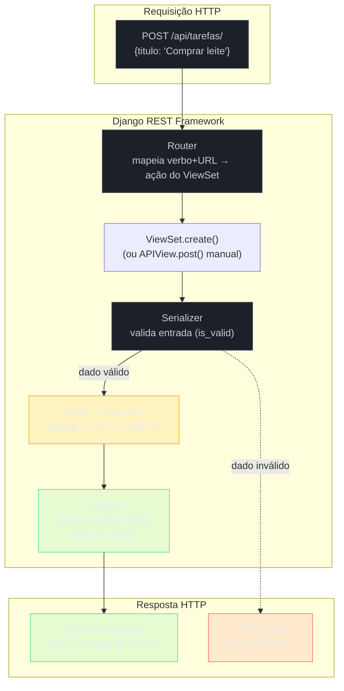

# Django REST Framework — serializers, viewsets e routers

> [!abstract] TL;DR
> A [[02 - Roteamento — decorators, urls.py e path operations|nota 02 deste galho]] mostrou que Django puro monta uma API REST com `urls.py`, Function/Class-Based Views escritas à mão e `JsonResponse` — funciona, mas cada endpoint repete o mesmo esqueleto de parsing, validação e serialização. O **Django REST Framework (DRF)** é a camada que a comunidade Django construiu para não reescrever esse esqueleto em todo projeto: `Serializer`/`ModelSerializer` validam entrada e serializam saída (o mesmo papel que a [[03 - Validação e serialização com Pydantic|nota 03]] descreveu para `BaseModel`/`response_model` do FastAPI, mas **acoplado ao Django ORM**), `ViewSet`/`ModelViewSet` agrupam as cinco operações de um CRUD numa única classe, e `Router` gera as rotas automaticamente a partir do `ViewSet` — eliminando o `urls.py` manual da nota 02. O ganho é real: um CRUD completo, com paginação, filtros e navegação por browsable API, cabe em menos de 20 linhas. O custo também é real: `ModelSerializer` infere schema direto do `Model`, e sem um `fields` explícito ele expõe **todo** campo do banco na resposta — incluindo os que nunca deveriam sair.

## O incidente que abre esta nota

Um time está migrando o CRUD de tarefas do Django puro (visto na nota 02, com `APIView`... ou pior, FBVs cruas com `JsonResponse`) para DRF, achando que instalar `djangorestframework` já resolve tudo. O `Model` já existe:

```python
# tarefas/models.py
from django.db import models


class Tarefa(models.Model):
    titulo = models.CharField(max_length=200)
    concluida = models.BooleanField(default=False)
    criado_em = models.DateTimeField(auto_now_add=True)
    criado_por = models.ForeignKey("auth.User", on_delete=models.CASCADE)
    notas_internas = models.TextField(blank=True, default="")  # rascunho do time de suporte, nunca deveria ir pro cliente
```

O desenvolvedor, com pressa, escreve o serializer do jeito mais rápido que o DRF permite — sem declarar `fields` explicitamente:

```python
# tarefas/serializers.py
from rest_framework import serializers
from .models import Tarefa


class TarefaSerializer(serializers.ModelSerializer):
    class Meta:
        model = Tarefa
        fields = "__all__"   # "pega tudo, resolvo depois"
```

```python
# tarefas/views.py
from rest_framework import viewsets
from .models import Tarefa
from .serializers import TarefaSerializer


class TarefaViewSet(viewsets.ModelViewSet):
    queryset = Tarefa.objects.all()
    serializer_class = TarefaSerializer
```

Funciona no primeiro teste manual: `GET /api/tarefas/1/` devolve um JSON com `id`, `titulo`, `concluida`, `criado_em`. Passa em code review porque ninguém comparou o JSON campo a campo com o `Model`. Três sprints depois, o time de frontend consome o endpoint no app do cliente final e alguém nota, olhando o payload no DevTools:

```json
{
  "id": 1,
  "titulo": "Revisar contrato do cliente X",
  "concluida": false,
  "criado_em": "2026-07-11T14:32:00Z",
  "criado_por": 7,
  "notas_internas": "cliente reclamou de atraso, negociar desconto de 10% antes de fechar"
}
```

`notas_internas` — uma anotação do time de suporte, nunca pensada para sair da aplicação — está vazando no app do cliente, porque `fields = "__all__"` inclui **qualquer** campo que o `Model` tiver, inclusive os adicionados depois por outro time, sem que ninguém precise tocar no serializer de novo.

> [!bug] O que está quebrado, em uma frase
> `fields = "__all__"` amarra o contrato de saída da API ao schema do banco — todo campo novo adicionado ao `Model` (por qualquer pessoa, em qualquer PR futuro) aparece automaticamente na resposta HTTP, sem revisão, porque o serializer nunca declara explicitamente o que deveria sair.

Esse é exatamente o mesmo problema estrutural do incidente que abre a [[03 - Validação e serialização com Pydantic|nota 03 deste galho]] (o `hashed_password` vazando por falta de `response_model` dedicado) — só que a superfície de erro no DRF é ainda maior, porque `ModelSerializer` deriva o schema **do banco**, não de uma declaração de tipos isolada como o Pydantic. É essa diferença de acoplamento — e como escapar dela sem abrir mão da produtividade que o DRF promete — que o resto desta nota desenvolve.

## `Serializer`: a classe base, sem ORM

Antes de `ModelSerializer`, vale ver o mecanismo puro: `serializers.Serializer` é a classe base do DRF, e não depende de nenhum `Model` — os campos são declarados manualmente, um por um, do mesmo jeito que se declararia um `BaseModel` do Pydantic:

```python
from rest_framework import serializers


class TarefaSerializer(serializers.Serializer):
    id = serializers.IntegerField(read_only=True)
    titulo = serializers.CharField(max_length=200)
    concluida = serializers.BooleanField(default=False)
    criado_em = serializers.DateTimeField(read_only=True)

    def create(self, validated_data):
        return Tarefa.objects.create(**validated_data)

    def update(self, instance, validated_data):
        instance.titulo = validated_data.get("titulo", instance.titulo)
        instance.concluida = validated_data.get("concluida", instance.concluida)
        instance.save()
        return instance
```

Repare no que `Serializer` puro **exige** que `ModelSerializer` (próxima seção) vai automatizar: declarar cada campo manualmente (`IntegerField`, `CharField`, `BooleanField`...) e implementar `create()`/`update()` à mão — o serializer sabe validar e (des)serializar, mas não sabe, sozinho, o que fazer com o dado validado, porque não tem nenhuma ligação implícita com um `Model`.

```python
serializer = TarefaSerializer(data={"titulo": "Comprar leite", "concluida": False})
if serializer.is_valid():
    tarefa = serializer.save()          # chama create() ou update() internamente
else:
    print(serializer.errors)            # dict de erros por campo, formato parecido com .errors() do Pydantic
```

> [!question]- Por que o DRF chama isso de `Serializer` (singular de "serializa"), se ele também valida?
> Nomenclatura histórica do próprio framework — `Serializer` nasceu focado em converter objetos Python (`Model` instances) para tipos primitivos serializáveis em JSON (**serialização**, sentido estrito), e ganhou o papel de validação de entrada depois, na mesma classe. O nome ficou, mas o DRF documenta explicitamente as duas responsabilidades: `.is_valid()` + `.errors` (validação de entrada) e `.data` (serialização de saída) convivem na mesma instância. É uma diferença de vocabulário em relação ao Pydantic, que separa `model_validate()` (entrada) de `model_dump()` (saída) como métodos distintos na mesma classe `BaseModel`, mas nunca precisa de duas *classes* diferentes só por causa disso — o DRF, como a próxima seção mostra, tende a usar duas classes (`Serializer` de entrada e de saída) quando o contrato realmente diverge.

## `ModelSerializer`: o mesmo trabalho, inferido do `Model`

`ModelSerializer` é a subclasse que resolve o boilerplate da seção anterior — em vez de declarar cada campo manualmente, ele **lê o `Model` do Django** (via `Meta.model`) e infere automaticamente os tipos de campo, as validações (`max_length` do `CharField`, `null=True` vira `required=False`, etc.) e implementa `create()`/`update()` por padrão:

```python
# tarefas/serializers.py
from rest_framework import serializers
from .models import Tarefa


class TarefaSerializer(serializers.ModelSerializer):
    class Meta:
        model = Tarefa
        fields = ["id", "titulo", "concluida", "criado_em"]   # lista EXPLÍCITA — não "__all__"
        read_only_fields = ["id", "criado_em"]
```

`fields` é o mecanismo central desta nota inteira: é a **peneira declarativa** que decide quais colunas do `Model` viram campo na API — qualquer coluna fora dessa lista (`criado_por`, `notas_internas`, no caso do incidente de abertura) nunca chega ao JSON de resposta nem é aceita na entrada, mesmo que exista no banco.

> [!warning] `fields = "__all__"` é o equivalente DRF de reaproveitar um único `BaseModel` para entrada e saída
> A [[03 - Validação e serialização com Pydantic#O problema central `response_model` e a separação entradasaída|nota 03 deste galho]] mostrou o incidente do `hashed_password` vazando por falta de um modelo de saída dedicado. `fields = "__all__"` é a mesma classe de erro, só que pior em superfície: no Pydantic, o desenvolvedor pelo menos **escreveu** cada campo que existe no `BaseModel` — a decisão de incluir um campo sensível foi, ainda que por descuido, uma linha de código específica. Com `fields = "__all__"`, a decisão é implícita e **futura**: qualquer coluna adicionada ao `Model` daqui a seis meses, por qualquer pessoa, em qualquer PR, entra na resposta da API automaticamente, sem que ninguém precise tocar no serializer. A prática recomendada pela própria documentação do DRF é listar `fields` explicitamente (ou usar `exclude` com uma lista curta e mantida a dedo) — nunca `"__all__"` em código que vai para produção.

### `Serializer`/`ModelSerializer` vs. Pydantic — o contraste direto

A [[03 - Validação e serialização com Pydantic|nota 03 deste galho]] descreveu Pydantic como "agnóstico de framework/ORM": um `BaseModel` valida contra tipos Python puros, sem nenhuma dependência de banco de dados ou de um ORM específico — o mesmo `UsuarioCreate` funciona idêntico dentro do FastAPI, num script de linha de comando, ou num teste unitário isolado. `ModelSerializer` do DRF é o oposto por design: ele **existe** para inferir schema a partir de um `django.db.models.Model` — tirar o Django ORM da equação tira o motivo de `ModelSerializer` existir.

| Dimensão | Pydantic (`BaseModel`) | DRF (`Serializer`/`ModelSerializer`) |
|---|---|---|
| Acoplamento a ORM | Nenhum — valida contra tipos Python puros | `ModelSerializer` lê o `Model` Django diretamente; `Serializer` puro não acopla, mas perde a inferência automática |
| Fonte do schema | Declarada na classe (`campo: tipo`) | Inferida do `Model` (`ModelSerializer`) ou declarada manualmente (`Serializer`) |
| Uso fora de API HTTP | Comum — validação de config, CLI, filas de mensagem, testes | Raro — o framework é pensado para o ciclo request/response do Django |
| Conversão de erro em HTTP | Depende do framework web (FastAPI faz automaticamente) | Nativo — `ValidationError` do DRF já é tratada pela `APIView`/`ViewSet` |
| Motor de validação | `pydantic-core`, escrito em Rust | Python puro (campos e validadores do próprio DRF) |
| Padrão de dois modelos por recurso | `UserCreate`/`UserRead`, convenção da comunidade | Também comum (`TarefaCreateSerializer`/`TarefaSerializer`), mas menos universal — times pequenos frequentemente usam um único `ModelSerializer` com `read_only_fields` cobrindo boa parte do caso |
| Performance de validação | Compilada, tende a ser mais rápida em payloads grandes | Validação em Python puro, geralmente suficiente, mas mensurável em payloads muito grandes ou listas longas |

> [!question]- Dá pra usar `ModelSerializer` sem o campo bater 1:1 com o `Model`?
> Sim — campos extras que não existem no `Model` (um campo calculado, por exemplo) são declarados manualmente na classe do serializer, ao lado dos campos inferidos: `total_pendentes = serializers.IntegerField(read_only=True)` funciona dentro de um `ModelSerializer` normalmente, desde que o valor seja provido via `SerializerMethodField` (`get_total_pendentes(self, obj)`) ou já exista como atributo/`property` no objeto retornado pela `queryset`. `ModelSerializer` infere o que consegue do `Model` e aceita sobrescrita/adição manual para o resto — não é tudo ou nada.

### `SerializerMethodField` e campos derivados

Um padrão comum o suficiente para nomear: um campo de saída que não existe como coluna, mas é calculado a partir de outros campos do objeto:

```python
class TarefaSerializer(serializers.ModelSerializer):
    dias_em_aberto = serializers.SerializerMethodField()

    class Meta:
        model = Tarefa
        fields = ["id", "titulo", "concluida", "criado_em", "dias_em_aberto"]

    def get_dias_em_aberto(self, obj: Tarefa) -> int:
        from django.utils import timezone
        return (timezone.now() - obj.criado_em).days
```

`SerializerMethodField` é sempre **read-only** por natureza — não existe `set_dias_em_aberto`, porque o campo não é persistido, é derivado no momento da serialização. É o equivalente funcional de uma `@property` no `Model` exposta pelo serializer, mas calculada no contexto da requisição (o método recebe `self`, então tem acesso a `self.context["request"]` se precisar do usuário autenticado, por exemplo).

## `APIView`: o CBV manual do DRF

Antes de `ViewSet`, o DRF oferece `APIView` — uma Class-Based View parecida com a `View` do Django puro (vista na nota 02), mas que já integra parsing de request, `Serializer` e formatação de resposta padronizada:

```python
# tarefas/views.py
from rest_framework.views import APIView
from rest_framework.response import Response
from rest_framework import status
from .models import Tarefa
from .serializers import TarefaSerializer


class TarefaListCreateView(APIView):
    def get(self, request):
        tarefas = Tarefa.objects.all()
        serializer = TarefaSerializer(tarefas, many=True)
        return Response(serializer.data)

    def post(self, request):
        serializer = TarefaSerializer(data=request.data)
        if serializer.is_valid():
            serializer.save()
            return Response(serializer.data, status=status.HTTP_201_CREATED)
        return Response(serializer.errors, status=status.HTTP_400_BAD_REQUEST)


class TarefaDetailView(APIView):
    def get(self, request, pk):
        tarefa = Tarefa.objects.filter(pk=pk).first()
        if tarefa is None:
            return Response({"erro": "não encontrada"}, status=status.HTTP_404_NOT_FOUND)
        serializer = TarefaSerializer(tarefa)
        return Response(serializer.data)

    def put(self, request, pk):
        tarefa = Tarefa.objects.filter(pk=pk).first()
        if tarefa is None:
            return Response({"erro": "não encontrada"}, status=status.HTTP_404_NOT_FOUND)
        serializer = TarefaSerializer(tarefa, data=request.data)
        if serializer.is_valid():
            serializer.save()
            return Response(serializer.data)
        return Response(serializer.errors, status=status.HTTP_400_BAD_REQUEST)

    def delete(self, request, pk):
        tarefa = Tarefa.objects.filter(pk=pk).first()
        if tarefa is None:
            return Response({"erro": "não encontrada"}, status=status.HTTP_404_NOT_FOUND)
        tarefa.delete()
        return Response(status=status.HTTP_204_NO_CONTENT)
```

```python
# tarefas/urls.py — manual, igual à nota 02
from django.urls import path
from .views import TarefaListCreateView, TarefaDetailView

urlpatterns = [
    path("tarefas/", TarefaListCreateView.as_view()),
    path("tarefas/<int:pk>/", TarefaDetailView.as_view()),
]
```

Isso já é uma melhora real sobre Django puro — `Response` cuida de negociação de conteúdo (JSON por padrão, mas configurável), `serializer.errors` já vem no formato estruturado do DRF, e o `status` module documenta os códigos HTTP por nome em vez de números mágicos. Mas o padrão salta aos olhos: **duas classes, oito métodos, cada um repetindo a mesma dança de "buscar objeto → checar se existe → serializar → validar → responder"** — exatamente o tipo de repetição estrutural que motiva a próxima camada de abstração do DRF.

## `ViewSet`/`ModelViewSet`: CRUD completo em poucas linhas

`ViewSet` agrupa as operações relacionadas a um recurso numa única classe, com métodos nomeados por **ação** (`list`, `create`, `retrieve`, `update`, `partial_update`, `destroy`) em vez de por verbo HTTP cru — e `ModelViewSet` já implementa as cinco ações padrão automaticamente, contanto que `queryset` e `serializer_class` estejam declarados:

```python
# tarefas/views.py
from rest_framework import viewsets
from .models import Tarefa
from .serializers import TarefaSerializer


class TarefaViewSet(viewsets.ModelViewSet):
    queryset = Tarefa.objects.all()
    serializer_class = TarefaSerializer
```

Essas quatro linhas substituem as ~35 linhas de `TarefaListCreateView` + `TarefaDetailView` da seção anterior — `list` (GET na coleção), `create` (POST), `retrieve` (GET num item), `update`/`partial_update` (PUT/PATCH) e `destroy` (DELETE) já vêm implementados, usando `queryset` para buscar os objetos e `serializer_class` para validar/serializar. É o "convention over configuration" que a [[01 - Django vs FastAPI vs Flask — panorama e filosofias|nota 01 deste galho]] já apontou como marca do Django em geral — `ModelViewSet` é essa filosofia levada ao extremo dentro do DRF.

> [!tip] Sobrescrever só o que precisa mudar, não recriar a classe inteira
> O ganho de `ModelViewSet` não é só a economia de linhas na primeira versão — é que o time raramente precisa reescrever tudo quando uma ação específica precisa de lógica diferente. Sobrescrever `perform_create(self, serializer)` (para associar `request.user` automaticamente, por exemplo) ou `get_queryset(self)` (para filtrar por usuário logado) muda só a ação específica, sem tocar nas outras quatro:
> ```python
> class TarefaViewSet(viewsets.ModelViewSet):
>     serializer_class = TarefaSerializer
>
>     def get_queryset(self):
>         return Tarefa.objects.filter(criado_por=self.request.user)
>
>     def perform_create(self, serializer):
>         serializer.save(criado_por=self.request.user)
> ```

### `@action`: endpoints extras fora do CRUD padrão

Nem todo endpoint de um recurso cabe nas cinco ações padrão — "marcar tarefa como concluída" não é um `update` genérico, é uma ação específica. O decorator `@action` registra um método extra no `ViewSet`, que o `Router` (próxima seção) expõe automaticamente como uma sub-rota:

```python
from rest_framework.decorators import action
from rest_framework.response import Response


class TarefaViewSet(viewsets.ModelViewSet):
    queryset = Tarefa.objects.all()
    serializer_class = TarefaSerializer

    @action(detail=True, methods=["post"])
    def concluir(self, request, pk=None):
        tarefa = self.get_object()
        tarefa.concluida = True
        tarefa.save()
        return Response(self.get_serializer(tarefa).data)
```

`detail=True` diz que a ação opera sobre um item específico (gera `POST /tarefas/{pk}/concluir/`); `detail=False` geraria uma ação de coleção (`GET /tarefas/resumo/`, por exemplo, sem `{pk}` na URL).

## `Router`: rotas geradas automaticamente a partir do `ViewSet`

A [[02 - Roteamento — decorators, urls.py e path operations|nota 02 deste galho]] mostrou `urls.py` mapeando cada URL manualmente a uma view — e a seção de `APIView` acima repetiu esse padrão manual. `Router` elimina esse passo por completo para `ViewSet`s: dado um `ViewSet`, ele já sabe gerar as cinco rotas padrão (mais qualquer `@action` declarada) seguindo a convenção REST.

```python
# tarefas/urls.py
from rest_framework.routers import DefaultRouter
from .views import TarefaViewSet

router = DefaultRouter()
router.register(r"tarefas", TarefaViewSet, basename="tarefa")

urlpatterns = router.urls
```

```python
# projeto/urls.py (raiz) — composição igual à nota 02, com include()
from django.urls import path, include

urlpatterns = [
    path("api/", include("tarefas.urls")),
]
```

Essas seis linhas geram, sozinhas, todo o mapeamento URL → ação que a seção de `APIView` escreveu à mão:

| Verbo + URL | Ação do `ViewSet` |
|---|---|
| `GET /api/tarefas/` | `list` |
| `POST /api/tarefas/` | `create` |
| `GET /api/tarefas/{pk}/` | `retrieve` |
| `PUT /api/tarefas/{pk}/` | `update` |
| `PATCH /api/tarefas/{pk}/` | `partial_update` |
| `DELETE /api/tarefas/{pk}/` | `destroy` |
| `POST /api/tarefas/{pk}/concluir/` | `concluir` (via `@action`) |

`DefaultRouter` (o mais comum) também gera uma view raiz de navegação (`/api/`), listando todos os recursos registrados, e ativa a **browsable API** do DRF por padrão — uma interface HTML navegável, útil em desenvolvimento, que expõe formulários gerados a partir dos serializers. `SimpleRouter` faz a mesma geração de rotas sem essa view raiz nem a formatação especial — útil quando a API é consumida só programaticamente e a navegação HTML não agrega nada.

> [!question]- `Router` do DRF substitui `include()`/`path()` do Django puro?
> Não substitui — compõe com eles. `router.urls` é uma lista de `path()` normal, do mesmo tipo que a nota 02 mostrou sendo construída manualmente; o `Router` só automatiza a *geração* dessa lista a partir do `ViewSet`, mas o resultado final ainda é consumido pelo mecanismo padrão de `urls.py`/`include()` do Django. Para rotas que não vêm de um `ViewSet` (uma view isolada, um endpoint de autenticação customizado), a mistura de `router.urls` com `path()` manual no mesmo `urlpatterns` é normal e documentada — não é um "ou isso, ou aquilo".



## `permission_classes`/`authentication_classes` — onde o pipeline se encaixa

`APIView` e `ViewSet` têm dois atributos de classe que aparecem em praticamente todo projeto DRF real, mesmo sem essa nota desenvolver o conteúdo:

```python
from rest_framework.permissions import IsAuthenticated
from rest_framework.authentication import TokenAuthentication


class TarefaViewSet(viewsets.ModelViewSet):
    queryset = Tarefa.objects.all()
    serializer_class = TarefaSerializer
    authentication_classes = [TokenAuthentication]
    permission_classes = [IsAuthenticated]
```

`authentication_classes` decide **quem é** o requisitante (extrai e valida credenciais — token, sessão, JWT); `permission_classes` decide **o que essa identidade pode fazer** (autenticado, é dono do objeto, tem uma role específica). Os dois rodam antes do método da ação (`list`, `create`, etc.), como um pipeline: falha de autenticação vira `401`, falha de permissão vira `403`, e só depois de passar por ambos o `ViewSet` chega ao `Serializer` e ao `Model`. O mecanismo completo — tipos de autenticação, JWT, OAuth2, permissões por objeto (`IsOwnerOrReadOnly` customizada) — é o assunto do [[03-Dominios/Tecnologia/Python/Segurança/index|Galho 11]]; esta nota só nomeia onde essas duas peças se encaixam no fluxo request → resposta do DRF, sem desenvolver o conteúdo de autenticação em si.

## Síntese: quando DRF vale a complexidade extra sobre FastAPI puro

A [[01 - Django vs FastAPI vs Flask — panorama e filosofias|nota 01 deste galho]] já comparou os três frameworks no nível de filosofia geral; esta seção fecha o círculo especificamente para o caso "preciso de uma API REST, e já tenho (ou estou decidindo entre) Django e FastAPI".

| Critério | DRF vale a complexidade extra | FastAPI puro é mais direto |
|---|---|---|
| Projeto já existe em Django | Sim — reaproveita `Model`, admin, migrations, ecossistema de apps já instalado | N/A (a pergunta só existe quando já se está em Django) |
| Precisa do Django Admin | Sim — admin é gratuito em cima dos mesmos `Model`s que o DRF serializa | FastAPI não tem admin embutido; exigiria uma ferramenta separada (ex.: SQLAdmin) |
| Time já domina o ecossistema Django | Sim — curva de aprendizado do DRF é incremental sobre Django, não uma stack nova | Time sem experiência prévia com Django ganha mais partindo direto de FastAPI |
| API é o produto inteiro, sem necessidade de HTML/admin/ORM pesado | Custo do DRF (mais camadas: `Serializer` + `ViewSet` + `Router` + `Model`) tende a não se pagar | Sim — FastAPI + Pydantic + SQLAlchemy é mais enxuto quando não há nada além da API |
| Performance de I/O assíncrono é crítica (muitas chamadas externas concorrentes) | DRF roda sobre Django clássico (WSGI predominante; Django ASGI existe mas o DRF nem toda feature é async-first) | Sim — FastAPI é ASGI nativo, `async def` de ponta a ponta é o caminho principal, não uma exceção |
| Documentação OpenAPI automática "de fábrica", sem lib extra | Precisa de `drf-spectacular` ou similar — não vem embutido como no FastAPI | Sim — Swagger UI gerado automaticamente, sem pacote adicional ([[08 - Documentação automática com OpenAPI|nota 08]]) |
| Equipe migrando de um monólito Django existente para API | Sim — migração incremental, app por app, reaproveitando `Model`s existentes | Reescrever do zero em outro framework raramente compensa só pela API |

A régua sênior, resumida: **DRF vale quando o Django já está no meio da equação por outros motivos** (admin, ORM já modelado, time já produtivo no ecossistema) — nesses casos, `Serializer`/`ViewSet`/`Router` evitam reinventar, em Django puro, um framework de API que a comunidade já resolveu. Quando o projeto nasce como API pura, sem necessidade de admin ou de features Django além do ORM, e especialmente quando I/O assíncrono é um requisito real (muitas chamadas a serviços externos em paralelo), FastAPI tende a entregar o mesmo resultado com menos camadas — o "tipagem como contrato" da nota 01 fica mais direto sem a indireção extra de `Serializer` amarrado a `Model`.

> [!warning] "DRF é mais lento que FastAPI" não é a razão certa para escolher
> Comparações de benchmark cru (requests/segundo) favorecem FastAPI na maioria dos cenários, principalmente por causa do ASGI assíncrono — mas para a esmagadora maioria dos produtos reais, essa diferença nunca vira o gargalo de produção (o banco de dados costuma gargalar primeiro, como o [[03-Dominios/Tecnologia/Python/Persistência de dados/index|Galho 9]] cobriu em profundidade). A decisão madura pesa ecossistema, familiaridade do time e necessidade real de admin/ORM pesado — não um número de benchmark isolado que raramente reflete a carga real do produto.

## Armadilhas comuns

> [!warning] `fields = "__all__"` em produção
> **O que acontece:** o incidente de abertura desta nota — qualquer coluna do `Model`, presente ou futura, vaza na resposta HTTP sem revisão. **Por quê:** `ModelSerializer` infere o schema de saída direto do `Model`; `"__all__"` remove a única barreira declarativa entre "coluna existe no banco" e "campo aparece na API". **Como evitar:** listar `fields` explicitamente (ou `exclude` com lista curta e mantida), revisando toda vez que o `Model` ganha uma coluna nova — o mesmo princípio do `response_model` explícito da nota 03.

> [!warning] Confundir `Serializer.is_valid()` esquecido com dado "sempre válido"
> **O que acontece:** chamar `serializer.save()` sem checar `serializer.is_valid()` antes levanta `AssertionError` em runtime — mas às vezes o erro só aparece em produção, se o caminho de teste sempre mandou dado válido. **Por quê:** `is_valid()` popula `serializer.validated_data`/`serializer.errors`; `save()` depende desse estado interno já ter sido calculado. **Como evitar:** todo `save()` é precedido por `if serializer.is_valid():` (ou `is_valid(raise_exception=True)`, que já converte para `400` automaticamente dentro de uma `APIView`/`ViewSet`) — nunca assumir que o dado que chegou está bem formado.

> [!warning] `ViewSet` genérico demais escondendo lógica de negócio importante
> **O que acontece:** um `ModelViewSet` de quatro linhas parece elegante, mas esconde que nenhuma regra de negócio real (quem pode criar, quais campos são derivados, o que dispara uma notificação) está sendo aplicada — o CRUD "genérico" vira, sem querer, o contrato de negócio inteiro do recurso. **Por quê:** a economia de linhas do `ModelViewSet` é real, mas ela cobre só o CRUD mecânico; qualquer regra além disso (associar `criado_por`, restringir `queryset` por usuário, validar uma transição de estado) precisa ser adicionada explicitamente via `perform_create`/`get_queryset`/validação customizada no serializer — não aparece de graça. **Como evitar:** tratar `ModelViewSet` como ponto de partida, não como destino final — revisar, recurso a recurso, se o CRUD genérico realmente cobre as regras de negócio ou se algumas ações precisam de sobrescrita.

## Em entrevista

- **"Qual a diferença entre `Serializer` e `ModelSerializer` no DRF?"** `Serializer` é a classe base, sem nenhuma ligação com o ORM — cada campo é declarado manualmente e `create()`/`update()` são implementados à mão. `ModelSerializer` é uma subclasse que infere schema, validações e `create()`/`update()` diretamente de um `Model` do Django ORM (via `Meta.model`), economizando boilerplate ao custo de acoplar o schema da API à estrutura do banco.
- **"Como o DRF se compara ao Pydantic/FastAPI em validação e serialização?"** O papel é o mesmo (validar entrada, controlar o que sai), mas o acoplamento é oposto: Pydantic é agnóstico de ORM — valida contra tipos Python puros, funciona idêntico dentro ou fora de um framework web; `ModelSerializer` do DRF é desenhado para ler o `Model` do Django ORM diretamente, o que acelera o caso comum (CRUD sobre um `Model` existente) mas exige atenção redobrada a `fields` explícito, porque qualquer campo do banco pode vazar por padrão.
- **"O que `ViewSet` resolve que `APIView` não resolve?"** `APIView` já integra parsing, `Serializer` e `Response` padronizados, mas ainda exige declarar cada verbo HTTP manualmente, classe por classe, endpoint por endpoint — repetindo o mesmo esqueleto de "buscar → validar → responder" em cada uma. `ModelViewSet` implementa as cinco ações CRUD padrão automaticamente a partir de `queryset` + `serializer_class`, e compõe com `Router` para eliminar também o `urls.py` manual — o ganho é reduzir repetição estrutural em APIs cujo CRUD segue a convenção REST padrão.
- **"Quando você escolheria DRF sobre FastAPI puro para uma nova API?"** Quando o projeto já é (ou vai ser) Django por outros motivos fortes — precisa do Django Admin, o time já domina o ecossistema, ou a API vai conviver com apps Django tradicionais no mesmo projeto. Para uma API nova, sem necessidade de admin, sem ORM pesado além do que a própria API usa, e especialmente quando I/O assíncrono é requisito real, FastAPI tende a entregar o mesmo resultado com menos camadas de indireção.

> [!question]- O entrevistador pergunta: "dá pra misturar `ModelViewSet` com lógica de negócio custom sem reescrever tudo?"
> Sim, e é o padrão real usado em produção — sobrescrever métodos específicos (`get_queryset`, `perform_create`, `perform_update`, `get_serializer_class` para trocar o serializer por ação) muda só o comportamento necessário, mantendo as outras ações com a implementação padrão do `ModelViewSet`. A alternativa "reescrever tudo como `APIView` manual só para ter controle total" costuma ser regressão desnecessária — o `ViewSet` continua economizando boilerplate nas ações que não precisam de customização, e as poucas que precisam ganham um método sobrescrito, não uma classe inteira reescrita.

## How to explain in English

> Django REST Framework layers a REST-API toolkit on top of plain Django: `Serializer`/`ModelSerializer` do the same job as Pydantic's `BaseModel` — validate input, control output — but `ModelSerializer` is tightly coupled to the Django ORM, inferring its schema directly from a `Model` class, whereas Pydantic stays framework- and ORM-agnostic. `ViewSet`, and especially `ModelViewSet`, collapse the five standard CRUD actions (`list`, `create`, `retrieve`, `update`, `destroy`) into a handful of lines by pairing a `queryset` with a `serializer_class`; a `Router` (`DefaultRouter`/`SimpleRouter`) then generates the URL patterns for that `ViewSet` automatically, replacing the manual `urls.py` wiring plain Django requires. The productivity gain is real, but so is the risk: an unqualified `fields = "__all__"` on a `ModelSerializer` exposes every column of the underlying `Model` in the API response by default — the DRF equivalent of reusing one Pydantic model for both request and response and leaking a sensitive field. DRF earns its extra layers when the project is already Django for other strong reasons — the admin site, an existing ORM-modeled schema, a team already fluent in the ecosystem; a greenfield API with no admin/ORM baggage, especially one that leans on async I/O, is usually served better by FastAPI directly.

| PT-BR | English |
|---|---|
| serializador | serializer |
| conjunto de visualização | viewset |
| roteador | router |
| campo derivado/calculado | derived/computed field |
| camada de permissão | permission layer |
| autenticação | authentication |
| navegação por API navegável | browsable API |
| convenção sobre configuração | convention over configuration |

## Síntese e checklist

O mecanismo que atravessa esta nota inteira, em ordem de aplicação numa rota real de DRF:

1. **Serializer**: `Serializer` (manual) ou `ModelSerializer` (inferido do `Model`) declara o contrato de entrada/saída — `fields` explícito é a peneira que decide o que sai, o equivalente DRF ao `response_model` do FastAPI.
2. **View**: `APIView` (manual, um método por verbo) ou `ViewSet`/`ModelViewSet` (ações nomeadas, CRUD completo com poucas linhas) orquestra parsing, validação via serializer e chamada ao `Model`/`QuerySet` (Galho 9).
3. **Router**: `DefaultRouter`/`SimpleRouter` gera as rotas automaticamente a partir do `ViewSet`, substituindo o `urls.py` manual da nota 02.
4. **Pipeline de segurança**: `authentication_classes` (quem é) e `permission_classes` (o que pode) rodam antes da ação — conteúdo aprofundado no Galho 11, aqui só posicionado no fluxo.

Checklist rápido antes de considerar um `ViewSet` DRF pronto para produção:

- [ ] O serializer declara `fields` explicitamente (ou `exclude` mantido a dedo) — nunca `"__all__"`?
- [ ] Campos sensíveis/internos (`notas_internas`, tokens, dados de auditoria) existem apenas no `Model`, nunca listados no `fields` do serializer de saída?
- [ ] `permission_classes`/`authentication_classes` estão declarados explicitamente, não deixados no default global sem revisão consciente?
- [ ] Regras de negócio além do CRUD mecânico (associar usuário, restringir queryset, validar transição de estado) foram adicionadas via `perform_create`/`get_queryset`/validação customizada — não assumidas como "o `ModelViewSet` já cuida disso"?
- [ ] A escolha DRF vs. FastAPI para este projeto foi decidida pelos critérios da tabela de síntese (ecossistema, admin, I/O assíncrono), não por inércia ou familiaridade isolada?

## Veja também

- [[03 - Validação e serialização com Pydantic|03 — Validação e serialização com Pydantic]] — nota irmã; o mesmo problema estrutural (peneira de saída explícita) resolvido do lado FastAPI/Pydantic, contraste direto com esta nota.
- [[02 - Roteamento — decorators, urls.py e path operations|02 — Roteamento: decorators, urls.py e path operations]] — roteamento manual do Django puro que o `Router` desta nota substitui para `ViewSet`s.
- [[01 - Django vs FastAPI vs Flask — panorama e filosofias|01 — Django vs. FastAPI vs. Flask]] — panorama comparativo mais amplo, "tipagem como contrato" e "convention over configuration" como eixos que esta nota aprofunda no caso DRF.
- [[03-Dominios/Tecnologia/Python/Persistência de dados/04 - Django ORM — QuerySets, managers e migrations nativas|Django ORM — QuerySets, managers e migrations nativas]] — Galho 9; `Model`, `Manager`, `QuerySet` que `ModelSerializer`/`ModelViewSet` consomem diretamente.
- [[06 - Tratamento de erros e respostas HTTP padronizadas|06 — Tratamento de erros e respostas HTTP padronizadas]] — próxima nota; como `serializer.errors` e exceções do DRF se encaixam num padrão de erro consistente.
- [[08 - Documentação automática com OpenAPI|08 — Documentação automática com OpenAPI]] — DRF precisa de `drf-spectacular` (ou similar) para gerar OpenAPI; contraste com a geração nativa do FastAPI.
- [[03-Dominios/Tecnologia/Python/Segurança/index|Segurança (Galho 11)]] — aprofunda `permission_classes`/`authentication_classes`, só posicionados no pipeline aqui.
- [[index|Web e APIs REST (Galho 10)]] — MOC deste galho.

## Fontes

- Django REST Framework. *Serializers*. django-rest-framework.org. https://www.django-rest-framework.org/api-guide/serializers/ (acessado em 2026-07-11) — `Serializer`, `ModelSerializer`, `fields`, `read_only_fields`.
- Django REST Framework. *ViewSets*. django-rest-framework.org. https://www.django-rest-framework.org/api-guide/viewsets/ (acessado em 2026-07-11) — `ViewSet`, `ModelViewSet`, `@action`.
- Django REST Framework. *Routers*. django-rest-framework.org. https://www.django-rest-framework.org/api-guide/routers/ (acessado em 2026-07-11) — `DefaultRouter`, `SimpleRouter`, geração automática de URLs.
- Django REST Framework. *Generic views*. django-rest-framework.org. https://www.django-rest-framework.org/api-guide/generic-views/ (acessado em 2026-07-11) — `APIView`, generics que antecedem `ViewSet`.
- Django REST Framework. *Authentication* / *Permissions*. django-rest-framework.org. https://www.django-rest-framework.org/api-guide/authentication/ e https://www.django-rest-framework.org/api-guide/permissions/ (acessado em 2026-07-11) — `authentication_classes`, `permission_classes`, papel no pipeline (aprofundado no Galho 11).
- Real Python. *Django REST Framework: Comprehensive Guide*. realpython.com. https://realpython.com/django-rest-framework-quick-start/ (acessado em 2026-07-11).
- Django. *Django documentation*. docs.djangoproject.com, versão estável (5.x). https://docs.djangoproject.com/ (acessado em 2026-07-11) — `Model`, referência de vocabulário do ORM subjacente.
- [[03 - Validação e serialização com Pydantic|Validação e serialização com Pydantic]] — nota irmã (Galho 10), referenciada para o contraste `response_model` vs. `Serializer`.
- [[03-Dominios/Tecnologia/Python/Persistência de dados/04 - Django ORM — QuerySets, managers e migrations nativas|Django ORM — QuerySets, managers e migrations nativas]] — nota do Galho 9, referenciada para vocabulário de `Manager`/`QuerySet` usado por `ModelSerializer`.

Consultado em 2026-07-11.
