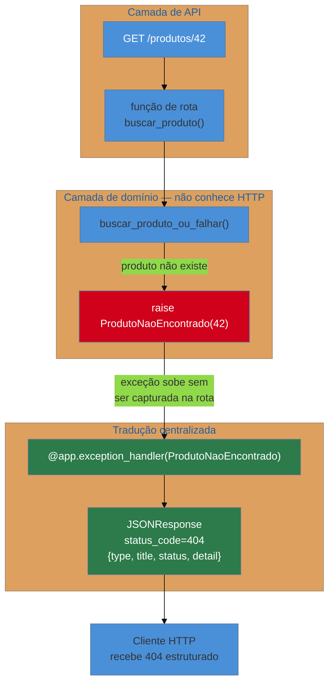

# Tratamento de erros e respostas HTTP padronizadas

> [!abstract] TL;DR
> Uma API que cresce endpoint a endpoint, sem uma convenção central de erro, acaba com um formato de resposta de falha diferente por rota — e cada formato diferente é um `if` a mais que o cliente precisa escrever. Os três frameworks resolvem isso de formas distintas: **FastAPI** intercepta exceções com `@app.exception_handler(TipoDeExcecao)`, transformando uma exceção de domínio (`ProdutoNaoEncontrado`) numa resposta HTTP consistente, sem espalhar `try/except` pelas rotas; **DRF** centraliza a conversão em uma função `EXCEPTION_HANDLER` configurável em `settings.py`, com `APIException` como base de erros de domínio; **Flask** usa `@app.errorhandler`, o mais direto dos três, mapeando status code ou classe de exceção a uma função. O padrão por trás de todos — mesmo sem instalar nenhuma lib — é o que a [RFC 7807 (Problem Details)](https://datatracker.ietf.org/doc/html/rfc7807) formalizou: todo erro de API deveria ter uma **forma previsível**, com campos como `type`, `title`, `status` e `detail`, para que o cliente trate erro de qualquer endpoint com o mesmo código. Por cima disso, o vocabulário de status code importa: 400 é para requisição malformada, 422 (já visto na [[03 - Validação e serialização com Pydantic|nota 03]]) é para conteúdo semanticamente inválido, e 409 é para conflito de estado — violação de unicidade, por exemplo. E o erro mais grave de todos não é escolher o status code errado: é vazar um traceback de produção para o cliente, expondo caminho de arquivo, versão de biblioteca e, às vezes, segredo de configuração.

## O incidente que abre esta nota

Um frontend React está integrando com uma API que já tem seis meses de vida e três desenvolvedores diferentes passaram por ela, cada um adicionando endpoints em sprints separadas, sem revisão cruzada do formato de erro. O time de frontend abre um ticket de bug, com um trecho de código que tenta tratar erro de forma genérica:

```javascript
async function chamarApi(url, opcoes) {
  const resposta = await fetch(url, opcoes);
  if (!resposta.ok) {
    const corpo = await resposta.json();
    mostrarErroParaUsuario(corpo.error);  // funciona... às vezes
  }
  return resposta.json();
}
```

O código funciona contra o endpoint de login, que devolve:

```json
{ "error": "Credenciais inválidas" }
```

Mas quebra silenciosamente contra o endpoint de criação de pedido, que devolve:

```json
{ "detail": "Estoque insuficiente para o produto 42" }
```

`corpo.error` é `undefined` nesse segundo caso — `mostrarErroParaUsuario(undefined)` renderiza uma caixa de diálogo vazia, e o usuário só sabe que "algo deu errado", sem saber o quê. Pior ainda: um terceiro endpoint, o de atualização de perfil, tem um bug não tratado que deixa uma exceção Python subir crua até o servidor WSGI, e em ambiente de *staging* (sem `DEBUG = False` configurado corretamente) devolve isto:

```json
{
  "error": "Internal Server Error",
  "traceback": "Traceback (most recent call last):\n  File \"/app/venv/lib/python3.12/site-packages/django/core/handlers/exception.py\", line 55, in inner\n    response = get_response(request)\n  File \"/app/usuarios/views.py\", line 87, in atualizar_perfil\n    usuario.save(update_fields=[campo_invalido])\nFieldDoesNotExist: Usuario has no field named 'campo_invalido'\n..."
}
```

> [!bug] O que está quebrado, em uma frase
> Três formatos de erro diferentes (`{"error": ...}`, `{"detail": ...}`, um traceback cru) para o mesmo tipo de evento — "a requisição falhou" — porque cada endpoint foi escrito por uma pessoa diferente, sem uma convenção central que todos os erros da API passam a seguir automaticamente.

> [!warning] Vazar traceback em produção é uma falha de segurança, não só de UX
> O traceback do exemplo acima revela o caminho absoluto do código no servidor (`/app/venv/...`), a versão do Django implícita na estrutura de pastas, o nome exato de uma view (`usuarios/views.py`, linha 87) e, dependendo de onde a exceção nasce, pode revelar string de conexão de banco, chave de API mal tratada em uma variável local exposta pelo interpretador de erro, ou nome de tabela/coluna interna que ajuda um atacante a mapear o sistema. Toda checklist de segurança de API séria (OWASP API Security Top 10, categoria de *Security Misconfiguration*) trata "detailed error responses that include stack traces" como achado de severidade real, não estético. **Nunca**, em nenhum dos três frameworks, um handler de erro genérico deve devolver `str(exception)` ou o traceback formatado direto ao cliente em ambiente de produção — só logar internamente, e devolver uma mensagem genérica e segura.

O resto desta nota resolve esse incidente em cada um dos três frameworks, e fecha com um contrato de erro único, proposto para a API que a [[09 - Capstone — uma API REST completa de ponta a ponta|capstone deste galho]] vai construir — de forma que nenhum endpoint novo, escrito por nenhum desenvolvedor futuro, precise reinventar o formato de erro do zero.

## FastAPI: de `HTTPException` a exception handlers customizados

### O caminho mais simples: `HTTPException`

A forma mais direta de devolver um erro no FastAPI, já usada de raspão nas notas anteriores deste galho (a [[01 - Django vs FastAPI vs Flask — panorama e filosofias|nota 01]] mostrou um `raise HTTPException(status_code=404, ...)` no comparativo de "mesmo endpoint, três frameworks"), é levantar `fastapi.HTTPException` dentro do handler:

```python
from fastapi import FastAPI, HTTPException

app = FastAPI()
produtos_db = {1: {"nome": "Teclado mecânico"}, 2: {"nome": "Monitor 27''"}}


@app.get("/produtos/{produto_id}")
def buscar_produto(produto_id: int):
    produto = produtos_db.get(produto_id)
    if produto is None:
        raise HTTPException(status_code=404, detail="Produto não encontrado")
    return produto
```

`HTTPException` é interceptada por um exception handler **interno** que o próprio FastAPI já registra por padrão — não é preciso configurar nada para que ela vire uma resposta JSON:

```json
{ "detail": "Produto não encontrado" }
```

Isso já resolve o formato de erro para **um** tipo de falha ("recurso não encontrado", "acesso negado" etc.), sempre no formato `{"detail": "..."}`. O problema aparece quando a lógica de negócio mora fora da camada de rota — numa função de serviço, por exemplo — e essa função não deveria (nem pode, sem acoplamento desnecessário) importar `HTTPException` do FastAPI só para sinalizar um erro de domínio.

### O problema: lógica de negócio não deveria conhecer HTTP

Um serviço de domínio bem desenhado não sabe que está sendo chamado por uma API HTTP — ele poderia ser chamado por um worker de fila, um comando de CLI, um teste. Se a única forma de sinalizar "produto não encontrado" for `raise HTTPException(...)`, essa camada de domínio fica amarrada ao FastAPI:

```python
# services/produtos.py — ACOPLADO ao FastAPI, não deveria estar
from fastapi import HTTPException


def buscar_produto_ou_falhar(produto_id: int, db):
    produto = db.get(produto_id)
    if produto is None:
        raise HTTPException(status_code=404, detail="Produto não encontrado")  # HTTP num lugar que não devia saber de HTTP
    return produto
```

A alternativa correta — e o mecanismo central desta seção — é a camada de domínio levantar uma **exceção Python comum**, sem qualquer conhecimento de HTTP, e a camada de API traduzir essa exceção para uma resposta, num único lugar central:

```python
# domain/exceptions.py — exceção pura de domínio, sem nenhum import de FastAPI
class ProdutoNaoEncontrado(Exception):
    def __init__(self, produto_id: int):
        self.produto_id = produto_id
        super().__init__(f"Produto {produto_id} não encontrado")


class EstoqueInsuficiente(Exception):
    def __init__(self, produto_id: int, quantidade_disponivel: int):
        self.produto_id = produto_id
        self.quantidade_disponivel = quantidade_disponivel
        super().__init__(
            f"Estoque insuficiente para o produto {produto_id} "
            f"(disponível: {quantidade_disponivel})"
        )
```

```python
# services/produtos.py — agnóstico de HTTP, testável isoladamente, sem mock de FastAPI
from domain.exceptions import ProdutoNaoEncontrado


def buscar_produto_ou_falhar(produto_id: int, db):
    produto = db.get(produto_id)
    if produto is None:
        raise ProdutoNaoEncontrado(produto_id)
    return produto
```

Agora, na camada de API — e só nela — um `@app.exception_handler()` traduz `ProdutoNaoEncontrado` para uma resposta HTTP:

```python
# main.py
from fastapi import FastAPI, Request
from fastapi.responses import JSONResponse

from domain.exceptions import ProdutoNaoEncontrado, EstoqueInsuficiente

app = FastAPI()


@app.exception_handler(ProdutoNaoEncontrado)
def tratar_produto_nao_encontrado(request: Request, exc: ProdutoNaoEncontrado):
    return JSONResponse(
        status_code=404,
        content={
            "type": "produto-nao-encontrado",
            "title": "Produto não encontrado",
            "status": 404,
            "detail": str(exc),
            "instance": str(request.url),
        },
    )


@app.exception_handler(EstoqueInsuficiente)
def tratar_estoque_insuficiente(request: Request, exc: EstoqueInsuficiente):
    return JSONResponse(
        status_code=409,
        content={
            "type": "estoque-insuficiente",
            "title": "Estoque insuficiente",
            "status": 409,
            "detail": str(exc),
            "instance": str(request.url),
        },
    )
```

A rota, agora, não sabe nada sobre status code — só chama a função de serviço e deixa a exceção subir, se houver uma:

```python
@app.get("/produtos/{produto_id}")
def buscar_produto(produto_id: int, db=Depends(get_db)):
    return buscar_produto_ou_falhar(produto_id, db)
```

> [!tip] Um exception handler por tipo de exceção, aplicado a toda a aplicação
> `@app.exception_handler(ProdutoNaoEncontrado)` é registrado **uma vez**, na inicialização do app, e vale para **qualquer** rota que deixe `ProdutoNaoEncontrado` subir — não é preciso repetir `try/except` em cada endpoint que pode falhar dessa forma. É o mesmo princípio do `response_model` visto na [[03 - Validação e serialização com Pydantic|nota 03]]: declarar a regra uma vez, num ponto central, em vez de confiar em disciplina repetida em cada rota.



### `RequestValidationError`: sobrescrevendo o formato do 422

A [[03 - Validação e serialização com Pydantic|nota 03]] já mostrou o formato padrão do erro 422 do FastAPI (`{"detail": [{"type": ..., "loc": ..., "msg": ...}, ...]}`) — essa nota não repete o mecanismo de validação em si, só nomeia que ele também passa pelo mesmo sistema de exception handlers, via `RequestValidationError`, e pode ser sobrescrito para bater com o mesmo formato consistente escolhido para o resto da API:

```python
from fastapi.exceptions import RequestValidationError


@app.exception_handler(RequestValidationError)
def tratar_erro_validacao(request: Request, exc: RequestValidationError):
    return JSONResponse(
        status_code=422,
        content={
            "type": "erro-de-validacao",
            "title": "Dados de entrada inválidos",
            "status": 422,
            "detail": exc.errors(),   # mantém o detalhe estruturado por campo do Pydantic
            "instance": str(request.url),
        },
    )
```

> [!question]- Vale a pena sobrescrever o formato padrão do 422 do FastAPI, ou o default já é bom o bastante?
> Depende do contrato que a API se compromete a manter. O formato padrão do FastAPI (`{"detail": [...]}`) já é estruturado e consistente **entre si** — todo 422 de validação tem essa forma. O ganho de sobrescrever é fazer esse formato bater com o **mesmo envelope** usado pelos outros tipos de erro da API (404, 409, etc.) — para que o cliente escreva um único parser de erro (`corpo.title`, `corpo.status`, `corpo.detail`) que funciona para qualquer resposta de falha, validação ou não. Times pequenos, com pouca superfície de erro, costumam aceitar o formato default do FastAPI sem sobrescrever; times que documentam a API para consumidores externos (parceiros, público) tendem a investir nesse envelope único, porque o custo de manter dois formatos de erro documentados na spec OpenAPI é maior do que escrever um handler a mais.

### `Exception` genérica: a rede de segurança final

Todo o resto — bugs não previstos, exceções de bibliotecas de terceiros, qualquer coisa que não seja `HTTPException` nem uma exceção de domínio conhecida — deveria cair num handler genérico, que **nunca** vaza detalhe interno:

```python
import logging

logger = logging.getLogger("api")


@app.exception_handler(Exception)
def tratar_erro_nao_previsto(request: Request, exc: Exception):
    logger.exception("Erro não tratado em %s", request.url)  # log completo, só no servidor
    return JSONResponse(
        status_code=500,
        content={
            "type": "erro-interno",
            "title": "Erro interno do servidor",
            "status": 500,
            "detail": "Ocorreu um erro inesperado. A equipe já foi notificada.",
            "instance": str(request.url),
        },
    )
```

`logger.exception(...)` grava o traceback completo no log do servidor (onde a equipe de operação/observabilidade consegue investigar) — o cliente recebe só uma mensagem genérica e segura. Essa é exatamente a correção do vazamento de traceback visto no incidente de abertura.

## Django REST Framework: `EXCEPTION_HANDLER` e `APIException`

O DRF resolve o mesmo problema com uma peça central: uma **função** de tratamento de exceção, configurada globalmente em `settings.py`, chamada automaticamente sempre que uma view do DRF deixa uma exceção subir.

### O handler default e como ele já ajuda

O DRF já vem com um `exception_handler` default (`rest_framework.views.exception_handler`) que trata alguns tipos de exceção do próprio framework — `Http404`, `PermissionDenied`, e qualquer subclasse de `APIException` — convertendo para uma resposta JSON com `{"detail": "..."}`, de forma parecida com o `HTTPException` do FastAPI:

```python
# views.py
from rest_framework.views import APIView
from rest_framework.response import Response
from rest_framework.exceptions import NotFound

from .models import Produto


class ProdutoDetailView(APIView):
    def get(self, request, produto_id):
        try:
            produto = Produto.objects.get(id=produto_id)
        except Produto.DoesNotExist:
            raise NotFound("Produto não encontrado")   # já vira 404 estruturado
        return Response({"id": produto.id, "nome": produto.nome})
```

`NotFound` é uma subclasse de `rest_framework.exceptions.APIException` — o DRF já sabe converter qualquer `APIException` (e suas subclasses prontas: `ValidationError`, `PermissionDenied`, `NotAuthenticated`, `MethodNotAllowed`, `Throttled`, entre outras) numa resposta HTTP com o status code certo, sem nenhuma configuração extra.

### Exceções de domínio próprias, com `APIException`

O mesmo padrão de `ProdutoNaoEncontrado`/`EstoqueInsuficiente` do FastAPI se traduz, no DRF, como subclasses de `APIException` — a diferença de ergonomia é que o DRF já espera esse acoplamento (a exceção de erro **é** parte do vocabulário HTTP do framework, diferente do FastAPI, onde a prática recomendada separa exceção de domínio de exceção HTTP):

```python
# exceptions.py
from rest_framework.exceptions import APIException
from rest_framework import status


class EstoqueInsuficiente(APIException):
    status_code = status.HTTP_409_CONFLICT
    default_detail = "Estoque insuficiente para completar o pedido."
    default_code = "estoque_insuficiente"
```

```python
# views.py
from .exceptions import EstoqueInsuficiente


class PedidoCreateView(APIView):
    def post(self, request):
        quantidade_pedida = request.data.get("quantidade")
        estoque_atual = obter_estoque(request.data.get("produto_id"))
        if quantidade_pedida > estoque_atual:
            raise EstoqueInsuficiente(f"Disponível: {estoque_atual}")
        ...
```

> [!question]- É possível manter a lógica de domínio agnóstica de DRF, como no FastAPI?
> Sim — o padrão de separar exceção de domínio pura (`class EstoqueInsuficiente(Exception)`, sem herdar de `APIException`) e traduzir na camada de view continua válido no DRF, é só menos comum na prática, porque o `EXCEPTION_HANDLER` padrão do DRF já resolve `APIException` de graça. Quando a equipe valoriza a mesma separação de camadas do exemplo FastAPI (serviço de domínio sem nenhum import de `rest_framework`), a solução é a mesma: a exceção de domínio é pura, e o `EXCEPTION_HANDLER` customizado (próxima seção) faz a tradução — em vez de o serviço levantar `APIException` diretamente.

### Sobrescrevendo o `EXCEPTION_HANDLER` global

O ponto mais importante para uma API DRF grande, com múltiplos apps e desenvolvedores, é registrar um `EXCEPTION_HANDLER` **customizado** em `settings.py` — um único ponto central que intercepta qualquer exceção não tratada em qualquer view do projeto:

```python
# core/exception_handlers.py
import logging

from rest_framework.views import exception_handler as drf_exception_handler
from rest_framework.response import Response
from rest_framework import status

logger = logging.getLogger("api")


def exception_handler_customizado(exc, context):
    # 1. deixa o DRF tentar resolver primeiro (APIException e subclasses conhecidas)
    resposta = drf_exception_handler(exc, context)

    if resposta is not None:
        # já é um erro conhecido do DRF — só reformata pro envelope padrão da API
        resposta.data = {
            "type": getattr(exc, "default_code", "erro"),
            "title": resposta.status_text,
            "status": resposta.status_code,
            "detail": resposta.data.get("detail", resposta.data),
            "instance": context["request"].path,
        }
        return resposta

    # 2. exceção não reconhecida pelo DRF — rede de segurança final
    logger.exception("Erro não tratado em %s", context["request"].path)
    return Response(
        {
            "type": "erro-interno",
            "title": "Erro interno do servidor",
            "status": status.HTTP_500_INTERNAL_SERVER_ERROR,
            "detail": "Ocorreu um erro inesperado. A equipe já foi notificada.",
            "instance": context["request"].path,
        },
        status=status.HTTP_500_INTERNAL_SERVER_ERROR,
    )
```

```python
# settings.py
REST_FRAMEWORK = {
    "EXCEPTION_HANDLER": "core.exception_handlers.exception_handler_customizado",
}
```

O padrão é o mesmo do FastAPI, só invertido em quem chama quem: no FastAPI, cada tipo de exceção tem seu próprio handler registrado (`@app.exception_handler(Tipo)`); no DRF, existe **uma** função central que recebe qualquer exceção e decide o que fazer — delegando para o comportamento default do DRF quando aplicável, e caindo num fallback seguro quando não. Vale notar o detalhe que evita o vazamento de traceback: assim como no FastAPI, o `logger.exception(...)` grava o stack trace completo só no log do servidor, nunca no corpo da resposta.

> [!warning] `DEBUG = True` em produção é a forma mais comum de vazar traceback no Django
> Independente de qualquer `EXCEPTION_HANDLER` customizado, o Django (e o DRF por cima dele) tem uma página de erro de depuração muito detalhada — com traceback completo, valores de variáveis locais em cada frame, e até algumas variáveis de ambiente — habilitada sempre que `settings.DEBUG = True`. Essa página é indispensável em desenvolvimento e uma falha de segurança grave se acidentalmente ativada em produção (é o cenário exato do incidente de abertura desta nota). A checklist de deploy de qualquer projeto Django deveria conferir, de forma automatizada (não manual), que `DEBUG = False` em todo ambiente que recebe tráfego real — o próprio Django documenta isso como o primeiro item do checklist de deploy oficial.

A separação `Serializer`/`ModelSerializer` do DRF, já coberta em profundidade na [[05 - Django REST Framework — serializers, viewsets e routers|nota 05 deste galho]], também gera erro estruturado quando a validação falha — um `ValidationError` do DRF, subclasse de `APIException`, que o `exception_handler` (default ou customizado) já sabe converter em `400 Bad Request` com o dicionário `{campo: [mensagens]}` por padrão. Essa nota não repete o mecanismo do serializer em si; só nomeia que ele se encaixa no mesmo pipeline de tratamento de erro descrito aqui.

## Flask: `@app.errorhandler`

Flask resolve o mesmo problema com o decorator mais direto dos três — `@app.errorhandler`, que aceita tanto um **status code** (para erros HTTP genéricos, como 404 devolvido por `abort(404)`) quanto uma **classe de exceção Python** (para erros de domínio customizados).

### Por status code

```python
from flask import Flask, jsonify, abort

app = Flask(__name__)


@app.errorhandler(404)
def tratar_nao_encontrado(erro):
    return jsonify({
        "type": "recurso-nao-encontrado",
        "title": "Recurso não encontrado",
        "status": 404,
        "detail": str(erro.description) if hasattr(erro, "description") else "Não encontrado",
    }), 404


@app.route("/produtos/<int:produto_id>")
def buscar_produto(produto_id):
    produto = produtos_db.get(produto_id)
    if produto is None:
        abort(404, description=f"Produto {produto_id} não encontrado")
    return jsonify(produto)
```

`abort(404, description=...)` levanta uma exceção HTTP interna do Werkzeug (`werkzeug.exceptions.NotFound`) com a mensagem customizada — e o `@app.errorhandler(404)` intercepta **qualquer** 404 gerado dessa forma em qualquer rota da aplicação, sem repetir o formato de resposta em cada `abort()`.

### Por classe de exceção — o mesmo padrão de exceção de domínio

Exatamente como no FastAPI, uma exceção de domínio pura (sem nenhum import de Flask) pode ser interceptada por `@app.errorhandler`, mantendo a mesma separação entre lógica de negócio e camada HTTP:

```python
# domain/exceptions.py — reaproveitando as mesmas classes do exemplo FastAPI
class ProdutoNaoEncontrado(Exception):
    def __init__(self, produto_id: int):
        self.produto_id = produto_id
        super().__init__(f"Produto {produto_id} não encontrado")
```

```python
# app.py
from flask import Flask, jsonify
from domain.exceptions import ProdutoNaoEncontrado

app = Flask(__name__)


@app.errorhandler(ProdutoNaoEncontrado)
def tratar_produto_nao_encontrado(erro: ProdutoNaoEncontrado):
    return jsonify({
        "type": "produto-nao-encontrado",
        "title": "Produto não encontrado",
        "status": 404,
        "detail": str(erro),
    }), 404


@app.route("/produtos/<int:produto_id>")
def buscar_produto(produto_id):
    return jsonify(buscar_produto_ou_falhar(produto_id, db))   # levanta ProdutoNaoEncontrado, sem try/except aqui
```

A rota, de novo, não precisa de `try/except` — a exceção sobe naturalmente do serviço de domínio até o handler registrado, exatamente como no FastAPI.

### A rede de segurança: `@app.errorhandler(Exception)`

```python
import logging

logger = logging.getLogger("api")


@app.errorhandler(Exception)
def tratar_erro_nao_previsto(erro):
    logger.exception("Erro não tratado")
    return jsonify({
        "type": "erro-interno",
        "title": "Erro interno do servidor",
        "status": 500,
        "detail": "Ocorreu um erro inesperado. A equipe já foi notificada.",
    }), 500
```

> [!warning] `app.debug = True` em produção é o equivalente Flask do `DEBUG = True` do Django
> O mesmo risco do Django se aplica ao Flask: rodar com `debug=True` (seja via `app.run(debug=True)` ou a variável de ambiente `FLASK_DEBUG=1`) ativa o **debugger interativo do Werkzeug**, que não só mostra traceback completo no navegador como, em versões mais antigas ou mal configuradas, permite executar código Python arbitrário através de um console embutido na própria página de erro — um risco de execução remota de código, não só de vazamento de informação, se exposto publicamente. A documentação oficial do Flask é explícita: o modo debug nunca deve rodar num ambiente de produção acessível pela internet.

### `@app.errorhandler` só cobre a aplicação inteira, sem `Blueprint` isolado por padrão

Um detalhe de escopo que vale nomear: quando registrado no objeto `app` diretamente, `@app.errorhandler` vale para toda a aplicação, incluindo rotas dentro de `Blueprint`s (já vistos na [[02 - Roteamento — decorators, urls.py e path operations|nota 02]]). É possível registrar um `@bp.errorhandler` só dentro de um `Blueprint` específico, mas ele só intercepta erros levantados **dentro** das rotas daquele blueprint — para um comportamento consistente em toda a API, o padrão recomendado é registrar os handlers principais no `app`, não em cada blueprint individualmente.

## O padrão por trás dos três: RFC 7807 (Problem Details)

Os três exemplos acima — FastAPI, DRF, Flask — convergiram, de propósito, para o mesmo formato de corpo de resposta:

```json
{
  "type": "produto-nao-encontrado",
  "title": "Produto não encontrado",
  "status": 404,
  "detail": "Produto 42 não encontrado",
  "instance": "/produtos/42"
}
```

Isso não é coincidência de exemplo — é a estrutura que a [RFC 7807](https://datatracker.ietf.org/doc/html/rfc7807), *Problem Details for HTTP APIs*, formalizou em 2016 como convenção para respostas de erro HTTP. Vale nomear os campos com precisão, porque a RFC os define com semântica específica, não como nomes arbitrários:

- **`type`** — um identificador (idealmente uma URI, mas na prática frequentemente só uma string curta como `"produto-nao-encontrado"`) que categoriza o **tipo** do problema — o mesmo `type` deveria significar o mesmo problema em qualquer lugar da API.
- **`title`** — um resumo curto, legível por humanos, do tipo do problema — não deveria mudar entre ocorrências do mesmo `type` (diferente de `detail`, que é específico da instância do erro).
- **`status`** — o código de status HTTP, repetido no corpo (redundante com o status HTTP real da resposta, mas útil quando o corpo é inspecionado fora do contexto da resposta HTTP em si — por exemplo, em log ou numa fila de eventos de erro).
- **`detail`** — a explicação específica **desta** ocorrência do problema (qual produto, qual quantidade) — a parte que muda a cada erro real, mesmo com o mesmo `type`.
- **`instance`** (opcional) — uma URI que identifica a ocorrência específica do problema, tipicamente a própria URL que foi chamada.

> [!tip] O ponto não é instalar uma lib — é adotar o padrão conceitual
> Existem pacotes prontos que implementam RFC 7807 literalmente, incluindo o `Content-Type: application/problem+json` no header de resposta (para FastAPI, DRF e Flask, cada ecossistema tem sua opção de terceiros). Mas o valor real desta nota não está em recomendar uma lib específica — está em internalizar **a forma** que a RFC descreve, e replicá-la manualmente (como os exemplos desta nota fazem) ou via lib, dependendo do que o projeto já usa. Uma API pequena, sem necessidade de compatibilidade formal com RFC 7807, ganha 90% do benefício só adotando os mesmos quatro ou cinco campos (`type`/`title`/`status`/`detail`) de forma consistente entre endpoints — o formato exato do JSON importa menos do que a **consistência** entre rotas.

> [!question]- Por que não usar só `{"error": "mensagem"}` — é mais simples, por que complicar?
> Um único campo de mensagem funciona bem enquanto a API é pequena e o cliente só precisa mostrar um texto para o usuário. O problema aparece quando o cliente precisa **decidir um comportamento diferente** por tipo de erro — por exemplo, mostrar um botão "tentar novamente" para `estoque-insuficiente`, mas redirecionar para login em `nao-autenticado`. Com só uma string de mensagem, o cliente é forçado a fazer *string matching* na mensagem de erro (`if (erro.error.includes("estoque"))`), um padrão frágil que quebra na primeira vez que alguém reescreve o texto da mensagem para ficar mais claro. Com um campo `type` estável e semântico, separado do `detail` legível por humanos, o cliente decide comportamento pelo `type` (que não muda) e só exibe o `detail` (que pode mudar) como texto.

## Status codes semânticos: 400 vs. 422 vs. 409

O vocabulário de status code de erro (4xx — erro do cliente) tem uma distinção que aparece com frequência em entrevista e em revisão de API, e que os três frameworks tratam de forma ligeiramente diferente por padrão:

| Status | Nome | Quando usar | Quem decide, tipicamente |
|---|---|---|---|
| **400** | Bad Request | A requisição está malformada de um jeito que o servidor nem consegue **interpretar** — JSON sintaticamente inválido, `Content-Type` incompatível com o corpo enviado, um parâmetro de query num formato completamente fora do esperado (não um tipo errado dentro de um schema válido — isso é 422). | O parser HTTP/JSON, antes mesmo do framework de validação entrar em ação. |
| **422** | Unprocessable Entity | A requisição está **bem formada** (JSON válido, sintaticamente correto), mas o **conteúdo** viola uma regra de schema — campo obrigatório ausente, tipo errado, restrição de validação (`Field(min_length=...)` do Pydantic, `field.required` de um `Serializer` do DRF) violada. Já detalhado na [[03 - Validação e serialização com Pydantic|nota 03]], que cobre o formato exato do 422 do FastAPI — esta nota não repete esse detalhe, só reposiciona o 422 no vocabulário mais amplo de status codes. | O sistema de validação de schema (Pydantic no FastAPI; `Serializer` no DRF). |
| **409** | Conflict | A requisição é válida em formato e schema, mas **conflita com o estado atual** do servidor — violação de constraint de unicidade (criar um usuário com um e-mail que já existe), tentativa de editar um recurso que foi modificado concorrentemente (conflito de versão otimista), ou uma regra de negócio de estado (cancelar um pedido que já foi enviado). | Lógica de negócio/domínio, geralmente depois de uma consulta ao banco ou uma checagem de regra. |

> [!warning] 400 genérico é o "catch-all" mais mal utilizado do vocabulário HTTP
> Uma armadilha comum, principalmente em código legado ou escrito às pressas, é usar 400 para **qualquer** erro do cliente, sem distinguir "não consegui nem entender a requisição" de "entendi, mas o valor não é válido" de "entendi e é válido, mas conflita com o que já existe". Isso empobrece a API: um cliente que recebe sempre 400 não consegue diferenciar programaticamente "corrija o formato" de "corrija um valor específico" de "esse recurso já existe, talvez você queira atualizar em vez de criar". A distinção 400/422/409 não é pedantismo de RFC — é informação que o cliente usa para decidir o próximo passo automaticamente, sem precisar fazer *parsing* de texto de erro.

Exemplo de 409 em cada framework, para fechar o vocabulário — violação de unicidade de e-mail no cadastro:

```python
# FastAPI
class EmailJaCadastrado(Exception):
    def __init__(self, email: str):
        self.email = email
        super().__init__(f"E-mail {email} já cadastrado")


@app.exception_handler(EmailJaCadastrado)
def tratar_email_duplicado(request: Request, exc: EmailJaCadastrado):
    return JSONResponse(
        status_code=409,
        content={"type": "email-duplicado", "title": "E-mail já cadastrado",
                  "status": 409, "detail": str(exc)},
    )
```

```python
# DRF
class EmailJaCadastrado(APIException):
    status_code = status.HTTP_409_CONFLICT
    default_detail = "E-mail já cadastrado."
    default_code = "email_duplicado"
```

```python
# Flask
@app.errorhandler(EmailJaCadastrado)
def tratar_email_duplicado(erro):
    return jsonify({"type": "email-duplicado", "title": "E-mail já cadastrado",
                     "status": 409, "detail": str(erro)}), 409
```

> [!question]- E os erros 401/403 (autenticação/autorização) — onde essa nota os encaixa?
> Esta nota nomeia que 401 (Unauthorized — o cliente não está autenticado) e 403 (Forbidden — o cliente está autenticado, mas não tem permissão) também passam pelo mesmo pipeline de exception handler descrito aqui (`HTTPException(status_code=401, ...)` no FastAPI, `NotAuthenticated`/`PermissionDenied` no DRF, `abort(401)`/`abort(403)` no Flask) — mas o **mecanismo** de autenticação em si (JWT, sessão, API key, `permission_classes` do DRF) é assunto do [[03-Dominios/Tecnologia/Python/Segurança/index|Galho 11]], não desenvolvido aqui. O ponto relevante para esta nota é só que 401/403 se encaixam no mesmo contrato de erro proposto — nenhum tratamento especial de formato é necessário para eles.

## Armadilhas comuns

> [!warning] Try/except espalhado em cada rota, em vez de handler central
> **O que acontece:** cada rota que pode falhar de um jeito conhecido (produto não encontrado, estoque insuficiente) tem seu próprio bloco `try/except`, formatando a resposta de erro manualmente, dentro da própria função de rota. **Por quê:** parece mais simples no começo — "só esse endpoint precisa tratar esse erro" — mas não escala: o formato de erro diverge sutilmente entre rotas (um esquece um campo, outro usa nome de chave diferente), e o mesmo tipo de erro de domínio pode acabar formatado de duas formas diferentes em dois endpoints distintos, reproduzindo exatamente o incidente de abertura desta nota. **Como evitar:** exceção de domínio pura, levantada sem `try/except` na rota, capturada centralmente por um exception handler (FastAPI/Flask) ou pelo `EXCEPTION_HANDLER` (DRF) — registrado uma vez, aplicado a toda a aplicação.

> [!warning] Devolver `str(exception)` direto ao cliente em qualquer handler genérico
> **O que acontece:** um handler de `Exception`/`Exception genérica` devolve `{"detail": str(exc)}` ou até `{"traceback": traceback.format_exc()}`, achando que está "sendo transparente" com o cliente sobre o que deu errado. **Por quê:** exceções não previstas (`KeyError`, `AttributeError`, erro de biblioteca de terceiros) frequentemente carregam, na própria mensagem, detalhe interno do sistema — nome de variável, estrutura de dado interna, caminho de arquivo — que não deveria vazar para fora do processo. **Como evitar:** o handler de `Exception` genérica sempre loga o detalhe completo internamente (`logger.exception(...)`) e devolve uma mensagem fixa e genérica ao cliente — nunca interpola a mensagem da exceção real na resposta HTTP, exceto quando a exceção é uma exceção de domínio conhecida e controlada (como `ProdutoNaoEncontrado`, cuja mensagem foi escrita deliberadamente para ser segura de expor).

> [!warning] `DEBUG`/`debug` ligado em produção
> **O que acontece:** Django com `DEBUG = True`, ou Flask com `debug=True`/`FLASK_DEBUG=1`, rodando num ambiente que recebe tráfego real (staging exposto publicamente conta como produção, para esse efeito). **Por quê:** os dois modos de debug existem para acelerar desenvolvimento local — página de erro detalhada, reload automático — e nenhum dos dois foi desenhado pensando em exposição a clientes não confiáveis. **Como evitar:** checagem automatizada (não manual, não "lembrar de desligar") no pipeline de deploy que falha o build se `DEBUG`/`debug` estiver ativo fora do ambiente local — a maioria dos times sênior trata isso como gate de CI, não como item de checklist manual esquecível.

> [!warning] Formato de erro inconsistente entre validação (422) e erro de negócio (404/409)
> **O que acontece:** o erro de validação (422) usa um formato (`{"detail": [...]}`, uma lista) e o erro de negócio (404, criado manualmente) usa outro (`{"error": "..."}`, uma string) — dois formatos coexistindo na mesma API, um por vir "de fábrica" do framework e outro escrito à mão. **Por quê:** é fácil esquecer que o formato default de validação do framework (visto na nota 03, para o FastAPI) também precisa ser trazido para o mesmo envelope escolhido para o resto da API — sobrescrever o handler de `RequestValidationError`/`ValidationError` é um passo à parte, não automático. **Como evitar:** decidir o envelope de erro (`type`/`title`/`status`/`detail`, ou variação equivalente) **antes** de escrever a primeira rota, e sobrescrever explicitamente o handler de validação do framework para bater com esse envelope — não deixar o formato default do framework ser "o formato de um tipo de erro" e um formato escrito à mão ser "o formato de outro".

## O contrato de erro proposto para a capstone

Fechando o incidente de abertura — três formatos de erro coexistindo na mesma API, um deles vazando traceback — o contrato de erro que a [[09 - Capstone — uma API REST completa de ponta a ponta|nota 09, capstone deste galho]] vai adotar de ponta a ponta é:

```json
{
  "type": "identificador-curto-do-tipo-de-erro",
  "title": "Resumo legível, estável entre ocorrências do mesmo type",
  "status": 404,
  "detail": "Explicação específica desta ocorrência",
  "instance": "/caminho/da/requisicao"
}
```

Com as seguintes regras de aplicação, válidas em qualquer um dos três frameworks:

1. **Exceção de domínio pura** — sem import de FastAPI/DRF/Flask — sempre que a lógica de negócio precisa sinalizar uma falha esperada (recurso não encontrado, conflito, regra de negócio violada).
2. **Um ponto central de tradução** — `@app.exception_handler` (FastAPI), `EXCEPTION_HANDLER` (DRF) ou `@app.errorhandler` (Flask) — nunca `try/except` espalhado rota a rota.
3. **Status code semântico** — 400 para requisição malformada, 422 para conteúdo semanticamente inválido (delegado ao framework de validação sempre que possível), 409 para conflito de estado, 404 para recurso inexistente, 401/403 para autenticação/autorização (mecanismo aprofundado no Galho 11).
4. **Rede de segurança final** — um handler de `Exception` genérica que loga o detalhe completo internamente e nunca devolve `str(exception)`/traceback ao cliente.
5. **`DEBUG`/`debug` desligado** por padrão em qualquer ambiente que não seja a máquina local do desenvolvedor, verificado automaticamente no pipeline de deploy.

## Em entrevista

- **"Como você trata erros de domínio numa API sem acoplar a lógica de negócio ao framework web?"** A camada de domínio levanta exceções Python puras (`class ProdutoNaoEncontrado(Exception)`, sem nenhum import do framework), e a camada de API traduz essas exceções para respostas HTTP num ponto central — `@app.exception_handler()` no FastAPI, `EXCEPTION_HANDLER` customizado no DRF, `@app.errorhandler` no Flask. A rota não precisa de `try/except`; a exceção simplesmente sobe do serviço até o handler registrado.
- **"O que é RFC 7807 e por que ela importa mesmo sem instalar uma lib?"** É a especificação *Problem Details for HTTP APIs*, que formaliza um formato consistente de erro HTTP com campos como `type`, `title`, `status`, `detail`. O valor não está em usar uma implementação literal da RFC — está em adotar a mesma ideia (um envelope estável, com campo de categoria separado de campo de mensagem legível) em qualquer endpoint da API, para que o cliente trate erro de forma programática, não por *string matching* na mensagem.
- **"Qual a diferença real entre 400, 422 e 409?"** 400 é para requisição malformada — o servidor nem consegue interpretar o que chegou (JSON quebrado). 422 é para conteúdo semanticamente inválido — a requisição está bem formada, mas viola uma regra de schema (campo obrigatório ausente, tipo errado). 409 é para conflito de estado — a requisição é válida, mas o servidor não pode processá-la porque conflita com o estado atual (e-mail duplicado, recurso já modificado).
- **"Por que nunca devolver um traceback de produção ao cliente?"** Um traceback revela caminho de arquivo do servidor, versão de biblioteca, nome de função/view interna e, dependendo do ponto de falha, dado sensível capturado em variável local — informação que ajuda um atacante a mapear a infraestrutura do sistema. A prática correta é logar o traceback completo internamente (`logger.exception`) e devolver ao cliente só uma mensagem genérica e segura, tanto no handler de erro quanto garantindo `DEBUG`/`debug` desligado em qualquer ambiente exposto.

> [!question]- O entrevistador pergunta: "e se dois times diferentes do mesmo projeto escolherem `type` diferentes para o mesmo tipo de erro?"
> É o mesmo problema estrutural do incidente de abertura, só que um nível acima — em vez de "cada rota formata erro do seu jeito", vira "cada time nomeia `type` do seu jeito". A resposta madura nomeia a mitigação: um catálogo central de `type`s conhecidos (um enum ou uma constante compartilhada, versionado junto com o código, não uma convenção informal combinada em reunião), revisado em code review como parte do contrato público da API — porque um cliente que já escreveu `if (erro.type === "estoque-insuficiente")` quebra silenciosamente se um time renomear esse `type` sem aviso. Isso aproxima o vocabulário de erro do mesmo cuidado de versionamento que qualquer campo de schema público já recebe.

## How to explain in English

> An API that lets each endpoint format its own errors ends up with as many error shapes as there are developers who touched it — `{"error": ...}` here, `{"detail": ...}` there, a raw traceback somewhere a bug slipped through. All three Python frameworks solve this the same way, structurally: a domain-layer exception, framework-agnostic, gets translated into an HTTP response at a single, centralized point — `@app.exception_handler(SomeException)` in FastAPI, a configurable `EXCEPTION_HANDLER` function in Django REST Framework, `@app.errorhandler` in Flask. None of them require a domain service to know it's being called over HTTP. The shape they converge on — a `type`/`title`/`status`/`detail` envelope — mirrors what RFC 7807 (Problem Details) formalized: a stable machine-readable category separate from a human-readable message, so a client can branch on error type without string-matching a message that might get rephrased. On top of that, status codes carry real semantic weight — 400 for a request the server can't even parse, 422 for well-formed content that fails a schema rule, 409 for a request that's valid but conflicts with current state — and the one failure mode worse than picking the wrong status code is leaking a stack trace to the client in production, which is a security finding, not a cosmetic one.

| PT-BR | English |
|---|---|
| tratamento de erros | error handling |
| exceção de domínio | domain exception |
| manipulador de exceção | exception handler |
| formato de erro consistente | consistent error format |
| vazamento de traceback | stack trace leak / traceback leak |
| requisição malformada | malformed request |
| conflito de estado | state conflict |
| rede de segurança (handler genérico) | catch-all / safety net |
| envelope de erro | error envelope |

## Síntese e checklist

O mecanismo que atravessa esta nota, em ordem de aplicação:

1. **Exceção de domínio pura**, sem conhecimento do framework web, levantada pela camada de lógica de negócio quando algo esperado dá errado (não encontrado, conflito, regra violada).
2. **Tradução centralizada** — um único ponto de configuração (`@app.exception_handler`, `EXCEPTION_HANDLER`, `@app.errorhandler`) intercepta cada tipo de exceção e devolve a resposta HTTP correspondente, sem `try/except` espalhado.
3. **Envelope consistente** entre todos os tipos de erro da API — validação (422), negócio (404/409), autenticação (401/403, aprofundado no Galho 11) e falha inesperada (500) compartilham a mesma forma de resposta.
4. **Status code semântico**, escolhido por regra (malformado → 400, schema inválido → 422, conflito de estado → 409), não por hábito ou "o que já tava usando".
5. **Rede de segurança final** que nunca devolve detalhe interno ao cliente — loga completo, responde genérico — e `DEBUG`/`debug` desligado fora do ambiente local, verificado automaticamente.

Checklist rápido antes de considerar o tratamento de erro de uma API pronto:

- [ ] Toda exceção de domínio esperada é uma classe Python própria, sem import do framework web?
- [ ] Existe um ponto central de tradução exceção → resposta HTTP, em vez de `try/except` por rota?
- [ ] O formato de erro (`type`/`title`/`status`/`detail` ou equivalente) é o mesmo em toda a API, incluindo o 422 de validação sobrescrito para bater com esse formato?
- [ ] 400/422/409 são escolhidos por critério semântico, não por hábito?
- [ ] Existe um handler de `Exception` genérica que loga internamente e nunca devolve `str(exception)`/traceback ao cliente?
- [ ] `DEBUG`/`debug` está confirmadamente desligado em qualquer ambiente que recebe tráfego real, checado no pipeline de deploy?

## Veja também

- [[03 - Validação e serialização com Pydantic|03 — Validação e serialização com Pydantic]] — formato exato do erro 422 do Pydantic/FastAPI, referenciado e generalizado aqui, não repetido.
- [[05 - Django REST Framework — serializers, viewsets e routers|05 — Django REST Framework]] — `Serializer`/`ModelSerializer` e o `ValidationError` do DRF, que se encaixa no mesmo pipeline de tratamento de erro descrito nesta nota.
- [[01 - Django vs FastAPI vs Flask — panorama e filosofias|01 — Django vs. FastAPI vs. Flask]] — panorama comparativo que já citou o formato ad-hoc de erro 404 nos três frameworks, aprofundado aqui.
- [[02 - Roteamento — decorators, urls.py e path operations|02 — Roteamento]] — nota irmã, `abort()` do Flask e `HTTPException` do FastAPI já apareceram de raspão no comparativo lado a lado.
- [[03-Dominios/Tecnologia/Python/Segurança/index|Segurança]] — Galho 11; autenticação/autorização (401/403 em profundidade), não desenvolvida aqui.
- [[09 - Capstone — uma API REST completa de ponta a ponta|09 — Capstone]] — aplica o contrato de erro proposto nesta nota de ponta a ponta.
- [[index|Web e APIs REST (Galho 10)]] — MOC deste galho.

## Fontes

- FastAPI. *Handling Errors*. fastapi.tiangolo.com/tutorial/handling-errors/. https://fastapi.tiangolo.com/tutorial/handling-errors/ (acessado em 2026-07-11) — `HTTPException`, `@app.exception_handler()`, `RequestValidationError`, exception handlers customizados.
- Django REST Framework. *Exceptions*. django-rest-framework.org/api-guide/exceptions/. https://www.django-rest-framework.org/api-guide/exceptions/ (acessado em 2026-07-11) — `APIException`, handler default, configuração de `EXCEPTION_HANDLER` em `settings.py`.
- Flask. *Handling Application Errors*. flask.palletsprojects.com. https://flask.palletsprojects.com/en/latest/errorhandling/ (acessado em 2026-07-11) — `@app.errorhandler`, `abort()`, modo debug e seus riscos em produção.
- Nottingham, M.; Wilde, E.; Dalal, S. *RFC 7807 — Problem Details for HTTP APIs*. datatracker.ietf.org. https://datatracker.ietf.org/doc/html/rfc7807 (acessado em 2026-07-11) — especificação do formato `type`/`title`/`status`/`detail`/`instance`.
- Mozilla Developer Network. *400 Bad Request* / *409 Conflict* / *422 Unprocessable Entity*. developer.mozilla.org. https://developer.mozilla.org/en-US/docs/Web/HTTP/Status (acessado em 2026-07-11) — semântica formal de cada status code.
- Django Software Foundation. *Deployment checklist — DEBUG*. docs.djangoproject.com. https://docs.djangoproject.com/en/stable/howto/deployment/checklist/#debug (acessado em 2026-07-11) — risco de `DEBUG = True` em produção.
- OWASP. *API Security Top 10 — API8:2023 Security Misconfiguration*. owasp.org. https://owasp.org/API-Security/editions/2023/en/0xa8-security-misconfiguration/ (acessado em 2026-07-11) — vazamento de detalhe interno via mensagem de erro como falha de configuração de segurança.
- Real Python. *Django REST Framework: Custom Exception Handling*. realpython.com. https://realpython.com/ (acessado em 2026-07-11) — padrão de `EXCEPTION_HANDLER` customizado no DRF.
- [[03 - Validação e serialização com Pydantic|Validação e serialização com Pydantic]] — nota irmã deste galho, referenciada para o formato do 422.

Consultado em 2026-07-11.
