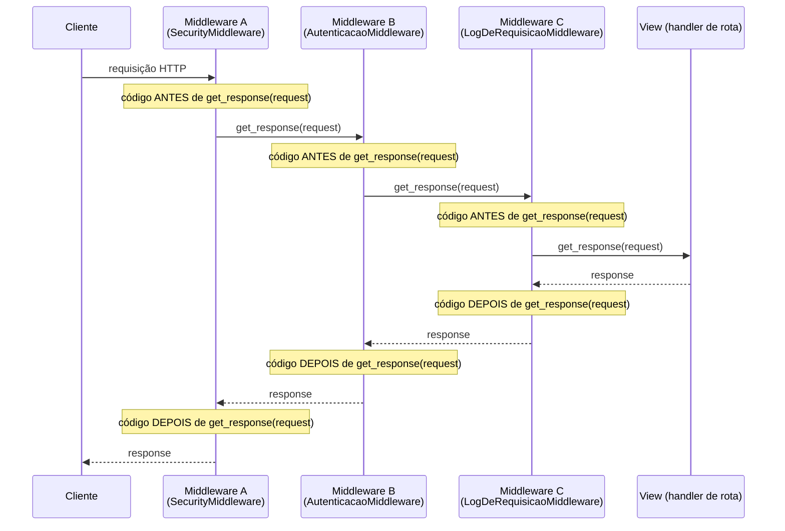

# Middleware e o ciclo de vida da requisição

> [!abstract] TL;DR
> Middleware é código que roda **em toda requisição**, antes e/ou depois do handler de rota — sem que cada rota precise chamá-lo explicitamente. Os três frameworks modelam isso de formas diferentes, com consequências reais de comportamento: **Django** organiza middleware numa **lista ordenada** (`MIDDLEWARE` em `settings.py`), processada como uma cebola — de fora para dentro na entrada da requisição, de dentro para fora na saída da resposta; a posição na lista importa e um middleware mal posicionado quebra silenciosamente. **Flask** oferece hooks mais simples — `@app.before_request` e `@app.after_request` — sem a estrutura de cebola completa: todos os `before_request` rodam antes de todos os `after_request`, não intercalados como no Django. **FastAPI** roda middleware sobre o protocolo **ASGI** (`scope`/`receive`/`send`, já coberto em [[03-Dominios/Tecnologia/Python/Programação Reativa e Assíncrona/05 - ASGI e o ecossistema de frameworks assíncronos|Galho 8, nota 05]]) via `@app.middleware("http")` ou `BaseHTTPMiddleware`, com a mesma semântica de cebola do Django, mas expressa como uma função com `call_next`. Nos três casos, a ordem de registro determina a ordem de execução — e o erro mais comum, que abre esta nota, é registrar um middleware de logging **depois** de um middleware de autenticação: quando a autenticação rejeita a requisição, o logging nunca roda, porque nunca chega a sua vez.

## O incidente que abre esta nota

Uma API em produção começa a receber picos de tráfego suspeito — tentativas de login com credenciais aleatórias, uma vez a cada poucos segundos, vindas do mesmo bloco de IPs. O time de segurança pede ao time de backend: "mostra o log de todas as tentativas de acesso, mesmo as rejeitadas, para eu conseguir montar um bloqueio por IP". O desenvolvedor responsável abre o painel de logs esperando encontrar uma linha para cada tentativa — e encontra silêncio. As requisições **chegam** ao servidor (o balanceador de carga confirma isso nas métricas de rede), mas nenhuma linha de log aparece para as tentativas rejeitadas. Só as tentativas que **passam** da autenticação — bem-sucedidas ou não — deixam rastro.

O código da API tem dois middlewares Django, registrados nesta ordem em `settings.py`:

```python
# settings.py
MIDDLEWARE = [
    "django.middleware.security.SecurityMiddleware",
    "django.contrib.sessions.middleware.SessionMiddleware",
    "core.middleware.AutenticacaoPorTokenMiddleware",  # rejeita requisição sem token válido
    "core.middleware.LogDeRequisicaoMiddleware",         # registra método, path, IP, status
    "django.middleware.common.CommonMiddleware",
]
```

O middleware de autenticação:

```python
# core/middleware.py
class AutenticacaoPorTokenMiddleware:
    def __init__(self, get_response):
        self.get_response = get_response

    def __call__(self, request):
        token = request.headers.get("Authorization")
        if not eh_token_valido(token):
            return JsonResponse({"detail": "Token inválido"}, status=401)  # RETORNA AQUI — não chama get_response
        return self.get_response(request)
```

E o middleware de logging, registrado **depois**:

```python
class LogDeRequisicaoMiddleware:
    def __init__(self, get_response):
        self.get_response = get_response

    def __call__(self, request):
        logger.info("Requisição recebida: %s %s de %s", request.method, request.path, request.META.get("REMOTE_ADDR"))
        return self.get_response(request)
```

> [!bug] O que está quebrado, em uma frase
> `AutenticacaoPorTokenMiddleware` vem **antes** de `LogDeRequisicaoMiddleware` na lista `MIDDLEWARE`, e a autenticação retorna uma resposta de erro sem chamar `self.get_response(request)` — o que significa que nenhum middleware posterior na cadeia é executado. O log de "requisição recebida" nunca roda para tentativas rejeitadas, exatamente as que o time de segurança mais precisa ver.

A correção parece trivial à primeira vista — trocar a ordem dos dois na lista — mas expõe o mecanismo real que esta nota desenvolve: entender **por que** a ordem importa exige entender que Django (e, com o mesmo modelo, FastAPI) processa middleware como uma cebola, não como uma lista de passos independentes que sempre rodam do início ao fim.

> [!warning] Um segundo bug clássico de ordem: compressão antes de quem define o corpo final
> O mesmo tipo de erro aparece de outra forma comum em produção: um middleware de compressão (`GZipMiddleware`) registrado **antes** de um middleware que ainda vai modificar o corpo da resposta (por exemplo, injetando um cabeçalho de correlação no corpo de erro, ou um middleware customizado que reformata o JSON de saída). Se a compressão já rodou sua parte de "saída" (comprimindo o corpo) antes do middleware seguinte alterar esse corpo, o resultado é um `Content-Length` que não bate com os bytes reais enviados — o cliente recebe uma resposta corrompida ou truncada, e o sintoma no navegador é genérico: "ERR_CONTENT_LENGTH_MISMATCH" ou similar, sem pista nenhuma de que a causa é ordem de middleware.

O resto desta nota resolve os dois tipos de bug — no Django, no Flask e no FastAPI — explicando o modelo de cebola, os casos de uso reais que dependem dele funcionar corretamente (logging, correlation ID, CORS), e fecha com uma tabela comparativa dos três modelos.

## Django: a lista `MIDDLEWARE` e a cebola de `get_response`

### A lista ordenada em `settings.py`

Todo projeto Django novo já vem com uma lista `MIDDLEWARE` populada por padrão:

```python
# settings.py
MIDDLEWARE = [
    "django.middleware.security.SecurityMiddleware",
    "django.contrib.sessions.middleware.SessionMiddleware",
    "django.middleware.common.CommonMiddleware",
    "django.middleware.csrf.CsrfViewMiddleware",
    "django.contrib.auth.middleware.AuthenticationMiddleware",
    "django.contrib.messages.middleware.MessageMiddleware",
    "django.middleware.clickjacking.XFrameOptionsMiddleware",
]
```

Cada item é um caminho de import para uma classe (ou função, no estilo moderno) que o Django instancia **uma vez**, na inicialização do processo — não a cada requisição. O que essa lista representa não é "sete etapas independentes que rodam em sequência e terminam" — é sete **camadas aninhadas**, cada uma envolvendo a próxima, com a view no centro.

### O estilo moderno: função com closure

Desde o Django 1.10, a forma recomendada de escrever um middleware é uma função de fábrica que recebe `get_response` e devolve outra função — o padrão de closure, mais direto que a versão baseada em classe com métodos `process_request`/`process_response` separados (ainda suportada, mas considerada estilo antigo):

```python
# core/middleware.py — estilo moderno (função com closure)
import time
import logging

logger = logging.getLogger("api")


def middleware_de_tempo(get_response):
    # ESTA PARTE roda uma vez, na inicialização do servidor —
    # é o lugar certo para configuração, não para lógica por requisição.
    logger.info("middleware_de_tempo inicializado")

    def middleware(request):
        # ESTA PARTE roda a cada requisição, ANTES da view (e antes de
        # qualquer middleware mais interno na cadeia)
        inicio = time.perf_counter()

        response = get_response(request)  # chama o próximo elo da cadeia

        # ESTA PARTE roda a cada requisição, DEPOIS da view (e depois de
        # qualquer middleware mais interno já ter processado a resposta)
        duracao_ms = (time.perf_counter() - inicio) * 1000
        response["X-Response-Time-Ms"] = f"{duracao_ms:.2f}"
        logger.info("%s %s — %sms", request.method, request.path, f"{duracao_ms:.2f}")

        return response

    return middleware
```

A linha `response = get_response(request)` é o coração do modelo: tudo **antes** dela roda no caminho de entrada da requisição; tudo **depois** dela roda no caminho de saída da resposta. `get_response` não é "a view" diretamente — é o **próximo middleware da cadeia**, e só o middleware mais interno de todos (mais próximo do fim da lista) efetivamente chama a view.

> [!question]- Por que não usar a versão baseada em classe com `process_request`/`process_response`?
> Ainda funciona (Django mantém compatibilidade), mas o estilo de classe separa "o que roda antes" (`process_request`) de "o que roda depois" (`process_response`) em dois métodos distintos, sem um jeito natural de compartilhar uma variável local entre os dois (como `inicio = time.perf_counter()` no exemplo acima) — geralmente é preciso guardar esse estado em `request` (`request._inicio = time.perf_counter()`), um acoplamento a mais. A função com closure resolve isso de graça: tudo entre a linha antes e a linha depois de `get_response(request)` roda dentro do mesmo escopo de função, com acesso natural às mesmas variáveis locais — é por isso que a documentação oficial do Django recomenda o estilo de função para middleware novo.

### A cebola: fora pra dentro, dentro pra fora

O nome "onion model" (modelo de cebola) descreve exatamente como a lista `MIDDLEWARE` é processada. Para uma lista `[A, B, C]`, a requisição atravessa `A → B → C → view`, e a resposta atravessa o caminho inverso `view → C → B → A`:



O primeiro item da lista (`A`, `SecurityMiddleware` no exemplo real) é a camada **mais externa** — a primeira a ver a requisição chegando e a última a ver a resposta saindo. O último item da lista é a camada **mais interna** — a mais próxima da view. Isso explica o incidente de abertura: `AutenticacaoPorTokenMiddleware`, registrado antes de `LogDeRequisicaoMiddleware`, é uma camada **mais externa** — quando ele decide não chamar `get_response(request)` (porque o token é inválido), a cadeia inteira para ali, e nenhuma camada mais interna, incluindo o middleware de logging, chega a rodar. A correção real do incidente é registrar o logging **antes** da autenticação na lista:

```python
MIDDLEWARE = [
    "django.middleware.security.SecurityMiddleware",
    "django.contrib.sessions.middleware.SessionMiddleware",
    "core.middleware.LogDeRequisicaoMiddleware",          # agora mais externo — sempre roda
    "core.middleware.AutenticacaoPorTokenMiddleware",      # pode rejeitar depois do log
    "django.middleware.common.CommonMiddleware",
]
```

> [!tip] "Mais externo" não é sinônimo de "mais importante" — é sinônimo de "sempre roda primeiro na entrada e sempre roda por último na saída"
> A posição na lista `MIDDLEWARE` é uma decisão de **garantia de execução**, não de prioridade abstrata. Um middleware que precisa rodar mesmo quando outro middleware decide rejeitar a requisição (como logging de segurança, rate limiting, CORS) precisa vir **antes** desse outro middleware na lista. Um middleware que depende de algo que outro middleware configura (como `AuthenticationMiddleware`, que espera que `SessionMiddleware` já tenha populado `request.session`) precisa vir **depois** daquele que fornece a dependência.

### Curto-circuito: quando um middleware não chama `get_response`

O exemplo de autenticação já mostrou o padrão: um middleware pode decidir devolver uma resposta **sem** chamar `get_response(request)` — isso é chamado de curto-circuito (*short-circuit*), e é o mecanismo intencional por trás de todo middleware de autenticação, rate limiting, ou bloqueio por IP:

```python
def middleware_de_rate_limit(get_response):
    contadores = {}  # em produção real: Redis, não memória do processo

    def middleware(request):
        ip = request.META.get("REMOTE_ADDR")
        contadores[ip] = contadores.get(ip, 0) + 1

        if contadores[ip] > 100:
            return JsonResponse({"detail": "Rate limit excedido"}, status=429)  # curto-circuito

        return get_response(request)  # segue a cadeia normalmente

    return middleware
```

> [!warning] Curto-circuito é intencional — mas é a mesma razão pela qual ordem de middleware quebra silenciosamente
> Não há nenhum erro, warning ou exceção quando um middleware decide não chamar `get_response(request)` — é um comportamento válido e comum. O problema nunca é o curto-circuito em si, é a **posição relativa** entre um middleware que pode curto-circuitar e um middleware que precisa rodar independente do resultado (como logging de auditoria). Não existe checagem automática do Django que avise "este middleware nunca vai rodar para requisições rejeitadas" — é uma responsabilidade de quem ordena a lista, revisada em code review, não garantida pelo framework.

## Flask: `before_request`/`after_request` — hooks, não cebola completa

Flask resolve o mesmo problema de forma mais simples, sem uma lista ordenada de camadas aninhadas — dois decorators, `@app.before_request` e `@app.after_request`, cada um registrando uma função que roda em todo request, antes ou depois do handler de rota:

```python
from flask import Flask, request, g
import time
import logging

app = Flask(__name__)
logger = logging.getLogger("api")


@app.before_request
def registrar_inicio():
    g.inicio = time.perf_counter()
    logger.info("Requisição recebida: %s %s", request.method, request.path)


@app.after_request
def registrar_tempo(response):
    duracao_ms = (time.perf_counter() - g.inicio) * 1000
    response.headers["X-Response-Time-Ms"] = f"{duracao_ms:.2f}"
    logger.info("Requisição concluída: %s %sms", request.path, f"{duracao_ms:.2f}")
    return response
```

`g` é o objeto de contexto por requisição do Flask — o jeito idiomático de passar dado de um `before_request` para um `after_request` sem variável global, já que os dois rodam em funções separadas (diferente do Django/FastAPI, onde `inicio` é uma variável local compartilhada dentro do mesmo escopo de função por causa da closure).

### A diferença estrutural: hooks agrupados, não intercalados

O ponto que distingue Flask do modelo de cebola completo: se múltiplos `@app.before_request` e `@app.after_request` forem registrados, **todos** os `before_request` rodam (na ordem de registro) antes de qualquer `after_request` rodar — não há intercalação camada-por-camada como no Django/FastAPI:

```python
@app.before_request
def before_1():
    logger.info("before_1")


@app.before_request
def before_2():
    logger.info("before_2")


@app.after_request
def after_1(response):
    logger.info("after_1")
    return response


@app.after_request
def after_2(response):
    logger.info("after_2")
    return response
```

A ordem real de execução para uma requisição bem-sucedida é `before_1 → before_2 → view → after_2 → after_1` — repare que os `after_request` rodam em ordem **inversa** de registro (o último registrado roda primeiro na saída, um resquício do modelo de cebola que sobrevive mesmo nesse formato mais simples), mas não há um "before_2 encaixado dentro de after_1" como haveria em middleware Django/FastAPI real. Não existe, no Flask, um jeito nativo de um `before_request` envolver a execução de outro `before_request` — os hooks são planos, agrupados por fase, não aninhados.

> [!question]- Se Flask não tem cebola completa, como ele lida com curto-circuito de rate limiting/autenticação?
> Um `@app.before_request` pode devolver uma resposta diretamente (em vez de `None`, o valor implícito de "segue para o próximo hook/view") — e quando isso acontece, o Flask pula direto para os `after_request`, sem rodar a view nem os `before_request` restantes:
> ```python
> @app.before_request
> def exigir_token():
>     if not eh_token_valido(request.headers.get("Authorization")):
>         return jsonify({"detail": "Token inválido"}), 401  # pula view e before_requests restantes
> ```
> O detalhe crítico que espelha o mesmo bug do Django: essa resposta de curto-circuito **ainda passa** por todos os `after_request` registrados (diferente do que se poderia supor) — então um `after_request` de logging sempre roda, mesmo quando um `before_request` anterior rejeitou a requisição. Isso é, na prática, um comportamento mais seguro por padrão que o Django nesse ponto específico — o log de auditoria não depende de estar registrado "antes" de nada, porque `after_request` sempre roda independente de qual `before_request` (se algum) causou o curto-circuito.

### `teardown_request`: a terceira fase, para limpeza garantida

Existe uma terceira fase que vale nomear por completude, ainda que não seja o foco central desta nota: `@app.teardown_request`, que roda **sempre**, mesmo quando uma exceção não tratada sobe do handler ou de um `before_request` — diferente de `after_request`, que não roda se uma exceção subir sem ser capturada:

```python
@app.teardown_request
def fechar_conexao_banco(erro=None):
    conexao = g.pop("conexao_db", None)
    if conexao is not None:
        conexao.close()
```

`teardown_request` é o lugar certo para liberar recursos (fechar conexão de banco aberta em `before_request`) que precisam ser limpos independente de a requisição ter sucedido ou falhado com exceção — um `after_request` não seria confiável para isso, porque simplesmente não roda no caminho de exceção não tratada.

## FastAPI: `@app.middleware("http")` e `BaseHTTPMiddleware` sobre ASGI

FastAPI é construído sobre Starlette, que por sua vez é uma aplicação ASGI válida — middleware em FastAPI, portanto, é sempre uma camada que envolve a chamada `app(scope, receive, send)` descrita em [[03-Dominios/Tecnologia/Python/Programação Reativa e Assíncrona/05 - ASGI e o ecossistema de frameworks assíncronos|Galho 8, nota 05]]. Esta nota não reexplica `scope`/`receive`/`send` — só nomeia que o middleware do FastAPI é, por baixo, uma função ASGI aninhada em cima de outra, exatamente o padrão de "app envolvendo app" que a nota de ASGI já descreveu para Starlette em geral.

### `@app.middleware("http")`: a forma mais direta

```python
import time
import logging
from fastapi import FastAPI, Request

app = FastAPI()
logger = logging.getLogger("api")


@app.middleware("http")
async def middleware_de_tempo(request: Request, call_next):
    inicio = time.perf_counter()

    response = await call_next(request)  # chama o próximo elo da cadeia (outro middleware, ou a rota)

    duracao_ms = (time.perf_counter() - inicio) * 1000
    response.headers["X-Response-Time-Ms"] = f"{duracao_ms:.2f}"
    logger.info("%s %s — %sms", request.method, request.url.path, f"{duracao_ms:.2f}")

    return response
```

O paralelo com Django é direto: `call_next` desempenha o mesmo papel que `get_response` — tudo antes de `await call_next(request)` roda no caminho de entrada, tudo depois roda no caminho de saída, e a mesma lógica de cebola se aplica quando múltiplos middlewares são registrados via `@app.middleware("http")` (o último registrado é o mais interno, mais próximo da rota — a ordem de registro no código, de cima para baixo, importa exatamente como a ordem na lista `MIDDLEWARE` do Django).

> [!warning] `@app.middleware("http")` está em processo de deprecação a favor de `BaseHTTPMiddleware`/ASGI puro
> A documentação oficial do FastAPI já sinaliza `@app.middleware("http")` como um atalho conveniente, mas recomenda `BaseHTTPMiddleware` (ou middleware ASGI puro, para casos avançados) como a forma mais robusta e alinhada ao ecossistema Starlette a longo prazo — o decorator ainda funciona, mas times que escrevem middleware novo hoje tendem a preferir a classe explícita.

### `BaseHTTPMiddleware`: a forma baseada em classe

```python
from starlette.middleware.base import BaseHTTPMiddleware
from starlette.requests import Request


class MiddlewareDeTempo(BaseHTTPMiddleware):
    async def dispatch(self, request: Request, call_next):
        inicio = time.perf_counter()
        response = await call_next(request)
        duracao_ms = (time.perf_counter() - inicio) * 1000
        response.headers["X-Response-Time-Ms"] = f"{duracao_ms:.2f}"
        return response


app.add_middleware(MiddlewareDeTempo)
```

A diferença de ergonomia frente ao decorator é pequena — o mecanismo (`call_next`, cebola, `dispatch` como o equivalente do `__call__`/`middleware` do Django) é o mesmo. A vantagem prática de `add_middleware` é registrar múltiplos middlewares de forma mais explícita, com parâmetros de configuração passados no próprio registro:

```python
app.add_middleware(MiddlewareDeAutenticacao, chave_secreta="...")
app.add_middleware(MiddlewareDeTempo)
```

> [!question]- `add_middleware` é chamado em qual ordem — a mesma que a lista `MIDDLEWARE` do Django?
> A ordem de chamadas de `add_middleware` é, na prática, **inversa** à ordem visual da lista `MIDDLEWARE` do Django em termos de "quem é mais externo": o **último** `add_middleware()` chamado se torna a camada mais **externa** (a primeira a ver a requisição), porque cada chamada envolve o que já foi registrado antes, de fora para dentro, na ordem de registro reversa. No exemplo acima, `MiddlewareDeTempo` (chamado por último) é mais externo que `MiddlewareDeAutenticacao` — o oposto do que a leitura ingênua de "primeiro registrado, primeiro executado" sugeriria. Esse é um detalhe genuinamente contraintuitivo e uma fonte real de bug de ordem em FastAPI — vale testar explicitamente (ou consultar a doc do Starlette) sempre que a ordem relativa entre dois middlewares importa para o comportamento, em vez de assumir por analogia com o Django.

### O curto-circuito e o mesmo bug do incidente de abertura, em FastAPI

```python
@app.middleware("http")
async def middleware_de_autenticacao(request: Request, call_next):
    token = request.headers.get("Authorization")
    if not eh_token_valido(token):
        return JSONResponse({"detail": "Token inválido"}, status_code=401)  # curto-circuito — não chama call_next
    return await call_next(request)


@app.middleware("http")
async def middleware_de_log(request: Request, call_next):
    logger.info("Requisição recebida: %s %s", request.method, request.url.path)
    return await call_next(request)
```

O mesmo raciocínio do Django se aplica: se `middleware_de_autenticacao` for registrado de forma que fique **mais externo** que `middleware_de_log` (lembrando a inversão de ordem explicada acima), o log de requisições rejeitadas nunca roda — é literalmente o mesmo bug do incidente de abertura, só que a causa raiz (ordem de `add_middleware`/`@app.middleware`) é ainda menos óbvia em FastAPI por causa da inversão de ordem.

### `BaseHTTPMiddleware` e o custo de streaming de resposta

Vale nomear um detalhe técnico real, sem se aprofundar: `BaseHTTPMiddleware` precisa materializar a resposta inteira para inspecionar/modificar `response.headers` ou o corpo antes de devolvê-la — isso tem um custo de performance mensurável em respostas grandes ou streaming (a resposta não flui direto do handler para o cliente, ela passa por um buffer intermediário). Para casos onde isso importa de verdade (streaming de arquivo grande, Server-Sent Events), a documentação do Starlette recomenda middleware ASGI puro (`async def __call__(self, scope, receive, send)`, o mesmo protocolo cru de [[03-Dominios/Tecnologia/Python/Programação Reativa e Assíncrona/05 - ASGI e o ecossistema de frameworks assíncronos|Galho 8, nota 05]]) em vez de `BaseHTTPMiddleware` — um caso concreto de quando vale descer um nível de abstração para o protocolo cru em vez de ficar na conveniência de `call_next`.

## Comparando os três modelos, lado a lado

```mermaid
flowchart TB
    classDef neutro fill:#1B2029,stroke:#4E5666,color:#C6CCD8
    subgraph Django["Django — lista MIDDLEWARE, cebola completa"]
        DA["Middleware A<br/>(entrada)"] --> DB["Middleware B<br/>(entrada)"] --> DV["View"] --> DB2["Middleware B<br/>(saída)"] --> DA2["Middleware A<br/>(saída)"]
    end

    subgraph Flask["Flask — hooks agrupados por fase"]
        FB1["before_request 1"] --> FB2["before_request 2"] --> FV["View"] --> FA2["after_request 2"] --> FA1["after_request 1"]
    end

    subgraph FastAPI["FastAPI — cebola sobre ASGI"]
        AA["Middleware A<br/>(entrada)"] --> AB["Middleware B<br/>(entrada)"] --> AV["Rota"] --> AB2["Middleware B<br/>(saída)"] --> AA2["Middleware A<br/>(saída)"]
    end

    class DV neutro
    class FV neutro
    class AV neutro
```



| Aspecto | Django | Flask | FastAPI |
|---|---|---|---|
| Onde se registra | Lista `MIDDLEWARE` em `settings.py` | `@app.before_request`/`@app.after_request` | `@app.middleware("http")` ou `app.add_middleware(BaseHTTPMiddleware)` |
| Modelo estrutural | Cebola completa — cada camada envolve a próxima | Hooks agrupados por fase — todos os `before` antes de todos os `after`, sem aninhamento entre eles | Cebola completa, sobre ASGI — mesmo modelo do Django, mecanismo `call_next` |
| Compartilhar estado entrada→saída | Variável local na mesma função (closure) | Objeto `g` (contexto por requisição) | Variável local na mesma função (closure) |
| Curto-circuito | Não chamar `get_response(request)` | `before_request` retorna um valor (não `None`) | Não chamar `await call_next(request)` |
| `after`/saída roda mesmo se curto-circuitado antes? | Não — camadas mais internas não rodam | Sim — `after_request` sempre roda | Não — camadas mais internas não rodam |
| Limpeza garantida mesmo com exceção não tratada | Não é o papel do middleware; usa `try/finally` no próprio middleware se necessário | `@app.teardown_request` — dedicado a isso | Não é o papel do middleware `http`; ASGI puro/`lifespan` cobre isso em nível de app |
| Ordem de registro → ordem de execução (entrada) | Topo da lista = mais externo | Ordem de registro = ordem de execução dos `before_request` | Último `add_middleware`/`@app.middleware` = mais externo (invertido!) |
| Protocolo por baixo | WSGI (ou ASGI, desde a 3.0) | WSGI | ASGI nativo — sempre |
| Custo de streaming | Não aplicável da mesma forma (modelo síncrono) | Não aplicável da mesma forma | `BaseHTTPMiddleware` buffuriza a resposta; ASGI puro evita isso |

> [!tip] O mecanismo é o mesmo em espírito nos três — o que muda é a rigidez do aninhamento
> Django e FastAPI compartilham o mesmo modelo conceitual de cebola (uma camada envolve a próxima, `get_response`/`call_next` é o ponto de transição entrada→saída). Flask simplifica deliberadamente esse modelo para dois grupos de hooks — o suficiente para a maioria dos casos de uso reais (logging, cabeçalho de tempo, CORS básico), com a garantia extra de que `after_request` sempre roda independente de curto-circuito, algo que exige atenção manual de ordem no Django/FastAPI.

## Casos de uso reais

### Logging de requisição e tempo de resposta

Já demonstrado nos três frameworks acima — o padrão universal é: capturar um timestamp de início antes de `get_response`/`call_next`/a view rodar, e calcular a duração depois, anexando um header (`X-Response-Time-Ms`, por exemplo) e/ou uma linha de log estruturado. Esse é o caso de uso que mais expõe bug de ordem, porque logging de auditoria/segurança precisa rodar independente de outro middleware ter rejeitado a requisição — exatamente o incidente de abertura desta nota.

### CORS

Cross-Origin Resource Sharing — a política de header (`Access-Control-Allow-Origin` e afins) que controla se um navegador permite que JavaScript de um domínio chame uma API hospedada em outro domínio — é, nos três frameworks, implementado como middleware: `django-cors-headers` (`corsheaders.middleware.CorsMiddleware`, que precisa vir bem cedo na lista `MIDDLEWARE`, antes de `CommonMiddleware`), `flask-cors` (`CORS(app)`, que se registra como um `after_request` internamente), e `starlette.middleware.cors.CORSMiddleware` (`app.add_middleware(CORSMiddleware, allow_origins=[...])`) no FastAPI. Esta nota não desenvolve a especificação CORS em si (o vocabulário de *preflight request*, header por header) — só nomeia que ela se encaixa exatamente no mesmo mecanismo de middleware descrito aqui, e que a posição na cadeia importa da mesma forma: um middleware CORS precisa ver **toda** requisição, incluindo as rejeitadas por autenticação, porque o navegador precisa do header CORS mesmo numa resposta de erro para não bloquear a leitura do corpo pelo JavaScript do cliente.

### Correlation ID / request ID para tracing

Um padrão comum em sistemas distribuídos: gerar (ou propagar, se já vier de um serviço upstream) um identificador único por requisição, anexá-lo a todo log emitido durante o processamento dessa requisição, e devolvê-lo num header de resposta — para que, quando algo dá errado, seja possível filtrar todos os logs relacionados a uma única requisição específica, mesmo que ela tenha atravessado múltiplos serviços.

```python
# FastAPI — exemplo de correlation ID como middleware
import uuid
from contextvars import ContextVar

correlation_id_var: ContextVar[str] = ContextVar("correlation_id", default="")


@app.middleware("http")
async def middleware_de_correlation_id(request: Request, call_next):
    correlation_id = request.headers.get("X-Correlation-ID", str(uuid.uuid4()))
    correlation_id_var.set(correlation_id)

    response = await call_next(request)

    response.headers["X-Correlation-ID"] = correlation_id
    return response
```

`ContextVar` (não uma variável global comum) é o mecanismo correto aqui num ambiente assíncrono: cada requisição concorrente tem seu próprio valor isolado de `correlation_id_var`, sem risco de uma requisição vazar o ID de outra que está sendo processada ao mesmo tempo no mesmo processo — o mesmo tipo de cuidado de isolamento por tarefa que a trilha de concorrência já tratou para outros contextos assíncronos. Um `logging.Filter` customizado, configurado no logger da aplicação, lê `correlation_id_var.get()` e injeta o valor em toda linha de log emitida durante aquele request, sem precisar passar o ID manualmente por cada função da pilha de chamadas.

> [!question]- Correlation ID é a mesma coisa que autenticação/rastreamento de usuário?
> Não — correlation ID identifica **uma requisição específica**, não uma pessoa ou sessão; um usuário autenticado faz múltiplas requisições, cada uma com seu próprio correlation ID novo (a menos que o cliente propague explicitamente um ID existente, útil quando um frontend quer amarrar várias chamadas de API relacionadas ao mesmo fluxo de UI). É uma ferramenta de observabilidade operacional, não de identidade — o mecanismo de autenticação em si (JWT, sessão, API key) é assunto do [[03-Dominios/Tecnologia/Python/Segurança/index|Galho 11]], não desenvolvido aqui.

## Middleware e exception handlers: onde a fronteira fica

A [[06 - Tratamento de erros e respostas HTTP padronizadas|nota 06 deste galho]] já cobriu em profundidade `@app.exception_handler` (FastAPI), `EXCEPTION_HANDLER` (DRF) e `@app.errorhandler` (Flask) — o mecanismo central de traduzir uma exceção Python numa resposta HTTP estruturada. Vale nomear, sem repetir esse conteúdo, como as duas peças se relacionam: um exception handler roda **fora** da cadeia normal de middleware quando uma exceção sobe sem ser capturada dentro de um middleware — ou seja, se um middleware do meio da cebola deixa uma exceção subir, os middlewares mais externos que ainda não tiveram sua parte de "saída" executada **não** rodam normalmente (a exceção interrompe a cebola), e é o exception handler — não outro middleware — quem intercepta essa exceção e produz a resposta final. Em FastAPI/Starlette especificamente, existe até um middleware interno (`ExceptionMiddleware`) que faz parte da implementação desse mecanismo — mas essa é uma peça de implementação interna do framework, não algo que a aplicação registra manualmente; do ponto de vista de quem escreve a aplicação, exception handler e middleware continuam sendo dois mecanismos distintos, registrados de formas diferentes, para dois problemas diferentes: middleware processa toda requisição/resposta; exception handler traduz uma falha específica.

## Armadilhas comuns

> [!warning] Middleware de logging/auditoria posicionado depois de um middleware que pode curto-circuitar
> **O que acontece:** um middleware de logging, rate-limit tracking, ou auditoria de segurança é registrado numa posição da cadeia (lista `MIDDLEWARE` no Django, ordem de `add_middleware`/`@app.middleware` no FastAPI) mais interna que um middleware de autenticação/autorização que pode rejeitar a requisição sem seguir adiante. **Por quê:** quando o middleware mais externo curto-circuita (não chama `get_response`/`call_next`), nenhuma camada mais interna executa — é exatamente o bug do incidente de abertura desta nota. **Como evitar:** middleware que precisa observar **toda** requisição, mesmo as rejeitadas — logging, correlation ID, CORS — deve ficar posicionado como a camada mais externa possível (topo da lista `MIDDLEWARE` no Django; último `add_middleware`/primeiro `@app.middleware` a considerar a inversão de ordem no FastAPI).

> [!warning] Assumir que a ordem de `add_middleware`/`@app.middleware` no FastAPI segue a mesma leitura visual da lista `MIDDLEWARE` do Django
> **O que acontece:** um desenvolvedor com experiência prévia em Django assume, por analogia, que o primeiro `add_middleware()` chamado no código FastAPI é o mais externo — igual ao topo da lista `MIDDLEWARE` — e ordena o código nessa premissa. **Por quê:** a ordem real é invertida: o **último** `add_middleware()` chamado é quem se torna mais externo, porque cada chamada envolve o middleware já registrado, de fora para dentro, na ordem inversa de registro. **Como evitar:** testar explicitamente a ordem real (um teste simples com dois middlewares de log, cada um marcando entrada/saída, revela a ordem verdadeira) em vez de assumir por analogia com outro framework — ou consultar a documentação do Starlette antes de depender de ordem relativa entre dois middlewares.

> [!warning] Middleware bloqueante (síncrono) dentro de um handler `async def` em FastAPI
> **O que acontece:** um middleware FastAPI faz uma chamada de I/O bloqueante (biblioteca HTTP síncrona, leitura de arquivo sem `aiofiles`) dentro de `async def middleware(request, call_next)`, sem usar `await` numa versão assíncrona da chamada. **Por quê:** como já explicado em [[03-Dominios/Tecnologia/Python/Programação Reativa e Assíncrona/05 - ASGI e o ecossistema de frameworks assíncronos|Galho 8, nota 05]], um servidor ASGI roda um único event loop por worker atendendo múltiplas requisições concorrentes — código bloqueante dentro de **qualquer** middleware (que roda em **toda** requisição, ao contrário de um handler de rota específico) trava o loop inteiro, amplificando o impacto porque afeta 100% do tráfego, não só as rotas que usam aquele middleware. **Como evitar:** o mesmo cuidado geral de asyncio — usar bibliotecas assíncronas nativas de I/O, ou `asyncio.to_thread`/`run_in_threadpool` para código que não tem alternativa assíncrona — aplicado com atenção redobrada em middleware, exatamente por ele rodar em toda requisição.

> [!warning] Ordem de compressão vs. modificação de corpo/headers de tamanho
> **O que acontece:** um middleware de compressão (`GZipMiddleware` no FastAPI, `GZipMiddleware`/`django.middleware.gzip.GZipMiddleware` no Django) posicionado numa camada mais externa que um middleware que ainda altera o corpo da resposta. **Por quê:** compressão precisa ser a **última** transformação de saída aplicada ao corpo — se ela roda numa camada mais externa (ou seja, "antes", no caminho de saída, no sentido de que sua parte de saída executa antes da parte de saída de um middleware mais interno já ter terminado de modificar o corpo), o corpo comprimido não reflete o corpo final real, e o `Content-Length`/`Content-Encoding` ficam inconsistentes com os bytes efetivamente enviados. **Como evitar:** middleware de compressão deve ser a camada mais **interna** possível no caminho de saída (ou seja, registrado numa posição em que sua parte de "depois" seja a última a rodar) — na prática, isso normalmente significa registrá-lo cedo na lista `MIDDLEWARE`/entre os primeiros `add_middleware`, já que middleware mais "externo" na entrada processa a saída por último, o que é exatamente o comportamento desejado para compressão.

## Em entrevista

- **"Explique como middleware funciona em Django ou FastAPI, e por que a ordem importa."** Middleware é organizado como camadas aninhadas — um modelo de cebola: cada middleware recebe a requisição, pode processá-la, chama o próximo middleware da cadeia (`get_response`/`call_next`), recebe a resposta de volta, e pode processá-la antes de devolvê-la à camada anterior. A ordem de registro determina quem é mais externo (processa a requisição primeiro, a resposta por último) e quem é mais interno (mais perto da view/rota) — um middleware pode decidir não chamar o próximo da cadeia (curto-circuito), e nesse caso nenhuma camada mais interna executa, o que é o motivo pelo qual middleware de logging/auditoria precisa ficar posicionado antes de qualquer middleware que possa rejeitar a requisição.
- **"Qual a diferença entre middleware Django/FastAPI e os hooks do Flask?"** Django e FastAPI implementam o modelo de cebola completo — cada camada aninha a próxima, com um ponto único de transição entrada→saída (`get_response`/`call_next`). Flask simplifica para dois grupos de hooks — `before_request` e `after_request` — sem aninhamento entre eles: todos os `before_request` rodam antes de qualquer `after_request`, na ordem de registro, mas não intercalados camada a camada.
- **"Como o middleware do FastAPI se relaciona com ASGI?"** Toda aplicação FastAPI é, por baixo, uma aplicação ASGI válida (herda de Starlette), então middleware FastAPI é uma camada que envolve a chamada `app(scope, receive, send)` — `@app.middleware("http")` e `BaseHTTPMiddleware` são conveniências que abstraem esse protocolo cru via `call_next`; para casos que exigem controle fino sobre streaming ou performance máxima, é possível escrever middleware ASGI puro, operando diretamente sobre `scope`/`receive`/`send`.
- **"Dê um exemplo real de bug causado por ordem de middleware."** Um middleware de autenticação que rejeita requisições sem token válido, posicionado antes (mais externo que) um middleware de logging de auditoria — quando a autenticação curto-circuita, o log de "requisição recebida" nunca roda para tentativas rejeitadas, exatamente as que uma investigação de segurança mais precisaria ver. A correção é reposicionar o logging como camada mais externa, garantindo que ele veja toda requisição independente do resultado das camadas mais internas.

> [!question]- E se o entrevistador perguntar sobre CORS em middleware — até onde vale entrar em detalhe?
> Vale nomear que CORS é implementado como middleware nos três frameworks (`django-cors-headers`, `flask-cors`, `CORSMiddleware` do Starlette/FastAPI) e que a posição na cadeia importa pela mesma razão de sempre — um middleware CORS precisa processar toda requisição, incluindo as rejeitadas por autenticação, porque o navegador precisa do header `Access-Control-Allow-Origin` mesmo numa resposta de erro para não bloquear a leitura do corpo pelo JavaScript do cliente. Detalhar a especificação CORS em si — o vocabulário de *preflight request*, `Access-Control-Allow-Methods`, `Access-Control-Allow-Credentials` — foge do escopo desta nota; a resposta madura nomeia que existe essa camada, aponta o mecanismo de middleware que a implementa, e reconhece que a especificação em si é um tópico separado.

## How to explain in English

> Middleware is code that runs on every request, without each route having to call it explicitly. Django and FastAPI both model it as nested layers — an onion model — where each middleware receives the request, optionally does something with it, calls the next layer in the chain (`get_response` in Django, `call_next` in FastAPI), gets the response back, and can process it before handing it back up. Registration order determines who's outermost — first to see the request, last to see the response — and any middleware can short-circuit by simply not calling the next layer, which means nothing further inward runs. That's exactly the bug that opens this note: an authentication middleware registered before a logging middleware means rejected requests never get logged, because the chain never reaches the logger. Flask simplifies this to two flat groups of hooks — `before_request` and `after_request` — without the layer-by-layer nesting: every `before_request` runs before any `after_request`, in registration order, but they don't wrap each other. FastAPI's middleware sits directly on top of the ASGI protocol — `scope`/`receive`/`send` — since every FastAPI app is, underneath, a valid ASGI application built on Starlette; `@app.middleware("http")` and `BaseHTTPMiddleware` are conveniences over that raw protocol, and for cases needing fine control over streaming, raw ASGI middleware is the escape hatch.

| PT-BR | English |
|---|---|
| middleware | middleware |
| cebola / modelo de cebola | onion model |
| curto-circuito | short-circuit |
| cadeia de middleware | middleware chain |
| camada mais externa/interna | outermost/innermost layer |
| ordem de registro | registration order |
| correlation ID / request ID | correlation ID / request ID |
| variável de contexto | context variable |
| rede de tracing distribuído | distributed tracing |

## O que vem a seguir

Esta nota fechou o ciclo de vida da requisição no nível de camada transversal — como middleware se encaixa antes e depois do handler de rota nos três frameworks, e como a ordem de registro determina comportamento real, não só estilo de código. Combinado com a [[06 - Tratamento de erros e respostas HTTP padronizadas|nota 06]] (o que acontece quando uma exceção sobe sem ser capturada) e a base ASGI de [[03-Dominios/Tecnologia/Python/Programação Reativa e Assíncrona/05 - ASGI e o ecossistema de frameworks assíncronos|Galho 8, nota 05]] (o protocolo por baixo do middleware do FastAPI), o galho tem agora as três peças que atravessam toda requisição de uma API real: roteamento, validação/erro, e middleware.

- [[08 - Documentação automática com OpenAPI|08 — Documentação automática com OpenAPI]] — como o FastAPI gera Swagger/ReDoc a partir dos mesmos type hints já vistos neste galho; middleware não altera o schema OpenAPI gerado, mas cabeçalhos adicionados por middleware (como `X-Correlation-ID`) não aparecem documentados automaticamente, uma limitação que vale nomear ao chegar lá.
- [[09 - Capstone — uma API REST completa de ponta a ponta|09 — Capstone]] — aplica middleware de logging e correlation ID de ponta a ponta na API construída ao longo do galho.
- [[03-Dominios/Tecnologia/Python/Segurança/index|Segurança]] — Galho 11; autenticação/autorização como middleware em profundidade (JWT, sessão, API key), não desenvolvida aqui além do mecanismo genérico de curto-circuito.

## Fontes

- Django Software Foundation. *Middleware*. docs.djangoproject.com, versão estável (5.x). https://docs.djangoproject.com/en/stable/topics/http/middleware/ (acessado em 2026-07-11) — lista `MIDDLEWARE`, estilo de função com closure, `process_request`/`process_response` legado, ordem de execução.
- FastAPI. *Middleware*. fastapi.tiangolo.com. https://fastapi.tiangolo.com/tutorial/middleware/ (acessado em 2026-07-11) — `@app.middleware("http")`, `call_next`, relação com Starlette.
- Encode. *Starlette — Middleware*. www.starlette.io. https://www.starlette.io/middleware/ (acessado em 2026-07-11) — `BaseHTTPMiddleware`, `add_middleware`, ordem real de aninhamento, `CORSMiddleware`, `GZipMiddleware`, custo de streaming.
- Flask (Pallets Projects). *The Request Context* / *Flask API — before_request, after_request, teardown_request*. flask.palletsprojects.com. https://flask.palletsprojects.com/en/latest/api/#flask.Flask.before_request (acessado em 2026-07-11) — hooks de ciclo de vida, objeto `g`, `teardown_request`.
- Real Python. *Flask by Example — Request Hooks* / *Django Middleware*. realpython.com. https://realpython.com/ (acessado em 2026-07-11) — exemplos práticos de hooks Flask e middleware Django em cenários reais.
- Django Software Foundation. *django-cors-headers*. github.com/adamchainz/django-cors-headers. https://github.com/adamchainz/django-cors-headers (acessado em 2026-07-11) — CORS como middleware Django, posicionamento recomendado na lista `MIDDLEWARE`.
- [[06 - Tratamento de erros e respostas HTTP padronizadas|06 — Tratamento de erros e respostas HTTP padronizadas]] — nota irmã deste galho, mecanismo de exception handler referenciado e não repetido aqui.
- [[03-Dominios/Tecnologia/Python/Programação Reativa e Assíncrona/05 - ASGI e o ecossistema de frameworks assíncronos|05 — ASGI e o ecossistema de frameworks assíncronos]] — nota irmã (Galho 8), base do protocolo `scope`/`receive`/`send` referenciado aqui, não repetida nesta nota.

Consultado em 2026-07-11.
