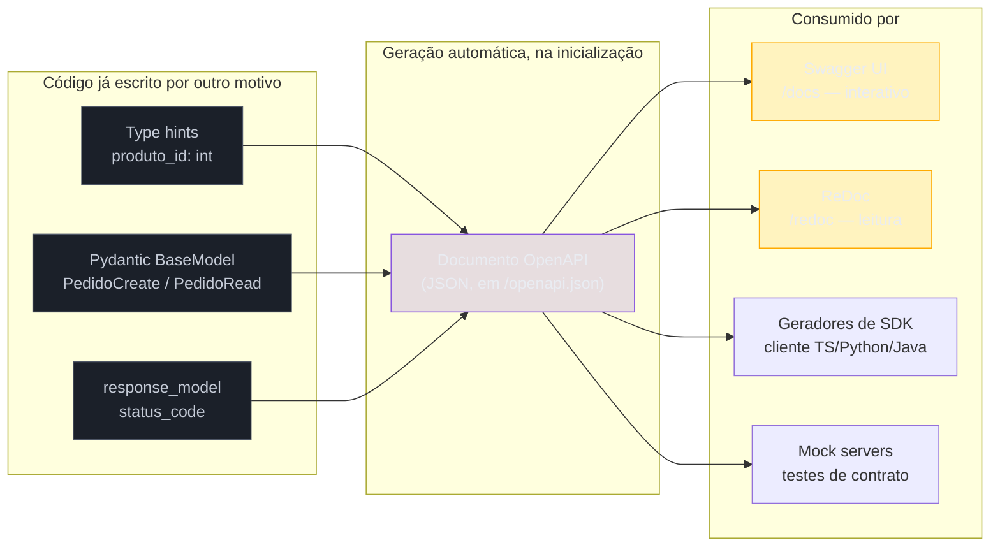

# Documentação automática com OpenAPI

> [!abstract] TL;DR
> Toda API precisa de documentação — o contrato de quais endpoints existem, que formato de dado eles esperam e devolvem — mas a forma clássica de produzir essa documentação (escrever à mão, num wiki ou num arquivo separado) tem um defeito estrutural: ninguém lembra de atualizá-la quando o código muda, e uma doc desatualizada é pior que nenhuma doc, porque **mente com confiança**. **FastAPI** resolve isso na raiz: como o [[03 - Validação e serialização com Pydantic|corpo da requisição já é um `BaseModel` do Pydantic]], o próprio framework gera a especificação [OpenAPI](https://swagger.io/specification/) automaticamente a partir dos type hints que o código já tem por boa prática — sem escrever uma linha de documentação manual, e sem chance de a doc dessincronizar do código, porque **são a mesma fonte**. O resultado é servido em `/docs` (Swagger UI, interativo) e `/redoc` (ReDoc, leitura). **Django REST Framework** não tem esse superpoder embutido — `drf-spectacular`, o padrão atual do ecossistema (sucessor do `drf-yasg`), gera a spec inspecionando o `Serializer`, mas frequentemente precisa de anotação manual via `@extend_schema` porque o DRF não tem tipagem forte o bastante para inferir tudo sozinho. **Flask** não tem suporte nativo nenhum — `flasgger`, `apispec` ou `flask-smorest` cobrem a lacuna, com ainda mais trabalho manual. A spec OpenAPI em si — um JSON/YAML descrevendo endpoints, schemas e parâmetros — não é só para humanos lerem: é um **contrato consumível por ferramentas** (geração de client SDK, testes de contrato, mock servers). "Documentação de graça, sempre sincronizada com o código" é um dos argumentos mais fortes a favor do FastAPI em qualquer conversa de arquitetura ou entrevista.

## O dia perdido que abre esta nota

Uma desenvolvedora frontend está integrando um app React com uma API Flask que o time de backend construiu há oito meses. Não existe Swagger, não existe Postman collection compartilhada, não existe um `README` de endpoints atualizado — só um canal do Slack com uma mensagem de seis meses atrás, fixada, dizendo "docs da API: perguntem pro Carlos". Carlos está de férias.

Ela abre o código-fonte do backend para adivinhar o contrato:

```python
# app.py — Flask, sem nenhuma documentação
@app.route("/pedidos", methods=["POST"])
def criar_pedido():
    dados = request.get_json()
    cliente_id = dados.get("cliente_id")
    itens = dados.get("itens", [])
    # ... 40 linhas de lógica de negócio misturadas com parsing de request ...
```

`request.get_json()` não diz, em lugar nenhum, quais campos `dados` deveria ter. `itens` é uma lista de quê — dicionários com `produto_id`/`quantidade`? Strings? A única forma de descobrir é ler as próximas quarenta linhas de lógica de negócio e reconstruir, por engenharia reversa, o formato esperado a partir de como cada campo é acessado (`dados.get("itens", [])[0]["produto_id"]`, três telas de código depois). Ela gasta o dia inteiro nesse processo, manda três requisições erradas por tentativa e erro, e só descobre que `quantidade` precisa ser um inteiro positivo porque o servidor devolve um `500` genérico com um traceback truncado no corpo — o tipo exato de vazamento que a [[06 - Tratamento de erros e respostas HTTP padronizadas|nota 06 deste galho]] já tratou como falha de segurança, não só de UX.

> [!bug] O que está quebrado, em uma frase
> Não existe nenhuma fonte de verdade sobre o contrato da API — o código é a única documentação, e ler código de lógica de negócio para reconstruir um schema de request é um trabalho lento, propenso a erro, e que qualquer pessoa nova no time (ou qualquer integração externa) paga de novo, do zero, a cada vez.

Esse cenário — "sem documentação nenhuma" — é o mais óbvio dos dois problemas que esta nota resolve, mas não é o único, nem o mais perigoso. Numa API vizinha, escrita em Django com uma doc Swagger mantida manualmente (um arquivo YAML editado à mão, atualizado "quando alguém lembra"), outro desenvolvedor bate numa armadilha pior: a documentação **existe**, está bonita, tem exemplos — e está errada. Um campo `desconto_percentual` foi renomeado para `desconto_percentual_bps` (basis points, não mais percentual) num refactor de três sprints atrás, e ninguém atualizou o YAML. O desenvolvedor confia na doc, manda `desconto_percentual: 10` esperando 10%, e o servidor aceita silenciosamente — porque o campo `desconto_percentual_bps` não bate com nada, e o parser ignora chaves desconhecidas por padrão. O pedido é criado com desconto zero, sem erro nenhum, e ninguém percebe até o cliente reclamar de um valor de fatura errado dias depois.

> [!warning] Documentação desatualizada é pior que documentação inexistente
> Sem documentação, todo mundo sabe que precisa investigar o código-fonte ou perguntar a alguém — a incerteza é visível e todo mundo se comporta com cautela extra. Com documentação **errada**, a confiança é falsa: o consumidor da API confia no que está escrito, não valida contra o comportamento real, e o erro só aparece tarde, silenciosamente, às vezes só em produção, com dado real de cliente envolvido. Documentação escrita e mantida manualmente tem esse risco estrutural embutido — ela é uma cópia da verdade, feita por um humano, num momento específico no tempo, e nada garante que continue em sincronia depois que o código muda. É exatamente esse risco que a geração **automática** de spec, a partir do próprio código, elimina: não existem duas fontes de verdade para dessincronizar, porque a doc **é** derivada do código a cada requisição.

## O que é, de fato, a especificação OpenAPI

Antes de comparar como cada framework gera (ou não gera) documentação, vale nomear o que está sendo gerado. [OpenAPI](https://swagger.io/specification/) (herdeira direta do formato Swagger, que deu nome ao projeto original antes de a especificação ser doada à Linux Foundation) é um formato-padrão, em JSON ou YAML, para descrever uma API HTTP de forma legível tanto por humanos quanto por máquina: quais endpoints existem, que métodos HTTP cada um aceita, que parâmetros de path/query espera, qual é o schema do corpo da requisição, quais respostas são possíveis (com seus status codes e schemas), e que tipos de autenticação a API exige.

```json
{
  "openapi": "3.1.0",
  "info": { "title": "API de Pedidos", "version": "1.0.0" },
  "paths": {
    "/pedidos": {
      "post": {
        "summary": "Cria um novo pedido",
        "requestBody": {
          "content": {
            "application/json": {
              "schema": { "$ref": "#/components/schemas/PedidoCreate" }
            }
          }
        },
        "responses": {
          "201": {
            "description": "Pedido criado com sucesso",
            "content": {
              "application/json": {
                "schema": { "$ref": "#/components/schemas/PedidoRead" }
              }
            }
          },
          "422": { "description": "Erro de validação" }
        }
      }
    }
  },
  "components": {
    "schemas": {
      "PedidoCreate": {
        "type": "object",
        "properties": {
          "cliente_id": { "type": "integer" },
          "itens": { "type": "array", "items": { "$ref": "#/components/schemas/ItemPedido" } }
        },
        "required": ["cliente_id", "itens"]
      }
    }
  }
}
```

Esse JSON não é feito para ser lido cru por um humano no dia a dia — é o **dado de entrada** que ferramentas consomem para produzir algo útil. Swagger UI e ReDoc são exatamente isso: ferramentas que leem um documento OpenAPI e renderizam uma interface HTML navegável, com formulários interativos (Swagger UI permite disparar requisições reais direto da página) ou uma leitura em três colunas mais adequada para referência (ReDoc). Mas o mesmo JSON também alimenta outras ferramentas que não têm nada a ver com renderizar uma página:

- **Geração de client SDK** — ferramentas como o `openapi-generator` (projeto open source mantido pela comunidade) leem a spec e geram, automaticamente, um cliente TypeScript, Python, Java ou Go tipado, sem que ninguém escreva esse client à mão nem precise mantê-lo sincronizado manualmente com a API.
- **Testes de contrato** — ferramentas de *contract testing* (como o Schemathesis, que gera casos de teste automaticamente a partir da própria spec) usam a spec como fonte de verdade para validar que a API real se comporta como o documento descreve, pegando divergências antes que um consumidor externo pegue.
- **Mock servers** — ferramentas como o Prism (da Stoplight) sobem um servidor fake que responde de acordo com a spec, permitindo que um time de frontend desenvolva contra um "backend" simulado antes mesmo do backend real estar pronto.

> [!question]- Se a spec é só um JSON, por que não escrever esse JSON à mão desde o início?
> Tecnicamente possível — é exatamente o que times fazem em ferramentas *API-first* como o Stoplight Studio, desenhando a spec antes do código. Mas escrever a spec à mão reintroduz o mesmo problema estrutural do incidente de abertura: agora existem **duas** fontes de verdade (a spec escrita à mão e o código que efetivamente roda), e nada garante sincronia entre elas — exceto disciplina humana, que é precisamente o que falhou nos dois cenários desta nota. A proposta central do FastAPI é inverter essa ordem: o código (type hints + Pydantic) é a única fonte de verdade, e a spec é **derivada** dele, automaticamente, a cada inicialização do processo — eliminando a possibilidade estrutural de dessincronia, não só mitigando o risco dela.

Esta nota não desenvolve o formato OpenAPI em profundidade (não há necessidade de decorar a gramática do JSON) — o que importa é entender que ele existe como um contrato formal, e que a diferença central entre os três frameworks deste galho é **como** (e com quanto esforço humano) esse contrato é produzido.

## FastAPI: a spec nasce dos type hints, sem escrever nada

O FastAPI gera a especificação OpenAPI automaticamente, a partir da mesma informação que o [[03 - Validação e serialização com Pydantic|nota 03 deste galho]] já cobriu em profundidade: os type hints de path/query parameters, os `BaseModel`s usados como corpo de requisição, e o `response_model` declarado em cada rota. Nenhuma dessas peças foi escrita **para** a documentação — todas já existiam por outro motivo (validar entrada, filtrar saída) e a documentação é um subproduto gratuito.

```python
from fastapi import FastAPI
from pydantic import BaseModel, Field

app = FastAPI(title="API de Pedidos", version="1.0.0")


class ItemPedido(BaseModel):
    produto_id: int
    quantidade: int = Field(gt=0)


class PedidoCreate(BaseModel):
    cliente_id: int
    itens: list[ItemPedido]


class PedidoRead(BaseModel):
    id: int
    cliente_id: int
    total_centavos: int


@app.post("/pedidos", response_model=PedidoRead, status_code=201)
def criar_pedido(pedido: PedidoCreate):
    return {"id": 1, "cliente_id": pedido.cliente_id, "total_centavos": 15990}
```

Rodar este arquivo já sobe, sem configuração adicional, dois endpoints de documentação:

- `GET /docs` — **Swagger UI**, interativo: cada rota aparece expansível, com o schema de request/response, e um botão "Try it out" que dispara uma requisição real contra o servidor rodando, direto do navegador.
- `GET /redoc` — **ReDoc**, uma leitura em três colunas (navegação, descrição, exemplo de payload), mais adequada como referência estática do que como ferramenta de teste manual.
- `GET /openapi.json` — o próprio documento OpenAPI cru, em JSON, que Swagger UI e ReDoc consomem, e que qualquer ferramenta externa (geradores de SDK, testes de contrato) também pode consumir.



O ponto que separa esse mecanismo de "só gerar uma página bonita" é que ele fecha exatamente o incidente de abertura desta nota: como a spec vem do próprio código que roda, é **estruturalmente impossível** que a documentação afirme algo diferente do que o servidor de fato faz — não porque alguém foi disciplinado o suficiente para lembrar de atualizar um arquivo separado, mas porque não existe arquivo separado. Mudar `PedidoCreate` muda a validação **e** a documentação, no mesmo commit, pela mesma linha de código.

> [!tip] `/docs` e `/redoc` funcionam sem escrever uma linha a mais — mas dá para desabilitar
> Em produção, é comum optar por não expor Swagger UI/ReDoc publicamente (`app = FastAPI(docs_url=None, redoc_url=None)`), principalmente para APIs internas ou quando a organização prefere não revelar a superfície completa de endpoints a qualquer visitante não autenticado. Isso não desliga a geração da spec em si — só os endpoints que a servem como HTML; `/openapi.json` (também desligável) continua disponível para ferramentas internas que precisem dele, se a rota não for removida por completo.

### Customizando a spec sem sair dos type hints

O FastAPI gera uma documentação funcional só com type hints, mas praticamente todo projeto real quer melhorar a legibilidade humana da spec — resumos, descrições, agrupamento por tag. Isso é feito com parâmetros adicionais no próprio decorator de rota, sem sair do fluxo natural de escrever a API:

```python
@app.post(
    "/pedidos",
    response_model=PedidoRead,
    status_code=201,
    summary="Cria um novo pedido",
    description="Cria um pedido a partir de uma lista de itens, calculando o total automaticamente.",
    tags=["Pedidos"],
)
def criar_pedido(pedido: PedidoCreate):
    return {"id": 1, "cliente_id": pedido.cliente_id, "total_centavos": 15990}
```

- **`summary`** — um título curto, exibido na linha da rota em Swagger UI/ReDoc, antes de expandir os detalhes.
- **`description`** — texto mais longo, aceita Markdown, exibido quando a rota é expandida — é o lugar natural para explicar regra de negócio que não está óbvia só pelo schema (por que um campo é opcional, qual o comportamento em caso de estoque zero, etc.).
- **`tags`** — agrupa rotas relacionadas na navegação lateral de Swagger UI/ReDoc (`Pedidos`, `Usuários`, `Pagamentos`) — sem `tags`, todas as rotas aparecem numa lista única, o que fica inviável de navegar numa API com dezenas de endpoints.
- **`response_model`** — já coberto em profundidade na [[03 - Validação e serialização com Pydantic|nota 03 deste galho]]: além de filtrar o retorno em runtime, é a fonte que preenche a seção "Responses" do schema OpenAPI, incluindo o exemplo de payload de sucesso.

Docstrings de função também são aproveitadas automaticamente como `description`, quando `description` não é passado explicitamente — um detalhe pequeno, mas que reforça a ideia central: a documentação nunca é um artefato separado, é sempre derivada de algo que o código já teria (ou deveria ter) por outro motivo.

> [!question]- E se eu precisar de algo que os parâmetros do decorator não cobrem — um exemplo de payload customizado, um schema totalmente fora do padrão?
> O FastAPI expõe um mecanismo de escape para casos avançados: a função `app.openapi()` pode ser sobrescrita para modificar o documento OpenAPI gerado antes de ele ser servido (documentado em [*Extending OpenAPI*](https://fastapi.tiangolo.com/how-to/extending-openapi/)), e classes individuais de `BaseModel` aceitam um `json_schema_extra` com exemplos customizados por campo ou por modelo inteiro. Isso cobre o caso raro de precisar ajustar a spec além do que a inferência automática produz — mas vale notar que, na prática, a esmagadora maioria dos projetos nunca precisa tocar nesse mecanismo: `summary`/`description`/`tags`/`response_model` já resolvem o que a maior parte dos times precisa comunicar.

### Por que isso é um argumento forte em entrevista e em portfólio

A [[01 - Django vs FastAPI vs Flask — panorama e filosofias|nota 01 deste galho]] já citou "docs OpenAPI de graça" como um dos critérios que empurram a escolha em direção ao FastAPI quando o contrato de dados precisa ser rígido e auto-documentado. Vale nomear por que esse argumento específico costuma pesar tanto numa conversa de arquitetura ou numa entrevista técnica:

1. **Custo zero de manutenção contínua** — não é "documentação automática na primeira vez, manual depois". Cada rota nova, cada campo novo, cada mudança de tipo já atualiza a spec no próximo restart do servidor, sem passo manual extra em nenhum ponto do ciclo de vida do projeto.
2. **Elimina uma classe inteira de bug de integração** — o cenário do desconto renomeado sem atualizar a doc, do incidente de abertura, é estruturalmente impossível quando a doc vem do código.
3. **Onboarding mais rápido, interno e externo** — um desenvolvedor novo no time, ou um parceiro externo integrando pela primeira vez, abre `/docs`, vê exatamente o schema esperado, e testa uma requisição real sem precisar ler uma linha de código-fonte nem perguntar a ninguém.
4. **Sinal de maturidade de engenharia** — numa entrevista, apontar que a API que você construiu gera Swagger de graça, sem esforço adicional, é uma forma concreta e verificável (o entrevistador pode literalmente abrir `/docs` no seu projeto de portfólio) de demonstrar que você entende por que contrato de API importa, não só que sabe escrever um endpoint que funciona.

## Django REST Framework: `drf-spectacular` e a anotação manual

Django REST Framework não gera OpenAPI nativamente — é preciso instalar uma biblioteca de terceiros. O padrão de mercado atual é o [`drf-spectacular`](https://drf-spectacular.readthedocs.io/), sucessor direto do mais antigo `drf-yasg` (que ainda aparece em projetos legados, mas recebe menos manutenção ativa e não acompanhou OpenAPI 3.1). A instalação já entrega algo funcional sem código adicional, além de configuração:

```python
# settings.py
INSTALLED_APPS = [
    # ...
    "drf_spectacular",
]

REST_FRAMEWORK = {
    "DEFAULT_SCHEMA_CLASS": "drf_spectacular.openapi.AutoSchema",
}

SPECTACULAR_SETTINGS = {
    "TITLE": "API de Pedidos",
    "VERSION": "1.0.0",
}
```

```python
# urls.py
from drf_spectacular.views import SpectacularAPIView, SpectacularSwaggerView, SpectacularRedocView

urlpatterns = [
    path("api/schema/", SpectacularAPIView.as_view(), name="schema"),
    path("api/docs/", SpectacularSwaggerView.as_view(url_name="schema"), name="swagger-ui"),
    path("api/redoc/", SpectacularRedocView.as_view(url_name="schema"), name="redoc"),
]
```

Com isso, `drf-spectacular` inspeciona os `ViewSet`s e `Serializer`s já existentes — os mesmos objetos que a [[05 - Django REST Framework — serializers, viewsets e routers|nota 05 deste galho]] cobriu em profundidade — e infere boa parte do schema automaticamente, sem anotação nenhuma: campos de um `ModelSerializer`, os verbos HTTP que um `ModelViewSet` expõe, o status code default de cada ação. Para um CRUD simples, isso já produz uma spec razoável de graça, de forma parecida com o FastAPI.

### Onde a inferência automática para de funcionar

O ponto onde `drf-spectacular` diverge do FastAPI aparece assim que a API sai do CRUD mecânico padrão. Duas causas estruturais explicam por quê:

1. **DRF não tem tipagem forte o suficiente para inferir tudo sozinho.** Um `ModelSerializer` inspeciona o `Model` do Django ORM para inferir tipo de campo (`CharField` → `string`, `IntegerField` → `integer`), mas ações customizadas via `@action` (vistas na nota 05), campos calculados via `SerializerMethodField`, ou parâmetros de query lidos manualmente de `request.query_params` não têm nenhum tipo declarado que uma ferramenta possa inspecionar — o DRF, ao contrário do Pydantic, não usa o sistema de tipos do Python como contrato de runtime, então não há de onde `drf-spectacular` extrair essa informação automaticamente.
2. **Uma `@action` custom quebra a inferência de forma previsível.** O exemplo `concluir` da nota 05 (`@action(detail=True, methods=["post"])`) não retorna um objeto do `Model` diretamente — devolve `self.get_serializer(tarefa).data`, mas `drf-spectacular` não consegue, sem ajuda, inferir automaticamente qual é o schema de request/response dessa ação específica, porque ela é código Python arbitrário, não um padrão CRUD reconhecível.

A solução é anotação manual explícita, via o decorator `@extend_schema`:

```python
from drf_spectacular.utils import extend_schema, OpenApiResponse
from rest_framework.decorators import action
from rest_framework.response import Response

from .serializers import TarefaSerializer


class TarefaViewSet(viewsets.ModelViewSet):
    queryset = Tarefa.objects.all()
    serializer_class = TarefaSerializer

    @extend_schema(
        summary="Marca uma tarefa como concluída",
        description="Atualiza o campo `concluida` para `true` e retorna a tarefa atualizada.",
        responses={200: TarefaSerializer},
    )
    @action(detail=True, methods=["post"])
    def concluir(self, request, pk=None):
        tarefa = self.get_object()
        tarefa.concluida = True
        tarefa.save()
        return Response(self.get_serializer(tarefa).data)
```

`@extend_schema` diz explicitamente ao `drf-spectacular` o que a inferência automática não conseguiu deduzir sozinha — o schema de resposta (`responses={200: TarefaSerializer}`), o resumo, a descrição. Vale nomear o contraste direto com o FastAPI: no FastAPI, `summary`/`description`/`tags` são **enriquecimento opcional** de uma spec que já é 100% funcional sem eles; no DRF, `@extend_schema` frequentemente é **obrigatório** para que a spec sequer descreva corretamente uma ação que sai do CRUD padrão — a diferença não é de ergonomia de sintaxe, é de quanto trabalho manual cada abordagem exige antes de a documentação ficar correta.

> [!warning] `drf-spectacular` sem `@extend_schema` nas partes custom gera uma spec incompleta ou enganosa
> Uma armadilha real: instalar `drf-spectacular`, ver Swagger UI funcionando bonito para o CRUD padrão, e assumir que a documentação está completa — sem perceber que qualquer `@action` customizada, parâmetro de query lido manualmente, ou lógica de serialização condicional (`get_serializer_class` trocando o serializer por contexto) pode aparecer incompleta, com tipo genérico (`object` sem propriedades) ou simplesmente ausente na spec gerada. Isso reintroduz, de forma mais sutil, o mesmo risco do incidente de abertura: uma doc que parece completa, mas mente por omissão nas partes que mais precisam de explicação (o comportamento não-óbvio, fora do padrão). A prática recomendada é revisar `/api/docs/` manualmente depois de adicionar qualquer ação fora do CRUD padrão, não assumir que a geração automática cobriu tudo.

> [!question]- `drf-spectacular` e `drf-yasg` — por que trocar, se `drf-yasg` já funciona nos projetos legados?
> `drf-yasg` foi a opção dominante por anos, mas seu desenvolvimento ativo diminuiu, e ele nunca ganhou suporte completo a OpenAPI 3.1 (parou em 2.0/3.0). `drf-spectacular` é a recomendação atual da própria comunidade DRF — [documentação oficial do projeto](https://drf-spectacular.readthedocs.io/) — por manter compatibilidade com as versões mais recentes da especificação, suportar melhor `drf-spectacular-sidecar` para servir Swagger UI/ReDoc sem depender de CDN externo (relevante para ambientes air-gapped ou com política de segurança restritiva sobre carregar JS de terceiros), e por integração mais direta com `ViewSet`/`@action`. Para um projeto novo, `drf-spectacular` é a escolha padrão; um projeto legado em `drf-yasg` funcional não precisa de migração urgente, mas qualquer API nova dentro da mesma organização deveria adotar `drf-spectacular`.

## Flask: sem suporte nativo, soluções de terceiros com ainda mais trabalho manual

Flask não gera OpenAPI de nenhuma forma nativa — reflexo direto da filosofia minimalista já descrita na [[01 - Django vs FastAPI vs Flask — panorama e filosofias|nota 01 deste galho]]: o núcleo do framework cuida de roteamento e request/response, e qualquer coisa além disso (validação, ORM, e também documentação) é responsabilidade de uma dependência escolhida pelo time. Três opções cobrem essa lacuna, em graus crescentes de estrutura:

- **[`flasgger`](https://github.com/flasgger/flasgger)** — a opção mais direta: anota cada rota com uma docstring YAML embutida, que o `flasgger` interpreta e converte em spec Swagger. É o caminho de menor fricção para adicionar documentação a um projeto Flask já existente, mas a docstring YAML é essencialmente **texto solto** sem nenhuma checagem contra o comportamento real da rota — nada impede a docstring de descrever um schema diferente do que o handler de fato valida, porque não há vínculo estrutural entre os dois, exatamente o mesmo risco de dessincronia do incidente de abertura desta nota, só que dentro do próprio arquivo Python em vez de num YAML separado.
- **[`apispec`](https://apispec.readthedocs.io/)** — uma biblioteca mais genérica, não específica do Flask (tem plugins para outros frameworks também), que constrói o documento OpenAPI programaticamente a partir de schemas declarados separadamente (frequentemente usando `marshmallow`, a biblioteca de serialização mais comum do ecossistema Flask, num papel parecido ao que Pydantic ocupa no FastAPI). Dá mais estrutura que `flasgger`, mas ainda exige declarar schema e rota como duas coisas relacionadas manualmente, não uma inferência automática de tipo.
- **[`flask-smorest`](https://flask-smorest.readthedocs.io/)** — a opção mais próxima, em espírito, do que o FastAPI faz: constrói em cima de `marshmallow` e do conceito de `Blueprint` (já visto na [[02 - Roteamento — decorators, urls.py e path operations|nota 02 deste galho]]) para gerar a spec a partir dos schemas declarados nas rotas, com menos boilerplate que `apispec` puro. Ainda assim, "declarar um schema `marshmallow` por rota, vinculado explicitamente à documentação" é um passo a mais que o FastAPI simplesmente não pede — no FastAPI, o schema já existe porque é o mesmo `BaseModel` usado para validar a requisição.

```python
# Flask + flask-smorest — schema precisa ser declarado E vinculado explicitamente à rota
from flask_smorest import Blueprint
from marshmallow import Schema, fields

blp = Blueprint("pedidos", __name__, url_prefix="/pedidos")


class PedidoCreateSchema(Schema):
    cliente_id = fields.Int(required=True)


class PedidoReadSchema(Schema):
    id = fields.Int()
    cliente_id = fields.Int()


@blp.route("/")
class Pedidos(MethodView):
    @blp.arguments(PedidoCreateSchema)
    @blp.response(201, PedidoReadSchema)
    def post(self, dados_pedido):
        return {"id": 1, "cliente_id": dados_pedido["cliente_id"]}
```

O padrão `@blp.arguments`/`@blp.response` de `flask-smorest` até se parece, na superfície, com `response_model` do FastAPI — mas a diferença estrutural continua a mesma nomeada ao longo desta nota: o schema `marshmallow` é uma peça **adicional** que o time escolhe declarar, não uma consequência automática de já ter escrito o código com type hints, porque Flask, no núcleo, não tem nenhum sistema de validação nativo do qual a documentação possa nascer.

> [!tip] A régua prática para escolher entre as três opções do Flask
> `flasgger` serve bem para adicionar documentação rápida a um projeto Flask pequeno e já existente, onde reescrever rotas com `marshmallow` não compensa o esforço. `apispec` serve quando o time já tem `marshmallow` estabelecido em outro contexto (validação, por exemplo) e quer reaproveitar esses schemas. `flask-smorest` é a escolha certa para um projeto **novo** em Flask que já sabe, desde o início, que quer documentação estruturada e sincronizada — mas nesse ponto vale a pergunta que a [[01 - Django vs FastAPI vs Flask — panorama e filosofias|nota 01 deste galho]] já levanta: se o projeto está disposto a adicionar essa camada inteira de validação + documentação sobre Flask, o esforço de migrar para FastAPI (que já entrega os dois de fábrica) costuma ser menor do que parece, especialmente num projeto ainda pequeno.

## Comparativo lado a lado

| Critério | FastAPI | DRF (`drf-spectacular`) | Flask (`flasgger`/`apispec`/`flask-smorest`) |
|---|---|---|---|
| Suporte nativo a OpenAPI | Sim, embutido no framework | Não — biblioteca de terceiros necessária | Não — biblioteca de terceiros necessária |
| Fonte do schema | Type hints + `BaseModel` já usados para validação | Inspeção do `Model`/`Serializer`; inferência limitada fora do CRUD padrão | Depende da lib — schema `marshmallow` (`apispec`/`flask-smorest`) ou docstring YAML solta (`flasgger`) |
| Esforço manual para CRUD simples | Nenhum além do código já escrito | Baixo — inferência automática cobre a maior parte | Médio-alto — exige declarar schema e vincular explicitamente à rota |
| Esforço manual para endpoints custom (fora do CRUD) | Baixo — `summary`/`description`/`tags` são só enriquecimento | Alto — `@extend_schema` frequentemente obrigatório | Alto — sempre manual, nenhuma inferência de tipo forte disponível |
| Risco de dessincronia entre doc e comportamento real | Estruturalmente baixo — doc é derivada do mesmo código validado | Médio — partes não anotadas manualmente podem ficar incompletas/incorretas | Alto — schema declarado à parte, sem vínculo automático com a lógica da rota |
| Swagger UI/ReDoc inclusos | Sim, `/docs` e `/redoc` de fábrica | Sim, via views do `drf-spectacular` configuradas em `urls.py` | Depende da lib; geralmente exige configurar a rota manualmente |

> [!question]- "Documentação de graça" significa que nunca vale a pena revisar a spec gerada?
> Não — mesmo no FastAPI, onde a geração é automática, vale revisar a spec periodicamente por dois motivos que a automação não cobre sozinha: (1) `summary`/`description` bem escritos continuam exigindo esforço humano — a spec fica **correta** de graça, mas não necessariamente **clara** sem que alguém escreva descrições úteis; (2) um `response_model` mal escolhido (por exemplo, esquecido numa rota nova, deixando o FastAPI inferir o schema de saída a partir do tipo de retorno real, que pode ser mais permissivo do que o pretendido) ainda produz uma spec tecnicamente correta, mas que pode expor mais campos do que deveria — o mesmo risco de vazamento coberto na nota 03, só que documentado "corretamente" em vez de escondido. Documentação automática elimina o risco de **dessincronia**, não o risco de esquecimento de boas práticas.

## Armadilhas comuns

> [!warning] Achar que Swagger UI rodando significa que a API está "documentada o suficiente"
> **O que acontece:** o time vê `/docs` funcionando, com todos os endpoints listados, e considera o item "documentação" resolvido no checklist do projeto — sem revisar se `summary`/`description` explicam o suficiente, ou se schemas de erro (404, 409, 422) estão presentes na spec. **Por quê:** a geração automática garante que a spec **existe** e está **sincronizada com o código**, mas não garante que ela seja **completa ou clara** — um endpoint sem `description` aparece em Swagger UI, mas sem contexto nenhum sobre regra de negócio, exatamente como um método sem docstring. **Como evitar:** tratar `summary`/`description`/`tags` (FastAPI) ou os textos de `@extend_schema` (DRF) como parte do trabalho de escrever a rota, não como um passo opcional posterior — e revisar periodicamente se as respostas de erro (a [[06 - Tratamento de erros e respostas HTTP padronizadas|nota 06 deste galho]] cobriu o contrato de erro) também aparecem documentadas, não só o caminho feliz.

> [!warning] Deixar `@action`/lógica custom sem `@extend_schema` no DRF, achando que `drf-spectacular` "resolve tudo"
> **O que acontece:** endpoints fora do CRUD padrão (`@action`, campos calculados, serializer trocado condicionalmente) aparecem na spec com schema genérico, incompleto, ou simplesmente ausente — reproduzindo, dentro da própria documentação "automática", o mesmo problema de doc incompleta do incidente de abertura. **Por quê:** `drf-spectacular` infere o que consegue a partir de tipos declarados no `Model`/`Serializer`, mas código Python arbitrário dentro de uma `@action` não carrega informação de tipo suficiente para uma inferência confiável. **Como evitar:** revisar `/api/docs/` manualmente depois de adicionar qualquer ação customizada, e anotar com `@extend_schema` sempre que a inferência automática deixar a seção incompleta.

> [!warning] Expor `/docs` publicamente numa API que não deveria revelar sua superfície inteira
> **O que acontece:** uma API interna, nunca pensada para consumo externo, expõe `/docs` publicamente por padrão (comportamento default do FastAPI sem configuração adicional) — qualquer visitante não autenticado consegue ver a lista completa de endpoints, schemas de request/response, e às vezes até exemplos com dado sensível de mentira que revela estrutura interna do sistema. **Por quê:** `/docs`/`/redoc` são habilitados por padrão em qualquer app FastAPI, porque a documentação automática é uma feature central do framework — não é um comportamento "opt-in" que exige lembrar de ativar, é o inverso: exige lembrar de desativar quando não é desejado. **Como evitar:** para APIs internas ou que não deveriam expor sua superfície publicamente, `docs_url=None`/`redoc_url=None` (ou proteger essas rotas atrás de autenticação/rede interna, mecanismo aprofundado no [[03-Dominios/Tecnologia/Python/Segurança/index|Galho 11]]) é uma decisão consciente de configuração, revisada no checklist de deploy — o mesmo tipo de gate automatizado que a nota 06 já recomendou para `DEBUG`/`debug`.

## Em entrevista

- **"Por que FastAPI é frequentemente citado como tendo 'documentação de graça', e isso é literalmente verdade?"** É literal: o próprio framework gera a especificação OpenAPI a partir dos type hints e `BaseModel`s do Pydantic já usados para validar requisição e resposta — nenhuma linha de código adicional é necessária para produzir Swagger UI (`/docs`) e ReDoc (`/redoc`) funcionais. A documentação nunca dessincroniza do código, porque não é um artefato separado — é derivada da mesma fonte que valida os dados em runtime.
- **"Por que DRF, com `drf-spectacular`, ainda precisa de anotação manual em vários casos?"** Porque o DRF não usa o sistema de tipos do Python como contrato de runtime da mesma forma que o Pydantic — um `ModelSerializer` infere schema a partir do `Model` do Django ORM, o que cobre bem o CRUD padrão, mas ações customizadas (`@action`), campos calculados (`SerializerMethodField`) ou lógica condicional de serializer não carregam informação de tipo suficiente para uma inferência automática confiável. `@extend_schema` preenche essa lacuna manualmente, onde a inferência não alcança.
- **"O que é a especificação OpenAPI, tecnicamente?"** Um documento formal, em JSON ou YAML, que descreve uma API HTTP — endpoints, métodos, parâmetros, schemas de request/response, autenticação — de forma padronizada o suficiente para ser consumido tanto por humanos (via Swagger UI/ReDoc) quanto por ferramentas automatizadas (geradores de client SDK, testes de contrato, mock servers). Não é exclusivo de nenhum framework; é um formato-padrão da indústria, mantido pela Linux Foundation.
- **"Qual o risco real de uma documentação de API mantida manualmente?"** Dessincronia silenciosa: a documentação e o comportamento real do código são duas fontes de verdade separadas, e nada as mantém sincronizadas automaticamente — um campo renomeado, um tipo alterado, ou uma regra de validação nova pode não ser refletida na doc, e um consumidor que confia na documentação errada produz um bug que só aparece tarde, às vezes só em produção. Documentação gerada automaticamente a partir do próprio código elimina esse risco de forma estrutural, não por disciplina.

> [!question]- O entrevistador pergunta: "Flask consegue ter uma documentação tão boa quanto FastAPI?"
> A resposta madura não é "não, Flask é inferior" — é nomear o trade-off real: Flask consegue, sim, ter Swagger UI/ReDoc funcionando (via `flask-smorest`, por exemplo), mas paga um custo estrutural que o FastAPI não paga — o schema precisa ser declarado explicitamente (via `marshmallow`, por exemplo) e vinculado à rota manualmente, porque o núcleo do Flask não tem nenhum sistema de validação nativo do qual a documentação possa nascer de graça. É a mesma diferença de filosofia da [[01 - Django vs FastAPI vs Flask — panorama e filosofias|nota 01 deste galho]]: Flask entrega controle total sem nenhuma opinião embutida, então cada peça (validação, documentação) é uma escolha e uma dependência a mais, com todo o esforço de manutenção que isso implica — não é impossível chegar a um resultado bom, é só um caminho com mais trabalho manual e mais pontos onde a sincronia pode quebrar.

## How to explain in English

> API documentation written and maintained by hand has a structural flaw: nothing keeps it in sync with the code, and stale docs are worse than no docs at all, because they lie with confidence. FastAPI closes that gap at the root — since the request body is already a Pydantic `BaseModel` used for validation, the framework generates the OpenAPI specification automatically from the same type hints the code already has, no manual documentation step required, served as interactive Swagger UI (`/docs`) and a read-optimized ReDoc (`/redoc`). Django REST Framework has no native equivalent — `drf-spectacular`, the current standard (successor to the older `drf-yasg`), inspects serializers and viewsets to infer a schema, but frequently needs manual `@extend_schema` annotations, because DRF doesn't use Python's type system as a runtime contract the way Pydantic does — custom actions and computed fields simply don't carry enough type information for reliable automatic inference. Flask has no native support at all — `flasgger`, `apispec`, or `flask-smorest` fill the gap, each requiring the schema to be declared and wired to the route by hand. The OpenAPI spec itself is a JSON/YAML contract consumable by tooling well beyond a documentation page — client SDK generators, contract testing tools, mock servers all read the same document. "Free, always-in-sync documentation" is one of the strongest concrete arguments for FastAPI in any architecture discussion or interview, precisely because it can be verified by opening `/docs` on a running project.

| PT-BR | English |
|---|---|
| documentação automática | automatic documentation |
| especificação OpenAPI | OpenAPI specification |
| documentação desatualizada | stale / outdated documentation |
| geração de client SDK | client SDK generation |
| teste de contrato | contract testing |
| servidor simulado | mock server |
| anotação manual | manual annotation |
| inferência de schema | schema inference |
| fonte única de verdade | single source of truth |

## Síntese e checklist

O mecanismo que atravessa esta nota, em ordem de esforço humano exigido:

1. **FastAPI** — a spec OpenAPI nasce dos type hints e `BaseModel`s já usados para validar entrada/saída (nota 03); `summary`/`description`/`tags`/`response_model` são enriquecimento opcional, não requisitos para uma spec funcional. Zero risco estrutural de dessincronia.
2. **DRF + `drf-spectacular`** — inferência automática cobre bem o CRUD padrão (`ModelSerializer`/`ModelViewSet`, nota 05), mas `@extend_schema` é frequentemente obrigatório para endpoints customizados, porque o DRF não tem tipagem forte o bastante para inferir tudo sozinho.
3. **Flask** — sem suporte nativo; `flasgger`/`apispec`/`flask-smorest` cobrem a lacuna, sempre com esforço manual maior, porque o núcleo minimalista do framework não tem, de fábrica, nenhum sistema de validação do qual a documentação possa nascer automaticamente.
4. **A spec em si** é um contrato consumível por ferramentas além de Swagger UI/ReDoc — geração de client SDK, testes de contrato, mock servers — não só uma página de referência para humanos lerem.

Checklist rápido antes de considerar a documentação de uma API pronta:

- [ ] `/docs`/`/redoc` (FastAPI) ou o equivalente configurado (`drf-spectacular`/`flask-smorest`) está acessível e reflete os endpoints reais?
- [ ] Rotas fora do CRUD padrão (ações customizadas, campos calculados) foram revisadas manualmente na spec gerada, não só assumidas como cobertas pela inferência automática?
- [ ] `summary`/`description`/`tags` (ou equivalente) foram escritos com contexto de negócio, não deixados vazios só porque a spec já "funciona" sem eles?
- [ ] Respostas de erro (404, 409, 422 — a [[06 - Tratamento de erros e respostas HTTP padronizadas|nota 06]] cobriu o contrato) aparecem documentadas, não só o caminho feliz?
- [ ] A decisão de expor `/docs` publicamente (ou não) foi tomada conscientemente, revisada no checklist de deploy, não deixada no comportamento default sem revisão?

## O que vem a seguir

Documentação automática fecha o mapa de "como comunicar o contrato de uma API" que o galho vem construindo desde a validação (nota 03) e a serialização (nota 05) — a spec OpenAPI é, em última análise, uma visão consolidada de tudo que essas duas notas já definiram sobre o formato de request e response. O próximo passo natural junta todas as peças construídas até aqui — roteamento, validação, injeção de dependência, DRF, tratamento de erros e, agora, documentação — numa API real de ponta a ponta:

- [[07 - Middleware e o ciclo de vida da requisição|07 — Middleware e o ciclo de vida da requisição]] — a peça que ainda falta antes da capstone: onde logging, CORS e outras preocupações transversais se encaixam no fluxo request/response.
- [[09 - Capstone — uma API REST completa de ponta a ponta|09 — Capstone]] — constrói uma API real com FastAPI, aplicando (e documentando automaticamente) tudo que este galho cobriu.

## Veja também

- [[03 - Validação e serialização com Pydantic|03 — Validação e serialização com Pydantic]] — nota irmã; `BaseModel` e `response_model`, a fonte direta do schema que esta nota mostra sendo transformado em spec OpenAPI.
- [[05 - Django REST Framework — serializers, viewsets e routers|05 — Django REST Framework]] — nota irmã; `Serializer`/`ModelSerializer`/`ViewSet` que `drf-spectacular` inspeciona para gerar (parte da) spec automaticamente.
- [[06 - Tratamento de erros e respostas HTTP padronizadas|06 — Tratamento de erros e respostas HTTP padronizadas]] — o contrato de erro que uma spec OpenAPI completa também deveria documentar, não só o caminho feliz.
- [[01 - Django vs FastAPI vs Flask — panorama e filosofias|01 — Django vs. FastAPI vs. Flask]] — panorama comparativo mais amplo; esta nota aprofunda o critério "documentação automática" já citado ali.
- [[02 - Roteamento — decorators, urls.py e path operations|02 — Roteamento]] — `Blueprint`/`APIRouter`/`urls.py`, a base de rotas que toda spec OpenAPI descreve.
- [[09 - Capstone — uma API REST completa de ponta a ponta|09 — Capstone]] — aplica a documentação automática desta nota numa API completa.
- [[index|Web e APIs REST (Galho 10)]] — MOC deste galho.

## Fontes

- FastAPI. *Metadata and Docs URLs*. fastapi.tiangolo.com/tutorial/metadata/. https://fastapi.tiangolo.com/tutorial/metadata/ (acessado em 2026-07-11) — `title`/`summary`/`description`/`tags`, configuração de `/docs`/`/redoc`.
- FastAPI. *Extending OpenAPI*. fastapi.tiangolo.com/how-to/extending-openapi/. https://fastapi.tiangolo.com/how-to/extending-openapi/ (acessado em 2026-07-11) — sobrescrita de `app.openapi()` para customização avançada da spec gerada.
- drf-spectacular. *drf-spectacular documentation*. drf-spectacular.readthedocs.io. https://drf-spectacular.readthedocs.io/ (acessado em 2026-07-11) — `AutoSchema`, `@extend_schema`, configuração via `SPECTACULAR_SETTINGS`, comparação com `drf-yasg`.
- Swagger / SmartBear. *OpenAPI Specification*. swagger.io/specification/. https://swagger.io/specification/ (acessado em 2026-07-11) — estrutura formal do documento OpenAPI, `paths`/`components`/`schemas`.
- Real Python. *Documenting Python REST APIs*. realpython.com. https://realpython.com/ (acessado em 2026-07-11) — panorama de ferramentas de documentação automática no ecossistema Python.
- flask-smorest. *flask-smorest documentation*. flask-smorest.readthedocs.io. https://flask-smorest.readthedocs.io/ (acessado em 2026-07-11) — `@blp.arguments`/`@blp.response`, integração com `marshmallow` e `Blueprint`.
- [[03 - Validação e serialização com Pydantic|Validação e serialização com Pydantic]] — nota irmã, referenciada para o mecanismo base de `BaseModel`/`response_model` que alimenta a spec do FastAPI.
- [[05 - Django REST Framework — serializers, viewsets e routers|Django REST Framework — serializers, viewsets e routers]] — nota irmã, referenciada para `Serializer`/`ModelSerializer`/`ViewSet` inspecionados por `drf-spectacular`.

Consultado em 2026-07-11.
