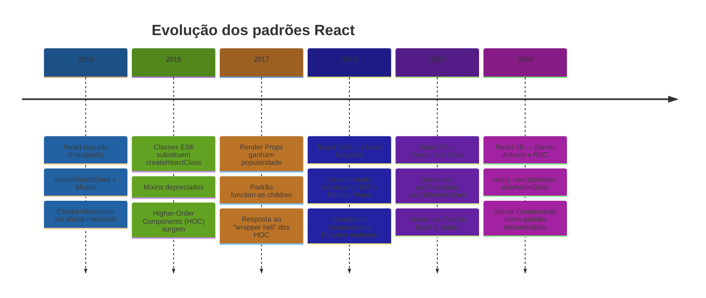
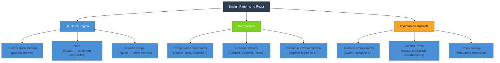

# Padrões no React e a evolução

> [!abstract] TL;DR
> Design patterns em React são soluções nomeadas para problemas recorrentes de reuso de lógica, composição e inversão de controle entre componentes. A história do React é a história de como a comunidade tentou resolver "como compartilhar comportamento entre componentes" — de mixins (2013) a Higher-Order Components (2015), de Render Props (2017) a Custom Hooks (2019). Hooks venceram porque encapsulam lógica sem criar novos nós na árvore e sem as armadilhas de aninhamento. Este galho é um catálogo de referência autocontido: cada nota apresenta um padrão com intenção, mecanismo, exemplos TypeScript, trade-offs e quando usar.

## O problema que você já teve

Imagine que você está construindo dois componentes completamente diferentes: um `UserCard` e um `ProductPage`. Ambos precisam detectar se o mouse está sobre eles para exibir um tooltip. Você escreve a lógica de hover no primeiro, copia para o segundo — depois aparece um terceiro componente com a mesma necessidade.

Agora você tem três cópias do mesmo `useState` + `onMouseEnter` + `onMouseLeave`. Se o comportamento mudar — digamos, adicionar um delay antes de mostrar o tooltip — você precisa lembrar de atualizar os três lugares. Um deles vai ficar desatualizado. Garantido.

```tsx
// ❌ Antes de qualquer padrão — lógica duplicada
function UserCard() {
  const [isHovered, setIsHovered] = useState(false);
  return (
    <div
      onMouseEnter={() => setIsHovered(true)}
      onMouseLeave={() => setIsHovered(false)}
    >
      {isHovered && <Tooltip>Ver perfil</Tooltip>}
      <Avatar />
    </div>
  );
}

function ProductPage() {
  const [isHovered, setIsHovered] = useState(false); // cópia exata
  return (
    <section
      onMouseEnter={() => setIsHovered(true)}
      onMouseLeave={() => setIsHovered(false)}
    >
      {isHovered && <Tooltip>Ver detalhes</Tooltip>}
      <ProductImage />
    </section>
  );
}
```

Se o problema parece pequeno aqui, imagine com autenticação, paginação, busca com debounce ou sincronização com WebSocket. A escala transforma duplicação em pesadelo de manutenção.

Design patterns existem para dar **nome e forma** a soluções que a comunidade descobriu para esse tipo de problema.

## O que é um design pattern no contexto React

Um design pattern não é uma biblioteca nem uma função específica — é um **nome para uma solução reutilizável que pode ser aplicada em contextos diferentes**. É como receitas de culinária: "refogue o alho antes de adicionar o tomate" não te diz qual prato fazer, mas resolve um problema recorrente de sabor.

No React, os padrões mais importantes resolvem três categorias de problemas:

| Categoria | Problema | Exemplos de padrão |
|-----------|----------|--------------------|
| **Reuso de lógica** | Mesma lógica stateful em vários componentes | Custom Hook, HOC, Render Props |
| **Composição** | Montar UIs flexíveis sem prop drilling | Compound Components, Provider, Container/Presentational |
| **Inversão de controle** | Deixar o consumidor decidir o comportamento | Headless Components, Props Getters, Control Props |

> [!question]- Por que "inversão de controle" importa em UI?
> Um componente que controla tudo internamente é fácil de usar mas difícil de customizar. Inversão de controle significa que o componente expõe a lógica e o consumidor decide o que fazer com ela — como o Headless UI faz com menus acessíveis: você controla o visual, ele controla a acessibilidade e o comportamento de teclado.

## A história: quatro eras de compartilhamento de lógica

A evolução dos padrões no React não foi planejada centralmente. Foi a comunidade descobrindo problemas, propondo soluções e percebendo os novos problemas que essas soluções criavam. É uma história honesta de engenharia iterativa.



### Era 1: Mixins (2013–2015) — a solução que criou colisões silenciosas

Os mixins eram a forma original de compartilhar comportamento no React. Com `createReactClass()`, você misturava um objeto de métodos em qualquer componente — como copiar e colar automaticamente, mas gerenciado pelo framework.

```tsx
// Sintaxe da época — não use em código novo
const HoverMixin = {
  getInitialState() {
    return { isHovered: false };
  },
  handleMouseEnter() {
    this.setState({ isHovered: true });
  },
  handleMouseLeave() {
    this.setState({ isHovered: false });
  },
};

const UserCard = createReactClass({
  mixins: [HoverMixin],
  render() {
    return (
      <div
        onMouseEnter={this.handleMouseEnter}
        onMouseLeave={this.handleMouseLeave}
      >
        {this.state.isHovered ? 'hover!' : 'normal'}
      </div>
    );
  },
});
```

**Por que surgiu:** Antes de classes ES6 e hooks, era a única forma de extrair lógica reutilizável sem copiar manualmente.

**Por que caiu:** Quando dois mixins declaravam a mesma propriedade de state ou o mesmo método de ciclo de vida, havia **colisão silenciosa** — um sobrescrevia o outro sem erro. Com três mixins no mesmo componente, descobrir de onde vinha `this.state.isLoading` virava uma caçada. O time do React os chamou de ["harmful"](https://legacy.reactjs.org/blog/2016/07/13/mixins-considered-harmful.html) em 2016 e os removeu com a migração para classes ES6.

### Era 2: Higher-Order Components (2015–2019) — poder com wrapper hell

Com a chegada das classes ES6, a comunidade inventou os Higher-Order Components (HOC): uma função que recebe um componente e retorna um **novo componente aprimorado**. A analogia é um decorator de bolo — você não muda o bolo, só acrescenta cobertura.

```tsx
// HOC de autenticação
function withAuth<P extends object>(
  WrappedComponent: React.ComponentType<P>
) {
  return function WithAuthComponent(props: P) {
    const isAuthenticated = checkAuth(); // lógica compartilhada aqui
    if (!isAuthenticated) {
      return <div>Acesso negado. Faça login.</div>;
    }
    return <WrappedComponent {...props} />;
  };
}

// HOC de loading
function withLoader<P extends object>(
  WrappedComponent: React.ComponentType<P>
) {
  return function WithLoaderComponent(
    props: P & { isLoading: boolean }
  ) {
    const { isLoading, ...rest } = props;
    if (isLoading) return <Spinner />;
    return <WrappedComponent {...(rest as P)} />;
  };
}

// Composição de HOCs — empilhamento
const ProtectedDashboard = withLogger(withAuth(withLoader(Dashboard)));
```

**Por que funcionou:** HOCs permitiam empilhar comportamentos sem modificar os componentes originais. Libs como Redux (`connect`), React Router (`withRouter`) e Material UI usaram extensivamente esse padrão.

**Por que caiu:** O mesmo empilhamento que parecia elegante criava o **wrapper hell** no React DevTools:

```
<WithLogger>
  <WithAuth>
    <WithLoader>
      <Dashboard>  ← o componente real está aqui embaixo
```

Além disso, se dois HOCs injetavam uma prop com o mesmo nome, o de cima sobrescrevia silenciosamente o de baixo — o mesmo problema dos mixins, mas com props em vez de state. E TypeScript sofria para inferir os tipos corretos através de múltiplas camadas de `P extends object`.

### Era 3: Render Props (2017–2019) — flexibilidade com verbosidade

O padrão Render Props surgiu como resposta ao wrapper hell. Em vez de envolver o componente, você passava uma **função como prop** — e o componente com a lógica chamava essa função para renderizar o que você quisesse.

```tsx
// Componente que compartilha lógica via render prop
interface HoverState {
  isHovered: boolean;
}

function HoverTracker({
  render,
}: {
  render: (state: HoverState) => React.ReactNode;
}) {
  const [isHovered, setIsHovered] = useState(false);
  return (
    <div
      onMouseEnter={() => setIsHovered(true)}
      onMouseLeave={() => setIsHovered(false)}
    >
      {render({ isHovered })}
    </div>
  );
}

// Uso — o consumidor controla totalmente o que renderiza
function UserCard() {
  return (
    <HoverTracker
      render={({ isHovered }) => (
        <>
          {isHovered && <Tooltip>Ver perfil</Tooltip>}
          <Avatar />
        </>
      )}
    />
  );
}
```

**Por que funcionou:** Sem nós extras visíveis no DevTools (diferente do HOC), o consumidor controlava o render completamente, e a lógica ficava em um único lugar.

**Por que caiu:** Múltiplos Render Props criavam a "pirâmide da perdição" no JSX:

```tsx
// ❌ Pyramid of doom com render props
<MousePosition render={({ x, y }) => (
  <HoverTracker render={({ isHovered }) => (
    <AuthChecker render={({ user }) => (
      <Dashboard x={x} y={y} isHovered={isHovered} user={user} />
    )} />
  )} />
)} />
```

A biblioteca React Router ainda usa render props em algumas APIs (`<Route render={...} />`), mas o padrão como técnica geral foi amplamente substituído por hooks.

### Era 4: Custom Hooks (2019–hoje) — o padrão que venceu

Em fevereiro de 2019, o React 16.8 introduziu hooks. A mudança fundamental: **lógica stateful pode viver em funções simples**, fora de qualquer componente ou JSX.

```tsx
// ✅ Custom hook — lógica isolada, sem wrapper, sem JSX
function useHover() {
  const [isHovered, setIsHovered] = useState(false);

  const handlers = {
    onMouseEnter: () => setIsHovered(true),
    onMouseLeave: () => setIsHovered(false),
  } as const;

  return { isHovered, handlers };
}

// Uso em UserCard — limpo e direto
function UserCard() {
  const { isHovered, handlers } = useHover();
  return (
    <div {...handlers}>
      {isHovered && <Tooltip>Ver perfil</Tooltip>}
      <Avatar />
    </div>
  );
}

// Mesmo hook, zero duplicação
function ProductPage() {
  const { isHovered, handlers } = useHover();
  return (
    <section {...handlers}>
      {isHovered && <Tooltip>Ver detalhes</Tooltip>}
      <ProductImage />
    </section>
  );
}
```

**Por que venceu — quatro razões:**

1. **Sem nós extras no DevTools** — o hook não cria elementos na árvore de componentes
2. **Composição trivial** — basta chamar múltiplos hooks em sequência, sem pirâmide
3. **Testável isoladamente** — você testa a função `useHover` sem precisar montar um componente
4. **TypeScript funciona naturalmente** — sem as gymnasticas de `P extends object` dos HOCs

```tsx
// Composição de hooks — sem pirâmide
function Dashboard() {
  const { x, y } = useMousePosition(); // antes: render prop
  const { isHovered, handlers } = useHover();  // antes: render prop
  const { user } = useAuth();          // antes: HOC

  // tudo plano, legível, tipado
  return <div {...handlers}>{user.name}</div>;
}
```

A mecânica interna dos hooks e como criar custom hooks do zero está em [[03-Dominios/Tecnologia/React/React core/14 - Custom hooks|React core 14]].

### A fronteira atual: React Server Components (React 19)

React 19 (dezembro de 2024) adicionou uma nova dimensão: componentes que rodam **no servidor**, sem JavaScript enviado ao cliente. Isso não substitui os padrões acima — adiciona uma nova categoria de problemas (onde executar a lógica) ao problema já existente (como compartilhar lógica cliente).

```tsx
// Server Component — sem hooks, executa no servidor
// Pode acessar banco de dados diretamente
async function ProductList() {
  const products = await db.products.findMany(); // zero fetch no cliente
  return (
    <ul>
      {products.map((p) => (
        <ProductCard key={p.id} product={p} />
      ))}
    </ul>
  );
}
```

Os padrões deste catálogo focam em componentes cliente — hooks, composição, reuso de UI. Server Components são cobertos na trilha de Next.js.

## Como ler uma entrada deste catálogo

Cada nota do galho Design Patterns segue esta estrutura, pensada para ser autocontida:

| Seção | O que responde |
|-------|----------------|
| **Intenção** | Qual problema específico este padrão resolve |
| **Mecanismo** | Como funciona internamente — o por quê, não só o quê |
| **Exemplo mínimo** | Código TypeScript/TSX que demonstra o padrão puro |
| **Trade-offs** | O que você ganha e o que você abre mão |
| **Quando usar** | Contextos específicos onde este padrão brilha |
| **Quando não usar** | Quando outro padrão resolve melhor (ou props simples bastam) |
| **Libs que usam** | Exemplos do mundo real no ecossistema React |

> [!info] Princípio do catálogo autocontido
> Cada nota pode repetir contexto de outros módulos do vault sob a ótica do padrão. Você não precisa sair do catálogo para entender um padrão — mas wikilinks levam à nota canônica se quiser aprofundar o mecanismo.

Leia cada entrada como um capítulo independente. As primeiras notas cobrem padrões mais fundamentais, mas a ordem não é obrigatória.

## Mapa do galho: padrões cobertos

O catálogo organiza os padrões em três grupos funcionais:



Os padrões "legados" (HOC e Render Props) ainda aparecem em codebases existentes e frequentemente em perguntas de entrevista — entender o mecanismo e os problemas que causavam é parte do conhecimento sênior em React.

A base de composição entre componentes — `children`, `cloneElement`, renderização condicional — está em [[03-Dominios/Tecnologia/React/React core/08 - Renderização condicional e composição|React core 08]].

Consulte o [[03-Dominios/Tecnologia/React/Dicionário de React|Dicionário de React]] para definições rápidas dos termos usados neste galho.

## Como explicar em inglês

Se alguém em entrevista perguntar "What are React design patterns and how have they evolved?", uma resposta clara e natural seria:

> "React design patterns are named solutions for recurring problems in component logic sharing and composition. The ecosystem evolved through several phases: mixins caused silent state collisions; Higher-Order Components created wrapper hell in the DevTools; Render Props solved the DOM nesting problem but introduced callback pyramids in JSX. Custom Hooks, introduced in React 16.8, largely won because they extract stateful logic into plain functions without adding nodes to the component tree, making composition trivial and unit testing straightforward."

| PT | EN |
|----|----|
| padrão de design | design pattern |
| reuso de lógica | logic reuse / stateful logic sharing |
| componente de ordem superior | higher-order component (HOC) |
| props de renderização | render props |
| hook personalizado | custom hook |
| composição de componentes | component composition |
| inversão de controle | inversion of control |
| aninhamento excessivo de wrappers | wrapper hell |
| árvore de componentes | component tree |
| efeito colateral | side effect |
| prop drilling | prop drilling (termo igual) |
| componente sem cabeça | headless component |
| componente controlado | controlled component |

## Armadilhas comuns

> [!warning] Aplicar padrão sem necessidade (over-engineering)
> **O que acontece:** Você cria um HOC ou Compound Component para um caso que poderia ser resolvido com props simples e um `if`.
> **Por quê:** Padrões parecem "profissionais"; existe pressão para demonstrar conhecimento técnico em revisões de código.
> **Como evitar:** Comece sempre com a solução mais simples. Adicione um padrão quando a duplicação aparecer duas ou três vezes — não antes. A regra do "Wait for it to hurt" se aplica bem aqui.

> [!warning] Cargo-culting — copiar o padrão sem entender o problema que ele resolve
> **O que acontece:** Você usa Provider Pattern para estado local de um único componente. Ou Compound Components para algo com apenas duas variantes simples. Ou um HOC quando uma função utilitária bastaria.
> **Por quê:** Você viu o padrão em uma lib famosa e concluiu que era "a forma certa de fazer React".
> **Como evitar:** Para cada padrão que você considera, pergunte: "qual problema específico ele resolve no meu caso?" Se você não consegue nomear o problema, provavelmente não precisa do padrão.

> [!warning] HOC quando Custom Hook resolve melhor
> **O que acontece:** Você escreve `withHover(MyComponent)` quando poderia escrever `useHover()` e chamar dentro do componente diretamente.
> **Por quê:** HOCs parecem mais "orientados a objetos" para quem vem de Java/Python; tutoriais antigos ainda os mostram como padrão principal.
> **Como evitar:** Regra de ouro: se você precisa apenas de **lógica** (state + efeitos), use Custom Hook. Se precisa **substituir ou bloquear o que é renderizado** de forma global e condicional (ex: `withAuth` que redireciona para login antes de qualquer render), HOC ainda pode fazer sentido.

> [!warning] Confundir padrões de UI com padrões de compartilhamento de lógica
> **O que acontece:** Você usa Compound Components para gerenciar estado global compartilhado, quando Provider seria mais adequado. Ou usa Context/Provider para passar uma prop que só precisa ir dois níveis abaixo.
> **Por quê:** Os padrões têm nomes que soam similares e os exemplos online simplificam os contextos de uso.
> **Como evitar:** Compound Components = componentes que só fazem sentido em conjunto, compartilhando estado via Context interno (`<Select>` + `<Select.Option>`). Provider Pattern = dados que precisam chegar em pontos distantes da árvore sem prop drilling. Props simples = tudo o mais.

## Design patterns em uma frase

Design patterns em React são receitas nomeadas que a comunidade desenvolveu para evitar copiar lógica entre componentes — e a história do React é a história de como essas receitas ficaram progressivamente mais simples de usar.

## O que vem a seguir

Agora que você entende o problema que cada era de padrões tentou resolver e por que Custom Hooks venceram para reuso de lógica, o próximo passo natural é ver o padrão mais fundamental do React moderno em detalhe.

- **02 - Custom Hook Pattern** — o padrão central do React funcional: como extrair, compor e testar lógica stateful. A base para entender todos os outros padrões deste catálogo.
- **03 - Provider Pattern** — como compartilhar estado pela árvore sem prop drilling; a fundação do Context API e de libs como Zustand e Jotai.
- **04 - Compound Components** — como construir componentes altamente customizáveis que compartilham estado interno de forma transparente para o consumidor.

## Fontes

- **Addy Osmani & Lydia Hallie** — [*patterns.dev/react*](https://www.patterns.dev/react) — referência canônica de padrões React modernos com exemplos interativos; cobre desde HOC até RSC
- **Dennis Persson** — [*21 Fantastic React Design Patterns and When to Use Them*](https://dev.to/perssondennis/21-fantastic-react-design-patterns-and-when-to-use-them-7bb) — inventário amplo com categorização em Core / Common / Legacy e tabela de "quando usar"
- **Refine** — [*React Design Patterns*](https://refine.dev/blog/react-design-patterns/) — cobertura de 12 padrões com foco em cases de produção; atualizado em 2025 com React Server Components
- **Sam Abaasi (DEV.to)** — [*The Evolution of React Design Patterns: From HOCs to Hooks*](https://dev.to/samabaasi/the-evolution-of-react-design-patterns-from-hocs-to-hooks-and-custom-hooks-44a) — histórico HOC → Render Props → Hooks com exemplos e análise de trade-offs
- **Time React (Meta)** — [*Mixins Considered Harmful*](https://legacy.reactjs.org/blog/2016/07/13/mixins-considered-harmful.html) — post original que deprecou mixins; explica o raciocínio por trás da decisão e o que veio depois
- **Krasimir Tsonev** — [*React in Patterns*](https://github.com/krasimir/react-in-patterns) — livro open source sobre padrões clássicos React; referência para entender as eras pré-hooks
