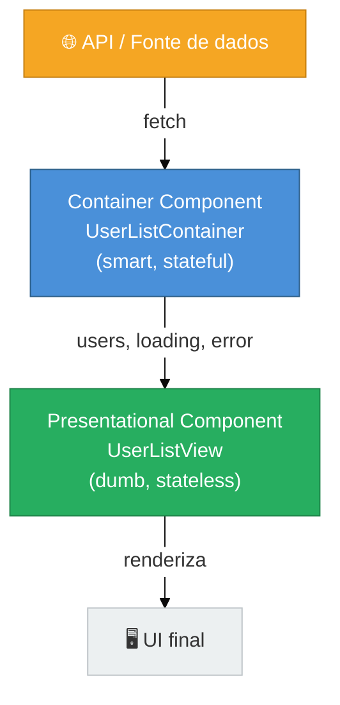

# Container vs Presentational

> [!abstract] TL;DR
> O padrão Container/Presentational separa componentes que **buscam e gerenciam dados** (containers, "smart") dos que apenas **renderizam UI** (presentational, "dumb") — o que resolve o problema clássico de componentes que misturam fetch com render e ficam impossíveis de testar ou reutilizar.
> Com a chegada dos Hooks em 2019, Dan Abramov *atualizou* seu próprio artigo: "não recomendo mais dividir componentes assim. Hooks fazem o mesmo sem divisão arbitrária." Hoje, a lógica que antes ia para o container vai para um custom hook.
> O padrão ainda faz sentido em 2026 quando a separação é entre *componentes* com responsabilidades muito distintas (ex.: Server Component buscando dados + Client Component renderizando), ou em design systems onde os componentes visuais precisam ser completamente agnósticos de estado.

---

## O problema: o componente que faz tudo

Você já escreveu (ou herdou) um componente assim?

```tsx
// UserList.tsx — antes da separação
// Faz fetch, guarda estado, lida com loading/erro E formata a UI.
// Como você testa só a renderização? Como reutiliza a lista com dados mockados?

import { useState, useEffect } from 'react'

export function UserList() {
  const [users, setUsers] = useState<User[]>([])
  const [loading, setLoading] = useState(true)
  const [error, setError] = useState<string | null>(null)

  useEffect(() => {
    fetch('/api/users')
      .then(res => res.json())
      .then(data => {
        setUsers(data)
        setLoading(false)
      })
      .catch(err => {
        setError(err.message)
        setLoading(false)
      })
  }, [])

  if (loading) return <p>Carregando...</p>
  if (error) return <p>Erro: {error}</p>

  return (
    <ul>
      {users.map(user => (
        <li key={user.id}>
          <strong>{user.name}</strong> — {user.email}
        </li>
      ))}
    </ul>
  )
}
```

Tente escrever um teste unitário para *só* a parte visual. Você não consegue — ela está grudada ao `useEffect` e ao `fetch`. Agora tente exibir a mesma lista com dados vindos de outra fonte (um formulário, um cache local, uma prop). Você não consegue — os dados são buscados internamente, sempre.

Esse é o problema que o padrão Container/Presentational resolve.

---

## O mecanismo: dividir por responsabilidade

A ideia central é simples: **um componente não deve tanto fazer data-fetching quanto renderizar UI**. Cada um desses trabalhos vai para um tipo diferente de componente.

```
┌─────────────────────────────────────────────────────┐
│  Container Component ("smart" / "stateful")          │
│  - Busca dados (fetch, API, estado global)           │
│  - Gerencia estado e efeitos colaterais              │
│  - Passa tudo para baixo via props                   │
│  - Não sabe (nem deve saber) como a UI vai aparecer  │
└─────────────────┬───────────────────────────────────┘
                  │ props (dados + callbacks)
                  ▼
┌─────────────────────────────────────────────────────┐
│  Presentational Component ("dumb" / "stateless")     │
│  - Recebe tudo via props                             │
│  - Só renderiza HTML/JSX                             │
│  - Sem efeitos colaterais, sem chamadas de API       │
│  - Fácil de testar: dado X props, renderiza Y        │
└─────────────────────────────────────────────────────┘
```

A analogia que ajuda: pense num restaurante. O **garçom** (container) vai até a cozinha, busca o pedido, traz tudo organizado na bandeja. O **prato** (presentational) só apresenta a comida — não tem nenhum papel em buscá-la. Se você quer testar como o prato fica visualmente, você simplesmente coloca a comida nele; não precisa do garçom.

---

## Diagrama: fluxo de dados



O fluxo de dados é **unidirecional**: API → Container → Presentational → UI. Nenhuma seta vai para trás.

---

## Exemplo completo: antes e depois

### Antes — tudo misturado

```tsx
// UserList.tsx — problemático
import { useState, useEffect } from 'react'

interface User {
  id: number
  name: string
  email: string
}

export function UserList() {
  const [users, setUsers] = useState<User[]>([])
  const [loading, setLoading] = useState(true)
  const [error, setError] = useState<string | null>(null)

  useEffect(() => {
    fetch('/api/users')
      .then(res => res.json())
      .then(data => { setUsers(data); setLoading(false) })
      .catch(err => { setError(err.message); setLoading(false) })
  }, [])

  if (loading) return <p>Carregando...</p>
  if (error) return <p className="text-red-500">Erro: {error}</p>

  return (
    <ul className="space-y-2">
      {users.map(user => (
        <li key={user.id} className="border p-2 rounded">
          <strong>{user.name}</strong> — {user.email}
        </li>
      ))}
    </ul>
  )
}
```

### Depois — separado (com classe de container)

O padrão clássico divide em **dois arquivos**:

```tsx
// UserListView.tsx — presentational (puro, testável)
interface User {
  id: number
  name: string
  email: string
}

interface UserListViewProps {
  users: User[]
  loading: boolean
  error: string | null
}

export function UserListView({ users, loading, error }: UserListViewProps) {
  if (loading) return <p>Carregando...</p>
  if (error) return <p className="text-red-500">Erro: {error}</p>

  return (
    <ul className="space-y-2">
      {users.map(user => (
        <li key={user.id} className="border p-2 rounded">
          <strong>{user.name}</strong> — {user.email}
        </li>
      ))}
    </ul>
  )
}
```

```tsx
// UserListContainer.tsx — container (smart, busca dados)
import { useState, useEffect } from 'react'
import { UserListView } from './UserListView'

interface User {
  id: number
  name: string
  email: string
}

export function UserListContainer() {
  const [users, setUsers] = useState<User[]>([])
  const [loading, setLoading] = useState(true)
  const [error, setError] = useState<string | null>(null)

  useEffect(() => {
    fetch('/api/users')
      .then(res => res.json())
      .then(data => { setUsers(data); setLoading(false) })
      .catch(err => { setError(err.message); setLoading(false) })
  }, [])

  return <UserListView users={users} loading={loading} error={error} />
}
```

**O que ganhamos:**
- `UserListView` pode ser testado com dados mockados em 2 linhas
- `UserListView` pode ser reutilizado com dados de outras fontes
- `UserListContainer` pode ser trocado sem mudar a UI

---

## Como os Hooks reescreveram a conversa

Em 2019, Dan Abramov *atualizou* o próprio artigo que inventou o padrão com esta nota:

> *"Escrevi este artigo há muito tempo e minhas opiniões mudaram. Não recomendo mais dividir seus componentes assim. Hooks permitem que eu faça a mesma coisa sem uma divisão arbitrária."*

O raciocínio dele: o container existia para **isolar a lógica** do componente. Mas com custom hooks, essa lógica pode morar num hook dedicado — sem criar um componente extra só para fazer fetch.

### Depois — forma moderna com custom hook

```tsx
// hooks/useUsers.ts — lógica extraída para hook
import { useState, useEffect } from 'react'

interface User {
  id: number
  name: string
  email: string
}

interface UseUsersResult {
  users: User[]
  loading: boolean
  error: string | null
}

export function useUsers(): UseUsersResult {
  const [users, setUsers] = useState<User[]>([])
  const [loading, setLoading] = useState(true)
  const [error, setError] = useState<string | null>(null)

  useEffect(() => {
    fetch('/api/users')
      .then(res => res.json())
      .then(data => { setUsers(data); setLoading(false) })
      .catch(err => { setError(err.message); setLoading(false) })
  }, [])

  return { users, loading, error }
}
```

```tsx
// UserList.tsx — componente final: só renderiza
import { useUsers } from '../hooks/useUsers'

export function UserList() {
  const { users, loading, error } = useUsers()

  if (loading) return <p>Carregando...</p>
  if (error) return <p className="text-red-500">Erro: {error}</p>

  return (
    <ul className="space-y-2">
      {users.map(user => (
        <li key={user.id} className="border p-2 rounded">
          <strong>{user.name}</strong> — {user.email}
        </li>
      ))}
    </ul>
  )
}
```

**Resultado:** a separação de responsabilidades continua — mas sem criar um componente-wrapper só para ser "container". O hook *é* o container agora.

> [!question]- Por que hooks são superiores a container components para lógica?
> Porque um hook pode ser **reutilizado em qualquer componente** sem criar hierarquia de componentes. Um container component é um nó na árvore do React — ele adiciona profundidade desnecessária ao JSX e não pode ser "injetado" de forma composicional da mesma forma. O hook separa a lógica sem nenhum overhead estrutural.

Para aprofundar custom hooks, veja [[03-Dominios/Tecnologia/React/React core/14 - Custom hooks|React core 14]].

---

## O eco do padrão: React Server Components em 2024-2026

Há uma ironia elegante: quando o React introduziu **Server Components** (RSC), o padrão Container/Presentational voltou — com nova roupagem.

```tsx
// UserListPage.tsx — Server Component (o novo "container")
// Roda no servidor: pode fazer fetch diretamente, sem useEffect
async function UserListPage() {
  const users = await fetch('/api/users').then(res => res.json())
  return <UserListView users={users} />  // passa dados para o Client Component
}
```

```tsx
// UserListView.tsx — Client Component (o novo "presentational")
'use client'

interface UserListViewProps {
  users: User[]
}

export function UserListView({ users }: UserListViewProps) {
  return (
    <ul>
      {users.map(user => <li key={user.id}>{user.name}</li>)}
    </ul>
  )
}
```

A divisão agora é entre **onde o componente roda** (servidor vs. cliente), não só entre responsabilidades. O Server Component naturalmente assume o papel de container; o Client Component vira presentational.

---

## Quando o padrão ainda faz sentido em 2026

O padrão **não morreu** — ele se transformou. Ainda vale a pena aplicar a divisão explícita quando:

| Cenário | Por quê Container/Presentational ajuda |
|---|---|
| **Design System** | Componentes visuais do DS precisam ser 100% agnósticos de dados — qualquer estado vem de fora via props |
| **Times grandes** | Fronteira explícita entre quem cuida da lógica e quem cuida da UI reduz conflitos de merge |
| **Componentes altamente reutilizáveis** | Ex.: `<DataTable>` que pode receber dados de REST, GraphQL ou estado local |
| **Storybook / testes de snapshot** | Componentes presentational são triviais de documentar e testar — sem mocks de fetch |
| **Server Components (RSC)** | A arquitetura força a separação: Server = container, Client = presentational |

O que mudou: antes, você criava um componente-wrapper só para ser container. Hoje, você prefere um custom hook para isso. Mas se você já tem um componente com responsabilidades claras de "gerenciar" vs. "exibir", a nomeação e separação ainda ajudam a comunicar a intenção.

Para entender onde cada tipo de componente mora na arquitetura geral, veja [[03-Dominios/Tecnologia/React/React core/24 - Arquitetura de componentes|React core 24]].

---

## Relação com Design Systems

Componentes presentational são, na prática, **os componentes de um Design System**. Um `<Button>`, `<Card>` ou `<Avatar>` de um DS recebe tudo via props e nunca faz fetch por conta própria.

```tsx
// Button.tsx — componente de DS (100% presentational)
interface ButtonProps {
  label: string
  onClick: () => void
  variant?: 'primary' | 'secondary' | 'danger'
  disabled?: boolean
}

export function Button({ label, onClick, variant = 'primary', disabled = false }: ButtonProps) {
  const classes = {
    primary: 'bg-blue-600 text-white hover:bg-blue-700',
    secondary: 'bg-gray-200 text-gray-800 hover:bg-gray-300',
    danger: 'bg-red-600 text-white hover:bg-red-700',
  }

  return (
    <button
      className={`px-4 py-2 rounded font-medium transition-colors ${classes[variant]}`}
      onClick={onClick}
      disabled={disabled}
    >
      {label}
    </button>
  )
}
```

Esse componente pode ser testado, documentado no Storybook e reutilizado em qualquer contexto sem nenhum efeito colateral. O "container" que vai passá-lo dados pode ser um custom hook, um Server Component, um Redux slice ou qualquer outra coisa.

---

## Armadilhas comuns

> [!warning] Dividir cedo demais
> **O que acontece:** você cria um container e um presentational para um componente que tem 20 linhas e nunca vai ser reutilizado. Agora tem dois arquivos, dois imports e zero benefício.
> **Por quê:** o padrão existe para resolver o problema de componentes com responsabilidades conflitantes — não é uma regra para *todo* componente.
> **Como evitar:** aplique quando sentir a dor concreta: "não consigo testar a UI sem fazer fetch" ou "quero reutilizar essa lista com dados diferentes". Antes disso, um componente simples está ótimo como está.

> [!warning] Container anêmico (que só repassa props)
> **O que acontece:** seu container não faz nada além de chamar `useUsers()` e passar os dados. O resultado é um componente extra que existe só para "parecer container".
> **Por quê:** se toda a lógica está no hook, o container virou um intermediário sem valor.
> **Como evitar:** prefira usar o hook diretamente no componente que renderiza. O container só tem razão de existir se *ele mesmo* agrega lógica que não pertence ao hook nem à view — combinando múltiplos hooks, controlando condicionais de renderização complexas, etc.

> [!warning] Achar que ainda precisa de wrapper component em vez de hook
> **O que acontece:** em 2026, você cria um `UserListContainer.tsx` que basicamente encapsula um `useEffect` + `useState` — exatamente o que um custom hook faria, mas com a desvantagem de adicionar um nó na árvore do React.
> **Por quê:** o hábito do padrão pré-hooks persiste mesmo após anos de hooks no ecossistema.
> **Como evitar:** sempre que for criar um "container component" cuja única responsabilidade é lógica (fetch, estado, efeitos), extraia um `useNomeDoRecurso()` hook. Reserve o container component para quando você precisa de um *componente* na árvore — como um boundary de erro, um contexto, ou um Server Component.

> [!warning] Presentational que vira stateful silenciosamente
> **O que acontece:** você adiciona um `useState` de toggle ou animação no componente "puro" e ele deixa de ser testável de forma determinística.
> **Por quê:** estado de UI local (abrir/fechar dropdown, animação, foco) *não* é o mesmo tipo de estado que o padrão tenta separar. Mas a fronteira fica turva.
> **Como evitar:** distingua **estado de UI local** (pertence ao presentational: animações, hover, expand/collapse) de **estado de negócio** (pertence ao container/hook: dados da API, seleção do usuário que impacta outros componentes). O presentational pode ter o primeiro; nunca deve ter o segundo.

---

## Como explicar em inglês

**Em entrevista, você pode dizer:**

*"The Container/Presentational pattern separates components that fetch and manage data — the 'smart' ones — from components that just render UI based on props — the 'dumb' ones. It improves testability because the presentational layer is a pure function of its props. However, since React Hooks arrived, we mostly extract logic into custom hooks instead of wrapper container components. The principle of separating concerns remains the same; only the implementation changed."*

*"Dan Abramov himself updated his original article in 2019 to say he no longer recommends this split, because hooks achieve the same separation without the arbitrary component boundary."*

| PT | EN |
|----|-----|
| Componente container / inteligente | Container component / smart component |
| Componente presentacional / burro | Presentational component / dumb component |
| Separação de responsabilidades | Separation of concerns |
| Componente puro (recebe props, renderiza) | Pure / stateless component |
| Efeito colateral | Side effect |
| Busca de dados | Data fetching |
| Componente de servidor | Server Component |
| Design system | Design system |
| Injetado via props | Passed down via props |

---

## Resumo em uma frase

Container/Presentational é o padrão de separar "quem busca dados" de "quem renderiza UI" — uma ideia certa que, com Hooks, mudou de *componente-wrapper* para *custom hook*, mas permanece tão válida quanto antes.

---

## O que vem a seguir

Entender Container/Presentational leva naturalmente a dois caminhos: ou você aprofunda *onde a lógica mora* (hooks, contexto, estado global) — que é o domínio de arquitetura de componentes — ou você explora outros padrões do catálogo que também separam responsabilidades de formas diferentes, como HOCs e Render Props.

- [[03-Dominios/Tecnologia/React/React core/14 - Custom hooks|React core 14 — Custom hooks]] — onde a lógica do container vai hoje; hooks são o mecanismo que tornou o padrão clássico obsoleto como wrapper
- [[03-Dominios/Tecnologia/React/React core/24 - Arquitetura de componentes|React core 24 — Arquitetura de componentes]] — onde cada tipo de componente mora na hierarquia e como Container/Presentational se encaixa no desenho geral
- [[03-Dominios/Tecnologia/React/Dicionário de React|Dicionário de React]] — referência de termos usados nesta nota: stateful, stateless, side effect, pure component

---

## Fontes

- **Lydia Hallie & Addy Osmani** — [*Container/Presentational Pattern — patterns.dev*](https://www.patterns.dev/react/presentational-container-pattern/) — referência definitiva do padrão com exemplos modernos e trade-offs entre containers e hooks
- **Dan Abramov** — [*Presentational and Container Components — Medium (2015, atualizado 2019)*](https://medium.com/@dan_abramov/smart-and-dumb-components-7ca2f9a7c7d0) — artigo original do padrão; inclui nota de 2019 onde o próprio autor recomenda preferir hooks
- **Lakshay Kapoor** — [*Smart and Dumb Components: Still Relevant in 2025? — Medium*](https://medium.com/@lakshaykapoor08/smart-and-dumb-components-still-relevant-in-2025-e8ebfb1934bd) — análise de relevância atual, quando usar e quando evitar
- **Lorenzo Rivosecchi** — [*RSC and the Echo of 'Presentational and Container Components' — dev.to*](https://dev.to/fibonacid/rsc-and-the-echo-of-presentational-and-container-components-33i) — conexão entre o padrão clássico e React Server Components
- **Carmatec** — [*The Best React Design Patterns to Know About in 2026*](https://www.carmatec.com/blog/the-best-react-design-patterns-to-know-about/) — panorama de padrões React com posicionamento do Container/Presentational no ecossistema atual
