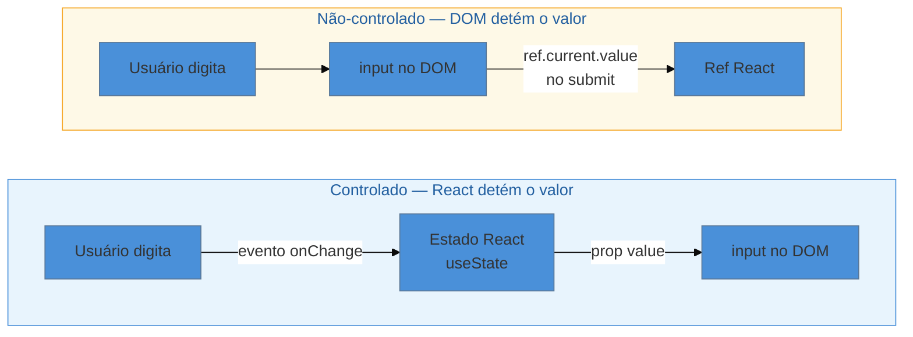

# Controlled vs Uncontrolled

> [!abstract] TL;DR
> O padrão **Controlled vs Uncontrolled** responde a uma única pergunta: quem é a **fonte da verdade** do valor de um input — o React (via estado) ou o DOM (via memória interna)?
> No modo **controlado**, você passa `value` + `onChange` e o React detém o valor a cada tecla. No modo **não-controlado**, você passa `defaultValue` e lê o valor com uma `ref` apenas quando precisar.
> Componentes de biblioteca bem projetados suportam **ambos os modos** ao mesmo tempo: se o pai passar `value`, o componente opera controlado; caso contrário, gerencia o estado internamente — exatamente o que `<input>` nativo faz.
> Use controlado para validação em tempo real ou UI condicional; use não-controlado (ou React Hook Form) para formulários grandes com foco em performance.

## O problema: o componente que o pai não consegue controlar

Imagine que você está construindo um formulário de cadastro com um campo de e-mail customizado — um `<EmailInput>` que exibe um ícone de envelope e uma mensagem de erro estilizada. Você quer que, ao usuário clicar em "Preencher com dados salvos", o campo seja preenchido automaticamente pelo componente pai.

Você tenta assim:

```tsx
// ❌ Não funciona: o pai não tem como impor o valor
function Cadastro() {
  const handleAutoFill = () => {
    // Como setar o valor do EmailInput daqui?
  };

  return (
    <>
      <button onClick={handleAutoFill}>Preencher com dados salvos</button>
      <EmailInput />
    </>
  );
}
```

O problema: `EmailInput` guarda o valor internamente. O pai não tem acesso. Você acabou de criar um componente **não-controlado sem querer**.

Este é o dilema central do padrão: **quem deve ser o dono do valor?**

---

## A analogia: volante seu vs piloto automático

Pense em dirigir um carro.

- **Modo controlado** é como você segurando o volante. A cada curva, você aplica a força exata. O carro vai exatamente para onde você manda, em tempo real. Se você largar o volante, o carro trava (campo read-only).
- **Modo não-controlado** é como o piloto automático. Você diz a direção inicial ("siga reto") e o carro resolve sozinho. Você só intervém no final da viagem para ver onde chegou.

Nenhum dos dois é errado — depende do quanto de controle você precisa durante o percurso.

---

## Modo controlado: React é a fonte da verdade

No modo controlado, o valor do input **vive no estado React**. O componente pai passa `value` e `onChange`, e o React sincroniza tudo a cada tecla.

```tsx
// ✅ Input controlado — React detém o valor
import { useState } from "react";

function EmailControlado() {
  const [email, setEmail] = useState("");

  return (
    <div>
      <input
        type="email"
        value={email}
        onChange={(e) => setEmail(e.target.value)}
        placeholder="seu@email.com"
      />
      {email.includes("@") ? null : (
        <span style={{ color: "red" }}>E-mail inválido</span>
      )}
    </div>
  );
}
```

O fluxo de dados é unidirecional e previsível:

1. Usuário digita → dispara `onChange`
2. `onChange` chama `setEmail` → atualiza o estado
3. React re-renderiza → o `value` do input reflete o novo estado

**Por que isso importa?** Porque o estado React é a única fonte de verdade. O DOM nunca guarda uma versão "diferente" do valor. Isso torna possível validar em tempo real, desabilitar botões, formatar a entrada, e sincronizar vários campos.

> [!question]- Por que preciso de `onChange`? O input não poderia atualizar sozinho?
> Não, e é intencional. Em React, um input com `value` mas sem `onChange` torna-se **read-only** — você não consegue digitar nada. Isso é um contrato explícito: se você assume o controle do valor, você também assume a responsabilidade de atualizá-lo. O React não vai agir nas suas costas.

---

## Modo não-controlado: DOM é a fonte da verdade

No modo não-controlado, o valor **vive no DOM**. Você fornece um valor inicial com `defaultValue` e lê o valor com uma `ref` quando precisar — normalmente no submit.

```tsx
// ✅ Input não-controlado — DOM detém o valor
import { useRef } from "react";

function FormularioSimples() {
  const emailRef = useRef<HTMLInputElement>(null);

  const handleSubmit = (e: React.FormEvent) => {
    e.preventDefault();
    const email = emailRef.current?.value ?? "";
    console.log("E-mail enviado:", email);
  };

  return (
    <form onSubmit={handleSubmit}>
      <input
        type="email"
        defaultValue=""
        ref={emailRef}
        placeholder="seu@email.com"
      />
      <button type="submit">Enviar</button>
    </form>
  );
}
```

Aqui, React não re-renderiza a cada tecla. O DOM cuida do valor internamente. Você só lê via `ref.current.value` quando o usuário submete.

**Vantagem real:** em formulários com dezenas de campos, cada tecla não dispara uma re-renderização. É significativamente mais performático.

> [!info] `defaultValue` vs `value`
> `defaultValue` seta o valor **inicial** e deixa o DOM assumir o controle a partir daí.
> `value` seta o valor **a cada render** e impõe o controle do React.
> Confundir os dois é a causa mais comum do warning "A component is changing an uncontrolled input".

---

## Diagrama: quem detém a fonte da verdade?



---

## Aplicando a componentes customizados

O padrão não se limita a `<input>` nativo. Qualquer componente que "guarda um valor" pode ser controlado ou não-controlado. A regra é a mesma: recebeu `value` + `onChange`? Controlado. Caso contrário, não-controlado.

```tsx
// ❌ Sempre não-controlado — o pai não pode impor o valor
function RatingBad() {
  const [stars, setStars] = useState(0);
  return <StarWidget stars={stars} onSelect={setStars} />;
}

// ✅ Controlado — o pai tem controle total
function RatingGood({ value, onChange }: { value: number; onChange: (n: number) => void }) {
  return <StarWidget stars={value} onSelect={onChange} />;
}
```

---

## O padrão dual: suportando os dois modos ao mesmo tempo

Bibliotecas como MUI, Radix UI e React Aria implementam componentes que funcionam **tanto controlados quanto não-controlados** — exatamente como `<input>` nativo. A lógica é elegante:

- Se `value` foi passado → modo controlado, use o valor do prop
- Se `value` não foi passado → modo não-controlado, gerencie internamente

```tsx
// ✅ Componente que suporta controlado E não-controlado
import { useState, useId } from "react";

interface SmartInputProps {
  // Props do modo controlado (opcionais)
  value?: string;
  onChange?: (value: string) => void;
  // Props do modo não-controlado (opcionais)
  defaultValue?: string;
  // Outros
  label: string;
}

function SmartInput({ value, onChange, defaultValue = "", label }: SmartInputProps) {
  // Detecta o modo
  const isControlled = value !== undefined;

  // Estado interno — só usado no modo não-controlado
  const [internalValue, setInternalValue] = useState(defaultValue);

  // Decide qual valor mostrar
  const currentValue = isControlled ? value : internalValue;

  // useId garante acessibilidade sem gerar conflito de IDs
  const inputId = useId();

  const handleChange = (e: React.ChangeEvent<HTMLInputElement>) => {
    const newValue = e.target.value;

    // Modo não-controlado: atualiza estado interno
    if (!isControlled) {
      setInternalValue(newValue);
    }

    // Ambos os modos: notifica o pai se ele escutou
    onChange?.(newValue);
  };

  return (
    <div>
      <label htmlFor={inputId}>{label}</label>
      <input id={inputId} value={currentValue} onChange={handleChange} />
    </div>
  );
}
```

**Por que `useId`?** Para garantir que o `id` do input e o `htmlFor` do label sejam sempre únicos, mesmo que o componente seja renderizado múltiplas vezes na página. Sem `useId`, você precisaria passar o `id` manualmente — ou arriscar conflitos de acessibilidade.

Agora o componente funciona nos dois cenários:

```tsx
// Modo não-controlado — pai não precisa gerenciar estado
<SmartInput label="Nome" defaultValue="João" />

// Modo controlado — pai tem controle total
<SmartInput label="Nome" value={nome} onChange={setNome} />
```

---

## Quando usar cada modo

| Situação | Recomendação |
|---|---|
| Validação em tempo real (enquanto digita) | Controlado |
| UI condicional baseada no valor (mostrar/ocultar campo) | Controlado |
| Formatar o valor enquanto o usuário digita | Controlado |
| Sincronizar vários campos (ex: senha + confirmar senha) | Controlado |
| Formulário grande com muitos campos e foco em performance | Não-controlado + React Hook Form |
| Leitura de valor apenas no submit | Não-controlado |
| `<input type="file">` (sempre) | Não-controlado (restrição do browser) |
| Integração com código não-React | Não-controlado |
| React 19 com `<form action>` + `useFormStatus` | Não-controlado + `FormData` |

> [!info] React Hook Form e o não-controlado
> O [React Hook Form](https://react-hook-form.com) é a solução mais popular para formulários grandes exatamente porque adota o modo **não-controlado por padrão**: `register()` captura a `ref` do input e lê o valor via DOM, sem re-renderizações a cada tecla. Quando você precisa de um campo controlado dentro do RHF (ex: um Select customizado), usa o `<Controller>` — que envolve o componente e fornece `value`/`onChange` para ele.

---

## Trade-offs

| Aspecto | Controlado | Não-controlado |
|---|---|---|
| Fonte da verdade | Estado React | DOM interno |
| Re-renderizações | A cada tecla (por padrão) | Apenas no submit ou quando você pede |
| Validação em tempo real | Fácil — você tem o valor sempre | Difícil — precisa ler a ref a cada evento |
| Complexidade de setup | Mais verboso (`value` + `onChange`) | Mais simples (só `defaultValue` + `ref`) |
| Previsibilidade | Alta — tudo no estado React | Menor — o DOM pode dessincronizar |
| `<input type="file">` | Impossível | Único modo disponível |
| Integração com libs de validação | Natural (Zod, Yup via estado) | Requer ref ou FormData |

---

## Armadilhas comuns

> [!warning] Controlado sem `onChange` — o campo congela
> **O que acontece:** Você passa `value` mas esquece o `onChange`. O campo não responde ao que o usuário digita — parece travado.
> **Por quê:** React re-renderiza o input com o mesmo `value` a cada tecla. Como o estado nunca muda, o valor nunca muda. O React está "ganhando a disputa" contra o DOM.
> **Como evitar:** Se você passa `value`, sempre passe `onChange` também. Se o campo deve ser somente-leitura, use `readOnly` explicitamente — deixa claro a intenção.
>
> ```tsx
> // ❌ Campo congelado
> <input value="texto fixo" />
>
> // ✅ Read-only intencional
> <input value="texto fixo" readOnly />
>
> // ✅ Controlado correto
> <input value={texto} onChange={(e) => setTexto(e.target.value)} />
> ```

> [!warning] Alternar entre controlado e não-controlado no mesmo input
> **O que acontece:** Você recebe o aviso `Warning: A component is changing an uncontrolled input to be controlled`. O comportamento do campo fica imprevisível.
> **Por quê:** Inicialmente, `value` é `undefined` (não-controlado). Depois de uma ação, passa a ser uma string (controlado). O React não sabe como reconciliar esse estado.
> **Como evitar:** Inicialize sempre com uma string, nunca com `undefined` ou `null`.
>
> ```tsx
> // ❌ Começa não-controlado, vira controlado
> const [email, setEmail] = useState<string | undefined>(undefined);
> <input value={email} onChange={(e) => setEmail(e.target.value)} />
>
> // ✅ Sempre controlado, desde o início
> const [email, setEmail] = useState("");
> <input value={email} onChange={(e) => setEmail(e.target.value)} />
>
> // ✅ Ou garanta com coalescência nula
> <input value={email ?? ""} onChange={(e) => setEmail(e.target.value)} />
> ```

> [!warning] Ler a `ref` antes do mount
> **O que acontece:** Você tenta acessar `ref.current.value` em um `useEffect` sem dependência, ou no próprio corpo do componente — e obtém `null`.
> **Por quê:** A `ref` só aponta para o elemento DOM **depois** que o componente é montado. Durante a renderização inicial, `ref.current` é `null`.
> **Como evitar:** Leia `ref.current` apenas dentro de event handlers (que só disparam após o mount) ou em `useEffect` (que roda após o mount). Nunca leia no corpo do componente ou no `useMemo`.
>
> ```tsx
> const inputRef = useRef<HTMLInputElement>(null);
>
> // ❌ Durante o render — ref ainda é null
> const value = inputRef.current?.value; // sempre undefined aqui
>
> // ✅ Dentro de event handler — DOM já montado
> const handleSubmit = () => {
>   const value = inputRef.current?.value ?? "";
>   // ✅ seguro aqui
> };
>
> // ✅ Dentro de useEffect — DOM já montado
> useEffect(() => {
>   inputRef.current?.focus();
> }, []);
> ```

---

## Como explicar em inglês

**Para uma entrevista técnica:**

> "In React, a controlled component stores its value in React state — the parent passes `value` and `onChange`, making React the single source of truth. An uncontrolled component lets the DOM manage its own state; you seed it with `defaultValue` and read it via a ref when needed. Well-designed components support both modes: if a `value` prop is provided, they behave as controlled; otherwise, they manage state internally — just like native `<input>` does."

| PT | EN |
|---|---|
| Fonte da verdade | Source of truth |
| Componente controlado | Controlled component |
| Componente não-controlado | Uncontrolled component |
| Valor inicial | Default value / Initial value |
| Referência / Ref | Ref |
| Evento de mudança | Change event / `onChange` handler |
| Re-renderização | Re-render |
| Estado interno | Internal state |
| Modo dual | Dual-mode / Hybrid control pattern |

---

## Resumo em 1 linha

**Controlled vs Uncontrolled em uma frase:** quem detém o valor do input — o React (via estado, para controle total) ou o DOM (via ref, para performance e simplicidade)?

---

## Veja também

- [[03-Dominios/Tecnologia/React/React core/06 - Eventos e formulários controlados|React core 06 — Eventos e formulários controlados]] — a base de como eventos e inputs funcionam em React antes de aplicar este padrão
- [[03-Dominios/Tecnologia/React/React core/10 - useRef e refs|React core 10 — useRef e refs]] — como criar e usar refs para acessar o DOM no modo não-controlado
- [[03-Dominios/Tecnologia/React/Dicionário de React|Dicionário de React]] — glossário de termos React usados neste catálogo

---

## O que vem a seguir

Agora que você entende quem detém o valor (React ou DOM), o próximo passo natural é aprender como **compor comportamento entre múltiplos componentes sem acoplar a implementação**. O padrão Compound Components resolve exatamente isso: como um conjunto de componentes relacionados compartilham estado sem que os filhos precisem conhecer os detalhes uns dos outros.

- [[03-Dominios/Tecnologia/React/Design Patterns/04 - Compound Components|04 — Compound Components]] — componentes que colaboram via Context sem prop drilling
- [[03-Dominios/Tecnologia/React/Design Patterns/01 - Visão Geral dos Padrões|01 — Visão Geral dos Padrões]] — mapa do catálogo completo

---

## Fontes

- **React Team** — [*`<input>` — React Docs*](https://react.dev/reference/react-dom/components/input) — documentação oficial; cobre as regras de controlled/uncontrolled, `defaultValue`, `onChange`, e os erros comuns com avisos do console
- **GreatFrontEnd** — [*Controlled vs Uncontrolled React Components*](https://www.greatfrontend.com/questions/quiz/what-is-the-difference-between-controlled-and-uncontrolled-react-components) — resumo orientado a entrevistas com comparação clara dos dois modos e casos React 19
- **Max Schmitt** — [*Creating React Components that can be Controlled and Uncontrolled*](https://maxschmitt.me/posts/react-components-controlled-uncontrolled) — implementação do padrão dual (`isControlled` detection) com exemplos práticos
- **React Hook Form Team** — [*Advanced Usage*](https://www.react-hook-form.com/advanced-usage/) — como o RHF usa o modo não-controlado por padrão e oferece `Controller` para componentes controlados de terceiros
- **FullStackPrep** — [*Controlled vs Uncontrolled in React (2026 Interview Traps)*](https://www.fullstackprep.dev/articles/webd/react/controlled-vs-uncontrolled-components) — armadilhas de entrevista e edge cases atualizados para 2026
