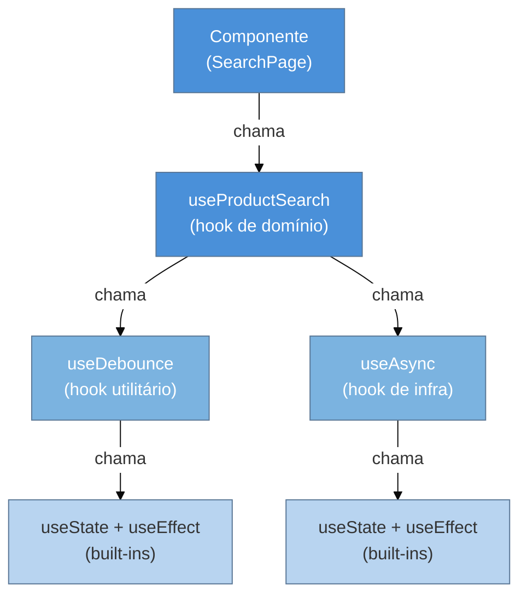

# Custom hooks como padrão de reuso de lógica

> [!abstract] TL;DR
> Custom hooks são funções prefixadas com `use` que encapsulam lógica com estado, efeitos ou contexto — e podem ser chamadas por qualquer componente ou outro hook. São o padrão **dominante** de reuso de lógica em React desde 2019: substituem Higher-Order Components e Render Props sem criar wrappers na árvore, sem colisão de props, sem _wrapper hell_. Cada chamada ao hook gera uma **instância de estado independente** — dois componentes usando o mesmo hook não compartilham estado, apenas lógica. A composição acontece naturalmente (hook chama hook), a tipagem TypeScript flui sem cerimônia extra e o teste se faz com `renderHook` sem montar árvore. Trade-off real: hooks erram silenciosamente quando extraídos cedo demais ou acumulam responsabilidades demais.

## O problema que você já teve

Você está construindo uma tabela paginada e um formulário de busca. Ambos precisam de debounce na entrada do usuário — esperar 400 ms depois que o usuário parar de digitar antes de disparar a requisição. Você escreve o `setTimeout`/`clearTimeout` no componente de tabela, funciona. Chega no formulário, copia o bloco. Depois aparece um filtro lateral com a mesma necessidade.

Três semanas depois, alguém muda o delay de 400 ms para 300 ms. Você atualiza dois dos três lugares. O terceiro escapa na code review. O bug entra em produção.

Esse é o cheiro clássico de **lógica stateful duplicada**. E a solução não é criar um componente wrapper — é extrair um hook.

```tsx
// ❌ Antes — useEffect + useState copiados em três componentes
function SearchTable({ query }: { query: string }) {
  const [debouncedQuery, setDebouncedQuery] = useState(query);

  useEffect(() => {
    const id = setTimeout(() => setDebouncedQuery(query), 400);
    return () => clearTimeout(id);
  }, [query]);

  // ... usa debouncedQuery para buscar
}
```

O padrão de custom hook resolve exatamente isso: a lógica vai para um lugar, os componentes a **chamam**.

## O que é um custom hook

Um custom hook é uma **função JavaScript/TypeScript cujo nome começa com `use`** e que pode chamar outros hooks (built-in ou customizados). Não há API especial, não há classe base, não há registro — é só a convenção de nome que sinaliza ao linter e ao React que as regras dos hooks se aplicam.

> [!question]- Por que o prefixo `use` importa tanto?
> O React (e o eslint-plugin-react-hooks) rastreia quais funções são hooks pelo nome. Sem o prefixo, o linter não aplica a regra "chame hooks sempre no mesmo nível" — você perde a proteção contra chamadas condicionais e fica com bugs sutis de ordem de hooks. A convenção é o contrato.

A regra mínima: **só chame hooks no topo do hook/componente, nunca dentro de condicionais ou loops**. Para o mecanismo completo das regras dos hooks, veja [[03-Dominios/Tecnologia/React/React core/14 - Custom hooks|React core 14]].

## Por que custom hooks dominam em 2026

Antes dos hooks (React < 16.8), a comunidade usava dois padrões para compartilhar lógica stateful:

- **Higher-Order Components (HOC)**: uma função que recebia um componente e retornava outro componente com comportamento adicional injetado via props.
- **Render Props**: um componente que recebia uma função como prop e a chamava passando estado interno.

Ambos funcionavam. Mas ambos criavam problemas sérios em escala:

| Problema | HOC | Render Props | Custom Hook |
|---|---|---|---|
| Nós extras na árvore | ✗ Cria wrapper | ✗ Cria wrapper | ✓ Nenhum |
| Colisão de props | ✗ Props podem se sobrescrever | ✗ Menos comum | ✓ Impossível |
| Composição de N comportamentos | ✗ _Wrapper hell_ | ✗ Callback hell | ✓ Chamadas sequenciais |
| Origem do valor em DevTools | ✗ Difícil rastrear | ✓ Ok | ✓ Nomeado pelo hook |
| TypeScript ergonômico | ✗ Generics complexos | ✗ Tipos de callback | ✓ Tipos fluem naturalmente |
| Testabilidade isolada | ✗ Precisa montar componente | ✗ Idem | ✓ `renderHook` isolado |

_HOC e Render Props_ ainda têm casos de uso (HOC para cross-cutting concerns de infraestrutura; Render Props quando o renderizador precisa ser totalmente customizável). Mas para **reuso de lógica stateful**, custom hooks são a escolha canônica. Para referência dos padrões substituídos, veja as notas 08 — Render props e function-as-child e 09 — Higher-Order Components (HOC) deste galho.

## Estado isolado por chamada

Esta é a propriedade mais contraintuitiva para quem vem de HOC ou contexto global: **custom hooks compartilham lógica, não estado**.

```tsx
// useCounter encapsula a lógica de incremento
function useCounter(initial = 0) {
  const [count, setCount] = useState(initial);
  const increment = () => setCount(c => c + 1);
  const reset = () => setCount(initial);
  return { count, increment, reset };
}

function Dashboard() {
  const likes = useCounter(0);    // instância A — estado próprio
  const views = useCounter(100);  // instância B — estado próprio

  return (
    <>
      <button onClick={likes.increment}>Curtidas: {likes.count}</button>
      <button onClick={views.increment}>Visualizações: {views.count}</button>
    </>
  );
}
```

Clicar em "Curtidas" não afeta "Visualizações". São dois `useState` distintos, cada um gerenciado pelo React para aquele callsite específico.

> A analogia útil: um hook é como uma **fábrica de estado**. Chamar `useCounter()` é como abrir uma nova gaveta no armário do componente — a gaveta tem o mesmo design, mas o conteúdo é independente.

## Fluxo de composição

O poder real aparece quando hooks chamam outros hooks. A composição é linear, não aninhada:



O componente vê apenas `useProductSearch` — toda a cadeia de composição fica invisível. Se amanhã você trocar `useAsync` por uma implementação com React Query, o componente não muda.

## Exemplos práticos em TypeScript

### useToggle — o menor hook útil

```tsx
// hooks/useToggle.ts
export function useToggle(initial = false): [boolean, () => void, (v: boolean) => void] {
  const [value, setValue] = useState(initial);
  const toggle = useCallback(() => setValue(v => !v), []);
  return [value, toggle, setValue] as const;
}

// Uso
function Modal() {
  const [isOpen, toggleOpen] = useToggle(false);
  return (
    <>
      <button onClick={toggleOpen}>Abrir</button>
      {isOpen && <dialog open>Conteúdo</dialog>}
    </>
  );
}
```

`as const` instrui o TypeScript a inferir o tipo como tupla `[boolean, () => void, (v: boolean) => void]` — sem o `as const`, ele infere `(boolean | (() => void))[]`, que força casts em cada posição.

### useDebounce — encapsulando temporização

```tsx
// hooks/useDebounce.ts
import { useState, useEffect } from 'react';

export function useDebounce<T>(value: T, delayMs: number): T {
  const [debouncedValue, setDebouncedValue] = useState<T>(value);

  useEffect(() => {
    const id = setTimeout(() => setDebouncedValue(value), delayMs);
    return () => clearTimeout(id);   // limpa se value mudar antes do delay
  }, [value, delayMs]);

  return debouncedValue;
}

// Uso
function SearchInput() {
  const [query, setQuery] = useState('');
  const debouncedQuery = useDebounce(query, 400);

  useEffect(() => {
    if (debouncedQuery) fetchResults(debouncedQuery);
  }, [debouncedQuery]);

  return <input value={query} onChange={e => setQuery(e.target.value)} />;
}
```

### useAsync — busca tipada com estados explícitos

Este é o hook que substitui o "copiar fetch+loading+error em cada componente":

```tsx
// hooks/useAsync.ts
import { useState, useEffect, useCallback } from 'react';

type AsyncState<T> =
  | { status: 'idle' }
  | { status: 'loading' }
  | { status: 'success'; data: T }
  | { status: 'error'; error: Error };

interface UseAsyncReturn<T> {
  state: AsyncState<T>;
  execute: () => void;
}

export function useAsync<T>(
  asyncFn: () => Promise<T>,
  immediate = true,
): UseAsyncReturn<T> {
  const [state, setState] = useState<AsyncState<T>>({ status: 'idle' });

  const execute = useCallback(() => {
    setState({ status: 'loading' });
    asyncFn()
      .then(data => setState({ status: 'success', data }))
      .catch(error => setState({ status: 'error', error: error as Error }));
  }, [asyncFn]);

  useEffect(() => {
    if (immediate) execute();
  }, [execute, immediate]);

  return { state, execute };
}

// Uso com discriminated union — TypeScript força o tratamento de cada caso
function ProductList({ categoryId }: { categoryId: string }) {
  const { state, execute } = useAsync(
    () => fetchProductsByCategory(categoryId),
  );

  if (state.status === 'loading') return <Spinner />;
  if (state.status === 'error') return <ErrorMessage error={state.error} />;
  if (state.status === 'idle') return <button onClick={execute}>Carregar</button>;

  // TypeScript sabe que state.data existe aqui
  return <ul>{state.data.map(p => <li key={p.id}>{p.name}</li>)}</ul>;
}
```

> [!question]- Por que `AsyncState` usa uma union discriminada e não `{ data?, error?, loading }`?
> Com `{ data?, error?, loading }`, TypeScript permite `state.data` quando `loading` é `true` — você precisa verificar manualmente que os campos são consistentes. Com a union discriminada, o narrowing pelo `status` garante que `state.data` só existe quando `status === 'success'`. O compilador vira seu segundo par de olhos.

Para o detalhamento completo de como tipar esse padrão de retorno, veja [[03-Dominios/Tecnologia/React/TypeScript com React/07 - Tipando hooks customizados|TS-com-React 07]].

## Tupla `as const` vs objeto — quando usar cada um

A escolha do formato de retorno tem consequências reais:

```tsx
// Retorno como tupla — bom para ≤ 2-3 valores, padrão useState
function useToggle(): [boolean, () => void] {
  const [on, setOn] = useState(false);
  return [on, () => setOn(v => !v)] as const;
}
const [isOpen, toggle] = useToggle(); // pode renomear livremente

// Retorno como objeto — bom para ≥ 3 valores, campos nomeados
function useAsync<T>(fn: () => Promise<T>): AsyncReturn<T> {
  // ...
  return { state, execute, reset };
}
const { state, execute } = useAsync(fetchUser); // desestrutura pelo nome
```

| Critério | Tupla `as const` | Objeto |
|---|---|---|
| Nº de valores | ≤ 2-3 | ≥ 3 |
| Renomear ao usar | ✓ Trivial | ✗ Alias: `const { a: myA }` |
| Autocompletar IDE | ✗ Depende da posição | ✓ Nomes explícitos |
| Documentação implícita | ✗ Posição = convenção | ✓ Nome = documentação |
| Padrão na stdlib React | ✓ `useState`, `useReducer` | `useContext` retorna valor único |

Regra prática: se o hook é "faça X, retorne X e o setter de X", use tupla. Se o hook é "gerencie estado complexo e exponha 4 operações", use objeto.

## Composição de hooks na prática

Hooks podem ser combinados para criar abstrações de domínio:

```tsx
// hooks/useProductSearch.ts
export function useProductSearch(categoryId: string) {
  const [query, setQuery] = useState('');
  const debouncedQuery = useDebounce(query, 300);

  const { state, execute: refetch } = useAsync(
    () => searchProducts({ categoryId, query: debouncedQuery }),
  );

  // Dispara nova busca quando debouncedQuery muda
  useEffect(() => {
    if (debouncedQuery !== undefined) refetch();
  }, [debouncedQuery]);

  return {
    query,
    setQuery,
    state,
    refetch,
  };
}

// O componente não sabe nada sobre debounce, fetch ou loading
function ProductSearchPage({ categoryId }: { categoryId: string }) {
  const { query, setQuery, state } = useProductSearch(categoryId);

  return (
    <>
      <input value={query} onChange={e => setQuery(e.target.value)} />
      {state.status === 'loading' && <Spinner />}
      {state.status === 'success' && <ProductGrid products={state.data} />}
    </>
  );
}
```

Cada camada de hook esconde um nível de detalhe. O componente opera em conceitos de domínio (`useProductSearch`), não em primitivas de efeito (`setTimeout`, `fetch`).

## Testando custom hooks

Hooks não podem ser chamados fora de componentes React — mas você não precisa montar um componente de verdade. O `@testing-library/react` exporta `renderHook`:

```tsx
// hooks/useToggle.test.tsx
import { renderHook, act } from '@testing-library/react';
import { useToggle } from './useToggle';

describe('useToggle', () => {
  it('começa com o valor inicial', () => {
    const { result } = renderHook(() => useToggle(true));
    expect(result.current[0]).toBe(true);
  });

  it('alterna ao chamar toggle', () => {
    const { result } = renderHook(() => useToggle(false));

    act(() => {
      result.current[1](); // chama toggle
    });

    expect(result.current[0]).toBe(true);
  });
});
```

Para hooks que dependem de contexto (ex: `useTheme` que lê um `ThemeContext`), passe o provider via `wrapper`:

```tsx
const { result } = renderHook(() => useTheme(), {
  wrapper: ({ children }) => (
    <ThemeProvider theme="dark">{children}</ThemeProvider>
  ),
});
```

> [!question]- Por que preciso de `act()` ao mudar estado no hook?
> O React agrupa atualizações de estado e aplica em batch. O `act()` garante que todas as atualizações síncronas sejam processadas antes do `expect` — sem ele, `result.current` ainda mostra o valor anterior.

A diretriz atual (React 18+): use `renderHook` de `@testing-library/react` diretamente. O pacote `@testing-library/react-hooks` está depreciado.

## Armadilhas comuns

> [!warning] Extrair cedo demais — o hook que não precisava existir
> **O que acontece:** você vê dois `useState` e um `useEffect` juntos e imediatamente extrai um hook. O hook tem 4 linhas, é usado em um único componente e não será reutilizado em 6 meses.
> **Por quê:** extração tem custo: um arquivo novo, um nível de indireção, um contexto extra para manter. Antes de extrair, confirme: "Isso vai ser chamado em pelo menos 2 lugares ou a complexidade justifica o isolamento?"
> **Como evitar:** aplique o princípio do react.dev — extraia quando houver duplicação real ou quando o Effect for complexo o suficiente para merecer nome próprio. Não extraia por antecipação.

> [!warning] Hook que faz coisa demais — o "Deus Hook"
> **O que acontece:** `useUserDashboard` cresce para gerenciar autenticação, preferências do usuário, lista de produtos favoritos e estado da sidebar — 200 linhas, 8 estados internos.
> **Por quê:** sem a disciplina de Single Responsibility, um hook acumula responsabilidades tão facilmente quanto um componente. A extração que começou para organizar cria um novo monólito.
> **Como evitar:** cada hook deve ter uma responsabilidade que caiba em 1 frase: "gerencia o estado de toggle", "debounça um valor", "busca produtos pela categoria". Se a frase tem "e", é sinal de divisão.

> [!warning] Esperar que dois componentes compartilhem estado via mesmo hook
> **O que acontece:** `ComponenteA` e `ComponenteB` chamam `useContador()`. Alguém incrementa em A esperando que B reflita o novo valor — mas B tem seu próprio estado, completamente isolado.
> **Por quê:** custom hooks **não** são singletons. Cada chamada cria uma instância de estado independente. A confusão vem de misturar "mesma lógica" com "mesmo estado".
> **Como evitar:** para compartilhar estado entre componentes, use Context API, uma store externa (Zustand, Redux) ou eleve o estado para o ancestral comum. O hook pode continuar existindo — mas como interface para esse estado compartilhado, não como a fonte do estado.

> [!warning] Funções auxiliares sem estado nomeadas com `use`
> **O que acontece:** `useFormatDate(date)` não chama nenhum hook — só formata uma string. O nome `use*` ativa as regras dos hooks: a função não pode mais ser chamada condicionalmente.
> **Por quê:** o prefixo `use` é um contrato de que hooks internos estão envolvidos. Quebrá-lo confunde linters, times e o próprio React em futuras otimizações.
> **Como evitar:** se a função não chama hooks, nomeie sem `use`: `formatDate(date)`. Reserve `use*` para funções que realmente gerenciam estado, efeitos ou contexto.

## Quando NÃO extrair um custom hook

- **Uma única linha de estado simples** — `const [open, setOpen] = useState(false)` inline é mais claro que `useOpen()`.
- **Lógica que não vai se repetir** — se o componente é único no sistema, a extração só adiciona indireção.
- **Derivação pura de dados** — se você só precisa calcular um valor a partir de props/estado sem efeito colateral, uma função regular (sem `use`) é mais simples e pode ser chamada condicionalmente.
- **Quando o componente ficaria mais difícil de ler** — "legibilidade no callsite" é o critério final. Um hook que move a lógica para longe sem ganho real piora, não melhora.

## Como explicar em inglês

_Em entrevistas, você provavelmente vai ouvir: "How do you share logic between components in React?"_

> "Custom hooks are the canonical way to share stateful logic in React. A custom hook is just a function whose name starts with `use` — it can hold state, run effects, and call other hooks. The key insight is that each call to a hook creates an independent state instance, so two components using the same hook share the logic but not the state. This replaced most HOC and render props use cases because there's no wrapper component, no prop collision, and composition is just sequential function calls."

| Português | English |
|---|---|
| hook customizado | custom hook |
| reuso de lógica | logic reuse |
| estado isolado por chamada | state isolated per call |
| composição de hooks | hook composition |
| convenção de nomenclatura | naming convention |
| instância de estado | state instance |
| armadilha de closure | stale closure pitfall |
| extrair lógica | extract logic |

## O que vem a seguir

Custom hooks são o padrão de **reuso de lógica**. Os próximos padrões do catálogo tratam de **inversão de controle** — como fazer um componente pai configurar o comportamento interno de um filho sem prop drilling. Compound Components e Render Props (que custom hooks _não_ substituem completamente) entram aqui.

- [[03-Dominios/Tecnologia/React/Design Patterns/01 - Padrões no React e a evolução|01 — Padrões no React e a evolução]] — visão geral do catálogo e por que hooks venceram
- [[03-Dominios/Tecnologia/React/React core/14 - Custom hooks|React core 14 — Custom hooks]] — mecânica das regras dos hooks, `useEffectEvent`, passagem de valores reativos
- [[03-Dominios/Tecnologia/React/TypeScript com React/07 - Tipando hooks customizados|TS-com-React 07 — Tipando hooks customizados]] — generics em hooks, tuplas tipadas, inferência de retorno
- [[03-Dominios/Tecnologia/React/Dicionário de React|Dicionário de React]] — referência rápida de termos

_Custom hook em uma frase: uma função prefixada com `use` que encapsula lógica com estado para ser chamada por qualquer componente — sem wrapper, sem colisão, com composição._

## Fontes

- **Equipe React** — [*Reusing Logic with Custom Hooks*](https://react.dev/learn/reusing-logic-with-custom-hooks) — documentação oficial, inclui o princípio de estado isolado por chamada, quando extrair e não extrair, e `useEffectEvent`
- **Lydia Hallie & Addy Osmani** — [*Hooks Pattern — patterns.dev*](https://www.patterns.dev/react/hooks-pattern/) — análise do padrão dentro do catálogo de design patterns React, comparação com HOC e render props
- **React TypeScript Cheatsheet** — [*Hooks*](https://react-typescript-cheatsheet.netlify.app/docs/basic/getting-started/hooks/) — referência para tupla `as const`, retorno tipado, e padrões de inferência
- **Maya Shavin** — [*Test your React hooks with Vitest efficiently*](https://mayashavin.com/articles/test-react-hooks-with-vitest) — guia prático de `renderHook`, `act` e `waitFor` com Vitest/RTL
- **This Dot Labs** — [*How to test React custom hooks and components with Vitest*](https://www.thisdot.co/blog/how-to-test-react-custom-hooks-and-components-with-vitest) — setup e padrões de teste para hooks com contexto e providers
