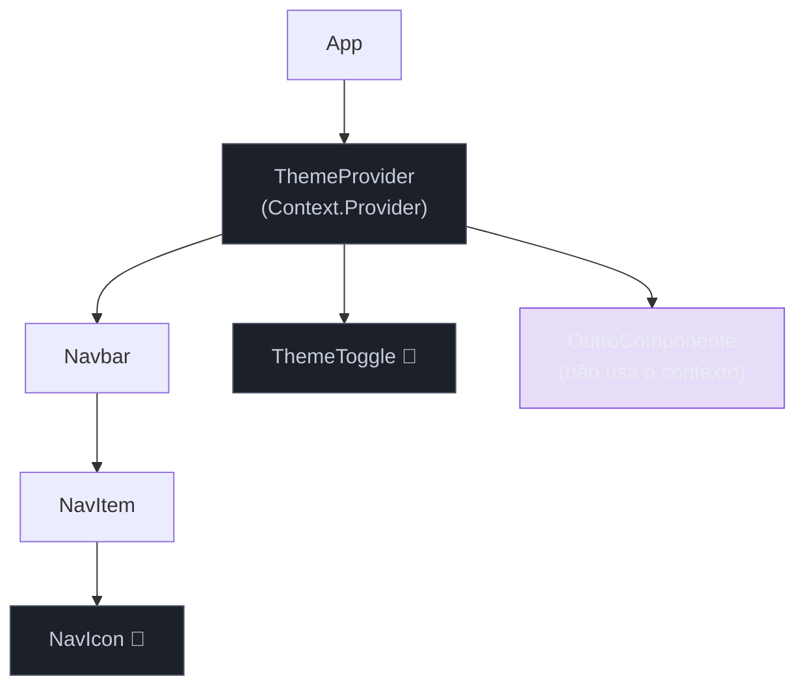

# Provider pattern

> [!abstract] TL;DR
> O Provider pattern resolve prop drilling sem biblioteca externa: você embrulha uma subárvore num `<Provider>`, expõe estado e/ou dispatch via Context, e qualquer descendente — independente de quão profundo — acessa o dado com um custom hook `useX()`. O trio canônico é Context + Provider component + custom hook com guard de Provider ausente. Para estado mais complexo, o "mini-Redux" combina `useReducer` dentro do Provider e split em `StateContext`/`DispatchContext` para evitar re-renders desnecessários. Kent C. Dodds popularizou as *context module functions* — helpers que recebem `dispatch` em vez de embutir a lógica no `value`. Use Provider quando a prop drilling ultrapassa 2-3 camadas ou quando múltiplos ramos da árvore precisam do mesmo dado; prefira uma lib externa (Zustand, Jotai) quando o estado cresce além de um subdomínio coeso ou quando a perf de re-renders se torna crítica.

## O problema que você já teve

Você tem um `ThemeContext` e quer que `Button`, `Card`, `Navbar` e `Modal` saibam qual tema está ativo. A solução óbvia é passar `theme` como prop para cada um — mas `Navbar` precisa passar para `NavItem`, que passa para `NavIcon`, que finalmente usa. Três camadas intermediárias carregando uma prop que nenhuma delas usa.

```tsx
// ❌ Prop drilling — cada camada só existe para repassar
function App({ theme }: { theme: Theme }) {
  return <Navbar theme={theme} />;
}
function Navbar({ theme }: { theme: Theme }) {
  return <NavItem theme={theme} />;
}
function NavItem({ theme }: { theme: Theme }) {
  return <NavIcon theme={theme} />;
}
function NavIcon({ theme }: { theme: Theme }) {
  // só aqui o theme é usado de verdade
  return <Icon color={theme.primary} />;
}
```

Três componentes poluídos com uma prop que não lhes pertence. O Provider pattern elimina esse repasse.

## O trio canônico: Context + Provider + custom hook

A analogia é uma rede elétrica: o Provider é a tomada na parede, o Context é a fiação invisível dentro da parede, e o custom hook é o plugue que qualquer componente pode encaixar. Você não precisa passar fio de cômodo em cômodo — qualquer componente que precisar de energia só encaixa o plugue.

```tsx
// theme/ThemeContext.tsx — O trio completo
import { createContext, useContext, useState, type ReactNode } from 'react';

// 1. Definir o tipo do contexto
interface ThemeContextValue {
  theme: 'light' | 'dark';
  toggleTheme: () => void;
}

// 2. Criar o contexto (undefined como sentinela — deliberado)
const ThemeContext = createContext<ThemeContextValue | undefined>(undefined);

// 3. Provider component — encapsula a lógica de estado
export function ThemeProvider({ children }: { children: ReactNode }) {
  const [theme, setTheme] = useState<'light' | 'dark'>('light');

  const toggleTheme = () =>
    setTheme((prev) => (prev === 'light' ? 'dark' : 'light'));

  return (
    <ThemeContext.Provider value={{ theme, toggleTheme }}>
      {children}
    </ThemeContext.Provider>
  );
}

// 4. Custom hook com guard de Provider ausente
export function useTheme(): ThemeContextValue {
  const ctx = useContext(ThemeContext);
  if (!ctx) {
    throw new Error('useTheme deve ser usado dentro de <ThemeProvider>');
  }
  return ctx;
}
```

O guard `if (!ctx)` é a peça mais negligenciada do trio. Sem ele, `useTheme()` retorna `undefined` silenciosamente e o erro aparece longe do verdadeiro problema. Com o guard, o erro aponta diretamente: "você esqueceu o Provider".

```tsx
// Uso — qualquer descendente acessa diretamente
function NavIcon() {
  const { theme } = useTheme(); // sem props extras
  return <Icon color={theme === 'dark' ? '#fff' : '#000'} />;
}

function ThemeToggle() {
  const { toggleTheme } = useTheme();
  return <button onClick={toggleTheme}>Alternar tema</button>;
}

function App() {
  return (
    <ThemeProvider>
      <Navbar />
      <ThemeToggle />
    </ThemeProvider>
  );
}
```

## Como o Provider injeta na subárvore



`Navbar` e `NavItem` ficam em cinza: eles não precisam saber que o contexto existe. Apenas os consumidores diretos (`NavIcon`, `ThemeToggle`) se conectam à fiação.

## Provider + Reducer: o "mini-Redux"

Quando o estado tem múltiplas transições nomeadas — `login`, `logout`, `updateProfile` — `useState` fica difícil de auditar. A combinação `useReducer` dentro do Provider reconstrói o ciclo Redux (`action → reducer → novo estado`) sem instalar nada.

A otimização crítica é separar `StateContext` e `DispatchContext`. O `dispatch` do `useReducer` é estável por design — sua referência nunca muda entre renders. Se você embutir estado e dispatch no mesmo objeto `value`, um componente que só despacha ações vai re-renderizar sempre que o estado mudar. Com o split, ele subscreve apenas ao `DispatchContext` e fica em paz.

```tsx
// auth/AuthContext.tsx — Provider + Reducer com split de contextos
import {
  createContext,
  useContext,
  useReducer,
  type Dispatch,
  type ReactNode,
} from 'react';

// --- tipos ---
interface User {
  id: string;
  name: string;
  email: string;
}

interface AuthState {
  user: User | null;
  isLoading: boolean;
}

type AuthAction =
  | { type: 'LOGIN_START' }
  | { type: 'LOGIN_SUCCESS'; payload: User }
  | { type: 'LOGIN_ERROR' }
  | { type: 'LOGOUT' };

// --- reducer puro ---
function authReducer(state: AuthState, action: AuthAction): AuthState {
  switch (action.type) {
    case 'LOGIN_START':
      return { ...state, isLoading: true };
    case 'LOGIN_SUCCESS':
      return { user: action.payload, isLoading: false };
    case 'LOGIN_ERROR':
      return { user: null, isLoading: false };
    case 'LOGOUT':
      return { user: null, isLoading: false };
    default:
      return state;
  }
}

// --- dois contextos separados ---
const AuthStateContext = createContext<AuthState | undefined>(undefined);
const AuthDispatchContext = createContext<Dispatch<AuthAction> | undefined>(undefined);

// --- Provider composto ---
export function AuthProvider({ children }: { children: ReactNode }) {
  const [state, dispatch] = useReducer(authReducer, {
    user: null,
    isLoading: false,
  });

  return (
    <AuthStateContext.Provider value={state}>
      <AuthDispatchContext.Provider value={dispatch}>
        {children}
      </AuthDispatchContext.Provider>
    </AuthStateContext.Provider>
  );
}

// --- hooks com guard ---
export function useAuthState(): AuthState {
  const ctx = useContext(AuthStateContext);
  if (!ctx) throw new Error('useAuthState fora de <AuthProvider>');
  return ctx;
}

export function useAuthDispatch(): Dispatch<AuthAction> {
  const ctx = useContext(AuthDispatchContext);
  if (!ctx) throw new Error('useAuthDispatch fora de <AuthProvider>');
  return ctx;
}
```

> [!question]- Por que o dispatch nunca muda de referência?
> O `useReducer` garante que a função `dispatch` retornada é estável — ela não é recriada em cada render. Isso é análogo ao `store.dispatch` do Redux: a identidade permanece constante durante o ciclo de vida do componente. Por isso, o `DispatchContext` nunca dispara re-renders em consumidores que só lêem `dispatch`.

## Context module functions (Kent C. Dodds)

Com o split acima, os consumidores ainda precisam montar a ação bruta: `dispatch({ type: 'LOGIN_SUCCESS', payload: user })`. Se você mudar o formato da action futuramente, precisa atualizar cada consumidor.

*Context module functions* resolvem isso: funções helper que vivem no mesmo módulo do contexto, recebem `dispatch` como argumento, e encapsulam o formato da action. Os consumidores chamam `login(dispatch, user)` — sem saber nada sobre o formato interno da action.

```tsx
// auth/AuthContext.tsx — adicionando context module functions
// (adicionar abaixo dos hooks, no mesmo arquivo)

// helper que encapsula a ação de login completa (async)
export async function login(
  dispatch: Dispatch<AuthAction>,
  credentials: { email: string; password: string }
): Promise<void> {
  dispatch({ type: 'LOGIN_START' });
  try {
    const response = await fetch('/api/auth/login', {
      method: 'POST',
      body: JSON.stringify(credentials),
      headers: { 'Content-Type': 'application/json' },
    });
    if (!response.ok) throw new Error('Credenciais inválidas');
    const user: User = await response.json();
    dispatch({ type: 'LOGIN_SUCCESS', payload: user });
  } catch {
    dispatch({ type: 'LOGIN_ERROR' });
  }
}

export function logout(dispatch: Dispatch<AuthAction>): void {
  dispatch({ type: 'LOGOUT' });
}
```

```tsx
// LoginForm.tsx — consumidor limpo
import { useAuthDispatch, login } from './auth/AuthContext';

export function LoginForm() {
  const dispatch = useAuthDispatch();

  const handleSubmit = (e: React.FormEvent<HTMLFormElement>) => {
    e.preventDefault();
    const form = e.currentTarget;
    const email = (form.elements.namedItem('email') as HTMLInputElement).value;
    const password = (form.elements.namedItem('password') as HTMLInputElement).value;
    login(dispatch, { email, password }); // lógica encapsulada no módulo
  };

  return (
    <form onSubmit={handleSubmit}>
      <input name="email" type="email" />
      <input name="password" type="password" />
      <button type="submit">Entrar</button>
    </form>
  );
}
```

A vantagem é dupla: o consumidor não conhece o formato da action, e a função helper é testável em isolamento (recebe `dispatch` mockado via injeção).

## Memoizar o value

Quando o Provider produz um objeto inline no `value`, esse objeto é recriado em cada render do Provider — mesmo que os dados não tenham mudado. Todo consumidor do contexto re-renderiza junto.

```tsx
// ❌ Objeto inline recriado em cada render do Provider
<ThemeContext.Provider value={{ theme, toggleTheme }}>

// ✅ Memoizado — novo objeto só quando theme muda
import { useMemo } from 'react';

const value = useMemo(() => ({ theme, toggleTheme }), [theme]);
<ThemeContext.Provider value={value}>
```

Com o split `StateContext`/`DispatchContext`, `useMemo` no value de estado ainda é útil se o objeto tiver campos calculados. Para o dispatch, é desnecessário — o próprio `useReducer` já garante estabilidade.

## Composição de múltiplos Providers

Aplicações reais empilham vários providers: `AuthProvider`, `ThemeProvider`, `QueryClientProvider`, `ToastProvider`. O resultado vira a pirâmide do inferno:

```tsx
// ❌ Provider hell — difícil de ler e reordenar
function App() {
  return (
    <QueryClientProvider client={queryClient}>
      <AuthProvider>
        <ThemeProvider>
          <ToastProvider>
            <RouterProvider router={router} />
          </ToastProvider>
        </ThemeProvider>
      </AuthProvider>
    </QueryClientProvider>
  );
}
```

A solução canônica sem biblioteca extra é um componente `AppProviders` que achata a composição:

```tsx
// providers/AppProviders.tsx — composição achatada
import type { ReactNode } from 'react';
import { QueryClientProvider } from '@tanstack/react-query';
import { AuthProvider } from './auth/AuthContext';
import { ThemeProvider } from './theme/ThemeContext';
import { ToastProvider } from './toast/ToastContext';
import { queryClient } from './queryClient';

// Array de providers — fácil de reordenar, adicionar ou remover
const providers: Array<({ children }: { children: ReactNode }) => JSX.Element> = [
  ({ children }) => <QueryClientProvider client={queryClient}>{children}</QueryClientProvider>,
  AuthProvider,
  ThemeProvider,
  ToastProvider,
];

// Compose: reduz da direita para a esquerda, preservando a ordem de aninhamento
export function AppProviders({ children }: { children: ReactNode }) {
  return providers.reduceRight(
    (acc, Provider) => <Provider>{acc}</Provider>,
    children
  ) as JSX.Element;
}

// App.tsx — limpo
function App() {
  return (
    <AppProviders>
      <RouterProvider router={router} />
    </AppProviders>
  );
}
```

`reduceRight` preserva a ordem: o primeiro provider da array fica mais externo (envolve todos os outros), exatamente como no aninhamento manual.

## Armadilhas comuns

> [!warning] Value objeto inline recria em cada render
> **O que acontece:** todo consumidor do contexto re-renderiza mesmo quando o estado não mudou. **Por quê:** `{ theme, toggleTheme }` é um novo objeto por referência a cada render do Provider. O React compara o value do Context por referência (`===`), não por valor. **Como evitar:** `const value = useMemo(() => ({ theme, toggleTheme }), [theme])` — ou use o split `StateContext`/`DispatchContext`, que elimina o problema para o dispatch.

> [!warning] useX sem guard de Provider ausente
> **O que acontece:** o hook retorna `undefined` silenciosamente. O erro acontece mais tarde, em outro componente, com uma mensagem ininteligível como "Cannot read properties of undefined". **Por quê:** sem o guard `if (!ctx) throw new Error(...)`, o `undefined` vaza para o consumidor. **Como evitar:** sempre inicialize o contexto com `undefined` (não com um valor padrão falso) e adicione o guard no custom hook. A mensagem de erro aponta exatamente onde o Provider está faltando.

> [!warning] Provider único gigante (God Context)
> **O que acontece:** um único `AppContext` com tema, usuário, carrinho, notificações e preferências. Qualquer mudança — mesmo num campo não relacionado — re-renderiza todos os consumidores. **Por quê:** o Context propaga para todos os consumidores registrados, independente de qual campo mudou. **Como evitar:** um Provider por domínio coeso (`AuthContext`, `ThemeContext`, `CartContext`). Se o estado de um domínio crescer muito, considere uma lib externa (Zustand, Jotai) que tem granularidade de subscription.

> [!warning] Inicializar contexto com valor padrão "falso" oculta uso incorreto
> **O que acontece:** `createContext({ theme: 'light', toggleTheme: () => {} })` parece seguro, mas o `toggleTheme` padrão não faz nada — um componente fora do Provider funciona silenciosamente de forma errada. **Por quê:** o valor padrão do `createContext` é usado quando não há Provider acima na árvore. Funções no-op mascaram o bug. **Como evitar:** use `createContext<ThemeContextValue | undefined>(undefined)` + guard no hook. Falhar ruidosamente em desenvolvimento é melhor que falhar silenciosamente em produção.

## Como explicar em inglês

The Provider pattern solves prop drilling by wrapping a subtree with a Context Provider component, making state available to any descendant through a custom hook — no matter how deeply nested. The canonical trio is: create a context with `undefined` as sentinel, a Provider component that owns the state, and a custom hook `useX()` with a guard that throws if the Provider is missing. For complex state, split into `StateContext` and `DispatchContext` so components that only dispatch actions don't re-render on every state change.

| PT | EN |
|----|----|
| Provider | Provider |
| prop drilling | prop drilling |
| contexto | context |
| despacho | dispatch |
| redução | reducer |
| fiação invisível | invisible wiring (analogia) |
| subárvore | subtree |
| guard de Provider ausente | missing Provider guard |
| funções auxiliares de módulo | context module functions |
| pirâmide do inferno | provider hell / pyramid of doom |
| memoizar | memoize |
| consumidor | consumer |

## Provider vs. lib externa: quando usar cada um

| Critério | Context + Provider | Lib externa (Zustand, Jotai) |
|---|---|---|
| Escopo do estado | Subárvore coesa (tema, auth) | Estado global cross-feature |
| Granularidade de re-render | Por consumidor de contexto | Por seletor (subscription granular) |
| DevTools | Limitado (React DevTools) | Nativo na lib (Zustand DevTools) |
| Dependências externas | Zero | +1 dependência |
| Curva de aprendizado | Baixa | Baixa (Zustand/Jotai são simples) |
| Async actions | Manual (context module fn) | Nativo (Zustand actions async) |
| Quando preferir | Até 2-3 contextos coesos | Estado cresce além de 1 domínio |

> [!question]- "Context substitui Redux?"
> Para a maioria das apps React modernas: sim, para estado de UI de escopo limitado. Não, se você precisa de DevTools avançados, middlewares, time-travel debugging ou estado global com subscrições granulares. O sweet spot do Provider pattern é estado de domínio (tema, autenticação, preferências) — não estado de servidor (use TanStack Query) nem estado de UI global complexo (use Zustand/Jotai).

## Provider em uma frase

O Provider pattern injecta dependências e estado em uma subárvore via Context, eliminando prop drilling e centralizando a lógica de estado num único lugar testável — sem biblioteca externa.

## O que vem a seguir

O Provider pattern cobre injeção de estado em subárvores, mas há padrões que vão além: o Compound Component pattern permite que componentes-filho se comuniquem implicitamente com o pai — um caso especial de Provider com API mais sofisticada. E quando o estado gerenciado pelo Provider crescer além de um domínio coeso, o passo natural é uma lib de estado externo como Zustand ou Jotai.

- [[03-Dominios/Tecnologia/React/React core/11 - useContext e Context API|React core 11 — useContext e Context API]] — mecanismo base do Provider: como o React propaga o value e quando os consumidores re-renderizam
- [[03-Dominios/Tecnologia/React/React core/12 - useReducer e estado complexo|React core 12 — useReducer e estado complexo]] — o reducer que alimenta o "mini-Redux" interno do Provider
- [[03-Dominios/Tecnologia/React/React core/15 - Estado - local, elevado e externo|React core 15 — Estado: local, elevado e externo]] — quando Provider não basta e uma lib externa entra em cena
- [[03-Dominios/Tecnologia/React/TypeScript com React/08 - Tipando Context API|TS-com-React 08 — Tipando Context API]] — como tipar contextos corretamente em TypeScript
- [[03-Dominios/Tecnologia/React/Dicionário de React|Dicionário de React]] — glossário de termos como Context, dispatch, reducer, consumer

## Fontes

- **Kent C. Dodds** — [*How to use React Context effectively*](https://kentcdodds.com/blog/how-to-use-react-context-effectively) — referência canônica para o split StateContext/DispatchContext e context module functions
- **Kent C. Dodds** — [*How to optimize your context value*](https://kentcdodds.com/blog/how-to-optimize-your-context-value) — técnicas de memoização e quando o split de contextos é necessário para perf
- **Lydia Hallie** — [*Provider Pattern*](https://javascriptpatterns.vercel.app/patterns/react-patterns/provider-pattern) — patterns.dev: catálogo visual do padrão com exemplos e trade-offs
- **Vitor Britto** — [*React Design Patterns: Provider Pattern*](https://medium.com/@vitorbritto/react-design-patterns-provider-pattern-b273ba665158) — explicação do trio Context + Provider + hook com foco em TypeScript
- **Steve Kinney** — [*Context API Performance Pitfalls*](https://stevekinney.com/courses/react-performance/context-api-performance-pitfalls) — análise de perf: por que o value inline e o Provider único causam re-renders
- **Matheus Plessmann** — [*Avoid Provider Hell with composition*](https://matheusplessmann.com/avoid-provider-hell-with-composition/) — padrão `AppProviders` com `reduceRight` para achatar a pirâmide de providers
