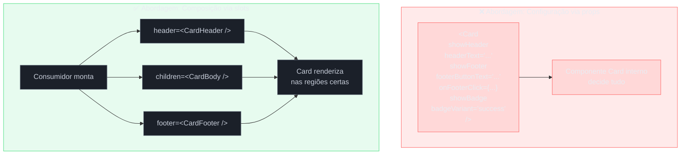

# Composição — slots, layout e children-as-API

> [!abstract] TL;DR
> Composição é o princípio central do React: montar UI combinando componentes menores em vez de configurá-los via herança ou explosão de props booleanas. O slot principal é `children: ReactNode`; slots adicionais são props tipadas (`header`, `sidebar`, `footer`) que aceitam JSX arbitrário. O resultado é uma API que o consumidor controla — chamada _children-as-API_. Quando você se pega adicionando a décima quinta prop booleana a um componente, é sinal de que a composição resolveria com menos código e mais clareza. Trade-off: exige que o consumidor monte a estrutura explicitamente; APIs mais verbosas para usos simples.

## O problema que você já teve

Você tem um componente `Card`. Primeiro, ele apenas mostra um título e um corpo. Depois alguém pede um botão de ação no rodapé. Depois, um badge no canto superior. Depois, a opção de renderizar um avatar no topo. Depois, um menu de três pontos. Depois, variantes com imagem de capa.

Seis meses depois, o componente está assim:

```tsx
// ❌ O caminho da explosão de props booleanas
<Card
  title="Plano Pro"
  showBadge
  badgeVariant="success"
  badgeText="Novo"
  showAvatar
  avatarUrl="/user.png"
  showFooterButton
  footerButtonText="Assinar"
  onFooterButtonClick={handleSubscribe}
  showCoverImage
  coverImageUrl="/banner.jpg"
  showMenu
  menuItems={[...]}
  isHighlighted
  isLoading={false}
/>
```

Quinze props, cada uma adicionada para um caso de uso que parecia razoável na época. Para descobrir o que é possível renderizar, você lê o código interno do componente. Para customizar o botão do rodapé (cor, ícone, estado disabled), você adiciona mais props. O componente virou um painel de controle.

A alternativa que resolve isso chama-se **composição**.

## O que é composição em React

Composição é a prática de construir UI **montando componentes menores em vez de configurar um único componente grande**. Em vez de empurrar dados e comportamentos via props, você passa JSX — componentes já prontos, estruturados pelo consumidor.

A analogia funciona assim: pense em um quadro de avisos. Você não configura o quadro dizendo "coloque um post-it amarelo no canto superior direito com o texto X e um azul embaixo com o texto Y". Você simplesmente **prega** os post-its onde quiser. O quadro é o container; o conteúdo é trazido por quem usa.

No React, esse "pregar post-its" acontece via `children` e via props de JSX.

## O slot principal: `children`

Todo componente React recebe `children` implicitamente via `props.children`. É o slot padrão — o que estiver entre as tags abertura e fechamento do componente vai parar ali.

```tsx
// Componente que aceita children — o slot principal
interface CardProps {
  children: React.ReactNode;
  className?: string;
}

function Card({ children, className }: CardProps) {
  return (
    <div className={`card ${className ?? ''}`}>
      {children}
    </div>
  );
}

// Consumidor monta livremente o interior
function ProductCard() {
  return (
    <Card>
      <h2>Plano Pro</h2>
      <p>Acesso ilimitado a todos os recursos.</p>
      <button onClick={handleSubscribe}>Assinar</button>
    </Card>
  );
}
```

`React.ReactNode` é o tipo correto para `children`: aceita strings, números, elementos JSX, arrays, `null`, `undefined` e fragmentos. Use-o sempre que o slot for arbitrário.

> [!question]- Por que não usar `React.ReactElement` no lugar de `ReactNode`?
> `ReactElement` aceita apenas elementos JSX — excluiria strings, números e `null`. Isso força o consumidor a embrulhar texto em `<span>`. `ReactNode` é mais permissivo e corresponde ao que o React realmente aceita como filhos. A única vez que `ReactElement` faz sentido é quando você precisa inspecionar ou clonar o elemento filho (`React.cloneElement`), como no padrão Compound Component.

## Múltiplos slots: props de JSX

Quando o layout tem **regiões nomeadas**, você adiciona props extras do tipo `ReactNode` — uma por slot. Isso é chamado de "named slots" ou simplesmente slots via props.

```tsx
// Componente com múltiplos slots nomeados
interface PageLayoutProps {
  header: React.ReactNode;
  sidebar: React.ReactNode;
  children: React.ReactNode; // conteúdo principal
  footer?: React.ReactNode;  // opcional — pode não aparecer
}

function PageLayout({ header, sidebar, children, footer }: PageLayoutProps) {
  return (
    <div className="page-layout">
      <header className="layout-header">{header}</header>
      <div className="layout-body">
        <aside className="layout-sidebar">{sidebar}</aside>
        <main className="layout-content">{children}</main>
      </div>
      {footer && (
        <footer className="layout-footer">{footer}</footer>
      )}
    </div>
  );
}

// Consumidor controla cada região
function DashboardPage() {
  return (
    <PageLayout
      header={<TopNav user={currentUser} />}
      sidebar={<NavigationMenu items={navItems} />}
      footer={<FooterLinks />}
    >
      <DashboardMetrics />
      <RecentActivity />
    </PageLayout>
  );
}
```

O `PageLayout` não sabe nada sobre `TopNav`, `NavigationMenu` ou `DashboardMetrics`. Ele apenas define **onde** cada região aparece. O consumidor decide **o quê** vai em cada lugar. Isso é _inversão de controle_ aplicada a layout.

> [!info] Slots opcionais com fallback
> Marque slots opcionais com `?` no tipo e use `&&` ou `?? <Fallback />` para renderização condicional. Um slot sem fallback que recebe `undefined` simplesmente não renderiza nada — comportamento correto na maioria dos casos.

## Children-as-API: estrutura como contrato

"Children-as-API" é quando você usa o JSX que o consumidor passa como forma de **expressar estrutura**, não apenas conteúdo. O componente espera um formato específico de filhos.

Um exemplo clássico são componentes de lista semanticamente estruturada:

```tsx
// Componente que define a estrutura esperada dos filhos
interface DefinitionListProps {
  children: React.ReactNode;
}

interface DefinitionItemProps {
  term: string;
  children: React.ReactNode; // a definição
}

function DefinitionList({ children }: DefinitionListProps) {
  return <dl className="definition-list">{children}</dl>;
}

function DefinitionItem({ term, children }: DefinitionItemProps) {
  return (
    <>
      <dt className="definition-term">{term}</dt>
      <dd className="definition-desc">{children}</dd>
    </>
  );
}

// A API emerge da estrutura do JSX — sem props de configuração
function GlossarySection() {
  return (
    <DefinitionList>
      <DefinitionItem term="Composição">
        Montar UI combinando componentes, não herdando comportamento.
      </DefinitionItem>
      <DefinitionItem term="Slot">
        Região de um componente que aceita JSX externo como ReactNode.
      </DefinitionItem>
    </DefinitionList>
  );
}
```

O contrato está no JSX — o consumidor sabe que `DefinitionList` espera `DefinitionItem`s como filhos. Isso é `children-as-API`: a estrutura dos filhos é a interface.

## Containment e Specialization — os dois casos canônicos

Os docs do React (e os originais do legacy.reactjs.org) identificam dois casos principais de composição:

**Containment** — o componente é um container genérico que não sabe o que vai dentro. Usa `children` diretamente. Exemplos: `Card`, `Modal`, `Panel`, `Dialog`. Não há restrição sobre o tipo de filho.

**Specialization** — um componente mais específico renderiza um componente mais genérico com configuração fixa, mas deixa o conteúdo livre. Um `ErrorDialog` é uma especialização de `Dialog`:

```tsx
// Componente genérico — containment
interface DialogProps {
  title: React.ReactNode;
  actions?: React.ReactNode;
  children: React.ReactNode;
}

function Dialog({ title, actions, children }: DialogProps) {
  return (
    <div role="dialog" className="dialog">
      <div className="dialog-header">{title}</div>
      <div className="dialog-body">{children}</div>
      {actions && <div className="dialog-footer">{actions}</div>}
    </div>
  );
}

// Specialization — fixa título e ações, mas deixa o corpo livre
interface ErrorDialogProps {
  onClose: () => void;
  children: React.ReactNode;
}

function ErrorDialog({ onClose, children }: ErrorDialogProps) {
  return (
    <Dialog
      title={<span className="error-title">Erro</span>}
      actions={<button onClick={onClose}>Fechar</button>}
    >
      {children}
    </Dialog>
  );
}

// Consumidor só decide o corpo
function NetworkErrorDialog({ onClose }: { onClose: () => void }) {
  return (
    <ErrorDialog onClose={onClose}>
      <p>Falha ao conectar. Verifique sua conexão e tente novamente.</p>
    </ErrorDialog>
  );
}
```

`ErrorDialog` fixa o padrão visual de erro (ícone, cor, botão "Fechar") mas não engessa o conteúdo da mensagem. Cada site de uso decide o texto.

## Layout components: Stack, Split e Card

Layout components são o uso mais comum de composição na prática. Eles encapsulam **lógica de layout** (espaçamento, grid, direção de fluxo) mas não têm opinião sobre o conteúdo.

```tsx
// Stack: organiza filhos em coluna com espaçamento uniforme
interface StackProps {
  gap?: number | string;
  align?: React.CSSProperties['alignItems'];
  children: React.ReactNode;
}

function Stack({ gap = '1rem', align = 'stretch', children }: StackProps) {
  return (
    <div
      style={{
        display: 'flex',
        flexDirection: 'column',
        gap,
        alignItems: align,
      }}
    >
      {children}
    </div>
  );
}

// Split: divide horizontalmente em dois painéis
interface SplitProps {
  left: React.ReactNode;
  right: React.ReactNode;
  ratio?: string; // ex: "1fr 2fr"
}

function Split({ left, right, ratio = '1fr 1fr' }: SplitProps) {
  return (
    <div style={{ display: 'grid', gridTemplateColumns: ratio, gap: '1rem' }}>
      <div>{left}</div>
      <div>{right}</div>
    </div>
  );
}

// Card com slots nomeados
interface CardFullProps {
  header?: React.ReactNode;
  children: React.ReactNode;
  footer?: React.ReactNode;
  className?: string;
}

function CardFull({ header, children, footer, className }: CardFullProps) {
  return (
    <article className={`card ${className ?? ''}`}>
      {header && <div className="card-header">{header}</div>}
      <div className="card-body">{children}</div>
      {footer && <div className="card-footer">{footer}</div>}
    </article>
  );
}

// Uso combinado — layout components compostos
function UserProfilePage() {
  return (
    <Stack gap="2rem">
      <Split
        ratio="240px 1fr"
        left={
          <CardFull header={<h2>Perfil</h2>}>
            <Avatar src={user.avatar} />
            <p>{user.name}</p>
          </CardFull>
        }
        right={
          <Stack gap="1rem">
            <CardFull header={<h3>Atividade recente</h3>}>
              <ActivityFeed items={activities} />
            </CardFull>
            <CardFull
              header={<h3>Conquistas</h3>}
              footer={<Link href="/badges">Ver todas</Link>}
            >
              <BadgeGrid badges={user.badges} />
            </CardFull>
          </Stack>
        }
      />
    </Stack>
  );
}
```

O ponto-chave: `Stack`, `Split` e `CardFull` são **genéricos de layout**, não de conteúdo. Eles podem ser usados em qualquer página sem modificação. O conteúdo é sempre responsabilidade do consumidor.

## Diagrama — composição vs configuração



## Composição vs configuração — trade-offs

| Critério | Configuração (props booleanas) | Composição (slots) |
|---|---|---|
| **Facilidade para o consumidor** | Alta para casos simples | Requer montar a estrutura |
| **Flexibilidade** | Limitada ao que o autor previu | Ilimitada — consumidor controla |
| **API discoverability** | Tipos de props são autocomplete | Requer conhecer os slots |
| **Manutenção do componente** | Cresce para cada novo caso | Estável — componente não muda |
| **Customização profunda** | Exige novas props a cada pedido | Já está no controle do consumidor |
| **Quando usar** | Variantes simples, bem definidas | Layouts, containers, shell de app |

A regra prática: se você está na **terceira prop booleana** para controlar a mesma região do componente, mude para um slot.

## Armadilhas comuns

> [!warning] Explosão de props booleanas
> **O que acontece:** o componente acumula `showHeader`, `showFooter`, `hasAvatar`, `isHighlighted` — cada booleana resolveu um caso mas criou rigidez. Seis meses depois, o componente tem 20 props e ninguém sabe o que é possível renderizar sem ler o código. **Por quê:** cada prop booleana é uma válvula que o author controla. O consumidor só pode escolher entre as válvulas existentes. **Como evitar:** identificar as regiões do componente e expô-las como slots (`ReactNode`). O consumidor monta o que quer em cada região, sem precisar do autor para cada variante nova.

> [!warning] Herança em vez de composição
> **O que acontece:** ao invés de usar `children`, o desenvolvedor cria `SpecialCard extends Card` (em class components) ou recria o interior do `Card` copiando JSX. O resultado é duas implementações que divergem com o tempo. **Por quê:** herança de componentes em React não existe como padrão — React recomenda explicitamente composição no lugar de herança desde os primeiros docs. **Como evitar:** use `specialization` via composição: o `ErrorCard` renderiza um `Card` com slots preenchidos, não uma subclasse. Isso é o padrão descrito nos docs como "containment + specialization".

> [!warning] Slot obrigatório sem fallback visível
> **O que acontece:** um slot é tipado como `React.ReactNode` (não opcional), mas o consumidor passa `undefined` ou se esquece do slot. O componente renderiza silenciosamente sem aquela região — o layout quebra sem erro. **Por quê:** `ReactNode` inclui `undefined`, então TypeScript não reclama mesmo que o slot seja "obrigatório". **Como evitar:** se o slot for estruturalmente necessário, use um fallback visual (`{header ?? <DefaultHeader />}`) ou adicione validação em runtime via `PropTypes` (projetos legados) ou `if (!header) throw new Error(...)` (em desenvolvimento). Em TypeScript, remover `undefined` do tipo força o consumidor a passar algo: `header: Exclude<React.ReactNode, undefined>` — embora verbose, sinaliza a intenção.

> [!warning] Passar JSX pesado como prop sem memoização
> **O que acontece:** um slot como `sidebar={<HeavySidebarComponent data={bigArray} />}` é recriado a cada render do pai, mesmo que `bigArray` não tenha mudado. **Por quê:** JSX é só `React.createElement(...)` — uma chamada de função. O elemento é um objeto novo a cada execução, mesmo que o conteúdo seja idêntico. **Como evitar:** se o slot contiver componentes pesados ou depender de dados estáveis, extraia para variável fora do JSX inline ou use `useMemo`. Mas não over-optimize: se o componente filho for leve ou usar `React.memo`, o overhead é negligenciável.

## Como explicar em inglês

In React, **composition** means assembling your UI from smaller pieces rather than configuring a single large component. Instead of passing fifteen boolean props to control what gets rendered, you pass JSX directly — as `children` for the main slot, or as named props (`header`, `sidebar`, `footer`) for specific regions. This gives consumers full control over the content of each region without requiring the component author to anticipate every use case.

The two canonical forms are **containment** (a generic container like `Card` or `Modal` that accepts any children) and **specialization** (a more specific component that renders a generic one with fixed configuration but open content slots).

| PT | EN |
|---|---|
| composição | composition |
| encaixe / slot | slot / named slot |
| filhos como API | children-as-API |
| contenção | containment |
| especialização | specialization |
| explosão de props booleanas | prop drilling / boolean prop explosion |
| inversão de controle | inversion of control |
| componente de layout | layout component |
| slot principal | primary slot / default slot |
| slot nomeado | named slot |
| componente genérico | generic container component |

## Resumo em 1 linha

Composição em uma frase: em vez de configurar o que o componente renderiza, você entrega o JSX pronto e o componente apenas decide onde colocá-lo.

## O que vem a seguir

Composição com `children` e slots nomeados resolve a maioria dos casos de layout e container. Mas quando os filhos precisam **compartilhar estado** entre si — como um `Tabs` onde o `TabList` e o `TabPanel` precisam saber qual aba está ativa — você precisa do padrão Compound Component, que adiciona Context ao modelo de composição.

Da mesma forma, quando você compõe componentes com TypeScript e quer garantir que apenas filhos do tipo certo sejam passados em um slot, os tipos avançados de `ReactNode` e as técnicas de generic components entram em cena.

- [[03-Dominios/Tecnologia/React/React core/08 - Renderização condicional e composição|React core 08 — Renderização condicional e composição]] — fundação: como `children` funciona no modelo de renderização do React, renderização condicional de slots e o padrão de containment em sua forma mais simples
- 07 - Compound components — próximo passo natural: quando os filhos precisam de estado compartilhado, composição evolui para compound components com Context
- [[03-Dominios/Tecnologia/React/TypeScript com React/14 - Compound components, slots, render props|TS-com-React 14 — Compound components, slots, render props]] — como tipar corretamente slots, discriminated unions para variantes de children e técnicas avançadas com `React.cloneElement`
- [[03-Dominios/Tecnologia/React/Dicionário de React|Dicionário de React]] — referência rápida de `ReactNode`, `ReactElement`, `children`, slots e demais termos usados nesta nota

## Fontes

- **React Team** — [*Passing JSX as children*](https://react.dev/learn/passing-props-to-a-component#passing-jsx-as-children) — documentação oficial de `children` e slots no React moderno
- **React Team (legacy)** — [*Composition vs Inheritance*](https://legacy.reactjs.org/docs/composition-vs-inheritance.html) — apresenta os padrões de containment e specialization; ainda a referência canônica para esses dois conceitos
- **GreatFrontEnd** — [*Explain the composition pattern in React*](https://www.greatfrontend.com/questions/quiz/explain-the-composition-pattern-in-react) — síntese orientada a entrevista com os trade-offs centrais
- **Persson Dennis** — [*21 Fantastic React Design Patterns and When to Use Them*](https://www.perssondennis.com/articles/21-fantastic-react-design-patterns-and-when-to-use-them) — catálogo abrangente incluindo composição, compound components e render props
- **Sandro Roth** — [*Building Component Slots in React*](https://sandroroth.com/blog/react-slots/) — implementação prática de named slots com TypeScript, com comparação com slots do Vue
- **Martin Hochel** — [*React children composition patterns with TypeScript*](https://medium.com/@martin_hotell/react-children-composition-patterns-with-typescript-56dfc8923c64) — tipagem avançada de `children` e slots com TypeScript, incluindo variantes de `ReactNode` vs `ReactElement`
- **Refine.dev** — [*React Design Patterns*](https://refine.dev/blog/react-design-patterns/) — visão geral de padrões modernos com ênfase em composição vs configuração
