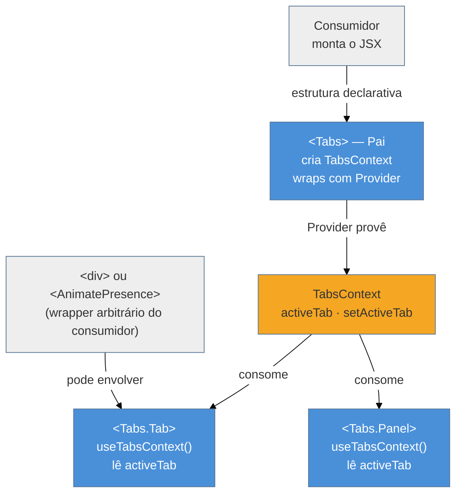

# Compound components

> [!abstract] TL;DR
> Compound components são um grupo de componentes que trabalham juntos compartilhando estado **implícito** via Context interno — o consumidor monta a estrutura (como `<Tabs><Tabs.Tab/><Tabs.Panel/></Tabs>`) sem precisar passar estado ou handlers para o pai. O mecanismo central é um Context criado dentro do componente pai e consumido pelos filhos; sub-componentes são anexados como propriedades estáticas (`Tabs.Tab`, `Tabs.Panel`) para formar uma API tipo namespace. O trade-off é que os sub-componentes dependem do contexto do pai — fora dele, devem lançar erro explícito. Ideal quando a UI tem partes variáveis em estrutura e ordem, e props de configuração já começaram a explodir.

## O problema que você já teve

Você precisa de um componente `Select` que exibe uma lista de opções. A primeira versão é simples — recebe `options: string[]`. Então vem o pedido de ícones por opção. Depois grupos. Depois tooltips. Depois itens desabilitados. Depois renderização completamente customizada por item. Seis meses depois, a interface está assim:

```tsx
// ❌ O Select que virou painel de controle
<Select
  options={items}
  renderOption={(item) => <span>{item.label}</span>}
  getOptionLabel={(item) => item.label}
  getOptionValue={(item) => item.value}
  getOptionIcon={(item) => item.icon}
  getOptionTooltip={(item) => item.tooltip}
  isOptionDisabled={(item) => item.disabled}
  optionGroups={groups}
  getGroupLabel={(g) => g.name}
  noOptionsMessage="Sem resultados"
  placeholder="Selecione..."
  isSearchable
  isClearable
  onChange={handleChange}
  value={selected}
/>
```

Vinte props, cada uma adicionada para um caso de uso razoável na época. Para descobrir o que é possível, você lê o código interno. Para adicionar uma nova variação, você adiciona mais uma prop. Para customizar o botão "limpar", você expõe `renderClearButton`. O componente virou um mini-framework.

A alternativa é **devolver o controle da estrutura para o consumidor**:

```tsx
// ✅ O Select como compound component
<Select value={selected} onChange={setSelected}>
  {groups.map((group) => (
    <Select.Group key={group.name} label={group.name}>
      {group.items.map((item) => (
        <Select.Option
          key={item.value}
          value={item.value}
          disabled={item.disabled}
          icon={<item.Icon />}
        >
          {item.label}
        </Select.Option>
      ))}
    </Select.Group>
  ))}
</Select>
```

Mesma funcionalidade — mas a estrutura é declarativa, o consumidor controla completamente o que renderiza e onde, e adicionar um novo tipo de item não exige tocar na API do `Select`.

## O mecanismo: Context interno compartilhado

O compound component é, na essência, um **Context Provider disfarçado de componente**. O componente pai cria um Context, armazena seu estado (qual aba está ativa, se o accordion está aberto, qual opção está selecionada) e o provê para toda a subárvore. Os filhos consomem esse Context diretamente — sem que o consumidor precise passar nada explicitamente entre eles.

A analogia: pense em peças de Lego que se encaixam porque têm conectores compatíveis **embutidos**. Você não precisa dizer para cada peça onde ela está na estrutura — elas se "reconhecem" pelo encaixe. No compound component, o Context é esse encaixe: o pai disponibiliza o estado, e os filhos o acessam onde quer que estejam na árvore.

O que diferencia esse pattern da composição simples via `children` (que você viu em [[06 - Composição - slots, layout e children-as-API]]) é exatamente isso: aqui há **estado compartilhado implicitamente**, não apenas JSX passado como prop. O consumidor monta a estrutura; o pai cuida do comportamento.



> [!question]- Por que Context e não `React.Children.map` + `cloneElement`?
> A versão antiga do padrão injetava props nos filhos via `cloneElement`. O problema: só funciona com filhos **diretos** do pai. Se o consumidor envolver um `<Tabs.Tab>` em um `<div>`, um `<AnimatePresence>` ou qualquer outro wrapper, o filho não recebe as props injetadas — e o comportamento quebra silenciosamente. Context resolve isso porque qualquer descendente, em qualquer profundidade, pode consumir o valor. Veja o mecanismo completo em [[03-Dominios/Tecnologia/React/React core/11 - useContext e Context API|React core 11]].

## Construindo do zero: Tabs em TypeScript

Vamos construir um `Tabs` completo, do Context ao uso final.

### Passo 1 — O Context com guard obrigatório

```tsx
// tabs/TabsContext.ts
import { createContext, useContext } from 'react'

interface TabsContextValue {
  activeTab: string
  setActiveTab: (id: string) => void
}

// undefined como default: detectamos uso fora do Provider
const TabsContext = createContext<TabsContextValue | undefined>(undefined)

export function useTabsContext(): TabsContextValue {
  const ctx = useContext(TabsContext)
  if (!ctx) {
    throw new Error(
      '<Tabs.Tab> e <Tabs.Panel> devem ser usados dentro de <Tabs>. ' +
      'Verifique se o sub-componente está aninhado corretamente.'
    )
  }
  return ctx
}

export { TabsContext }
```

A linha `if (!ctx) throw` é a mais importante do arquivo. Ela transforma um bug silencioso — estado `undefined`, comportamento imprevisível, erro difícil de rastrear — em uma mensagem de erro clara no momento exato em que o componente é mal usado.

### Passo 2 — O componente pai (Provider)

```tsx
// tabs/Tabs.tsx
import { useState, type ReactNode } from 'react'
import { TabsContext } from './TabsContext'
import { Tab } from './Tab'
import { Panel } from './Panel'
import { List } from './List'

interface TabsProps {
  defaultTab: string
  children: ReactNode
}

function TabsBase({ defaultTab, children }: TabsProps) {
  const [activeTab, setActiveTab] = useState(defaultTab)

  return (
    <TabsContext.Provider value={{ activeTab, setActiveTab }}>
      <div className="tabs">{children}</div>
    </TabsContext.Provider>
  )
}

// Namespace pattern: sub-componentes como propriedades estáticas
type TabsComponent = typeof TabsBase & {
  Tab: typeof Tab
  Panel: typeof Panel
  List: typeof List
}

const Tabs = TabsBase as TabsComponent
Tabs.Tab = Tab
Tabs.Panel = Panel
Tabs.List = List

export { Tabs }
```

### Passo 3 — Os sub-componentes

```tsx
// tabs/Tab.tsx
import type { ReactNode } from 'react'
import { useTabsContext } from './TabsContext'

interface TabProps {
  id: string
  children: ReactNode
}

function Tab({ id, children }: TabProps) {
  const { activeTab, setActiveTab } = useTabsContext()
  const isActive = activeTab === id

  return (
    <button
      role="tab"
      id={`tab-${id}`}
      aria-selected={isActive}
      aria-controls={`panel-${id}`}
      className={isActive ? 'tab tab--active' : 'tab'}
      onClick={() => setActiveTab(id)}
    >
      {children}
    </button>
  )
}

export { Tab }
```

```tsx
// tabs/Panel.tsx
import type { ReactNode } from 'react'
import { useTabsContext } from './TabsContext'

interface PanelProps {
  id: string
  children: ReactNode
}

function Panel({ id, children }: PanelProps) {
  const { activeTab } = useTabsContext()

  if (activeTab !== id) return null

  return (
    <div
      role="tabpanel"
      id={`panel-${id}`}
      aria-labelledby={`tab-${id}`}
    >
      {children}
    </div>
  )
}

export { Panel }
```

```tsx
// tabs/List.tsx — container semântico para os botões
import type { ReactNode } from 'react'

function List({ children }: { children: ReactNode }) {
  return <div role="tablist">{children}</div>
}

export { List }
```

### Passo 4 — Uso pelo consumidor

```tsx
// ProfilePage.tsx
import { Tabs } from './tabs/Tabs'

export function ProfilePage() {
  return (
    <Tabs defaultTab="info">
      <Tabs.List>
        <Tabs.Tab id="info">Informações</Tabs.Tab>
        <Tabs.Tab id="activity">Atividade</Tabs.Tab>
        <Tabs.Tab id="settings">Configurações</Tabs.Tab>
      </Tabs.List>

      <Tabs.Panel id="info">
        <UserInfo />
      </Tabs.Panel>
      <Tabs.Panel id="activity">
        <ActivityFeed />
      </Tabs.Panel>
      <Tabs.Panel id="settings">
        <SettingsForm />
      </Tabs.Panel>
    </Tabs>
  )
}
```

Note o que o consumidor **não** faz: não passa `activeTab` como prop, não escreve `onClick` handlers, não gerencia nenhum estado. A estrutura é declarativa, o estado é implícito — compartilhado via Context nos bastidores.

## Variação: sub-componentes como exports nomeados

Anexar sub-componentes via `Tabs.Tab = Tab` (dot notation / namespace pattern) é a convenção mais comum em design systems. Mas você pode exportar tudo separadamente:

```tsx
// ✅ Export separado — TypeScript mais simples, melhor tree-shaking
export { Tabs, Tab, Panel, List }

// Uso
import { Tabs, Tab, Panel, List } from './tabs'

<Tabs defaultTab="info">
  <List>
    <Tab id="info">Informações</Tab>
    <Tab id="activity">Atividade</Tab>
  </List>
  <Panel id="info"><UserInfo /></Panel>
  <Panel id="activity"><ActivityFeed /></Panel>
</Tabs>
```

| Abordagem | Vantagens | Desvantagens |
|-----------|-----------|--------------|
| `Tabs.Tab` (dot notation) | Agrupa visualmente; auto-complete sugere sub-componentes; relação explícita no JSX | Tipagem exige type casting; tree-shaking menos eficiente; mais verboso para configurar |
| Exports nomeados | TypeScript mais simples; melhor tree-shaking; componentes fáceis de testar isoladamente | Consumidor precisa conhecer todos os nomes; relação entre componentes fica implícita |

Para **design systems** com muitos componentes, dot notation é preferível — a relação fica explícita no JSX e o IDE ajuda. Para **bibliotecas de uso pontual** ou projetos menores, exports nomeados são mais simples de manter.

## Como Radix UI e Headless UI aplicam o padrão

As bibliotecas headless mais populares do ecossistema React são construídas em cima de compound components. Radix UI expõe seus primitivos exatamente assim:

```tsx
// Radix UI: Dialog como compound component de produção
import * as Dialog from '@radix-ui/react-dialog'

<Dialog.Root open={open} onOpenChange={setOpen}>
  <Dialog.Trigger asChild>
    <button>Abrir modal</button>
  </Dialog.Trigger>
  <Dialog.Portal>
    <Dialog.Overlay className="overlay" />
    <Dialog.Content className="content">
      <Dialog.Title>Confirmar ação</Dialog.Title>
      <Dialog.Description>Esta ação não pode ser desfeita.</Dialog.Description>
      <Dialog.Close asChild>
        <button>Fechar</button>
      </Dialog.Close>
    </Dialog.Content>
  </Dialog.Portal>
</Dialog.Root>
```

O que Radix adiciona além do pattern básico:

- **`asChild`** — em vez de renderizar o elemento padrão (`<button>`, `<div>`), mescla props e comportamento com o filho passado pelo consumidor. Isso remove a necessidade de estilizar o elemento interno do Radix — você traz o seu.
- **`Portal`** — sub-componente que renderiza fora da hierarquia DOM atual (via `ReactDOM.createPortal`), mas ainda consome o Context do `Root`. Prova que Context atravessa qualquer fronteira de renderização.
- **Atributos `data-state`** — o estado interno é exposto via atributos HTML (`data-state="open"`, `data-state="closed"`, `data-disabled`), permitindo estilizar via CSS sem precisar acessar o Context ou adicionar classes condicionais.
- **Controlled e Uncontrolled** — `Dialog.Root` aceita `open` + `onOpenChange` (controlled) ou funciona sem props (uncontrolled com estado interno). A API do consumidor é a mesma nos dois casos.

> [!info] Por que headless?
> Radix, Reach UI e Ark UI entregam comportamento e acessibilidade sem estilo — você traz o CSS. Compound components são o pattern que torna isso possível: o consumidor controla o que renderiza em cada parte, então aplicar classes Tailwind ou CSS modules é natural. A separação entre behavior e presentation é o núcleo da filosofia headless.

## Tipagem TypeScript do padrão

O namespace (`Tabs.Tab`) exige declarar os sub-componentes no tipo do pai:

```tsx
// Abordagem 1: type intersection (mais comum na prática)
type TabsComponent = typeof TabsBase & {
  Tab: typeof Tab
  Panel: typeof Panel
  List: typeof List
}

const Tabs = TabsBase as TabsComponent
Tabs.Tab = Tab
Tabs.Panel = Panel
Tabs.List = List
```

```tsx
// Abordagem 2: interface explícita (mais verbosa, mais legível em design systems)
interface TabsComposite extends React.FC<TabsProps> {
  Tab: React.FC<TabProps>
  Panel: React.FC<PanelProps>
  List: React.FC<{ children: ReactNode }>
}
```

Para tipar o Context corretamente, o truque é usar `undefined` como default e criar um hook com guard — exatamente como fizemos no `useTabsContext`. Isso garante que o TypeScript infira o tipo correto (sem `| undefined`) em todo lugar onde o hook é chamado.

Para tipagem avançada — discriminated unions no Context, tipos condicionais em slots, e como Radix tipar sub-componentes com `asChild` — veja [[03-Dominios/Tecnologia/React/TypeScript com React/14 - Compound components, slots, render props|TS-com-React 14]].

Consulte também o [[03-Dominios/Tecnologia/React/Dicionário de React|Dicionário de React]] para os termos canônicos usados neste galho.

## Armadilhas comuns

> [!warning] Filho usado fora do pai sem guard
> **O que acontece:** `<Tabs.Tab id="x">` renderizado fora de um `<Tabs>` acessa Context com valor `undefined`. O componente pode crashar com `TypeError: Cannot destructure property 'activeTab' of undefined` — ou pior, não crashar e exibir comportamento imprevisível. **Por quê:** `createContext(undefined)` não lança erro automaticamente; o `useContext` simplesmente retorna `undefined`. **Como evitar:** Sempre crie um hook `useFooContext()` com `if (!ctx) throw new Error(...)` antes de qualquer lógica. Isso transforma um runtime bug silencioso em uma mensagem de erro clara na raiz do problema.

> [!warning] Usar `React.Children` em vez de Context
> **O que acontece:** A versão "legada" do padrão usa `React.Children.map` + `cloneElement` para injetar props nos filhos. Se o consumidor envolver um `<Tabs.Tab>` em um `<div>`, `<AnimatePresence>`, `<Tooltip>` ou qualquer wrapper, o filho não recebe as props injetadas — e o comportamento quebra silenciosamente. **Por quê:** `React.Children` acessa apenas o **primeiro nível** da árvore de filhos. Context atravessa qualquer profundidade, incluindo portais e wrappers arbitrários. **Como evitar:** Use Context para o estado compartilhado. `React.Children` em compound components é um antipadrão legado; a única exceção razoável é `React.Children.only` para validar que há exatamente um filho.

> [!warning] Vazar estado explícito demais nas props dos filhos
> **O que acontece:** Você cria o Context, mas também passa `activeTab` como prop explícita em `<Tabs.Tab>` "por segurança". O consumidor passa a usar a prop em vez do Context. Agora existem dois mecanismos de controle conflitantes — qual tem precedência? O comportamento se torna imprevisível quando os dois divergem. **Por quê:** É tentador "facilitar" o uso expondo o estado no filho também, mas isso cria ambiguidade e bugs de sync. **Como evitar:** Estado que pertence ao Context não deve aparecer como prop nos filhos. Se o consumidor precisar controlar o estado externamente (controlled component), implemente o padrão controlled/uncontrolled **no pai** (`value` + `onChange` props), não nos filhos.

> [!warning] Re-renders desnecessários por Context de granularidade grossa
> **O que acontece:** Todos os sub-componentes re-renderizam sempre que qualquer parte do Context muda — mesmo os que não dependem do valor mudado. Em um Tabs com 20 painéis, mudar a aba ativa re-renderiza todos os `<Tabs.Panel>` (mesmo os ocultos). **Por quê:** `useContext` assina o objeto Context inteiro; não há seleção de slice como em Redux ou Zustand. **Como evitar:** Separe Contexts quando o estado tem partes independentes (`TabsStateContext` + `TabsDispatchContext`). Use `useMemo` para estabilizar o valor do Provider. Aplique `React.memo` nos filhos que consomem apenas partes estáveis do Context.

## Como explicar em inglês

Compound components let you build declarative APIs where the parent manages implicit shared state through an internal Context, and the consumer assembles the structure using sub-components — without passing state or handlers explicitly between them. Think of `<Tabs>`, `<Tabs.Tab>`, and `<Tabs.Panel>` as pieces that "speak the same language" internally (through the Context), so they coordinate automatically regardless of how the consumer nests them.

The key insight is inversion of control: instead of configuring behavior through a list of props on the parent, you hand the structural control back to whoever uses the component. They decide what renders and where; the parent decides how state flows.

| PT | EN |
|----|-----|
| componente composto | compound component |
| estado implícito | implicit state |
| sub-componente | sub-component |
| propriedades estáticas | static properties |
| notação de ponto | dot notation |
| inversão de controle | inversion of control |
| contexto interno | internal context |
| guard de contexto | context guard |
| headless | headless (sem tradução estabelecida) |
| explosão de props | prop explosion / prop drilling |
| controlled / uncontrolled | controlled / uncontrolled (termos mantidos em EN) |

## Trade-offs e quando usar

**Use compound components quando:**

- A UI tem partes variáveis em número, ordem ou estrutura (abas, acordeões, menus dropdown, selects com grupos, wizards, sidebars colapsáveis)
- O consumidor precisa intercalar seu próprio JSX entre as partes — wrappers de animação, condicionais, listas dinâmicas, itens extras
- Você está construindo um design system e quer que os consumidores componham sem depender de props de configuração
- A API com props já ultrapassou 5-7 props de configuração de layout

**Prefira outras abordagens quando:**

- A variação é apenas visual (cor, tamanho, variante) — props simples são melhores e mais diretas
- A estrutura é sempre a mesma e o consumidor nunca precisa reorganizá-la — um componente com slots opcionais (`header?`, `footer?`) é suficiente
- O contexto de uso é pequeno e temporário — o overhead de Context + sub-componentes + namespace não se justifica para um componente usado uma vez em um lugar fixo

**Compound components em uma frase:** é o pattern que devolve ao consumidor o controle da estrutura sem expor o estado interno.

## O que vem a seguir

Compound components resolvem a estrutura e o estado compartilhado implicitamente. Mas e quando o consumidor precisar controlar não só o que renderiza, mas também a **lógica de renderização** de cada parte — por exemplo, decidir em runtime como formatar cada item de uma lista? Para isso, o próximo passo natural é o **Render Props** pattern, que complementa o compound component quando a customização precisa ir além de JSX estático.

- [[03-Dominios/Tecnologia/React/React core/11 - useContext e Context API|React core 11]] — o mecanismo que alimenta compound components; entender a granularidade do Context evita os re-renders desnecessários da quarta armadilha
- [[03-Dominios/Tecnologia/React/TypeScript com React/14 - Compound components, slots, render props|TS-com-React 14]] — tipagem do namespace pattern, discriminated unions no Context, e como Radix tipar sub-componentes com `asChild`
- [[06 - Composição - slots, layout e children-as-API]] — o ponto de partida: composição via `children` é o fundamento que compound components estendem com estado compartilhado implícito

## Fontes

- **Kent C. Dodds** — [*React Hooks: Compound Components*](https://kentcdodds.com/blog/compound-components-with-react-hooks) — referência canônica do pattern com hooks modernos; explica a evolução de `cloneElement` para Context e por que a versão com Context é superior
- **patterns.dev** — [*Compound Pattern*](https://www.patterns.dev/react/compound-pattern/) — catálogo com exemplos visuais, comparação entre abordagens e análise de trade-offs
- **LogRocket Blog** — [*Understanding React compound components*](https://blog.logrocket.com/understanding-react-compound-components/) — foco em pitfalls de produção, granularidade de Context e casos onde o pattern não se justifica
- **Pasquale Favella** — [*Mastering the Compound Pattern in React: Building Declarative and Flexible Components with TypeScript*](https://pasquale-favella.github.io/blog/28) — tipagem avançada com TypeScript, incluindo type intersection e interface explícita
- **Radix UI** — [*Primitives*](https://www.radix-ui.com/primitives) — implementação de referência de compound components em design system headless de produção; mostra `asChild`, `Portal` e `data-state`
- **GreatFrontEnd** — [*Top Headless UI libraries for React in 2026*](https://www.greatfrontend.com/blog/top-headless-ui-libraries-for-react-in-2026) — panorama do ecossistema headless e como o pattern é aplicado em Radix, Ark UI e Base UI
