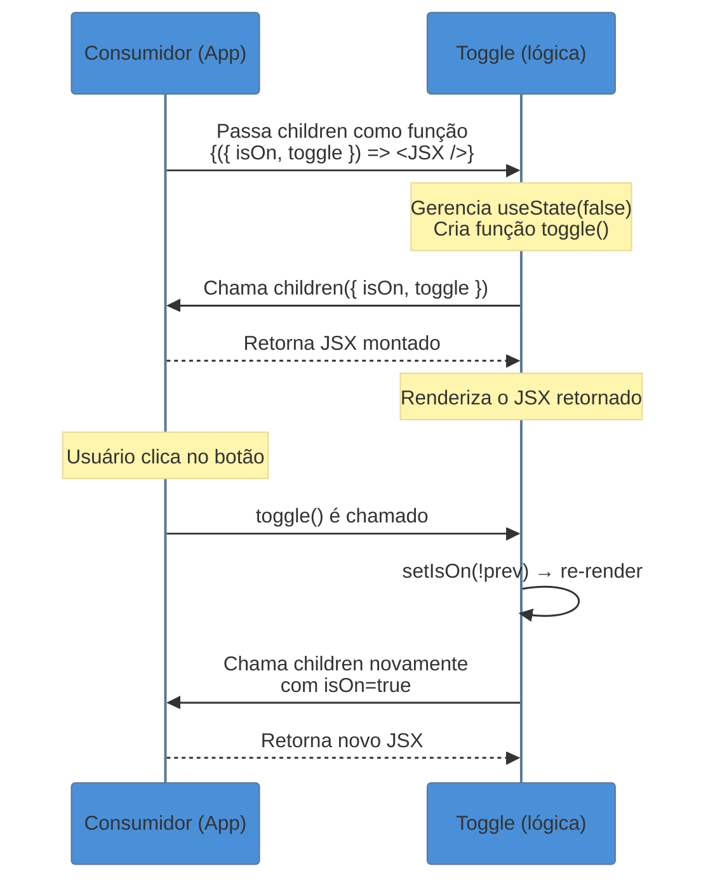

> [!abstract] TL;DR
> **Render prop** é uma técnica em que um componente aceita uma **função como prop** (chamada `render`, `children`, ou qualquer outro nome) e a invoca com seu estado interno, delegando ao consumidor decidir **o que** renderizar. O componente detém a lógica; o consumidor detém o template. Foi o grande substituto dos HOCs porque evitava wrappers invisíveis e tornava o fluxo de dados explícito — mas os custom hooks assumiram o protagonismo ao oferecer o mesmo reuso sem aninhamento de JSX. Em 2026, render props ainda têm lugar onde você precisa **controlar uma árvore de JSX** com base em estado interno, como libs de virtualização, drag-and-drop e componentes headless.

## O problema: lógica que precisa de dois donos

Imagine que você está construindo dois componentes: um `<Toggle>` que gerencia o estado aberto/fechado de um menu e um `<Accordion>` que gerencia o mesmo estado para seções expansíveis. A lógica de "abrir, fechar, alternar" é **idêntica**. O que muda é **o que aparece na tela**.

A tentação natural é duplicar o estado em cada componente. Mas quando a terceira tela pede a mesma lógica para um modal, você já está mantendo três cópias do mesmo `useState<boolean>(false)` espalhados pelo projeto.

> [!question]- Por que não criar um componente base que ambos estendem?
> React não tem herança de componentes — e é proposital. Herança em UI cria acoplamentos frágeis: o componente filho depende dos detalhes internos do pai. A solução do React é sempre **composição**. O render prop é uma das formas de composição onde a lógica sobe, e o template desce.

A questão central é: **como extrair a lógica (estado + comportamento) de um componente sem forçar um template específico?** Render props é uma das respostas.

---

## O mecanismo: você dá os ingredientes, o chef monta o prato

Pense no componente com render prop como um **chef de cozinha especializado**. Ele sabe exatamente como preparar a proteína, controlar o ponto, temperar. Mas o **prato final** — a apresentação, a guarnição, o molho — é decisão sua. Você não precisa aprender a cozinhar a proteína; só precisa dizer o que quer que apareça no prato.

No código, isso se traduz assim: o componente **gerencia o estado** e **chama uma função** passada como prop, entregando esse estado como argumento. O consumidor recebe o estado e decide o que renderizar.

```tsx
// O "chef": detém a lógica, chama a função-prop com o resultado
interface ToggleState {
  isOn: boolean;
  toggle: () => void;
}

interface ToggleProps {
  children: (state: ToggleState) => React.ReactNode;
}

function Toggle({ children }: ToggleProps) {
  const [isOn, setIsOn] = React.useState(false);

  const toggle = React.useCallback(() => {
    setIsOn((prev) => !prev);
  }, []);

  // O componente NÃO renderiza nada próprio — chama children como função
  return <>{children({ isOn, toggle })}</>;
}

// O consumidor: recebe o estado, decide o template
function App() {
  return (
    <Toggle>
      {({ isOn, toggle }) => (
        <div>
          <button onClick={toggle}>{isOn ? "Desligar" : "Ligar"}</button>
          {isOn && <p>O painel está visível.</p>}
        </div>
      )}
    </Toggle>
  );
}
```

Note o que aconteceu: `Toggle` não sabe nada sobre botões, textos ou painéis. Ele só sabe sobre `isOn` e `toggle`. O consumidor usa esses ingredientes do jeito que quiser.

---

## Diagrama: o fluxo de dados no render prop



O ciclo é: **estado sobe** (fica no `Toggle`), **template desce** (vem do consumidor via função). A cada re-render do `Toggle`, a função é chamada novamente com o estado atualizado.

---

## A variante: render prop explícita (não children)

A mesma ideia funciona com qualquer nome de prop. Nomear a prop de `render` ou `renderItem` é comum quando o componente aceita múltiplas funções de renderização:

```tsx
interface DataFetcherProps<T> {
  url: string;
  render: (state: {
    data: T | null;
    loading: boolean;
    error: Error | null;
  }) => React.ReactNode;
}

function DataFetcher<T>({ url, render }: DataFetcherProps<T>) {
  const [data, setData] = React.useState<T | null>(null);
  const [loading, setLoading] = React.useState(true);
  const [error, setError] = React.useState<Error | null>(null);

  React.useEffect(() => {
    setLoading(true);
    fetch(url)
      .then((res) => {
        if (!res.ok) throw new Error(`HTTP ${res.status}`);
        return res.json() as Promise<T>;
      })
      .then((json) => {
        setData(json);
        setLoading(false);
      })
      .catch((err: Error) => {
        setError(err);
        setLoading(false);
      });
  }, [url]);

  // Chama a função render com o estado atual
  return <>{render({ data, loading, error })}</>;
}

// Consumidor decide como tratar cada estado
interface User {
  id: number;
  name: string;
}

function UserProfile({ userId }: { userId: number }) {
  return (
    <DataFetcher<User>
      url={`/api/users/${userId}`}
      render={({ data, loading, error }) => {
        if (loading) return <Spinner />;
        if (error) return <ErrorMessage message={error.message} />;
        if (!data) return null;
        return <h1>{data.name}</h1>;
      }}
    />
  );
}
```

> [!example] Children vs. render prop nomeada
> Use **`children` como função** quando o consumo é linear — o conteúdo vai no "meio" do componente. Use **`render` ou `renderItem` nomeados** quando o componente aceita múltiplos slots de renderização (ex: `renderHeader`, `renderFooter`, `renderEmpty`), pois isso torna a intenção de cada slot explícita.

---

## Por que render props existiram: o problema dos HOCs

Antes dos render props, a solução dominante para reuso de lógica eram os **Higher-Order Components (HOCs)** — funções que recebiam um componente e retornavam outro componente com comportamentos adicionais injetados via props.

O HOC tinha um problema fundamental: **o componente resultante era uma caixa preta**. Se você fazia `withToggle(withFetch(withAuth(MyComponent)))`, era impossível saber, olhando para `MyComponent`, de onde vinham `isOn`, `data` e `user`. As props vinham de cima, invisíveis, podendo colidir silenciosamente em nome.

O render prop resolveu isso com **fluxo de dados explícito**: você vê exatamente quais dados estão disponíveis no momento em que os usa, porque eles aparecem como argumentos da função.

> Higher-Order Components são abordados em detalhes na nota 09 — Higher-Order Components (HOC) (ainda não publicada neste galho).

---

## Por que os hooks assumiram o lugar dos render props

Em 2019, o React introduziu hooks. A mesma lógica de `Toggle` que antes exigia um componente inteiro ficou redutível a isto:

```tsx
// O mesmo comportamento, sem JSX extra
function useToggle(initialValue = false) {
  const [isOn, setIsOn] = React.useState(initialValue);
  const toggle = React.useCallback(() => setIsOn((prev) => !prev), []);
  return { isOn, toggle };
}

// Uso: sem nenhum componente wrapper
function App() {
  const { isOn, toggle } = useToggle();

  return (
    <div>
      <button onClick={toggle}>{isOn ? "Desligar" : "Ligar"}</button>
      {isOn && <p>O painel está visível.</p>}
    </div>
  );
}
```

Compare: o hook é **mais plano** (sem aninhamento de JSX), **mais fácil de compor** (pode chamar vários hooks em sequência) e **mais fácil de testar** (é uma função pura). O render prop criava um nível extra na árvore de componentes — o hook não cria nenhum.

A regra prática: **se você só precisa compartilhar lógica de estado, um custom hook é quase sempre a escolha certa**. Veja [[04 - Custom hooks como padrão de reuso de lógica]] para a alternativa moderna.

---

## Quando render props AINDA fazem sentido em 2026

O hook substitui o render prop quando você quer **compartilhar estado e comportamento**. Mas ele não substitui quando você precisa **controlar uma porção da árvore de JSX**.

### 1. Libs de virtualização e drag-and-drop

Imagine que você tem 10.000 itens numa lista. A lib de virtualização precisa:
- Montar um container com `overflow: hidden`
- Calcular quais itens são visíveis
- Posicionar cada item de forma absoluta

Ela **precisa envolver seu JSX** com o container e **injetar posição em cada item**. Um hook pode te dar os dados de posição, mas não pode adicionar o container ao redor da sua lista. Um render prop pode:

```tsx
<VirtualList
  items={thousandItems}
  itemHeight={40}
  renderItem={({ item, style }) => (
    <div key={item.id} style={style}>
      {item.name}
    </div>
  )}
/>
```

### 2. Componentes headless com controle de markup

Libs como **Downshift** (combobox acessível) e **Radix UI** expõem comportamento sem impor HTML. Elas precisam injetar atributos ARIA e handlers de evento no **seu** markup:

```tsx
<Downshift
  onChange={(selection) => console.log(selection)}
  itemToString={(item) => (item ? item.value : "")}
>
  {({ getInputProps, getItemProps, isOpen, inputValue }) => (
    <div>
      <input {...getInputProps()} />
      {isOpen && (
        <ul>
          {items
            .filter((item) => item.includes(inputValue ?? ""))
            .map((item, index) => (
              <li key={item} {...getItemProps({ key: item, index, item })}>
                {item}
              </li>
            ))}
        </ul>
      )}
    </div>
  )}
</Downshift>
```

Um hook poderia retornar os `getInputProps` e `getItemProps`, mas ele não poderia garantir que você os aplica no elemento certo. O render prop cria um **contrato explícito**: você só consegue o JSX renderizado se passar a função com os elementos corretos.

### 3. Callback ref como render prop

Uma forma menos óbvia mas poderosa: usar a ref callback para expor o nó DOM ao consumidor:

```tsx
interface MeasureProps {
  children: (ref: React.RefCallback<HTMLElement>, size: DOMRect | null) => React.ReactNode;
}

function Measure({ children }: MeasureProps) {
  const [size, setSize] = React.useState<DOMRect | null>(null);

  const ref: React.RefCallback<HTMLElement> = React.useCallback((node) => {
    if (node) {
      setSize(node.getBoundingClientRect());
    }
  }, []);

  return <>{children(ref, size)}</>;
}

// Uso
<Measure>
  {(ref, size) => (
    <div ref={ref}>
      {size ? `Largura: ${size.width}px` : "Medindo..."}
    </div>
  )}
</Measure>
```

Aqui o consumidor decide qual elemento medir — o componente `Measure` só processa o resultado.

---

## A pirâmide de aninhamento: o preço do render prop

Quando você começa a compor múltiplos componentes com render prop, o código cresce horizontalmente como uma pirâmide invertida:

```tsx
// ⚠️ Render prop hell — cada camada adiciona indentação
<Auth>
  {({ user }) => (
    <DataFetcher url={`/api/posts?userId=${user.id}`}>
      {({ data: posts, loading }) => (
        <Toggle>
          {({ isOn, toggle }) =>
            loading ? (
              <Spinner />
            ) : (
              <PostList posts={posts} expanded={isOn} onToggle={toggle} />
            )
          }
        </Toggle>
      )}
    </DataFetcher>
  )}
</Auth>
```

Três níveis de aninhamento para combinar três comportamentos. O equivalente com hooks:

```tsx
// ✅ Com hooks — flat, legível
function PostsPage() {
  const { user } = useAuth();
  const { data: posts, loading } = useFetch(`/api/posts?userId=${user.id}`);
  const { isOn, toggle } = useToggle();

  if (loading) return <Spinner />;
  return <PostList posts={posts} expanded={isOn} onToggle={toggle} />;
}
```

> [!info] A pirâmide é um "code smell"
> Quando você se encontra aninhando mais de dois render props, questione se os casos internos poderiam ser custom hooks. A pirâmide é o sinal mais claro de que o render prop está sendo usado onde um hook resolveria melhor.

---

## Render prop vs. custom hook: a tabela de decisão

| Critério | Render prop | Custom hook |
|---|---|---|
| Precisa controlar estrutura JSX | ✅ Ideal | ✗ Não possível |
| Precisa envolver elementos com container | ✅ Ideal | ✗ Não possível |
| Injetar atributos em elementos do consumidor | ✅ Explícito | ⚠️ Possível, mas implícito |
| Compartilhar só estado/lógica | ⚠️ Funciona, mas verboso | ✅ Ideal |
| Composição de múltiplos comportamentos | ⚠️ Cria pirâmide | ✅ Flat, sequencial |
| Testabilidade | ⚠️ Precisa montar componente | ✅ Função pura, testável diretamente |
| Leitura para quem chega no código | ⚠️ Callbacks aninhados | ✅ Chamadas lineares |

**Resumo da decisão**: se o componente precisa **possuir parte do template**, use render prop. Se ele só precisa **compartilhar dados**, use hook.

---

## Armadilhas comuns

> [!warning] Função inline quebrando `React.memo`
> **O que acontece:** você passa uma arrow function como `children` ou `render` diretamente no JSX. A cada re-render do componente pai, uma **nova referência de função** é criada. Se o componente com render prop usa `React.memo`, ele re-renderiza mesmo assim, porque a prop mudou. **Por quê:** `React.memo` compara props por referência (`===`). Funções definidas inline têm nova referência a cada render. **Como evitar:** extraia a função para fora do JSX usando `useCallback`, ou use um componente intermediário para isolar o estado que causa o re-render.
> ```tsx
> // ❌ Nova referência a cada render
> <Toggle>{({ isOn }) => <Panel open={isOn} />}</Toggle>
>
> // ✅ Referência estável
> const renderPanel = useCallback(
>   ({ isOn }: ToggleState) => <Panel open={isOn} />,
>   []
> );
> <Toggle>{renderPanel}</Toggle>
> ```

> [!warning] Pirâmide de aninhamento não diagnosticada
> **O que acontece:** o código começa com um render prop, funciona, mais comportamentos são adicionados com mais render props aninhados. Depois de três sprints, você tem cinco níveis de indentação e um arquivo de 300 linhas para um componente "simples". **Por quê:** render props são fáceis de compor **localmente** mas escalam mal **em quantidade**. A pirâmide cresce naturalmente quando não há um critério de parada. **Como evitar:** ao adicionar o segundo render prop aninhado, questione se os casos internos (os que só compartilham estado) poderiam virar hooks. Mantenha render props apenas para os que precisam controlar JSX.

> [!warning] Usar render prop quando um hook resolveria — e pagar o custo de nada
> **O que acontece:** você cria um componente `<Toggle>` com render prop para reusar lógica de toggle. Funciona. Depois, a equipe usa ele em 15 lugares. Depois, uma otimização de performance precisa de `React.memo` em lugares críticos e aí descobre que as funções inline nos render props invalidam o memo em toda a árvore. **Por quê:** o render prop foi escolhido por familiaridade com o padrão, não por necessidade. Ele adicionou um nível à árvore de componentes sem nenhum benefício que um `useToggle()` não oferecesse. **Como evitar:** antes de criar um componente com render prop para reuso de lógica, pergunte: "este componente precisa possuir JSX, ou só estado?" Se a resposta for "só estado", crie um hook. O componente pode continuar existindo como conveniência de apresentação, mas a lógica fica no hook.

---

## Como explicar em inglês

Render props and function-as-child are patterns where a component accepts a **function as a prop** — often called `render` or passed as `children` — and calls it with its internal state, letting the consumer decide what to render. The component owns the logic; the consumer owns the template.

In modern React, custom hooks have replaced render props for pure logic sharing. But render props remain the right tool when a component needs to **own a portion of the JSX tree** — for example, a virtualized list that needs to wrap items in positioned containers, or a headless combobox that needs to inject ARIA attributes into your markup.

| PT | EN |
|----|-----|
| Render prop | Render prop |
| Função como filho | Function as child / Children as function |
| Padrão de reuso de lógica | Logic-sharing pattern |
| Pirâmide de aninhamento | Callback hell / Wrapper hell |
| Componente headless | Headless component |
| Fluxo de dados explícito | Explicit data flow |
| Delegar renderização | Delegate rendering |
| Estado interno | Internal state |
| Função de renderização | Render function |
| Injetar atributos | Inject attributes |

---

## Tipar render props com TypeScript

Render props e TypeScript combinam bem porque a assinatura da função é verificada estaticamente: o consumidor sabe exatamente quais propriedades estão disponíveis. Para casos avançados com generics (ex: `DataFetcher<T>`), veja [[03-Dominios/Tecnologia/React/TypeScript com React/14 - Compound components, slots, render props|TS-com-React 14]], que cobre tipagem de render props com tipos genéricos e discriminated unions para estados de loading/error/data.

Consulte o [[03-Dominios/Tecnologia/React/Dicionário de React|Dicionário de React]] para os termos do padrão.

---

> **Render prop em uma frase:** é um componente que não sabe o que renderizar — ele só sabe *quando* e *com quê* — e confia em você para montar o resultado.

---

## O que vem a seguir

Agora que você entende render props, você tem o contexto completo para ver por que os custom hooks vieram depois como uma alternativa mais simples — e quando ainda faz sentido pagar o custo dos render props. Também pode olhar para o padrão anterior que render props substituiu:

- [[04 - Custom hooks como padrão de reuso de lógica]] — a alternativa moderna que "achatou" a pirâmide de render props; entender render props torna a motivação dos hooks mais clara
- Higher-Order Components (HOC) — o padrão que render props substituiu; nota 09 deste galho (ainda não publicada)

---

## Fontes

- **Lydia Hallie / patterns.dev** — [*Render Props Pattern*](https://www.patterns.dev/react/render-props-pattern/) — referência visual canônica do padrão, com animações do ciclo de dados
- **React Patterns** — [*Function as Child Component*](https://reactpatterns.js.org/docs/function-as-child-component/) — catálogo de padrões React com foco em função-como-filho
- **Kent C. Dodds** — [*React Hooks: What's going to happen to render props?*](https://kentcdodds.com/blog/react-hooks-whats-going-to-happen-to-render-props) — análise da transição render props → hooks pelo criador de libs como downshift
- **LogRocket Blog** — [*React render props vs. custom Hooks*](https://blog.logrocket.com/react-render-props-vs-custom-hooks/) — comparação pragmática com exemplos de produção
- **react-in-patterns** — Krasimir Tsonev — capítulo sobre render props: fundamentos, trade-offs e contexto histórico pré-hooks
- **React Docs (legado)** — [*Render Props*](https://legacy.reactjs.org/docs/render-props.html) — documentação original do padrão antes da era hooks; útil para entender a motivação histórica
