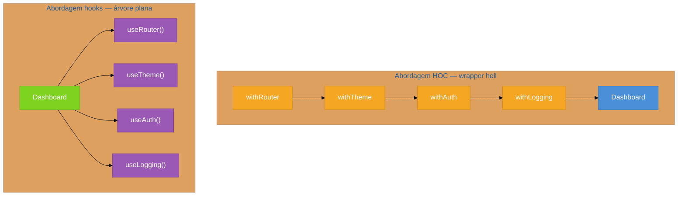

# Higher-Order Components (HOC)

> [!abstract] TL;DR
> Um HOC é uma **função que recebe um componente e retorna um novo componente** — o original embrulhado em comportamento adicional. Foi o mecanismo dominante de reuso de lógica cross-cutting antes dos hooks: autenticação, loading states, logging, tema — tudo injetado via props extras sem tocar no componente original. O preço era alto: wrapper hell na árvore de componentes, colisão silenciosa de nomes de props, refs que se perdiam e tipagem TypeScript que exigia malabarismo com generics. Desde React 16.8, custom hooks resolvem 80–90 % dos casos com menos cerimônia. Mas HOCs não morreram: `React.memo`, `React.forwardRef`, `observer` do MobX, `withProfiler` do Sentry e `connect` do Redux clássico seguem ativos em 2026. Ler HOC é ler o vocabulário de metade do ecossistema legado.

## O problema que motivou o padrão

Imagine que você tem dez rotas na aplicação — Dashboard, Perfil, Configurações, Relatórios, Admin… — e todas precisam verificar se o usuário está autenticado antes de renderizar. A solução ingênua é copiar o bloco de verificação em cada uma:

```tsx
// ❌ Lógica de auth copiada em cada componente — o pesadelo de manutenção
function Dashboard() {
  const { user, isLoading } = useAuth();
  if (isLoading) return <Spinner />;
  if (!user) return <Navigate to="/login" />;
  return <DashboardContent />;
}

function Profile() {
  const { user, isLoading } = useAuth();
  if (isLoading) return <Spinner />;
  if (!user) return <Navigate to="/login" />;
  return <ProfileContent />;
}
// ... repetido mais oito vezes
```

Três meses depois, o design system muda o `<Spinner />` para `<LoadingScreen />`. Você precisa encontrar e substituir em dez componentes. Algum escapa. O bug vai para produção.

Esse é o problema clássico de **lógica cross-cutting duplicada** — lógica que atravessa componentes sem pertencer a nenhum em particular. Antes dos hooks, o React não tinha um mecanismo nativo para extrair essa lógica. A comunidade inventou os Higher-Order Components.

## A analogia do embrulho de presente

Pense em um componente como um presente. Você pode enrolar esse presente em papel novo — adicionar uma fita, uma tag, uma caixa maior — sem abrir nem modificar o que está dentro. Quando alguém recebe o presente, ele parece diferente por fora, mas o conteúdo original está intacto.

Um HOC faz exatamente isso: pega um componente (`WrappedComponent`), cria uma função que o renderiza com props extras injetadas, e retorna esse novo componente embrulhado. O componente original não sabe que está sendo embrulhado. Quem usa o HOC recebe o embrulho todo — funcionalidade nova mais o original dentro.

## Como um HOC funciona

Um HOC é simplesmente uma função de ordem superior aplicada a componentes:

```
withX(ComponenteOriginal) → ComponenteEnriquecido
```

Por dentro, o HOC cria um novo componente que:
1. Executa a lógica cross-cutting (verificar auth, buscar dados, registrar eventos)
2. Renderiza `WrappedComponent` passando as props recebidas **mais** as props injetadas
3. Repassa `ref` e estáticos quando necessário

```mermaid
%%{init: {"theme": "base", "themeVariables": {"primaryColor": "#4A90D9", "edgeLabelBackground": "#ffffff"}}}%%
graph TD
    APP["App / Router"]:::normal --> HOC["withAuth(Dashboard)"]:::normal
    HOC --> |"verifica user, isLoading"| GATE{Autenticado?}:::decision
    GATE -- Não --> NAV["&lt;Navigate to='/login' /&gt;"]:::warning
    GATE -- Carregando --> SPIN["&lt;LoadingScreen /&gt;"]:::warning
    GATE -- Sim --> DASH["&lt;Dashboard user=&#123;user&#125; /&gt;"]:::success

    classDef normal fill:#4A90D9,color:#fff,stroke:#3a7bc8
    classDef decision fill:#F5A623,color:#fff,stroke:#d4901f
    classDef warning fill:#F5A623,color:#fff,stroke:#d4901f
    classDef success fill:#7ED321,color:#fff,stroke:#6ab81c
```



## Convenções obrigatórias

Quatro regras que todo HOC de produção precisa respeitar — ignorar qualquer uma cria bugs sutis difíceis de rastrear.

### 1. Prefixo `with`

Por convenção universal, HOCs são nomeados `withX`: `withAuth`, `withRouter`, `withTheme`, `withLoading`. O prefixo sinaliza "este é um HOC" sem precisar ler a implementação.

### 2. Copiar o `displayName`

O React DevTools mostra o nome do componente na árvore. Sem `displayName`, você vê `Component` ou `_c` em vez de `withAuth(Dashboard)` — debugging vira adivinhação.

```tsx
EnhancedComponent.displayName = `withAuth(${getDisplayName(WrappedComponent)})`;

function getDisplayName<T>(Component: React.ComponentType<T>): string {
  return Component.displayName ?? Component.name ?? 'Component';
}
```

### 3. Fazer forward de props E de ref

O HOC recebe todas as props que seriam passadas para o componente original. Se guardar alguma para si, o componente embrulhado fica sem ela. A regra: passe tudo o que o HOC não consume explicitamente com `{...props}`.

Refs não viajam com `props` — `ref` é tratado de forma especial pelo React. Para que refs atravessem o HOC, é preciso envolver com `React.forwardRef`.

### 4. Içar estáticos não-React (`hoistNonReactStatics`)

Se `Dashboard.fetchData` for um método estático (padrão de data fetching server-side em alguns frameworks), o componente embrulhado não herda esse estático automaticamente. A lib `hoist-non-react-statics` copia todos os estáticos não-React do original para o wrapper:

```tsx
import hoistNonReactStatics from 'hoist-non-react-statics';
hoistNonReactStatics(EnhancedComponent, WrappedComponent);
```

## Exemplo completo: `withAuth` tipado com generics

Aqui está um `withAuth` TypeScript-first que respeita todas as quatro convenções:

```tsx
import React from 'react';
import { Navigate } from 'react-router-dom';
import hoistNonReactStatics from 'hoist-non-react-statics';
import { useAuth } from '../hooks/useAuth';

// Props que o HOC injeta no componente embrulhado
interface WithAuthProps {
  currentUser: { id: string; name: string; role: string };
}

// LoadingScreen e Navigate usados internamente pelo HOC
function LoadingScreen() {
  return <div role="status" aria-label="Carregando…" />;
}

/**
 * withAuth — HOC que protege componentes autenticados.
 *
 * P extends WithAuthProps garante que o componente embrulhado
 * declara que espera receber `currentUser`.
 * Omit<P, keyof WithAuthProps> remove `currentUser` da interface
 * pública do componente retornado — quem usa não precisa passar
 * essa prop: o HOC a injeta.
 */
function withAuth<P extends WithAuthProps>(
  WrappedComponent: React.ComponentType<P>
) {
  // Ref forwarding: permite que refs do consumidor atravessem o HOC
  const WithAuth = React.forwardRef<
    React.ElementRef<typeof WrappedComponent>,
    Omit<P, keyof WithAuthProps>
  >((props, ref) => {
    const { user, isLoading } = useAuth();

    if (isLoading) return <LoadingScreen />;
    if (!user) return <Navigate to="/login" replace />;

    // Casting necessário porque Omit<P, ...> + WithAuthProps não colapsa
    // automaticamente de volta para P sem assertiva
    return (
      <WrappedComponent
        {...(props as unknown as P)}
        ref={ref}
        currentUser={user}
      />
    );
  });

  // Convenção: displayName legível no DevTools
  WithAuth.displayName = `withAuth(${getDisplayName(WrappedComponent)})`;

  // Iça estáticos não-React (ex: fetchData, defaultProps herdados)
  hoistNonReactStatics(WithAuth, WrappedComponent);

  return WithAuth;
}

function getDisplayName<T>(Component: React.ComponentType<T>): string {
  return Component.displayName ?? Component.name ?? 'Component';
}

export default withAuth;
```

### Consumo

```tsx
// Dashboard declara que precisa de currentUser
interface DashboardProps extends WithAuthProps {
  title: string;
}

function Dashboard({ currentUser, title }: DashboardProps) {
  return (
    <main>
      <h1>{title}</h1>
      <p>Olá, {currentUser.name}</p>
    </main>
  );
}

// ProtectedDashboard NÃO exige currentUser — o HOC injeta
const ProtectedDashboard = withAuth(Dashboard);

// Uso no roteador: só passa `title`
<Route path="/dashboard" element={<ProtectedDashboard title="Painel" />} />
```

> [!question]- Por que `Omit<P, keyof WithAuthProps>` em vez de só `P`?
> Sem o `Omit`, o TypeScript exigiria que quem usasse `ProtectedDashboard` passasse `currentUser` manualmente — mas o HOC já injeta essa prop. O `Omit` "remove" a prop injetada da interface pública do componente retornado: quem consome vê apenas as props que ainda precisam ser fornecidas.

## Por que os hooks aposentaram os HOCs

Quando os hooks chegaram em React 16.8 (2019), ficou claro que eles resolviam o mesmo problema de reuso de lógica stateful com muito menos cerimônia. Antes de entender por quê os HOCs perderam, veja o que cada abordagem faz com a mesma lógica de auth:

```tsx
// HOC: cria um novo componente, injeta via props
const ProtectedDashboard = withAuth(Dashboard);

// Hook: chama dentro do componente, lê direto
function Dashboard() {
  const { user, isLoading } = useAuth();
  // ...
}
```

Os problemas estruturais dos HOCs que os hooks eliminam:

### Wrapper hell

Quando você empilha vários HOCs, a árvore de componentes no DevTools explode:

```
withRouter(
  withTheme(
    withAuth(
      withLogging(Dashboard)
    )
  )
)
```

No DevTools, isso vira quatro camadas de componentes aninhados para chegar no `Dashboard`. Debugging de qualquer prop ou comportamento exige navegar por quatro níveis. Hooks compostos são chamadas no mesmo componente — árvore plana, zero wrapper.



### Colisão silenciosa de props

Se dois HOCs injetam uma prop com o mesmo nome, o segundo sobrescreve o primeiro silenciosamente — sem erro, sem aviso. TypeScript não detecta isso em tempo de compilação quando os HOCs são compostos dinamicamente. Com hooks, cada chamada retorna valores com nome explícito escolhido pelo componente:

```tsx
// HOC: colisão — qual `theme` vence?
const Comp = withThemeDark(withThemeLight(Dashboard));

// Hook: sem colisão — o nome é definido no componente
const darkTheme = useDarkTheme();
const lightTheme = useLightTheme();
```

### Indireção e tipagem difícil

Rastrear de onde uma prop vem num componente embrulhado por três HOCs exige ler as implementações de todos. Com hooks, `Ctrl+Click` no hook leva direto à fonte. A tipagem TypeScript de HOCs compostos também é notoriamente difícil — genéricos encadeados geram erros enigmáticos.

## Onde HOCs ainda aparecem em 2026

Mesmo sendo um padrão "aposentado" para código novo, HOCs continuam vivos em 2026. Você vai encontrá-los nestas situações:

### Libs que nunca migraram completamente

**Redux clássico** — `connect(mapStateToProps, mapDispatchToProps)(Component)` segue sendo o padrão em bases de código que não migraram para Redux Toolkit + hooks. Dezenas de milhares de repositórios ativos usam `connect`.

**MobX** — `observer(Component)` do `mobx-react` é um HOC que subscreve o componente a observáveis automaticamente. O `mobx-react-lite` modernizou a API, mas o padrão HOC persiste:

```tsx
import { observer } from 'mobx-react-lite';

const Dashboard = observer(function Dashboard() {
  return <div>{store.userName}</div>;
});
```

### Ferramentas de observabilidade e erro

**Sentry** — `withProfiler(Component)` e `withSentryRouting(Component)` são HOCs que instrumentam componentes com tracing automático sem exigir mudança no código do componente:

```tsx
import * as Sentry from '@sentry/react';

const TrackedDashboard = Sentry.withProfiler(Dashboard, { name: 'Dashboard' });
```

**Error Boundaries** — `withErrorBoundary(Component, fallback)` do `react-error-boundary` permite envolver qualquer componente com tratamento de erro sem criar manualmente uma classe ErrorBoundary.

### APIs "HOC-like" do próprio React

`React.memo(Component)` e `React.forwardRef(renderFn)` são tecnicamente HOCs — funções que recebem e retornam componentes. O React os expõe como APIs de primeira classe, não como convenção da comunidade:

```tsx
// React.memo é um HOC built-in
const MemoizedDashboard = React.memo(Dashboard, (prev, next) =>
  prev.userId === next.userId
);

// React.forwardRef também — cria um componente que aceita ref
const FancyInput = React.forwardRef<HTMLInputElement, InputProps>(
  (props, ref) => <input ref={ref} {...props} />
);
```

> [!info] React 19 e refs
> No React 19, `ref` passou a ser uma prop comum em componentes de função — `React.forwardRef` deixou de ser necessário para o caso básico. Para libs que publicam componentes tipados com a API antiga, o padrão HOC-like de `forwardRef` ainda aparece por compatibilidade.

## HOC vs hook — quando usar cada um

| Critério | HOC | Custom hook |
|----------|-----|-------------|
| Lógica stateful (useState, useEffect) | Funciona, mas hook é mais simples | Preferido |
| Lógica aplicada a **qualquer componente** sem modificá-lo | Ponto forte | Exige modificar o componente |
| Integração com lib que usa HOC internamente | Obrigatório | Não se aplica |
| Compatibilidade com class components | Sim | Não (hooks não rodam em classes) |
| Árvore de DevTools limpa | Piora (um wrapper por HOC) | Mantém plana |
| Tipagem TypeScript | Verbosa (generics, Omit) | Natural (inferência direta) |
| Testabilidade | Exige montar o wrapper | `renderHook` isola a lógica |
| Composição de múltiplos padrões | Wrapper hell | Chamadas sequenciais |

**Regra de bolso:** se você está escrevendo código novo, use custom hook. Se está consumindo uma lib que expõe HOC, ou precisa embrulhar um class component, ou a lógica precisa ser aplicada externamente sem tocar no componente — use HOC.

HOC em uma frase: uma função que embrulha um componente em outro para injetar comportamento sem modificar o original — poderosa antes dos hooks, hoje reservada para libs legadas e casos onde o componente não pode ser alterado.

## Armadilhas comuns

> [!warning] Colisão silenciosa de nomes de props
> **O que acontece:** o HOC injeta uma prop chamada `theme`; o componente original também tem uma prop `theme`. O HOC sobrescreve o valor sem aviso, o componente renderiza com dado errado. **Por quê:** o spread `{...props, theme: injectedTheme}` sobrescreve qualquer `theme` já em `props`. **Como evitar:** prefixe props injetadas com o nome do HOC (`auth_user`, `withAuth_user`) ou escolha nomes muito específicos que dificilmente colidem (`currentUser` em vez de `user`). Documente as props injetadas no tipo `WithXProps`.

> [!warning] Ref perdida sem forwardRef
> **O que acontece:** você passa um `ref` para `ProtectedDashboard`; a ref aponta para o wrapper do HOC, nunca chega ao elemento interno. **Por quê:** `ref` não é uma prop comum — o React intercepta e não a inclui no objeto `props`. **Como evitar:** sempre envolva o HOC com `React.forwardRef` quando o componente pode precisar de ref. Em React 19+, `ref` virou prop normal — mas libs que compila para React 18 ainda precisam de `forwardRef`.

> [!warning] Wrapper hell — composição de múltiplos HOCs
> **O que acontece:** quatro HOCs empilhados criam quatro componentes extras na árvore. O DevTools mostra `withRouter > withTheme > withAuth > withLogging > Dashboard`. Cada re-render percorre todas as camadas. **Por quê:** cada HOC retorna um novo componente React — a árvore de renderização reflete cada nível. **Como evitar:** limite HOCs a casos onde hooks não resolvem. Se precisar de múltiplos HOCs, compose com `compose` do lodash/Redux ou pipeline manual; a árvore ainda terá N wrappers, mas o código de consumo fica legível. Prefira refatorar para hooks sempre que possível.

> [!warning] Criar HOC quando hook resolve — complexidade desnecessária
> **O que acontece:** você escreve `withData(Component)` que injeta dados buscados — mas o componente é um componente de função que já pode chamar `useData()` diretamente. **Por quê:** HOC adiciona uma camada de indireção que não acrescenta nada se o componente pode usar hooks. **Como evitar:** antes de escrever um HOC, pergunte: "o componente pode chamar um hook diretamente?" Se sim, escreva o hook. HOC só quando o componente não pode ser modificado (class component, componente de terceiro) ou quando a lib exige HOC.

> [!warning] Não içar estáticos com hoistNonReactStatics
> **O que acontece:** `Dashboard.getServerSideProps` existe no original; `withAuth(Dashboard).getServerSideProps` é `undefined`. O servidor não executa o data fetching. **Por quê:** o wrapper criado pelo HOC é um componente novo — ele não herda automaticamente estáticos do original. **Como evitar:** use `hoistNonReactStatics(Wrapper, WrappedComponent)` antes de retornar o wrapper, ou copie manualmente os estáticos necessários.

## Como explicar em inglês

A Higher-Order Component is a function that takes a component and returns a new component that wraps the original, injecting additional props or behavior without modifying the source. It's the React equivalent of a decorator pattern — you enhance a component from the outside. Before hooks, HOCs were the standard way to share cross-cutting concerns like authentication, logging, and theming across multiple components. Today, custom hooks handle most of those cases more cleanly, but HOCs remain present in libraries like MobX, Sentry, and Redux classic.

| PT | EN |
|----|-----|
| Componente de ordem superior | Higher-Order Component (HOC) |
| Embrulhar / encapsular | Wrap |
| Injetar props | Inject props |
| Preocupação transversal | Cross-cutting concern |
| Içar estáticos | Hoist statics |
| Encaminhamento de ref | Ref forwarding |
| Inferno de wrappers | Wrapper hell |
| Colisão de props | Props collision |
| Compor HOCs | Compose HOCs |
| Aposentar / substituir | Supersede / replace |

## O que vem a seguir

Entender HOCs coloca os hooks em perspectiva histórica: eles existem porque o problema que os HOCs resolviam precisava de uma solução sem wrapper hell. O próximo passo natural é ver como os custom hooks assumiram esse papel e por que o fizeram de forma mais limpa.

- [[04 - Custom hooks como padrão de reuso de lógica]] — o padrão que substituiu HOCs; veja como a mesma lógica de auth do `withAuth` acima vira um `useAuth` sem embrulhos
- [[03-Dominios/Tecnologia/React/TypeScript com React/index|TypeScript com React]] — para ir fundo em generic components, `Omit`, `ComponentPropsWithRef` e os outros tipos utilitários que tornam HOCs tipados toleráveis

Para o vocabulário dos termos usados nesta nota (HOC, cross-cutting concern, hoist statics), veja o [[03-Dominios/Tecnologia/React/Dicionário de React|Dicionário de React]].

## Fontes

- **patterns.dev** — [*HOC Pattern*](https://www.patterns.dev/react/hoc-pattern/) — referência canônica do padrão com animações e exemplos
- **React (legacy docs)** — [*Higher-Order Components*](https://legacy.reactjs.org/docs/higher-order-components.html) — documentação original da equipe React; ainda autoritativa para convenções (displayName, hoistNonReactStatics)
- **Robin Wieruch** — [*Why React Hooks over HOCs*](https://www.robinwieruch.de/react-hooks-higher-order-components/) — análise comparativa profunda HOC vs hooks com exemplos migrados
- **LogRocket Blog** — [*How to use React higher-order components*](https://blog.logrocket.com/react-higher-order-components/) — guia prático com TypeScript, forwardRef e casos de uso modernos
- **Steve Kinney** — [*Typing Higher-Order Components Without Tears*](https://stevekinney.com/courses/react-typescript/higher-order-components-typing) — curso React+TypeScript; seção HOC com generics e Omit
- **MobX docs** — [*React Integration*](https://mobx.js.org/react-integration.html) — HOC `observer` em uso ativo em 2026
- **James Ravenscroft** — [*React Higher-Order Component Patterns in TypeScript*](https://medium.com/@jrwebdev/react-higher-order-component-patterns-in-typescript-42278f7590fb) — padrões enhancer vs injector tipados em TypeScript
