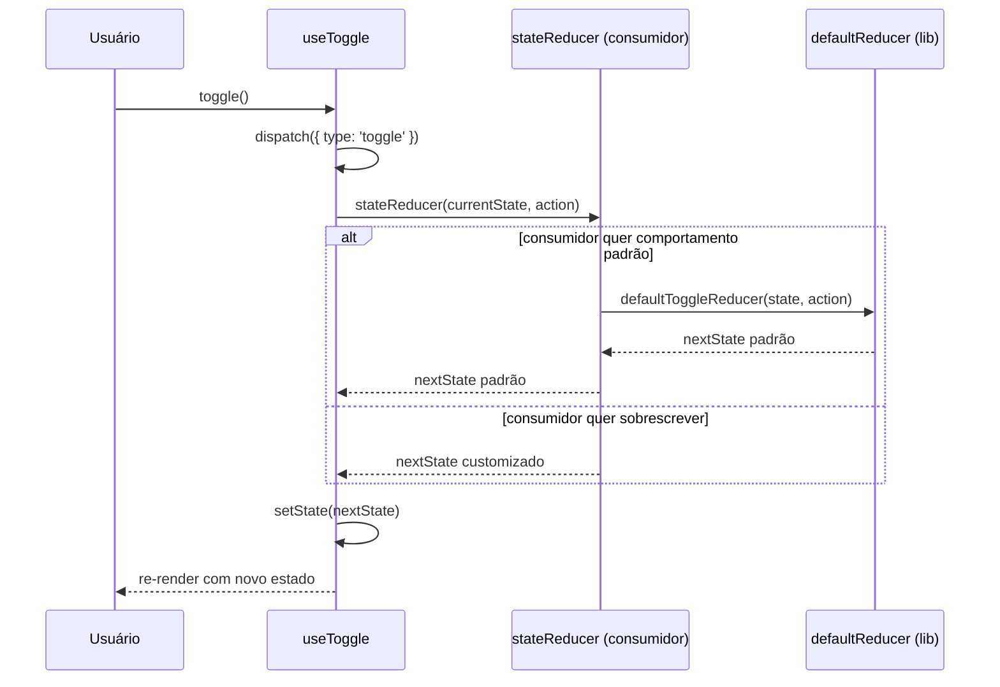
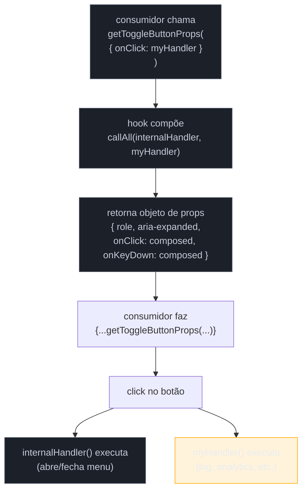

# State reducer e prop getters

> [!abstract] TL;DR
> **State reducer** expõe o reducer interno de um hook para que o consumidor intercepte e customize transições de estado — inversão de controle máxima sem que a biblioteca precise prever cada caso de uso. **Prop getters** expõem funções (`getToggleButtonProps`, `getItemProps`) que retornam um objeto de props prontas para espalhar no JSX do consumidor, compondo handlers internos e externos automaticamente. Juntos, formam o núcleo de hooks headless robustos (downshift, Radix, React Aria): o hook controla o comportamento; o consumidor controla a estrutura e pode sobrescrever qualquer transição de estado. O preço é complexidade de API — aplicar em componentes simples é over-engineering deliberado.

---

## O problema que justifica tudo isso

Imagine que você está construindo um hook `useSelect` para um design system interno. Ele precisa lidar com abertura/fechamento do menu, navegação por teclado, seleção de item e acessibilidade WAI-ARIA. Você escreve tudo, testa, lança.

Dois dias depois chega o primeiro pedido: "Preciso que o menu não feche ao selecionar um item — quero multi-seleção". Uma semana depois: "Preciso que, quando o usuário pressiona Escape, o menu não feche se houver input ativo dentro dele". Depois: "Preciso que itens desabilitados não sejam selecionáveis via teclado".

Cada pedido te força a adicionar uma prop: `closeOnSelect`, `keepOpenOnEscape`, `disabledItems`. Em seis meses você tem vinte props booleanas e condicionais entrelaçadas no reducer interno. A API está explodindo — e você ainda não previu todos os casos de uso futuros.

**O estado reducer pattern** resolve isso de forma elegante: em vez de adicionar uma prop para cada variação, você expõe o próprio reducer interno ao consumidor. Ele intercepta qualquer transição de estado e decide o que acontece. Você não precisa prever nada — o consumidor tem o volante.

---

## Inversão de controle: a analogia do volante

Um motorista de aplicativo (a biblioteca) segue rotas padronizadas. Se você quiser dar uma parada intermediária, você precisa pedir ao motorista — e ele decide se aceita. Isso é controle normal: a biblioteca decide o comportamento.

Agora imagine que você aluga o carro (o hook) e dirige você mesmo. O carro ainda tem o GPS, os freios ABS, o controle de tração — toda a mecânica está lá. Mas você decide a rota. Se quiser dar a parada intermediária, não precisa perguntar a ninguém.

State reducer = você aluga o carro. A biblioteca fornece a mecânica (estado, ações, reducer padrão), mas você pode substituir ou estender o reducer para mudar o que acontece em cada ação.

> [!question]- Mas isso não é perigoso? O consumidor pode quebrar tudo.
> Sim — e é intencional. O state reducer é uma ferramenta para **power users** e composição de bibliotecas, não para uso casual. O hook sempre fornece um `defaultReducer` que o consumidor pode chamar para preservar o comportamento padrão e só interceptar o que precisa mudar.

---

## State Reducer Pattern

### O mecanismo

O hook aceita um parâmetro opcional `stateReducer`. Internamente, em vez de usar seu próprio reducer diretamente, usa uma função `dispatch` que passa a ação para o `stateReducer` do consumidor antes de aplicar qualquer mudança de estado.

```
ação disparada → stateReducer(state, action) → novo estado
                        ↑
              consumidor decide o que retornar
              (pode chamar defaultReducer para comportamento padrão)
```

O contrato é simples: `stateReducer(state, action) => nextState`. O consumidor recebe o estado atual e a ação, e retorna o próximo estado — seja o padrão, seja algo completamente diferente.

### Implementação: `useToggle` com state reducer

```tsx
// tipos exportados para que o consumidor possa tipar seu stateReducer
export type ToggleState = { isOn: boolean }

export type ToggleAction =
  | { type: 'toggle' }
  | { type: 'on' }
  | { type: 'off' }
  | { type: 'reset'; initialState: ToggleState }

type ToggleReducer = (state: ToggleState, action: ToggleAction) => ToggleState

interface UseToggleOptions {
  initialState?: ToggleState
  stateReducer?: ToggleReducer
}

// reducer padrão — exportado para que o consumidor possa compor com ele
export function defaultToggleReducer(
  state: ToggleState,
  action: ToggleAction,
): ToggleState {
  switch (action.type) {
    case 'toggle':
      return { isOn: !state.isOn }
    case 'on':
      return { isOn: true }
    case 'off':
      return { isOn: false }
    case 'reset':
      return action.initialState
    default:
      return state
  }
}

export function useToggle({
  initialState = { isOn: false },
  stateReducer = defaultToggleReducer,
}: UseToggleOptions = {}) {
  // useReducer usa o stateReducer do consumidor, não o interno diretamente
  const [state, dispatch] = React.useReducer(
    (s: ToggleState, a: ToggleAction) => stateReducer(s, a),
    initialState,
  )

  const toggle = () => dispatch({ type: 'toggle' })
  const setOn = () => dispatch({ type: 'on' })
  const setOff = () => dispatch({ type: 'off' })
  const reset = () => dispatch({ type: 'reset', initialState })

  return { ...state, toggle, setOn, setOff, reset }
}
```

### Consumidor: limitando o número máximo de cliques

```tsx
function App() {
  const [clickCount, setClickCount] = React.useState(0)

  function myStateReducer(
    state: ToggleState,
    action: ToggleAction,
  ): ToggleState {
    // se tentarem ligar após 4 toggles, bloqueia
    if (action.type === 'toggle' && clickCount >= 4) {
      return { isOn: false } // força desligado sem chamar o padrão
    }
    // para todo o resto, comportamento normal
    const nextState = defaultToggleReducer(state, action)
    if (nextState.isOn !== state.isOn) {
      setClickCount((c) => c + 1)
    }
    return nextState
  }

  const { isOn, toggle } = useToggle({ stateReducer: myStateReducer })

  return (
    <div>
      <button onClick={toggle}>{isOn ? 'Desligar' : 'Ligar'}</button>
      <p>{clickCount >= 4 ? 'Limite atingido' : `Cliques: ${clickCount}`}</p>
    </div>
  )
}
```

O consumidor chama `defaultToggleReducer` para o comportamento padrão e intercepta só o que precisa. Isso é composição, não substituição total.

---

## Fluxo: como o state reducer intercepta uma ação



---

## Prop Getters Pattern

### O problema específico

Você expôs seu hook headless `useSelect`. O consumidor precisa colocar `role="listbox"`, `aria-expanded`, `aria-activedescendant`, `onKeyDown` (para navegação por teclado), `onClick` (para fechar ao clicar fora), e uma dúzia de outros atributos nos elementos certos. Se você listar isso em docs, ele vai esquecer metade, implementar errada a outra metade, e quebrar a acessibilidade.

Prop getters resolvem isso: em vez de documentar cada atributo, o hook expõe funções que retornam o objeto completo de props. O consumidor só precisa fazer `{...getMenuProps()}` no elemento certo.

### O mecanismo: composição de handlers

A parte mais importante não é retornar props — é **compor handlers**. Se o consumidor passa `onClick` para `getMenuProps({ onClick: myHandler })`, o resultado deve chamar tanto `myHandler` quanto o handler interno do hook.

```tsx
// utilitário de composição de handlers (reusável em qualquer prop getter)
function callAll<T extends unknown[]>(
  ...fns: Array<((...args: T) => void) | undefined>
) {
  return (...args: T) => {
    fns.forEach((fn) => fn?.(...args))
  }
}
```

### Implementação: `useSelect` com prop getters

```tsx
export interface SelectItem {
  value: string
  label: string
  disabled?: boolean
}

interface UseSelectState {
  isOpen: boolean
  selectedItem: SelectItem | null
  highlightedIndex: number
}

interface UseSelectOptions {
  items: SelectItem[]
  onSelectedItemChange?: (item: SelectItem | null) => void
  stateReducer?: (
    state: UseSelectState,
    action: { type: string; payload?: unknown },
  ) => UseSelectState
}

export function useSelect({
  items,
  onSelectedItemChange,
  stateReducer,
}: UseSelectOptions) {
  const [state, dispatch] = React.useReducer(
    (s: UseSelectState, a: { type: string; payload?: unknown }) => {
      const defaultNext = defaultSelectReducer(s, a, items)
      return stateReducer ? stateReducer(s, { ...a, _defaultNext: defaultNext } as never) : defaultNext
    },
    { isOpen: false, selectedItem: null, highlightedIndex: -1 },
  )

  const menuRef = React.useRef<HTMLUListElement>(null)
  const toggleButtonRef = React.useRef<HTMLButtonElement>(null)

  function selectItem(item: SelectItem) {
    if (item.disabled) return
    dispatch({ type: 'selectItem', payload: item })
    onSelectedItemChange?.(item)
  }

  // ─── prop getter: botão que abre/fecha o menu ───────────────────────────
  function getToggleButtonProps<
    T extends React.HTMLAttributes<HTMLButtonElement>,
  >(extraProps?: T) {
    return {
      ref: toggleButtonRef,
      role: 'combobox' as const,
      'aria-expanded': state.isOpen,
      'aria-haspopup': 'listbox' as const,
      onClick: callAll(
        () => dispatch({ type: state.isOpen ? 'closeMenu' : 'openMenu' }),
        extraProps?.onClick,
      ),
      onKeyDown: callAll(
        handleToggleKeyDown,
        extraProps?.onKeyDown,
      ),
      ...extraProps,
      // sobrescreve onClick/onKeyDown para garantir composição
      onClick: callAll(
        () => dispatch({ type: state.isOpen ? 'closeMenu' : 'openMenu' }),
        extraProps?.onClick,
      ),
      onKeyDown: callAll(handleToggleKeyDown, extraProps?.onKeyDown),
    }
  }

  // ─── prop getter: container da lista ────────────────────────────────────
  function getMenuProps<T extends React.HTMLAttributes<HTMLUListElement>>(
    extraProps?: T,
  ) {
    return {
      ref: menuRef,
      role: 'listbox' as const,
      'aria-label': 'Opções',
      onKeyDown: callAll(handleMenuKeyDown, extraProps?.onKeyDown),
      ...extraProps,
      onKeyDown: callAll(handleMenuKeyDown, extraProps?.onKeyDown),
    }
  }

  // ─── prop getter: cada item da lista ────────────────────────────────────
  function getItemProps<T extends React.HTMLAttributes<HTMLLIElement>>(
    item: SelectItem,
    index: number,
    extraProps?: T,
  ) {
    return {
      role: 'option' as const,
      'aria-selected': state.selectedItem?.value === item.value,
      'aria-disabled': item.disabled,
      'data-highlighted': index === state.highlightedIndex,
      onClick: callAll(
        () => selectItem(item),
        extraProps?.onClick,
      ),
      ...extraProps,
      onClick: callAll(() => selectItem(item), extraProps?.onClick),
    }
  }

  function handleToggleKeyDown(e: React.KeyboardEvent) {
    if (e.key === 'ArrowDown') {
      e.preventDefault()
      dispatch({ type: 'openMenu' })
    }
  }

  function handleMenuKeyDown(e: React.KeyboardEvent) {
    if (e.key === 'ArrowDown') {
      e.preventDefault()
      dispatch({ type: 'highlightNext' })
    } else if (e.key === 'ArrowUp') {
      e.preventDefault()
      dispatch({ type: 'highlightPrev' })
    } else if (e.key === 'Enter') {
      const item = items[state.highlightedIndex]
      if (item) selectItem(item)
    } else if (e.key === 'Escape') {
      dispatch({ type: 'closeMenu' })
      toggleButtonRef.current?.focus()
    }
  }

  return {
    ...state,
    getToggleButtonProps,
    getMenuProps,
    getItemProps,
  }
}
```

### Consumidor: marcação 100% sob controle do desenvolvedor

```tsx
function ColorSelect() {
  const colors: SelectItem[] = [
    { value: 'red', label: 'Vermelho' },
    { value: 'green', label: 'Verde' },
    { value: 'blue', label: 'Azul' },
    { value: 'purple', label: 'Roxo', disabled: true },
  ]

  const {
    isOpen,
    selectedItem,
    highlightedIndex,
    getToggleButtonProps,
    getMenuProps,
    getItemProps,
  } = useSelect({
    items: colors,
    onSelectedItemChange: (item) => console.log('selecionado:', item),
  })

  return (
    <div className="select-container">
      <button
        {...getToggleButtonProps({
          // handler próprio composto com o interno automaticamente
          onClick: () => console.log('toggle clicado'),
        })}
        className="select-button"
      >
        {selectedItem?.label ?? 'Escolha uma cor'}
        <span aria-hidden>{isOpen ? '▲' : '▼'}</span>
      </button>

      <ul
        {...getMenuProps()}
        className={`select-menu ${isOpen ? 'open' : 'closed'}`}
      >
        {isOpen &&
          colors.map((color, index) => (
            <li
              key={color.value}
              {...getItemProps(color, index, {
                // handler próprio também composto
                onClick: () => console.log('item clicado:', color.value),
              })}
              className={[
                'select-item',
                highlightedIndex === index ? 'highlighted' : '',
                color.disabled ? 'disabled' : '',
              ].join(' ')}
            >
              {color.label}
            </li>
          ))}
      </ul>
    </div>
  )
}
```

O consumidor não sabe (nem precisa saber) que existe `aria-expanded`, `role="listbox"` ou navegação por teclado. O hook cuida disso. O consumidor controla 100% da marcação HTML e da aparência visual.

---

## Fluxo: prop getter compondo handlers do consumidor



---

## Relação com headless components

State reducer e prop getters são os dois alicerces dos **headless hooks** modernos. O padrão headless separa comportamento de marcação; os dois padrões são a implementação concreta disso:

- **Prop getters** são o contrato de "como você aplica meu comportamento na sua marcação".
- **State reducer** é o contrato de "como você customiza meu comportamento interno".

Bibliotecas maduras como downshift, Radix UI (primitives), React Aria (Adobe) e TanStack Table usam exatamente essa combinação. A nota [[11 - Headless components e headless hooks]] (ainda não escrita neste galho) aprofunda o modelo conceitual; esta nota foca na mecânica de implementação.

---

## Trade-offs sênior

| Aspecto | State reducer | Prop getters |
|---------|---------------|--------------|
| **Poder** | Intercepta qualquer transição de estado | Garante a11y + comportamento sem estrutura rígida |
| **Custo** | API mais complexa; consumidor precisa entender actionTypes | Acoplamento leve a funções específicas (nomes dos getters) |
| **Quando usar** | Bibliotecas reutilizáveis com comportamento variável | Sempre que o hook precisar aplicar props em elementos do consumidor |
| **Quando não usar** | Componentes simples de uma aplicação; estado com 2-3 transições | Quando a estrutura HTML é sempre a mesma (use composição diretamente) |
| **Alternativa** | Renderizar callbacks (`onChange`, `onStateChange`) | Render props / children-as-function (mais verboso) |
| **Testabilidade** | Fácil: passa um stateReducer de teste e verifica o fluxo | Moderada: testar composição de handlers requer event simulation |

> [!info] Relação com downshift
> O downshift foi o laboratório onde Kent C. Dodds refinou ambos os padrões. O `useSelect` do downshift exporta `getToggleButtonProps`, `getMenuProps`, `getItemProps`, `getLabelProps` e aceita um `stateReducer` — exatamente a arquitetura descrita aqui. Estudar o downshift é estudar esses padrões em produção real.

---

## Armadilhas comuns

> [!warning] Prop getter sobrescreve o handler do consumidor
> **O que acontece:** o consumidor passa `onClick` para o getter, mas o próprio getter também define `onClick` — se a desestruturação do retorno usar spread simples, o handler do consumidor ou o interno vence, não os dois. **Por quê:** propriedades duplicadas em um objeto JS: a última vence. Se o getter fizer `{ ...extraProps, onClick: internalHandler }`, o consumidor perde seu handler. **Como evitar:** sempre usar `callAll` (ou equivalente) para compor handlers. A regra é: getters nunca sobrescrevem — eles compõem.

> [!warning] `stateReducer` impuro (efeitos colaterais dentro do reducer)
> **O que acontece:** o consumidor coloca um `fetch`, `setState` de outro contexto ou uma chamada de API dentro do `stateReducer`. O React pode chamar reducers mais de uma vez em Strict Mode (double-invocation) e em concurrent features. **Por quê:** reducers devem ser funções puras — mesma entrada sempre produz mesma saída, sem efeitos colaterais. O contrato do `useReducer` do React exige isso. **Como evitar:** `stateReducer` deve ser pura. Efeitos colaterais ficam no `useEffect` ou em callbacks (`onStateChange`, `onSelectedItemChange`) que o hook chama após a transição.

> [!warning] Aplicar state reducer em componentes simples
> **O que acontece:** um componente com 3 estados e 2 transições recebe uma API de `stateReducer` que ninguém usa, mas que aumenta o contrato público do hook permanentemente. **Por quê:** API pública é difícil de remover depois. Se você adiciona `stateReducer` hoje "por garantia", amanhã terá consumidores dependendo dele. **Como evitar:** só adicionar `stateReducer` quando você tiver um caso de uso concreto de personalização que não pode ser resolvido com props simples. O padrão brilha em bibliotecas de design system, não em componentes de feature de produto.

> [!warning] Esquecer de exportar `actionTypes` e `defaultReducer`
> **O que acontece:** o consumidor quer implementar um `stateReducer`, mas não sabe quais action types existem ou não tem acesso ao `defaultReducer` para chamar o comportamento padrão. Ele termina reimplementando a lógica interna do hook — o oposto da intenção. **Por quê:** sem os types e o default reducer exportados, o consumidor fica cego. **Como evitar:** sempre exportar junto com o hook: `defaultToggleReducer`, `ToggleActionTypes` (ou um enum), e os tipos TypeScript de estado e ação.

---

## Como explicar em inglês

The state reducer pattern is an inversion-of-control mechanism where a hook exposes its internal reducer to the consumer, letting them intercept and override any state transition without the library having to predict every use case upfront. Prop getters are functions returned by the hook that produce ready-to-spread props — including composed event handlers and accessibility attributes — so the consumer can control the markup while the hook guarantees the behavior.

Together, these two patterns are the foundation of headless component libraries like downshift, Radix UI primitives, and React Aria: the hook owns the behavior contract; the consumer owns the structure and can customize any internal transition via the state reducer.

| PT | EN |
|----|----|
| Inversão de controle | Inversion of control (IoC) |
| Reducer padrão | Default reducer |
| Interceptar transição de estado | Intercept state transition |
| Prop getter | Prop getter |
| Compor handlers | Compose / merge event handlers |
| Hook headless | Headless hook |
| Acessibilidade | Accessibility (a11y) |
| Espalhar props | Spread props |
| Tipo da ação | Action type |
| Estado derivado | Derived state |

---

## O que vem a seguir

State reducer e prop getters são os mecanismos internos que tornam possível o conceito mais amplo de headless components: separar completamente comportamento de renderização. Entender esses dois padrões na implementação é o pré-requisito para criar (e não só usar) bibliotecas headless de produção.

- [[11 - Headless components e headless hooks]] — como organizar um hook headless completo, testes de comportamento e estratégias de publicação (nota ainda não escrita neste galho)
- [[03-Dominios/Tecnologia/React/React core/12 - useReducer e estado complexo|React core 12 — useReducer e estado complexo]] — o mecanismo base que o state reducer estende
- [[04 - Custom hooks como padrão de reuso de lógica]] — padrões de hook que o state reducer pressupõe
- [[03-Dominios/Tecnologia/React/Dicionário de React|Dicionário de React]] — glossário de termos React deste vault

---

## Fontes

- **Kent C. Dodds** — [*The State Reducer Pattern with React Hooks*](https://kentcdodds.com/blog/the-state-reducer-pattern-with-react-hooks) — artigo canônico do padrão, com exemplos em hooks
- **Kent C. Dodds** — [*How to give rendering control to users with prop getters*](https://kentcdodds.com/blog/how-to-give-rendering-control-to-users-with-prop-getters) — origem e motivação dos prop getters
- **Kent C. Dodds** — [*The State Reducer Pattern*](https://kentcdodds.com/blog/the-state-reducer-pattern) — versão original com classes, útil para entender a evolução
- **Downshift** — [*useSelect docs*](https://www.downshift-js.com/use-select/) — implementação de referência de prop getters em produção
- **patterns.dev** — [*Render Props Pattern*](https://www.patterns.dev/react/render-props-pattern/) — contexto histórico que precede prop getters
- **Frontend Masters** — [*Advanced React Patterns: Prop Getters*](https://frontendmasters.com/courses/advanced-react-patterns/prop-getters-solution/) — exercícios de implementação guiada
- **middle-engine.com** — [*A performance issue with the prop getters pattern*](https://www.middle-engine.com/blog/posts/2021/12/20/performance-issues-with-the-prop-getters-pattern-in-react) — análise de trade-offs de performance e memoização
- **codeforreal.com** — [*Inversion of Control with State Reducer pattern in React*](https://codeforreal.com/blogs/inversion-of-control-with-state-reducer-pattern-in-react/) — deep dive com exemplos adicionais

---

*State reducer e prop getters em uma frase: o hook doa o comportamento, o consumidor doa a estrutura — e o state reducer devolve ao consumidor o controle até das decisões internas do hook.*
