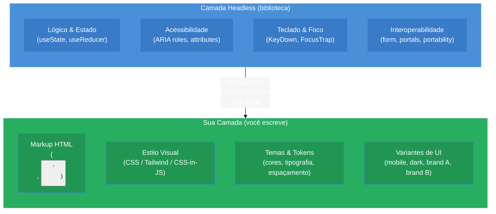

# Headless components e headless hooks

> [!abstract] TL;DR
> **Headless** é o padrão que separa lógica, estado e acessibilidade (a11y) da apresentação visual: a biblioteca entrega o "cérebro" (comportamento, ARIA, teclado, foco) e **você** fornece o visual. Existem duas formas: **headless hooks** (ex: TanStack Table, React Aria), onde um hook devolve getters e handlers para você aplicar onde quiser; e **headless components** (ex: Radix UI, Base UI, Headless UI), onde componentes sem estilo embrulham o comportamento e você estiliza com CSS/Tailwind. É o padrão dominante de design systems em 2026 porque resolve a tensão real: equipes precisam de controle visual total mas não têm como reimplementar a11y de teclado + ARIA + foco do zero para cada componente. O trade-off central: **máxima flexibilidade contra mais código de montagem**. Veja também [[03-Dominios/Tecnologia/React/Dicionário de React|Dicionário de React]].

---

## O problema que o headless resolve

Imagine o seguinte cenário: sua empresa adotou uma biblioteca de componentes React completa — botões, modais, comboboxes, tudo estilizado. Mas o novo design system exige fontes diferentes, raios de borda diferentes, e um estado de foco que não combina em nada com o padrão da lib. Você começa a fazer `!important` em cascata, sobrescrever variáveis CSS de uma forma que nunca foi documentada, e por fim percebe que a próxima versão da lib vai quebrar tudo.

A solução óbvia parece ser: "então vou escrever os componentes do zero." Mas aí aparece o custo real. Um `<Combobox>` acessível não é só um `<input>` com uma lista. Ele precisa de:

- `role="combobox"` no input, `role="listbox"` na lista, `role="option"` em cada item
- `aria-expanded`, `aria-haspopup`, `aria-activedescendant`, `aria-autocomplete`
- Foco gerenciado via teclado: ↑↓ navega opções, Enter seleciona, Escape fecha, Home/End vão ao início/fim
- Portabilidade de foco de volta ao input ao fechar
- Comportamento diferente em leitores de tela (VoiceOver, NVDA, JAWS)
- Interoperabilidade com formulários (`name`, `value`, integração com `<form>`)

Reimplementar isso "do zero" a cada componente equivale a meses de trabalho — e a maioria dos times nunca faz isso direito. É aí que o padrão headless entra.

---

## A analogia: motor sem carroceria

Pense em um motor de carro industrial: ele tem toda a mecânica — torque, câmbio, sistema de injeção, direção assistida. O motor não decide a cor do carro, a forma da lataria, nem o material dos bancos. Você instala o motor e coloca **a carroceria que quiser**.

Headless é esse motor. A biblioteca entrega o motor (estado, lógica de teclado, ARIA semântica, gerenciamento de foco). Você decide a carroceria — os elementos HTML, as classes CSS, o visual.

Duas fábricas fornecem esse motor de formas ligeiramente diferentes:

| Forma | Como funciona | Exemplos |
|-------|---------------|----------|
| **Headless hooks** | Hook devolve estado + prop getters; você aplica no seu markup | TanStack Table, React Aria, Downshift |
| **Headless components** | Componente sem estilo embrulha o comportamento; você estiliza | Radix UI, Base UI, Headless UI, Ariakit |

---

## Forma 1: headless hooks

Um headless hook devolve tudo que você precisa para montar o componente: estado atual, callbacks, e **prop getters** — funções que retornam o conjunto certo de props HTML/ARIA para aplicar em cada elemento.

### useDisclosure — exemplo mínimo

O caso mais simples é um hook de abertura/fechamento. Ele encapsula o estado `isOpen`, os handlers `open`/`close`/`toggle`, e devolve os prop getters que colocam o `aria-expanded` e o `aria-controls` corretos:

```tsx
// hooks/useDisclosure.ts
import { useCallback, useId, useState } from "react";

interface UseDisclosureOptions {
  defaultOpen?: boolean;
  id?: string;
}

interface UseDisclosureReturn {
  isOpen: boolean;
  open: () => void;
  close: () => void;
  toggle: () => void;
  getTriggerProps: () => {
    "aria-expanded": boolean;
    "aria-controls": string;
    onClick: () => void;
  };
  getPanelProps: () => {
    id: string;
    hidden: boolean;
  };
}

export function useDisclosure(
  options: UseDisclosureOptions = {}
): UseDisclosureReturn {
  const { defaultOpen = false } = options;
  const [isOpen, setIsOpen] = useState(defaultOpen);
  const panelId = useId();

  const open = useCallback(() => setIsOpen(true), []);
  const close = useCallback(() => setIsOpen(false), []);
  const toggle = useCallback(() => setIsOpen((v) => !v), []);

  const getTriggerProps = useCallback(
    () => ({
      "aria-expanded": isOpen,
      "aria-controls": panelId,
      onClick: toggle,
    }),
    [isOpen, panelId, toggle]
  );

  const getPanelProps = useCallback(
    () => ({
      id: panelId,
      hidden: !isOpen,
    }),
    [isOpen, panelId]
  );

  return { isOpen, open, close, toggle, getTriggerProps, getPanelProps };
}
```

Quem consome o hook decide **exatamente** qual markup renderizar:

```tsx
// components/Accordion.tsx
import { useDisclosure } from "../hooks/useDisclosure";

export function Accordion({ title, children }: { title: string; children: React.ReactNode }) {
  const { isOpen, getTriggerProps, getPanelProps } = useDisclosure();

  return (
    <div className="border rounded-lg overflow-hidden">
      <button
        className={`w-full px-4 py-3 text-left font-medium flex justify-between items-center
          ${isOpen ? "bg-indigo-50 text-indigo-700" : "bg-white text-gray-900"}`}
        {...getTriggerProps()}
      >
        {title}
        <span className={`transition-transform ${isOpen ? "rotate-180" : ""}`}>▾</span>
      </button>
      <div
        className="px-4 py-3 text-gray-700 text-sm"
        {...getPanelProps()}
      >
        {children}
      </div>
    </div>
  );
}
```

O hook não sabe que existe um `<div>` com `overflow-hidden` ou uma `span` com `rotate-180`. Ele só gerencia o estado e a semântica ARIA. Você pode reutilizá-lo para um modal, um tooltip, um menu — qualquer coisa que abre e fecha.

### useCombobox — exemplo mínimo com teclado

Um nível acima de complexidade: um combobox filtrável com navegação por teclado:

```tsx
// hooks/useCombobox.ts
import { useCallback, useId, useRef, useState } from "react";

interface Option {
  value: string;
  label: string;
}

export function useCombobox(options: Option[]) {
  const [inputValue, setInputValue] = useState("");
  const [isOpen, setIsOpen] = useState(false);
  const [activeIndex, setActiveIndex] = useState(-1);
  const [selectedOption, setSelectedOption] = useState<Option | null>(null);

  const listboxId = useId();
  const inputRef = useRef<HTMLInputElement>(null);

  const filtered = options.filter((o) =>
    o.label.toLowerCase().includes(inputValue.toLowerCase())
  );

  const selectOption = useCallback(
    (option: Option) => {
      setSelectedOption(option);
      setInputValue(option.label);
      setIsOpen(false);
      setActiveIndex(-1);
    },
    []
  );

  const handleKeyDown = useCallback(
    (e: React.KeyboardEvent) => {
      switch (e.key) {
        case "ArrowDown":
          e.preventDefault();
          setIsOpen(true);
          setActiveIndex((i) => Math.min(i + 1, filtered.length - 1));
          break;
        case "ArrowUp":
          e.preventDefault();
          setActiveIndex((i) => Math.max(i - 1, 0));
          break;
        case "Enter":
          e.preventDefault();
          if (activeIndex >= 0 && filtered[activeIndex]) {
            selectOption(filtered[activeIndex]);
          }
          break;
        case "Escape":
          setIsOpen(false);
          setActiveIndex(-1);
          inputRef.current?.focus();
          break;
        case "Home":
          e.preventDefault();
          setActiveIndex(0);
          break;
        case "End":
          e.preventDefault();
          setActiveIndex(filtered.length - 1);
          break;
      }
    },
    [activeIndex, filtered, selectOption]
  );

  const getInputProps = () => ({
    ref: inputRef,
    role: "combobox" as const,
    "aria-autocomplete": "list" as const,
    "aria-expanded": isOpen,
    "aria-controls": listboxId,
    "aria-activedescendant": activeIndex >= 0 ? `${listboxId}-${activeIndex}` : undefined,
    value: inputValue,
    onChange: (e: React.ChangeEvent<HTMLInputElement>) => {
      setInputValue(e.target.value);
      setIsOpen(true);
      setActiveIndex(-1);
    },
    onKeyDown: handleKeyDown,
    onFocus: () => setIsOpen(true),
    onBlur: () => setTimeout(() => setIsOpen(false), 150),
  });

  const getListboxProps = () => ({
    id: listboxId,
    role: "listbox" as const,
    "aria-label": "Opções",
  });

  const getOptionProps = (option: Option, index: number) => ({
    id: `${listboxId}-${index}`,
    role: "option" as const,
    "aria-selected": selectedOption?.value === option.value,
    "data-active": activeIndex === index,
    onMouseDown: (e: React.MouseEvent) => {
      e.preventDefault(); // impede blur do input
      selectOption(option);
    },
  });

  return {
    inputValue,
    isOpen,
    activeIndex,
    selectedOption,
    filtered,
    getInputProps,
    getListboxProps,
    getOptionProps,
  };
}
```

O hook não renderiza nada. Quem renderiza é o componente que o consume — com qualquer estrutura HTML e qualquer classe CSS.

---

## Forma 2: headless components (Radix UI)

A segunda forma são componentes sem estilo — você importa o componente, mas ele não traz CSS algum. O comportamento, a semântica ARIA e o foco já estão lá; você aplica suas classes.

O exemplo clássico é o Dialog do Radix UI:

```tsx
// components/ConfirmModal.tsx
import * as Dialog from "@radix-ui/react-dialog";

interface ConfirmModalProps {
  trigger: React.ReactNode;
  title: string;
  description: string;
  onConfirm: () => void;
}

export function ConfirmModal({ trigger, title, description, onConfirm }: ConfirmModalProps) {
  return (
    <Dialog.Root>
      {/* Radix cuida do aria-haspopup, aria-controls, aria-expanded */}
      <Dialog.Trigger asChild>{trigger}</Dialog.Trigger>

      {/* Portal garante que o modal fica fora da árvore DOM pai */}
      <Dialog.Portal>
        {/* Overlay com backdrop e animação — 100% do seu CSS */}
        <Dialog.Overlay className="fixed inset-0 bg-black/50 backdrop-blur-sm data-[state=open]:animate-in data-[state=closed]:animate-out" />

        {/* Content: Radix injeta role="dialog", aria-modal, aria-labelledby, foco trap */}
        <Dialog.Content
          className="fixed left-1/2 top-1/2 -translate-x-1/2 -translate-y-1/2
            w-full max-w-md bg-white rounded-xl shadow-2xl p-6
            data-[state=open]:animate-in data-[state=closed]:animate-out"
        >
          <Dialog.Title className="text-lg font-semibold text-gray-900 mb-2">
            {title}
          </Dialog.Title>
          <Dialog.Description className="text-sm text-gray-600 mb-6">
            {description}
          </Dialog.Description>

          <div className="flex gap-3 justify-end">
            <Dialog.Close asChild>
              <button className="px-4 py-2 text-sm text-gray-700 border rounded-lg hover:bg-gray-50">
                Cancelar
              </button>
            </Dialog.Close>
            <button
              onClick={onConfirm}
              className="px-4 py-2 text-sm bg-red-600 text-white rounded-lg hover:bg-red-700"
            >
              Confirmar
            </button>
          </div>
        </Dialog.Content>
      </Dialog.Portal>
    </Dialog.Root>
  );
}
```

O Radix cuidou de: `role="dialog"`, `aria-modal="true"`, `aria-labelledby` apontando para o `<Dialog.Title>`, trap de foco (Tab fica dentro do modal), retorno de foco ao elemento que abriu o modal ao fechar, fechar com Escape, gerenciar scroll do `<body>`. Você não escreveu uma linha de JavaScript de a11y — só CSS.

---

## Diagrama: arquitetura headless



---

## TanStack Table: o template canônico de headless hooks

O TanStack Table (ex React Table) é o exemplo mais didático do padrão em escala. Ele gerencia sorting, filtering, grouping, pagination, row selection, column visibility, virtualization — e não renderiza **absolutamente nada**.

```tsx
// exemplo simplificado com TanStack Table v8 / v9
import {
  createColumnHelper,
  flexRender,
  getCoreRowModel,
  getSortedRowModel,
  useReactTable,
  type SortingState,
} from "@tanstack/react-table";
import { useState } from "react";

interface Person {
  name: string;
  age: number;
  email: string;
}

const columnHelper = createColumnHelper<Person>();

const columns = [
  columnHelper.accessor("name", { header: "Nome", enableSorting: true }),
  columnHelper.accessor("age", { header: "Idade", enableSorting: true }),
  columnHelper.accessor("email", { header: "Email" }),
];

export function DataTable({ data }: { data: Person[] }) {
  const [sorting, setSorting] = useState<SortingState>([]);

  // useReactTable: puro headless hook — devolve o "modelo" da tabela
  const table = useReactTable({
    data,
    columns,
    state: { sorting },
    onSortingChange: setSorting,
    getCoreRowModel: getCoreRowModel(),
    getSortedRowModel: getSortedRowModel(),
  });

  // Você decide 100% do markup
  return (
    <table className="w-full text-sm border-collapse">
      <thead className="bg-gray-100">
        {table.getHeaderGroups().map((headerGroup) => (
          <tr key={headerGroup.id}>
            {headerGroup.headers.map((header) => (
              <th
                key={header.id}
                className="px-4 py-2 text-left font-semibold text-gray-700 cursor-pointer select-none"
                onClick={header.column.getToggleSortingHandler()}
              >
                {flexRender(header.column.columnDef.header, header.getContext())}
                {header.column.getIsSorted() === "asc" ? " ↑" : ""}
                {header.column.getIsSorted() === "desc" ? " ↓" : ""}
              </th>
            ))}
          </tr>
        ))}
      </thead>
      <tbody>
        {table.getRowModel().rows.map((row) => (
          <tr key={row.id} className="border-t hover:bg-gray-50">
            {row.getVisibleCells().map((cell) => (
              <td key={cell.id} className="px-4 py-2 text-gray-800">
                {flexRender(cell.column.columnDef.cell, cell.getContext())}
              </td>
            ))}
          </tr>
        ))}
      </tbody>
    </table>
  );
}
```

O `useReactTable` não sabe se você está renderizando uma `<table>` HTML clássica, um grid de `<div>`s, ou uma lista virtualizada com 100 mil linhas. Ele só gerencia o modelo de dados.

---

## Headless é a soma de padrões anteriores

> [!question]- Por que headless parece uma "evolução" e não só um padrão novo?
> Porque ele é literalmente a síntese de padrões anteriores, cada um resolvendo parte do problema.

| Padrão anterior | Contribuição para o headless |
|-----------------|------------------------------|
| [[08 - Render props e function-as-child\|Render props]] | Ideia de injetar UI arbitrária via função |
| [[07 - Compound components\|Compound components]] | Compartilhamento de estado implícito entre filhos |
| [[04 - Custom hooks como padrão de reuso de lógica\|Custom hooks]] | Extração de lógica sem componente wrapper |
| Prop getters | Convenção de devolver objeto de props para aplicar no elemento |

Headless hooks = custom hooks + prop getters. Headless components = compound components sem CSS.

---

## Comparativo: as quatro grandes bibliotecas

| Critério | Radix UI | Headless UI | React Aria | Base UI |
|----------|----------|-------------|------------|---------|
| **Modelo de API** | Componentes sem estilo | Componentes sem estilo | Hooks puros + componentes | Componentes sem estilo |
| **A11y** | Muito boa | Boa | Rigorosa (WAI-ARIA estrito) | Muito boa |
| **Nº de componentes** | 30+ | ~10 | 40+ padrões de hooks | 30+ |
| **Manutenção** | Desacelerou (WorkOS) | Ativa (Tailwind Labs) | Muito ativa (Adobe) | Muito ativa (MUI) |
| **Bundle** | Modular | Pequeno | Modular por hook | Modular |
| **i18n / RTL** | Parcial | Parcial | Completo (30+ idiomas) | Parcial |
| **Ideal para** | Maioria dos design systems | Projetos Tailwind-first | Gov/enterprise/a11y crítica | Greenfield 2025+ |
| **Downloads/semana** | ~4,4M | ~5,5M | ~4,5M | ~3,7M |

> [!info] shadcn/ui não é headless — é uma camada acima
> shadcn/ui usa Radix (e agora Base UI) como primitivo e já vem estilizado com Tailwind. É a escolha para "quero componentes prontos mas quero o código no meu projeto". Com ~3,9M downloads/semana em 2026, é o consumer mais popular das libs headless, não um concorrente direto.

---

## Casos práticos

### Cenário 1: design system multi-produto

Uma empresa fintech mantém três produtos com branding completamente diferente — cores, fontes, raios de borda. Os componentes de comportamento são os mesmos: `<Combobox>`, `<DatePicker>`, `<Modal>`. Com headless, o time de plataforma publica um pacote `@acme/primitives` baseado em Radix/React Aria, e cada produto importa e estiliza com seu próprio CSS. Nenhum comportamento é duplicado; nenhuma tela de produto força o visual do outro.

### Cenário 2: migração de visual sem quebrar a11y

Uma startup usava um `<Select>` personalizado, feito do zero, que funcionava bem visualmente mas tinha problemas sérios com VoiceOver no iOS. A migração para o `Select` do Radix UI trocou apenas o markup e o CSS — o comportamento melhorou drasticamente sem que o time tivesse que aprender ARIA authoring practices do zero.

### Cenário 3: tabela server-side com API proprietária

Um painel de dados usa paginação, ordenação e filtros vindos do backend. O time usou TanStack Table no modo `manualPagination` + `manualSorting`: o hook gerencia o estado de UI (qual página, qual coluna ordenada, em qual direção), e o time só precisou conectar esses valores aos parâmetros da API. O markup da tabela é 100% customizado para o design system interno.

---

## Armadilhas comuns

> [!warning] Reinventar a11y dentro do hook headless
> **O que acontece:** O desenvolvedor cria um headless hook próprio, mas esquece de incluir os atributos ARIA corretos nos prop getters — devolvendo apenas handlers de `onClick` sem `aria-expanded`, `role`, `aria-controls`, etc. **Por quê:** A parte "headless" parece ser só separar estado do visual; a a11y parece opcional. **Como evitar:** Se você vai criar seu próprio headless hook para um componente interativo (Combobox, Menu, Dialog), siga os padrões do WAI-ARIA APG (Authoring Practices Guide). Ou melhor: use React Aria — os hooks dela já implementam tudo.

> [!warning] Achar que headless = sem estilo padrão para sempre
> **O que acontece:** O time não aplica nenhum estilo de reset (ex: `all: unset` ou um Preflight), e os componentes Radix herdam estilos globais do navegador e do CSS do projeto, causando inconsistências visuais difíceis de debugar. **Por quê:** Sem estilo "padrão" não significa sem estilo nenhum — o navegador aplica UA stylesheet. **Como evitar:** Aplicar um CSS reset consistente, usar `asChild` do Radix com moderação e entender que cada elemento renderizado ainda herda a cascade do CSS.

> [!warning] Acoplar lógica visual dentro do headless hook
> **O que acontece:** O hook começa retornando apenas estado e handlers, mas ao longo do tempo começa a retornar classes CSS condicionais, strings de texto, ou até JSX — porque é "mais prático." **Por quê:** A pressão de prazo leva a atalhos; a separação de responsabilidades se degrada. **Como evitar:** A regra é simples: o headless hook nunca importa nada do mundo visual (className, estilos, i18n de texto de UI, JSX). Se precisar, coloque num componente de apresentação separado.

> [!warning] Não memorizar colunas e dados no TanStack Table
> **O que acontece:** O componente pai re-renderiza por qualquer razão, recria os arrays `columns` e `data` a cada render, e o TanStack Table recalcula todo o row model desnecessariamente — causando flicker ou lentidão em tabelas grandes. **Por quê:** O TanStack Table usa referencial equality para detectar mudanças. **Como evitar:** Sempre envolver `columns` em `useMemo` e garantir que `data` só mude quando realmente mudar (não recriar o array na mesma referência a cada render).

---

## Trade-offs sênior

O padrão headless não é gratuito. Ele transfere responsabilidade da biblioteca para o time:

| Vantagem | Custo real |
|----------|------------|
| Controle visual total | Você monta todo o markup do zero |
| Não reimplementa a11y | Depende da qualidade da lib headless escolhida |
| Reutilizável entre produtos | Exige disciplina para não vazar lógica visual no hook |
| Testável em isolamento | Testes de hook precisam simular eventos de teclado |
| Sem lock-in visual | Curva de aprendizado mais alta para devs menos sêniors |

**Quando headless é a resposta certa:**
- Design system com múltiplos produtos/brandos
- Componentes complexos (Combobox, DatePicker, DataTable) onde a11y é crítica
- Times que já têm Tailwind ou um sistema de tokens CSS estabelecido

**Quando pode ser overkill:**
- Produto interno de uso único com poucos usuários
- Protótipos onde iteração rápida importa mais que controle visual
- Equipes pequenas sem capacidade de manter os componentes compostos

---

## Como explicar em inglês

> "Headless components and hooks separate behavior from presentation. The library ships the logic, accessibility, and keyboard interactions — you own the markup and styles. Think of it as the engine without the body: Radix UI, React Aria, and TanStack Table give you a fully functional engine that you can wrap in any visual shell you want. This is the dominant pattern for design systems in 2026 because teams need full visual control but can't afford to reimplement ARIA semantics and keyboard navigation from scratch for every complex component."

| PT | EN |
|----|----|
| sem estilo / sem estilização | unstyled / headless |
| prop getter | prop getter |
| trap de foco | focus trap |
| semântica ARIA | ARIA semantics |
| retorno de foco | focus restoration |
| componente primitivo | primitive component |
| camada de apresentação | presentation layer / UI layer |
| camada de comportamento | behavior layer / logic layer |
| interoperabilidade | interoperability |
| design system | design system (sem tradução no mercado) |
| biblioteca agnóstica de visual | visually agnostic library |

---

## O que vem a seguir

O padrão headless é o ponto mais avançado do catálogo de design patterns deste galho. Mas há um padrão que aparece dentro de muitas implementações headless que ainda não abordamos isoladamente: o **state reducer** — a técnica de deixar o consumidor sobrescrever transições de estado específicas dentro do hook headless sem precisar reescrever o hook inteiro. É o último grau de extensibilidade.

- **10 - State reducer e prop getters** — como deixar o consumidor do hook intervir em transições de estado específicas (ainda não escrito; é o padrão usado pelo Downshift internamente)
- [[08 - Render props e function-as-child]] — a raiz histórica dos prop getters; entender render props ajuda a ler o código de libs headless mais antigas
- [[07 - Compound components]] — como o Radix UI estrutura seus componentes compostos internamente
- [[04 - Custom hooks como padrão de reuso de lógica]] — a fundação de todo hook headless

---

## Fontes

- **Juntao QIU (ThoughtWorks / Martin Fowler)** — [*Headless Component: a pattern for composing React UIs*](https://martinfowler.com/articles/headless-component.html) — artigo definitivo que nomeia e descreve o padrão com exemplos completos em TypeScript
- **GreatFrontEnd** — [*Top Headless UI libraries for React in 2026*](https://www.greatfrontend.com/blog/top-headless-ui-libraries-for-react-in-2026) — comparativo atualizado com downloads, casos de uso e recomendações por perfil de projeto
- **GreatFrontEnd (Medium)** — [*Choosing the right headless UI library for your React project*](https://medium.com/@greatfrontend/choosing-the-right-headless-ui-library-for-your-react-project-7fe9670a6174) — guia de decisão com critérios práticos
- **Radix UI** — [*Radix Primitives*](https://www.radix-ui.com/primitives) — documentação oficial dos componentes headless; referência para a API de Dialog, Select, Combobox
- **Adobe / React Spectrum** — [*React Aria*](https://react-aria.adobe.com/) — hooks de a11y mais rigorosos do ecossistema; implementa WAI-ARIA Authoring Practices completo
- **Tailwind Labs** — [*Headless UI*](https://headlessui.com/react) — documentação do Disclosure, Dialog, Combobox da lib Tailwind-first
- **TanStack** — [*TanStack Table*](https://tanstack.com/table/latest) — template canônico de headless hook para tabelas; documenta a filosofia "headless = zero markup"
- **LogRocket** — [*A complete guide to TanStack Table*](https://blog.logrocket.com/tanstack-table-formerly-react-table/) — tutorial completo cobrindo sorting, filtering e pagination com useReactTable
- **patterns.dev** — [*Render Props Pattern*](https://www.patterns.dev/react/render-props-pattern/) — contextualiza a evolução de render props → headless hooks
