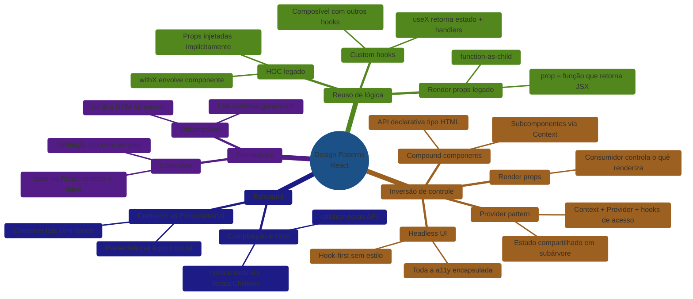
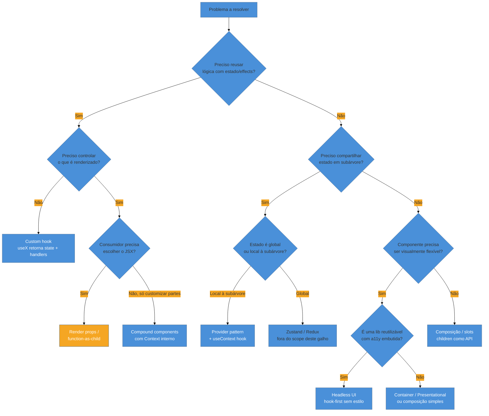

# Capstone — Escolher o padrão certo e em entrevista

> [!abstract] TL;DR
> Todos os design patterns de React orbitam dois eixos: **reuso de lógica** (extrair comportamento para fora de um único componente) e **inversão de controle** (ceder ao consumidor a decisão sobre o quê e como renderizar). A evolução histórica — de HOC a render props, de render props a hooks — não é moda: é a busca pela menor superfície de API que ainda resolve o problema. Padrões modernos como compound components, provider e headless UI compõem esses eixos sem criar wrapper hell. Este capstone amarra o catálogo, oferece uma decision tree para escolher o padrão certo e prepara você para defender suas escolhas em entrevista sênior em inglês.

## O eixo que amarra tudo

Você acabou de percorrer nove padrões. Antes de tentar memorizar cada um, vale perguntar: o que eles têm em comum?

Toda a história dos design patterns em React é a história de uma tensão. De um lado, o React incentiva componentes pequenos e puros — funções que recebem props e retornam JSX. Do outro, aplicações reais precisam de comportamentos que se repetem: formulários controlados, lógica de autenticação, gerenciamento de tema, controle de foco. Como você extrai esse comportamento *sem* copiar e colar e *sem* criar acoplamento desnecessário?

A resposta evoluiu ao longo de uma década, mas a pergunta sempre foi a mesma. Dois eixos organizam todas as respostas:

**Eixo 1 — Reuso de lógica:** como um componente compartilha *comportamento* (state, effects, callbacks) com outros componentes sem duplicar código? Resposta: custom hooks (e antes deles, HOC e render props).

**Eixo 2 — Inversão de controle (IoC):** como o componente-pai deixa o consumidor decidir *o que renderizar*, preservando o comportamento interno? Resposta: render props, function-as-child, compound components, headless UI.

Quando você entende esses dois eixos, a escolha de padrão vira raciocínio, não memorização.

## A evolução em perspectiva

A tabela abaixo mostra como a comunidade foi refinando a solução para o mesmo problema ao longo do tempo. O problema nunca mudou — só a API ficou mais limpa.

| Época | Padrão | Problema que resolve | Custo |
|-------|--------|----------------------|-------|
| 2013–2015 | Mixins (classe ES5) | Reuso de métodos e state | Colisão de nomes, ordem de precedência opaca |
| 2015–2017 | HOC (`withX(Component)`) | Reuso de comportamento via wrapper | Wrapper hell, props implícitas, `displayName` opaco |
| 2017–2019 | Render props / function-as-child | IoC sem wrapper de componente | JSX aninhado, callback hell em múltiplos padrões |
| 2019–hoje | Custom hooks | Reuso de lógica puro, sem JSX | Regras dos hooks, debug em DevTools menos visual |
| 2019–hoje | Compound components + hooks | IoC + API declarativa | Requer Context interno; curva de design |
| 2020–hoje | Headless UI / hook-first libs | Reuso de a11y + comportamento sem estilo | Consumidor precisa estilizar tudo |

> [!info] Por que hooks "venceram"?
> Hooks extraem lógica *sem criar nós na árvore de componentes*. Isso elimina o wrapper hell dos HOCs e o callback hell dos render props. O custo é que a lógica fica invisível no JSX — você precisa nomear bem e documentar o hook para o consumidor entender o contrato.

## Mapa mental dos padrões



## Decision tree: qual padrão escolher?

Quando você se deparar com um problema de componentes, percorra estas perguntas em ordem:



### Tabela problema → padrão

| Problema concreto | Padrão recomendado | Por quê não outro |
|-------------------|--------------------|-------------------|
| Lógica de formulário reutilizável (validação, touched, submit) | Custom hook `useForm` | Render props adicionariam JSX desnecessário; HOC injetaria props implícitas |
| Menu com subcomponentes (Menu.Item, Menu.Trigger) que compartilham estado de abertura | Compound components + Context | Provider sozinho não dá API declarativa; render props exporiam estado interno ao consumidor |
| Tema e autenticação disponíveis em qualquer nível da árvore | Provider pattern | Props drilling não escala; HOC injetaria em cada componente individualmente |
| Input que pode ser controlado OU não controlado pelo consumidor | Controlled vs Uncontrolled + `defaultValue` | Forçar apenas um modo limita o consumidor |
| Componente de lista com lógica de a11y (roles, aria-selected, keyboard nav) para reutilizar em designs distintos | Headless UI (hook-first) | Render props funcionam, mas hooks são mais composíveis |
| Separar fetch de dados da apresentação sem hooks | Container / Presentational | Hoje substituído por hooks + RSC, mas ainda válido para migração |
| Comportamento que era em HOC mas migrou para hooks | Substituir `withAuth(Component)` por `useAuth()` + guarda no corpo | HOC preserva compatibilidade com class components (único motivo para mantê-lo) |
| Dados de fetch compartilhados entre siblings sem prop-drilling | Provider + useContext ou lib de estado | Context re-renderiza toda a subárvore; memoize seletores |

## State Reducer: o padrão de escape hatch definitivo

Existe um padrão que não tem nota própria no galho, mas que aparece em entrevistas sênior com frequência: o **state reducer** (também chamado de "reducer pattern" em libs headless).

O problema: você construiu um `useSelect` headless. Funciona perfeitamente para 80% dos casos. Mas um consumidor específico precisa que o dropdown *não feche* ao selecionar um item — comportamento que viola o padrão. O que você faz? Adiciona uma prop `closeOnSelect`? E se surgir outro edge case?

A solução é expor o mecanismo de state ao consumidor via uma prop `stateReducer`:

```tsx
type SelectState = { isOpen: boolean; selectedValue: string | null };
type SelectAction =
  | { type: 'SELECT_ITEM'; value: string }
  | { type: 'OPEN' }
  | { type: 'CLOSE' };

type StateReducer = (state: SelectState, action: SelectAction) => SelectState;

function defaultStateReducer(state: SelectState, action: SelectAction): SelectState {
  switch (action.type) {
    case 'SELECT_ITEM':
      return { ...state, selectedValue: action.value, isOpen: false }; // fecha por padrão
    case 'OPEN':
      return { ...state, isOpen: true };
    case 'CLOSE':
      return { ...state, isOpen: false };
    default:
      return state;
  }
}

function useSelect({
  stateReducer = defaultStateReducer,
}: {
  stateReducer?: StateReducer;
}) {
  const [state, dispatch] = React.useReducer(
    (s: SelectState, a: SelectAction) => stateReducer(s, a),
    { isOpen: false, selectedValue: null }
  );

  return {
    ...state,
    selectItem: (value: string) => dispatch({ type: 'SELECT_ITEM', value }),
    open: () => dispatch({ type: 'OPEN' }),
    close: () => dispatch({ type: 'CLOSE' }),
  };
}

// Consumidor que precisa de comportamento custom: não fecha ao selecionar
function MultiSelect() {
  const { isOpen, selectedValue, selectItem, open, close } = useSelect({
    stateReducer(state, action) {
      if (action.type === 'SELECT_ITEM') {
        return { ...state, selectedValue: action.value, isOpen: true }; // mantém aberto
      }
      return defaultStateReducer(state, action);
    },
  });
  // ...
}
```

O consumidor intercepta apenas a ação que precisa e delega o resto ao reducer padrão. Isso é IoC total sem proliferação de props. Kent C. Dodds popularizou esse padrão em `downshift`.

## Como os padrões modernos compõem

O poder dos padrões modernos está na combinação. Um `<Select>` de produção pode usar:

1. **Compound components** para a API declarativa (`<Select>`, `<Select.Trigger>`, `<Select.Options>`, `<Select.Item>`).
2. **Provider pattern** internamente para distribuir o estado de abertura e o valor selecionado.
3. **Custom hooks** para exportar `useSelect()` — permitindo que consumidores avançados construam seu próprio JSX mas aproveitem toda a lógica.
4. **Controlled/Uncontrolled** via `value`/`defaultValue` para compatibilidade com formulários controlados e não controlados.

```tsx
// API pública declarativa (compound)
<Select value={value} onChange={setValue}>
  <Select.Trigger>{value ?? 'Selecione…'}</Select.Trigger>
  <Select.Options>
    {options.map((opt) => (
      <Select.Item key={opt.value} value={opt.value}>
        {opt.label}
      </Select.Item>
    ))}
  </Select.Options>
</Select>

// Consumidor avançado — usa o hook diretamente (headless)
function CustomSelect({ options }: { options: Option[] }) {
  const { isOpen, toggle, selectedValue, selectItem, getItemProps } = useSelect({
    options,
  });

  return (
    <div>
      <button onClick={toggle}>{selectedValue ?? 'Selecione…'}</button>
      {isOpen && (
        <ul role="listbox">
          {options.map((opt) => (
            <li key={opt.value} {...getItemProps(opt)} role="option">
              {opt.label}
            </li>
          ))}
        </ul>
      )}
    </div>
  );
}
```

Isso é inversão de controle em múltiplas camadas: compound para o caso comum, hook para o caso avançado.

## Mapa de revisão do galho

| # | Nota | Padrão-chave | Fase |
|---|------|--------------|------|
| 01 | [[03-Dominios/Tecnologia/React/Design Patterns/01 - Padrões no React e a evolução\|Padrões no React e a evolução]] | Visão geral + linha do tempo | Iniciado |
| 02 | [[03-Dominios/Tecnologia/React/Design Patterns/02 - Container vs Presentational\|Container vs Presentational]] | Separação de responsabilidades | Iniciado |
| 03 | [[03-Dominios/Tecnologia/React/Design Patterns/03 - Controlled vs Uncontrolled\|Controlled vs Uncontrolled]] | Formulários e fluxo de dados | Iniciado |
| 04 | [[03-Dominios/Tecnologia/React/Design Patterns/04 - Custom hooks como padrão de reuso de lógica\|Custom hooks como padrão de reuso de lógica]] | Extração de lógica com estado | Adepto |
| 05 | [[03-Dominios/Tecnologia/React/Design Patterns/05 - Provider pattern\|Provider pattern]] | Estado compartilhado em subárvore | Adepto |
| 06 | [[03-Dominios/Tecnologia/React/Design Patterns/06 - Composição - slots, layout e children-as-API\|Composição — slots, layout e children-as-API]] | children como contrato de API | Adepto |
| 07 | [[03-Dominios/Tecnologia/React/Design Patterns/07 - Compound components\|Compound components]] | Subcomponentes com Context interno | Magus |
| 08 | [[03-Dominios/Tecnologia/React/Design Patterns/08 - Render props e function-as-child\|Render props e function-as-child]] | IoC via função como prop | Magus |
| 09 | [[03-Dominios/Tecnologia/React/Design Patterns/09 - Higher-Order Components (HOC)\|Higher-Order Components (HOC)]] | Wrapper de componente + injeção de props | Adepto |
| 10 | [[03-Dominios/Tecnologia/React/Design Patterns/10 - State reducer e prop getters\|State reducer e prop getters]] | Inversão de controle: usuário customiza o estado interno | Magus |
| 11 | [[03-Dominios/Tecnologia/React/Design Patterns/11 - Headless components e headless hooks\|Headless components e headless hooks]] | Lógica/a11y sem apresentação (Radix, TanStack) | Magus |

## Padrão de composição: custom hook + slots de override

Um padrão que aparece muito em design systems maduros é a combinação de **custom hook** com **slots de override via render prop**. O hook fornece o comportamento padrão; os slots permitem substituir partes visuais sem refatorar o componente inteiro.

```tsx
interface TableProps<T> {
  data: T[];
  columns: ColumnDef<T>[];
  // slot de override: consumidor pode substituir a célula de status
  renderStatusCell?: (row: T) => React.ReactNode;
  // slot de override: consumidor pode substituir o estado vazio
  renderEmpty?: () => React.ReactNode;
}

function DataTable<T extends { id: string }>({
  data,
  columns,
  renderStatusCell,
  renderEmpty = () => <p>Nenhum resultado encontrado.</p>,
}: TableProps<T>) {
  // ...lógica de ordenação, paginação, etc.
  if (data.length === 0) return <>{renderEmpty()}</>;

  return (
    <table>
      <thead>{/* cabeçalho */}</thead>
      <tbody>
        {data.map((row) => (
          <tr key={row.id}>
            {columns.map((col) =>
              col.id === 'status' && renderStatusCell ? (
                <td key={col.id}>{renderStatusCell(row)}</td>
              ) : (
                <td key={col.id}>{col.render(row)}</td>
              )
            )}
          </tr>
        ))}
      </tbody>
    </table>
  );
}
```

Esse padrão de "render slot de escape hatch" é o que distingue um componente de biblioteca de um componente de aplicação: a lib fornece o comportamento sensato por padrão e deixa portas abertas para customização sem precisar de fork.

> [!question]- E se o consumidor precisar de acesso ao estado interno da tabela (linha selecionada, página atual) dentro do `renderStatusCell`?
> Passe o estado como argumento da função: `renderStatusCell?: (row: T, state: TableState) => React.ReactNode`. O tipo `TableState` é exportado da lib para que o consumidor possa tipá-lo corretamente. Evite expor o dispatch ou setters diretamente — isso quebraria o encapsulamento.

## Banco de perguntas de entrevista

### Grupo 1 — Evolução e filosofia

**P: Por que a comunidade React abandonou HOCs em favor de hooks?**

HOCs criavam wrapper hell (cada HOC adiciona um nó na árvore), props implícitas (o consumidor não sabe quais props foram injetadas sem ler o código do HOC), e conflitos de nome entre HOCs encadeados. Custom hooks extraem lógica sem criar nós de componente, com contrato explícito via retorno de função. → [[03-Dominios/Tecnologia/React/Design Patterns/01 - Padrões no React e a evolução|nota 01]], [[03-Dominios/Tecnologia/React/Design Patterns/09 - Higher-Order Components (HOC)|nota 09]]

**P: O que é "inversão de controle" em componentes React? Dê um exemplo.**

IoC significa que o componente cede ao consumidor o controle sobre *o que renderizar*, retendo para si o controle do *comportamento*. Render props e compound components são os exemplos canônicos: o componente gerencia estado e lógica, mas deixa o consumidor escrever o JSX. → [[03-Dominios/Tecnologia/React/Design Patterns/08 - Render props e function-as-child|nota 08]], [[03-Dominios/Tecnologia/React/Design Patterns/07 - Compound components|nota 07]]

**P: Qual é a diferença conceitual entre reuso de lógica e inversão de controle? Quando você precisa de cada um?**

Reuso de lógica: o comportamento é genérico, mas o JSX é específico de cada consumidor → custom hook. Inversão de controle: o comportamento é genérico *e* o consumidor precisa controlar o JSX → render prop, compound, headless. Muitas vezes você precisa dos dois ao mesmo tempo — daí o padrão hook + compound component.

---

### Grupo 2 — Padrões específicos

**P: Quando você usaria compound components ao invés de um único componente com muitas props?**

Quando a API precisa ser declarativa e extensível, e quando os subcomponentes precisam compartilhar estado sem que o consumidor gerencie esse estado. Um `<Tabs>` com doze props booleanas é difícil de entender; `<Tabs>`, `<Tabs.List>`, `<Tabs.Tab>` e `<Tabs.Panel>` são auto-documentados. → [[03-Dominios/Tecnologia/React/Design Patterns/07 - Compound components|nota 07]]

**P: Quando um componente deve ser controlado vs não controlado?**

Controlado quando o consumidor precisa reagir a cada mudança (validação em tempo real, estado derivado, sincronização com outro campo). Não controlado quando você só precisa do valor no submit e não quer gerenciar state. Libs como React Hook Form usam não controlado + ref para performance. → [[03-Dominios/Tecnologia/React/Design Patterns/03 - Controlled vs Uncontrolled|nota 03]]

**P: O que é headless UI e por que ele existe?**

Headless UI é uma biblioteca (ou padrão) que encapsula comportamento e acessibilidade — gerenciamento de foco, roles ARIA, keyboard navigation — sem nenhum CSS ou JSX visual. O consumidor estiliza 100% do componente. Surgiu porque empresas com design systems próprios não querem sobrescrever CSS de bibliotecas opinionadas. Exemplos: Radix UI, Headless UI (Tailwind Labs), React Aria (Adobe).

**P: Qual a diferença entre Provider pattern e Compound components? Quando usar cada um?**

Provider pattern distribui estado para *qualquer* descendente via Context — adequado para estado global-ish de uma subárvore (tema, autenticação, locale). Compound components também usam Context internamente, mas expõem uma API de subcomponentes co-localizados (`Tab.List`, `Tab.Panel`) — adequado quando os subcomponentes fazem parte do mesmo contrato visual. Você pode combinar os dois. → [[03-Dominios/Tecnologia/React/Design Patterns/05 - Provider pattern|nota 05]], [[03-Dominios/Tecnologia/React/Design Patterns/07 - Compound components|nota 07]]

---

### Grupo 3 — Trade-offs e anti-patterns

**P: Quais são os principais anti-patterns de design de componentes React?**

(1) Props booleanas em vez de composição — `<Button primary secondary large iconLeft>` vira um combinatorial explosion. (2) Wrapper hell de HOCs encadeados. (3) Render props aninhados criando callback hell. (4) Usar Context para tudo, incluindo estado local. (5) Aplicar compound components a componentes que não têm subcomponentes relacionados — complexidade sem benefício.

**P: Quando Container/Presentational ainda faz sentido em 2025?**

Em migrações de código legado sem hooks, em times que querem separação física clara de "onde dados vêm" e "como são exibidos", e em Storybook-driven development (o componente presentational é fácil de isolar). Em código novo com hooks, essa separação ainda existe mas acontece na camada hook + componente puro, sem precisar de dois arquivos. → [[03-Dominios/Tecnologia/React/Design Patterns/02 - Container vs Presentational|nota 02]]

**P: Qual é o custo de Provider pattern com Context? Quando ele se torna um problema?**

Qualquer mudança no valor do Context re-renderiza todos os consumidores que chamam `useContext`. Em Contexts de alta frequência de atualização (posição do mouse, scroll), isso pode causar performance degradada. Solução: separar Contexts por frequência de atualização, usar `useMemo` no valor, ou migrar para uma lib de estado seletivo (Zustand, Jotai) que permite subscrição granular. → [[03-Dominios/Tecnologia/React/Design Patterns/05 - Provider pattern|nota 05]]

---

### Grupo 4 — Design de APIs de componentes

**P: Como você projeta a API de um componente para ser ao mesmo tempo simples para casos comuns e flexível para casos avançados?**

Progressive disclosure: a API padrão cobre 80% dos casos com props simples. Para os 20% restantes, você oferece um hook (`useX`) que expõe o estado interno, ou slots de render prop para substituir partes específicas. É o padrão "render prop de escape hatch" — o componente tem JSX padrão, mas aceita uma prop de override. Exemplos: `renderItem`, `renderEmpty`, `renderHeader`.

**P: O que é o padrão "prop getters" e para que ele serve?**

Prop getters é uma função que retorna um objeto de props para ser espalhado (`{...getItemProps(item)}`) em um elemento. O hook encapsula os event handlers, aria attributes e refs necessários, e o consumidor os aplica ao elemento que quiser. É o núcleo da arquitetura headless — você mantém o comportamento, o consumidor mantém o JSX. Kent C. Dodds popularizou esse padrão em `downshift`.

**P: Como você tiparia em TypeScript um componente compound com Context?**

Você define o tipo do Context, tipifica o hook de acesso com um guard que lança se chamado fora do Provider, e tipifica cada subcomponente como `React.FC<Props>`. O namespace de objeto (`const Select = Object.assign(SelectRoot, { Trigger, Options, Item })`) mantém a API limpa e o Tree Shaking funcionando. → [[03-Dominios/Tecnologia/React/Design Patterns/07 - Compound components|nota 07]]

## Como explicar em inglês

### Compound components

> "Compound components let you build a group of related components that share implicit state through Context, giving consumers a declarative, HTML-like API. Instead of passing ten props to a single component, you compose `<Select>`, `<Select.Trigger>`, and `<Select.Options>` — the state lives in the root, the subcomponents read it via Context."

### HOC vs hooks

> "Higher-Order Components wrap a component and inject props, but they create extra nodes in the tree and make the injected props implicit — you have to read the HOC source to know what you're getting. Custom hooks solve the same problem — sharing stateful logic — but the contract is explicit: the hook's return value tells you exactly what you get, and there's no extra node in the tree."

### Render props

> "Render props invert control by accepting a function as a prop that returns JSX. The parent component calls that function with its internal state, so the consumer decides what to render while the component retains the behavior. It's still useful as an escape hatch when a hook alone doesn't give the consumer enough control over the output."

### Headless UI

> "Headless UI separates behavior from presentation. The component — or more commonly, a hook — handles all the logic: focus management, ARIA roles, keyboard navigation. The consumer provides all the markup and styling. It's ideal for design systems where you need to control every pixel but don't want to reimplement accessibility from scratch."

### Controlled vs Uncontrolled

> "A controlled component has its value driven by React state — every keystroke updates state and re-renders. An uncontrolled component stores value in the DOM and you read it with a ref on submit. Controlled gives you fine-grained access for validation and derived state; uncontrolled gives you better performance in large forms, which is why form libraries like React Hook Form default to uncontrolled."

### Tabela PT↔EN

| Português | English |
|-----------|---------|
| Inversão de controle | Inversion of control (IoC) |
| Componentes compostos | Compound components |
| Render props | Render props |
| Componente sem estilo | Headless component / headless UI |
| Controlado / não controlado | Controlled / uncontrolled |
| Componente de ordem superior | Higher-Order Component (HOC) |
| Slot de conteúdo | Content slot / named slot |
| Prop getters | Prop getters |
| Reuso de lógica | Logic reuse / behavior sharing |
| Envolvimento de componente | Component wrapping |
| Padrão de provedor | Provider pattern |
| Separação de responsabilidades | Separation of concerns |
| Explosão combinatorial de props | Prop explosion / boolean props proliferation |
| Inferno de wrappers | Wrapper hell |

## Armadilhas comuns

> [!warning] Props booleanas em vez de composição
> **O que acontece:** O componente acumula `isLarge`, `isPrimary`, `hasIcon`, `isDisabled`, `isLoading` — e combinações inválidas se tornam possíveis (`<Button isLarge isSmall />`). **Por quê:** É mais rápido adicionar uma prop do que redesenhar a API, então o componente cresce incrementalmente. **Como evitar:** Use variants via `variant="primary" | "secondary"`, size via `size="sm" | "md" | "lg"`, e componentes especializados (`<IconButton>`) em vez de booleanos. Se a combinação não fizer sentido visualmente, provavelmente é um componente diferente.

> [!warning] Usar Context para estado local
> **O que acontece:** Um modal tem seu estado de abertura (`isOpen`) num Context global. Toda a árvore re-renderiza quando o modal abre. **Por quê:** Context parece a solução natural para "compartilhar estado", mesmo quando o estado é puramente local ao componente. **Como evitar:** Estado local (`useState`) fica no componente ou no hook do componente. Context é para estado que realmente precisa ser acessado em partes distantes da árvore. Se apenas o componente pai e os filhos diretos precisam do estado, elevação de estado é suficiente.

> [!warning] Aplicar compound components onde props simples bastam
> **O que acontece:** Um `<Avatar>` que aceita `src` e `alt` é reescrito como `<Avatar><Avatar.Image src={src} alt={alt} /><Avatar.Fallback>{initials}</Avatar.Fallback></Avatar>` — uma API verbosa para um componente simples. **Por quê:** O padrão é elegante; o desenvolvedor quer usá-lo em todo lugar. **Como evitar:** Compound components justificam-se quando há ≥2 subcomponentes com estado compartilhado implícito e quando a API declarativa realmente agrega legibilidade. Para componentes com 1–3 props, props simples são melhores.

> [!warning] HOC que não encaminha ref (forwardRef esquecido)
> **O que acontece:** `withAuth(Input)` não funciona com `ref` — o ref aponta para o wrapper, não para o `<input>` DOM. **Por quê:** HOCs envolvem o componente mas não propagam refs automaticamente em componentes de função. **Como evitar:** Sempre use `React.forwardRef` no componente interno e propague o ref explicitamente. Com hooks, esse problema desaparece — o hook não cria nó de componente.

> [!warning] Render props aninhados sem extração para hook
> **O que acontece:** `<Mouse render={({ x, y }) => <KeyboardTracker render={({ key }) => <Theme render={({ theme }) => <Component x={x} y={y} pressedKey={key} theme={theme} />} />} />} />` — pirâmide de callbacks. **Por quê:** Cada render prop resolve um problema, mas compor vários cria callback hell. **Como evitar:** Extraia cada render prop para um custom hook (`useMouse`, `useKeyboard`, `useTheme`) e componha no corpo do componente. Se você precisa expor IoC ao consumidor, use um único render prop no nível mais externo ou compound components.

> [!warning] Ignorar memoização em Contexts de alta frequência
> **O que acontece:** Um `<MouseProvider>` que atualiza `{x, y}` 60x/s re-renderiza todos os consumidores a cada frame — incluindo componentes que só precisam de `x`. **Por quê:** `useContext` subscreve todo o valor, não partes dele. **Como evitar:** Separe Contexts por preocupação e frequência de atualização. Use `useMemo` no valor. Para seletores granulares, considere `zustand`, `jotai` ou `use-context-selector`.

## Onde o galho se conecta

### React core

Este galho pressupõe domínio de `useState`, `useEffect`, `useContext`, `useReducer`, `useRef` e `React.memo`. Compound components dependem de Context API; render props e hooks dependem de closure sobre state. Sem esses fundamentos, os padrões parecem mágica — com eles, são consequências naturais do modelo de dados do React.

→ [[03-Dominios/Tecnologia/React/React core/index|React core]]

### TypeScript com React

Tipagem de design patterns é onde TypeScript e React se encontram de verdade: compound components com Context tipado, HOCs com genéricos, render props com inferência de tipo, prop getters com `ComponentPropsWithRef`. A nota 14 do galho TypeScript cobre compound components, slots e render props diretamente.

→ [[03-Dominios/Tecnologia/React/TypeScript com React/index|TypeScript com React]]

### React Red Flag Manual

Anti-patterns de design de componentes — props explosion, wrapper hell, Context abuse — aparecem extensamente no manual de red flags. Leia em paralelo para calibrar o que *não* fazer.

→ [[03-Dominios/Tecnologia/React/React Red Flag Manual|React Red Flag Manual]]

### Glossário

Termos como "inversão de controle", "render prop", "compound component", "headless" e "prop getters" têm entradas no Dicionário de React.

→ [[03-Dominios/Tecnologia/React/Dicionário de React|Dicionário de React]]

### Próximos galhos (futuros)

**Next.js** — Server Components da nota 23 do React core mudam o jogo: RSC não podem usar hooks, então padrões como compound components precisam ser redesenhados com a fronteira server/client em mente. Provider pattern e Context só funcionam em Client Components.

**Ecossistema React** — Libs como Radix UI, Headless UI e React Aria são implementações de headless UI em produção. TanStack Table usa prop getters e render props extensivamente. Zustand e Jotai são o Provider pattern em escala.

## O que vem a seguir

Design patterns dão o vocabulário para projetar componentes bem. O próximo passo natural é Next.js — onde o modelo de componentes encontra o servidor e o roteamento. Lá, você vai precisar decidir qual padrão pode cruzar a fronteira server/client e qual precisa ser refatorado.

Para entrevistas, o próximo investimento é praticar design de API ao vivo: dado um componente de produto (autocomplete, date picker, data table), projetar a API pública, justificar os padrões escolhidos e defender os trade-offs.

## Capstone em uma frase

Design patterns em React são ferramentas para dois problemas — reusar lógica e inverter controle —, e a escolha certa depende de quem precisa controlar o quê: se é você (hook), se é o consumidor via JSX (render prop / compound), ou se é a subárvore inteira (provider).

## Referências

- **patterns.dev** — [*React Design Patterns*](https://www.patterns.dev/react) — Catálogo visual e interativo de padrões, mantido por Addy Osmani e Lydia Hallie; cobre HOC, render props, hooks, compound, provider e headless com exemplos de código e trade-offs
- **Kent C. Dodds** — [*Advanced React Patterns*](https://kentcdodds.com/blog/advanced-react-patterns) — Série de posts que cunhou os padrões state reducer e prop getters; referência canônica para IoC em React
- **Kent C. Dodds** — [*Inversion of Control*](https://kentcdodds.com/blog/inversion-of-control) — Artigo que formaliza o conceito de IoC aplicado a componentes React e hooks
- **Radix UI** — [*Radix Primitives*](https://www.radix-ui.com/primitives) — Implementação de referência de headless UI com a11y completa; ótimo para estudar como compound components + prop getters são usados em produção
- **Great Frontend** — [*React Design Patterns for Interviews*](https://www.greatfrontend.com/questions/quiz/react-design-patterns) — Banco de perguntas de entrevista sobre padrões React com respostas estruturadas para nível sênior
- **React Docs** — [*Composing Components*](https://react.dev/learn/passing-props-to-a-component#passing-jsx-as-children) + [*Context*](https://react.dev/learn/passing-data-deeply-with-context) — Fundação oficial para composição e Provider pattern
