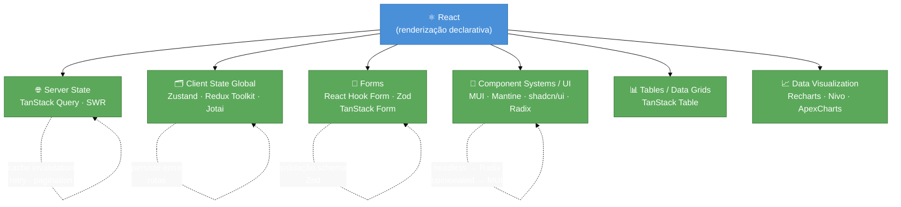
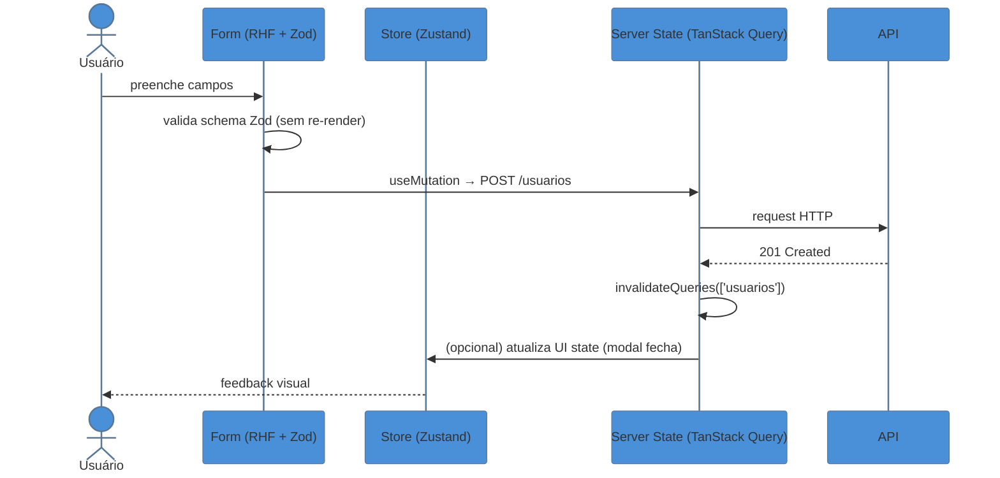

> [!abstract] TL;DR
> React é a cozinha — provê fogão, bancada e facas. O ecossistema são os utensílios especializados que a cozinha deliberadamente não inclui: quem busca os ingredientes na feira (data fetching), quem organiza a despensa (state management), quem anota as receitas (forms), quem monta o restaurante (component systems). Conhecer o mapa do ecossistema é saber qual ferramenta pegar antes de tentar reescrever tudo na mão.

# O ecossistema React: o mapa

Você terminou o tutorial. Sabe criar componentes, usar hooks, passar props e levantar estado. O app de To-Do funciona. Então você abre o Figma do produto real e percebe que precisa de três coisas que o React não entrega:

1. **Dados da API** que precisam de cache, retry automático e invalidação quando o usuário salva.
2. **Estado global** que um componente em `/settings` altera e um componente em `/dashboard` lê.
3. **Formulário de 15 campos** que valida CPF, formata telefone e não re-renderiza o mundo inteiro a cada keystroke.

E aí o React fica em silêncio. Não porque seja incompleto — mas porque foi projetado para ser *unopinionated*: a lib de UI faz UI e terceiriza o resto. Essa decisão de design deu origem a um ecossistema de bibliotecas especializadas que é, hoje, uma das maiores riquezas da plataforma React.

> [!question]- Mas por que o React não resolve tudo?
> A filosofia do React (e do Meta que o criou) é ser uma *view layer* composável. Adicionar opiniões fortes sobre roteamento, fetching ou forms tornaria a lib mais pesada e menos adaptável a diferentes contextos — SPAs, SSR, mobile com React Native, PDFs com `react-pdf`. A ausência de opinião é a opinião.

## O que o React faz — e o que ele não faz

Antes de mapear o ecossistema, é importante delimitar a fronteira:

| React FAZ | React NÃO FAZ |
|-----------|---------------|
| Renderização declarativa de UI | Roteamento (ex: React Router, TanStack Router) |
| Reconciliation e diffing eficiente | Data fetching e caching (ex: TanStack Query) |
| Gerenciamento de estado *local* via `useState` | Estado global complexo (ex: Zustand, Redux) |
| Compartilhamento de dados via Context API | Validação de formulários performática (ex: React Hook Form) |
| Ciclo de vida via `useEffect` e friends | Componentes de UI pré-construídos (ex: MUI, shadcn/ui) |
| Suspense para loading states | Tabelas e data grids (ex: TanStack Table) |
| Concurrent features (transitions, deferred) | Gráficos e visualizações (ex: Recharts) |

A Context API merece menção especial: ela *existe* no React, mas foi projetada para dados que mudam raramente (tema, locale, usuário logado). Usá-la como substituta de um store de estado global gera re-renders em cascata — um equívoco clássico que veremos nas armadilhas.

## As seis categorias do ecossistema

O ecossistema React pode ser organizado em seis famílias de problemas. Cada uma tem vencedores claros no State of React 2025 — a pesquisa anual com dezenas de milhares de devs.

### 1. Server state — dados remotos, cache e sincronização

Server state é o estado que *mora no servidor* e o cliente precisa sincronizar: listas de usuários, posts de blog, resultados de busca. O problema não é só buscar — é saber quando re-buscar, como cachear, como tratar loading/error e como invalidar após uma mutação.

**Libs líderes:** TanStack Query v5 (antes React Query), SWR

TanStack Query resolve cache, deduplicação de requests, refetch em background, paginação e otimistic updates com uma API declarativa baseada em hooks:

```ts
// src/hooks/useUsuarios.ts
import { useQuery } from '@tanstack/react-query'

interface Usuario {
  id: number
  nome: string
  email: string
}

async function fetchUsuarios(): Promise<Usuario[]> {
  const res = await fetch('/api/usuarios')
  if (!res.ok) throw new Error('Falha ao buscar usuários')
  return res.json()
}

export function useUsuarios() {
  return useQuery({
    queryKey: ['usuarios'],
    queryFn: fetchUsuarios,
    staleTime: 1000 * 60 * 5, // 5 minutos antes de considerar stale
  })
}
```

> [!tip] Server state ≠ client state
> `useQuery` não armazena a lista de usuários "no app" — ele gerencia uma cópia sincronizada do que está no servidor. Quando o usuário navega para outra tela e volta, TanStack Query decide se re-busca ou usa o cache. Você não toma essa decisão manualmente.

### 2. Client state global — estado de UI compartilhado

Algumas informações não vêm de nenhum servidor: o tema dark/light selecionado, o ID do item selecionado na sidebar, o progresso de um wizard multi-step. Esse estado é do cliente e precisa ser acessível de qualquer componente da árvore.

**Libs líderes:** Zustand v5, Redux Toolkit (RTK), Jotai

Zustand lidera satisfação no State of React 2025 com uma API mínima de boilerplate:

```ts
// src/store/uiStore.ts
import { create } from 'zustand'

interface UIStore {
  tema: 'light' | 'dark'
  alternarTema: () => void
}

export const useUIStore = create<UIStore>((set) => ({
  tema: 'light',
  alternarTema: () =>
    set((state) => ({ tema: state.tema === 'light' ? 'dark' : 'light' })),
}))
```

Redux Toolkit (RTK) ainda é preferido em equipes grandes por seu ecossistema maduro (DevTools, middleware, RTK Query) e padrões explícitos que escalam com times. Jotai adota modelo atômico (parecido com Recoil): cada pedaço de estado é um átomo independente, o que evita renders desnecessários em stores muito grandes.

### 3. Forms — validação e performance de re-render

Formulários parecem simples até você ter 15 campos, validação condicional, máscaras de input e a percepção de que cada keystroke está re-renderizando 30 componentes. O problema central é a tensão entre **controle** (React precisa saber o valor) e **performance** (re-render a cada tecla tem custo).

**Lib líder:** React Hook Form v7 + Zod

React Hook Form usa refs ao invés de state para rastrear inputs — o componente não re-renderiza a cada keystroke. A validação com Zod tipa o formulário end-to-end:

```ts
// src/schemas/cadastroSchema.ts
import { z } from 'zod'

export const cadastroSchema = z.object({
  nome: z.string().min(2, 'Nome deve ter ao menos 2 caracteres'),
  email: z.string().email('E-mail inválido'),
  cpf: z.string().regex(/^\d{3}\.\d{3}\.\d{3}-\d{2}$/, 'CPF inválido'),
})

export type CadastroForm = z.infer<typeof cadastroSchema>
```

React Hook Form com 74% de uso no State of React 2025 é o padrão de mercado. TanStack Form cresce rapidamente (21%, +8 posições), com integração nativa ao TanStack ecosystem.

### 4. Component systems e UI — componentes pré-construídos

Construir um `<DatePicker>` acessível, um `<Select>` com busca e um `<Modal>` com foco trapeado do zero é semanas de trabalho. Bibliotecas de componentes resolvem isso — mas com trade-offs diferentes.

**Libs principais:**

- **MUI v6** — Material Design, opinionated, 3,3M downloads/semana; máxima produtividade, mínima customização visual.
- **Mantine** — componentes ricos, tema flexível, bom suporte SSR.
- **shadcn/ui** — não é uma lib npm; são componentes copiados para o seu projeto com Radix UI
  + Tailwind. Cresceu de 20% → 56% de uso em dois anos (State of React 2025). Zero lock-in.
- **Radix UI** — primitivos headless: comportamento e acessibilidade sem estilos. Base do shadcn/ui.

> [!tip] Headless vs. opinionated
> Radix/shadcn entregam comportamento (foco, ARIA, teclado) sem CSS. Você estiliza do zero. MUI entrega comportamento + visual Material. Escolha pelo trade-off: velocidade de entrega vs. liberdade criativa.

### 5. Tables e data grids — sorting, filtering e virtualização

Tabelas de dados são notoriamente complexas: ordenação multi-coluna, filtragem, paginação, seleção de linhas, edição inline, virtualização de 100k linhas. Construir isso manualmente não é produtivo.

**Lib líder:** TanStack Table v8

TanStack Table é *headless*: você controla o HTML e o CSS; a lib entrega a lógica. Compatível com React, Solid, Vue e Svelte.

### 6. Data visualization e charts

Gráficos de linha, barras, pizza e scatter têm suas próprias complexidades: escalas, tooltips, animações, responsividade e acessibilidade. Ver [[03-Dominios/Tecnologia/React/Charts/index|Charts]].

**Libs populares:** Recharts (API declarativa, baseada em SVG), Nivo (variedade de gráficos, animações via react-spring), ApexCharts (chart types ricos, bom suporte a séries temporais).

## O mapa do ecossistema



## A stack típica em 2026

Antes de detalhar os critérios de seleção, vale ver como as categorias se conectam numa stack real. A combinação mais adotada em projetos novos combina uma lib por categoria, evitando sobreposição de responsabilidades:

```
TanStack Query   →  server state (API, cache, sync)
Zustand          →  client state (UI, preferências, wizard steps)
React Hook Form  →  forms (ref-based, sem re-render por keystroke)
Zod              →  validação de schema (compartilhada entre front e back)
shadcn/ui        →  componentes de UI (headless + Tailwind, sem lock-in)
TanStack Table   →  tabelas de dados (headless, virtualização incluída)
Recharts         →  gráficos (SVG declarativo, API React-first)
```

Essa stack tem uma característica importante: cada lib é *headless* ou *focada*. Nenhuma tenta resolver mais de uma categoria. O resultado é que você pode trocar qualquer peça sem derrubar as outras — se amanhã o Zustand for superado por outra lib, você migra só o store.

> [!question]- Preciso de todas essas libs em todo projeto?
> Não. Um CRUD simples provavelmente precisa de TanStack Query + React Hook Form + shadcn/ui e nada mais. Zustand é necessário quando tem estado de UI que cruza múltiplas rotas. TanStack Table entra quando tem tabela com ordenação/filtro/paginação do lado do cliente. A stack acima é o *máximo possível*, não o ponto de partida.

### Como as categorias se complementam

Um fluxo de "criar usuário" numa app típica passa por três categorias ao mesmo tempo:



O Form captura e valida. O `useMutation` do TanStack Query envia para a API. Na resposta, `invalidateQueries` faz a lista de usuários re-buscar automaticamente — sem você gerenciar nenhum loading state manualmente.

## Como escolher uma dependência

Adicionar uma lib é fácil. Remover depois é doloroso. Antes de `npm install`, avalie:

| Critério | O que checar | Sinal de alerta |
|----------|--------------|-----------------|
| **Manutenção ativa** | Última release, PRs mergeadas, issues respondidas | Último commit > 1 ano |
| **Bundle size** | bundlephobia.com — tamanho gzipped | > 50 kB sem tree-shaking |
| **TypeScript nativo** | `.d.ts` no pacote principal, não em `@types/` separado | Tipos mantidos por terceiros |
| **Lock-in** | Custo de migração se precisar trocar | API propietária difícil de abstrair |
| **Comunidade** | Stars GitHub, downloads npm semanais, StackOverflow | < 1k stars, < 10k downloads |
| **Suporte SSR/RSC** | Funciona com Next.js App Router? | Usa `window` no escopo do módulo |

> [!tip] Regra prática de budget de dependências
> Para cada lib que entra, pergunte: "Se essa lib for abandonada em 2 anos, quanto custaria migrar?" Se a resposta for "muito", ela precisa de uma camada de abstração acima dela.

A combinação mais comum em projetos novos (2025–2026): **TanStack Query + Zustand + React Hook Form + Zod + shadcn/ui**. Cada uma lidera sua categoria em satisfação no State of React 2025.

### O ponto de corte: quando não adicionar lib alguma

34% dos respondentes do State of React 2025 dizem não usar nenhuma biblioteca de state management — e estão certos para projetos onde os hooks nativos bastam. O critério prático:

- **useState + props**: componentes que não compartilham estado com ninguém distante na árvore.
- **Context API**: configuração lenta (tema, locale, usuário logado) que raramente muda.
- **Zustand / Jotai**: estado que muda com frequência e é lido em componentes de ramos diferentes da árvore (carrinho, sidebar, wizard).
- **TanStack Query**: qualquer dado que vem de rede, ponto final.

A pergunta certa não é "qual lib de state devo usar?" mas "esse estado é do servidor ou do cliente? Muda com frequência? Cruza rotas?" As respostas determinam a categoria; a categoria determina a lib.

## Números que contextualizam o ecossistema

O ecossistema React não é uma opinião — é mensurável. Alguns dados do State of React 2025 e npm que ajudam a calibrar o peso de cada categoria:

| Categoria / Lib | Indicador | Fonte |
|-----------------|-----------|-------|
| React Hook Form | 74% de uso entre devs React | State of React 2025 |
| TanStack Form | 21% de uso, +8 posições em 1 ano | State of React 2025 |
| shadcn/ui | 20% → 56% de uso em 2 anos | State of React 2025 |
| Zustand v5 | Maior satisfação em state management | State of React 2025 |
| MUI | 3,3M downloads/semana | npm |
| Ant Design | 1,3M downloads/semana | npm |
| React Bootstrap | 1,1M downloads/semana | npm |
| Devs sem lib de state | 34% gerenciam estado só com hooks nativos | State of React 2025 |

> [!tip] Leia os números com contexto
> MUI ter mais downloads não significa ser a melhor escolha — significa ter mais projetos legados que já o adotaram. shadcn/ui cresce rápido *entre projetos novos*. Escolha pelo caso de uso, não pela popularidade absoluta.

## Armadilhas comuns

> [!warning] Usar Redux para tudo — inclusive server state
> **O que acontece:** você cria actions `FETCH_USERS_REQUEST / SUCCESS / FAILURE`, reducers para loading/error/data, e selectors para acessar. Funciona — mas é dez vezes mais código do que precisa. **Por quê:** Redux foi projetado para *client state*. Server state tem lógica própria (cache, stale, refetch) que Redux não trata nativamente. **Como evitar:** Use TanStack Query para dados que vêm de API. Reserve Redux/Zustand para estado que *não* tem correspondente no servidor (ex: estado de UI, preferências locais).

> [!warning] Context API como substituto de Zustand
> **O que acontece:** você cria um `UserContext` com `useState` dentro, envolve o app com o Provider e acessa via `useContext`. Parece elegante — até perceber que qualquer atualização no context re-renderiza *todos* os consumidores, mesmo os que não usam a parte do estado que mudou. **Por quê:** `React.createContext` não tem mecanismo de seleção granular. Se o objeto do context mudar (qualquer campo), todos os componentes que consomem re-renderizam. **Como evitar:** Context para dados lentos e amplos (tema, locale, usuário autenticado). Zustand ou Jotai para estado que muda com frequência e precisa de leitura granular.

> [!warning] Instalar MUI quando shadcn/ui resolve o problema
> **O que acontece:** você instala `@mui/material` + `@emotion/react` + `@emotion/styled` (3 deps pesadas) para usar um `<Button>` e um `<TextField>`. **Por quê:** MUI é um design system completo com tema, tokens e componentes acoplados ao Material Design. Se o produto tem identidade visual própria, você passa mais tempo sobrescrevendo estilos do que usando a lib. **Como evitar:** Se o design é custom, comece com shadcn/ui — você copia os componentes para o projeto, não tem dependência de runtime extra, e customiza com Tailwind livremente. Se o design É Material, aí MUI faz sentido.

> [!warning] Misturar TanStack Query e useState para o mesmo dado
> **O que acontece:** `useQuery` busca os usuários, mas você copia o resultado para um `useState` local para "facilitar" edições. Agora tem duas fontes de verdade: o cache do TanStack Query e o estado local. Elas divergem. **Por quê:** O modelo do TanStack Query é: o cache *é* a fonte de verdade. Mutações usam `useMutation` + `invalidateQueries` para sincronizar. **Como evitar:** Não copie dados do `useQuery` para `useState`. Edições otimistas têm API própria no TanStack Query.

## Como explicar em inglês

When interviewers ask about your tech stack, the expected answer covers *why* you chose each layer, not just the names. Example: "We use TanStack Query for server state because it handles caching and background refetching out of the box, and Zustand for UI state because its selector model prevents unnecessary re-renders."

| PT | EN |
|----|----|
| ecossistema React | React ecosystem |
| estado do servidor | server state |
| estado do cliente / estado de UI | client state / UI state |
| gerenciamento de estado | state management |
| busca de dados | data fetching |
| cache / cacheamento | caching |
| validação de formulário | form validation |
| biblioteca de componentes | component library |
| design system | design system |
| tamanho do bundle | bundle size |
| lock-in / acoplamento | lock-in / vendor lock-in |
| headless (sem estilos) | headless |
| primitivos de UI | UI primitives |
| invalidação de cache | cache invalidation |

## O que vem a seguir

Agora que você tem o mapa, o próximo passo é entender a primeira — e mais frequente — categoria: **server state**. A maior parte dos bugs de React em produção vem de gerenciamento manual de dados remotos (loading states inconsistentes, cache stale, condições de corrida em requests paralelos). TanStack Query resolve tudo isso com uma API declarativa.

- **Server state com TanStack Query** — o padrão de mercado para sincronizar dados remotos com cache, retry e invalidação automáticos.
- **Client state com Zustand** — quando o dado não vem de API, como você compartilha estado entre componentes sem Context e sem boilerplate.
- [[03-Dominios/Tecnologia/React/React core/15 - Estado - local, elevado e externo|React core 15]] — pré-requisito: estado local, elevado e externo no React puro, antes de adicionar libs externas.
- [[03-Dominios/Tecnologia/React/Next.js/index|Next.js]] — como o framework muda a equação do server state: Server Components buscam dados no servidor, eliminando parte do trabalho do TanStack Query.

## Fontes

- **State of React 2025** — [*Libraries*](https://2025.stateofreact.com/en-US/libraries/) — Survey com milhares de devs; dados de adoção e satisfação por categoria.
- **Robin Wieruch** — [*React Libraries for 2026*](https://www.robinwieruch.de/react-libraries/) — Guia anual curado das libs recomendadas por categoria; autor referência no ecossistema React.
- **Developer Way** — [*React State Management in 2025*](https://www.developerway.com/posts/react-state-management-2025) — Análise prática de quando usar cada abordagem de state.
- **TanStack Query Docs** — [*Overview*](https://tanstack.com/query/latest/docs/framework/react/overview) — Documentação oficial; seção "Motivation" explica o problema do server state melhor do que qualquer artigo.
- **Zustand GitHub** — [*pmndrs/zustand*](https://github.com/pmndrs/zustand) — README conciso que mostra o modelo mental em 20 linhas.
- [[03-Dominios/Tecnologia/React/Dicionário de React|Dicionário de React]] — glossário interno do galho para termos-chave.

---

*O ecossistema React em uma frase: React resolve o "como renderizar"; o ecossistema resolve o "como organizar tudo o mais".*
