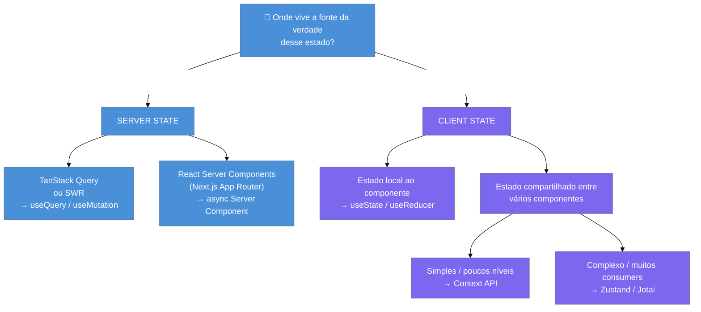

> [!abstract] TL;DR
> **Server state** é qualquer dado que vive num servidor externo — você não é dono, apenas
> sincroniza uma cópia local. É assíncrono, pode estar desatualizado (*stale*) e é compartilhado
> entre usuários. **Client state** é estado de UI que vive no browser — você é dono, é síncrono e
> não precisa de cache. A distinção importa porque a ferramenta certa para cada tipo é diferente:
> server state → TanStack Query (ou SWR); client state global → Zustand/Context; formulário antes
> de submeter → `useState`. Misturar os dois em Redux ou num `useEffect` manual gera complexidade
> desnecessária e bugs de sincronização.

> [!info] Pré-requisito
> Esta nota pressupõe familiaridade com `useState` e o conceito de estado local, elevado e externo
> em React. Se algum desses termos não está claro, comece pela
> [[03-Dominios/Tecnologia/React/React core/15 - Estado - local, elevado e externo|React core 15]]
> antes de continuar.
> Ver também: [[03-Dominios/Tecnologia/React/React core/05 - useState e estado local|React core 05]].

## O problema que trouxe você até aqui

Imagine um componente que busca a lista de pedidos de um usuário. A primeira versão que todo
desenvolvedor escreve parece inocente:

```tsx
// ❌ A armadilha clássica
const [orders, setOrders] = useState<Order[]>([]);
const [loading, setLoading] = useState(false);
const [error, setError] = useState<string | null>(null);

useEffect(() => {
  setLoading(true);
  fetch('/api/orders')
    .then(res => res.json())
    .then(data => setOrders(data))
    .catch(err => setError(err.message))
    .finally(() => setLoading(false));
}, []);
```

Parece razoável. Mas o que acontece quando você navega para outra tela e volta? Refaz o fetch.
E quando dois componentes diferentes precisam dos mesmos pedidos? Dois fetches. E quando o
servidor atualiza os dados? Você nunca fica sabendo, a menos que implemente polling manual. E
race conditions? Requests fora de ordem podem sobrescrever dados corretos com dados antigos.

Esse não é um problema de código ruim — é um problema de **usar a ferramenta errada para o
trabalho**. O `useState` foi feito para estado local e síncrono. Dados de servidor são outra
coisa completamente diferente.

## Duas categorias, dois mundos

A distinção que resolve esse problema é simples, mas muda tudo:

> [!question]- Por que a distinção importa tanto se no final é tudo "estado"?
> Porque a natureza de cada tipo é fundamentalmente diferente. Client state você controla
> completamente — você decide quando muda, como muda e o valor inicial. Server state você
> **não controla** — outro usuário pode alterá-lo enquanto você olha para a tela. Tentar gerenciar
> os dois com as mesmas ferramentas é como usar o mesmo recipiente para guardar água e fogo.

### Server state — o estado que você não possui

Server state é qualquer dado que **vive num servidor externo** e que você está apenas refletindo
localmente. O banco de dados é a fonte da verdade; você tem uma cópia — e essa cópia pode
estar desatualizada.

Características que definem server state:

- **Assíncrono por natureza**: qualquer leitura ou escrita envolve uma chamada de rede.
- ***Stale* por design**: entre o momento do fetch e agora, o dado no servidor pode ter mudado.
- **Compartilhado entre usuários**: a mesma API retorna dados que outro usuário pode alterar.
- **Precisa de cache**: refazer o mesmo fetch toda vez que um componente monta é custoso e
  cria UX ruim.
- **Tem estados intermediários**: loading, error, sucesso, background refetch.

Exemplos práticos: lista de produtos de um e-commerce, perfil do usuário logado, histórico de
pedidos, comentários de um post, configurações salvas no banco.

### Client state — o estado que você possui

Client state é estado de UI que **vive inteiramente no browser**. Você é o dono. Não existe
"sincronizar com servidor" nem "pode estar desatualizado". É simples, previsível e síncrono.

Características que definem client state:

- **Síncrono**: leitura e escrita são instantâneas — sem Promise, sem loading.
- **Local e efêmero**: quando o usuário fecha a aba, some (a menos que você persista manualmente).
- **Não é compartilhado entre usuários**: cada browser tem sua própria cópia.
- **Não precisa de cache de rede**: não há rede envolvida.

Exemplos práticos: modal aberto/fechado, aba selecionada num tab bar, tema dark/light, filtros
ativos numa listagem, texto sendo digitado num formulário antes de submeter, item expandido num
accordion.

## Tabela comparativa — as duas categorias lado a lado

| Característica | Server State | Client State |
|---|---|---|
| **Onde vive a fonte da verdade** | Servidor externo (banco, API) | Browser (memória da sessão) |
| **Quem é o dono** | Servidor — você só sincroniza | Você — controle total |
| **Sincronismo** | Assíncrono (rede envolvida) | Síncrono (memória local) |
| **Pode estar desatualizado?** | Sim — *stale by design* | Não — você decide o valor |
| **Compartilhado entre usuários?** | Sim — mesma API, múltiplos clientes | Não — isolado por sessão/browser |
| **Precisa de cache?** | Sim — evitar refetch redundante | Não — sem custo de rede |
| **Estados intermediários** | loading, error, stale, fetching | Nenhum — é síncrono |
| **Persiste entre reloads?** | Sim (no servidor) | Só se você persistir (localStorage) |
| **Ferramenta ideal** | TanStack Query / SWR / RSC | useState / Zustand / Context |
| **Exemplos típicos** | Pedidos, perfil, produtos, posts | Modal aberto, aba ativa, tema, filtros |

Essa tabela é o filtro mental que você vai aplicar automaticamente depois de um tempo. Quando
surgir um novo pedaço de estado, a pergunta "onde vive a fonte da verdade?" resolve a dúvida em
segundos.

## O mapa de decisão

A pergunta que você deve fazer toda vez que encontrar um novo pedaço de estado:

> **"A fonte da verdade desse dado vive num servidor externo?"**

Se sim → server state → TanStack Query.
Se não → client state → `useState`, Context, Zustand ou similar.



> [!example] RSC é outra abordagem de server state
> No Next.js App Router, React Server Components permitem buscar dados diretamente no servidor,
> sem expor a chamada ao cliente. É uma terceira abordagem para server state — diferente de
> TanStack Query, que roda no cliente. Ver [[03-Dominios/Tecnologia/React/Next.js/05 - Data fetching no Server|Next.js 05]]
> para aprofundar.

## Por que isso não era óbvio antes do TanStack Query

Durante anos, a resposta padrão para "como gerenciar estado em React" era Redux. E Redux foi — e
ainda é — excelente para client state complexo. O problema surgiu quando times começaram a colocar
**tudo** no Redux, incluindo dados do servidor.

O resultado era um store parecido com isso:

```ts
// ❌ Redux store tratando server state como client state
interface StoreState {
  products: {
    data: Product[];
    loading: boolean;
    error: string | null;
    lastFetchedAt: number | null; // cache manual
  };
  orders: {
    data: Order[];
    loading: boolean;
    error: string | null;
  };
  ui: {
    isSidebarOpen: boolean;  // client state real
    activeTab: string;       // client state real
  };
}
```

Cada fatia de dados do servidor precisava de: action de request, action de sucesso, action de
erro, reducer com três casos, selector, thunk assíncrono, e lógica manual de cache (quando
refetch? como invalidar?). Para cada endpoint. Multiplicado por todos os recursos da aplicação.

O TanStack Query (lançado como React Query em 2019 por Tanner Linsley) surgiu com uma premissa
simples: **server state não é client state, e tentar gerenciá-lo com as mesmas ferramentas cria
complexidade acidental**. A solução é uma biblioteca especializada que já sabe que dados de
servidor são assíncronos, *stale*, compartilhados e precisam de cache.

> [!question]- Mas e se eu precisar que o Redux saiba sobre dados do servidor?
> Você raramente vai precisar. A situação mais comum onde isso parece necessário é quando um
> componente distante no DOM precisa ler dados que outro componente já buscou. O TanStack Query
> resolve isso nativamente: qualquer componente que use o mesmo `queryKey` lê do mesmo cache,
> sem prop drilling e sem Redux. Se você realmente precisar combinar, é possível ler de
> `queryClient` dentro de thunks, mas essa é uma necessidade rara e avançada.

## Antes e depois — o mesmo dado, duas filosofias

Ver a diferença lado a lado é a forma mais rápida de internalizar a distinção.

### Antes: server state tratado como client state

```tsx
// ❌ useEffect + useState para dados de servidor — a receita do sofrimento
import { useState, useEffect } from 'react';

interface Product {
  id: number;
  name: string;
  price: number;
}

function ProductList() {
  const [products, setProducts] = useState<Product[]>([]);
  const [loading, setLoading] = useState(false);
  const [error, setError] = useState<string | null>(null);

  useEffect(() => {
    // Problema 1: sem cancelamento — race condition potencial
    // Problema 2: sem cache — refaz o fetch toda vez que o componente monta
    // Problema 3: sem retry automático em caso de falha de rede
    // Problema 4: sem refetch em background quando o usuário volta para a aba
    setLoading(true);
    fetch('/api/products')
      .then(res => {
        if (!res.ok) throw new Error('Falha na requisição');
        return res.json() as Promise<Product[]>;
      })
      .then(data => setProducts(data))
      .catch(err => setError(err instanceof Error ? err.message : 'Erro desconhecido'))
      .finally(() => setLoading(false));
  }, []);

  if (loading) return <p>Carregando...</p>;
  if (error) return <p>Erro: {error}</p>;
  return <ul>{products.map(p => <li key={p.id}>{p.name}</li>)}</ul>;
}
```

Se dois componentes diferentes montarem esse `ProductList`, a API é chamada duas vezes. Se o
usuário sair e voltar, a API é chamada de novo. Não há cache, não há deduplicação, não há retry.

### Depois: TanStack Query gerencia server state

```tsx
// ✅ useQuery — server state com cache, deduplicação e retry automático
import { useQuery } from '@tanstack/react-query';

interface Product {
  id: number;
  name: string;
  price: number;
}

async function fetchProducts(): Promise<Product[]> {
  const res = await fetch('/api/products');
  if (!res.ok) throw new Error('Falha na requisição');
  return res.json();
}

function ProductList() {
  const { data: products, isLoading, error } = useQuery({
    queryKey: ['products'],       // chave de cache — identifica este dado
    queryFn: fetchProducts,       // a função que busca os dados
    staleTime: 5 * 60 * 1000,    // considera fresco por 5 minutos
  });

  if (isLoading) return <p>Carregando...</p>;
  if (error) return <p>Erro: {(error as Error).message}</p>;
  return <ul>{products!.map(p => <li key={p.id}>{p.name}</li>)}</ul>;
}
```

Se dois componentes diferentes renderizarem, o TanStack Query deduplica a requisição — uma
chamada só. Se o usuário sair e voltar, usa o cache (sem loader). Se passar o `staleTime`, faz
refetch silencioso em background enquanto já mostra o dado em tela.

### Client state correto: Zustand para UI global

```tsx
// ✅ Zustand para client state compartilhado entre componentes
import { create } from 'zustand';

interface UIState {
  isSidebarOpen: boolean;
  activeTab: 'products' | 'orders' | 'settings';
  toggleSidebar: () => void;
  setActiveTab: (tab: UIState['activeTab']) => void;
}

export const useUIStore = create<UIState>((set) => ({
  isSidebarOpen: false,
  activeTab: 'products',
  toggleSidebar: () => set(state => ({ isSidebarOpen: !state.isSidebarOpen })),
  setActiveTab: (tab) => set({ activeTab: tab }),
}));

// Em qualquer componente:
function Sidebar() {
  const { isSidebarOpen, toggleSidebar } = useUIStore();
  // Síncrono, instantâneo, sem loading state — client state como deve ser
  return <aside className={isSidebarOpen ? 'open' : 'closed'}>...</aside>;
}
```

Nenhum loading, nenhum error state, nenhum fetch. É síncrono porque não há rede — é só memória
do browser.

## Casos práticos — aplicando o filtro mental

### Cenário 1: carrinho de compras

Um carrinho de compras parece client state à primeira vista — afinal, é UI interativa. Mas a
classificação depende da sua arquitetura:

- **Se o carrinho é salvo no servidor** (usuário pode acessar de outro dispositivo, sessão persiste
  após logout/login) → **server state** → TanStack Query + `useMutation` para adicionar/remover
  itens, com `invalidateQueries(['cart'])` após cada mutação.
- **Se o carrinho é só local** (some ao fechar o browser, não há conta de usuário) →
  **client state** → Zustand com uma fatia `cartStore`, opcionalmente persistida no
  `localStorage` via `zustand/middleware/persist`.

A pergunta-chave: *"Onde vive a fonte da verdade?"* Não há resposta única — depende do produto.

### Cenário 2: filtros de uma listagem

Filtros de busca têm duas partes com natureza diferente:

```tsx
// Os filtros ativos são client state — você os possui
const [filters, setFilters] = useState<Filters>({ category: 'all', minPrice: 0 });

// Os produtos filtrados são server state — a API os possui
const { data: products } = useQuery({
  queryKey: ['products', filters],  // filtros entram na queryKey!
  queryFn: () => fetchProducts(filters),
});
```

Os filtros (o que o usuário selecionou) são client state — vivem no browser, você controla.
Os produtos (o resultado da busca) são server state — vivem na API. A `queryKey` inclui os filtros
para que o TanStack Query mantenha um cache separado por combinação de filtros: mudar de categoria
não descarta o cache da categoria anterior.

## Armadilhas comuns

> [!warning] Colocar server state no Redux/Zustand manualmente
> **O que acontece:** você cria actions como `FETCH_PRODUCTS_REQUEST`, `FETCH_PRODUCTS_SUCCESS`,
> `FETCH_PRODUCTS_FAILURE` e redutores que gerenciam loading/error. O código triplica em tamanho
> e você ainda não tem cache, deduplicação nem retry.
> **Por quê:** Redux e Zustand são feitos para client state — não têm o conceito de "este dado
> pode estar *stale* no servidor". Você está reimplementando (mal) o que TanStack Query faz.
> **Como evitar:** qualquer dado que vem de uma API é server state → use TanStack Query. Guarde
> no Zustand apenas estado de UI (modais, abas, filtros locais).

> [!warning] Inicializar `useState` com dados de uma query e tentar "sincronizá-los"
> **O que acontece:** `const [user, setUser] = useState(queryData?.user)` — o estado local fica
> fora de sincronia quando o TanStack Query refetch em background. O componente exibe dado antigo.
> **Por quê:** `useState` guarda uma cópia do valor no momento da inicialização. Atualizações
> posteriores do `queryData` não propagam para o `useState`.
> **Como evitar:** leia diretamente do `queryData` ao renderizar. Se precisar de edição local,
> use um formulário separado (React Hook Form ou similar) e envie via `useMutation`.

> [!warning] Tratar formulário antes de submeter como server state
> **O que acontece:** o texto sendo digitado num campo, a seleção de um item num dropdown, o valor
> de um slider — tudo vai para o TanStack Query ou para um store global. Requests desnecessários,
> invalidações, complexidade.
> **Por quê:** o formulário antes de submeter é client state efêmero. Não existe no servidor; você
> está construindo o payload que *vai* para o servidor. A fonte da verdade é o usuário, não a API.
> **Como evitar:** formulários vivem em `useState` local ou numa lib de formulários (React Hook
> Form, Formik). Só após o submit você chama `useMutation` para persistir no servidor.

> [!warning] Refetch manual excessivo por não confiar no cache
> **O que acontece:** o desenvolvedor adiciona `refetchInterval: 1000` em toda query "por garantia",
> ou chama `queryClient.invalidateQueries()` em todo lugar. A API recebe dezenas de requisições
> por minuto; a UX pisca constantemente.
> **Por quê:** desconfiança no mecanismo de *stale time* do TanStack Query. O padrão já é
> agressivo (`staleTime: 0` = sempre *stale*) e o Query refetch automaticamente em foco de janela.
> **Como evitar:** ajuste `staleTime` de acordo com a frequência de mudança real do dado. Dados
> que mudam a cada hora não precisam de `refetchInterval` de 1 segundo.

## Como explicar em inglês

In interviews, you'll often hear "how do you manage state in React?" — the best answer
distinguishes the two types before naming tools. A strong framing:

*"I separate state into two categories: server state and client state. Server state is data that
lives on the server — it's async, can be stale, and needs to be cached and synchronized.
For that I use TanStack Query. Client state is UI state that lives in the browser — it's
synchronous, local, and I own it completely. For global client state I use Zustand; for local
state, just `useState`."*

| PT | EN |
|----|-----|
| Estado do servidor | Server state |
| Estado do cliente | Client state |
| Desatualizado | Stale |
| Tempo de validade do cache | Stale time |
| Chave de consulta | Query key |
| Refazer a busca | Refetch |
| Invalidar o cache | Invalidate queries |
| Deduplicação de requisições | Request deduplication |
| Mutação | Mutation |
| Estado de UI | UI state |

## O que vem a seguir

Sabendo distinguir server state de client state, você tem o mapa mental para entender por que cada
ferramenta do ecossistema React existe. A próxima nota aplica esse mapa ao TanStack Query em
profundidade — como `queryKey` funciona como endereço de cache, o ciclo de vida *fresh → stale →
fetching*, e como `useMutation` fecha o ciclo de escrita.

- [[03-Dominios/Tecnologia/React/Ecossistema/01 - O ecossistema React - o mapa|Nota 01 — O mapa]] — panorama de onde TanStack Query se encaixa no ecossistema maior
- [[03-Dominios/Tecnologia/React/Dicionário de React|Dicionário de React]] — glossário dos termos usados nesta nota

---

*Server state em uma frase: é qualquer dado cuja fonte da verdade vive no servidor — você só tem
uma cópia local que pode estar desatualizada.*

## Fontes

- **TanStack** — [*TanStack Query — Overview*](https://tanstack.com/query/latest/docs/framework/react/overview) — documentação oficial; define explicitamente server state vs client state e o papel da biblioteca
- **TanStack** — [*Does TanStack Query replace Redux/Zustand?*](https://tanstack.com/query/v4/docs/react/guides/does-this-replace-client-state) — artigo canônico que explica a separação de responsabilidades entre libs de server state e client state
- **Tanner Linsley / TanStack** — [*GitHub: TanStack/query*](https://github.com/tanstack/query) — repositório com issues e discussions que documentam decisões de design, incluindo a distinção fundamental
- **Shivani Chaudhari** — [*From useEffect to useQuery: Modernising React Data Fetching*](https://medium.com/@iam.shivanic/from-useeffect-to-usequery-modernising-react-data-fetching-9bde1fb0e422) — comparação prática antes/depois com análise dos problemas do padrão `useEffect`
- **reactpractice.dev** — [*Data fetching with useEffect — why you should go straight to react-query*](https://reactpractice.dev/articles/data-fetching-with-useeffect-why-you-should-go-straight-to-react-query-even-for-simple-apps/) — contexto histórico dos problemas que motivaram o React Query
