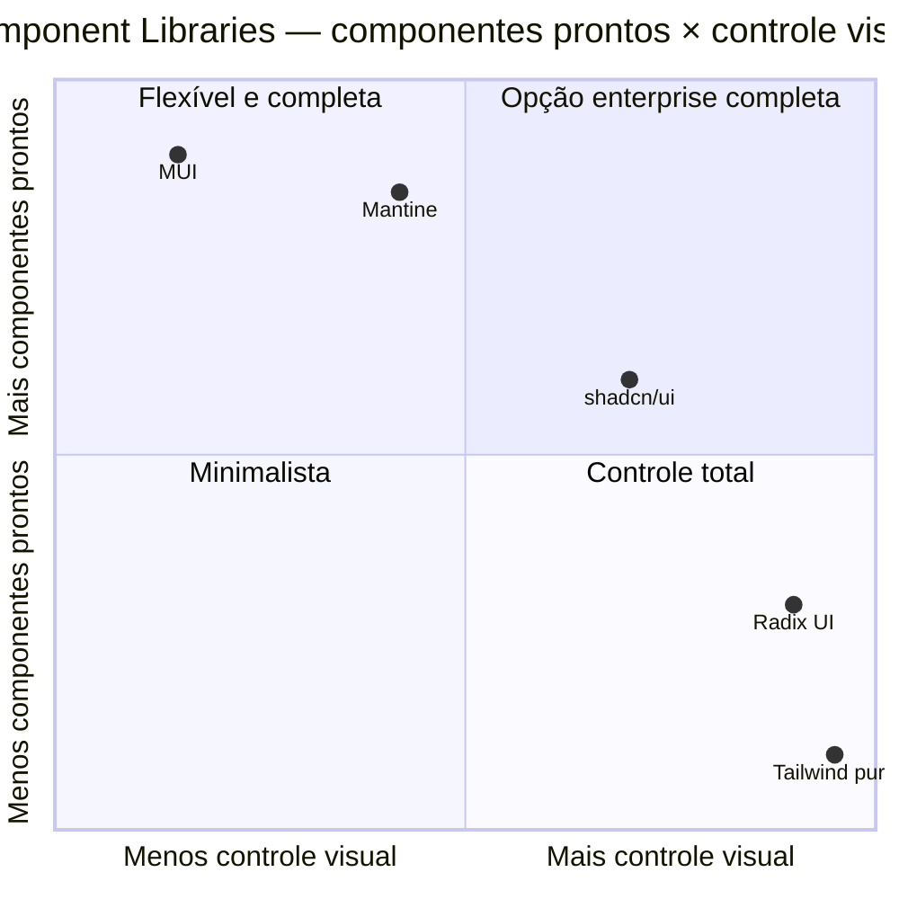
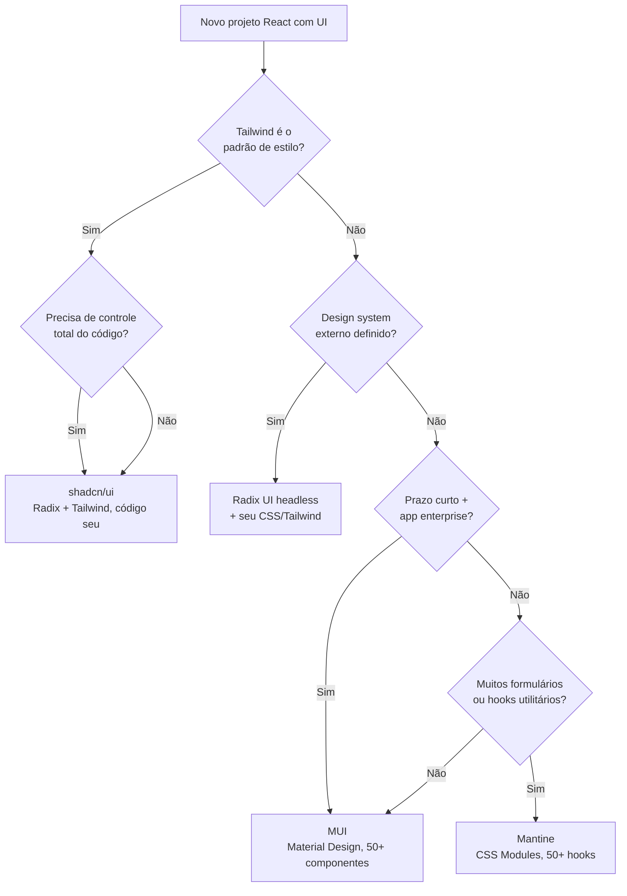

# Component libraries e design systems

> [!abstract] TL;DR
> Component libraries resolvem o problema de construir UI acessível, consistente e rápida. O espectro vai de **MUI** (totalmente opinionado, Material Design) a **Radix UI** (headless, sem estilo). Entre eles: **Mantine** (design neutro, CSS Modules, 50+ hooks) e **shadcn/ui** (não é uma lib — é código que você copia pro seu projeto, via CLI, construído sobre Radix + Tailwind). Escolha de acordo com o grau de controle visual que o projeto exige.

---

## O problema: por que não construir tudo do zero?

Imagine que você precisa implementar um dropdown com multi-seleção. Parece simples, mas a lista de requisitos reais assusta:

- **Teclado**: abrir com `Enter`/`Space`, navegar com `↑↓`, fechar com `Esc`.
- **ARIA**: `role="listbox"`, `aria-expanded`, `aria-activedescendant` — tudo sincronizado.
- **Focus trap**: foco não pode escapar para fora do dropdown enquanto está aberto.
- **Posicionamento**: o dropdown não pode sair da viewport; precisa detectar e inverter a direção.
- **Dark mode e temas**: cor do fundo, borda e texto precisam seguir o token certo.

Construir isso corretamente do zero leva dias. E errar acessibilidade não é só feio — é exclusão.

**Component libraries** resolvem esse problema entregando componentes pré-construídos, testados e acessíveis. **Design systems** adicionam uma camada acima: tokens visuais (cores, espaçamentos, tipografia) que garantem consistência entre todos os componentes.

A pergunta não é *se* usar uma lib, mas *qual* — e isso depende do quanto você quer controlar o visual.

---

## O espectro: de opinionado a headless

Pense em duas dimensões: **componentes prontos** (quanto a lib entrega de graça) e **controle visual** (quanto você pode customizar sem lutar contra a lib).



As quatro opções principais, do mais ao menos opinionado:

| Lib | Filosofia | Estilização | Componentes |
|---|---|---|---|
| **MUI** | Material Design | CSS-in-JS (Emotion) | 50+ |
| **Mantine** | Design neutro | CSS Modules (v7+) | 100+ |
| **shadcn/ui** | Você é dono do código | Tailwind CSS | ~50 (copiados) |
| **Radix UI** | Headless (sem estilo) | Nenhuma | 30+ primitivos |

---

## MUI — Material Design como ponto de partida

Material UI (MUI) é a biblioteca mais popular do ecossistema React. Ela implementa o [Material Design do Google](https://m3.material.io/) e entrega mais de 50 componentes prontos — do simples `Button` ao complexo `DataGrid` com sort, filtro e paginação nativos.

A identidade visual é forte e reconhecível. Isso é uma faca de dois gumes: você ganha velocidade e consistência, mas se o cliente tem um design system próprio, você vai lutar contra o Material Design durante todo o projeto.

### Componentes em ação

```tsx
import { Button, TextField, Card, CardContent, Typography, Stack } from '@mui/material';

function PatientForm() {
  return (
    <Card>
      <CardContent>
        <Typography variant="h5" gutterBottom>Novo Paciente</Typography>
        <Stack spacing={2}>
          <TextField label="Nome" fullWidth />
          <TextField label="Email" type="email" fullWidth />
          <Button variant="contained" color="primary" type="submit">
            Salvar
          </Button>
        </Stack>
      </CardContent>
    </Card>
  );
}
```

### Theming com MUI

O `createTheme` é o coração da customização. Você define uma vez e todos os 50+ componentes se adaptam automaticamente — sem sobrescrever CSS manualmente.

```tsx
import { createTheme, ThemeProvider } from '@mui/material/styles';

const theme = createTheme({
  palette: {
    primary: { main: '#2563eb' },
    secondary: { main: '#7c3aed' },
  },
  typography: {
    fontFamily: '"Inter", sans-serif',
    h5: { fontWeight: 600 },
  },
  shape: { borderRadius: 8 },
  components: {
    MuiButton: {
      defaultProps: { disableElevation: true },
    },
  },
});

export function App() {
  return (
    <ThemeProvider theme={theme}>
      <PatientForm />
    </ThemeProvider>
  );
}
```

**Quando escolher MUI**: app enterprise com prazo curto, equipe que já conhece a lib, projeto que pode tolerar (ou que quer) o visual Material Design. O pacote X (DataGrid, DatePicker, Charts) paga sozinho em apps data-heavy.

---

## Mantine — design neutro, hooks de brinde

Mantine tem um proposta diferente do MUI: design visual **neutro** (mais fácil de adaptar para diferentes marcas) e um ecossistema de **50+ hooks utilitários** inclusos — não como dependência separada, mas como parte da lib.

Desde a v7 (2023), migrou de CSS-in-JS para **CSS Modules** — sem custo de runtime, sem conflito com SSR, sem variáveis CSS que somem em produção.

### Componentes e hooks

```tsx
import { Button, TextInput, Card, Stack, Text } from '@mantine/core';
import { useDisclosure, useDebouncedValue } from '@mantine/hooks';
import { useForm } from '@mantine/form';

function PatientSearch() {
  const [opened, { open, close }] = useDisclosure(false);
  const [query, setQuery] = useState('');
  const [debounced] = useDebouncedValue(query, 300);

  const form = useForm({
    initialValues: { name: '', email: '' },
    validate: {
      email: (v) => (/^\S+@\S+$/.test(v) ? null : 'Email inválido'),
    },
  });

  return (
    <Card shadow="sm" padding="lg" radius="md" withBorder>
      <Stack>
        <Text size="lg" fw={500}>Busca de Pacientes</Text>
        <TextInput
          label="Nome"
          value={query}
          onChange={(e) => setQuery(e.currentTarget.value)}
          placeholder="Buscar por nome..."
        />
        <Button onClick={open}>Ver detalhes</Button>
      </Stack>
    </Card>
  );
}
```

### Theming com Mantine

```tsx
import { MantineProvider, createTheme } from '@mantine/core';
import '@mantine/core/styles.css'; // importação obrigatória desde v7

const theme = createTheme({
  primaryColor: 'blue',
  fontFamily: 'Inter, sans-serif',
  defaultRadius: 'md',
  colors: {
    brand: ['#e3f2fd', '#bbdefb', '#90caf9', '#64b5f6',
            '#42a5f5', '#2196f3', '#1e88e5', '#1976d2',
            '#1565c0', '#0d47a1'],
  },
});

export function App() {
  return (
    <MantineProvider theme={theme}>
      <PatientSearch />
    </MantineProvider>
  );
}
```

**Quando escolher Mantine**: projeto novo sem design system definido, aplicações com muitos formulários (`@mantine/form` é excelente), quando os hooks utilitários agregam valor direto (`useLocalStorage`, `useMediaQuery`, `useIntersection`).

---

## shadcn/ui — você é dono do código

shadcn/ui é a opção mais mal compreendida do ecossistema. A pergunta mais comum em entrevistas é *"como instalo o shadcn/ui?"* — e a resposta correta é: **você não instala**. Não existe pacote `npm install shadcn`.

O modelo é diferente: você usa a **CLI para copiar o código-fonte dos componentes** direto para o seu projeto. O componente `Button`, por exemplo, vira um arquivo `components/ui/button.tsx` no seu repo — com todo o código TypeScript visível, editável e versionável por você.

```bash
# Inicializa o projeto com shadcn/ui
npx shadcn@latest init

# Adiciona componentes individuais (copia o código pro seu projeto)
npx shadcn@latest add button
npx shadcn@latest add input
npx shadcn@latest add dialog
```

Internamente, cada componente usa **Radix UI** para comportamento (acessibilidade, foco, ARIA) e **Tailwind CSS** para estilo. O código gerado usa a função utilitária `cn()` que combina `clsx` + `tailwind-merge`.

### Usando componentes shadcn/ui

```tsx
// components/ui/button.tsx — código que você possui
import * as React from 'react';
import { Slot } from '@radix-ui/react-slot';
import { cva, type VariantProps } from 'class-variance-authority';
import { cn } from '@/lib/utils';

const buttonVariants = cva(
  'inline-flex items-center justify-center rounded-md text-sm font-medium ' +
  'transition-colors focus-visible:outline-none focus-visible:ring-2 ' +
  'disabled:pointer-events-none disabled:opacity-50',
  {
    variants: {
      variant: {
        default: 'bg-primary text-primary-foreground hover:bg-primary/90',
        outline: 'border border-input bg-background hover:bg-accent',
        ghost:   'hover:bg-accent hover:text-accent-foreground',
      },
      size: {
        default: 'h-9 px-4 py-2',
        sm:      'h-8 px-3 text-xs',
        lg:      'h-10 px-8',
      },
    },
    defaultVariants: { variant: 'default', size: 'default' },
  }
);

// Usando no seu app
import { Button } from '@/components/ui/button';
import { Input } from '@/components/ui/input';

function PatientForm() {
  return (
    <form className="space-y-4">
      <div className="space-y-2">
        <label className="text-sm font-medium">Nome</label>
        <Input placeholder="Nome completo" />
      </div>
      <Button type="submit" className="w-full">Salvar Paciente</Button>
    </form>
  );
}
```

### Theming com shadcn/ui

shadcn/ui usa **CSS custom properties** (variáveis CSS) definidas em `globals.css`. Trocar o tema é trocar os valores das variáveis — sem recompilar nada.

```css
/* globals.css — você controla os tokens */
:root {
  --background: 0 0% 100%;
  --foreground: 222.2 84% 4.9%;
  --primary: 221.2 83.2% 53.3%;
  --primary-foreground: 210 40% 98%;
  --radius: 0.5rem;
}

.dark {
  --background: 222.2 84% 4.9%;
  --foreground: 210 40% 98%;
  --primary: 217.2 91.2% 59.8%;
}
```

**Quando escolher shadcn/ui**: projeto Tailwind, quando o design system precisa de controle total (a UI vira código seu), quando você quer componentes acessíveis sem lock-in com uma lib de terceiros.

---

## Radix UI — o motor invisível

Radix UI Primitives é a biblioteca que roda embaixo do shadcn/ui (e de muitas outras). É **headless** — sem uma linha de CSS inclusa. Resolve os problemas difíceis de acessibilidade que a maioria dos devs ignora até encontrar um bug de teclado no Chrome.

O que o Radix entrega por componente:

- **ARIA attributes** corretos e sincronizados com o estado.
- **Keyboard navigation** conforme a spec WAI-ARIA.
- **Focus management** — foco que entra, fica e sai corretamente do componente.
- **Composição via `asChild`** — você pode fazer qualquer elemento HTML ser o root do componente sem quebrar semântica.

```tsx
import * as Dialog from '@radix-ui/react-dialog';

// Radix não estiliza nada — você aplica suas classes
function PatientModal({ patient }: { patient: Patient }) {
  return (
    <Dialog.Root>
      <Dialog.Trigger asChild>
        <button className="rounded bg-blue-600 px-4 py-2 text-white">
          Ver detalhes
        </button>
      </Dialog.Trigger>

      <Dialog.Portal>
        <Dialog.Overlay className="fixed inset-0 bg-black/50" />
        <Dialog.Content className="fixed left-1/2 top-1/2 -translate-x-1/2 -translate-y-1/2 rounded-lg bg-white p-6 shadow-xl">
          <Dialog.Title className="text-lg font-semibold">
            {patient.name}
          </Dialog.Title>
          <Dialog.Description className="mt-2 text-sm text-gray-600">
            {patient.email}
          </Dialog.Description>
          <Dialog.Close asChild>
            <button className="mt-4 text-sm text-gray-500 hover:text-gray-700">
              Fechar
            </button>
          </Dialog.Close>
        </Dialog.Content>
      </Dialog.Portal>
    </Dialog.Root>
  );
}
```

**Quando usar Radix diretamente**: design system totalmente customizado onde você quer escrever cada classe Tailwind, ou quando shadcn/ui não tem o componente que você precisa.

> [!info] Radix vs Base UI em 2026
> O Radix foi adquirido pela WorkOS em 2024 e o ritmo de atualizações desacelerou em alguns componentes complexos. A alternativa ativa é a **Base UI** (mantida pela equipe do MUI). O shadcn/ui já suporta ambos como camada primitiva — você pode trocar o Radix por Base UI por componente.

---

## Como escolher: o fluxograma



---

## Comparação rápida: theming

| | MUI | Mantine | shadcn/ui |
|---|---|---|---|
| **API de tema** | `createTheme()` | `createTheme()` | CSS variables |
| **Provider** | `<ThemeProvider>` | `<MantineProvider>` | Nenhum (só CSS) |
| **Dark mode** | Paleta `mode: 'dark'` | `colorScheme: 'dark'` | Classe `.dark` + CSS vars |
| **Bundle cost** | Alto (Emotion runtime) | Baixo (CSS Modules) | Zero (Tailwind purge) |
| **Token tipado** | `theme.palette.*` | `theme.colors.*` | `var(--primary)` |

---

## Como explicar em inglês

| Português | Inglês | Nota |
|---|---|---|
| biblioteca de componentes | component library | plural: component libraries |
| design system | design system | mesmo termo |
| sem estilo / headless | headless component | "no opinionated styles" |
| sistema de temas | theming system | ou "design tokens" |
| acessibilidade | accessibility (a11y) | abreviação com numerônimo |
| gerenciamento de foco | focus management | essencial para dropdowns/modals |
| árvore de componentes | component tree | context fundamental no React |
| módulos CSS | CSS Modules | solução de escopo de CSS |
| variáveis CSS | CSS custom properties | ou "CSS variables" |
| lock-in de biblioteca | library lock-in | ou "vendor lock-in" |

**Frase modelo para entrevista (em inglês)**:

> "For UI components, I assess the project needs first. If it's Tailwind-based, shadcn/ui is my default — I copy the components I need, own the code, and there's no runtime overhead. For enterprise apps with tight deadlines, MUI is hard to beat because of its DataGrid and theming system. When accessibility for complex interactions is the concern — modals, dropdowns, tooltips — I reach for Radix UI primitives because it handles ARIA and keyboard navigation correctly out of the box."

---

## Armadilhas comuns

> [!warning] MUI: custo de bundle subestimado
> O MUI com Emotion carrega runtime de CSS-in-JS mesmo em componentes que nunca renderizam no cliente. Projetos que importam `@mui/material` inteiro sem tree-shaking podem ter 200KB+ de JS a mais. **Mecanismo**: o Emotion serializa estilos em runtime e injeta `<style>` tags no `<head>` — isso é trabalho que acontece no navegador, não no build. Use imports nomeados (`import { Button } from '@mui/material'`) e verifique o bundle com `@next/bundle-analyzer`.

> [!warning] shadcn/ui: "não é uma lib instalada" é uma pegadinha de entrevista
> O erro mais comum é tentar `npm install shadcn-ui` e estranhar quando os componentes não aparecem no `node_modules`. O pacote npm do shadcn/ui é apenas a **CLI** — ela existe para rodar `npx shadcn add <componente>`, que copia código TypeScript pro seu projeto. Após a cópia, o componente vive em `components/ui/` e não tem dependência de runtime com o shadcn. A dependência real é com `@radix-ui/*` e `tailwindcss`.

> [!warning] Mantine v6 → v7: breaking change de estilização
> A migração da v6 para v7 é substancial: a lib abandonou completamente a abordagem CSS-in-JS (Emotion) em favor de CSS Modules. Componentes customizados com `createStyles` (v6) precisam ser reescritos usando a API `classNames` (v7). Além disso, a importação do CSS global mudou — sem `@mantine/core/styles.css` no entry point, nenhum componente renderiza com estilo. Se você encontrar um projeto Mantine sem estilo nenhum, verifique essa importação.

> [!warning] Radix UI: headless não significa "sem complexidade"
> Usar Radix diretamente exige entender a estrutura compositional de cada componente (Root, Trigger, Content, Portal, Overlay, Close...). Esquecer o `<Dialog.Portal>`, por exemplo, faz o modal renderizar fora do `document.body` e quebrar o z-index. A composição é poderosa, mas tem curva de aprendizado. shadcn/ui existe justamente para abstrair esse boilerplate.

---

## Casos práticos

### Caso 1 — Dashboard médico com MUI DataGrid

Um sistema de agendamentos médicos precisa exibir lista de pacientes com filtro por status, sort por nome/data e paginação. O DataGrid do `@mui/x-data-grid` resolve isso com ~30 linhas de configuração — virtualização inclusa para datasets de 10k+ registros. Tentar construir a mesma tabela do zero com `<table>` + `react-virtual` levaria 3 a 5 vezes mais código e mais bugs de acessibilidade.

```tsx
// ✗ Problema comum: importar DataGrid sem lazy loading em bundle pequeno
import { DataGrid } from '@mui/x-data-grid'; // ~80KB minificado

// ✓ Correto: lazy load para páginas que precisam do grid
const DataGrid = React.lazy(() =>
  import('@mui/x-data-grid').then((m) => ({ default: m.DataGrid }))
);
```

O pattern correto é isolar o DataGrid em uma rota com `React.lazy` para que o bundle principal não carregue os 80KB do grid em páginas que nunca mostram tabelas.

### Caso 2 — Design system de clínica com shadcn/ui + tokens de marca

Uma clínica precisa de UI com identidade visual própria: cor primária `#1a6b4a`, tipografia Inter, border-radius redondo. Com MUI, você lutaria contra o Material Design em cada componente. Com shadcn/ui, o processo é cirúrgico:

1. Rode `npx shadcn@latest init` e configure o `globals.css` com os tokens da marca.
2. Adicione apenas os componentes que precisar (`button`, `input`, `dialog`, `card`).
3. Cada componente gerado já usa as variáveis CSS — mudar a cor primária em `globals.css` reflete em todos.
4. Para um componente diferente (ex.: um seletor de horário clínico), escreva do zero reutilizando a `cn()` e os tokens — sem precisar sobrescrever estilos de terceiros.

O resultado: design system que parece feito sob medida, sem um designer precisar escrever CSS global de override.

---

## O que vem a seguir

Com as principais opções do espectro mapeadas — MUI, Mantine, shadcn/ui e Radix — o próximo passo natural é entender **gerenciamento de estado** em aplicações React: quando o estado local do componente basta, quando usar Context, e quando trazer uma lib de estado global. Esse tema é coberto na próxima nota do galho.

Além disso, quando você adotar shadcn/ui, vai perceber que os componentes usam `cva` (class-variance-authority) para variantes — o que conecta diretamente com padrões de composição em React (compound components, render props). Esses padrões aparecem nas notas de fase Adepto.

---

## Fontes

- [shadcn/ui — documentação oficial](https://ui.shadcn.com/) — instalação, componentes, theming com CSS variables
- [Radix UI Primitives](https://www.radix-ui.com/primitives) — documentação dos headless primitivos
- [MUI — Material UI](https://mui.com/material-ui/) — componentes, sistema de temas, MUI X
- [Mantine Docs](https://mantine.dev/) — componentes, hooks, migração v6→v7
- [Vercel Academy — shadcn/ui + Radix](https://vercel.com/academy/shadcn-ui) — explicação da arquitetura Radix + Tailwind

---

## Veja também

- [[03-Dominios/Tecnologia/React/Ecossistema/01 - O ecossistema React - o mapa|Nota 01 — O mapa]] — panorama de onde component libraries se encaixam
- [[03-Dominios/Tecnologia/React/Dicionário de React|Dicionário de React]] — termos e vocabulário do ecossistema

---

> **Resumo em 1 linha**: Component libraries economizam semanas de trabalho em acessibilidade e consistência visual — a escolha entre MUI, Mantine, shadcn/ui e Radix depende do grau de controle visual que o projeto exige.
