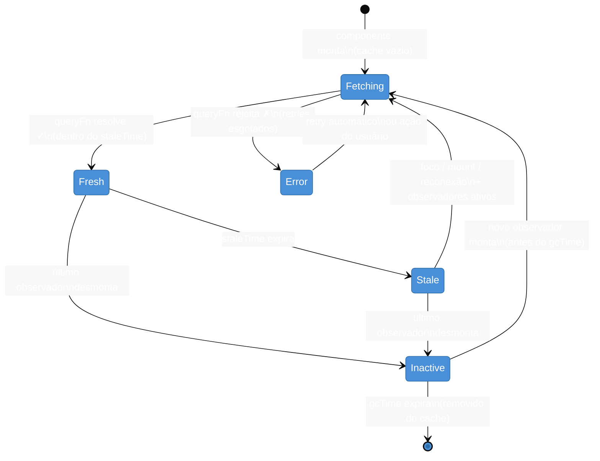

# TanStack Query I — queries, cache e invalidação

> [!abstract] TL;DR
> TanStack Query v5 é a solução canônica para **server state** em React: substitui o trio `useEffect + useState + fetch` por `useQuery`, entregando loading/error states, cache automático, deduplicação de requests e background sync em ~10 linhas de código. A `queryKey` é o eixo central — tudo que identifica, invalida e reutiliza dados gira em torno dela. `staleTime` controla quando buscar de novo; `gcTime` controla quanto tempo o cache sobrevive sem observadores. Mutations e escrita ficam na nota seguinte.

> [!info] Pré-requisitos
> Esta nota aprofunda a distinção de [[03-Dominios/Tecnologia/React/Ecossistema/02 - Server state vs client state|Nota 02 — Server vs client state]]. Se você ainda não viu por que `useState` e `useContext` não foram feitos para dados remotos, leia a nota 02 primeiro. Para integração com Suspense, veja [[03-Dominios/Tecnologia/React/React core/19 - Suspense e data fetching no cliente|React core 19 — Suspense e data fetching]]. Contexto geral do ecossistema em [[03-Dominios/Tecnologia/React/Ecossistema/01 - O ecossistema React - o mapa|Nota 01 — O mapa]].

## O problema: fazer fetching à mão é uma armadilha silenciosa

Considere o padrão mais comum em React antes do TanStack Query:

```tsx
function UserList() {
  const [users, setUsers] = useState<User[]>([])
  const [isLoading, setIsLoading] = useState(false)
  const [error, setError] = useState<Error | null>(null)

  useEffect(() => {
    setIsLoading(true)
    fetch('/api/users')
      .then(res => res.json())
      .then(data => {
        setUsers(data)
        setIsLoading(false)
      })
      .catch(err => {
        setError(err)
        setIsLoading(false)
      })
  }, [])

  if (isLoading) return <Skeleton />
  if (error) return <p>Erro: {error.message}</p>
  return <ul>{users.map(u => <li key={u.id}>{u.name}</li>)}</ul>
}
```

Parece razoável. Mas considere o que essa implementação **não** faz:

- O usuário navega para outra tela e volta → o request dispara de novo do zero.
- Dois componentes precisam dos mesmos dados ao mesmo tempo → dois requests paralelos para o mesmo endpoint, sem nenhuma deduplicação.
- A aba fica inativa por 10 minutos e o usuário volta → os dados estão velhos, mas nenhum refetch acontece.
- O componente desmonta antes do `fetch` terminar → `setUsers` é chamado em componente desmontado, gerando memory leak e warning no console.
- A rede cai e volta → zero retry automático.

Cada um desses problemas tem uma solução ad hoc. No final das contas, você acaba reescrevendo — de forma incompleta e frágil — o que o TanStack Query entrega por padrão. E a versão manual inevitavelmente tem bugs de race condition, estado inconsistente ou memory leak que aparecem apenas em produção.

## Setup: `QueryClient` e `QueryClientProvider`

O TanStack Query centraliza todo o cache em um objeto chamado `QueryClient`. Ele precisa ser fornecido para a árvore de componentes via `QueryClientProvider` — o mesmo padrão do Context API, mas gerenciando o cache de server state.

```tsx
// main.tsx
import { QueryClient, QueryClientProvider } from '@tanstack/react-query'
import { ReactQueryDevtools } from '@tanstack/react-query-devtools'

const queryClient = new QueryClient({
  defaultOptions: {
    queries: {
      staleTime: 60 * 1000,     // 1 minuto: dados considerados frescos por 1 min
      gcTime: 5 * 60 * 1000,   // 5 minutos: padrão explícito para clareza
      retry: 2,                  // 2 retries em caso de erro antes de desistir
    },
  },
})

function App() {
  return (
    <QueryClientProvider client={queryClient}>
      <Router />
      {/* DevTools: visível apenas em desenvolvimento */}
      <ReactQueryDevtools initialIsOpen={false} />
    </QueryClientProvider>
  )
}
```

> [!question]- Por que não usar um singleton global em vez de Provider?
> O `QueryClient` precisa estar dentro do React para integrar com o ciclo de vida dos componentes, gerenciar subscriptions e notificar re-renders. Um singleton global "quebra" em SSR (server-side rendering), onde cada request deve ter seu próprio cache isolado — compartilhar um único `QueryClient` entre requests no servidor causaria vazamento de dados entre usuários diferentes.

O `ReactQueryDevtools` é um painel separado (não incluído no bundle de produção) que mostra o estado de cada query em tempo real: quais estão fresh, stale, fetching ou inactive. É indispensável durante o desenvolvimento para depurar comportamentos de cache.

## `useQuery`: o coração do TanStack Query

`useQuery` é o hook de leitura. Em v5 ele recebe um único objeto de opções — não há mais argumentos posicionais como na v4. As duas propriedades obrigatórias são `queryKey` e `queryFn`:

```tsx
import { useQuery } from '@tanstack/react-query'

interface User {
  id: number
  name: string
  email: string
}

function UserList() {
  const { data, isPending, isError, error, isFetching } = useQuery<User[]>({
    queryKey: ['users'],
    queryFn: (): Promise<User[]> =>
      fetch('/api/users').then(res => {
        if (!res.ok) throw new Error(`HTTP ${res.status}`)
        return res.json()
      }),
  })

  if (isPending) return <Skeleton />
  if (isError) return <ErrorMessage message={error.message} />

  return (
    <>
      {isFetching && <span className="sync-indicator">Atualizando...</span>}
      <ul>{data.map(u => <li key={u.id}>{u.name}</li>)}</ul>
    </>
  )
}
```

Note o genérico `useQuery<User[]>`: o TypeScript infere o tipo de `data` como `User[] | undefined`. O `undefined` existe porque enquanto a query está pendente, ainda não há dados. Após `isSuccess`, o TypeScript sabe que `data` é `User[]` — você pode usar narrowing via `if (isSuccess)` para acessar `data` com tipo seguro.

### Os campos de status em detalhe

O hook retorna múltiplos campos para descrever o estado da operação:

| Campo | Tipo | Significa |
|-------|------|-----------|
| `isPending` | `boolean` | Sem dados no cache ainda; primeira carga |
| `isLoading` | `boolean` | Alias de `isPending && isFetching` — equivalente ao "loading" clássico |
| `isError` | `boolean` | A `queryFn` jogou um erro após esgotar os retries |
| `isSuccess` | `boolean` | Dados disponíveis no cache |
| `isFetching` | `boolean` | Request em andamento (inclui background refetch silencioso) |
| `data` | `T \| undefined` | Os dados retornados pela `queryFn` |
| `error` | `Error \| null` | O erro capturado, se houver |
| `status` | `'pending' \| 'error' \| 'success'` | Estado discreto, útil para switch |

A distinção entre `isPending` e `isFetching` é importante: `isPending` é verdadeiro apenas quando não há dados no cache. `isFetching` é verdadeiro sempre que um request está em andamento — inclusive durante um background refetch silencioso enquanto `data` já existe na tela. Isso permite mostrar um indicador de sincronização sutil sem esconder os dados atuais com um spinner.

## Query Keys: a identidade do cache

A `queryKey` é o conceito mais importante do TanStack Query. Pense nela como o **endereço** de uma entrada no cache. Duas queries com a mesma `queryKey` compartilham os mesmos dados em cache — isso é o que permite deduplicação automática de requests quando dois componentes pedem os mesmos dados ao mesmo tempo.

As query keys são sempre arrays e podem ser tão simples ou ricas quanto necessário:

```tsx
// Coleção inteira
useQuery<User[]>({
  queryKey: ['users'],
  queryFn: fetchAllUsers,
})

// Item específico — o ID faz parte da identidade
useQuery<User>({
  queryKey: ['user', userId],
  queryFn: () => fetchUser(userId),
})

// Lista filtrada e paginada — filtros como objeto na key
useQuery<UserPage>({
  queryKey: ['users', { page, filter, sortBy }],
  queryFn: () => fetchUsers({ page, filter, sortBy }),
})
```

O TanStack Query serializa a key com `JSON.stringify` para comparação — por isso objetos na key funcionam por valor, não por referência. `['users', { page: 1 }]` e `['users', { page: 1 }]` são a mesma key mesmo sendo objetos diferentes.

### Key factories: organização em projetos reais

Em projetos grandes, espalhar strings de query key pelo código é uma receita para inconsistências. O padrão recomendado é um "key factory":

```tsx
// src/features/users/queryKeys.ts
export const userKeys = {
  all: ['users'] as const,
  lists: () => [...userKeys.all, 'list'] as const,
  list: (filters: UserFilters) => [...userKeys.lists(), filters] as const,
  details: () => [...userKeys.all, 'detail'] as const,
  detail: (id: number) => [...userKeys.details(), id] as const,
}

// Uso:
useQuery<User[]>({ queryKey: userKeys.list({ page, filter }), queryFn: ... })
useQuery<User>({ queryKey: userKeys.detail(userId), queryFn: ... })

// Invalidar toda a hierarquia de 'users' de uma vez:
queryClient.invalidateQueries({ queryKey: userKeys.all })
```

A hierarquia da key tem uma propriedade poderosa: invalidação por prefixo. Invalidar `['users']` afeta automaticamente `['users', 'list', ...]`, `['users', 'detail', 42]`, e qualquer outra query que começa com `'users'`. Isso se torna crítico quando você começa a usar mutations.

> [!question]- Posso usar uma string simples como query key?
> Não. Em v5 a query key deve ser sempre um array. `'users'` deve ser `['users']`. Isso garante serialização consistente e suporte à invalidação por prefixo hierárquico.

## Cache e staleness: o motor dos refetches automáticos

Entender o cache do TanStack Query exige entender dois temporizadores independentes: `staleTime` e `gcTime`. Eles controlam coisas diferentes e são frequentemente confundidos.

**`staleTime`** responde à pergunta: "esses dados são recentes o suficiente para não precisar de um novo request?" Enquanto os dados estão dentro do `staleTime`, o TanStack Query os considera "fresh" — nenhum refetch automático ocorre. Após o `staleTime`, os dados tornam-se "stale" (velhos), mas **ainda ficam no cache e ainda são exibidos**. O refetch acontece em background na próxima oportunidade (foco de janela, mount de componente, reconexão de rede).

O padrão de `staleTime` é `0` — imediatamente stale. Isso parece agressivo, mas faz sentido: melhor buscar dados atualizados do que exibir informação desatualizada. Na prática, você vai ajustar por tipo de dado:

```tsx
// Dados de configuração raramente mudam
useQuery({ queryKey: ['config'], queryFn: fetchConfig, staleTime: 30 * 60 * 1000 })

// Lista de usuários: tolera 2 minutos de "staleness"
useQuery({ queryKey: ['users'], queryFn: fetchUsers, staleTime: 2 * 60 * 1000 })

// Preços em tempo real: sempre busca quando possível
useQuery({ queryKey: ['prices'], queryFn: fetchPrices, staleTime: 0 })
```

**`gcTime`** (garbage collection time) responde a uma pergunta diferente: "quanto tempo mantemos dados no cache depois que nenhum componente está mais olhando para eles?" Quando o último observador de uma query desmonta, o `gcTime` começa a contar. Após esse prazo, a entrada é removida do cache. O padrão é 5 minutos.

A combinação dos dois cria um comportamento poderoso: um usuário que navega para longe de uma lista e volta encontra os dados **instantaneamente** (do cache), enquanto um background refetch atualiza silenciosamente o que for necessário.

### Quando o refetch acontece automaticamente

O TanStack Query refetch quando os dados estão stale E uma das seguintes condições ocorre:

- Um componente que usa a query **monta** (navegação para uma tela)
- A **janela do browser recupera o foco** (o usuário volta de outra aba)
- A **conexão de rede é restaurada** (o dispositivo fica online novamente)
- O intervalo de `refetchInterval` dispara (polling configurado manualmente)

Cada gatilho pode ser desligado individualmente (`refetchOnMount: false`, `refetchOnWindowFocus: false`, `refetchOnReconnect: false`), mas os padrões funcionam bem para a maioria das aplicações web.

### Queries dependentes: encadear requests com `enabled`

Às vezes um request depende dos dados de outro. O campo `enabled` resolve isso elegantemente:

```tsx
function UserProfile({ userId }: { userId: number }) {
  // Primeiro request: busca o usuário
  const { data: user } = useQuery<User>({
    queryKey: ['user', userId],
    queryFn: () => fetchUser(userId),
  })

  // Segundo request: só roda após o primeiro terminar
  const { data: posts } = useQuery<Post[]>({
    queryKey: ['posts', user?.organizationId],
    queryFn: () => fetchPosts(user!.organizationId),
    enabled: !!user?.organizationId,  // desabilitado enquanto user é undefined
  })
}
```

Com `enabled: false`, a query fica em estado `'pending'` (sem dados, sem request). Com `enabled: !!user?.organizationId`, ela dispara automaticamente assim que o valor se torna truthy — sem necessidade de `useEffect` ou lógica manual.

## Ciclo de vida de uma query



O diagrama revela algo não-óbvio: uma query **Inactive** (sem observadores) ainda mantém seus dados no cache durante o `gcTime`. Se um componente montar novamente antes desse prazo, ele recebe os dados instantaneamente enquanto um background refetch acontece — sem spinner, sem espera visível ao usuário.

## Invalidação de queries

Invalidar uma query é a forma correta de dizer ao TanStack Query: "esses dados podem estar desatualizados — atualize quando possível".

```tsx
import { useQueryClient } from '@tanstack/react-query'

function AdminPanel() {
  const queryClient = useQueryClient()

  async function handleDeleteUser(userId: number) {
    await deleteUser(userId)

    // Após deletar, os dados de 'users' estão desatualizados
    queryClient.invalidateQueries({ queryKey: ['users'] })
  }
}
```

`invalidateQueries` faz duas coisas simultaneamente: marca as queries matching como **stale** e dispara um refetch imediato para as queries com **observadores ativos** (componentes montados). Queries sem observadores ficam marcadas como stale e serão re-fetched quando um observador montar.

### `invalidateQueries` vs `refetchQueries`

```tsx
// invalidateQueries: marca como stale + refetch só em queries com observadores ATIVOS
queryClient.invalidateQueries({ queryKey: ['users'] })

// refetchQueries: força refetch em TODAS as queries matching, com ou sem observadores
queryClient.refetchQueries({ queryKey: ['users'] })
```

Prefira `invalidateQueries` na maioria dos casos — ela respeita o estado de observação e não dispara requests desnecessários para dados que nenhum componente está exibindo. Use `refetchQueries` quando precisar garantir atualização mesmo em queries sem observadores (por exemplo, em um processo de sincronização em background).

### Invalidação por prefixo hierárquico

```tsx
// Invalida ['users'], ['users', 'list', ...], ['users', 'detail', 42]...
queryClient.invalidateQueries({ queryKey: ['users'] })

// Invalida SOMENTE ['users', 'detail', 42]
queryClient.invalidateQueries({ queryKey: ['users', 'detail', 42] })

// Invalida absolutamente tudo no cache (uso raro — logout, por exemplo)
queryClient.invalidateQueries()
```

O matching é hierárquico: `['users']` como prefixo invalida qualquer query cujo primeiro elemento seja `'users'`. É por isso que o design das query keys importa tanto — agrupar dados relacionados sob o mesmo prefixo torna a invalidação em batch trivial.

## `useInfiniteQuery`: scroll infinito e paginação "carregar mais"

Para listas com paginação infinita, o TanStack Query oferece `useInfiniteQuery`. Em v5, a API exige `initialPageParam` e `getNextPageParam` como opções obrigatórias — uma mudança em relação à v4 onde o `pageParam` inicial era configurado na `queryFn`:

```tsx
interface UserPage {
  users: User[]
  nextPage: number | null
  hasMore: boolean
}

const {
  data,
  fetchNextPage,
  hasNextPage,
  isFetchingNextPage,
} = useInfiniteQuery<UserPage>({
  queryKey: ['users', 'infinite'],
  queryFn: ({ pageParam }) =>
    fetchUsersPage({ page: pageParam as number }),
  initialPageParam: 1,
  getNextPageParam: (lastPage) =>
    lastPage.hasMore ? lastPage.nextPage : undefined,
  // undefined = sem próxima página; hasNextPage fica false
})
```

`data.pages` é um array de todas as páginas carregadas em ordem. `data.pageParams` contém os parâmetros usados para cada página. `hasNextPage` é `true` enquanto `getNextPageParam` retornar algo diferente de `undefined` ou `null`.

```tsx
// Renderização típica com "Load More" button
return (
  <>
    {data?.pages.flatMap(page => page.users).map(u => (
      <UserCard key={u.id} user={u} />
    ))}
    <button
      onClick={() => fetchNextPage()}
      disabled={!hasNextPage || isFetchingNextPage}
    >
      {isFetchingNextPage ? 'Carregando...' : hasNextPage ? 'Ver mais' : 'Fim'}
    </button>
  </>
)
```

## Armadilhas comuns

> [!warning] `staleTime: 0` combinado com navegação rápida causa requests excessivos
> **O que acontece:** o usuário navega entre telas rapidamente e o servidor recebe dezenas de requests idênticos em sequência, mesmo para dados que não mudaram. **Por quê:** com `staleTime: 0` (padrão), os dados ficam stale imediatamente após serem recebidos. Cada vez que o componente monta (nova visita à tela), a query está stale e um novo request é disparado. **Como evitar:** configure `staleTime` de acordo com a frequência de mudança dos dados. Dados de configuração: 10-30 min. Listas de usuários: 1-5 min. Preços em tempo real: 0. Configure o padrão no `QueryClient` e sobrescreva por query quando necessário.

> [!warning] Query key com objeto instável causa refetch em loop
> **O que acontece:** o componente entra em loop de refetch constante; o servidor recebe requests repetidos sem parar e o usuário vê o indicador de loading piscando. **Por quê:** o TanStack Query compara query keys por igualdade profunda (deep equality). Se a key incluir um objeto criado inline durante o render, cada render cria um novo objeto com nova referência — a key muda, a query identifica um cache miss e dispara novo request.
> ```tsx
> // ❌ Objeto inline — nova referência a cada render
> useQuery({ queryKey: ['users', { filter: filter }], queryFn: ... })
>
> // ✅ Valor escalar estável na key
> useQuery({ queryKey: ['users', filter], queryFn: ... })
>
> // ✅ Objeto definido fora do render (com useMemo se necessário)
> const filters = useMemo(() => ({ page, sort }), [page, sort])
> useQuery({ queryKey: ['users', filters], queryFn: ... })
> ```
> **Como evitar:** inclua apenas valores serializáveis e estáveis na query key.

> [!warning] Lançar erros incorretamente na `queryFn` anula o sistema de retry
> **O que acontece:** erros HTTP (404, 500) são silenciados — a query fica em estado `isSuccess` com `data: undefined`, sem disparar o fluxo de error handling. **Por quê:** a `queryFn` precisa **lançar** um erro para que o TanStack Query entre no estado de erro e execute retries. A `fetch` API não lança erros em respostas HTTP não-ok — ela resolve normalmente com `response.ok === false`. Se você não verificar `res.ok` e lançar, a query considera que a operação foi bem-sucedida.
> ```tsx
> // ❌ Silencia erros HTTP
> queryFn: () => fetch('/api/users').then(res => res.json())
>
> // ✅ Lança erro explícito para erros HTTP
> queryFn: () => fetch('/api/users').then(res => {
>   if (!res.ok) throw new Error(`HTTP ${res.status}: ${res.statusText}`)
>   return res.json()
> })
> ```
> **Como evitar:** sempre verifique `res.ok` na `queryFn` e lance um `Error` explícito.

## Como explicar em inglês

When discussing data fetching in React, demonstrating knowledge of **server state management** separates candidates who understand architecture from those who just know the syntax.

> "TanStack Query v5 manages the full lifecycle of server state — fetching, caching, background synchronization, and invalidation — organized around a query key that serves as the cache identity. `staleTime` controls how long data is considered fresh before a background refetch is triggered; `gcTime` sets how long unused cache entries survive in memory after their last observer unmounts."

| PT | EN |
|----|----|
| chave de query | query key |
| dados frescos / obsoletos | fresh data / stale data |
| tempo de obsolescência | stale time |
| tempo de coleta de lixo | garbage collection time (gcTime) |
| invalidar uma query | invalidate a query |
| observador | observer / subscriber |
| refetch em segundo plano | background refetch |
| deduplicação de requests | request deduplication |
| estado pendente | pending state |
| reconexão de rede | network reconnection |
| query dependente | dependent query |
| paginação infinita | infinite scroll / infinite query |

## O que vem a seguir

Agora você sabe ler dados com `useQuery`, organizar o cache por query keys hierárquicas e invalidar entradas quando precisam ser atualizadas. O próximo passo natural é o **lado da escrita**: criar, atualizar e deletar dados mantendo o cache sempre sincronizado com o servidor.

A nota seguinte cobre `useMutation` — o hook para operações de escrita — e como o padrão `onSuccess → invalidateQueries` fecha o ciclo entre leitura e escrita. Também aborda optimistic updates: mostrar o resultado antes de o servidor confirmar, para uma experiência sem latência percebida.

## Fontes

- **TanStack** — [*useQuery Reference v5*](https://tanstack.com/query/v5/docs/framework/react/reference/useQuery) — documentação oficial da API completa do hook com todos os parâmetros
- **TanStack** — [*Query Invalidation Guide v5*](https://tanstack.com/query/v5/docs/framework/react/guides/query-invalidation) — guia oficial de invalidação e diferença entre `invalidateQueries` e `refetchQueries`
- **TanStack** — [*Migrating to TanStack Query v5*](https://tanstack.com/query/v5/docs/framework/react/guides/migrating-to-v5) — mudanças de API v4→v5: objeto único de opções, `gcTime`, `initialPageParam`
- **TanStack** — [*Caching Examples v5*](https://tanstack.com/query/v5/docs/react/guides/caching) — walkthrough do ciclo de vida do cache com exemplos interativos
- **Dominik Dorfmeister (TkDodo)** — [*tkdodo.eu/blog*](https://tkdodo.eu/blog) — blog do maintainer do TanStack Query; fonte canônica para patterns avançados, query key factories e decisões de design da biblioteca
