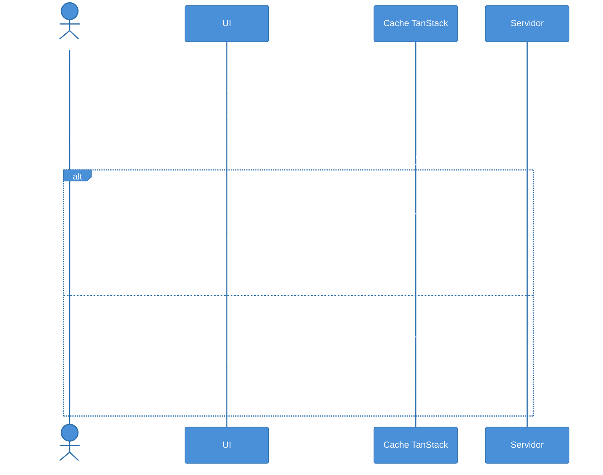

# TanStack Query II — mutations e optimistic updates

> [!abstract] TL;DR
> `useMutation` é o par de `useQuery` para operações de escrita: cria, atualiza e deleta dados mantendo o cache sincronizado. O padrão `onSuccess → invalidateQueries` é simples e seguro; o padrão `onMutate → setQueryData → onError rollback → onSettled invalidate` entrega **optimistic updates** — a UI reflete a mudança antes da confirmação do servidor. Use optimistic para operações idempotentes e de baixo risco (toggle, like, reorder); prefira o fluxo pessimista para criações com ID gerado pelo servidor ou side effects complexos. Em uma frase: `useMutation` fecha o ciclo leitura↔escrita que `useQuery` abre.

> [!info] Pré-requisitos
> Esta nota continua diretamente de [[03-Dominios/Tecnologia/React/Ecossistema/04 - TanStack Query I - queries, cache e invalidação|Nota 04 — TanStack Query I]]. Os exemplos usam os mesmos `userKeys` e tipos `User` definidos lá. Se você ainda não viu como `queryKey`, `staleTime` e `invalidateQueries` funcionam, leia a nota 04 primeiro. Termos como *mutation*, *optimistic update* e *rollback* estão no [[03-Dominios/Tecnologia/React/Dicionário de React|Dicionário de React]].

## O problema: escrever dados sem travar a interface

Você acaba de implementar uma lista de usuários com `useQuery`. Funciona: cache automático, background refetch, estado de loading. Agora o product manager pede um botão "Adicionar usuário".

O formulário submete, o request vai pro servidor, o servidor confirma — e nada acontece na tela. O cache ainda mostra a lista antiga. Você precisa, de alguma forma, sincronizar a escrita com o cache de leitura.

A primeira tentativa ingênua seria chamar `queryClient.invalidateQueries` diretamente dentro de um `fetch` manual. Isso funciona, mas você perde o tratamento automático de erros, retry, e os estados `isPending`/`isError` que o TanStack Query gerencia. A solução certa é `useMutation`.

## `useMutation`: anatomia do hook de escrita

`useMutation` tem uma assimetria importante em relação ao `useQuery`: ele **não executa automaticamente**. Você chama `mutate()` explicitamente em resposta a uma ação do usuário.

```tsx
import { useMutation, useQueryClient } from '@tanstack/react-query'

interface User {
  id: number
  name: string
  email: string
}

interface CreateUserInput {
  name: string
  email: string
}

function CreateUserForm() {
  const queryClient = useQueryClient()

  const createUser = useMutation<User, Error, CreateUserInput>({
    mutationFn: (input) =>
      fetch('/api/users', {
        method: 'POST',
        headers: { 'Content-Type': 'application/json' },
        body: JSON.stringify(input),
      }).then(res => {
        if (!res.ok) throw new Error(`HTTP ${res.status}`)
        return res.json()
      }),
    onSuccess: (newUser) => {
      // Após criar, invalida a lista de usuários
      queryClient.invalidateQueries({ queryKey: userKeys.lists() })
    },
  })

  function handleSubmit(e: React.FormEvent<HTMLFormElement>) {
    e.preventDefault()
    const data = new FormData(e.currentTarget)
    createUser.mutate({
      name: data.get('name') as string,
      email: data.get('email') as string,
    })
  }

  return (
    <form onSubmit={handleSubmit}>
      <input name="name" placeholder="Nome" />
      <input name="email" placeholder="Email" />
      <button type="submit" disabled={createUser.isPending}>
        {createUser.isPending ? 'Criando...' : 'Criar usuário'}
      </button>
      {createUser.isError && (
        <p className="error">Erro: {createUser.error.message}</p>
      )}
    </form>
  )
}
```

O genérico `useMutation<TData, TError, TVariables>` define três tipos:
- `TData` — o que o servidor retorna em caso de sucesso (`User`)
- `TError` — o tipo do erro (`Error`)
- `TVariables` — o que você passa para `mutate()` (`CreateUserInput`)

### Estados da mutation

| Campo | Tipo | Significa |
|-------|------|-----------|
| `isPending` | `boolean` | Request em andamento |
| `isSuccess` | `boolean` | Servidor respondeu com sucesso |
| `isError` | `boolean` | Servidor ou rede falhou |
| `isIdle` | `boolean` | Mutation ainda não foi chamada |
| `data` | `TData \| undefined` | Resposta do servidor (só após sucesso) |
| `error` | `TError \| null` | Erro capturado, se houver |
| `variables` | `TVariables \| undefined` | O que foi passado para `mutate()` — útil no UI |
| `status` | `'idle' \| 'pending' \| 'error' \| 'success'` | Estado discreto para switch |
| `reset` | `() => void` | Volta a mutation para o estado `idle` |

### `mutate` vs `mutateAsync`: qual usar

```tsx
// mutate: fire-and-forget — não retorna promise, não lança exceção para fora
createUser.mutate({ name: 'Ana', email: 'ana@example.com' })

// mutateAsync: retorna Promise<TData> — permite await e try/catch
try {
  const newUser = await createUser.mutateAsync({ name: 'Ana', email: 'ana@example.com' })
  toast.success(`Usuário ${newUser.name} criado!`)
} catch (err) {
  // Erros NÃO tratados aqui causam UnhandledPromiseRejection
  toast.error('Falha ao criar usuário')
}
```

Prefira `mutate` na maioria dos casos: os callbacks `onSuccess`/`onError` já cobrem os estados, e `mutate` não exige try/catch. Use `mutateAsync` quando precisar encadear lógica após a mutation — por exemplo, redirecionar para a página do recurso recém-criado com o `id` retornado.

> [!question]- Por que `mutate` não lança erros? Parece perigoso.
> É uma escolha deliberada. `mutate` é para uso em event handlers de React, onde lançar erros assíncronos sem captura causaria `UnhandledPromiseRejection` silencioso. Os callbacks `onError` e `onSettled` são a forma correta de tratar falhas. `mutateAsync` existe para os casos onde você realmente precisa da Promise — mas você assume a responsabilidade do try/catch.

## Invalidação pós-mutation: o padrão `onSuccess → invalidate`

O padrão mais simples e seguro para manter o cache sincronizado é invalidar após uma escrita bem-sucedida:

```tsx
const updateUser = useMutation<User, Error, { id: number; name: string }>({
  mutationFn: ({ id, name }) =>
    fetch(`/api/users/${id}`, {
      method: 'PATCH',
      body: JSON.stringify({ name }),
    }).then(res => res.json()),

  onSuccess: (_data, variables) => {
    // Invalida o item específico e a lista — usando os mesmos userKeys da nota 04
    queryClient.invalidateQueries({ queryKey: userKeys.detail(variables.id) })
    queryClient.invalidateQueries({ queryKey: userKeys.lists() })
  },
})
```

Por que invalidar em vez de fazer `setQueryData` diretamente com a resposta do servidor?

Imagine que a lista de usuários é filtrada e ordenada pelo backend. Após editar o nome de um usuário, você poderia usar `setQueryData` para atualizar apenas aquele item no cache — mas isso não refletiria que ele pode ter mudado de posição na lista ordenada, ou saído de um filtro ativo. Invalidar força o servidor a recomputar a lista com os critérios de ordenação/filtro corretos.

O padrão mais robusto usa `onSettled` em vez de `onSuccess` para invalidar:

```tsx
const deleteUser = useMutation<void, Error, number>({
  mutationFn: (id) =>
    fetch(`/api/users/${id}`, { method: 'DELETE' }).then(res => {
      if (!res.ok) throw new Error(`HTTP ${res.status}`)
    }),

  // onSettled roda tanto em sucesso QUANTO em erro
  onSettled: () => {
    queryClient.invalidateQueries({ queryKey: userKeys.all })
  },
})
```

`onSettled` garante que o cache seja invalidado mesmo quando a mutation falha. Em um fluxo de optimistic update, isso é crítico — mas mesmo sem optimistic, é uma boa prática para manter o cache consistente após erros parciais.

## Optimistic updates: UX sem latência percebida

Redes têm latência. A maioria das mutations em produção leva 100–500ms para resposta. Para operações que os usuários fazem repetidamente — curtir um post, marcar um favorito, reordenar uma lista — essa latência acumulada torna a interface lenta e frustrante.

Optimistic updates invertem a ordem: em vez de esperar o servidor confirmar para atualizar a UI, você **atualiza o cache imediatamente** com o resultado esperado e "desfaz" se o servidor falhar. É a diferença entre uma rede social onde corações aparecem na hora versus outra onde você espera o servidor confirmar cada like.

### O ciclo completo com rollback



O diagrama mostra três momentos distintos:
1. **`onMutate`**: salva o estado atual (snapshot) e aplica a mudança otimista no cache
2. **`onError`**: usa o snapshot para restaurar o estado anterior (rollback)
3. **`onSettled`**: invalida o cache para sincronizar com o servidor (independente do resultado)

### Implementação TS: toggle de favorito

```tsx
interface Post {
  id: number
  title: string
  favorited: boolean
}

const toggleFavorite = useMutation<Post, Error, number, { previousPost: Post | undefined }>({
  mutationFn: (postId) =>
    fetch(`/api/posts/${postId}/favorite`, { method: 'PATCH' }).then(res => {
      if (!res.ok) throw new Error(`HTTP ${res.status}`)
      return res.json()
    }),

  // 1. Antes da request: snapshot + atualização otimista
  onMutate: async (postId) => {
    // Cancela refetches em voo para evitar race condition
    await queryClient.cancelQueries({ queryKey: postKeys.detail(postId) })

    // Salva o estado atual como snapshot
    const previousPost = queryClient.getQueryData<Post>(postKeys.detail(postId))

    // Aplica a mudança otimista no cache
    queryClient.setQueryData<Post>(postKeys.detail(postId), (old) =>
      old ? { ...old, favorited: !old.favorited } : old
    )

    // Retorna o context com o snapshot — disponível em onError e onSettled
    return { previousPost }
  },

  // 2. Em caso de erro: rollback usando o snapshot
  onError: (_err, postId, context) => {
    if (context?.previousPost) {
      queryClient.setQueryData<Post>(postKeys.detail(postId), context.previousPost)
    }
  },

  // 3. Sempre ao fim: sincroniza com o servidor (sucesso ou erro)
  onSettled: (_data, _error, postId) => {
    queryClient.invalidateQueries({ queryKey: postKeys.detail(postId) })
  },
})
```

O quarto genérico `TContext` — `{ previousPost: Post | undefined }` — é o tipo do objeto retornado por `onMutate`. Esse objeto é passado automaticamente para `onError` e `onSettled` como o parâmetro `context`, fechando o ciclo de rollback sem variáveis globais ou ref externo.

## `setQueryData` e `cancelQueries`

Duas APIs do `queryClient` são centrais no fluxo de optimistic updates:

**`queryClient.setQueryData`** escreve diretamente no cache, sem disparar request:

```tsx
// Substitui o dado inteiro
queryClient.setQueryData<User>(userKeys.detail(42), updatedUser)

// Atualização parcial via updater function (mais seguro — recebe o dado atual)
queryClient.setQueryData<User>(userKeys.detail(42), (old) =>
  old ? { ...old, name: 'Novo Nome' } : old
)
```

**`queryClient.cancelQueries`** cancela requests em andamento antes de escrever otimisticamente:

```tsx
// Antes de escrever no cache, cancela requests em voo para essa key
await queryClient.cancelQueries({ queryKey: userKeys.detail(42) })
```

Sem `cancelQueries`, uma request de background refetch que chegue **depois** do `setQueryData` sobrescreve o dado otimista com o dado antigo do servidor — um race condition clássico que aparece apenas com conexões rápidas onde refetch e mutation se sobrepõem.

## Pessimistic vs optimistic: quando escolher

| Critério | Pessimistic | Optimistic |
|----------|-------------|------------|
| Operação | Criação com ID gerado pelo servidor | Toggle, like, reorder |
| Risco de conflito | Alto (side effects, transações) | Baixo (idempotente) |
| UI feedback | Spinner + confirmação | Resposta instantânea |
| Complexidade | Simples (`onSuccess → invalidate`) | Média (snapshot + rollback) |
| Quando o erro importa | Sempre visível ao usuário | Rollback silencioso + toast |

A heurística prática: se o servidor **pode devolver dados diferentes** do que você enviou (ID gerado, timestamps calculados, validações que mudam o valor), use o fluxo pessimistic. Se o resultado esperado é determinístico a partir da entrada do usuário, optimistic é a escolha certa.

> [!question]- Posso usar optimistic em criação de itens sem ID?
> É possível, mas incômodo. Você precisaria gerar um ID temporário (UUID v4, por exemplo), inserir na lista com esse ID, e depois substituir pelo ID real retornado pelo servidor em `onSuccess`. Isso funciona, mas se o servidor rejeitar a criação, o rollback precisa remover o item temporário — lógica que cresce em complexidade. Para criações, o fluxo pessimistic é quase sempre mais simples e mais correto.

## Casos práticos

### Cenário 1: formulário de criação com feedback de loading

Um formulário de cadastro usa `mutate` com `isPending` para desabilitar o botão durante o envio e `isError` para exibir a mensagem de erro inline — sem estado local adicional. O `onSuccess` invalida `userKeys.lists()` para que a lista recarregue automaticamente após a criação. Esse é o fluxo **pessimistic** canônico: a UI aguarda a confirmação do servidor antes de atualizar.

Código completo na seção `useMutation: anatomia do hook de escrita` — componente `CreateUserForm`.

### Cenário 2: toggle de favorito com feedback instantâneo

Um botão de favorito em um feed de posts precisa responder ao clique sem latência visível. Cada clique dispara `toggleFavorite.mutate(postId)`. O `onMutate` aplica a inversão otimista no cache imediatamente; se o servidor falhar, `onError` restaura o ícone ao estado original; `onSettled` garante a sincronização final.

Código completo na seção `Optimistic updates` — implementação com `TContext` tipado e rollback.

> [!tip] Vídeo recomendado
> **Dominik Dorfmeister (TkDodo)** — [*React Query Tips & Tricks (React Summit 2023)*](https://youtu.be/vS86UG4UuN0) Palestra de 30 min pelo maintainer do TanStack Query cobrindo mutations, optimistic updates e padrões avançados de invalidação. Referência direta para os padrões desta nota.

## Armadilhas comuns

> [!warning] Esquecer `cancelQueries` antes de `setQueryData` cria race condition
> **O que acontece:** a UI reflete o dado otimista por um instante e depois volta ao estado anterior sem motivo aparente — o usuário vê o botão "piscar". **Por quê:** um background refetch em andamento (disparado por `staleTime` expirado ou focus-on-window) pode resolver **depois** do `setQueryData` otimista e sobrescrever o cache com o dado antigo do servidor. **Como evitar:** sempre `await queryClient.cancelQueries(...)` dentro de `onMutate` antes de qualquer `setQueryData`. O `await` garante que requests em voo foram abortados antes de você escrever no cache.

> [!warning] Não usar `onSettled` para invalidar deixa o cache dessincronizado após erro
> **O que acontece:** a mutation falha, o rollback acontece corretamente, mas o cache fica preso no estado anterior — mesmo que o servidor tenha feito uma mudança parcial. **Por quê:** se você invalida apenas em `onSuccess`, um erro de rede (que pode ser transiente ou parcial) deixa o cache sem sincronização. O usuário continua vendo dados que podem não refletir o estado real do servidor. **Como evitar:** sempre invalide em `onSettled`, não em `onSuccess`. Para optimistic updates, isso é obrigatório — para mutations simples, é uma boa prática defensiva.

> [!warning] Usar `mutateAsync` sem try/catch causa UnhandledPromiseRejection
> **O que acontece:** erros de mutation derrubam silenciosamente o handler ou geram warnings no console; em alguns ambientes, o processo Node.js pode encerrar. **Por quê:** `mutateAsync` retorna uma Promise que rejeita em caso de erro. Se não houver `try/catch` ou `.catch()` na cadeia, a rejeição fica sem handler — diferente de `mutate` que captura internamente e roteia para `onError`. **Como evitar:** use `mutate` por padrão. Se precisar de `mutateAsync`, sempre envolva em `try/catch`. Nunca chame `mutateAsync` em um event handler sem tratamento de erro explícito.

> [!warning] Mutar variáveis diretamente em `onMutate` corrompe o snapshot
> **O que acontece:** o rollback em `onError` restaura um dado incorreto — o snapshot já reflete a mudança otimista em vez do estado original. **Por quê:** `getQueryData` retorna a referência ao objeto no cache. Se você mutar esse objeto diretamente (ex.: `old.favorited = !old.favorited`), tanto o cache quanto seu snapshot apontam para o mesmo objeto modificado. O snapshot deixa de ser uma cópia do estado anterior. **Como evitar:** nunca mutate objetos do cache diretamente. Use spread ou `structuredClone`:
> ```tsx
> // ❌ Muta a referência — snapshot fica inválido
> const previous = queryClient.getQueryData<Post>(key)
> previous!.favorited = !previous!.favorited
>
> // ✅ Cria nova referência — snapshot preserva o estado original
> const previous = queryClient.getQueryData<Post>(key)
> queryClient.setQueryData<Post>(key, old => old ? { ...old, favorited: !old.favorited } : old)
> ```

## Como explicar em inglês

When asked about mutations in technical interviews, demonstrating the full **optimistic update lifecycle** — not just `useMutation` syntax — signals senior-level thinking.

> "In TanStack Query v5, `useMutation` handles write operations. The simple pattern is `onSuccess → invalidateQueries`, which refetches after the server confirms the change. For instant feedback, you implement optimistic updates: in `onMutate`, you cancel in-flight refetches, snapshot the current cache state, and write the expected result immediately. If the server fails, `onError` rolls back to the snapshot. `onSettled` always fires last and re-invalidates regardless of outcome, ensuring the cache stays in sync."

| PT | EN |
|----|-----|
| atualização otimista | optimistic update |
| atualização pessimista | pessimistic update |
| reversão / desfazer | rollback |
| captura instantânea | snapshot |
| cancelar requests em voo | cancel in-flight requests |
| escrever no cache | write to cache / set query data |
| ciclo de escrita | mutation lifecycle |
| mutation pendente | pending mutation |
| contexto da mutation | mutation context |
| invalidar após mutation | invalidate after mutation |
| corrida entre requests | race condition |
| idempotente | idempotent |

## O que vem a seguir

Com queries e mutations dominadas, você tem as ferramentas para sincronizar server state de forma robusta. O próximo passo é escalar esse conhecimento: como reutilizar lógica de queries e mutations em múltiplos componentes, como separar as responsabilidades de fetching em custom hooks, e como testar esse código de forma confiável.

A nota seguinte aborda padrões arquiteturais de organização do TanStack Query em projetos maiores — custom hooks, separação por feature, e estratégias de teste com `QueryClient` mockado.

## Fontes

- **TanStack** — [*useMutation Reference v5*](https://tanstack.com/query/v5/docs/framework/react/reference/useMutation) — documentação oficial da API completa do hook, incluindo genéricos e callbacks
- **TanStack** — [*Mutations Guide v5*](https://tanstack.com/query/v5/docs/framework/react/guides/mutations) — guia de mutations: padrões básicos, `mutate` vs `mutateAsync`, side effects
- **TanStack** — [*Optimistic Updates Guide v5*](https://tanstack.com/query/v5/docs/framework/react/guides/optimistic-updates) — guia oficial de optimistic updates com exemplos de rollback
- **Dominik Dorfmeister (TkDodo)** — [*Mastering Mutations in React Query*](https://tkdodo.eu/blog/mastering-mutations-in-react-query) — análise aprofundada dos padrões de mutation pelo maintainer da biblioteca; distinção entre callbacks no hook vs no `mutate`
