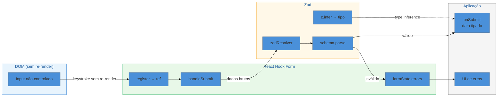

# Formulários — React Hook Form + Zod

> [!abstract] TL;DR
> Formulários controlados com `useState` por campo causam re-render a cada keystroke — lento em forms grandes. **React Hook Form** (RHF) resolve isso com uma abordagem *uncontrolled-first*: usa refs em vez de state, e o form só re-renderiza em submit, blur ou erro. **Zod** complementa com schemas TypeScript-first: você declara a validação uma vez e `z.infer<typeof schema>` gera o tipo automaticamente, sem duplicação. Juntos, entregam performance + type-safety com mínimo boilerplate. Em uma frase: RHF gerencia o ciclo de vida do form; Zod garante que os dados saem do form exatamente no formato que o TypeScript espera.

> [!info] Contexto no galho
> Esta nota cobre a camada de **formulários** do ecossistema React. Para entender por que a abordagem *uncontrolled* importa, consulte [[03-Dominios/Tecnologia/React/React core/06 - Eventos e formulários controlados|React core 06]] que explica formulários controlados vs. não-controlados com `useState` e `useRef`. O panorama completo do ecossistema está em [[03-Dominios/Tecnologia/React/Ecossistema/01 - O ecossistema React - o mapa|Nota 01 — O mapa]]. Termos como *resolver*, *schema*, *controlled component* estão no [[03-Dominios/Tecnologia/React/Dicionário de React|Dicionário de React]].

## O problema: formulários que travam na digitação

Imagine um formulário de cadastro com 15 campos: nome, email, CPF, endereço (rua, número, bairro, cidade, estado, CEP), telefones, senha e confirmação. Você implementa cada campo com um `useState`, adiciona validação manual com condicionais, e cada estado de erro com mais um `useState`.

O resultado: a cada keystroke em qualquer campo, o React re-renderiza o componente inteiro. Em 15 campos, isso significa 15 estados sendo checados, 15 mensagens de erro sendo recalculadas, 15 funções de handler sendo recriadas. Em máquinas lentas ou formulários dentro de listas, o atraso de digitação é perceptível.

Além da performance, a validação manual é um problema de manutenção: `if (!email.includes('@'))` vive no componente, enquanto o tipo `{ email: string }` vive no TypeScript. Quando a regra de validação muda (e vai mudar), você atualiza em dois lugares — e inevitavelmente desincroniza.

React Hook Form + Zod resolvem esses dois problemas de formas elegantes e complementares.

## Por que `uncontrolled-first` é mais rápido

A intuição de formulários controlados faz sentido: manter o valor de cada campo no state React garante que você sempre tem acesso ao valor atual. O problema é o custo: cada mudança de state dispara um ciclo de renderização.

React Hook Form inverte a equação. Em vez de armazenar valores no state, ele registra cada input com uma **ref** — uma referência direta ao elemento DOM. O valor fica no DOM, não no React. O formulário só entra no ciclo de renderização React quando há algo que a UI precisa mostrar: erros, estado de submissão, ou quando você explicitamente chama `watch()`.

Pense assim: a diferença entre controlado e não-controlado é como a diferença entre um chefe que quer ser informado de cada e-mail que passa vs. um chefe que só quer saber quando algo urgente acontece. O segundo modelo é mais eficiente — e é o que o RHF implementa.

## `useForm`: o ponto de entrada

Tudo começa com o hook `useForm`. Ele retorna um conjunto de utilitários para conectar o formulário:

```tsx
import { useForm } from 'react-hook-form'

interface FormData {
  nome: string
  email: string
  senha: string
}

const { register, handleSubmit, formState: { errors } } = useForm<FormData>()
```

Os retornos principais:

| Retorno | Para que serve |
|---------|---------------|
| `register('campo')` | Conecta o input ao form via ref |
| `handleSubmit(fn)` | Valida e chama `fn` com dados tipados |
| `formState.errors` | Objeto de erros por campo |
| `control` | Necessário para `Controller` e `useFieldArray` |
| `watch('campo')` | Observa valor em tempo real (re-renderiza) |
| `setValue('campo', valor)` | Define valor programaticamente |
| `reset(valores?)` | Reseta o form (útil após submit) |

O `register` retorna props que você espalha no input:

```tsx
<input type="email" {...register('email')} />
```

Isso registra `name`, `ref`, `onChange` e `onBlur` no input — tudo o que o RHF precisa para observar o campo sem controlar o state.

## Validação com Zod: uma fonte de verdade

O ponto de dor da validação manual é que tipo e regra de validação vivem separados. Zod elimina essa separação.

### Definindo o schema

```ts
import { z } from 'zod'

const cadastroSchema = z.object({
  nome: z.string().min(2, 'Nome precisa ter ao menos 2 caracteres'),
  email: z.string().email('E-mail inválido'),
  senha: z.string().min(8, 'Senha precisa ter ao menos 8 caracteres'),
  confirmarSenha: z.string(),
}).refine(
  (data) => data.senha === data.confirmarSenha,
  { message: 'Senhas não conferem', path: ['confirmarSenha'] }
)
```

### Tipo derivado do schema

```ts
type CadastroData = z.infer<typeof cadastroSchema>
// equivale a:
// type CadastroData = {
//   nome: string
//   email: string
//   senha: string
//   confirmarSenha: string
// }
```

`z.infer<typeof cadastroSchema>` gera o tipo TypeScript diretamente do schema — se você mudar a validação, o tipo muda junto. Uma fonte de verdade, não duas.

### Conectando ao RHF via `zodResolver`

```tsx
import { zodResolver } from '@hookform/resolvers/zod'

const { register, handleSubmit, formState: { errors } } = useForm<CadastroData>({
  resolver: zodResolver(cadastroSchema),
  defaultValues: {
    nome: '',
    email: '',
    senha: '',
    confirmarSenha: '',
  },
})
```

O `zodResolver` é o adaptador: ele recebe o schema Zod e o traduz para o protocolo de validação do RHF. Quando `handleSubmit` é chamado, o RHF passa os dados brutos para o resolver, que executa o schema Zod e retorna ou os dados validados ou os erros.

### Formulário completo

```tsx
function CadastroForm() {
  const {
    register,
    handleSubmit,
    formState: { errors, isSubmitting },
  } = useForm<CadastroData>({
    resolver: zodResolver(cadastroSchema),
  })

  const onSubmit = async (data: CadastroData) => {
    // data é CadastroData — TypeScript garante
    await api.cadastrar(data)
  }

  return (
    <form onSubmit={handleSubmit(onSubmit)}>
      <div>
        <input placeholder="Nome" {...register('nome')} />
        {errors.nome && <span>{errors.nome.message}</span>}
      </div>

      <div>
        <input type="email" placeholder="E-mail" {...register('email')} />
        {errors.email && <span>{errors.email.message}</span>}
      </div>

      <div>
        <input type="password" placeholder="Senha" {...register('senha')} />
        {errors.senha && <span>{errors.senha.message}</span>}
      </div>

      <div>
        <input type="password" placeholder="Confirmar senha" {...register('confirmarSenha')} />
        {errors.confirmarSenha && <span>{errors.confirmarSenha.message}</span>}
      </div>

      <button type="submit" disabled={isSubmitting}>
        {isSubmitting ? 'Cadastrando...' : 'Cadastrar'}
      </button>
    </form>
  )
}
```

## Fluxo de dados: do input ao submit



O DOM guarda os valores; o RHF orquestra o ciclo de vida; o Zod valida e o TypeScript sabe o tipo antes mesmo do runtime.

## `Controller`: para componentes controlados de UI libs

Algumas bibliotecas de UI (Material-UI, Mantine, shadcn/ui, Ant Design) expõem seus componentes como **controlados** — eles esperam `value` e `onChange` em vez de aceitar um `ref`. O `register` do RHF não funciona nesses casos.

Para isso existe o `Controller`:

```tsx
import { Controller } from 'react-hook-form'
import { TextField } from '@mui/material'

function FormComMUI() {
  const { control, handleSubmit } = useForm<FormData>({
    resolver: zodResolver(schema),
  })

  return (
    <form onSubmit={handleSubmit(onSubmit)}>
      <Controller
        control={control}
        name="email"
        render={({ field, fieldState }) => (
          <TextField
            {...field}
            label="E-mail"
            error={!!fieldState.error}
            helperText={fieldState.error?.message}
          />
        )}
      />
    </form>
  )
}
```

O `Controller` age como um adaptador: por baixo dos panos ele mantém o valor no state do RHF (sim, controlado), mas isola o re-render apenas ao campo em questão. O spread `{...field}` injeta `value`, `onChange`, `onBlur` e `name` no componente de UI.

## `useFieldArray`: listas dinâmicas de campos

Formulários reais frequentemente têm listas dinâmicas: múltiplos telefones, endereços, experiências profissionais. O `useFieldArray` gerencia arrays de campos com append, remove e reordenação:

```tsx
import { useFieldArray } from 'react-hook-form'

const telefoneSchema = z.object({
  telefones: z.array(
    z.object({ numero: z.string().min(10, 'Número inválido') })
  ).min(1, 'Informe ao menos um telefone'),
})

type TelefoneData = z.infer<typeof telefoneSchema>

function FormTelefones() {
  const { register, control, handleSubmit, formState: { errors } } =
    useForm<TelefoneData>({
      resolver: zodResolver(telefoneSchema),
      defaultValues: { telefones: [{ numero: '' }] },
    })

  const { fields, append, remove } = useFieldArray({
    control,
    name: 'telefones',
  })

  return (
    <form onSubmit={handleSubmit(console.log)}>
      {fields.map((field, index) => (
        <div key={field.id}> {/* IMPORTANTE: usar field.id, não index */}
          <input
            {...register(`telefones.${index}.numero`)}
            placeholder="(11) 99999-9999"
          />
          {errors.telefones?.[index]?.numero && (
            <span>{errors.telefones[index].numero.message}</span>
          )}
          <button type="button" onClick={() => remove(index)}>Remover</button>
        </div>
      ))}

      <button type="button" onClick={() => append({ numero: '' })}>
        Adicionar telefone
      </button>

      <button type="submit">Salvar</button>
    </form>
  )
}
```

`useFieldArray` retorna também `move` (reordenar), `insert` (inserir em posição específica), `swap` e `prepend`. O `field.id` é gerado pelo RHF e deve ser usado como `key` — nunca o `index`, pois o index muda quando itens são removidos e quebra o React reconciliation.

## TanStack Form: a alternativa emergente

Vale conhecer, mesmo que não seja o default de mercado. O **TanStack Form** (v1, lançado 2024) tem uma proposta diferente:

- **Type-safe de ponta-a-ponta sem generics explícitos**: os tipos são inferidos de `defaultValues`, sem `useForm<MinhaInterface>`.
- **Validação por campo com timing individual**: cada campo pode ter validadores com triggers diferentes (onChange, onBlur, onSubmit) configurados de forma independente.
- **Framework-agnóstico**: a lógica vive em `@tanstack/form-core`; o pacote React é um adapter.

```ts
// TanStack Form — API completamente diferente (builder pattern)
const form = useForm({
  defaultValues: { email: '', senha: '' },
  onSubmit: async ({ value }) => console.log(value),
})
```

**Quando considerar TanStack Form:** projeto novo sem legado RHF, validação assíncrona complexa por campo (checar e-mail disponível no servidor campo a campo), ou quando você já usa o ecossistema TanStack e quer consistência.

**Por que RHF ainda é o default em 2026:** ecossistema maduro, documentação extensa, integração nativa no shadcn/ui (que virou referência de design system), e a maioria dos tutoriais e Stack Overflow do mundo usam RHF. Em entrevistas, RHF + Zod é o par esperado.

## Armadilhas comuns

> [!warning] Usar `index` como `key` no `useFieldArray`
> **O que acontece:** campos "saltam" de valor quando um item é removido do meio da lista. **Por quê:** React usa a `key` para identificar elementos entre renders. Quando você remove o item de índice 1, o índice 2 vira 1 — e o React pensa que o elemento mudou de conteúdo, não que foi removido. O estado interno do input (não controlado) fica no elemento DOM errado. **Como evitar:** sempre use `field.id` como `key`. O RHF gera um UUID único por campo que não muda quando a ordem do array muda.

> [!warning] Definir `defaultValues` com `undefined` em vez de string vazia
> **O que acontece:** TypeScript não reclama, mas o Zod pode rejeitar campos `undefined` mesmo em schemas `z.string()` — que espera string, não ausência de valor. Além disso, inputs sem `defaultValue` ficam *uncontrolled* do ponto de vista do DOM, e mudar para ter valor gera o warning "A component is changing an uncontrolled input to be controlled". **Por quê:** `undefined` não é string vazia no TypeScript nem no DOM. **Como evitar:** sempre passe `defaultValues` com strings vazias `''` para campos de texto, `false` para checkboxes, `[]` para arrays.

> [!warning] Chamar `register` dentro de condicionais ou loops sem `useFieldArray`
> **O que acontece:** o RHF perde o rastreamento do campo; erros de validação aparecem no campo errado ou não aparecem. **Por quê:** o RHF mapeia campos por nome no momento do mount. Se o campo é desmontado e remontado com um nome diferente (como `campo-0`, `campo-1` via index), o mapa interno fica inconsistente. **Como evitar:** para arrays dinâmicos, use sempre `useFieldArray`. Para campos condicionais, use `shouldUnregister: true` na configuração do `useForm` para limpar o valor quando o campo some.

> [!warning] Esquecer de tipar o `useForm` quando não usa `zodResolver`
> **O que acontece:** `data` no `handleSubmit` fica com tipo `FieldValues` (basicamente `Record<string, any>`), anulando todo o benefício do TypeScript. **Por quê:** sem um resolver ou generic explícito, o RHF não sabe o shape dos dados. **Como evitar:** sempre passe o generic: `useForm<MinhaInterface>()`. Com `zodResolver`, garanta que o mesmo tipo é passado: `useForm<z.infer<typeof schema>>({ resolver: zodResolver(schema) })`.

## Como explicar em inglês

React Hook Form takes an uncontrolled-first approach to form management: instead of storing each field's value in React state, it registers inputs via refs, so the DOM holds the values and React only re-renders when there's something to show — validation errors, submission state, or explicitly watched fields. Zod complements this by providing TypeScript-first schema validation: you define the schema once, and `z.infer` derives the TypeScript type automatically, eliminating the drift between your types and your validation rules.

| PT | EN |
|----|-----|
| formulário controlado | controlled form / controlled input |
| formulário não-controlado | uncontrolled form / uncontrolled input |
| resolver de validação | validation resolver |
| schema de validação | validation schema |
| inferência de tipo | type inference |
| campo dinâmico | dynamic field |
| array de campos | field array |
| mensagem de erro | error message / validation message |
| estado de submissão | submission state |
| registro de campo | field registration |

## O que vem a seguir

Com formulários cobertos — coleta e validação de dados — o próximo passo natural é gerenciar o **estado global** da aplicação: dados que precisam ser acessados por múltiplos componentes sem prop drilling. Zustand e Redux Toolkit representam as duas filosofias dominantes para esse problema.

- [[03-Dominios/Tecnologia/React/Ecossistema/01 - O ecossistema React - o mapa|Nota 01 — O mapa]] — visão geral de onde formulários se encaixam no ecossistema
- [[03-Dominios/Tecnologia/React/Dicionário de React|Dicionário de React]] — termos como *resolver*, *controlled component*, *field array*

## Fontes

- **React Hook Form** — [*Documentação oficial — useForm*](https://react-hook-form.com/docs/useform) — referência completa da API com exemplos TypeScript
- **React Hook Form** — [*Documentação oficial — useFieldArray*](https://react-hook-form.com/docs/usefieldarray) — arrays dinâmicos e métodos append/remove/move
- **@hookform/resolvers** — [*GitHub — resolvers*](https://github.com/react-hook-form/resolvers) — adaptadores para Zod, Yup e outros schemas
- **Zod** — [*Documentação oficial*](https://zod.dev/) — schemas TypeScript-first, `z.infer`, `.refine()`
- **shadcn/ui** — [*Guia de formulários com RHF*](https://ui.shadcn.com/docs/forms/react-hook-form) — integração com `Controller` e componentes shadcn
- **LogRocket** — [*TanStack Form vs. React Hook Form*](https://blog.logrocket.com/tanstack-form-vs-react-hook-form/) — comparativo de performance e API entre as duas bibliotecas
