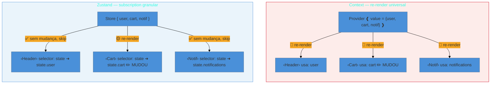

> [!abstract] TL;DR
> **Context API** é a solução nativa do React para compartilhar estado entre componentes, mas tem
> um problema fundamental: qualquer mudança no `value` re-renderiza **todos** os consumidores,
> independente de quais campos eles realmente usam. Isso a torna inadequada para estado que muda
> frequentemente. **Zustand** resolve isso com um modelo de **subscription granular** — cada
> componente assina apenas o slice que usa via selector, re-renderizando apenas quando aquele slice
> muda. Regra prática: Context para estado que muda raramente (tema, locale, usuário logado);
> Zustand para estado que muda com frequência (UI interativa, carrinhos, filtros). Ambas as
> abordagens vivem no espaço de client state — nenhuma substitui TanStack Query para server state.

> [!info] Pré-requisitos
> Esta nota assume que você já distingue server state de client state e sabe que cada um exige
> ferramentas diferentes. Caso contrário, comece pela
> [[03-Dominios/Tecnologia/React/Ecossistema/02 - Server state vs client state|Nota 02 — Server vs client state]].
> Para entender a Context API em profundidade, veja
> [[03-Dominios/Tecnologia/React/React core/11 - useContext e Context API|React core 11]].
> Para os fundamentos de estado local, elevado e externo no React, veja
> [[03-Dominios/Tecnologia/React/React core/15 - Estado - local, elevado e externo|React core 15]].

## O problema que o Context resolve — e cria

Imagine um componente `<App>` com três filhos: `<Header>`, `<Cart>` e `<Notifications>`. Os três
precisam saber quem é o usuário logado. Você poderia passar `user` como prop de cada um, mas se
eles estiverem profundamente aninhados — `<App> → <Layout> → <Sidebar> → <Header>` — o prop
drilling torna o código frágil e verboso.

A Context API resolve isso: você cria um `AuthContext`, envolve a árvore com um `Provider`, e
qualquer consumidor lê o contexto diretamente com `useContext(AuthContext)`. Problema de prop
drilling resolvido.

Mas aí a aplicação cresce, e você decide colocar mais dados no mesmo contexto:

```tsx
const AuthContext = createContext<{
  user: User | null;
  cart: CartItem[];
  notifications: Notification[];
}>({ user: null, cart: [], notifications: [] });
```

O `<Header>` só precisa de `user`. O `<Cart>` só precisa de `cart`. O `<Notifications>` só precisa
de `notifications`. Quando o usuário adiciona um item ao carrinho, o `value` do Provider muda —
e o React re-renderiza **todos os três**. O Header não mudou em nada, mas renderizou de novo.
Isso é o custo do Context.

> [!question]- Por que o Context re-renderiza todos os consumidores mesmo se apenas um campo mudou?
> O React usa comparação por referência (`Object.is`) para saber se o `value` do Provider mudou.
> Quando o componente pai re-renderiza (porque chamou `setState`), ele cria um **novo objeto**
> de `value` — mesmo que os campos internos sejam idênticos. Esse novo objeto tem uma referência
> diferente, e o React dispara re-renderização em todos os consumidores. É por isso que
> `<Provider value={{ user, cart }}>` inline causa re-renders desnecessários: o `{}` literal
> cria um objeto novo a cada render do pai.

## Quando Context basta — e quando dói

O Context funciona muito bem para dados que:

- **Mudam raramente**: tema da aplicação (claro/escuro), locale, feature flags.
- **São lidos por muitos**: usuário logado aparece em navbar, sidebar, footer.
- **Têm alto ratio leitura/escrita**: você seta uma vez ao login e lê em dezenas de lugares.

Para esses casos, a re-renderização universal não dói porque ela raramente acontece.

O Context começa a doer quando:

- O estado muda frequentemente durante interação normal (notificações em tempo real, carrinho,
  filtros de UI, tooltips com posição do mouse).
- Você tem consumidores seletivos — componentes que só usam parte do estado.
- A árvore é profunda e re-renders se tornam perceptíveis ou desperdiçam recursos.

### Mitigações nativas do Context

É possível minimizar o problema sem sair do Context, combinando três técnicas:

```tsx
// 1. Dividir contexts — não combine estado que muda em ritmos diferentes
const UserContext = createContext<User | null>(null);
const CartContext = createContext<CartState | null>(null);

// 2. Memoizar o value para evitar objetos novos a cada render do Provider
function UserProvider({ children }: { children: ReactNode }) {
  const [user, setUser] = useState<User | null>(null);
  const value = useMemo(() => ({ user, setUser }), [user]);
  return <UserContext.Provider value={value}>{children}</UserContext.Provider>;
}

```

Essas técnicas funcionam para casos simples, mas exigem disciplina constante e adicionam
boilerplate. Para estado que muda com frequência, Zustand entrega o mesmo resultado com menos
esforço.

## Context vs Zustand — o modelo de re-render

O diagrama abaixo mostra o que acontece quando `cart` muda em cada abordagem:



No Context, o Provider detecta mudança no `value` (objeto novo) e notifica todos os consumidores
indiscriminadamente. No Zustand, cada componente tem seu próprio subscriber que compara apenas o
valor retornado pelo selector — `<Header>` assina `state => state.user`, então só re-renderiza se
`user` mudar.

## Zustand — o default moderno

Zustand é uma biblioteca de estado global minimalista do grupo Poimandres. O modelo mental é simples: uma **store** (objeto JavaScript puro) que vive fora do ciclo de vida do React. Componentes se conectam via hooks com **selectors** que extraem exatamente o que precisam.

### Criando uma store com TypeScript

Em TypeScript, a convenção do Zustand v5 usa a forma **curried** de `create`:

```tsx
import { create } from 'zustand';

// Defina o tipo completo da store — estado + ações no mesmo tipo
interface CartItem {
  id: string;
  name: string;
  price: number;
  qty: number;
}

interface CartStore {
  items: CartItem[];
  total: number;
  addItem: (item: Omit<CartItem, 'qty'>) => void;
  removeItem: (id: string) => void;
  clearCart: () => void;
}

// create<T>()(...) — duplos parênteses é o padrão TS do Zustand v5
export const useCartStore = create<CartStore>()((set, get) => ({
  items: [],
  total: 0,

  addItem: (item) =>
    set((state) => {
      const exists = state.items.find((i) => i.id === item.id);
      const newItems = exists
        ? state.items.map((i) =>
            i.id === item.id ? { ...i, qty: i.qty + 1 } : i
          )
        : [...state.items, { ...item, qty: 1 }];
      return {
        items: newItems,
        total: newItems.reduce((sum, i) => sum + i.price * i.qty, 0),
      };
    }),

  removeItem: (id) =>
    set((state) => {
      const newItems = state.items.filter((i) => i.id !== id);
      return {
        items: newItems,
        total: newItems.reduce((sum, i) => sum + i.price * i.qty, 0),
      };
    }),

  clearCart: () => set({ items: [], total: 0 }),
}));
```

> [!question]- Por que duplos parênteses em `create<CartStore>()()`?
> `create<CartStore>()` retorna uma função — você passa o initializer para essa segunda chamada.
> Esse padrão curried existe porque o TypeScript não consegue fazer inferência parcial de tipos
> genéricos: se você escrevesse `create<CartStore>((set) => ...)`, o TS perderia os tipos de `set`
> e `get`. O currying força a inferência em dois passos, mantendo tudo tipado corretamente.

### Selectors — a chave da granularidade

A forma que quebra a granularidade (e é tentadora por conveniência):

```tsx
// ❌ Assina o store inteiro — re-renderiza quando QUALQUER campo mudar
function Cart() {
  const store = useCartStore();
  return <div>{store.items.length} itens — R$ {store.total}</div>;
}
```

A forma correta, com selectors:

```tsx
// ✅ Selector primitivo — re-renderiza só quando items mudar
function CartCount() {
  const itemCount = useCartStore((state) => state.items.length);
  return <span>{itemCount} itens</span>;
}

// ✅ Selector extraído e tipado — reusável e testável isoladamente
const selectTotal = (state: CartStore): number => state.total;

function CartTotal() {
  const total = useCartStore(selectTotal);
  return <strong>R$ {total.toFixed(2)}</strong>;
}

// ✅ Selector que retorna objeto — use useShallow para evitar re-renders
import { useShallow } from 'zustand/react/shallow';

function CartSummary() {
  const { items, total } = useCartStore(
    useShallow((state) => ({ items: state.items, total: state.total }))
  );
  return (
    <div>
      {items.length} itens — R$ {total.toFixed(2)}
    </div>
  );
}
```

`useShallow` faz comparação rasa (`shallowEqual`) nos campos do objeto retornado. Sem ele, um
selector que retorna `{ items, total }` sempre retornaria uma nova referência de objeto, causando
re-render mesmo quando os valores não mudaram.

### Lendo e atualizando fora de componentes

Zustand permite acessar e modificar a store fora da árvore React — útil em serviços, interceptors
de API ou callbacks de WebSocket:

```tsx
// Snapshot do estado atual (não reativo)
const currentItems = useCartStore.getState().items;

// Modifica o estado diretamente (dispara re-renders nos subscribers)
useCartStore.setState({ items: [] });

// Assina mudanças fora de componentes (retorna função de unsubscribe)
const unsubscribe = useCartStore.subscribe(
  (state) => state.total,
  (total, prevTotal) => {
    if (total > prevTotal) analytics.track('cart_value_increased', { total });
  }
);
unsubscribe(); // chamar quando não precisar mais
```

## Middleware — persistência, imutabilidade e debug

O Zustand usa **middleware composável** — funções que envolvem o initializer e adicionam comportamento à store sem alterar a API de uso.

### `persist` — estado que sobrevive ao reload

```tsx
import { create } from 'zustand';
import { persist, createJSONStorage } from 'zustand/middleware';

export const useCartStore = create<CartStore>()(
  persist(
    (set) => ({
      items: [],
      total: 0,
      addItem: (item) => set((state) => { /* ... */ }),
      clearCart: () => set({ items: [], total: 0 }),
    }),
    {
      name: 'cart-storage',
      storage: createJSONStorage(() => localStorage),
      partialize: (state) => ({ items: state.items }), // total é calculado, não persiste
    }
  )
);
```

### `immer` — mutações sem spread manual

```tsx
import { immer } from 'zustand/middleware/immer';

export const useCartStore = create<CartStore>()(
  immer((set) => ({
    items: [],
    total: 0,
    addItem: (item) =>
      set((state) => {
        // Escreve como se mutasse — Immer produz o objeto imutável
        const existing = state.items.find((i) => i.id === item.id);
        if (existing) {
          existing.qty += 1;
        } else {
          state.items.push({ ...item, qty: 1 });
        }
        state.total = state.items.reduce((sum, i) => sum + i.price * i.qty, 0);
      }),
  }))
);
```

### `devtools` — Redux DevTools no Zustand

```tsx
import { devtools } from 'zustand/middleware';

export const useCartStore = create<CartStore>()(
  devtools(
    (set) => ({
      items: [],
      total: 0,
      addItem: (item) =>
        set(
          (state) => ({ /* ... */ }),
          false,            // replace: false → merge, não substitui o estado
          'cart/addItem'    // nome da action visível no DevTools
        ),
      clearCart: () =>
        set({ items: [], total: 0 }, false, 'cart/clear'),
    }),
    { name: 'CartStore', enabled: process.env.NODE_ENV === 'development' }
  )
);
```

### Compondo middleware

```tsx
// Ordem: devtools envolve persist, que envolve immer
// Mais externo = vê mais coisas (devtools enxerga inclusive o rehydrate do persist)
export const useCartStore = create<CartStore>()(
  devtools(
    persist(
      immer((set) => ({ /* initializer */ })),
      { name: 'cart-storage' }
    ),
    { name: 'CartStore' }
  )
);
```

## Slice pattern — stores grandes sem caos

Quando a store cresce além de um domínio, o **slice pattern** divide o estado em fatias
independentes que são compostas em uma única store:

```tsx
import { create, StateCreator } from 'zustand';

// Tipo da store composta
type AppStore = CartSlice & UserSlice;

// Slice de carrinho
interface CartSlice {
  items: CartItem[];
  addItem: (item: CartItem) => void;
  clearCart: () => void;
}

// StateCreator<AppStore, [], [], CartSlice> — slice conhece o tipo da store completa
const createCartSlice: StateCreator<AppStore, [], [], CartSlice> = (set) => ({
  items: [],
  addItem: (item) => set((state) => ({ items: [...state.items, item] })),
  clearCart: () => set({ items: [] }),
});

// Slice de usuário
interface UserSlice {
  user: User | null;
  setUser: (user: User | null) => void;
}

const createUserSlice: StateCreator<AppStore, [], [], UserSlice> = (set) => ({
  user: null,
  setUser: (user) => set({ user }),
});

// Store composta — spread de todos os slices
export const useStore = create<AppStore>()((...args) => ({
  ...createCartSlice(...args),
  ...createUserSlice(...args),
}));

// Hooks especializados por domínio — encapsulam o selector
export const useCartItems = () => useStore((state) => state.items);
export const useCurrentUser = () => useStore((state) => state.user);
```

Cada slice encapsula sua lógica e pode ser desenvolvido e testado isoladamente. A store final é
a composição — os componentes nunca precisam saber que a store existe como monólito.

## Casos práticos

### Cenário 1: Carrinho de e-commerce com persistência entre reloads

Em um e-commerce, o carrinho requer persistência, alta frequência de escrita e leitura em
múltiplos pontos. A `useCartStore` composta com `devtools(persist(immer(...)))` — construída na
seção Middleware — atende todos esses requisitos sem nenhum Provider:

```tsx
// Uso em qualquer componente — sem Provider, sem prop drilling
const itemCount  = useCartStore((s) => s.items.length);  // Header
const addItem    = useCartStore((s) => s.addItem);        // Página de produto
const removeItem = useCartStore((s) => s.removeItem);     // Checkout
```

O reload hidrata automaticamente os itens do `localStorage`; o DevTools exibe cada `addItem` na
timeline; e o Immer elimina o spread manual nas mutations — tudo com a mesma API de selector.

### Cenário 2: Notificações em tempo real via WebSocket

Notificações chegam via WebSocket fora da árvore React. Zustand é atualizado diretamente pelo
handler — sem precisar de `useEffect`, `useRef` ou prop drilling até o componente de badge:

```tsx
// store/notifications.ts
export const useNotifStore = create<NotifStore>()((set) => ({
  unread: 0,
  list: [],
  addNotif: (n) => set((s) => ({ unread: s.unread + 1, list: [n, ...s.list] })),
  markAllRead: () => set({ unread: 0 }),
}));

// websocket.ts — fora da árvore React
socket.on('notification', (n) => {
  useNotifStore.getState().addNotif(n);  // dispara re-render só no badge
});

// NotificationBadge.tsx
const unread = useNotifStore((s) => s.unread);  // só re-renderiza se unread mudar
return unread > 0 ? <Badge>{unread}</Badge> : null;
```

## Armadilhas comuns

> [!warning] Assinar o store inteiro por conveniência
> **O que acontece:** `const store = useStore()` parece mais simples — acessa tudo de uma vez.
> Mas isso assina toda a store: o componente re-renderiza quando **qualquer** campo mudar,
> incluindo campos que ele nunca usa.
> **Por quê:** sem selector, Zustand usa comparação por referência no objeto de estado inteiro.
> **Como evitar:** sempre passe um selector: `useStore(state => state.items)`. Para múltiplos
> campos, use `useShallow`.

> [!warning] Retornar objeto/array novo no selector sem useShallow
> **O que acontece:** `useStore(state => ({ a: state.a, b: state.b }))` causa re-renders
> desnecessários mesmo quando `a` e `b` não mudaram — ou em casos extremos, loops de render.
> **Por quê:** Zustand compara o retorno do selector com `Object.is`. Um objeto literal `{}`
> criado na chamada do hook nunca é igual ao objeto anterior por referência — são sempre
> objetos distintos para o `Object.is`, mesmo com os mesmos valores dentro.
> **Como evitar:** `useStore(useShallow(state => ({ a: state.a, b: state.b })))`. O `useShallow`
> faz comparação campo a campo, não por referência.

> [!warning] Não nomear as actions no devtools
> **O que acontece:** o Redux DevTools mostra todas as mutações como `anonymous` ou com nomes
> gerados automaticamente, dificultando o rastreamento de bugs na timeline de ações.
> **Por quê:** `set(newState)` com dois argumentos não passa nome da action. O devtools middleware
> usa o nome da função como fallback, mas funções anônimas não têm nome.
> **Como evitar:** passe o nome da action como terceiro argumento: `set(newState, false, 'cart/addItem')`.
> Adote convenção `dominio/acao` para clareza no DevTools.

> [!warning] Middleware na ordem errada quebra o observability
> **O que acontece:** combinando `devtools(immer(...))` sem persist no meio, o DevTools não
> enxerga as ações do `persist` (como `rehydrate`), dificultando debug de bugs de hidratação.
> **Por quê:** o middleware mais externo "vê" apenas o que está diretamente dentro dele.
> **Como evitar:** siga a ordem recomendada: `devtools` > `persist` > `immer` (de fora para
> dentro). Cada middleware intercepta as ações do que está dentro dele — devtools precisa estar
> mais externo para enxergar tudo.

## Como explicar em inglês

When asked about state management in React, you can frame it this way:

> "For global client state, I default to Zustand over Context API for anything that updates
> frequently. Context re-renders every consumer when the value object changes — even consumers
> that don't care about the changed field. Zustand uses selector-based subscriptions, so components
> only re-render when their specific slice changes. Context is still a great fit for rarely-changed
> state like theme or locale."

| PT | EN |
|----|----|
| Estado global | Global state |
| Gerenciamento de estado | State management |
| Re-renderização desnecessária | Unnecessary re-render |
| Assinatura granular | Granular subscription |
| Seletor | Selector |
| Fatia | Slice |
| Persistência | Persistence |
| Reidratação | Rehydration |
| Store fora da árvore | Store outside the React tree |
| Comparação rasa | Shallow comparison |
| Middleware composável | Composable middleware |
| Prop drilling | Prop drilling |

## O que vem a seguir

Com o client state global dominado — seja com Context para dados estáticos ou Zustand para estado
reativo — a próxima fronteira é o **roteamento**: como o React Router gerencia URLs,
parâmetros de rota e estado derivado da URL. A navegação é, em essência, mais um tipo de estado
global que precisa de uma ferramenta especializada.

- [[03-Dominios/Tecnologia/React/Ecossistema/02 - Server state vs client state|Nota 02 — Server vs client state]] — o contexto que motivou esta nota
- [[03-Dominios/Tecnologia/React/React core/11 - useContext e Context API|React core 11]] — Context API em profundidade
- [[03-Dominios/Tecnologia/React/React core/15 - Estado - local, elevado e externo|React core 15]] — fundamentos de estado no React
- [[03-Dominios/Tecnologia/React/Dicionário de React|Dicionário de React]] — glossário de termos

## Fontes

- **Zustand Docs** — [*Beginner TypeScript Guide*](https://zustand.docs.pmnd.rs/learn/guides/beginner-typescript) — documentação oficial com exemplos TS e curried create
- **Zustand Docs** — [*Migrating to v5*](https://zustand.docs.pmnd.rs/reference/migrations/migrating-to-v5) — breaking changes e diferenças de API na v5
- **Poimandres** — [*Announcing Zustand v5*](https://pmnd.rs/blog/announcing-zustand-v5/) — release notes oficiais com racional de design
- **Dominik Dorfmeister (TkDodo)** — [*Working with Zustand*](https://tkdodo.eu/blog/working-with-zustand) — boas práticas, selectors e slice pattern
- **Atlys Engineering** — [*A Slice-Based Zustand Store for Next.js 14 and TypeScript*](https://engineering.atlys.com/a-slice-based-zustand-store-for-next-js-14-and-typescript-6b92385a48f5) — slice pattern com TypeScript em produção
