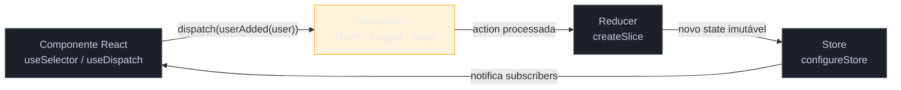

> [!abstract] TL;DR
> Redux Toolkit (RTK) é o Redux moderno — sem o boilerplate infernal do Redux clássico. `createSlice` gera actions automaticamente; `configureStore` já vem com DevTools e Thunk inclusos; Immer cuida da imutabilidade nos bastidores. Em 2026, RTK ainda domina projetos legados e brilha onde você precisa de time-travel debugging, middleware avançado (redux-saga, redux-observable) ou padrões rígidos para equipes grandes. Para novos projetos sem Redux instalado, Zustand é a escolha mais simples — mas saber RTK é obrigatório para qualquer dev sênior que vai trabalhar em código real de produção.

> [!info] Contexto no galho
> Esta nota dá sequência à [[03-Dominios/Tecnologia/React/Ecossistema/07 - Client state global - Context e Zustand|Nota 07 — Context e Zustand]], onde vimos por que precisamos de state global e como Zustand resolve isso com mínimo de cerimônia. Se quiser entender a base teórica por trás do padrão reducer, a [[03-Dominios/Tecnologia/React/React core/12 - useReducer e estado complexo|React core 12]] explica `useReducer` do zero — Redux é basicamente um `useReducer` global com superpoderes. Glossário de termos em [[03-Dominios/Tecnologia/React/Dicionário de React|Dicionário de React]].

## O peso da história

Você acabou de entrar em uma empresa. O projeto tem cinco anos, usa React, e tem um diretório `store/` com quarenta arquivos: `actions/`, `reducers/`, `constants/`, `selectors/`... Para adicionar um único campo ao perfil do usuário, você precisa tocar em seis ou sete lugares diferentes — o tipo da action em `constants/userActionTypes.js`, o action creator em `actions/userActions.js`, o reducer em `reducers/userReducer.js`, os seletores, e ainda os testes de cada um desses arquivos.

Isso não é exagero. Era a realidade cotidiana de quem usava Redux clássico.

Redux surgiu em 2015, criado por Dan Abramov e Andrew Clark, inspirado no padrão Flux do Facebook e nos conceitos de programação funcional do Elm. Por anos, foi *a* solução de state management em React: um store centralizado, imutável, com fluxo unidirecional de dados. A ideia era poderosa — um único lugar para toda a verdade do app, reproduzível e auditável. Mas a implementação exigia muito ritual.

O problema não era a filosofia. Era o volume de código cerimônico que a filosofia impunha. Equipes inteligentes perdiam horas em tasks simples porque o ecossistema não tinha abstraído o suficiente.

Redux Toolkit nasceu em 2019 como a resposta oficial: *o Redux que deveria ter existido desde o começo*. Não é uma biblioteca nova — é Redux, mas com as abstrações certas no lugar certo.

## O que o Redux Toolkit resolve

Pense no Redux original como um carro que você monta peça por peça: motor, câmbio, elétrica, cada parafuso separado. O Redux Toolkit é o mesmo carro, já montado de fábrica — com airbag (Immer para imutabilidade segura), GPS (DevTools integrado) e ar-condicionado (Thunk middleware incluso). Você ainda dirige o mesmo carro; só não precisa mais montar do zero.

### `configureStore`: o setup que coube em um arquivo

No Redux clássico, configurar o store era uma receita de pelo menos vinte linhas: `createStore`, `applyMiddleware`, `composeWithDevTools`, um `rootReducer` combinado manualmente, types para o estado raiz, types para o dispatch. E se você queria TypeScript decente, precisava de mais boilerplate ainda.

Com RTK, o mesmo setup fica assim:

```typescript
// store/index.ts
import { configureStore } from '@reduxjs/toolkit'
import usersReducer from './usersSlice'
import cartReducer from './cartSlice'

export const store = configureStore({
  reducer: {
    users: usersReducer,
    cart: cartReducer,
  },
  // Redux DevTools habilitado automaticamente em desenvolvimento
  // redux-thunk já incluso — não precisa instalar separado
})

// Types inferidos automaticamente do store
export type RootState = ReturnType<typeof store.getState>
export type AppDispatch = typeof store.dispatch
```

Em RTK v2 (lançado no final de 2023 e consolidado como padrão em 2025–2026), tanto `middleware` quanto `enhancers` precisam ser callbacks quando customizados — não mais arrays diretos. Isso elimina uma fonte de bugs onde o middleware padrão era acidentalmente descartado.

```typescript
// RTK v2: customizar middleware preservando os padrões
configureStore({
  reducer: { /* ... */ },
  middleware: (getDefaultMiddleware) =>
    getDefaultMiddleware().concat(loggerMiddleware),
})
```

### `createSlice`: actions e reducers em um só lugar

> [!question]- Como o reducer pode "mutar" o state se Redux exige imutabilidade?
> Essa é a pergunta certa. A resposta é: você *escreve* como se estivesse mutando, mas o **Immer** — que o RTK usa internamente — intercepta cada operação e produz um novo objeto imutável por baixo dos panos. É como um gravador de movimento: você age normalmente, o Immer anota cada passo e monta um novo objeto sem tocar no original.

O `createSlice` faz o que antes exigia três arquivos separados: define o reducer, gera os action creators automaticamente com os nomes que você escolher, e exporta tudo de forma coesa. `PayloadAction<T>` do RTK é o que garante tipagem forte no `action.payload`:

```typescript
// store/usersSlice.ts
import { createSlice, PayloadAction } from '@reduxjs/toolkit'

interface User {
  id: string
  name: string
  email: string
  role: 'admin' | 'member'
}

interface UsersState {
  list: User[]
  loading: boolean
  error: string | null
  selectedId: string | null
}

const initialState: UsersState = {
  list: [],
  loading: false,
  error: null,
  selectedId: null,
}

export const usersSlice = createSlice({
  name: 'users',
  initialState,
  reducers: {
    userAdded(state, action: PayloadAction<User>) {
      // Immer torna esta mutação direta segura
      state.list.push(action.payload)
    },
    userRemoved(state, action: PayloadAction<string>) {
      state.list = state.list.filter(u => u.id !== action.payload)
    },
    userUpdated(state, action: PayloadAction<User>) {
      const index = state.list.findIndex(u => u.id === action.payload.id)
      if (index !== -1) {
        state.list[index] = action.payload
      }
    },
    userSelected(state, action: PayloadAction<string | null>) {
      state.selectedId = action.payload
    },
  },
})

// Actions geradas automaticamente — não escreva action creators à mão
export const { userAdded, userRemoved, userUpdated, userSelected } = usersSlice.actions
export default usersSlice.reducer
```

O TypeScript infere os tipos automaticamente a partir do `initialState` e dos `reducers`. Você ganha autocompletar no dispatch sem precisar declarar interfaces de action manualmente.

### `createAsyncThunk`: a vida assíncrona ficou menos feia

Toda operação de API tem três estados naturais: *estou buscando*, *consegui*, *falhei*. O `createAsyncThunk` modela exatamente isso, gerando automaticamente três action types — `pending`, `fulfilled`, `rejected` — que você pode capturar no `extraReducers`:

```typescript
// store/usersSlice.ts (continuação)
import { createSlice, createAsyncThunk, PayloadAction } from '@reduxjs/toolkit'

export const fetchUsers = createAsyncThunk(
  'users/fetchAll',                       // prefixo do action type
  async (_, { rejectWithValue }) => {
    try {
      const response = await fetch('/api/users')
      if (!response.ok) throw new Error(`HTTP ${response.status}`)
      return (await response.json()) as User[]
    } catch (err) {
      // rejectWithValue passa o erro para o action.payload do rejected
      return rejectWithValue('Não foi possível carregar os usuários.')
    }
  }
)

export const usersSlice = createSlice({
  name: 'users',
  initialState,
  reducers: { /* ... reducers síncronos acima ... */ },
  // Em RTK v2, extraReducers SÓ aceita a forma callback — objeto foi removido
  extraReducers: (builder) => {
    builder
      .addCase(fetchUsers.pending, (state) => {
        state.loading = true
        state.error = null
      })
      .addCase(fetchUsers.fulfilled, (state, action: PayloadAction<User[]>) => {
        state.loading = false
        state.list = action.payload
      })
      .addCase(fetchUsers.rejected, (state, action) => {
        state.loading = false
        state.error = action.payload as string
      })
  },
})
```

> [!question]- Qual a diferença entre `reducers` e `extraReducers`?
> `reducers` é para actions **geradas pelo próprio slice** — síncronas, declaradas ali mesmo. `extraReducers` é para reagir a actions **externas** — thunks de `createAsyncThunk`, ou actions de outros slices. A confusão entre os dois é uma das armadilhas mais comuns.

## Fluxo completo: do dispatch ao componente

O Redux implementa um ciclo estritamente unidirecional. Nenhum componente modifica o state diretamente — ele dispara uma action, que passa pelo middleware, chega ao reducer, gera um novo state, e o store notifica quem está assinando via `useSelector`:



A unidirecionalidade é o que torna o Redux auditável: em qualquer momento, você pode abrir o Redux DevTools e ver exatamente qual action foi disparada, em qual ordem, com qual payload, e qual era o state antes e depois. Isso é *time-travel debugging* — e é o trunfo que Zustand ainda não conseguiu replicar com a mesma fidelidade.

## RTK Query: quando o Redux cuida do servidor também

O RTK v2 inclui RTK Query — uma solução de data fetching integrada ao store Redux. Você define endpoints uma vez e recebe hooks prontos, com cache, invalidação e estados de loading:

```typescript
// store/usersApi.ts
import { createApi, fetchBaseQuery } from '@reduxjs/toolkit/query/react'

export const usersApi = createApi({
  reducerPath: 'usersApi',
  baseQuery: fetchBaseQuery({ baseUrl: '/api' }),
  tagTypes: ['User'],
  endpoints: (builder) => ({
    getUsers: builder.query<User[], void>({
      query: () => '/users',
      providesTags: ['User'],
    }),
    createUser: builder.mutation<User, Omit<User, 'id'>>({
      query: (body) => ({ url: '/users', method: 'POST', body }),
      invalidatesTags: ['User'], // limpa o cache de getUsers automaticamente
    }),
  }),
})

export const { useGetUsersQuery, useCreateUserMutation } = usersApi
```

**Quando faz sentido usar RTK Query em 2026:** o projeto já usa RTK de forma extensiva e a equipe quer manter server state e client state no mesmo store, com um único mental model. O DevTools então mostra chamadas de API como actions — você vê o ciclo completo de uma requisição.

**Quando não faz sentido:** em projetos novos sem Redux legado, TanStack Query ganhou esse espaço de forma definitiva — menos boilerplate, framework-agnostic, e 12 milhões de downloads semanais em 2026. Não instale RTK só para ter RTK Query.

## Redux vs Zustand — a comparação que aparece em entrevista

Essa comparação surge em praticamente toda entrevista sênior de React. O entrevistador quer saber se você entende *por que* escolheria cada um — não apenas qual é mais popular agora.

| Critério | Redux Toolkit v2 | Zustand |
|----------|:---:|:---:|
| **Boilerplate** | Médio (slice + store + types) | Baixo (~15 linhas total) |
| **DevTools** | Excelente (time-travel, replay) | Básico (snapshot do state) |
| **Curva de aprendizado** | Média-alta | Baixa |
| **TypeScript** | Excelente (infere do initialState) | Excelente (generics simples) |
| **Middleware avançado** | ✅ saga, observable, listener | Limitado |
| **Bundle size** | ~47kb (RTK + Redux) | ~3kb |
| **Legado / ecossistema** | 15 anos, domina projetos legados | Crescente, preferido em novos |
| **Projetos novos (2026)** | Só com justificativa clara | Padrão razoável |
| **Projetos legados** | Dominante | Migração = reescrita |

A diferença de DevTools é mais importante do que parece. Zustand tem integração com Redux DevTools, mas como Zustand não tem o conceito de "named actions", a timeline de eventos é vaga — você vê o state mudando, mas não *o quê* causou a mudança. Redux registra cada action com nome, payload e diff de state. Para debugging de produção, isso é a diferença entre investigar um crime com câmeras HD e investigar com uma câmera de segurança borrada.

### Quando escolher Redux em 2026

A resposta honesta: **na maioria dos novos projetos pequenos-médios, Zustand é a escolha mais racional**. Menos setup, menos arquivos, mesma funcionalidade para o caso de uso padrão. Mas Redux ainda é a escolha certa em quatro cenários específicos:

**1. Projeto legado com Redux instalado.** Migrar de Redux clássico para RTK é simples, incremental e de alto valor — você elimina boilerplate sem reescrever a lógica. Pular direto para Zustand significa reescrever toda a arquitetura de state do zero.

**2. Time-travel debugging crítico.** Você precisa reproduzir bugs de produção estado por estado, ou auditar sequências de ações em fluxos financeiros/transacionais. O Redux DevTools é incomparável para isso.

**3. Middleware avançado não-trivial.** `redux-saga` para workflows complexos com cancel de requests e race conditions. `redux-observable` para streams RxJS. Listener middleware do RTK para reações cross-slice declarativas ("quando o usuário faz logout, limpa 5 slices diferentes").

**4. Equipe grande com padrões rígidos.** Redux força uma estrutura de convenções que escala com times. A liberdade do Zustand pode ser uma armadilha em equipes maiores sem disciplina de arquitetura — cada dev inventa um padrão diferente de organizar as stores.

## Casos práticos

### Cenário 1: migrar Redux clássico para RTK sem reescrever a lógica

Você herda um projeto com `actions/userActions.js`, `reducers/userReducer.js` e `constants/userActionTypes.js` separados. A migração para RTK pode ser feita slice por slice, sem tocar no resto do app:

```typescript
// ANTES (Redux clássico — 3 arquivos separados):
// constants/userActionTypes.js
export const USER_ADDED = 'USER_ADDED'
export const USER_REMOVED = 'USER_REMOVED'

// actions/userActions.js
import { USER_ADDED, USER_REMOVED } from '../constants/userActionTypes'
export const addUser = (user) => ({ type: USER_ADDED, payload: user })
export const removeUser = (id) => ({ type: USER_REMOVED, payload: id })

// reducers/userReducer.js
import { USER_ADDED, USER_REMOVED } from '../constants/userActionTypes'
const initialState = { list: [] }
export default function userReducer(state = initialState, action) {
  switch (action.type) {
    case USER_ADDED:
      return { ...state, list: [...state.list, action.payload] }
    case USER_REMOVED:
      return { ...state, list: state.list.filter(u => u.id !== action.payload) }
    default:
      return state
  }
}
```

```typescript
// DEPOIS (RTK — 1 arquivo, menos da metade do código):
// store/usersSlice.ts
import { createSlice, PayloadAction } from '@reduxjs/toolkit'

const usersSlice = createSlice({
  name: 'users',
  initialState: { list: [] as User[] },
  reducers: {
    userAdded: (state, action: PayloadAction<User>) => {
      state.list.push(action.payload)
    },
    userRemoved: (state, action: PayloadAction<string>) => {
      state.list = state.list.filter(u => u.id !== action.payload)
    },
  },
})

export const { userAdded, userRemoved } = usersSlice.actions
export default usersSlice.reducer
```

A migração é cirúrgica: o resto do app continua funcionando porque os action types gerados pelo RTK seguem o padrão `'sliceName/reducerName'` (ex: `'users/userAdded'`). Você só precisa atualizar os `dispatch` para usar os novos action creators exportados.

### Cenário 2: listener middleware para reações cross-slice

Um dos casos onde Redux brilha e Zustand não tem equivalente maduro: você precisa que o logout do usuário limpe dados de vários slices simultaneamente, cancele requests pendentes e persista um evento de analytics — tudo de forma declarativa.

```typescript
// store/listenerMiddleware.ts
import { createListenerMiddleware, isAnyOf } from '@reduxjs/toolkit'
import { userLoggedOut } from './authSlice'
import { cartCleared } from './cartSlice'
import { notificationsCleared } from './notificationsSlice'

export const listenerMiddleware = createListenerMiddleware()

listenerMiddleware.startListening({
  actionCreator: userLoggedOut,
  effect: async (action, listenerApi) => {
    // Cancela qualquer request pendente antes de limpar
    listenerApi.cancelActiveListeners()

    // Dispara limpeza de múltiplos slices em paralelo
    listenerApi.dispatch(cartCleared())
    listenerApi.dispatch(notificationsCleared())

    // Analytics assíncrono sem bloquear a UI
    await fetch('/api/analytics', {
      method: 'POST',
      body: JSON.stringify({ event: 'user_logout', timestamp: Date.now() }),
    })
  },
})

// No configureStore:
configureStore({
  reducer: { /* ... */ },
  middleware: (getDefault) =>
    getDefault().prepend(listenerMiddleware.middleware),
})
```

Esse padrão declarativo — "quando X acontece, execute Y" — seria implementado com `useEffect` e refs globais em Zustand, o que rapidamente vira código frágil e difícil de testar.

## Armadilhas comuns

> [!warning] Usar objeto em `extraReducers` — quebra no RTK v2
> **O que acontece:** o código `extraReducers: { [fetchUsers.fulfilled]: (state, action) => ... }` funcionava no RTK v1 mas lança erro em RTK v2+. **Por quê:** o suporte à sintaxe de objeto foi removido na versão 2.0 para eliminar ambiguidade com action types e melhorar inferência de tipos no TypeScript. **Como evitar:** sempre use o `builder` callback: `extraReducers: (builder) => { builder.addCase(fetchUsers.fulfilled, ...) }`.

> [!warning] Mutar o state fora do `createSlice` — Immer não está ativo ali
> **O que acontece:** você escreve `state.users.push(user)` em um reducer criado com `createReducer` sem Immer, ou em um handler fora do slice, e o state é corrompido silenciosamente (ou lança erro em modo estrito). **Por quê:** o Immer só está ativo dentro dos reducers declarados no `createSlice` ou `createReducer` do RTK. Fora desse contexto, você está mutando um objeto congelado. **Como evitar:** mute diretamente dentro do `createSlice.reducers`. Em qualquer outro lugar, retorne um novo objeto imutável.

> [!warning] Confundir `reducers` com `extraReducers`
> **O que acontece:** você define um case para um thunk dentro de `reducers` em vez de `extraReducers`, e a action nunca é capturada — o estado de loading nunca muda. **Por quê:** `reducers` processa apenas as actions geradas pelo próprio slice. Actions externas (thunks, outros slices) precisam do `extraReducers`. **Como evitar:** regra simples — tudo que vem de `createAsyncThunk` vai em `extraReducers`. Tudo que você cria no `reducers` fica sincronizável no `reducers`.

> [!warning] Atualizar RTK v2 sem atualizar React Redux para v9
> **O que acontece:** erros de tipo no `useSelector` e `useDispatch`, ou comportamentos inconsistentes onde o componente não re-renderiza na mudança de state. **Por quê:** RTK v2 requer React Redux 9.0+ como peer dependency. **Como evitar:** ao migrar para RTK v2, atualize sempre os dois juntos: `npm i @reduxjs/toolkit@latest react-redux@latest`.

## Como explicar em inglês

When an interviewer asks why you'd choose Redux Toolkit over Zustand in 2026, the honest answer is context-dependent: "I'd reach for Redux Toolkit on an existing project that already has Redux installed — migrating from classic Redux to RTK is low-risk and eliminates a lot of boilerplate. I'd also choose RTK when the team genuinely needs time-travel debugging, which is Redux DevTools' killer feature, or when complex middleware like redux-saga is already part of the architecture. For a greenfield project without those constraints, Zustand is usually the simpler, lighter choice — same job, much less ceremony."

| PT | EN |
|----|-----|
| fatia de estado | state slice |
| ação | action |
| despachador / despachar | dispatcher / to dispatch |
| redutor | reducer |
| efeito colateral | side effect |
| imutabilidade | immutability |
| middleware | middleware (mesmo termo) |
| depuração com viagem no tempo | time-travel debugging |
| state global | global state / application state |
| thunk | thunk (mesmo termo) |
| estado pendente / resolvido / rejeitado | pending / fulfilled / rejected state |
| boilerplate | boilerplate (mesmo termo) |

## O que vem a seguir

Redux e Zustand resolvem o state que vive no cliente — dados que o usuário cria ou modifica localmente, independente do servidor. Mas e os dados que *vêm* do servidor? Cache de respostas, sincronização com a API, stale data, refetch automático, paginação, otimistic updates — tudo isso é um domínio à parte, com problemas próprios. As próximas notas do galho entram nesse território.

## Fontes

- **Redux Toolkit Team** — [*Migrating to RTK 2.0 and Redux 5.0*](https://redux-toolkit.js.org/usage/migrating-rtk-2) — guia oficial de breaking changes da v2; referência definitiva para `extraReducers` callback e `middleware` como função
- **Redux Toolkit Team** — [*Usage with TypeScript*](https://redux-toolkit.js.org/usage/usage-with-typescript/) — tipagem de `createSlice`, `PayloadAction<T>`, `createAsyncThunk` e inferência de `RootState`
- **Redux Toolkit Team** — [*configureStore API*](https://redux-toolkit.js.org/api/configureStore) — documentação oficial do setup do store; inclui nota sobre middleware callback em v2
- **LogRocket** — [*Exploring Redux Toolkit 2.0 and the Redux second generation*](https://blog.logrocket.com/exploring-redux-second-generation/) — análise das mudanças de API na v2 com exemplos de antes/depois
- **Better Stack** — [*Zustand vs Redux Toolkit vs Jotai*](https://betterstack.com/community/guides/scaling-nodejs/zustand-vs-redux-toolkit-vs-jotai/) — comparação aprofundada com benchmarks e cenários de produção
- **TanStack Docs** — [*Comparison: React Query vs RTK Query*](https://tanstack.com/query/latest/docs/framework/react/comparison) — comparativo oficial de data fetching que justifica quando RTK Query ainda faz sentido
