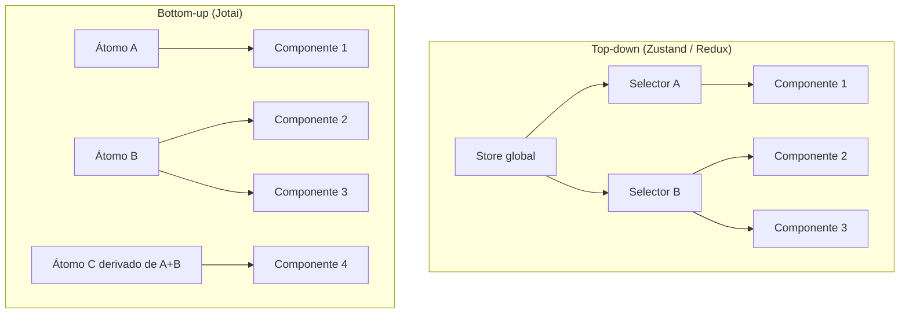

# Estado avançado — Jotai, atoms e signals

> [!abstract]
> Jotai resolve o re-render excessivo do React com um modelo **bottom-up** de átomos atômicos: cada componente subscreve exatamente ao pedaço de estado que precisa, sem selectors nem boilerplate, ficando no meio do caminho entre `useState` e Zustand.

## Problema: por que mais um modelo de estado?

Pense assim: você já tem `useState` para estado local e Zustand para global. O que falta?

O problema aparece quando você tem um estado que é compartilhado entre vários componentes, mas cada um precisa de apenas um pedaço dele. Com Zustand, você cria selectors — e eles ajudam — mas toda a store ainda existe como um bloco único que é passado de cima para baixo. Com Context, então, a situação é pior: qualquer escrita no contexto re-renderiza **todos** os consumidores, independentemente de qual propriedade mudou.

`useState` é certo para estado verdadeiramente local — o valor de um input, se um menu está aberto. Mas quando dois componentes precisam do mesmo estado, você eleva ao pai (prop drilling) ou coloca no Context (re-render em cascata). Zustand resolve o re-render, mas impõe uma estrutura de store que nem sempre espelha bem o problema. Jotai existe na interseção: estado que é compartilhado, granular e interdependente.

Imagine uma tela de editor com 50 componentes. Cada um mostra uma propriedade diferente de um objeto de configuração. O usuário muda apenas a cor do fundo. No modelo top-down, todos os 50 componentes são candidatos a re-render — a responsabilidade de evitar isso cai em `React.memo`, `useMemo` e selectors bem escritos.

Jotai inverte essa lógica.

> [!info] Pré-requisitos
> Esta nota assume familiaridade com os problemas de re-render do React e com o modelo de estado global já apresentados em [[03-Dominios/Tecnologia/React/React core/15 - Estado - local, elevado e externo|React core 15]] e [[03-Dominios/Tecnologia/React/Ecossistema/07 - Client state global - Context e Zustand|Nota 07 — Context e Zustand]].

---

## O modelo top-down vs bottom-up

No modelo **top-down** — que é o de Zustand, Redux e Context — existe uma fonte de verdade central. Os componentes recebem estado descendo pela árvore ou via selectors que apontam para a store. A store manda, os componentes obedecem.

No modelo **bottom-up** do Jotai, não existe store. Existem átomos. Cada átomo é uma unidade mínima de estado. Os componentes declaram quais átomos consomem, e o Jotai garante que apenas os componentes que dependem de um átomo específico re-renderizam quando ele muda.



No diagrama top-down, a store é o ponto de partida — tudo flui dela. No bottom-up, os átomos existem de forma independente e os componentes escolhem quais consomem. Não há hierarquia central.

Essa diferença parece sutil no papel, mas é enorme na prática: adicionar um novo átomo não exige tocar na store nem criar um slice. Você declara o átomo e o usa.

Outra consequência: no modelo top-down, deletar um campo da store pode quebrar vários componentes de uma vez. No modelo bottom-up, cada átomo é uma unidade independente — remover um não afeta os outros, só os componentes que o consumiam diretamente.

---

## Jotai — primitivas

A API do Jotai é pequena de propósito. O núcleo cabe em quatro funções.

### `atom<T>(initialValue)` — criando um átomo

```typescript
import { atom } from 'jotai'

const countAtom = atom<number>(0)
const userAtom = atom<User | null>(null)
const isOpenAtom = atom<boolean>(false)
```

Átomos são declarados **fora** de qualquer componente — mais sobre isso nas armadilhas. Por enquanto, pense neles como variáveis globais com superpoder de reatividade.

### `useAtom<T>(atom)` — leitura e escrita

```typescript
import { useAtom } from 'jotai'

function Counter() {
  const [count, setCount] = useAtom(countAtom)

  return (
    <button onClick={() => setCount(c => c + 1)}>
      Cliques: {count}
    </button>
  )
}
```

A API é idêntica a `useState`, mas o estado é compartilhado entre todos os componentes que usam `countAtom`. Sem prop drilling, sem Context, sem Provider obrigatório (há um `<Provider>` opcional para isolar escopos, mas não é necessário por padrão).

Note que o setter aceita tanto um valor direto quanto um callback com o valor anterior — exatamente como `useState`. Isso é proposital: a curva de aprendizado é quase zero para quem já conhece hooks. A diferença está no escopo: `useState` é local ao componente; `useAtom` é compartilhado entre qualquer componente que referencie o mesmo átomo, em qualquer lugar da árvore.

### `useAtomValue<T>` — apenas leitura

```typescript
import { useAtomValue } from 'jotai'

function CountDisplay() {
  const count = useAtomValue(countAtom) // não re-renderiza em writes
  return <span>{count}</span>
}
```

Use quando o componente precisa **ler** mas nunca escrever. Ele subscreve ao átomo e re-renderiza quando o valor muda — mas se outro componente escrever num átomo diferente que não afeta este, nada acontece.

### `useSetAtom<T>` — apenas escrita

```typescript
import { useSetAtom } from 'jotai'

function ResetButton() {
  const setCount = useSetAtom(countAtom) // nunca re-renderiza
  return <button onClick={() => setCount(0)}>Reset</button>
}
```

O `ResetButton` acima **nunca** re-renderiza por causa do `countAtom`, mesmo que o valor mude constantemente. Ele só escreve. Esse é um ganho de performance real e de graça — algo que exigiria `React.memo` + `useCallback` bem calibrado no modelo top-down.

É um padrão muito comum em forms: um componente de input escreve num átomo, um componente de display lê do mesmo átomo. Com `useSetAtom` no input e `useAtomValue` no display, nenhuma renderização vaza para o lado que não precisa.

```typescript
const nameAtom = atom<string>('')

// input — escreve, nunca re-renderiza por mudanças no valor
function NameInput() {
  const setName = useSetAtom(nameAtom)
  return <input onChange={e => setName(e.target.value)} />
}

// display — lê, re-renderiza só quando o valor muda
function NameDisplay() {
  const name = useAtomValue(nameAtom)
  return <p>Olá, {name || 'visitante'}!</p>
}
```

No modelo de Context puro, digitar no input re-renderizaria o `NameDisplay` a cada keystroke — e vice-versa. Com átomos, cada componente paga exatamente pelo que consome.

---

## Átomos derivados — computed state sem memo manual

O segundo superpoder do Jotai é o átomo derivado. Em vez de calcular valores derivados com `useMemo` espalhado pelo código, você declara a derivação uma vez, no átomo.

```typescript
const countAtom = atom<number>(0)
const doubleCountAtom = atom<number>(get => get(countAtom) * 2)
```

`doubleCountAtom` é read-only e se atualiza automaticamente quando `countAtom` muda. Nenhum componente precisa saber que essa derivação existe — eles simplesmente consomem `doubleCountAtom` com `useAtomValue`.

### Derivando múltiplos átomos

```typescript
interface CartItem {
  id: string
  price: number
  qty: number
}

const itemsAtom = atom<CartItem[]>([])
const discountAtom = atom<number>(0)

const subtotalAtom = atom<number>(get => {
  const items = get(itemsAtom)
  return items.reduce((sum, item) => sum + item.price * item.qty, 0)
})

const totalAtom = atom<number>(get => {
  const subtotal = get(subtotalAtom)
  const discount = get(discountAtom)
  return subtotal * (1 - discount)
})
```

`totalAtom` depende de `subtotalAtom`, que depende de `itemsAtom`. O Jotai mantém o grafo de dependências automaticamente. Você adiciona um item ao carrinho, e `totalAtom` se atualiza — sem `useMemo`, sem props, sem contexto intermediário.

### Átomos async — integração com Suspense

```typescript
const usersAtom = atom<Promise<User[]>>(async () => {
  const response = await fetch('/api/users')
  return response.json()
})

function UserList() {
  const users = useAtomValue(usersAtom) // precisa de <Suspense> pai
  return <ul>{users.map(u => <li key={u.id}>{u.name}</li>)}</ul>
}
```

Átomos async se integram diretamente com `Suspense` e `ErrorBoundary`. O componente declara que precisa de dados, e o React cuida do estado de carregamento. Se você não quiser `Suspense`, use `loadable` (ver próxima seção).

Uma observação importante: átomos async no Jotai não são um substituto para TanStack Query. Eles não têm cache TTL, invalidação, deduplicação de requests nem retry automático. São adequados para estado derivado que envolve uma operação async simples — como buscar dados de configuração uma vez, ou transformar dados locais de forma assíncrona. Para fetching de server state com ciclo de vida completo, continue usando TanStack Query (notas [[03-Dominios/Tecnologia/React/Ecossistema/04 - TanStack Query I - queries, cache e invalidação|04]] e [[03-Dominios/Tecnologia/React/Ecossistema/05 - TanStack Query II - mutations e optimistic updates|05]]) em conjunto com Jotai para o client state.

---

## Middleware e helpers — extensões práticas

O Jotai mantém o core pequeno e disponibiliza helpers como imports separados em `jotai/utils`.

### `atomWithStorage` — persistência automática

```typescript
import { atomWithStorage } from 'jotai/utils'

const themeAtom = atomWithStorage<'light' | 'dark'>('theme', 'light')

// uso: igual a qualquer outro átomo
function ThemeToggle() {
  const [theme, setTheme] = useAtom(themeAtom)
  return (
    <button onClick={() => setTheme(t => t === 'light' ? 'dark' : 'light')}>
      Tema atual: {theme}
    </button>
  )
}
```

Lê do `localStorage` na inicialização, escreve toda vez que o valor muda. Funciona também com `sessionStorage` e qualquer storage customizado com a interface `AsyncStorage`. Em SSR (Next.js), o valor inicial é sempre o default declarado no servidor — o valor do storage só está disponível no cliente após a hidratação.

### `atomWithReset` — valor resetável

```typescript
import { atomWithReset, useResetAtom } from 'jotai/utils'

const filterAtom = atomWithReset<string>('')

function FilterInput() {
  const [filter, setFilter] = useAtom(filterAtom)
  const reset = useResetAtom(filterAtom)
  return (
    <>
      <input value={filter} onChange={e => setFilter(e.target.value)} />
      <button onClick={reset}>Limpar</button>
    </>
  )
}
```

`useResetAtom` retorna uma função que restaura o átomo ao valor inicial declarado em `atomWithReset`. É diferente de `setAtom('')` porque o valor inicial pode ser qualquer coisa — objetos, arrays — e você não precisa duplicar esse valor em quem faz o reset.

### `loadable` — async sem Suspense

```typescript
import { loadable } from 'jotai/utils'

const loadableUsers = loadable(usersAtom)

function UserList() {
  const state = useAtomValue(loadableUsers)
  if (state.state === 'loading') return <Spinner />
  if (state.state === 'hasError') return <Error error={state.error} />
  return <ul>{state.data.map(u => <li key={u.id}>{u.name}</li>)}</ul>
}
```

O `loadable` embrulha o átomo async e expõe um discriminated union `{ state: 'loading' | 'hasError' | 'hasData' }` — sem Suspense, sem ErrorBoundary obrigatório.

### `atomFamily` — átomos parametrizados

```typescript
import { atomFamily } from 'jotai/utils'

type Status = 'pending' | 'done' | 'error'

const todoStatusFamily = atomFamily<string, Status>(
  (_id: string) => atom<Status>('pending')
)

function TodoItem({ id }: { id: string }) {
  const [status, setStatus] = useAtom(todoStatusFamily(id))
  return <span data-status={status}>{id}</span>
}
```

Cada `id` diferente gera um átomo isolado. É como ter uma `Map<string, atom>` gerenciada automaticamente — útil para listas onde cada item tem estado independente.

---

## O debate de signals

Signals viraram um buzzword no ecossistema frontend a partir de 2022, quando SolidJS e depois Preact popularizaram o conceito. Vale entender o que são, por que animaram tanta gente, e por que o React não os adotou.

### O que são signals

Em SolidJS, `createSignal` cria um valor reativo que, quando muda, atualiza **diretamente** o DOM sem passar pela reconciliação do VDOM. Não há re-render de componente, não há diff, não há ciclo de atualização. A mudança propaga do signal ao nó do DOM com mínima intermediação.

A analogia que ajuda: pense no VDOM do React como uma mesa de edição que recebe o "antes" e o "depois" e calcula o diff para aplicar no DOM. Signals pulam essa mesa — quando o valor muda, o nó do DOM atualiza diretamente. É mais rápido, mas também significa que o React não tem visibilidade sobre o que está acontecendo, o que quebra as garantias do modo Concurrent.

```typescript
// SolidJS — não é React
import { createSignal } from 'solid-js'

const [count, setCount] = createSignal(0)
// count() retorna o valor; qualquer lugar que chama count() se torna reativo
```

### `@preact/signals-react` — signals no React

O Preact criou uma camada de integração que traz signals para o React:

```typescript
import { signal } from '@preact/signals-react'

const count = signal(0) // global, fora de qualquer componente

function Counter() {
  return <button onClick={() => count.value++}>{count}</button>
}
```

A promessa é sedutor: zero re-renders, atualização cirúrgica do DOM. Mas há ressalvas sérias. O modelo de signals bypassa o ciclo de reconciliação do React, o que significa que ele não é compatível com `Concurrent Features` (`useTransition`, `useDeferredValue`, `Suspense`) sem patches específicos. Em 2026, a integração ainda é marcada como experimental pelo próprio time do Preact.

### Por que o React não adotou signals

O time do React fez uma escolha deliberada diferente: em vez de bypassar a reconciliação, apostou no **React Compiler** (antigo React Forget) — um compilador que analisa o código e insere `useMemo`/`useCallback` automaticamente onde necessário. A ideia é que, com o compilador, o re-render deixa de ser um problema sem abrir mão do modelo mental do React.

Isso não significa que signals são inferiores — para aplicações que não usam Concurrent Features, eles podem oferecer performance genuinamente melhor. Mas para quem usa React, a aposta oficial é no compilador.

Há também uma questão filosófica: o React foi construído em torno da ideia de que o estado gera a UI de forma previsível e determinística. `UI = f(state)` é a proposição central. Signals quebram essa equação porque o DOM pode mudar sem que o React saiba — o que torna debugging, testing e `StrictMode` (que renderiza duas vezes para detectar side-effects) muito mais difíceis. O preço da previsibilidade é alguma ineficiência; signals trocam previsibilidade por performance.

### Jotai como "signals light"

Aqui está o ponto prático: átomos do Jotai oferecem a granularidade de atualização dos signals, mas dentro do modelo React. Cada átomo é como um signal — quando muda, só os componentes que o subscrevem atualizam. Não bypassa o VDOM, mas é consideravelmente mais granular do que uma store monolítica.

Para a maioria dos casos de uso em React, Jotai é o ponto ideal: granularidade de signals, compatibilidade total com Concurrent Features, sem quebrar o modelo mental do framework.

---

## Quando escolher Jotai

| Critério | Jotai | Zustand | Redux + RTK |
|---|---|---|---|
| Granularidade de re-render | Alta (por átomo) | Média (por selector) | Média (por selector) |
| Curva de aprendizado | Baixa | Baixa | Alta |
| Integração com Suspense | Nativa (async atoms) | Manual | Via RTK Query |
| Bundle size | ~3 KB | ~1 KB | ~15 KB |
| Middleware ecosystem | Moderado (`jotai/utils`) | Rico (zustand/middleware) | Muito rico (RTK, devtools) |
| Melhor para | Átomos interdependentes, estado granular | Store com slices bem definidos | Legado corporativo, caching server state |

Use Jotai quando o problema é re-render em componentes que precisam de pedaços pequenos de estado que se interdependem — design systems, editores complexos, dashboards com muitos widgets independentes.

Use Zustand quando você quer uma store com estrutura clara e operações de update bem definidas — o modelo mental é mais próximo do Redux, mas sem o boilerplate.

Use Redux + RTK quando o projeto já usa e há investimento em devtools, middlewares customizados, ou quando RTK Query é a solução de server state da equipe.

Uma heurística simples: se você consegue descrever seu estado como *"um objeto com campos e operações bem definidas"*, Zustand é provavelmente a escolha certa. Se você pensa em termos de *"N peças de estado que se cruzam e cada componente precisa de um subconjunto diferente"*, Jotai vai resultar em código mais limpo e menos otimizações manuais.

Outra forma de ver: Zustand escala em **largura** (muitos dados num store com slices); Jotai escala em **interdependência** (muitos átomos que derivam uns dos outros).

---

## Armadilhas comuns

> [!warning] Átomos criados dentro do render viram novos a cada render
> ```typescript
> // ERRADO — novo átomo a cada render
> function MyComponent() {
>   const localAtom = atom(0) // cria um átomo diferente toda vez
>   const [count] = useAtom(localAtom)
>   return <span>{count}</span>
> }
>
> // CERTO — átomo declarado fora
> const countAtom = atom(0)
> function MyComponent() {
>   const [count] = useAtom(countAtom)
>   return <span>{count}</span>
> }
> ```
> Átomos devem ser declarados no módulo, não dentro de componentes. Se você precisar de átomos por instância de componente, use `atomFamily`.

> [!warning] `atomFamily` sem cleanup vaza memória em listas dinâmicas
> `atomFamily` mantém um mapa interno de instâncias. Se sua lista de IDs cresce indefinidamente (ex: stream de eventos), os átomos antigos nunca são liberados. Use `atomFamily.remove(key)` explicitamente quando o item for removido da lista, ou prefira `splitAtom` para listas reativas:
> ```typescript
> import { splitAtom } from 'jotai/utils'
> const listAtom = atom<Item[]>([])
> const itemAtomsAtom = splitAtom(listAtom) // gerencia o ciclo de vida automaticamente
> ```

> [!warning] `useAtom` quando você só precisa de metade é desperdício
> Se um componente só precisa ler, `useAtom` ainda subscreve à capacidade de escrita — o que não causa problema de performance direto, mas é semântica errada e pode confundir. Pior: se você só precisa escrever, `useAtom` **vai** causar re-render quando o valor mudar. Use:
> - `useAtomValue` para leitura pura
> - `useSetAtom` para escrita pura
> - `useAtom` apenas quando o componente faz as duas coisas

> [!warning] Múltiplos `<Provider>` isolam átomos — pode surpreender em testes
> O Jotai não exige `<Provider>`, mas ele existe para isolar escopos (útil em micro-frontends e em testes). Se você envolver partes da aplicação acidentalmente com Providers diferentes, os átomos serão instâncias separadas — mudanças num escopo não propagam pro outro. Em testes, isso é uma feature; em produção, é um bug difícil de diagnosticar.

---

## Como explicar em inglês

| Português | Inglês (contexto técnico) |
|---|---|
| átomo | atom (unit of state) |
| átomo derivado | derived atom / computed atom |
| modelo bottom-up | bottom-up model / atomic state model |
| subscrita granular | granular subscription |
| reconciliação | reconciliation |
| signals | signals |
| estado compartilhado | shared state |
| família de átomos | atom family / parameterized atoms |
| estado persistido | persisted state |
| store global | global store |

Em entrevistas em inglês, é comum ouvir: *"How does Jotai differ from Zustand?"* — a resposta-chave é: *"Jotai uses a bottom-up atomic model where components subscribe to individual atoms, resulting in more granular re-renders. Zustand uses a top-down store with selectors, which is simpler for monolithic state but requires more discipline to avoid unnecessary re-renders."*

Outra pergunta comum: *"What are signals and why didn't React adopt them?"* — a resposta: *"Signals are reactive primitives that bypass React's reconciliation and update the DOM directly. React chose not to adopt them because they conflict with Concurrent Features like Suspense and Transitions. React's answer to the same performance problem is the React Compiler, which automatically memoizes components."*

E para fechar: *"When would you choose Jotai over Zustand?"* — *"When state is highly interdependent and different components need different slices of it. Jotai's derived atoms handle that graph of dependencies without manual memoization. Zustand is better when you have a well-defined store with discrete update operations."*

---

## O que vem a seguir

Esta nota fecha o bloco de gerenciamento de estado client-side do galho. Revisamos `useState`, Context, Zustand (nota [[03-Dominios/Tecnologia/React/Ecossistema/07 - Client state global - Context e Zustand|Nota 07]]), Redux Toolkit ([[03-Dominios/Tecnologia/React/Ecossistema/08 - Redux Toolkit - e quando ainda faz sentido|Nota 08]]) e agora Jotai com o modelo atômico.

A próxima nota do galho muda de eixo: sai do estado e entra em **visualização de dados tabulares** com TanStack Table — uma das bibliotecas mais poderosas e subestimadas do ecossistema React para quem trabalha com dashboards e grids complexos. O padrão de composição do TanStack Table tem muito em comum com o modelo atômico do Jotai: ambos preferem primitivas pequenas e combináveis em vez de abstrações monolíticas.

---

*Veja também: [[03-Dominios/Tecnologia/React/Dicionário de React|Dicionário de React]] · [[03-Dominios/Tecnologia/React/Ecossistema/01 - O ecossistema React - o mapa|Mapa do ecossistema React]]*

<!-- fim da nota -->

