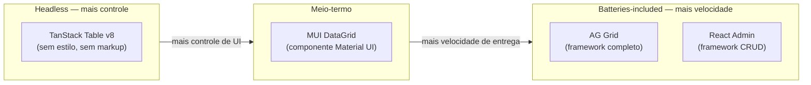
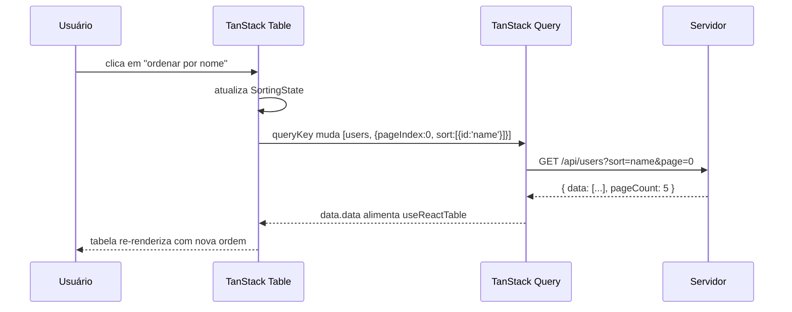

> [!abstract]
> TanStack Table é a solução headless para tabelas complexas no React: você traz o markup, ela traz a lógica de sort, filter, paginação e virtualização.

## O problema das tabelas complexas

Uma tabela parece simples. Linhas, colunas, células — um `<table>` com um `map()` e pronto. Essa impressão dura até o primeiro sprint em que o product manager pede ordenação por múltiplas colunas, filtro por campo, paginação server-side, seleção múltipla com checkbox, linhas expansíveis e virtualização para 50 mil registros.

De repente o componente `<DataTable>` artesanal tem 800 linhas, aceita 30 props e ainda quebra quando o usuário ordena e filtra ao mesmo tempo. Tabelas são um dos domínios onde a complexidade de comportamento supera em muito a complexidade visual — o usuário vê uma grade, o desenvolvedor mantém um mini-banco de dados em memória com índices, cursores e estados aninhados.

É exatamente aí que entra a TanStack Table. Ela não renderiza nada. Não impõe nenhum `<div>` ou classe CSS. O que ela faz é gerir o estado e a lógica de uma tabela — sorting, filtering, pagination, grouping, selection, expansion — e expor esse estado via hooks para você conectar ao markup que quiser.

> [!info]
> A filosofia headless que guia a TanStack Table é a mesma discutida na [[03-Dominios/Tecnologia/React/Ecossistema/03 - Component libraries e design systems|Nota 03 — Component libraries]]: separar lógica de apresentação, deixando o controle de UI inteiramente nas suas mãos.

## Headless vs batteries-included

Antes de mergulhar na API, vale mapear o terreno. Não existe biblioteca "melhor" — existe biblioteca certa para o contexto.



| Critério | TanStack Table | MUI DataGrid | AG Grid | React Admin |
|---|---|---|---|---|
| Controle de markup | Total | Parcial | Limitado | Muito limitado |
| Performance (linhas) | Alta (+ virtual) | Média | Muito alta | Média |
| Curva de aprendizado | Média | Baixa | Alta | Baixa |
| Custo | Gratuito | Free/Pro | Free/Enterprise | Gratuito |
| Quando usar | UI próprio, performance, design system | Já usa MUI, prazo curto | Dados massivos, Excel-like | Admin panel interno rápido |

A TanStack Table é a escolha certa quando você tem um design system próprio, precisa de performance previsível e quer controle total sobre cada pixel. Quando o prazo é curto e a UI pode ser genérica, AG Grid Enterprise ou MUI DataGrid aceleram a entrega.

## TanStack Table v8 — core concepts

A TanStack Table (v8, também chamada de `@tanstack/react-table`) é construída em torno de um único hook: `useReactTable`. Você passa dados, definições de colunas e um conjunto de funções que compõem o comportamento desejado. Ela retorna um objeto `table` com métodos para renderizar headers, linhas e células.

```typescript
import {
  useReactTable,
  getCoreRowModel,
  type ColumnDef,
} from '@tanstack/react-table'

type User = {
  id: string
  name: string
  email: string
  role: 'admin' | 'editor' | 'viewer'
  status: 'active' | 'inactive'
}

const columns: ColumnDef<User>[] = [
  {
    accessorKey: 'name',       // lê user.name diretamente
    header: 'Name',
  },
  {
    accessorKey: 'email',
    header: 'Email',
  },
  {
    accessorFn: (row) => row.role.toUpperCase(), // transformação no acesso
    id: 'role',
    header: 'Role',
  },
  {
    accessorKey: 'status',
    header: 'Status',
    cell: ({ getValue }) => (
      <span className={getValue() === 'active' ? 'text-green-600' : 'text-gray-400'}>
        {getValue<string>()}
      </span>
    ),
  },
]

function UserTable({ data }: { data: User[] }) {
  const table = useReactTable({
    data,
    columns,
    getCoreRowModel: getCoreRowModel(),
  })

  return (
    <table>
      <thead>
        {table.getHeaderGroups().map((headerGroup) => (
          <tr key={headerGroup.id}>
            {headerGroup.headers.map((header) => (
              <th key={header.id}>
                {flexRender(header.column.columnDef.header, header.getContext())}
              </th>
            ))}
          </tr>
        ))}
      </thead>
      <tbody>
        {table.getRowModel().rows.map((row) => (
          <tr key={row.id}>
            {row.getVisibleCells().map((cell) => (
              <td key={cell.id}>
                {flexRender(cell.column.columnDef.cell, cell.getContext())}
              </td>
            ))}
          </tr>
        ))}
      </tbody>
    </table>
  )
}
```

Três conceitos centrais aqui. O `ColumnDef<TData>` descreve como acessar e renderizar uma coluna: `accessorKey` é um atalho para campos simples, `accessorFn` permite transformações arbitrárias (quando você usa essa forma, precisa de `id` manual). O `getCoreRowModel()` é o row model base — sem ele não há linha alguma. E o `flexRender` é um utilitário que sabe renderizar tanto funções React quanto strings como header/cell.

## Sorting

Adicionar ordenação é uma questão de compor mais um row model e gerir o estado de sorting:

```typescript
import {
  useReactTable,
  getCoreRowModel,
  getSortedRowModel,
  type SortingState,
  type ColumnDef,
} from '@tanstack/react-table'
import { useState } from 'react'

function SortableUserTable({ data }: { data: User[] }) {
  const [sorting, setSorting] = useState<SortingState>([])

  const table = useReactTable({
    data,
    columns,
    state: { sorting },
    onSortingChange: setSorting,
    getCoreRowModel: getCoreRowModel(),
    getSortedRowModel: getSortedRowModel(),
  })

  return (
    <table>
      <thead>
        {table.getHeaderGroups().map((headerGroup) => (
          <tr key={headerGroup.id}>
            {headerGroup.headers.map((header) => (
              <th
                key={header.id}
                onClick={header.column.getToggleSortingHandler()}
                style={{ cursor: header.column.getCanSort() ? 'pointer' : 'default' }}
              >
                {flexRender(header.column.columnDef.header, header.getContext())}
                {header.column.getIsSorted() === 'asc' ? ' ↑' : ''}
                {header.column.getIsSorted() === 'desc' ? ' ↓' : ''}
              </th>
            ))}
          </tr>
        ))}
      </thead>
      {/* tbody igual ao exemplo anterior */}
    </table>
  )
}
```

O `SortingState` é um array de `{ id: string; desc: boolean }`. Isso permite ordenação por múltiplos campos simultaneamente — o usuário segura Shift e clica em outra coluna. A TanStack Table empilha os critérios. O controle é feito via `state + onSortingChange`, o padrão controlled component do React.

## Filtering

O filtering segue a mesma filosofia: um row model extra e estado declarado:

```typescript
import {
  getFilteredRowModel,
  type ColumnFiltersState,
} from '@tanstack/react-table'

function FilterableUserTable({ data }: { data: User[] }) {
  const [columnFilters, setColumnFilters] = useState<ColumnFiltersState>([])
  const [globalFilter, setGlobalFilter] = useState('')

  const table = useReactTable({
    data,
    columns,
    state: { columnFilters, globalFilter },
    onColumnFiltersChange: setColumnFilters,
    onGlobalFilterChange: setGlobalFilter,
    getCoreRowModel: getCoreRowModel(),
    getFilteredRowModel: getFilteredRowModel(),
  })

  return (
    <>
      <input
        placeholder="Busca global..."
        value={globalFilter}
        onChange={(e) => setGlobalFilter(e.target.value)}
      />
      <table>
        {/* headers e rows como antes */}
      </table>
    </>
  )
}
```

O `ColumnFiltersState` é um array de `{ id: string; value: unknown }`. Cada coluna pode ter seu próprio filtro independente — útil para tabelas com filtros por coluna visíveis abaixo do header. O `globalFilter` percorre todas as colunas ao mesmo tempo, ideal para uma caixa de busca global.

## Paginação

A paginação segue o mesmo padrão compositivo:

```typescript
import {
  getPaginationRowModel,
  type PaginationState,
} from '@tanstack/react-table'

function PaginatedUserTable({ data }: { data: User[] }) {
  const [pagination, setPagination] = useState<PaginationState>({
    pageIndex: 0,   // começa em 0, não 1
    pageSize: 10,
  })

  const table = useReactTable({
    data,
    columns,
    state: { pagination },
    onPaginationChange: setPagination,
    getCoreRowModel: getCoreRowModel(),
    getPaginationRowModel: getPaginationRowModel(),
  })

  return (
    <>
      <table>{/* ... */}</table>
      <div>
        <button
          onClick={() => table.previousPage()}
          disabled={!table.getCanPreviousPage()}
        >
          Anterior
        </button>
        <span>
          Página {table.getState().pagination.pageIndex + 1} de {table.getPageCount()}
        </span>
        <button
          onClick={() => table.nextPage()}
          disabled={!table.getCanNextPage()}
        >
          Próxima
        </button>
      </div>
    </>
  )
}
```

Na paginação client-side, todos os dados já estão em memória — `getPaginationRowModel()` fatia o array. Isso funciona bem até alguns milhares de registros. A partir de um certo volume, você precisa buscar só a página atual no servidor.

## Server-side: o padrão completo

Em produção, o caso mais comum é buscar dados do servidor conforme o usuário navega, filtra e ordena. A TanStack Table não busca dados — ela é agnóstica a isso. O padrão é combinar com a [[03-Dominios/Tecnologia/React/Ecossistema/04 - TanStack Query I - queries, cache e invalidação|Nota 04 — TanStack Query I]] para a busca e deixar a tabela no modo manual:

```typescript
import { useQuery } from '@tanstack/react-query'

type UsersResponse = {
  data: User[]
  total: number
  pageCount: number
}

function ServerSideUserTable() {
  const [pagination, setPagination] = useState<PaginationState>({
    pageIndex: 0,
    pageSize: 10,
  })
  const [sorting, setSorting] = useState<SortingState>([])
  const [columnFilters, setColumnFilters] = useState<ColumnFiltersState>([])

  const { data, isLoading } = useQuery<UsersResponse>({
    queryKey: ['users', pagination, sorting, columnFilters],
    queryFn: () => fetchUsers({ pagination, sorting, columnFilters }),
  })

  const table = useReactTable({
    data: data?.data ?? [],
    columns,
    pageCount: data?.pageCount ?? -1,   // -1 = desconhecido
    state: { pagination, sorting, columnFilters },
    onPaginationChange: setPagination,
    onSortingChange: setSorting,
    onColumnFiltersChange: setColumnFilters,
    manualPagination: true,   // desliga getPaginationRowModel
    manualSorting: true,      // desliga getSortedRowModel
    manualFiltering: true,    // desliga getFilteredRowModel
    getCoreRowModel: getCoreRowModel(),
  })

  if (isLoading) return <Skeleton />

  return <table>{/* ... */}</table>
}
```

O fluxo é deliberado e previsível:



A chave é que `queryKey` inclui `[pagination, sorting, columnFilters]`. Toda vez que o estado da tabela muda, o `useQuery` percebe a mudança de chave e busca novamente. O cache do TanStack Query garante que navegar para uma página já visitada não dispara nova requisição.

## Virtualização

Para tabelas com dezenas de milhares de linhas, renderizar todos os `<tr>` no DOM é inviável — o browser trava ao fazer scroll. A solução é renderizar apenas as linhas visíveis na viewport, substituindo as demais por espaço em branco.

A TanStack Table se integra nativamente com `@tanstack/react-virtual`:

```typescript
import { useVirtualizer } from '@tanstack/react-virtual'
import { useRef } from 'react'

function VirtualizedUserTable({ data }: { data: User[] }) {
  const table = useReactTable({
    data,
    columns,
    getCoreRowModel: getCoreRowModel(),
  })

  const rows = table.getRowModel().rows
  const parentRef = useRef<HTMLDivElement>(null)

  const virtualizer = useVirtualizer({
    count: rows.length,
    getScrollElement: () => parentRef.current,
    estimateSize: () => 40,   // altura estimada de cada linha em px
    overscan: 10,             // linhas extras acima/abaixo da viewport
  })

  return (
    <div ref={parentRef} style={{ height: '600px', overflowY: 'auto' }}>
      <table>
        <thead>{/* headers normais */}</thead>
        <tbody
          style={{ height: `${virtualizer.getTotalSize()}px`, position: 'relative' }}
        >
          {virtualizer.getVirtualItems().map((virtualRow) => {
            const row = rows[virtualRow.index]
            return (
              <tr
                key={row.id}
                style={{
                  position: 'absolute',
                  top: 0,
                  transform: `translateY(${virtualRow.start}px)`,
                  height: `${virtualRow.size}px`,
                }}
              >
                {row.getVisibleCells().map((cell) => (
                  <td key={cell.id}>
                    {flexRender(cell.column.columnDef.cell, cell.getContext())}
                  </td>
                ))}
              </tr>
            )
          })}
        </tbody>
      </table>
    </div>
  )
}
```

O `useVirtualizer` rastreia o scroll e calcula quais índices estão visíveis. O `tbody` recebe altura total absoluta para que a scrollbar reflita o tamanho real. Cada linha usa `position: absolute` e `translateY` para aparecer na posição correta. O resultado: 10k linhas com scroll suave, porque o DOM tem apenas ~20 `<tr>` a qualquer momento.

## React Admin — menção honesta

Enquanto a TanStack Table é uma primitiva — você monta o que quiser com ela —, o React Admin é um framework completo de nível acima. Ele fornece componentes prontos de listagem, edição, criação e visualização, além de data providers para conectar qualquer API (REST, GraphQL, Firebase) e autenticação integrada.

Quando o React Admin faz sentido: você precisa montar um painel administrativo interno rapidamente, o time é pequeno, a UI pode ser genérica e a prioridade é funcionalidade. Em 2-3 dias você tem um CRUD completo com paginação, filtros e edição inline sem escrever uma linha de tabela manualmente.

Quando não faz sentido: o design system da empresa impõe um visual que nenhum tema do React Admin consegue replicar sem sobreescrever 80% dos estilos; a performance é crítica e você precisa controlar exatamente o que entra no DOM; ou o time prefere ter controle total sem surpresas do framework.

Esta nota foca na TanStack Table porque ela é a primitiva — a peça que você pode encaixar em qualquer contexto. O React Admin, internamente, usa seu próprio DataGrid ou integra com bibliotecas externas via adapter; não é algo que você combine diretamente com a TanStack Table no mesmo componente.

## Armadilhas comuns

> [!warning]
> **`columns` sem `useMemo` — a armadilha clássica de performance**
> Declarar o array de `ColumnDef` dentro do corpo do componente sem `useMemo` faz com que um novo array seja criado a cada render. A TanStack Table detecta a mudança de referência e recalcula toda a estrutura interna. Use sempre `const columns = useMemo<ColumnDef<TData>[]>(() => [...], [])`.

> [!warning]
> **`getRowModel()` vs `getCoreRowModel()` — confundir o row model retornado**
> `table.getCoreRowModel().rows` retorna as linhas brutas, sem aplicar sorting, filtering nem paginação. `table.getRowModel().rows` retorna as linhas após todos os row models compostos. Se você renderizar o core diretamente, filtros e ordenação simplesmente não aparecem — e o bug é difícil de ver porque os dados ainda aparecem na tela.

> [!warning]
> **`pageIndex` começa em 0, não 1**
> O estado interno de paginação usa índice base-zero. Exibir `pagination.pageIndex` diretamente mostra "0" quando o usuário está na primeira página. A exibição correta é sempre `pageIndex + 1`. Esse bug aparece em entrevistas e em code reviews com frequência.

> [!warning]
> **`manualPagination: true` sem `pageCount` correto**
> No modo server-side, a TanStack Table não sabe quantas páginas existem a menos que você informe via `pageCount`. Deixar `pageCount: -1` (desconhecido) ou informar um valor desatualizado faz com que `getCanNextPage()` retorne resultados errados e o botão de "próxima" apareça quando não há mais dados — ou desapareça cedo demais.

## Como explicar em inglês

| Português | Inglês |
|---|---|
| tabela de dados | data table / data grid |
| headless | headless (no built-in rendering) |
| ordenação | sorting |
| filtro por coluna | column filter |
| filtro global | global filter |
| paginação controlada | controlled pagination |
| paginação no servidor | server-side pagination |
| virtualização de linhas | row virtualization |
| definição de coluna | column definition |
| modelo de linha | row model |

Em entrevistas, a pergunta clássica é *"How would you implement a sortable, filterable data table in React?"*. A resposta madura menciona a separação entre lógica de tabela (TanStack Table), busca de dados (TanStack Query ou SWR) e renderização (seu próprio markup). Isso demonstra que você conhece as camadas do problema, não só a solução pontual.

## O que vem a seguir

A nota 09 fechou o ciclo de gerenciamento de estado com [[03-Dominios/Tecnologia/React/Ecossistema/09 - Estado avançado - Jotai, atoms e signals|Nota 09 — Jotai]], atoms e signals. A nota 11 abrirá o domínio de visualização de dados — gráficos, charts e dashboards com bibliotecas como Recharts e Victory. Se tabelas são sobre estruturar e navegar dados tabulares, charts são sobre comunicar padrões e tendências de forma visual. O próximo passo natural depois de dominar a TanStack Table.
