# 11 — Data visualization: escolhendo libs de gráficos

> [!abstract] TL;DR
> A escolha da lib de gráficos no React depende de uma tensão tripla: **controle** (o quanto você precisa customizar), **velocidade** (time-to-chart no sprint) e **modelo de dados/volume** (SVG aguenta até ~5 k pontos; Canvas aguenta centenas de milhares). Recharts é o padrão de fato para dashboards de negócios, mas cada categoria de lib existe por um motivo concreto.

---

## O problema

Gráficos parecem simples — barras, linhas, pizza. Você joga os dados, aparece o gráfico. Em protótipos, funciona assim. Em produção, aparecem as tensões reais:

- **Declarativo vs. imperativo**: você quer descrever "uma linha azul para receita e uma vermelha para custo" ou escrever loops de D3 que calculam posições manualmente?
- **SVG vs. Canvas**: afeta performance, acessibilidade e como você implementa interatividade.
- **Customização vs. time-to-chart**: a lib que entrega em 10 minutos raramente deixa você mudar o tooltip ou o eixo do jeito que o design pediu.
- **Bundle size**: uma lib de gráficos rica pode adicionar 200–300 kb ao bundle.
- **Animações e responsividade**: gráfico que não reage ao resize do contêiner ou que pisca feio na animação de entrada afasta usuários.
- **Tooltips acessíveis**: `<svg>` sem semântica não é lido por screen readers; pouquíssimas libs resolvem isso de graça.

A sub-área [[03-Dominios/Tecnologia/React/Charts/index|Charts]] contém deep-dives por biblioteca — Recharts, ApexCharts e Lightweight Charts — com exemplos avançados e comparações detalhadas. Esta nota cobre a camada acima: como escolher, quando migrar e por que cada categoria existe.

---

## SVG vs. Canvas — a decisão que organiza tudo

Antes de comparar bibliotecas, é preciso entender a divisão fundamental de renderização. A analogia ajuda:

```mermaid
flowchart LR
    subgraph SVG["SVG — baseado em DOM"]
        direction TB
        S1["Cada elemento é um nó do DOM"]
        S2["Hover/click nativo"]
        S3["Acessível por padrão (com aria)"]
        S4["Limite ~1 k–5 k pontos antes de lentidão"]
    end

    subgraph Canvas["Canvas — baseado em pixels"]
        direction TB
        C1["Renderização como bitmap"]
        C2["Interatividade manual (hitbox math)"]
        C3["Acessibilidade manual"]
        C4["100 k+ pontos sem problemas"]
    end

    Decision{"Qual usar?"}

    SVG --> Decision
    Canvas --> Decision

    Decision -->|"Dashboards de negócio\n< 10 k pontos\ndesign customizado"| SVG
    Decision -->|"Trading / realtime\nbig data / telemetria\ncandlestick"| Canvas
```

> SVG é como HTML — cada elemento do gráfico (`<line>`, `<rect>`, `<path>`) vira um nó no DOM. Você pode inspecionar no DevTools, aplicar CSS, dar hover nativo, usar `aria-label`. Canvas é como uma foto — o browser vê apenas pixels. Você tem que calcular tudo: onde o mouse está, o que está sob o cursor, como desenhar o tooltip.



A maior parte dos dashboards corporativos vive confortavelmente no SVG — datasets de dezenas a alguns milhares de linhas, necessidade de tooltips ricos, botões de filtro integrados ao gráfico. Canvas vira necessário quando os dados chegam em fluxo contínuo ou quando você plota séries temporais densas (sensor IoT, candlestick financeiro a cada tick).

---

## O landscape em 2026

As bibliotecas se organizam em seis categorias. Conhecer cada uma elimina a busca por "a melhor lib de gráficos React" — essa pergunta não tem resposta sem contexto.

### Declarativa/SVG — Recharts

Recharts transforma gráficos em componentes React. Você compõe `<LineChart>`, `<XAxis>`, `<Tooltip>` como se fossem divs. É a lib mais popular no ecossistema React, e provavelmente a que aparece em entrevistas.

- Bundle: ~150 kb
- Pontos de força: curva baixíssima, composição declarativa, responsividade via `<ResponsiveContainer>`
- Limite: começa a engasgar com 10 k+ pontos por série; customizações profundas exigem `content` props com componentes customizados

### Flexível/SVG — Victory e Nivo

Victory (da Formidable) prioriza composabilidade — você monta gráficos combinando primitivos de forma mais livre que o Recharts. Nivo prioriza variedade: +35 tipos de gráfico, suporte a SVG e HTML canvas, e uma interface de configuração via props muito rica.

- Nivo é a escolha quando o design system exige gráficos que o Recharts não tem (heatmaps, chord diagrams, treemaps) ou quando o visual precisa de mais controle que o Recharts oferece com suas props.

### Baixo nível/SVG — visx e D3 puro

visx (da Airbnb) é D3 empacotado em hooks React sem opinar em estilo visual. Você usa `useScale`, `useTooltip`, `useDrag` e monta o SVG você mesmo. Bundle mínimo porque é tree-shakeable por módulo.

D3 puro, sem wrapper, também funciona em React — mas integrar D3 (que muta o DOM diretamente) com o VDOM do React exige isolamento via `useRef` + `useEffect`. visx elimina esse atrito mantendo o poder de D3.

Use visx quando: o design é proprietário (o cliente não quer nada que "pareça Recharts"), a visualização não se encaixa em tipos padrão, ou a equipe já tem fluência em D3.

### Canvas/performance — Chart.js e ApexCharts

Chart.js é a lib de gráficos mais baixada do npm (não só React). O wrapper `react-chartjs-2` integra ao ciclo de vida do React. Bom equilíbrio entre facilidade e performance para datasets médio-grandes.

[[03-Dominios/Tecnologia/React/Charts/ApexCharts|ApexCharts]] entrega animações mais ricas e uma UI mais polida out-of-the-box. Bundle maior (~300 kb), mas economiza horas de customização de visual quando o design quer sparklines, gauge charts e heatmaps prontos.

### Especializada — Lightweight Charts (TradingView)

[[03-Dominios/Tecnologia/React/Charts/Lightweight Charts|Lightweight Charts]] é uma categoria de uma — feita exclusivamente para gráficos financeiros: candlestick, OHLC, volume, tempo real via WebSocket. Canvas, ~40 kb, e performance excepcional para séries temporais densas. Se o produto não é fintech, provavelmente não é a lib certa.

### Dashboard kit — Tremor

Tremor embrulha Recharts + Tailwind em componentes de alto nível (`<AreaChart>`, `<BarList>`, `<DonutChart>`). Máxima velocidade de entrega para admin panels. O trade-off é óbvio: o que o Tremor não suporta, você tem que fazer bypass para o Recharts subjacente — e aí você está em dois mundos ao mesmo tempo.

> [!info] E o D3?
> D3.js não é um wrapper de gráficos — é uma biblioteca de manipulação de dados ligada a SVG. Ele calcula projeções cartográficas, layouts de força, escalas logarítmicas e geometrias de Voronoi. Libs como Recharts, Nivo e visx usam D3 internamente para cálculos. A questão não é "usar D3 ou Recharts" — é "usar D3 através de uma abstração ou diretamente". Para a maioria dos projetos, a abstração é a escolha certa.

---

## Tabela de decisão

| Lib | Renderização | Controle | Performance | Bundle | Quando usar |
|---|---|---|---|---|---|
| **Recharts** | SVG | Alto | Médio | ~150 kb | Dashboards de negócio, padrão de fato |
| **Nivo** | SVG | Muito alto | Médio | ~200 kb+ (por módulo) | Design complexo, +35 tipos de gráfico |
| **visx/D3** | SVG | Total | Alto | Mínimo (tree-shakeable) | Design proprietário, visualizações customizadas |
| **Chart.js** | Canvas | Médio | Alto | ~90 kb | Grandes datasets, uso simples |
| **ApexCharts** | Canvas | Alto | Alto | ~300 kb | Dashboards ricos, animações elaboradas |
| **Lightweight Charts** | Canvas | Baixo | Muito alto | ~40 kb | Gráficos financeiros/OHLC/candlestick |
| **Tremor** | SVG (Recharts) | Baixo | Médio | + Recharts | Admin rápido com Tailwind |

---

## Recharts — o padrão de fato

Recharts merece atenção especial porque é a lib que aparece em entrevistas, projetos open-source e code challenges com mais frequência. O modelo mental é: você descreve a estrutura do gráfico com componentes e passa os dados como props.

```tsx
import {
  ResponsiveContainer,
  LineChart,
  Line,
  XAxis,
  YAxis,
  CartesianGrid,
  Tooltip,
  Legend,
} from 'recharts'

type DataPoint = {
  month: string
  revenue: number
  cost: number
}

const data: DataPoint[] = [
  { month: 'Jan', revenue: 4000, cost: 2400 },
  { month: 'Fev', revenue: 3000, cost: 1398 },
  { month: 'Mar', revenue: 5000, cost: 2800 },
  { month: 'Abr', revenue: 4500, cost: 3200 },
  { month: 'Mai', revenue: 6000, cost: 2900 },
  { month: 'Jun', revenue: 5500, cost: 3100 },
]

export function RevenueChart() {
  return (
    <ResponsiveContainer width="100%" height={300}>
      <LineChart data={data} margin={{ top: 5, right: 30, left: 20, bottom: 5 }}>
        <CartesianGrid strokeDasharray="3 3" />
        <XAxis dataKey="month" />
        <YAxis />
        <Tooltip />
        <Legend />
        <Line
          type="monotone"
          dataKey="revenue"
          stroke="#6366f1"
          strokeWidth={2}
          dot={false}
        />
        <Line
          type="monotone"
          dataKey="cost"
          stroke="#f43f5e"
          strokeWidth={2}
          dot={false}
        />
      </LineChart>
    </ResponsiveContainer>
  )
}
```

Pontos que costumam aparecer em entrevistas: `<ResponsiveContainer>` como wrapper obrigatório, `dataKey` vinculando o campo do objeto ao eixo/série, `type="monotone"` para curva suave. Quando o design mistura barras e linhas no mesmo gráfico, substitua `<LineChart>` por `<ComposedChart>` e adicione `<Bar dataKey="cost" />` ao lado do `<Line>`.

---

## Recharts customizado — além do básico

Os defaults do Recharts atendem 80% dos casos. Os outros 20% exigem saber onde plugar customização.

### Tooltip customizado

O tooltip padrão mostra os valores brutos. Quando você quer formatar como moeda, adicionar ícones ou agrupar múltiplas métricas:

```tsx
type CustomTooltipProps = {
  active?: boolean
  payload?: Array<{ name: string; value: number; color: string }>
  label?: string
}

function CustomTooltip({ active, payload, label }: CustomTooltipProps) {
  if (!active || !payload?.length) return null

  return (
    <div className="rounded-lg border bg-white p-3 shadow-lg">
      <p className="mb-1 font-semibold text-gray-700">{label}</p>
      {payload.map((entry) => (
        <p key={entry.name} style={{ color: entry.color }} className="text-sm">
          {entry.name}: {new Intl.NumberFormat('pt-BR', { style: 'currency', currency: 'BRL' }).format(entry.value)}
        </p>
      ))}
    </div>
  )
}

// No componente pai:
<Tooltip content={<CustomTooltip />} />
```

### Formatação de eixos

```tsx
<XAxis
  dataKey="date"
  tickFormatter={(value: string) => format(new Date(value), 'dd/MM')}
/>
<YAxis
  tickFormatter={(value: number) =>
    new Intl.NumberFormat('pt-BR', { notation: 'compact' }).format(value)
  }
/>
```

### Referência cruzada ao sinalizador do tipo

Recharts é fortemente tipado desde a v2. Um ponto de atenção frequente: o tipo de `payload` no tooltip customizado não é exportado diretamente com nome intuitivo. A forma segura é importar `TooltipProps` do `recharts`:

```tsx
import type { TooltipProps } from 'recharts'
import type { ValueType, NameType } from 'recharts/types/component/DefaultTooltipContent'

function CustomTooltip({ active, payload, label }: TooltipProps<ValueType, NameType>) {
  // ...
}
```

Isso evita o `any` implícito que aparece em tutoriais antigos.

### Quando o Recharts começa a frustrar

O sinal de migração para visx ou D3 é quando você se encontra lutando contra a lib: precisando fazer override de comportamentos internos, adicionando `ref` hacky para acessar o SVG nativo, ou construindo animações que o Recharts não suporta via props. Nesse ponto, o custo de personalização supera o benefício da abstração.

O outro sinal é volume de dados: se cada série tem mais de 5 k–10 k pontos e o scroll do gráfico começa a travar, é hora de migrar para Canvas (Chart.js, ApexCharts ou Lightweight Charts). O Recharts não tem virtualização de pontos — ele renderiza cada `<circle>` e `<path>` no DOM, e o browser começa a engasgar.

---

## O padrão de dados → gráfico

Dados do servidor raramente chegam no formato que a lib espera. A sequência padrão tem três etapas fixas:

```
Buscar dados → Transformar → Renderizar
```

A transformação deve ficar em `useMemo` — não inline no JSX — para evitar recriar o array a cada render.

```tsx
import { useMemo } from 'react'
import { format } from 'date-fns'
import { useQuery } from '@tanstack/react-query'

type ApiRevenue = {
  date: string       // ISO string do servidor
  revenue: number
  cost: number
}

type ChartPoint = {
  month: string      // formato que o Recharts vai exibir
  revenue: number
  cost: number
}

export function RevenueChartContainer() {
  const { data: apiData } = useQuery<ApiRevenue[]>({
    queryKey: ['revenue'],
    queryFn: () => fetch('/api/revenue').then((r) => r.json()),
  })

  // Transformação isolada no useMemo
  const chartData = useMemo<ChartPoint[]>(
    () =>
      (apiData ?? []).map((d) => ({
        month: format(new Date(d.date), 'MMM yyyy'),
        revenue: d.revenue,
        cost: d.cost,
      })),
    [apiData],
  )

  return <RevenueChart data={chartData} />
}
```

> [!info] TanStack Query + gráficos
> O padrão de busca + transformação acima depende de TanStack Query para gerenciar cache, loading e erro. O detalhe de `useQuery` com `queryKey` e `queryFn` está em [[03-Dominios/Tecnologia/React/Ecossistema/04 - TanStack Query I - queries, cache e invalidação|Nota 04 — TanStack Query I]].

A separação entre o componente de container (que busca e transforma) e o de apresentação (que só recebe `data: ChartPoint[]`) também facilita testes: você pode renderizar o `<RevenueChart>` com dados mockados sem nenhuma dependência de rede.

### Estados de loading e erro

Gráficos têm um estado extra que tabelas não têm: o esqueleto animado precisa ter a mesma proporção do gráfico real para não causar layout shift. O padrão recomendado:

```tsx
export function RevenueChartContainer() {
  const { data: apiData, isLoading, isError } = useQuery<ApiRevenue[]>({
    queryKey: ['revenue'],
    queryFn: () => fetch('/api/revenue').then((r) => r.json()),
  })

  if (isLoading) {
    return (
      <div className="h-[300px] animate-pulse rounded-lg bg-gray-100" />
    )
  }

  if (isError) {
    return (
      <div className="flex h-[300px] items-center justify-center text-sm text-gray-500">
        Não foi possível carregar os dados do gráfico.
      </div>
    )
  }

  const chartData = (apiData ?? []).map((d) => ({
    month: format(new Date(d.date), 'MMM yyyy'),
    revenue: d.revenue,
    cost: d.cost,
  }))

  return <RevenueChart data={chartData} />
}
```

O `animate-pulse` com `h-[300px]` garante que o espaço reservado tenha a mesma altura do `<ResponsiveContainer height={300}>` que vai aparecer depois, evitando o salto visual.

---

## Armadilhas comuns

> [!warning] Esquecer o `<ResponsiveContainer>`
> Recharts, por padrão, exige `width` e `height` explícitos no `<LineChart>`. Se você passar `width="100%"` diretamente no chart (não no container), o gráfico não renderiza. A solução canônica é sempre envoltar em `<ResponsiveContainer width="100%" height={300}>`. Sem isso, o gráfico ignora o layout pai e colapsa ou transborda.

> [!warning] Transformar dados sem `useMemo`
> Colocar `data={apiData.map(transform)}` diretamente no JSX recria um array novo a cada render do componente pai. O Recharts interpreta isso como dados novos, re-executa cálculos internos e pode causar flash visual ou degradação de performance. Use `useMemo` com as dependências corretas.

> [!warning] Bundle size e tree-shaking
> Recharts **não** tem tree-shaking real — importar `import { LineChart } from 'recharts'` carrega o bundle inteiro (~150 kb). Isso é diferente de libs como visx (cada hook/módulo é separado) ou Chart.js (v3+ com tree-shaking). Antes de adotar uma lib, cheque a documentação de bundling para entender o impacto real no seu build.

> [!warning] Acessibilidade ignorada
> `<svg>` sem `role="img"` e `<title>` não é anunciado por screen readers. Recharts não injeta isso automaticamente. Para projetos com requisitos de acessibilidade (WCAG 2.1 AA), adicione manualmente:
> ```tsx
> <LineChart ...>
>   {/* dentro do SVG gerado pelo Recharts */}
>   <title>Receita e custo mensal — 2024</title>
>   ...
> </LineChart>
> ```
> Ou considere uma lib que trate acessibilidade como first-class (Nivo tem suporte melhor).

---

## Padrão de componente de gráfico reutilizável

Em projetos maiores, repetir `<ResponsiveContainer>` + importações do Recharts em cada dashboard é ruído. O padrão é criar um componente wrapper que encapsula as opções comuns e aceita apenas os dados e a configuração de séries:

```tsx
import {
  ResponsiveContainer,
  LineChart,
  Line,
  XAxis,
  YAxis,
  CartesianGrid,
  Tooltip,
  Legend,
} from 'recharts'

type Series = {
  dataKey: string
  color: string
  label: string
}

type LineChartCardProps<T extends Record<string, unknown>> = {
  data: T[]
  xDataKey: keyof T & string
  series: Series[]
  height?: number
}

export function LineChartCard<T extends Record<string, unknown>>({
  data,
  xDataKey,
  series,
  height = 300,
}: LineChartCardProps<T>) {
  return (
    <ResponsiveContainer width="100%" height={height}>
      <LineChart data={data} margin={{ top: 5, right: 30, left: 20, bottom: 5 }}>
        <CartesianGrid strokeDasharray="3 3" stroke="#f0f0f0" />
        <XAxis dataKey={xDataKey} tick={{ fontSize: 12 }} />
        <YAxis tick={{ fontSize: 12 }} />
        <Tooltip />
        <Legend />
        {series.map((s) => (
          <Line
            key={s.dataKey}
            type="monotone"
            dataKey={s.dataKey}
            name={s.label}
            stroke={s.color}
            strokeWidth={2}
            dot={false}
          />
        ))}
      </LineChart>
    </ResponsiveContainer>
  )
}
```

Uso:

```tsx
<LineChartCard
  data={chartData}
  xDataKey="month"
  series={[
    { dataKey: 'revenue', color: '#6366f1', label: 'Receita' },
    { dataKey: 'cost', color: '#f43f5e', label: 'Custo' },
  ]}
/>
```

Este padrão mantém o TypeScript satisfeito com o genérico `T`, permite adicionar novas séries sem tocar no componente de apresentação, e centraliza as opções visuais padrão (grid, fontSize, strokeWidth, dot desligado) em um único lugar.

---

## Como explicar em inglês

Em entrevistas internacionais, a conversa sobre gráficos usa vocabulário específico. Mapear os termos evita bloqueios no meio da explicação.

| Português | Inglês |
|---|---|
| gráfico | chart / graph |
| dados em série | series data |
| renderização SVG | SVG rendering |
| renderização Canvas | Canvas rendering |
| tooltip | tooltip |
| eixo X / eixo Y | X-axis / Y-axis |
| legenda | legend |
| gráfico de linhas | line chart |
| gráfico de barras | bar chart |
| transformação de dados | data transformation |
| gráfico de pizza | pie chart / donut chart |
| ponto de dados | data point |

Exemplo de resposta em entrevista:

> "For this dashboard, I'd go with Recharts because it gives us a declarative API that fits naturally with React's component model. The data volume is in the thousands of rows range, so SVG rendering is fine. We can use `<ResponsiveContainer>` for responsive layouts and plug in custom tooltip components when the default styling doesn't match the design system."

---

## O que vem a seguir

A nota 12 do galho fecha o ciclo do estado no servidor no contexto de Next.js e React Server Components — como TanStack Query se comporta quando parte do fetch acontece no servidor, os padrões de hidratação e o que muda no modelo mental quando `useQuery` convive com `async/await` em Server Components.

Para revisar as tabelas e grids de dados — o padrão complementar à visualização — veja [[03-Dominios/Tecnologia/React/Ecossistema/10 - Tabelas e data grids - TanStack Table|Nota 10 — TanStack Table]].

Para os deep-dives por biblioteca — exemplos avançados de Recharts, ApexCharts e Lightweight Charts — consulte [[03-Dominios/Tecnologia/React/Charts/index|Charts]].
