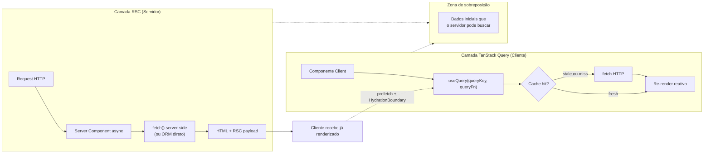
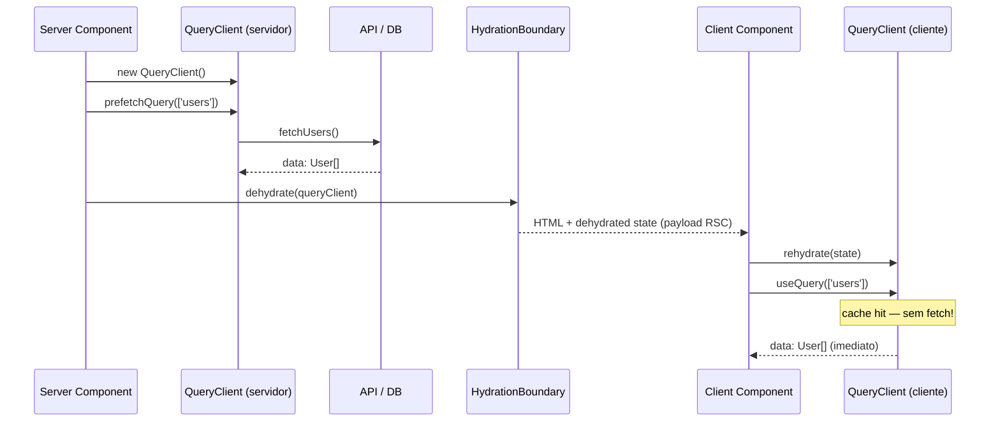

> [!abstract] TL;DR
> RSC resolve o fetch inicial no servidor; TanStack Query continua sendo a escolha certa para estado interativo, mutations e cache no cliente — os dois modelos são complementares, não excludentes.

# TanStack Query no mundo Next e RSC

## O problema — a pergunta que todo dev faz

"Com React Server Components fazendo fetch no servidor, ainda preciso de TanStack Query no cliente?"

Essa pergunta é legítima e aparece em toda entrevista de React em 2025 e 2026. A resposta direta é: **depende do que você está buscando buscar**. RSC e TanStack Query resolvem problemas diferentes, em camadas diferentes — e tentar substituir um pelo outro cria atritos que só aparecem em produção.

Este capítulo responde essa tensão de forma honesta: quando RSC basta, quando TanStack Query ainda é necessário, e como combiná-los no padrão de prefetch com `HydrationBoundary`.

> [!info] Pré-requisitos recomendados
> - [[03-Dominios/Tecnologia/React/Next.js/04 - Server vs Client Components|Next.js 04 — Server vs Client Components]] — diferença fundamental entre RSC e Client Components
> - [[03-Dominios/Tecnologia/React/Next.js/05 - Data fetching no Server|Next.js 05 — Data fetching no Server]] — como o `fetch()` funciona no servidor com Next
> - [[03-Dominios/Tecnologia/React/Ecossistema/04 - TanStack Query I - queries, cache e invalidação|Nota 04 — TanStack Query I]] — fundamentos de `useQuery`, `queryKey` e invalidação

---

## RSC vs Client Cache — o que cada um resolve

Pense assim: o **servidor é o cozinheiro que prepara a refeição antes de servir**; o **TanStack Query é o garçom que reabastece o prato conforme o cliente pede mais**. O cozinheiro pode preparar o prato inicial com eficiência; mas quando o cliente quer ajustes, mais porções, ou ver o cardápio filtrando por ingrediente — é o garçom que entra em cena.

O diagrama abaixo separa os dois fluxos:



**O que só RSC resolve:**
- Fetch que acontece antes de qualquer JavaScript no cliente
- Acesso direto a banco, sistema de arquivos, variáveis de ambiente secretas
- HTML entregue pronto (zero loading state no first paint)
- Componentes que nunca precisam re-renderizar no cliente

**O que só TanStack Query resolve:**
- Interações do usuário que disparam novos fetches (filtros, busca, paginação)
- Mutations com optimistic updates e rollback automático
- Polling: dados que precisam ser frescos em intervalos regulares
- Background refetch quando o usuário retorna à aba (`refetchOnWindowFocus`)
- Cache compartilhado entre vários componentes clientes simultâneos

**A zona de sobreposição:**
- Dados iniciais de uma página — RSC pode buscá-los e injetá-los no QueryClient via prefetch, eliminando o loading state do `useQuery` no primeiro render.

---

## Quando RSC é suficiente

Há casos em que instalar TanStack Query seria over-engineering. Se o seu componente se encaixa em algum destes cenários, RSC basta:

**1. Páginas estáticas ou ISR com dados que não mudam por sessão**

```tsx
// app/catalog/page.tsx (Server Component)
export default async function CatalogPage() {
  // fetch com cache: força-cache — bom para ISR
  const products = await fetch('/api/products', {
    next: { revalidate: 3600 }, // re-fetcha a cada hora
  }).then((r) => r.json())

  return <ProductList products={products} />
}
```

O catálogo de produtos raramente muda. O usuário não filtra (ou filtra via Server Actions / link de navegação). Não há interatividade que justifique um QueryClient no cliente.

**2. Dados de perfil e configuração**

Quando o usuário faz login, o perfil é carregado uma vez e não muda durante a sessão. RSC busca, renderiza, pronto.

**3. Blog posts, documentação, conteúdo editorial**

Texto estático — SSG puro com `generateStaticParams`. TanStack Query não agrega nada aqui.

**Regra de bolso**: se o componente for 100% `async function` sem nenhum `useState`, `useEffect` ou interação do usuário, RSC basta.

---

## Quando TanStack Query ainda é necessário

Este é o coração da nota — as situações onde RSC não chega.

### Interatividade em tempo real

Filtros, busca com debounce, paginação controlada pelo usuário — todos requerem estado client-side que dispara novos fetches. RSC não re-executa a menos que o usuário navegue para uma nova URL.

```tsx
// 'use client'
import { useQuery } from '@tanstack/react-query'
import { useState } from 'react'

export function UserSearch() {
  const [query, setQuery] = useState('')

  const { data, isFetching } = useQuery({
    queryKey: ['users', query],
    queryFn: () => fetchUsers({ search: query }),
    enabled: query.length > 2,
    staleTime: 30_000,
  })

  return (
    <>
      <input value={query} onChange={(e) => setQuery(e.target.value)} />
      {isFetching && <Spinner />}
      <UserList users={data ?? []} />
    </>
  )
}
```

Sem TanStack Query, você precisaria replicar manualmente o debounce, o estado de loading, o cache entre renders e a deduplicação de requisições paralelas.

### Mutations com optimistic updates

RSC não tem `useMutation`. Quando o usuário apaga um item e você quer remover da tela antes da resposta da API, precisar de:

```tsx
const mutation = useMutation({
  mutationFn: (id: string) => deleteUser(id),
  onMutate: async (id) => {
    await queryClient.cancelQueries({ queryKey: ['users'] })
    const previous = queryClient.getQueryData<User[]>(['users'])
    queryClient.setQueryData<User[]>(['users'], (old) =>
      old?.filter((u) => u.id !== id) ?? []
    )
    return { previous }
  },
  onError: (_err, _id, context) => {
    queryClient.setQueryData(['users'], context?.previous)
  },
  onSettled: () => {
    queryClient.invalidateQueries({ queryKey: ['users'] })
  },
})
```

Este padrão — cancelar query, atualizar cache otimisticamente, reverter em erro, invalidar ao final — é nativo no TanStack Query. Replicá-lo com `useState` + `useEffect` é possível, mas doloroso e propenso a race conditions.

> [!info] Aprofundamento
> Veja o padrão completo em [[03-Dominios/Tecnologia/React/Ecossistema/05 - TanStack Query II - mutations e optimistic updates|Nota 05 — TanStack Query II]].

### Background refetch e focus tracking

```tsx
const { data } = useQuery({
  queryKey: ['notifications'],
  queryFn: fetchNotifications,
  refetchOnWindowFocus: true,   // re-fetcha quando usuário volta à aba
  refetchInterval: 30_000,       // polling a cada 30s
})
```

RSC não tem `refetchOnWindowFocus`. Um dashboard de notificações que precisa estar fresco quando o usuário alterna entre abas não pode ser implementado com RSC puro.

### Cache compartilhado entre componentes

Imagine 5 componentes cliente na mesma página, todos precisando dos dados do usuário logado. Com `useQuery({ queryKey: ['me'] })` em cada um, o TanStack Query garante que apenas uma requisição HTTP sairá — o QueryClient deduplica automaticamente. Sem ele, você teria 5 fetches simultâneos ou precisaria de prop drilling / Context manual.

### Polling de dados ao vivo

```tsx
const { data: metrics } = useQuery({
  queryKey: ['dashboard-metrics'],
  queryFn: fetchMetrics,
  refetchInterval: 5_000, // dashboard ao vivo: atualiza a cada 5s
  staleTime: 4_000,
})
```

RSC não tem como fazer polling sem que o usuário recarregue a página.

---

## O padrão de prefetch — a integração ideal

A combinação mais elegante é: **RSC faz o fetch inicial, injeta no QueryClient via prefetch, e o Client Component usa `useQuery` normalmente com dados já hidratados**.

Resultado: zero loading state no primeiro render, mas toda a interatividade do TanStack Query disponível depois.

### Passo 1 — Server Component faz prefetch

```tsx
// app/users/page.tsx (Server Component)
import { dehydrate, HydrationBoundary, QueryClient } from '@tanstack/react-query'
import { fetchUsers } from '@/lib/api'
import { UsersClient } from './users-client'

export default async function UsersPage() {
  // IMPORTANTE: instanciar DENTRO do componente, nunca fora
  const queryClient = new QueryClient()

  await queryClient.prefetchQuery({
    queryKey: ['users'],
    queryFn: fetchUsers,
  })

  return (
    <HydrationBoundary state={dehydrate(queryClient)}>
      <UsersClient />
    </HydrationBoundary>
  )
}
```

### Passo 2 — Client Component usa `useQuery` com tipos explícitos

```tsx
// app/users/users-client.tsx
'use client'

import { useQuery } from '@tanstack/react-query'
import { fetchUsers } from '@/lib/api'
import type { User } from '@/types'

export function UsersClient() {
  const { data: users = [], isLoading, error } = useQuery<User[], Error>({
    queryKey: ['users'],
    queryFn: fetchUsers,
    staleTime: 60_000, // dados chegam hidratados — evita re-fetch imediato
  })

  if (isLoading) return <Skeleton />
  if (error) return <ErrorBanner message={error.message} />

  return (
    <ul>
      {users.map((user) => (
        <li key={user.id}>{user.name}</li>
      ))}
    </ul>
  )
}
```

**Por que `isLoading` nunca fica `true` no primeiro render?**

Porque os dados chegaram hidratados do servidor. O `useQuery` encontra o `queryKey: ['users']` no cache com status `success` — não precisa ir à rede. O `isLoading` só seria `true` se o cache estivesse vazio (o que não acontece com o prefetch).

### Passo 3 — Provider no layout raiz

```tsx
// app/layout.tsx
'use client'

import { QueryClient, QueryClientProvider } from '@tanstack/react-query'
import { useState } from 'react'

export function Providers({ children }: { children: React.ReactNode }) {
  // useState garante que um novo QueryClient é criado por sessão de usuário
  const [queryClient] = useState(
    () =>
      new QueryClient({
        defaultOptions: {
          queries: {
            staleTime: 60_000,
          },
        },
      })
  )

  return (
    <QueryClientProvider client={queryClient}>{children}</QueryClientProvider>
  )
}
```

```tsx
// app/layout.tsx (Server Component raiz)
import { Providers } from './providers'

export default function RootLayout({ children }: { children: React.ReactNode }) {
  return (
    <html lang="pt-BR">
      <body>
        <Providers>{children}</Providers>
      </body>
    </html>
  )
}
```

---

## Diagrama do fluxo de hidratação



O `dehydrate` serializa o estado do QueryClient em JSON. O `HydrationBoundary` carrega esse JSON no cliente e reidrata o QueryClient de contexto. Quando o `useQuery` executa, encontra o dado em cache com status `success` — primeiro render sem flicker, sem spinner.

---

## `dehydrate` e `HydrationBoundary` — o que é cada um

**`dehydrate(queryClient)`**
- Serializa o cache do QueryClient em um objeto JSON simples
- Inclui apenas queries com status `success` ou `error` por padrão
- Vai no payload RSC como parte do HTML enviado ao cliente

**`<HydrationBoundary state={dehydratedState}>`**
- Componente cliente que lê o `state` (o JSON serializado)
- Popula o QueryClient do contexto (fornecido pelo `QueryClientProvider` no layout raiz)
- Deve envolver os Client Components que vão consumir os dados hidratados

**Fluxo de contexto:**
```
RootLayout
└── Providers (QueryClientProvider)
    └── UsersPage (Server Component)
        └── HydrationBoundary (state = dehydrated data)
            └── UsersClient (useQuery → cache hit)
```

O `QueryClientProvider` fica no root do layout e é um Client Component. O Server Component (`UsersPage`) cria um QueryClient temporário só para o prefetch — não é o mesmo QueryClient do cliente. O `HydrationBoundary` é a ponte entre os dois.

---

## Next.js 15 + caching — o que mudou

No **Next.js 14**, o `fetch()` dentro de Server Components era cacheado por padrão (comportamento opt-out). No **Next.js 15**, essa decisão foi revertida: `fetch()` é **uncached por padrão** (behavior opt-in).

Isso afeta diretamente o padrão de prefetch:

```tsx
// Next 15: fetch vai na rede a cada request por padrão
const data = await fetch('/api/users').then((r) => r.json())

// Para cache explícito:
const data = await fetch('/api/users', {
  cache: 'force-cache',           // cache permanente (como Next 14 padrão)
  next: { revalidate: 60 },       // ISR: re-valida a cada 60s
}).then((r) => r.json())

// Ou via unstable_cache (para funções que não usam fetch):
import { unstable_cache } from 'next/cache'

const getCachedUsers = unstable_cache(
  async () => db.user.findMany(),
  ['users'],
  { revalidate: 60 }
)
```

**O que NÃO muda com Next 15:**
- O `staleTime` do TanStack Query controla o cache client-side independentemente
- O padrão de prefetch + `HydrationBoundary` funciona exatamente da mesma forma
- O comportamento do `useQuery` no cliente não é afetado pelas mudanças de caching do servidor

> [!info] Modelo de caching
> Veja o modelo completo de caching do Next 15 em [[03-Dominios/Tecnologia/React/Next.js/07 - O modelo de caching do Next 15|Next.js 07 — Caching]].

---

## Armadilhas comuns

> [!warning] QueryClient instanciado fora do componente (singleton de módulo)
> ```tsx
> // ERRADO — vaza dados entre requests de usuários diferentes no servidor
> const queryClient = new QueryClient() // nível de módulo
>
> export default async function Page() {
>   await queryClient.prefetchQuery(...)
>   // ...
> }
> ```
> No servidor, o módulo é compartilhado entre requests. Um `QueryClient` singleton significa que os dados do usuário A podem vazar para o usuário B. **Sempre instancie `new QueryClient()` dentro do corpo do Server Component.**

> [!warning] `dehydrate` sem `HydrationBoundary` correspondente
> Se você faz o `prefetchQuery` no servidor mas esquece de envolver o Client Component com `<HydrationBoundary state={dehydrate(queryClient)}>`, os dados nunca chegam ao `useQuery`. O cliente vai exibir o loading state mesmo com o prefetch feito corretamente.

> [!warning] `queryFn` diferente entre servidor e cliente com o mesmo `queryKey`
> ```tsx
> // Servidor
> await queryClient.prefetchQuery({
>   queryKey: ['users'],
>   queryFn: () => db.user.findMany(), // acesso direto ao banco
> })
>
> // Cliente
> useQuery({
>   queryKey: ['users'],
>   queryFn: () => fetch('/api/users').then(r => r.json()), // via HTTP
> })
> ```
> Atenção: `queryKey` idêntico + `queryFn` diferente = cache é reutilizado no primeiro render (ok), mas ao refetch o cliente usa a `queryFn` do `useQuery` (também ok). O problema surge se as duas funções retornam formatos diferentes — o TypeScript pode não pegar isso em runtime. Garanta que ambas retornam o mesmo shape tipado.

> [!warning] `staleTime: 0` no cliente com prefetch (padrão)
> Com `staleTime` padrão (0ms), os dados chegam hidratados mas são imediatamente considerados `stale`. O TanStack Query re-fetcha no mount do componente — anulando o benefício do prefetch.
> ```tsx
> // Solução: staleTime explícito
> const { data } = useQuery<User[]>({
>   queryKey: ['users'],
>   queryFn: fetchUsers,
>   staleTime: 60_000, // dados são "frescos" por 60s após o prefetch
> })
> ```
> Ou configure o `staleTime` padrão no `QueryClientProvider` do layout raiz.

---

## Como explicar em inglês

Em entrevistas internacionais, estes termos precisam sair naturalmente:

| Português | Inglês |
|-----------|--------|
| Componente de servidor | Server Component (RSC) |
| Hidratação | Hydration |
| Desidratar | Dehydrate |
| Reidratar | Rehydrate |
| Prefetch no servidor | Server-side prefetch |
| Fronteira de hidratação | Hydration boundary |
| Cache no cliente | Client-side cache |
| Payload RSC | RSC payload |
| Estado obsoleto | Stale data |
| Refetch em foco | Refetch on focus / focus tracking |

**Frases de entrevista:**

- "RSC handles the initial data fetch on the server, but TanStack Query is still necessary for client-side interactivity, mutations, and background refetching."
- "We use the prefetch pattern: the Server Component hydrates the QueryClient before the page is sent to the browser, so the first render is instant — no spinner, no loading state."
- "The `HydrationBoundary` serializes the server QueryClient's cache and rehydrates it on the client, giving the `useQuery` hook a cache hit on mount."
- "In Next 15, `fetch()` is uncached by default, so you need to opt into caching explicitly with `force-cache` or `next.revalidate` — but this doesn't affect TanStack Query's client-side `staleTime`."

---

## Dúvidas de leitura

> [!question] E os Server Actions? Eles substituem `useMutation`?
> Server Actions (`'use server'`) são funções que rodam no servidor e podem ser chamadas do cliente. Eles simplificam mutations simples (formulários com `action={serverAction}`). Mas não têm o sistema de optimistic updates, rollback automático, invalidação de cache e estado de loading que o `useMutation` oferece. Para mutations complexas, `useMutation` + Server Action como `mutationFn` é uma combinação válida — o Server Action executa no servidor, o TanStack Query gerencia o ciclo de vida no cliente.

> [!question] Posso usar `use cache` do React 19 em vez de TanStack Query?
> A diretiva `use cache` (experimental no React 19 / Next.js 15 canary) cacheia o resultado de uma função no servidor entre requests. É diferente do cache client-side do TanStack Query: `use cache` é para Server Components e não sobrevive à transição de página sem re-execução. TanStack Query persiste o cache no cliente durante toda a sessão. São complementares, não substitutos.

---

## O que vem a seguir

Esta nota fecha o ciclo de integração RSC + TanStack Query. Os próximos passos naturais são:

- Revisar [[03-Dominios/Tecnologia/React/Ecossistema/04 - TanStack Query I - queries, cache e invalidação|Nota 04 — TanStack Query I]] com o olhar de "como esse cache se integra ao prefetch do RSC"
- Revisar [[03-Dominios/Tecnologia/React/Ecossistema/05 - TanStack Query II - mutations e optimistic updates|Nota 05 — TanStack Query II]] para consolidar o padrão de `useMutation` em contexto Next.js
- Ver [[03-Dominios/Tecnologia/React/Dicionário de React|Dicionário de React]] para os termos técnicos consolidados do ecossistema
