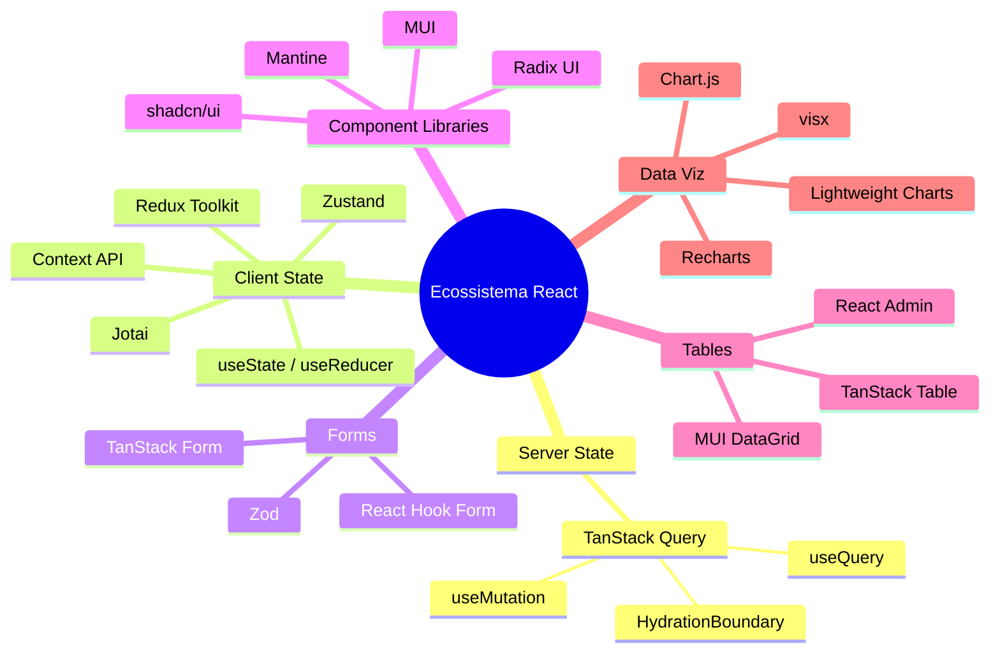

> [!abstract] TL;DR
> O ecossistema React não é uma lista de libs para memorizar — é um sistema de escolhas encadeadas. Cada decisão abre e fecha caminhos: o framework que você escolhe influencia como você faz data fetching; a estratégia de fetching influencia onde você coloca estado; o estado influencia quais component libraries fazem sentido. Um sênior não sabe "qual lib usar" — sabe *por que* uma lib existe, *quando* ela resolve melhor do que a alternativa, e *o que você perde* ao escolhê-la. Este capstone te dá esse raciocínio.

# Capstone — montando o stack, trade-offs e entrevista

A diferença entre um desenvolvedor pleno e um sênior na mesa de entrevista raramente aparece na pergunta "você conhece X?". Quase todo mundo diz sim. Ela aparece quando o entrevistador muda o ângulo: *"Por que você usaria X aqui e não Y?"*

As 12 notas anteriores deste galho ensinaram o *o quê* — o que é TanStack Query, o que é Zustand, o que são atoms no Jotai, como o TanStack Table virtualiza linhas. Este capstone ensina o *porquê* e o *quando*. Ele não re-explica o conteúdo das irmãs; assume que você já as leu. O que ele faz é conectar os pontos e preparar você para decidir e justificar em tempo real.

## Mapa de revisão do galho

Use esta tabela para revisão rápida antes de uma entrevista ou ao retornar ao galho depois de um tempo.

| # | Nota | Categoria | Fase | O que você aprende |
|---|------|-----------|------|--------------------|
| 01 | [[03-Dominios/Tecnologia/React/Ecossistema/01 - O ecossistema React - o mapa\|O ecossistema React: o mapa]] | Overview | Iniciado | Por que o ecossistema existe; mapa das 6 categorias; o React como view layer |
| 02 | [[03-Dominios/Tecnologia/React/Ecossistema/02 - Server state vs client state\|Server state vs client state]] | Arquitetura | Iniciado | A distinção fundamental que organiza todo o ecossistema; o problema do cache |
| 03 | [[03-Dominios/Tecnologia/React/Ecossistema/03 - Component libraries e design systems\|Component libraries e design systems]] | UI | Iniciado | Headless vs batteries-included; Radix, shadcn/ui, MUI, Mantine; bundle e lock-in |
| 04 | [[03-Dominios/Tecnologia/React/Ecossistema/04 - TanStack Query I - queries, cache e invalidação\|TanStack Query I: queries, cache e invalidação]] | Server State | Adepto | `useQuery`, stale-while-revalidate, invalidação, background refetch |
| 05 | [[03-Dominios/Tecnologia/React/Ecossistema/05 - TanStack Query II - mutations e optimistic updates\|TanStack Query II: mutations e optimistic updates]] | Server State | Adepto | `useMutation`, rollback, invalidação pós-mutação, optimistic updates |
| 06 | [[03-Dominios/Tecnologia/React/Ecossistema/06 - Formulários - React Hook Form + Zod\|Formulários: React Hook Form + Zod]] | Forms | Adepto | Uncontrolled inputs, schema-driven validation, performance de re-render |
| 07 | [[03-Dominios/Tecnologia/React/Ecossistema/07 - Client state global - Context e Zustand\|Client state global: Context e Zustand]] | Client State | Adepto | Re-render semantics do Context; quando migrar para Zustand; slice pattern |
| 08 | [[03-Dominios/Tecnologia/React/Ecossistema/08 - Redux Toolkit - e quando ainda faz sentido\|Redux Toolkit: e quando ainda faz sentido]] | Client State | Adepto | Redux como legado; RTK Query; quando manter, quando migrar |
| 09 | [[03-Dominios/Tecnologia/React/Ecossistema/09 - Estado avançado - Jotai, atoms e signals\|Estado avançado: Jotai, atoms e signals]] | Client State | Magus | Modelo atômico; Jotai vs Zustand; signals vs VDOM; React Compiler |
| 10 | [[03-Dominios/Tecnologia/React/Ecossistema/10 - Tabelas e data grids - TanStack Table\|Tabelas e data grids: TanStack Table]] | Data Display | Adepto | Headless table; sort/filter/paginação/virtualização; `useMemo` em columns |
| 11 | [[03-Dominios/Tecnologia/React/Ecossistema/11 - Data visualization - escolhendo libs de gráficos\|Data visualization: escolhendo libs de gráficos]] | Data Display | Adepto | Recharts vs visx vs Chart.js; trade-offs de performance e customização |
| 12 | [[03-Dominios/Tecnologia/React/Ecossistema/12 - TanStack Query no mundo Next e RSC\|TanStack Query no mundo Next e RSC]] | Server State + RSC | Magus | `prefetchQuery`, `HydrationBoundary`, onde TQ ainda adiciona valor com RSC |

## O ecossistema como sistema de decisões

Imagine a seguinte cena: você está em um design review com o time. Alguém propõe usar Redux para gerenciar o estado de uma lista de itens que vem de uma API e precisa de filtros locais. A pergunta que um júnior faz internamente é *"eu sei usar Redux?"*. A pergunta que um sênior faz é *"qual problema estamos resolvendo aqui, e qual é a ferramenta mínima necessária?"*

A resposta correta raramente começa com o nome de uma lib. Ela começa com:

1. **De onde vêm os dados?** — Se são dados de servidor (API, banco), eles têm ciclo de vida de cache, invalidação e sincronização. TanStack Query é feito para isso.
2. **O que é estado local?** — Filtros que o usuário aplica na UI sem consultar a API são estado síncrono local. `useState` resolve. Se precisar cruzar componentes, Zustand.
3. **Qual é a escala do time e do produto?** — Um sistema de design próprio com 10 devs justifica Radix headless. Um MVP com 2 devs justifica MUI para ir rápido.
4. **Quais são os requisitos de performance?** — Uma tabela com 10 linhas é diferente de uma com 50.000. Um gráfico de linha simples é diferente de um candlestick em tempo real.

Cada resposta alimenta a próxima. O stack emerge das restrições, não de preferências pessoais.

## Decision trees por categoria

### Server state

```
Você usa Next.js App Router com RSC?
├── SIM → prefetchQuery + HydrationBoundary no servidor
│          useQuery nos Client Components interativos
│          (nota 12)
└── NÃO (SPA puro ou Pages Router)
    ├── Precisar de mutations com optimistic update?
    │   └── TanStack Query useMutation (nota 05)
    └── Só leitura de dados?
        └── TanStack Query useQuery (nota 04)
```

> [!tip] Regra de ouro do server state
> Se o dado vem de uma API e pode ficar desatualizado, ele pertence ao TanStack Query — não ao Zustand, não ao Redux, não ao `useState`. O cache é a feature, não o efeito colateral.

### Client state

```
O estado é compartilhado entre componentes?
├── NÃO → useState / useReducer (local ao componente)
└── SIM
    ├── Quantos componentes precisam do estado?
    │   ├── Poucos (2-5) → Context API pode bastar
    │   │   Mas atenção: re-render em cascata (nota 07)
    │   └── Muitos ou performance sensível → Zustand
    │       slice pattern para organizar (nota 07)
    ├── O estado tem muitas peças interdependentes
    │   (ex: editor, canvas, formulário complexo)?
    │   └── Jotai — modelo atômico evita over-subscription (nota 09)
    └── Codebase com Redux instalado?
        ├── Funciona bem? → Manter; migrar RTK Query se usar saga para fetching
        └── Problemático? → Migrar para Zustand por partes (nota 08)
```

### Forms

```
O form tem validação com tipagem TypeScript?
├── SIM (quase sempre) → React Hook Form + Zod (nota 06)
│   schema define tipos + regras num lugar só
└── NÃO (form simples, 1-2 campos)
    └── useState + validação manual — sem overhead de lib

Form muito complexo com UX avançada (wizard, condicional dinâmico pesado)?
└── Avaliar TanStack Form (emergente, mas promissor)
```

### Component library

```
Você tem um design system próprio ou precisa de total controle de estilo?
├── SIM → Radix UI (primitivos acessíveis sem estilo)
│         ou shadcn/ui (Radix + Tailwind + copy-paste)
└── NÃO
    ├── Time pequeno, velocidade máxima?
    │   └── MUI ou Mantine — baterias incluídas, produtivo de imediato
    └── Tailwind já é a base do projeto?
        └── shadcn/ui — integração natural, sem conflito de classes
```

> [!warning] Anti-pattern de library sprawl
> Não instale duas component libraries no mesmo projeto sem motivo forte. O bundle cresce, os estilos conflitam, a UX fica inconsistente. Escolha uma e comprometa-se.

### Tables

```
Quantas linhas a tabela terá em produção?
├── < 100 linhas, sem sort/filter complexo → HTML + CSS ou tabela simples do MUI/Mantine
└── > 100 linhas ou precisa de sort/filter/paginação/seleção?
    └── TanStack Table (nota 10)
        ├── Virtualização necessária (> 10k linhas)? → useVirtualizer junto
        └── Admin interno, CRUD rápido? → MUI DataGrid ou React Admin

Dados financeiros com OHLC? → Lightweight Charts (especializado)
```

### Charts

```
Qual é a complexidade do dado e do design?
├── Dashboard de negócios (linha, barra, pizza, < 5k pontos)
│   → Recharts — API declarativa, fácil de integrar (nota 11)
├── Design muito customizado ou animações complexas
│   → visx (primitivos D3 em React) — máximo controle, curva íngreme
├── Dados financeiros, OHLC, tempo real
│   → Lightweight Charts (TradingView) — otimizado para esse caso
└── Muitos dados (> 10k pontos) ou reutilização via canvas
    → Chart.js ou ApexCharts — canvas-based, mais performático
```

## Visão geral do ecossistema



## Anti-patterns famosos

Estes erros aparecem com frequência em entrevistas técnicas e em code review de codebases jovens. Saber nomeá-los e explicar o porquê é sinal de maturidade.

**1. `useEffect` para buscar dados**

```tsx
// ❌ Você está reinventando o TanStack Query, pior
useEffect(() => {
  setLoading(true);
  fetch('/api/users')
    .then(r => r.json())
    .then(data => { setUsers(data); setLoading(false); })
    .catch(err => { setError(err); setLoading(false); });
}, []);
```

O problema não é apenas a verbosidade. É que você perdeu: cache, background refetch, deduplicação de requests, stale-while-revalidate, invalidação coordenada. O TanStack Query resolve todos esses problemas fora da caixa.

**2. Estado de servidor dentro do Zustand**

```tsx
// ❌ Duplicação desnecessária — o TQ já é o store do servidor
const useStore = create((set) => ({
  users: [],
  fetchUsers: async () => {
    const data = await fetch('/api/users').then(r => r.json());
    set({ users: data });
  }
}));
```

O cache do TanStack Query já é o store para dados de servidor. Duplicar no Zustand cria dois pontos de verdade que podem divergir.

**3. Duas ou mais component libraries no mesmo projeto**

MUI para o dashboard, Mantine para os forms, Radix para os modais. Resultado: bundle de 300KB de CSS, tokens de design inconsistentes, quatro formas diferentes de fazer um botão. Escolha uma.

**4. `useContext` para estado frequentemente atualizado**

```tsx
// ❌ Todo consumidor do context re-renderiza quando qualquer campo muda
const AppContext = createContext({ user: null, theme: 'dark', notifications: [] });
```

Context não tem granularidade de subscription. Se `notifications` muda a cada segundo e `user` e `theme` são consumidos por 30 componentes, você tem 30 re-renders por segundo desnecessários. Zustand ou Jotai resolvem com seletores.

**5. `columns` do TanStack Table sem `useMemo`**

```tsx
// ❌ Nova referência a cada render → TanStack Table re-processa tudo
const columns = [
  columnHelper.accessor('name', { header: 'Nome' }),
  // ...
];
```

`columns` deve ser definido fora do componente ou memoizado com `useMemo`. Sem isso, qualquer keystroke em um campo de busca recria as colunas do zero.

**6. `atom()` dentro do componente React**

```tsx
// ❌ Novo átomo criado a cada render — memory leak e comportamento inesperado
function MyComponent() {
  const nameAtom = atom(''); // ERRADO
  const [name, setName] = useAtom(nameAtom);
}
```

Atoms do Jotai devem ser definidos fora do ciclo de render — no nível de módulo ou com `useMemo` em casos dinâmicos controlados.

## Perguntas de entrevista por nível

### Nível Adepto (pleno)

**"O que é server state e por que o TanStack Query existe?"**

O que o entrevistador quer ouvir: a distinção entre dado síncrono (UI state) e dado assíncrono (servidor), o problema do cache stale, e que o TanStack Query resolve fetching, caching, background sync e invalidação de forma declarativa. Não é "uma lib de fetch" — é um gerenciador de estado assíncrono.

**"Quando você usaria Zustand ao invés de Context?"**

O que o entrevistador quer ouvir: Context re-renderiza todos os consumidores quando qualquer valor muda (sem granularidade). Zustand usa seletores: um componente subscreve apenas o slice que precisa. Zustand é a escolha quando o estado é compartilhado por muitos componentes ou atualizado com frequência.

**"Como você valida formulários em React?"**

O que o entrevistador quer ouvir: React Hook Form com inputs uncontrolled (performance), Zod para schema-driven validation com inferência de tipos TypeScript. O schema é a única fonte de verdade: define o tipo, define as regras, gera mensagens de erro.

**"Qual a diferença entre headless e batteries-included em component libraries?"**

O que o entrevistador quer ouvir: headless (Radix, TanStack Table) entrega comportamento e acessibilidade sem estilos — você controla 100% do visual. Batteries- included (MUI, Mantine) entrega componentes prontos — você vai rápido mas cede controle. A escolha depende de se o design system é próprio ou se a velocidade é mais importante do que a consistência visual perfeita.

### Nível Magus (sênior)

**"Você ainda usaria TanStack Query com React Server Components?"**

O que o entrevistador quer ouvir: RSC muda o ponto de fetch para o servidor, mas TanStack Query ainda adiciona valor nos Client Components interativos. O padrão é `prefetchQuery` no Server Component (dados chegam no HTML), `HydrationBoundary` para hidratar o cache no cliente, e `useQuery` nos Client Components que precisam de refetch, polling ou invalidação. Para dados 100% estáticos em RSC, TQ pode ser dispensado. Para partes interativas, ele continua sendo a melhor escolha.

**"Como você decide o stack de estado para uma nova feature?"**

O que o entrevistador quer ouvir: começa pela pergunta "de onde vêm os dados?". Dados de servidor → TanStack Query. Estado de UI local → `useState`. Estado compartilhado síncrono → Zustand (simples) ou Jotai (interdependências complexas). Nunca começar pela escolha da lib; começar pela natureza do dado.

**"O que são signals e por que o React não os adotou?"**

O que o entrevistador quer ouvir: signals (Solid, Preact, Vue 3) são primitivos reativos que rastreiam dependências de forma granular — sem VDOM diffing, o update vai direto ao DOM. O React escolheu VDOM + reconciliação porque simplifica o modelo mental: você descreve o estado completo da UI e o React descobre o diff. O preço é performance em casos extremos. A resposta do React é o React Compiler (antes React Forget) — análise estática que gera memoização automática, aproximando a performance de signals sem quebrar o modelo mental atual.

**"Como você avalia se uma lib de terceiro é segura para adotar em produção?"**

O que o entrevistador quer ouvir: múltiplas dimensões — (1) manutenção ativa (último commit, issues abertas, changelog); (2) comunidade (npm downloads, GitHub stars, ecossistema de plugins); (3) bundle size e tree-shaking; (4) grau de lock-in (headless > opinionado); (5) alternativas viáveis se a lib abandonar. Uma lib com 200k downloads/semana e mantenedor ativo é diferente de uma com 2k e último commit há dois anos.

## Como explicar o ecossistema em inglês

Não é um glossário — as notas irmãs têm vocabulário técnico. Este é um roteiro de como descrever o ecossistema para um entrevistador anglófono com fluência e precisão.

**Abrindo o assunto:**

> "React is intentionally minimal — it handles the view layer, and the ecosystem fills the gaps. The core React library doesn't include data fetching, routing, form management, or a design system. That's by design: it makes React adaptable to SPAs, SSR, React Native, and other targets."

**Distinguindo server e client state:**

> "The key architectural distinction is server state versus client state. Server state is data that lives on the backend — it's async, it can go stale, and it needs cache management. TanStack Query owns that layer. Client state is synchronous UI state that only exists in the browser — toggles, selected items, form drafts. That's where useState, Zustand, or Jotai come in."

**Sobre forms:**

> "For forms, React Hook Form with Zod validation is the current standard. React Hook Form uses uncontrolled inputs under the hood — you register fields, not controlled state — which means no re-render on every keystroke. Zod gives you a schema that's both the TypeScript type and the validation rules in one place."

**Sobre component libraries:**

> "There are two philosophies in component libraries. Headless libraries like Radix UI give you behavior and accessibility without any styles — you own the visual layer completely. shadcn/ui builds on Radix with Tailwind defaults. Batteries- included libraries like MUI or Mantine give you ready-to-use components and move faster, but you trade some visual control."

**Sobre tables e charts:**

> "For complex tables — sort, filter, virtualization — TanStack Table is the headless choice. It handles the logic, you own the markup. For data visualization, Recharts covers most business dashboards with a declarative React API. For financial data or very large datasets, you move to canvas-based solutions like Chart.js or Lightweight Charts."

## O que vem a seguir — e o que ficou fora

Este galho cobre o ecossistema central de estado, forms, UI e data display. Algumas categorias importantes ficaram intencionalmente fora de escopo:

- **Routing** — React Router v7 e TanStack Router (SPA) ou o roteador embutido do Next.js (App Router / Pages Router). São galhos próprios.
- **Animação** — Framer Motion e React Spring merecem tratamento dedicado.
- **Internacionalização** — i18next, react-i18next e outros.
- **Testing** — Vitest, React Testing Library, Playwright. Cobertos na trilha de qualidade, não aqui.
- **Bundlers e tooling** — Vite, Turbopack, configuração de build.

> [!info] MOC do domínio
> Este galho faz parte da trilha React. Veja o mapa completo em [[03-Dominios/Tecnologia/React/index|React]] e o vocabulário técnico em [[03-Dominios/Tecnologia/React/Dicionário de React|Dicionário de React]].

---

### Notas deste galho

- [[03-Dominios/Tecnologia/React/Ecossistema/01 - O ecossistema React - o mapa|01 — O ecossistema React: o mapa]]
- [[03-Dominios/Tecnologia/React/Ecossistema/02 - Server state vs client state|02 — Server state vs client state]]
- [[03-Dominios/Tecnologia/React/Ecossistema/03 - Component libraries e design systems|03 — Component libraries e design systems]]
- [[03-Dominios/Tecnologia/React/Ecossistema/04 - TanStack Query I - queries, cache e invalidação|04 — TanStack Query I: queries, cache e invalidação]]
- [[03-Dominios/Tecnologia/React/Ecossistema/05 - TanStack Query II - mutations e optimistic updates|05 — TanStack Query II: mutations e optimistic updates]]
- [[03-Dominios/Tecnologia/React/Ecossistema/06 - Formulários - React Hook Form + Zod|06 — Formulários: React Hook Form + Zod]]
- [[03-Dominios/Tecnologia/React/Ecossistema/07 - Client state global - Context e Zustand|07 — Client state global: Context e Zustand]]
- [[03-Dominios/Tecnologia/React/Ecossistema/08 - Redux Toolkit - e quando ainda faz sentido|08 — Redux Toolkit: e quando ainda faz sentido]]
- [[03-Dominios/Tecnologia/React/Ecossistema/09 - Estado avançado - Jotai, atoms e signals|09 — Estado avançado: Jotai, atoms e signals]]
- [[03-Dominios/Tecnologia/React/Ecossistema/10 - Tabelas e data grids - TanStack Table|10 — Tabelas e data grids: TanStack Table]]
- [[03-Dominios/Tecnologia/React/Ecossistema/11 - Data visualization - escolhendo libs de gráficos|11 — Data visualization: escolhendo libs de gráficos]]
- [[03-Dominios/Tecnologia/React/Ecossistema/12 - TanStack Query no mundo Next e RSC|12 — TanStack Query no mundo Next e RSC]]
