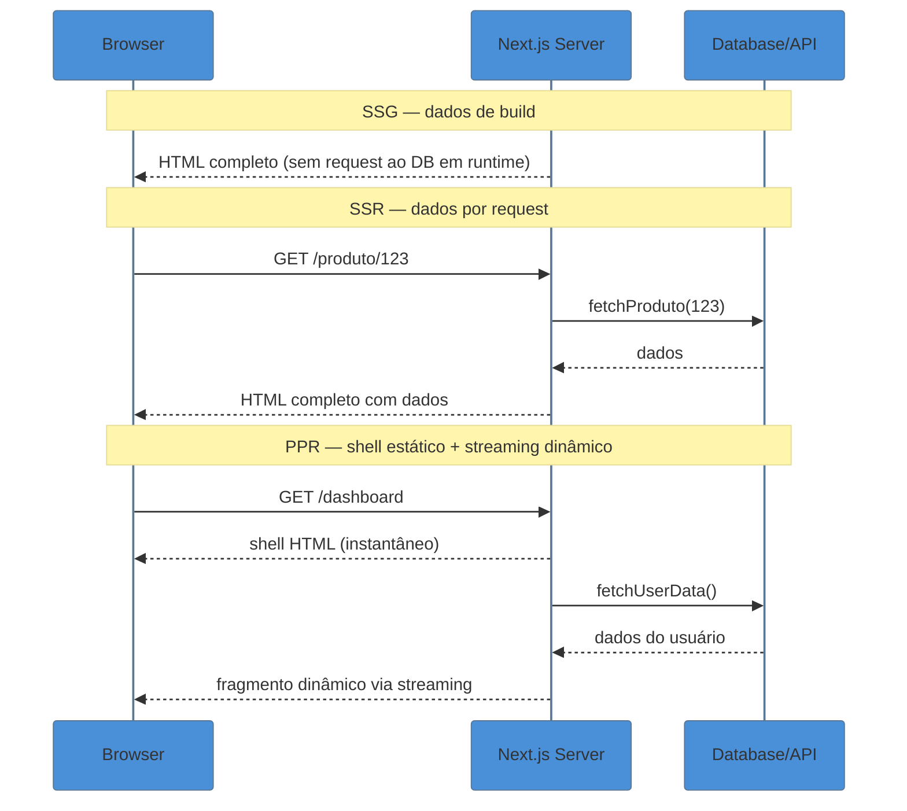
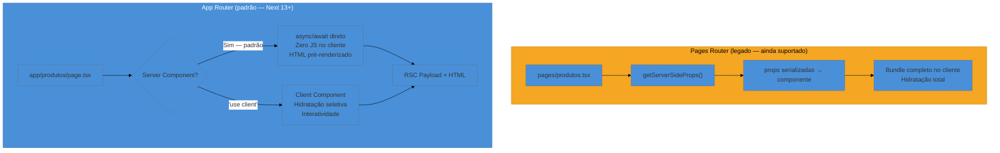

# O que é o Next.js e por que existe

> [!abstract] TL;DR
> Next.js é um **meta-framework sobre React** que adiciona o que o React, por princípio, não entrega: roteamento baseado em sistema de arquivos, estratégias de renderização no servidor (SSR, SSG, ISR, PPR), data fetching integrado via Server Components, bundling configurado e otimização automática de assets. O padrão atual é o **App Router** (Next 13+), construído sobre React Server Components — uma virada de paradigma em relação ao Pages Router legado. O baseline desta nota é **Next.js 15 / React 19**. Use Next quando precisar de SEO real, rendering server-side ou uma stack full-stack em monorepo. Não use quando a aplicação é SPA pura, site de conteúdo estático puro ou quando a equipe ainda não tem contexto em RSC.

---

Imagine que você aprendeu React com propriedade — sabe compor componentes, gerenciar estado, usar hooks. Então alguém pede para você colocar a aplicação em produção. A lista de perguntas sem resposta aparece imediatamente:

- Como definir rotas? `/sobre` vira o quê?
- Como gerar HTML no servidor para o Google indexar o conteúdo?
- Como buscar dados sem expor chaves de API no bundle do cliente?
- Como fazer o build ser rápido e o bundle não pesar 2 MB?
- Como otimizar imagens sem escrever um pipeline de ImageMagick?
- Como servir fontes sem CLS?

O React não responde nenhuma dessas perguntas — e faz isso de propósito. Ele é uma biblioteca de composição de UI. Essas questões pertencem ao domínio dos **meta-frameworks**, e o Next.js é o mais adotado para o ecossistema React.

> [!question]- Por que o React deliberadamente não resolve essas coisas?
> Porque a equipe do React mantém o escopo intencional: primitivas de UI composíveis. Roteamento, rendering strategies, bundling e data fetching variam muito por caso de uso — delegar para frameworks permite experimentação e especialização. É por isso que Next.js, Remix e Astro coexistem com trade-offs diferentes, todos sobre o mesmo React.

---

## Breve história: de onde o Next.js veio

O Next.js foi criado pela Vercel (então Zeit) e lançado em outubro de 2016 com uma proposta simples: SSR com React sem configuração. Na época, renderizar React no servidor exigia configuração manual de Express + `ReactDOMServer.renderToString` — doloroso.

A evolução foi em ondas:

- **2016–2019 (Next 1–9):** SSR + roteamento `pages/`; `getInitialProps`
- **2020–2022 (Next 10–12):** SSG, ISR, `getStaticProps`/`getServerSideProps`; otimizações de Image/Font; Middleware
- **2022–2023 (Next 13):** App Router em beta; Server Components entram no picture; Turbopack experimental
- **2023–2024 (Next 14):** App Router estável; Server Actions; PPR experimental; caching `force-cache` por padrão
- **2024–2025 (Next 15):** React 19 oficial; **caching invertido (uncached por padrão)**; Turbopack dev estável; React Compiler experimental; `next/form`; `next.config.ts` em TypeScript
- **2025 (Next 16):** `'use cache'` / Cache Components; caching opt-in granular

Essa linha do tempo importa porque projetos reais vivem em versões diferentes. Entender onde cada API apareceu é essencial para diagnóstico e migração.

---

## O que o Next.js resolve: os cinco pilares

Pensar em Next como "React com superpoderes" é prático, mas impreciso. A metáfora mais útil: **o Next.js é a camada de infraestrutura que o React delega para os frameworks**. Cada pilar resolve uma categoria de problema real de produção.

### 1. Roteamento baseado em sistema de arquivos

Em React puro, você configura uma biblioteca de roteamento — React Router, TanStack Router — e define rotas manualmente em código. No Next.js, **o sistema de arquivos é o roteador**:

```
app/
├── page.tsx          → /
├── sobre/
│   └── page.tsx      → /sobre
├── produtos/
│   ├── page.tsx      → /produtos
│   └── [slug]/
│       └── page.tsx  → /produtos/:slug
└── blog/
    └── [...path]/
        └── page.tsx  → /blog/* (catch-all)
```

Criar um arquivo é criar uma rota. Isso tem consequências arquiteturais relevantes:

- **Layouts aninhados são automáticos:** um `layout.tsx` na pasta `produtos/` envolve todas as rotas filhas sem configuração extra
- **Carregamentos intermediários viram Suspense:** `loading.tsx` é automaticamente um Suspense boundary para a rota
- **A estrutura do projeto é a documentação de rotas** — auditável por qualquer pessoa do time

> [!example] Rota dinâmica com slug tipado
> ```tsx
> // app/produtos/[slug]/page.tsx
> interface PageProps {
>   params: Promise<{ slug: string }>  // Next 15: params é Promise
> }
>
> export default async function ProdutoPage({ params }: PageProps) {
>   const { slug } = await params
>   const produto = await fetchProduto(slug)
>   return <DetalhesProduto produto={produto} />
> }
> ```
> No **Next 15**, `params` e `searchParams` são Promises — você precisa fazer `await params` antes de acessar os valores. No **Next 14** eram síncronos. Essa é outra quebra silenciosa em migrações.

### 2. Estratégias de renderização no servidor

React puro renderiza no cliente: o HTML que chega é uma página em branco com `<div id="root">`. O JavaScript carrega, executa e monta a UI. Para SEO isso é problemático; para performance em conexões lentas, pior ainda; para dados sensíveis expostos no bundle, arriscado.

O Next.js oferece quatro estratégias combináveis por rota:

| Estratégia | Quando o HTML é gerado | Caso de uso típico |
|---|---|---|
| **SSG** — Static Site Generation | Em build time | Blog, docs, landing page, portfolio |
| **SSR** — Server-Side Rendering | Em cada request | Página de produto com preço em tempo real |
| **ISR** — Incremental Static Regeneration | Build + revalidação periódica | Catálogo de e-commerce, dashboards atualizados de hora em hora |
| **PPR** — Partial Prerendering | Shell estático em build; partes dinâmicas em request via streaming | Páginas mistas — cabeçalho/footer estáticos, seção personalizada por usuário |

O **PPR** é o mais recente desses padrões — consolidado no Next 15 como experimental estável. A ideia é servir imediatamente um shell HTML pré-renderizado (sem esperar dados dinâmicos), enquanto as partes que precisam de dados chegam via streaming como fragmentos. O resultado é um TTFB baixo mesmo para páginas parcialmente dinâmicas.



Mais detalhes sobre cada estratégia estão em [[03-Dominios/Tecnologia/React/Next.js/08 - Rendering strategies - SSR, SSG, ISR, PPR|nota 08 — Rendering strategies]].

### 3. Data fetching integrado com o servidor

Em React puro no cliente, buscar dados envolve `useEffect` + estado de loading + tratamento de erro — boilerplate manual em cada componente. Com **Server Components** (o motor do App Router), você usa `async/await` diretamente no componente:

```tsx
// app/produtos/page.tsx
// Server Component por padrão — zero configuração extra
export default async function ProdutosPage() {
  // Roda no servidor — a chave de API nunca vai para o bundle do cliente
  const produtos = await fetch('https://api.interna.com/produtos', {
    next: { revalidate: 3600 }  // revalida a cada 1h (ISR-like)
  }).then(r => r.json())

  return <ListaDeProdutos items={produtos} />
}
```

Sem `useEffect`, sem estado de loading manual, sem risco de vazar credenciais para o cliente. O componente roda no servidor — o cliente recebe HTML pronto com os dados já renderizados.

Para dados que precisam ser buscados em paralelo:

```tsx
// Paralelo — não espera um para começar o outro
export default async function DashboardPage() {
  const [usuario, pedidos, notificacoes] = await Promise.all([
    fetchUsuario(),
    fetchPedidos(),
    fetchNotificacoes()
  ])

  return (
    <Dashboard usuario={usuario} pedidos={pedidos} notificacoes={notificacoes} />
  )
}
```

O data fetching no Server é explorado em [[03-Dominios/Tecnologia/React/Next.js/05 - Data fetching no Server|nota 05 — Data fetching no Server]].

### 4. Bundling e compilação configurados

Configurar Webpack para React em produção envolve: code splitting, tree-shaking, análise de bundle, suporte a TypeScript, source maps, lazy loading de imagens, processamento de CSS, variáveis de ambiente... É um trabalho de semanas para fazer direito.

O Next.js entrega tudo configurado. No **Next 15**, o **Turbopack** substituiu o Webpack como bundler padrão de desenvolvimento:

- Escrito em **Rust**, incremental por design
- Até **45,8% mais rápido** no compile inicial de rota (benchmark oficial)
- Hot Module Replacement (HMR) quase instantâneo em projetos grandes
- No Next 15: estável para `next dev`; em estabilização para `next build`

Você pode customizar via `next.config.ts` (TypeScript nativo desde Next 15):

```ts
// next.config.ts
import type { NextConfig } from 'next'

const config: NextConfig = {
  experimental: {
    ppr: true,           // Partial Prerendering
    reactCompiler: true, // React Compiler automático
  },
}

export default config
```

### 5. Otimização automática de assets

Imagens, fontes e scripts têm armadilhas clássicas de performance que custam Core Web Vitals:

```tsx
// Sem next/image: desenvolvedor precisa gerenciar dimensões, lazy load, formato
 {/* CLS, sem lazy load, sem WebP */}

// Com next/image: tudo automático
import Image from 'next/image'
<Image
  src="/hero.jpg"
  alt="Hero"
  width={1200}
  height={630}
  priority  // LCP image — sem lazy load aqui
/>
```

```tsx
// Sem next/font: request para Google Fonts → latência extra
<link href="https://fonts.googleapis.com/css2?family=Inter" rel="stylesheet" />

// Com next/font: self-hosting automático → zero request externo, zero CLS
import { Inter } from 'next/font/google'
const inter = Inter({ subsets: ['latin'] })
<body className={inter.className}>...</body>
```

Esses otimizadores são explorados em [[03-Dominios/Tecnologia/React/Next.js/14 - Otimizações - Image, Font, bundle, Turbopack|nota 14 — Otimizações]].

---

## App Router: a virada de paradigma



O **App Router** (pasta `app/`) foi introduzido no Next 13 e é o padrão desde o Next 14. Ele é construído sobre **React Server Components**, que permitem que componentes rodem exclusivamente no servidor — sem enviar o código deles para o bundle do cliente.

A diferença em relação ao **Pages Router** (pasta `pages/`) não é apenas de API — é uma mudança de modelo mental:

| Dimensão | Pages Router | App Router |
|---|---|---|
| **Componente padrão** | Client-side | Server Component |
| **Data fetching** | `getServerSideProps` / `getStaticProps` | `async/await` no componente |
| **Layouts** | `_app.tsx` global | Layouts aninhados por rota |
| **Loading states** | Manual com `useState` | `loading.tsx` automático (Suspense) |
| **Streaming** | Não suportado nativamente | Suportado via Suspense |
| **Actions** | API Routes ou formulários manuais | Server Actions com `'use server'` |
| **Bundle do cliente** | Todos os componentes | Só os marcados com `'use client'` |

> [!info] Pages Router não vai embora
> O Pages Router ainda é suportado sem data de depreciação confirmada. Muitos projetos em produção usam Pages Router — migrar não é urgente. Entender os dois é necessário para trabalhar em equipes reais. A nota [[03-Dominios/Tecnologia/React/Next.js/02 - App Router vs Pages Router|02 — App Router vs Pages Router]] cobre a coexistência e os caminhos de migração em detalhe.

> [!tip] Assista: Next.js App Router: Routing, Data Fetching, Caching
> **Canal:** Vercel | **Duração:** ~14min | **Idioma:** EN
>
> Lee Robinson (VP de Developer Experience da Vercel) demonstra ao vivo a mudança de paradigma do App Router: por que componentes são Server Components por padrão, como o roteamento por sistema de arquivos funciona na prática e como o `async/await` direto no componente substitui `getStaticProps`/`getServerSideProps`. É o "por que existe o App Router" em código — complemento perfeito para a teoria desta nota.
> Trecho de destaque [1:45]: *"By default, all pages and layouts inside of the app router are React server components by default. This means that your code only runs on the server — it's not sending any additional JavaScript to the client side."*
>
> 🎬 [Assistir no YouTube](https://www.youtube.com/watch?v=gSSsZReIFRk)

---

## Posição no ecossistema: quando escolher o quê

Antes de escolher Next.js por padrão, vale entender onde ele se encaixa e onde não é a melhor ferramenta.

| Framework | Ponto forte | Quando escolher |
|---|---|---|
| **Next.js 15** | RSC-first, full-stack, ecossistema rico, Vercel-native | Apps complexas com SEO, e-commerce, SaaS, equipes grandes |
| **Remix / React Router v7** | Mutations simples, Web APIs nativas, Edge-first | Apps CRUD-intensivos, dashboards, projetos que preferem simplicidade de modelo de dados |
| **Astro 5** *(adquirido pela Cloudflare, jan/2026)* | Zero JS por padrão, Islands Architecture, LCP excepcional | Blogs, docs, sites de marketing, portfolios — qualquer coisa onde conteúdo > interatividade |
| **Vite + React** | Simplicidade máxima, sem servidor, setup mínimo | SPAs puras, ferramentas internas, apps sem requisito de SEO |

> [!question]- O que aconteceu com o Remix?
> Em 2024, o Remix se fundiu com o React Router. A partir da versão 7, o React Router suporta nativamente o modelo do Remix — loaders, actions, SSR. O projeto é mantido pela Shopify (via Hydrogen) e pela comunidade. O que era "usar Remix" agora é "usar React Router v7 em modo framework".

> [!question]- E o Astro foi realmente adquirido pela Cloudflare?
> Sim, em janeiro de 2026. O projeto continua open-source; a aquisição trouxe integração mais profunda com Workers e Pages da Cloudflare, mas não mudou a proposta central. Para sites de conteúdo, Astro continua sendo uma escolha válida e com LCP 40–70% melhor que Next.js em benchmarks de páginas estáticas (dados de 2026).

---

## Quando NÃO usar Next.js

Next.js é poderoso, mas poder sem necessidade é complexidade desnecessária. Existem cenários claros onde outra escolha é melhor.

### SPA pura, sem servidor

Se a aplicação é um dashboard interno, uma ferramenta de desenvolvedor ou qualquer app que não precisa de SEO e cujos dados vêm 100% de uma API externa, **Vite + React** é mais simples:

- Sem server runtime para gerenciar
- Sem distinção server/client components para explicar ao time
- Deploy é só um `dist/` de arquivos estáticos — Cloudflare Pages, S3, qualquer CDN
- Build mais rápido, sem overhead de SSR

Usar Next.js num SPA puro é carregar o avião para ir à padaria: você vai chegar, mas vai gastar combustível desnecessário.

### Sites de conteúdo estático com muito HTML e SEO intenso

Para blogs, documentações, portfolios e sites de marketing onde 90%+ do conteúdo é estático e a meta principal é LCP baixo e indexabilidade máxima, **Astro** é superior:

- Zero JavaScript enviado ao cliente por padrão (Islands Architecture — JS só nos "ilhas" interativas)
- LCP 40–70% melhor que Next.js em benchmarks de conteúdo estático (2026)
- Menor custo de hosting — output é HTML puro, sem serverless functions
- Suporta componentes React (Astro é agnóstico de framework de UI)

O Next.js pode gerar HTML estático com SSG, mas carrega mais JavaScript por padrão — e em sites de conteúdo, cada KB de JS é um custo.

### Quando o custo de infraestrutura é crítico

A Vercel monetiza principalmente em invocações serverless. Para apps com volume alto de requests dinâmicos, o custo pode surpreender. Self-hosting é possível (`output: 'standalone'` + Dockerfile), mas adiciona complexidade de operação que um deploy Cloudflare Pages com Astro ou um servidor Remix simples não tem.

Se o budget de infraestrutura é limitado e as páginas são majoritariamente estáticas, considere Astro ou o modo SSG do próprio Next.js com deploy num CDN simples.

### Quando o time não tem contexto em RSC

O App Router impõe um modelo mental diferente: a fronteira server/client, serialização de props, composição de `'use client'` e `'use server'`, memoização de requests, entender quando o componente roda no servidor vs cliente. Equipes sem esse contexto costumam:

- Colocar `'use client'` em tudo (anulando os benefícios de RSC)
- Tentar usar `useState` em Server Components e se perder no erro
- Quebrar acidentalmente a fronteira server/client ao passar funções como props

Nesses casos, começar com Remix/React Router v7 ou Vite + React enquanto a equipe absorve RSC gradualmente pode ser mais produtivo. O Next.js sem entendimento de RSC é Pages Router camuflado de App Router.

---

## Armadilhas comuns

> [!warning] Caching invertido no Next 15 — padrão mudou
> No **Next 14**, `fetch` em Server Components era `force-cache` por padrão — dados eram cacheados automaticamente até você pedir refresh. No **Next 15**, o padrão virou **sem cache** (`no-store`). Código migrado do 14 que assumia cache automático pode começar a fazer requests excessivos em produção sem emitir nenhum erro. Sempre declare a estratégia explicitamente: `{ cache: 'force-cache' }` para cache indefinido, `{ next: { revalidate: 3600 } }` para ISR, ou `{ cache: 'no-store' }` para sempre fresco.

> [!warning] `'use client'` não significa "roda só no cliente"
> Um equívoco comum: colocar `'use client'` não impede que o componente seja renderizado no servidor para o HTML inicial (SSR/SSG). Significa que **o componente hidrata no cliente** — ele roda no servidor durante a pré-renderização e depois no cliente para interatividade. O que `'use client'` realmente faz é marcar a **fronteira da árvore RSC**: tudo abaixo desse componente entra no bundle do cliente. Usar `'use client'` num componente pai faz todos os seus filhos também serem client components — mesmo que você não queira.

> [!warning] Server Components não suportam hooks do React
> `useState`, `useEffect`, `useContext`, `useRef`, `useCallback` — nenhum hook funciona em Server Components. Se um componente precisa de estado ou efeitos, ele precisa ser marcado com `'use client'`. O erro é em runtime (TypeScript não captura isso na maioria dos casos), o que dificulta o diagnóstico. A regra prática: **se o componente usa qualquer hook → `'use client'` é necessário**.

> [!warning] `params` e `searchParams` são Promises no Next 15
> No **Next 14**, `params` e `searchParams` em `page.tsx` eram objetos síncronos. No **Next 15**, eles passaram a ser `Promise<...>`. Código antigo que acessa `params.slug` diretamente vai quebrar silenciosamente (o TypeScript avisa, mas só se os tipos estiverem configurados). Sempre use `const { slug } = await params` no corpo async da page.

> [!warning] Next.js 16 muda o modelo de caching novamente
> O **Next 16** (outubro de 2025) introduziu a diretiva `'use cache'` e os **Cache Components** — uma forma explícita e granular de declarar cache no nível de arquivo, função ou componente. O modelo do Next 15 (baseado em opções de `fetch` e route segment config) ainda funciona no 16, mas o modelo `'use cache'` passa a ser o caminho preferido. Code escrito para Next 15 não quebra no 16, mas o padrão de caching vai mudar gradualmente.

---

## O mapa do galho: o que vem a seguir nesta trilha

Esta nota estabeleceu o contexto — por que o Next.js existe, o que ele entrega, e onde ele não deve ser usado. As próximas notas aprofundam cada camada do framework:

**Fase Iniciado** (fundação — você está aqui):
- [[03-Dominios/Tecnologia/React/Next.js/02 - App Router vs Pages Router|02 — App Router vs Pages Router]] — o salto de paradigma em detalhe; coexistência e migração
- [[03-Dominios/Tecnologia/React/Next.js/03 - Estrutura de rotas - layouts, pages, loading, error|03 — Estrutura de rotas]] — arquivos especiais, layouts aninhados, grupos de rotas `(grupo)`, rotas dinâmicas
- [[03-Dominios/Tecnologia/React/Next.js/04 - Server vs Client Components|04 — Server vs Client Components]] — a fronteira `'use client'`; composição de RSC; serialização de props
- [[03-Dominios/Tecnologia/React/Next.js/05 - Data fetching no Server|05 — Data fetching no Server]] — `async/await` em Server Components; sequencial vs paralelo; request memoization

**Fase Adepto** (mecanismos internos):
- [[03-Dominios/Tecnologia/React/Next.js/06 - Server Actions e mutations|06 — Server Actions e mutations]] — `'use server'`, formulários, revalidação, segurança
- [[03-Dominios/Tecnologia/React/Next.js/07 - O modelo de caching do Next 15|07 — O modelo de caching do Next 15]] — os 4 caches; `force-cache`/`no-store`/`revalidate`; diffs do 14; horizonte do 16
- [[03-Dominios/Tecnologia/React/Next.js/08 - Rendering strategies - SSR, SSG, ISR, PPR|08 — Rendering strategies]] — SSR, SSG, ISR, PPR; `generateStaticParams`; como o Next decide
- [[03-Dominios/Tecnologia/React/Next.js/09 - Streaming, Suspense e loading.tsx|09 — Streaming, Suspense e `loading.tsx`]]
- [[03-Dominios/Tecnologia/React/Next.js/10 - Route Handlers e APIs|10 — Route Handlers e APIs]] — `route.ts`; `NextRequest`/`NextResponse`; quando usar vs Server Actions
- [[03-Dominios/Tecnologia/React/Next.js/11 - Metadata, SEO e assets sociais|11 — Metadata, SEO e assets sociais]] — Metadata API; OG images; `sitemap.ts`/`robots.ts`
- [[03-Dominios/Tecnologia/React/Next.js/12 - Navegação e o Router|12 — Navegação e o Router]] — `<Link>`; `useRouter`; `staleTimes`; `redirect`/`notFound`

**Fase Magus** (produção e decisões):
- [[03-Dominios/Tecnologia/React/Next.js/13 - Middleware e auth na borda|13 — Middleware e auth na borda]] — `middleware.ts`; matcher; Edge runtime e limites
- [[03-Dominios/Tecnologia/React/Next.js/14 - Otimizações - Image, Font, bundle, Turbopack|14 — Otimizações]] — `next/image`, `next/font`, `dynamic()`, bundle analyzer, Turbopack
- [[03-Dominios/Tecnologia/React/Next.js/15 - Deploy - Vercel e self-host|15 — Deploy]] — Vercel zero-config; `output: standalone`; env vars; self-host
- [[03-Dominios/Tecnologia/React/Next.js/16 - Capstone - arquitetura, decisões e entrevista|16 — Capstone]] — decision tree; anti-patterns; perguntas de entrevista; mapa do galho

A próxima nota natural é entender a diferença entre App Router e Pages Router — porque em qualquer time com projeto Next.js existente, você vai se deparar com os dois modelos ao mesmo tempo.

---

## Como explicar em inglês

Next.js is a **React meta-framework** — it takes React's UI primitives and adds the infrastructure layer that React deliberately leaves out: file-system routing, server-side rendering strategies, integrated data fetching via Server Components, automatic asset optimization, and a zero-config bundling setup. The App Router, the current default since Next 14, is built on React Server Components — components run on the server by default, and only ship JavaScript to the client when you explicitly mark them with `'use client'`.

In an interview context, a strong framing: *"Next.js solves the production problems React doesn't address — routing, rendering strategy, caching, and performance optimization. The App Router is its current paradigm, RSC-first, where components are server-side by default and you opt into the client only for interactivity. Next 15 made caching uncached by default, which is a significant mental model shift from earlier versions."*

| PT | EN |
|---|---|
| meta-framework | meta-framework |
| roteamento baseado em sistema de arquivos | file-system routing |
| renderização no servidor | server-side rendering (SSR) |
| geração estática | static site generation (SSG) |
| regeneração estática incremental | incremental static regeneration (ISR) |
| pré-renderização parcial | partial prerendering (PPR) |
| componente de servidor | server component |
| componente de cliente | client component |
| fronteira server/client | server/client boundary |
| busca de dados | data fetching |
| revalidação | revalidation |
| empacotador | bundler |
| divisão de código | code splitting |
| otimização de assets | asset optimization |
| self-hosting | self-hosting |

---

## Next.js em uma frase

> Next.js é a camada de infraestrutura que o React delega para os frameworks — roteamento, rendering strategies, data fetching e otimização de assets — reunida em uma solução opinionada cujo padrão atual (App Router) é construído sobre React Server Components e executa componentes no servidor por padrão.

---

## Veja também

- [[03-Dominios/Tecnologia/React/index|React]] — domínio React; pré-requisito para este galho
- [[03-Dominios/Tecnologia/React/React core/23 - Server Components (RSC)|React core 23 — Server Components]] — a primitiva do React que sustenta o App Router; entender RSC é pré-requisito para o App Router
- [[03-Dominios/Tecnologia/React/Next.js/index|Next.js (galho)]] — MOC do galho completo com as 16 notas

---

## Fontes

- **Vercel / Next.js Team** — [*Next.js 15 Release Notes*](https://nextjs.org/blog/next-15) — anúncio oficial com detalhes das mudanças de caching, React 19, Turbopack estável, `next.config.ts`
- **Vercel / Next.js Team** — [*Next.js 15.3 Release Notes*](https://nextjs.org/blog/next-15-3) — atualizações do ciclo 15.x
- **Vercel / Next.js Team** — [*App Router Documentation*](https://nextjs.org/docs/app) — documentação canônica do App Router; referência primária para APIs e convenções
- **Vercel / Next.js Team** — [*Next.js 16 Release Notes*](https://nextjs.org/blog/next-16) — introdução de `'use cache'` / Cache Components
- **DEV Community / Pockit Tools** — [*Next.js vs Remix vs Astro vs SvelteKit in 2026*](https://pockit.tools/blog/nextjs-vs-remix-vs-astro-vs-sveltekit-2026-comparison/) — análise comparativa de frameworks com benchmarks de LCP e custo
- **Naturaily** — [*Best Next.js Alternatives (2026)*](https://naturaily.com/blog/best-nextjs-alternatives) — casos de uso onde alternativas superam o Next.js
