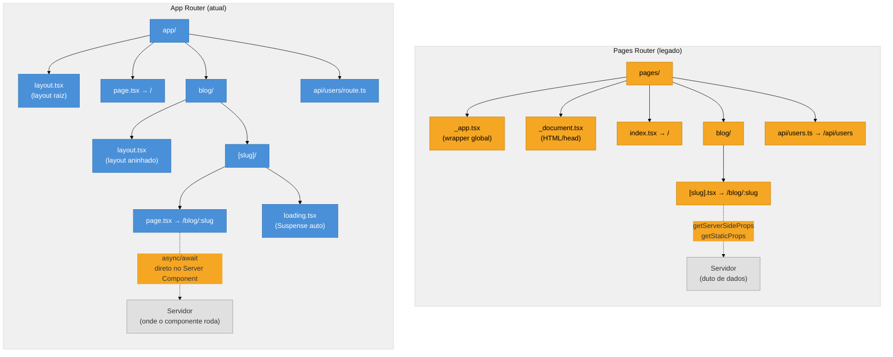

# App Router vs Pages Router

> [!abstract] TL;DR
> O Next.js tem dois roteadores: **Pages Router** (legado, presente desde a v1) e **App Router** (padrão desde v13, obrigatório para novos projetos no v15). O salto não é só de sintaxe — é de paradigma: o Pages Router trata o servidor como um destino para buscar dados e injetar na página; o App Router trata o servidor como o lugar *padrão* onde componentes vivem e executam. Essa inversão — **RSC-first em vez de client-first** — muda a forma de pensar estrutura de pastas, data fetching, layouts e coexistência de código. O Pages Router ainda é suportado e pode coexistir com o App Router no mesmo projeto, o que viabiliza migração incremental, mas em 2026 não existe razão para iniciar um projeto novo nele.

---

Imagine que você entra em uma codebase Next.js herdada. Você abre o repositório e vê uma pasta chamada `pages/`, arquivos como `_app.tsx`, `_document.tsx`, funções exportadas chamadas `getServerSideProps` e `getStaticProps`, e rotas de API em `pages/api/`. Nenhum desses padrões existe no projeto Next.js que você abriu na semana passada. Os dois projetos usam Next.js, mas parecem falar dialetos diferentes.

Não é coincidência — são dois roteadores com filosofias distintas. Entender o contraste entre eles é entender a história e o futuro do Next.js.

---

## O Pages Router: o modelo original

O Pages Router é o sistema de roteamento que o Next.js usou dos seus primórdios até o App Router chegar como padrão estável no Next.js 13. Em 2026 ele ainda é suportado, ainda recebe correções de segurança, mas não recebe funcionalidades novas.

### Como o roteamento funciona

No Pages Router, **cada arquivo dentro de `pages/` vira uma rota**. O mapeamento é direto: `pages/sobre.tsx` → `/sobre`, `pages/blog/[slug].tsx` → `/blog/:slug`. Não existe o conceito de layouts aninhados nativos — você simula layouts com o componente customizado `_app.tsx` que envolve toda a aplicação.

```
pages/
├── _app.tsx          ← wrapper global (substituição do layout raiz)
├── _document.tsx     ← controle do HTML/head do servidor
├── index.tsx         → /
├── sobre.tsx         → /sobre
├── blog/
│   ├── index.tsx     → /blog
│   └── [slug].tsx    → /blog/:slug
└── api/
    └── users.ts      → /api/users  (Route Handler legado)
```

### Os arquivos `_app.tsx` e `_document.tsx`

Dois arquivos especiais existem apenas no Pages Router e não têm equivalente direto no App Router:

- **`_app.tsx`**: envolve todas as páginas — é onde você injeta providers de estado (Redux, React Query), estilos globais e estado persistido entre navegações. No App Router, o equivalente é `app/layout.tsx`, mas com uma diferença crucial: ele é um Server Component por padrão, então providers que usam hooks precisam ser extraídos para um Client Component separado.

- **`_document.tsx`**: controla o HTML bruto gerado no servidor — permite customizar `<html>`, `<body>`, e injetar scripts/meta no `<head>`. No App Router, isso é tratado pela Metadata API e pelo `app/layout.tsx`, sem a necessidade de um arquivo separado.

```tsx
// pages/_app.tsx — padrão do Pages Router
import type { AppProps } from 'next/app'
import { QueryClient, QueryClientProvider } from '@tanstack/react-query'
import '../styles/globals.css'

const queryClient = new QueryClient()

export default function MyApp({ Component, pageProps }: AppProps) {
  return (
    <QueryClientProvider client={queryClient}>
      <Component {...pageProps} />
    </QueryClientProvider>
  )
}
```

### O modelo de data fetching

No Pages Router, componentes são **Client Components por padrão** — eles rodam no cliente. Para buscar dados no servidor, você exporta funções especiais da sua página:

| Função | Quando roda | Usado para |
|--------|-------------|------------|
| `getStaticProps` | No build (ou ISR) | Páginas cujo conteúdo muda pouco |
| `getServerSideProps` | A cada requisição | Páginas que precisam de dados frescos |
| `getInitialProps` | No servidor (1ª req) e cliente (nav interna) | Legado; desaconselhado |

```tsx
// pages/blog/[slug].tsx — Pages Router
import type { GetServerSideProps, InferGetServerSidePropsType } from 'next'

type Props = { post: { title: string; body: string } }

export const getServerSideProps: GetServerSideProps<Props> = async (ctx) => {
  const { slug } = ctx.params!
  const post = await fetchPost(slug as string)
  return { props: { post } }
}

export default function BlogPost({
  post,
}: InferGetServerSidePropsType<typeof getServerSideProps>) {
  return <article><h1>{post.title}</h1><p>{post.body}</p></article>
}
```

O dado vem do servidor via props — o componente em si é um componente React normal que executa no cliente após a hidratação. O servidor existe como um **duto de injeção de dados**, não como o lugar onde o componente roda.

> [!question]- Por que `getInitialProps` é desaconselhado mesmo no Pages Router?
> Porque ele executa **tanto no servidor quanto no cliente** (em navegações internas via `<Link>`), o que torna o comportamento imprevisível e impede algumas otimizações de build. `getStaticProps`/`getServerSideProps` têm semântica clara: server-only, sem ambiguidade.

---

## O App Router: a inversão de paradigma

O App Router, introduzido no Next.js 13 e estável no 13.4, usa a pasta `app/` e é construído sobre **React Server Components (RSC)**. A mudança fundamental: componentes são **server-first por padrão**. Para optar pelo cliente, você declara `'use client'` no topo do arquivo.

Não é uma refatoração do Pages Router — é uma reescrita do modelo mental.

> [!info] RSC é um primitivo do React, não do Next.js
> O App Router _cabeia_ os React Server Components para o file-system routing. Para entender RSC em profundidade — o que é, como a árvore se divide, como a serialização de props funciona — veja [[03-Dominios/Tecnologia/React/React core/23 - Server Components (RSC)|React core 23 — Server Components]]. Esta nota foca em como o Next.js organiza isso.

### Como o roteamento funciona

No App Router, **pastas definem rotas, arquivos especiais definem o UI**. Uma pasta só vira rota acessível se contiver um arquivo `page.tsx`. Layouts, estados de carregamento e tratamento de erros são arquivos separados dentro da mesma pasta.

```
app/
├── layout.tsx        ← layout raiz (obrigatório, envolve toda a app)
├── page.tsx          → /
├── sobre/
│   └── page.tsx      → /sobre
├── blog/
│   ├── layout.tsx    ← layout aninhado (persiste entre páginas de /blog/*)
│   ├── page.tsx      → /blog
│   └── [slug]/
│       ├── page.tsx  → /blog/:slug
│       └── loading.tsx  ← Suspense boundary automático
└── api/
    └── users/
        └── route.ts  → /api/users  (Route Handler do App Router)
```

A diferença estrutural mais importante: **layouts são nativos e aninhados**. Você não precisa de `_app.tsx` para envolver a aplicação — cada pasta pode ter seu próprio `layout.tsx` que persiste na navegação sem re-renderizar.

### Diagrama: comparação das duas árvores



### O modelo de data fetching

No App Router, você simplesmente usa `async/await` dentro de um Server Component. Sem funções exportadas especiais, sem API intermediária:

```tsx
// app/blog/[slug]/page.tsx — App Router (Next.js 15, baseline)
import type { Metadata } from 'next'

type Props = { params: Promise<{ slug: string }> }

export async function generateMetadata({ params }: Props): Promise<Metadata> {
  const { slug } = await params
  const post = await fetchPost(slug)
  return { title: post.title }
}

export default async function BlogPost({ params }: Props) {
  const { slug } = await params          // params é Promise no Next 15
  const post = await fetchPost(slug)     // fetch direto, sem getServerSideProps

  return <article><h1>{post.title}</h1><p>{post.body}</p></article>
}
```

> [!warning] `params` e `searchParams` são Promises no Next.js 15
> No Next 14, `params` era um objeto síncrono: `{ params: { slug: string } }`. No Next 15, **ambos passaram a ser `Promise`** — você precisa de `await params`. Código legado que acessa `params.slug` diretamente quebrará no v15. Se você vir exemplos síncronos, eles são de tutoriais escritos para v14.

---

## Por que o App Router foi criado: o problema com o modelo antigo

O Pages Router funcionava bem, mas tinha um limite estrutural: **todo componente era hydrated no cliente**, mesmo que nunca precisasse de interatividade. Um componente que só exibia o nome do usuário — sem evento, sem estado — gerava JavaScript enviado ao browser, que precisava ser baixado, parseado e executado para a página funcionar.

Além disso, o modelo de "funções exportadas para dados" tinha friccção: `getServerSideProps` e `getStaticProps` são convenções do framework, não do React. Elas criavam uma barreira entre "código de busca de dados" e "código de renderização" que tornava a composição de componentes mais difícil. Um componente filho não podia buscar seus próprios dados no servidor — os dados tinham que descer via props da página.

O App Router resolve os dois problemas:

1. **RSC elimina JavaScript desnecessário**: Server Components não geram bundle — eles executam no servidor e enviam HTML. Apenas os Client Components (declarados com `'use client'`) incluem JavaScript no bundle.

2. **`async/await` no componente**: qualquer Server Component pode buscar seus próprios dados diretamente, sem passar por `getServerSideProps`. A composição volta a ser natural — componentes profundos na árvore podem ser assíncronos e autossuficientes.

```
Pages Router                          App Router
─────────────────────────────────     ────────────────────────────────────
getServerSideProps (server)           Server Component (server, async)
    ↓ props                               ↓ JSX + dados embutidos
Page Component (client, hydrated)     Client Component (client, apenas se necessário)
    ↓ JS bundle                           ↓ bundle menor
Browser                               Browser
```

> [!question]- Por que não tornar tudo server-side e acabar com o cliente?
> Porque interatividade genuína — formulários controlados, animações, estado local de UI, web APIs como geolocalização — só existe no cliente. O modelo RSC não é "cliente é ruim"; é "cliente deve ser opt-in quando realmente necessário, não o default para tudo".

## A inversão em uma frase

| Aspecto | Pages Router | App Router |
|---------|-------------|------------|
| Default do componente | Client (hidratado) | Server (sem JS no cliente) |
| Optar pelo servidor | `getServerSideProps` / `getStaticProps` | Padrão — nada a declarar |
| Optar pelo cliente | Padrão — nada a declarar | `'use client'` no topo |
| Layouts aninhados | Gambiarra via `_app.tsx` | Nativos — `layout.tsx` por pasta |
| Data fetching | Funções exportadas especiais | `async/await` direto no componente |
| Route Handlers (APIs) | `pages/api/*.ts` | `app/**/route.ts` |
| Streaming / Suspense | Limitado, manual | Nativo via `loading.tsx` |

---

## Coexistência: os dois roteadores no mesmo projeto

Este é o ponto mais importante para quem trabalha em migração incremental: **`app/` e `pages/` podem coexistir no mesmo projeto Next.js**. O framework trata cada pasta como um roteador independente, e rotas dos dois podem conviver sem conflito — desde que uma mesma rota não seja definida nos dois lugares ao mesmo tempo.

```
meu-projeto/
├── app/                  ← App Router (novas páginas aqui)
│   ├── layout.tsx
│   ├── dashboard/
│   │   └── page.tsx      → /dashboard  (App Router)
│   └── settings/
│       └── page.tsx      → /settings   (App Router)
└── pages/                ← Pages Router (ainda em produção)
    ├── _app.tsx
    ├── index.tsx          → /           (Pages Router)
    └── sobre.tsx          → /sobre      (Pages Router)
```

Essa coexistência é deliberada: ela permite que equipes **migrem página por página**, sem uma grande reescrita de uma vez.

> [!warning] Estilos do `app/layout.tsx` não vazam para `pages/*`
> Os dois roteadores têm escopos de estilo separados. Se você importar um CSS global em `app/layout.tsx`, ele **não se aplica** a páginas no `pages/`. Mantenha o `_app.tsx` enquanto houver rotas no `pages/` — é ele quem injeta estilos globais para o Pages Router.

> [!warning] Conflito de rota entre os dois roteadores
> Se você definir `/sobre` tanto em `app/sobre/page.tsx` quanto em `pages/sobre.tsx`, o Next.js emitirá um warning e usará o App Router (tem precedência). Isso é fácil de acontecer em migrações apressadas — sempre verifique duplicatas após mover uma página.

---

## Estratégia de migração incremental

A documentação oficial do Next.js recomenda este fluxo para migrar uma página do Pages Router para o App Router:

1. **Crie a rota equivalente em `app/`** com um `page.tsx` simples, inicialmente delegando ao componente legado.
2. **Extraia a lógica de data fetching** de `getServerSideProps`/`getStaticProps` para o corpo assíncrono do Server Component.
3. **Identifique o que precisa de `'use client'`**: estado local, event handlers, hooks de browser. Isole esses pedaços em Client Components.
4. **Delete a rota em `pages/`** — sem o arquivo lá, não há mais conflito.
5. Repita por página até que `pages/` esvazie; então delete a pasta e o `_app.tsx`.

```tsx
// Migração: de getServerSideProps para Server Component

// ANTES — pages/dashboard.tsx
export const getServerSideProps: GetServerSideProps = async (ctx) => {
  const data = await fetchDashboardData(ctx.req.cookies.token)
  return { props: { data } }
}
export default function Dashboard({ data }) { ... }

// DEPOIS — app/dashboard/page.tsx
export default async function Dashboard() {
  const cookieStore = await cookies()           // next/headers (Next 15)
  const token = cookieStore.get('token')?.value
  const data = await fetchDashboardData(token)
  return <DashboardUI data={data} />            // pode ser Server Component puro
}
```

---

## O que é compartilhado entre os dois roteadores

Nem tudo mudou. Alguns recursos do Next.js funcionam em ambos os roteadores sem alteração:

| Recurso | Pages Router | App Router |
|---------|-------------|------------|
| `<Image>` (`next/image`) | ✅ | ✅ |
| `<Link>` (`next/link`) | ✅ | ✅ |
| `<Script>` (`next/script`) | ✅ | ✅ |
| Otimização de fonte (`next/font`) | ✅ | ✅ |
| Middleware (`middleware.ts`) | ✅ | ✅ |
| Variáveis de ambiente | ✅ | ✅ |
| `next.config.js/ts` | ✅ | ✅ |

O Middleware em especial é notável: ele roda na **borda (Edge Runtime)**, antes de qualquer roteador, e funciona para ambos simultaneamente. Se você tem um projeto em coexistência, um único `middleware.ts` protege rotas dos dois routers.

---

## Quando o Pages Router ainda aparece (e o que fazer)

Em 2026, você encontrará Pages Router em:

- **Codebases legadas** criadas antes do Next.js 13 — a migração pode ser longa e não ser prioridade do negócio.
- **Tutoriais e cursos antigos** — muito conteúdo de 2020-2022 usa Pages Router. Reconheça o sinal: se vir `getServerSideProps`, é Pages Router.
- **Projetos em migração parcial** — coexistência proposital até a migração acabar.

O que NÃO fazer: iniciar um projeto novo em Pages Router. A documentação oficial do Next.js 15 apresenta o App Router como o caminho padrão; o Pages Router está na seção "Legacy".

---

## Casos práticos

### Caso 1: Leitura de cookie em rota protegida

No Pages Router, você lia cookies via o objeto `req` dentro de `getServerSideProps`. No App Router, você usa `cookies()` de `next/headers` — mas precisa conhecer a diferença de quando cada abordagem torna a rota dinâmica.

```tsx
// PAGES ROUTER — pages/perfil.tsx
import type { GetServerSideProps } from 'next'

export const getServerSideProps: GetServerSideProps = async ({ req }) => {
  const token = req.cookies['auth-token']
  if (!token) return { redirect: { destination: '/login', permanent: false } }
  const user = await getUserFromToken(token)
  return { props: { user } }
}

export default function Perfil({ user }: { user: User }) {
  return <h1>Olá, {user.name}</h1>
}

// APP ROUTER — app/perfil/page.tsx (Next.js 15)
import { cookies } from 'next/headers'
import { redirect } from 'next/navigation'

export default async function Perfil() {
  const cookieStore = await cookies()          // async no Next 15
  const token = cookieStore.get('auth-token')?.value
  if (!token) redirect('/login')
  const user = await getUserFromToken(token)
  return <h1>Olá, {user.name}</h1>
}
```

O resultado é o mesmo, mas no App Router o componente é **a própria lógica de servidor** — não existe separação entre "função de dados" e "componente de renderização".

### Caso 2: Lista de posts com layout compartilhado

No Pages Router, para ter um layout lateral que persiste entre `/blog`, `/blog/post-a`, `/blog/post-b` sem se re-renderizar, você precisaria de estado global ou de lógica em `_app.tsx`. No App Router, é nativo:

```tsx
// app/blog/layout.tsx — persiste entre todas as rotas /blog/*
export default function BlogLayout({ children }: { children: React.ReactNode }) {
  return (
    <div className="blog-container">
      <aside>
        <BlogSidebar />    {/* Server Component, não re-renderiza na nav */}
      </aside>
      <main>{children}</main>
    </div>
  )
}

// app/blog/page.tsx
export default async function BlogIndex() {
  const posts = await fetchPostList()
  return <ul>{posts.map(p => <li key={p.slug}>{p.title}</li>)}</ul>
}

// app/blog/[slug]/page.tsx
export default async function BlogPost({ params }: { params: Promise<{ slug: string }> }) {
  const { slug } = await params
  const post = await fetchPost(slug)
  return <article><h1>{post.title}</h1><div>{post.content}</div></article>
}
```

O `BlogSidebar` no layout pode ser um Server Component que busca dados uma vez e persiste enquanto o usuário navega entre posts — zero JavaScript para esse sidebar no cliente, zero re-fetch a cada navegação.

---

## Armadilhas comuns

> [!warning] Usar `getServerSideProps` dentro de `app/`
> `getServerSideProps` e `getStaticProps` são exclusivos do Pages Router. Dentro da pasta `app/`, eles são simplesmente ignorados — sem erro, sem aviso no build. Você pensará que está buscando dados no servidor, mas a função nunca será chamada. **Em Server Components do App Router, use `async/await` diretamente.**

> [!warning] Importar hooks de cliente em Server Components
> Server Components não suportam `useState`, `useEffect`, `useRouter` (do `next/navigation` sem `'use client'`), ou qualquer hook que dependa do ambiente do navegador. O erro `You're importing a component that needs ...` aparece em build time. A solução é adicionar `'use client'` ao componente que usa o hook — ou extrair apenas o pedaço interativo para um Client Component separado.

> [!warning] `useRouter` do `next/router` vs `next/navigation`
> O Pages Router usa `import { useRouter } from 'next/router'`. O App Router usa `import { useRouter } from 'next/navigation'`. São APIs diferentes e incompatíveis. Usar o `next/router` em código do App Router causará erros sutis — o hook existe mas o `router.query` não funciona da mesma forma, e rotas programáticas se comportam diferente. **Confirme a origem do import sempre que copiar código de tutoriais.**

> [!warning] Confundir `app/api/*/route.ts` com `pages/api/*.ts`
> Route Handlers do App Router (`route.ts`) e API Routes do Pages Router (`pages/api/*.ts`) têm assinaturas completamente diferentes. No Pages Router: `(req: NextApiRequest, res: NextApiResponse) => void`. No App Router: `(request: NextRequest) => Response | NextResponse`. Copiar uma API Route legada para dentro de `app/` sem adaptar a assinatura quebrará silenciosamente.

---

## Como explicar em inglês

The Next.js Pages Router is the legacy routing system where each file in the `pages/` directory maps to a route, and server-side data fetching happens through exported functions like `getServerSideProps` and `getStaticProps`. The App Router, introduced in Next.js 13 and the default since v15, uses the `app/` directory and is built around React Server Components — components run on the server by default, and you opt into the client with `'use client'`. The fundamental shift is that in the Pages Router the server was a data pipe feeding client components; in the App Router the server is where components actually live and execute.

Both routers can coexist in the same project, which enables incremental migration page by page without a big-bang rewrite.

| PT | EN |
|----|-----|
| Roteador de páginas (legado) | Pages Router |
| Roteador de aplicação | App Router |
| Busca de dados no servidor | Server-side data fetching |
| Componente de servidor | Server Component |
| Componente de cliente | Client Component |
| Migração incremental | Incremental migration |
| Coexistência | Coexistence |
| Layout aninhado | Nested layout |
| Rota dinâmica | Dynamic route |
| Arquivo especial | Special file / file convention |
| Segmento de rota | Route segment |

---

## App Router vs Pages Router em uma frase

O Pages Router trata o servidor como uma fonte de dados que alimenta componentes cliente; o App Router trata o servidor como o ambiente padrão de execução dos componentes — cliente é a exceção declarada.

---

## O que vem a seguir

Agora que você entende o contraste entre os dois roteadores, o próximo passo é aprofundar a mecânica do App Router: como a pasta `app/` organiza rotas com arquivos especiais (`page.tsx`, `layout.tsx`, `loading.tsx`, `error.tsx`), como layouts aninhados funcionam na prática, e como route groups `(grupo)` permitem organizar sem afetar a URL.

- `[[03-Dominios/Tecnologia/React/Next.js/03 - Estrutura de rotas layouts pages loading error|03 — Estrutura de rotas]]` — os arquivos especiais do App Router em detalhe; layouts aninhados; route groups; rotas dinâmicas.
- `[[03-Dominios/Tecnologia/React/Next.js/04 - Server vs Client Components|04 — Server vs Client Components]]` — a boundary `'use client'` e os padrões de composição que o App Router viabiliza.
- `[[03-Dominios/Tecnologia/React/React core/23 - Server Components (RSC)|React core 23 — RSC]]` — o primitivo que fundamenta o App Router.

---

## Fontes

- **Vercel / Next.js Team** — [*App Router Migration Guide*](https://nextjs.org/docs/app/guides/migrating/app-router-migration) — guia oficial de migração incremental Pages → App Router
- **Vercel / Next.js Team** — [*Pages Router Docs*](https://nextjs.org/docs/pages) — referência do roteador legado (ainda mantida)
- **Vercel / Next.js Team** — [*App Router Docs*](https://nextjs.org/docs/app) — referência do App Router (baseline Next 15)
- **Vercel / Next.js Team** — [*Project Structure*](https://nextjs.org/docs/app/getting-started/project-structure) — convenções de arquivos especiais do App Router
- **Vercel / Next.js Team** — [*Next.js 15 Release Blog*](https://nextjs.org/blog/next-15) — changelog e mudanças de defaults (params como Promise, caching uncached-by-default)
