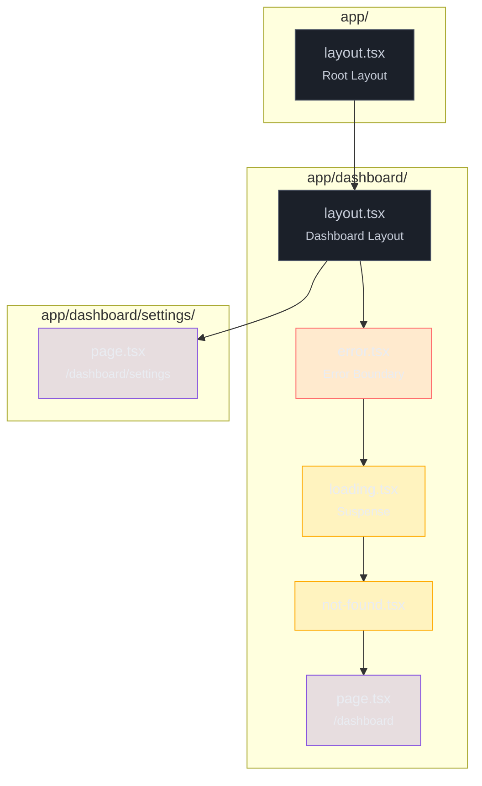

# Estrutura de rotas: layouts, pages, loading, error

> [!abstract] TL;DR
> O App Router do Next.js usa **arquivos especiais dentro de pastas** para montar a UI de cada rota. Cada segmento da URL corresponde a uma pasta; dentro dela, `page.tsx` torna a rota acessível, `layout.tsx` envolve com UI persistente, `loading.tsx` adiciona um fallback Suspense automático, e `error.tsx` isola falhas sem derrubar o resto da página. Layouts **preservam estado** entre navegações — o React não desmonta o componente ao trocar de página dentro do mesmo layout. Route groups `(grupo)` organizam pastas sem afetar a URL. Rotas dinâmicas usam `[slug]`, `[...slug]` e `[[...slug]]` com graus crescentes de flexibilidade. Todos os props de rota (`params`, `searchParams`) são **Promises no Next 15** — sempre faça `await`.

---

Imagine que você está construindo um dashboard com sidebar, header e área de conteúdo. A sidebar aparece em todas as páginas; o header muda o título por seção; o conteúdo troca a cada clique. Em React puro, você repetiria esse wrapper em cada componente de página — ou criaria um sistema próprio de roteamento com contextos e condicionais.

O App Router resolve isso com uma convenção simples: **a estrutura de pastas é a estrutura da UI**. Cada pasta é um segmento da URL. Cada arquivo especial dentro dela define uma camada do que aparece na tela. O framework monta as camadas como bonecas russas, de fora para dentro.

---

## A hierarquia de arquivos e o que cada um resolve

Antes de ver cada arquivo, é útil enxergar a ordem em que o Next os empilha. Dado um segmento de rota, o componente renderizado segue esta hierarquia, do mais externo ao mais interno:

```
layout.tsx          ← UI persistente, não desmonta
  template.tsx      ← como layout, mas remonta a cada navegação
    error.tsx       ← Error Boundary automático por segmento
      loading.tsx   ← Suspense boundary automático
        not-found.tsx ← renderizado quando notFound() é chamado
          page.tsx  ← conteúdo único da rota
```

Cada camada **só envolve as abaixo dela no mesmo segmento**. O `error.tsx` não captura erros do `layout.tsx` acima — só do `page.tsx` e layouts filhos. Isso é intencional: se o layout quebrar, não há onde renderizar o fallback de erro.



---

> [!tip] Assista: Learn Next.js 15 Routing Files in 30 Minutes
> **Canal:** Codevolution | **Duração:** ~33min | **Idioma:** EN
>
> Walkthrough prático dos 9 arquivos especiais do App Router no Next.js 15 — cada arquivo com demo ao vivo no VS Code mostrando o comportamento real no browser: `layout.tsx` persistindo enquanto só o `page.tsx` troca, o spinner do `loading.tsx` aparecendo e sumindo, o `error.tsx` com botão de recuperação chamando `reset()`. Uma forma de *ver em ação* os mesmos mecanismos que esta nota explica conceitualmente. Trecho de destaque [9:33]: *"loading.tsx leverages React Suspense under the hood to automatically wrap your route segments and pages."*
>
> 🎬 [Assistir no YouTube](https://www.youtube.com/watch?v=5z_iuK4i3js)

---

## `page.tsx` — tornando a rota acessível

Sem `page.tsx`, a pasta existe no sistema de arquivos mas a rota **não é acessível ao público**. O arquivo é a porta de entrada de cada URL.

```tsx
// app/blog/[slug]/page.tsx
import { notFound } from 'next/navigation'

// No Next 15, params é uma Promise — sempre await
type Props = {
  params: Promise<{ slug: string }>
  searchParams: Promise<{ [key: string]: string | string[] | undefined }>
}

export default async function BlogPostPage({ params, searchParams }: Props) {
  const { slug } = await params
  const { draft } = await searchParams

  const post = await fetchPost(slug)
  if (!post) notFound()

  return <article>{/* conteúdo */}</article>
}
```

> [!warning] `params` e `searchParams` são Promises no Next 15
> No Next 14 eram objetos síncronos: `{ params }: { params: { slug: string } }`. No Next 15, **ambos viraram `Promise`** — acessar diretamente sem `await` retorna o objeto Promise, não o valor. O TypeScript ajuda aqui se você tipar com `Promise<...>`.

---

## `layout.tsx` — UI que persiste entre navegações

O layout envolve `{children}` — que pode ser um `page.tsx` ou outro `layout.tsx` aninhado. O ponto crítico: **o layout não é desmontado quando o usuário navega** entre páginas dentro do mesmo segmento. O React mantém o componente na árvore, preservando estado local, scroll, campos de formulário.

```tsx
// app/layout.tsx — Root Layout (obrigatório)
import type { Metadata } from 'next'

export const metadata: Metadata = {
  title: { template: '%s | Meu App', default: 'Meu App' },
}

export default function RootLayout({ children }: { children: React.ReactNode }) {
  return (
    <html lang="pt-BR">
      <body>
        <header>/* navegação global */</header>
        {children}
        <footer>/* rodapé */</footer>
      </body>
    </html>
  )
}
```

O Root Layout (`app/layout.tsx`) é o único obrigatório. Ele **deve conter `<html>` e `<body>`** — é onde o Next injeta metadados, fontes e scripts. Nenhum outro layout precisa desses elementos.

Layouts aninhados acumulam: `/dashboard/settings` passa por Root Layout → Dashboard Layout → página. O children de cada layout é o próximo nível da hierarquia.

> [!question]- Por que o layout não re-renderiza ao trocar de página?
> Porque o React reconcilia a árvore entre renderizações. Se o componente `DashboardLayout` aparece no mesmo lugar da árvore antes e depois da navegação, o React o **mantém montado** — só o `{children}` (o `page.tsx`) é substituído. Isso é o mesmo comportamento de qualquer componente React que recebe props diferentes: ele atualiza, mas não reinicia do zero.

---

## `loading.tsx` — Suspense sem esforço

> [!info] Pré-requisito: Suspense
> `loading.tsx` é açúcar sintático sobre o `<Suspense>` do React. Se você ainda não conhece o mecanismo de Suspense — como o React suspende a renderização e exibe o fallback — veja [[03-Dominios/Tecnologia/React/React core/19 - Suspense e data fetching no cliente|React core 19]] antes de continuar. Aqui o foco é em como o Next automatiza isso por segmento.

Coloque um `loading.tsx` em qualquer pasta e o Next envolve automaticamente o `page.tsx` (e layouts filhos) num `<Suspense fallback={<Loading />}>`. O usuário vê o loading imediatamente enquanto o Server Component do `page.tsx` ainda está processando no servidor.

```tsx
// app/dashboard/loading.tsx
export default function DashboardLoading() {
  return (
    <div className="animate-pulse">
      <div className="h-8 bg-gray-200 rounded w-1/3 mb-4" />
      <div className="h-64 bg-gray-200 rounded" />
    </div>
  )
}
```

Isso também habilita **streaming**: o HTML do layout chega primeiro ao browser, o fallback aparece, e o conteúdo da página "pinga" assim que fica pronto — tudo sem JavaScript adicional no cliente.

---

## `error.tsx` — Error Boundary automático por segmento

> [!info] Pré-requisito: Error Boundaries
> `error.tsx` é um Error Boundary do React configurado automaticamente pelo Next para cada segmento. Se você não conhece o mecanismo de Error Boundary — como o React captura erros em render e exibe fallback — veja [[03-Dominios/Tecnologia/React/React core/18 - Error boundaries|React core 18]]. Aqui o foco é em **como o Next cabeia**: scope por segmento de rota, props específicos do framework, e a diferença entre `reset` e `unstable_retry`.

`error.tsx` **deve ser um Client Component** (`'use client'`). Isso porque o Error Boundary do React precisa de estado interno para rastrear se houve erro — e estado é Client Component. O Next faz isso automaticamente se você adicionar a diretiva.

```tsx
// app/dashboard/error.tsx
'use client'

import { useEffect } from 'react'

type ErrorProps = {
  error: Error & { digest?: string }
  reset: () => void
}

export default function DashboardError({ error, reset }: ErrorProps) {
  useEffect(() => {
    // logar para serviço de observabilidade
    console.error('Dashboard error:', error)
  }, [error])

  return (
    <div className="error-container">
      <h2>Algo deu errado no dashboard</h2>
      <p className="text-sm text-gray-500">
        {error.digest && `ID: ${error.digest}`}
      </p>
      <button onClick={reset}>Tentar novamente</button>
    </div>
  )
}
```

O prop `reset` limpa o estado de erro e tenta re-renderizar o segmento. Mas atenção: se o erro veio de um Server Component (ex: falha ao buscar dados), `reset` apenas re-renderiza o cliente — **não re-busca dados do servidor**.

> [!info] Next 16.2 — `unstable_retry()`
> A partir do Next 16.2, `error.tsx` recebe também `unstable_retry()`. Essa função executa `router.refresh()` + `reset()` dentro de uma transição, re-buscando dados do servidor e re-renderizando o segmento. Use `unstable_retry` quando o erro pode ter sido transitório (timeout, instabilidade de rede); use `reset` quando quer apenas re-tentar a renderização local.

**Escopo do error.tsx:** o boundary captura erros do `page.tsx` e de layouts/segmentos filhos. Ele **não captura** erros do `layout.tsx` do mesmo nível — para isso, você precisaria de um `error.tsx` no segmento pai.

> [!warning] `error.tsx` não captura erros do `layout.tsx` vizinho
> Se `app/dashboard/layout.tsx` lançar um erro, o `app/dashboard/error.tsx` **não o captura** — eles estão no mesmo nível. O boundary que captura esse erro está em `app/error.tsx` (nível acima). Projete layouts robustos; não dependa do error boundary do mesmo segmento para protegê-los.

---

## `not-found.tsx` — rotas e recursos inexistentes

`not-found.tsx` é renderizado em dois casos: quando a URL não corresponde a nenhuma rota conhecida, ou quando o código chama `notFound()` explicitamente (por exemplo, após buscar um recurso no banco e não encontrá-lo).

```tsx
// app/blog/[slug]/page.tsx
import { notFound } from 'next/navigation'

export default async function BlogPostPage({ params }: Props) {
  const { slug } = await params
  const post = await db.post.findUnique({ where: { slug } })

  if (!post) notFound() // renderiza app/blog/not-found.tsx (ou app/not-found.tsx)

  return <article>{post.title}</article>
}
```

`notFound()` lança uma exceção especial que o Next captura — não é uma exceção de erro comum, então não ativa o `error.tsx`.

---

## `template.tsx` — quando você precisa que a UI reinicie

Layout e template são parecidos, mas com uma diferença crucial: o `layout.tsx` mantém o componente montado; o `template.tsx` cria uma **nova instância a cada navegação** (recebe uma `key` única baseada no segmento + params).

Use `template.tsx` quando precisar que animações de entrada rodem a cada transição de página, ou quando efeitos colaterais devem executar por página (não por montagem de layout):

```tsx
// app/(marketing)/template.tsx
'use client'
import { motion } from 'framer-motion'

export default function MarketingTemplate({ children }: { children: React.ReactNode }) {
  return (
    <motion.div
      initial={{ opacity: 0, y: 8 }}
      animate={{ opacity: 1, y: 0 }}
      transition={{ duration: 0.3 }}
    >
      {children}
    </motion.div>
  )
}
```

Na prática, `template.tsx` é menos comum. Na dúvida, prefira `layout.tsx`.

---

## Layouts aninhados — como a composição funciona na prática

Considere esta estrutura de pastas:

```
app/
├── layout.tsx           ← Root Layout (html/body)
├── page.tsx             ← rota /
└── dashboard/
    ├── layout.tsx       ← Dashboard Layout (sidebar)
    ├── page.tsx         ← rota /dashboard
    └── settings/
        └── page.tsx     ← rota /dashboard/settings
```

Quando o usuário acessa `/dashboard/settings`, o Next renderiza:

```
RootLayout
  └── DashboardLayout  (sidebar, navbar do dashboard)
        └── SettingsPage
```

Quando navega para `/dashboard`, o `DashboardLayout` **não desmonta** — só o `{children}` muda de `SettingsPage` para `DashboardPage`. Estado dentro do `DashboardLayout` (por exemplo, um filtro selecionado na sidebar) **persiste** entre essas navegações.

---

## Route groups `(grupo)` — organização sem mudar a URL

O nome da pasta entre parênteses é **ignorado na URL**. Serve para organizar rotas logicamente e atribuir layouts distintos a grupos sem criar segmentos extras na URL.

```
app/
├── (marketing)/
│   ├── layout.tsx       ← layout de marketing (sem sidebar)
│   ├── page.tsx         ← rota /
│   ├── about/
│   │   └── page.tsx     ← rota /about
│   └── pricing/
│       └── page.tsx     ← rota /pricing
└── (app)/
    ├── layout.tsx       ← layout autenticado (com sidebar)
    └── dashboard/
        └── page.tsx     ← rota /dashboard
```

`/about` e `/dashboard` existem na mesma raiz da URL, mas usam layouts completamente diferentes. Sem route groups, você teria que criar uma pasta intermediária que apareceria na URL (`/app/dashboard`).

> [!warning] Múltiplos Root Layouts
> Se você criar um `layout.tsx` dentro de cada route group e **remover** o `app/layout.tsx` do topo, cada grupo terá seu próprio Root Layout independente. Nesse caso, cada grupo deve ter `<html>` e `<body>`. Use com cautela — navegações entre grupos causam um **hard refresh** completo da página, não uma transição SPA.

---

## Rotas dinâmicas

Quando o segmento da URL é variável (um slug, um ID, um username), use colchetes no nome da pasta:

| Pasta | URL correspondente | `params` recebido |
|---|---|---|
| `[slug]` | `/posts/meu-artigo` | `{ slug: 'meu-artigo' }` |
| `[...slug]` | `/docs/a/b/c` | `{ slug: ['a', 'b', 'c'] }` |
| `[[...slug]]` | `/docs` ou `/docs/a/b` | `{ slug: undefined }` ou `{ slug: ['a', 'b'] }` |

**`[slug]`** captura exatamente um segmento. Não bate em `/blog/a/b`.

**`[...slug]`** (catch-all) captura um ou mais segmentos como array. A rota `/docs` **sem** parâmetros retorna 404 — o array precisa de pelo menos um elemento.

**`[[...slug]]`** (optional catch-all) captura zero ou mais segmentos. A rota `/docs` bate com `slug: undefined`; `/docs/a/b` bate com `slug: ['a', 'b']`. Útil para páginas de categoria onde a raiz também existe.

```tsx
// app/docs/[[...slug]]/page.tsx
type Props = {
  params: Promise<{ slug?: string[] }>
}

export default async function DocsPage({ params }: Props) {
  const { slug } = await params
  // slug pode ser undefined (rota /docs) ou ['api', 'reference'] (rota /docs/api/reference)
  const path = slug ? slug.join('/') : 'index'

  return <DocContent path={path} />
}
```

> [!warning] Ordem de precedência entre rotas
> Se existirem `app/blog/novo/page.tsx` (rota estática) e `app/blog/[slug]/page.tsx` (dinâmica), a URL `/blog/novo` sempre bate na **rota estática**. O Next dá precedência a segmentos literais sobre dinâmicos. Só crie segmentos estáticos se quiser sobrescrever a dinâmica para aquele valor específico.

---

## Casos práticos

### Cenário 1: E-commerce com layouts distintos por área via route groups

Uma loja virtual tem três áreas com UI radicalmente diferente: vitrine pública (header com busca, banner), conta do cliente (sidebar com menu de pedidos) e checkout (sem distrações, barra de progresso). Criar uma pasta intermediária na URL (`/loja/produto`) seria inaceitável — a URL deve ser `/produto`.

Route groups resolvem isso sem poluir a URL:

```
app/
├── (store)/
│   ├── layout.tsx          ← header com busca + banner promocional
│   ├── page.tsx            ← /  (vitrine)
│   └── produto/[slug]/
│       ├── loading.tsx     ← skeleton do produto enquanto busca dados
│       └── page.tsx        ← /produto/tenis-air-max
├── (account)/
│   ├── layout.tsx          ← sidebar com "Pedidos / Endereços / Pagamentos"
│   └── pedidos/
│       └── page.tsx        ← /pedidos
└── (checkout)/
    ├── layout.tsx          ← layout minimalista, sem sidebar, sem header
    └── page.tsx            ← /checkout
```

```tsx
// app/(account)/layout.tsx
export default function AccountLayout({ children }: { children: React.ReactNode }) {
  return (
    <div className="flex min-h-screen">
      <AccountSidebar />
      <main className="flex-1 p-8">{children}</main>
    </div>
  )
}
```

O `loading.tsx` em `produto/[slug]/` exibe um skeleton enquanto o Server Component busca dados do catálogo — sem bloquear a interatividade do `(store)/layout.tsx` acima, que já está renderizado.

### Cenário 2: SaaS multi-tenant com `[tenant]` dinâmico + loading e error por segmento

Um SaaS B2B serve workspaces isolados por prefixo da URL: `/acme/dashboard`, `/globex/reports`. O segmento dinâmico `[tenant]` captura o identificador e todos os layouts aninhados herdam o contexto do tenant.

```
app/
└── [tenant]/
    ├── layout.tsx          ← valida tenant; injeta contexto via Server Component
    ├── loading.tsx         ← spinner enquanto valida + busca dados do tenant
    ├── error.tsx           ← "Workspace não encontrado ou sem acesso"
    ├── not-found.tsx       ← tenant inválido após notFound()
    └── dashboard/
        ├── loading.tsx     ← skeleton do dashboard (independente do tenant/loading)
        └── page.tsx        ← /acme/dashboard
```

```tsx
// app/[tenant]/layout.tsx
import { notFound } from 'next/navigation'

type Props = { children: React.ReactNode; params: Promise<{ tenant: string }> }

export default async function TenantLayout({ children, params }: Props) {
  const { tenant } = await params
  const workspace = await db.workspace.findUnique({ where: { slug: tenant } })
  if (!workspace) notFound()

  return (
    <WorkspaceProvider workspace={workspace}>
      <TenantHeader workspace={workspace} />
      {children}
    </WorkspaceProvider>
  )
}
```

```tsx
// app/[tenant]/error.tsx
'use client'
export default function TenantError({ reset }: { error: Error; reset: () => void }) {
  return (
    <div className="p-8 text-center">
      <p>Erro ao carregar o workspace.</p>
      <button onClick={reset}>Tentar novamente</button>
    </div>
  )
}
```

O `dashboard/loading.tsx` exibe o skeleton do conteúdo interno enquanto o `[tenant]/layout.tsx` já validou o tenant e renderizou o header — dois níveis de Suspense independentes, controlados pela hierarquia de pastas.

---

## Armadilhas comuns

> [!warning] `searchParams` direto em layout.tsx não existe
> Layouts **não recebem** `searchParams` como prop — apenas `params`. Isso é intencional: o layout não deve ser afetado por query strings (que mudam a cada requisição e quebrariam o cache). Para ler `searchParams` num layout, você precisaria de um Client Component filho usando `useSearchParams()`.

> [!warning] Exportar um Server Component de `error.tsx`
> `error.tsx` **exige** `'use client'`. Se você exportar um Server Component (sem a diretiva), o Next lançará um erro em tempo de build ou runtime. O motivo técnico: Error Boundaries no React são inerentemente stateful — precisam rastrear se houve erro — e estado pertence ao cliente.

> [!warning] Esperar que `loading.tsx` funcione para erros síncronos
> `loading.tsx` só exibe o fallback enquanto o Server Component está **suspendendo** (aguardando dados assíncronos). Um erro síncrono (ex: `throw new Error()` no topo do componente, antes de qualquer `await`) **não** passa pelo Suspense — vai direto para o `error.tsx`. Se o fallback de loading nunca aparecer, o erro provavelmente é síncrono.

---

## Como explicar em inglês

*Pergunta comum em entrevistas:* "Walk me through how Next.js App Router handles nested layouts."

> "In the App Router, each folder is a route segment, and special files inside it define layers of UI. A `layout.tsx` wraps the content below it and persists across navigations — React keeps it mounted, so state is preserved when the user moves between pages under the same layout. A `page.tsx` makes a route publicly accessible. `loading.tsx` automatically adds a Suspense boundary, and `error.tsx` wraps the segment in a React Error Boundary — but it must be a Client Component because Error Boundaries rely on React state. Route groups with parenthesized names let you organize folders without adding URL segments, and dynamic segments with brackets capture variable parts of the URL at runtime."

| PT | EN |
|---|---|
| Arquivo especial | Special file / file convention |
| Layout aninhado | Nested layout |
| Estado preservado | State preserved / state persisted |
| Limite de erro | Error boundary |
| Grupo de rotas | Route group |
| Rota dinâmica | Dynamic route |
| Segmento catch-all | Catch-all segment |
| Segmento opcional | Optional catch-all segment |
| Suspense boundary automático | Automatic Suspense boundary |
| Remonta a cada navegação | Remounts on every navigation |

---

## X em uma frase

O App Router transforma a estrutura de pastas em camadas de UI: `layout` persiste, `page` troca, `loading` suspende, `error` isola — e tudo se compõe automaticamente, de fora para dentro.

---

## O que vem a seguir

Entender os arquivos especiais é o alicerce. O próximo passo natural é compreender *qual* tipo de componente vive em cada arquivo — Server ou Client — porque isso determina o que pode ser feito em cada camada. Um `layout.tsx` é Server Component por padrão; um `error.tsx` é Client Component obrigatório. Essa distinção tem consequências diretas em como você passa dados e onde o JavaScript roda.

- [[03-Dominios/Tecnologia/React/Next.js/04 - Server vs Client Components|Nota 04 — Server vs Client Components]] — a fronteira `'use client'`, serialização de props e padrões de composição
- [[03-Dominios/Tecnologia/React/Next.js/01 - O que é o Next.js e por que existe|Nota 01 — O que é o Next.js]] — contexto do meta-framework e por que o App Router existe
- [[03-Dominios/Tecnologia/React/Next.js/02 - App Router vs Pages Router|Nota 02 — App Router vs Pages Router]] — comparação com o modelo legado e migração

---

## Referências

- **Next.js Team** — [*File Conventions: layout.js*](https://nextjs.org/docs/app/api-reference/file-conventions/layout) — referência oficial da API de layout
- **Next.js Team** — [*File Conventions: error.js*](https://nextjs.org/docs/app/api-reference/file-conventions/error) — props `error`, `reset` e `unstable_retry`
- **Next.js Team** — [*File Conventions: loading.js*](https://nextjs.org/docs/app/api-reference/file-conventions/loading) — Suspense automático por segmento
- **Next.js Team** — [*File Conventions: template.js*](https://nextjs.org/docs/app/api-reference/file-conventions/template) — diferença entre layout e template
- **Next.js Team** — [*File Conventions: Route Groups*](https://nextjs.org/docs/app/api-reference/file-conventions/route-groups) — organização sem afetar URL
- **Next.js Team** — [*Dynamic Routes*](https://nextjs.org/docs/app/building-your-application/routing/dynamic-routes) — `[slug]`, `[...slug]`, `[[...slug]]`
- **Next.js Team** — [*Getting Started: Layouts and Pages*](https://nextjs.org/docs/app/getting-started/layouts-and-pages) — introdução oficial ao sistema de arquivos
- **Next.js Blog** — [*Next.js 16.2*](https://nextjs.org/blog/next-16-2) — `unstable_retry()` em `error.tsx`
