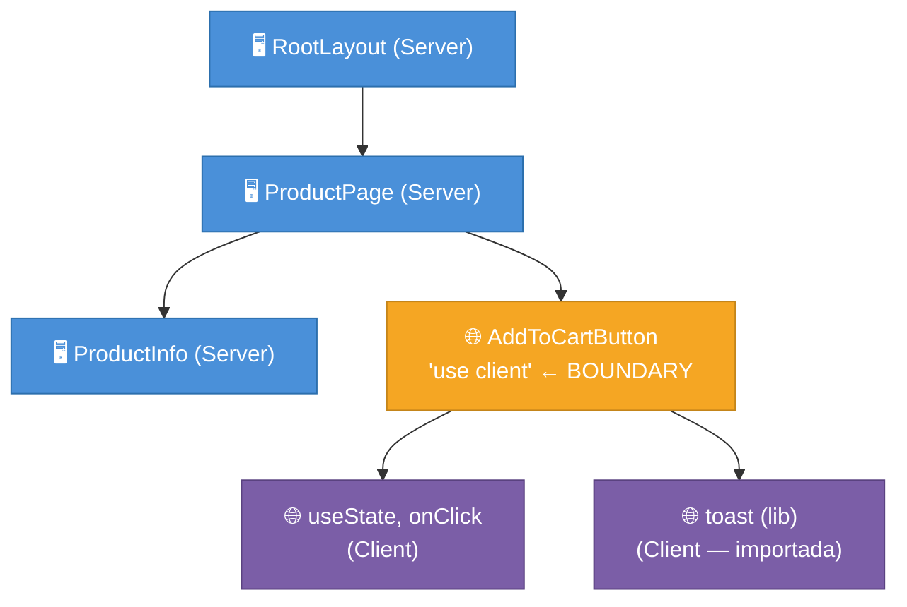
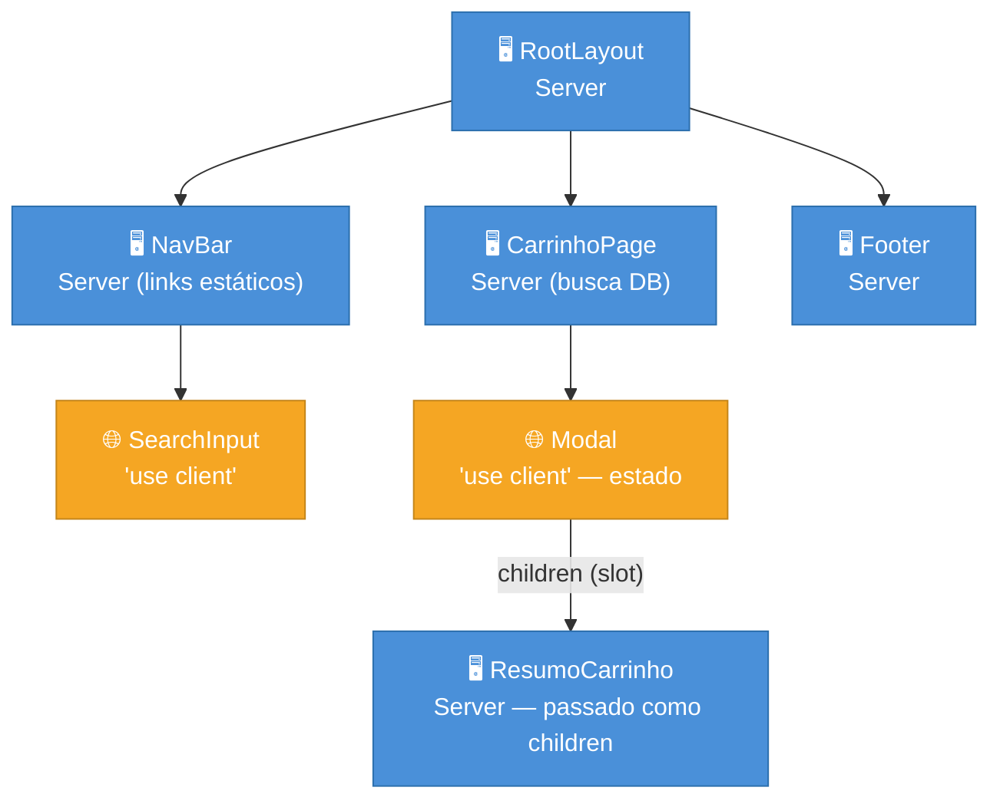

# Server vs Client Components

> [!info] Pré-requisito: React Server Components (RSC)
> Esta nota foca em **como o Next.js organiza os RSC no App Router** — routing, tree, composição, regras de boundary. A primitiva em si (o que é RSC, como o React a implementa, o RSC Payload) mora em [[03-Dominios/Tecnologia/React/React core/23 - Server Components (RSC)|React core 23]]. Leia lá primeiro se ainda não conhece o modelo.

> [!abstract] TL;DR
> No App Router, **todo componente é Server Component por padrão**. Para criar um Client Component, você adiciona `'use client'` no topo do arquivo — e isso transforma o arquivo em um **entry point do bundle do cliente**: tudo que aquele arquivo importa também entra no bundle. O boundary não é por componente, é por módulo. Para manter componentes de servidor dentro de uma árvore de cliente, a técnica é passá-los como `children` ou prop — eles continuam rodando no servidor e chegam ao cliente como HTML pré-renderizado, nunca como JavaScript.

---

## O problema que essa distinção resolve

Imagine que você tem uma página de produto com três partes: o título e descrição (texto estático buscado do banco), uma galeria de imagens (estática também), e um botão "Adicionar ao carrinho" (interativo — precisa de estado, evento de clique, toast de confirmação).

Na arquitetura antiga (Pages Router), toda a página, incluindo título e descrição, precisava de JavaScript no cliente para hidratar — mesmo que aquelas partes nunca mudassem. O bundle crescia, o Time to Interactive (TTI) aumentava.

O App Router inverte o default: se um componente não precisa de interatividade, ele **não vai para o bundle**. Você só carrega JavaScript do cliente onde é estritamente necessário. A distinção Server vs Client Components é o mecanismo que torna isso possível — e entendê-la é a chave para usar o App Router bem.

---

## Server Components: o estado natural no App Router

Quando você cria um arquivo em `app/`, qualquer componente exportado de lá é, por padrão, um Server Component. Não precisa declarar nada — é o estado natural.

```tsx
// app/produto/[slug]/page.tsx
// Este arquivo NÃO tem 'use client' — é Server Component por padrão

import { db } from "@/lib/db";

interface PageProps {
  params: Promise<{ slug: string }>;
}

export default async function ProdutoPage({ params }: PageProps) {
  const { slug } = await params;
  const produto = await db.produto.findUnique({ where: { slug } });

  return (
    <article>
      <h1>{produto.nome}</h1>
      <p>{produto.descricao}</p>
      <p>R$ {produto.preco.toFixed(2)}</p>
    </article>
  );
}
```

O que esse componente pode fazer:
- `async/await` direto no corpo — sem `useEffect`, sem `getServerSideProps`
- Acessar banco, filesystem, variáveis de ambiente secretas
- Reduzir o bundle do cliente a zero (não envia nada de JS para este componente)

O que ele **não pode** fazer:
- `useState`, `useEffect`, `useReducer` e qualquer outro hook de cliente
- Event handlers (`onClick`, `onChange`, etc.)
- APIs do browser (`window`, `document`, `localStorage`)
- Context via `useContext` (pode *fornecer* contexto, mas não *consumir*)

---

## O boundary `'use client'`: não é um decorator, é uma fronteira de módulo

> [!question]- Por que `'use client'` muda todo o módulo, não só o componente?
> Porque o compilador do Next precisa saber o que incluir no bundle do cliente **em tempo de build**. A granularidade é o módulo (arquivo), não o componente. Um arquivo com `'use client'` sinaliza: "este módulo e tudo que ele importa pertence ao grafo de módulos do cliente".

A diretiva `'use client'` vai na **primeira linha do arquivo**, antes de qualquer import:

```tsx
// components/AddToCartButton.tsx
"use client";

import { useState } from "react";
import { toast } from "sonner";

interface Props {
  produtoId: string;
}

export function AddToCartButton({ produtoId }: Props) {
  const [loading, setLoading] = useState(false);

  async function handleClick() {
    setLoading(true);
    await adicionarAoCarrinho(produtoId);
    toast.success("Adicionado ao carrinho!");
    setLoading(false);
  }

  return (
    <button onClick={handleClick} disabled={loading}>
      {loading ? "Adicionando..." : "Adicionar ao carrinho"}
    </button>
  );
}
```

> [!warning] `'use client'` contamina tudo que o arquivo importa
> Quando você marca um arquivo com `'use client'`, **todos os módulos que ele importa** também entram no bundle do cliente — mesmo que você nunca use a maioria deles no browser. Se `AddToCartButton.tsx` importar uma lib de criptografia pesada por engano, ela vai para o bundle. Mantenha Client Components enxutos e revise o que eles importam.

### O que muda no comportamento da árvore

Pense no `'use client'` como uma linha no mapa da sua árvore de componentes. Tudo **acima** da linha é servidor. Tudo **abaixo** (incluindo o arquivo com a diretiva) é cliente.



A fronteira (boundary) existe uma vez — no arquivo com `'use client'`. Não é necessário repetir a diretiva nos filhos; eles já fazem parte do grafo do cliente.

---

## Serialização de props: o que pode e não pode cruzar a fronteira

Quando um Server Component passa dados para um Client Component via props, esses dados precisam ser **serializáveis**. O motivo é que o Next precisa enviar os dados do servidor para o cliente como parte do RSC Payload (um formato compacto parecido com JSON estendido).

### O que pode cruzar

| Tipo | Exemplo | Pode cruzar? |
|------|---------|-------------|
| String | `"texto"` | ✅ Sim |
| Number | `42`, `3.14` | ✅ Sim |
| Boolean | `true`, `false` | ✅ Sim |
| null / undefined | `null` | ✅ Sim |
| Array de serializáveis | `[1, 2, 3]` | ✅ Sim |
| Object plain | `{ id: 1, nome: "..." }` | ✅ Sim |
| Date | `new Date()` | ✅ Sim (serializado) |
| Function | `() => {}` | ❌ Não |
| Instância de classe | `new Produto()` | ❌ Não |
| Symbol | `Symbol("x")` | ❌ Não |
| Map / Set | `new Map()` | ❌ Não (use array) |
| Promise | `Promise<T>` | ✅ Sim (React 19 aceita) |

```tsx
// ✅ Correto: passa apenas dados serializáveis
// app/produto/[slug]/page.tsx (Server Component)
import { AddToCartButton } from "@/components/AddToCartButton";

export default async function ProdutoPage({ params }: PageProps) {
  const { slug } = await params;
  const produto = await db.produto.findUnique({ where: { slug } });

  return (
    <div>
      <h1>{produto.nome}</h1>
      {/* Passa string (serializável) */}
      <AddToCartButton produtoId={produto.id} nomeProduto={produto.nome} />
    </div>
  );
}
```

> [!warning] Funções não cruzam o boundary Server → Client
> Se você tentar passar uma função de um Server Component como prop para um Client Component, o Next vai lançar um erro em runtime: *"Functions cannot be passed directly to Client Components unless you explicitly expose it by marking it with 'use server'."*
>
> A exceção são **Server Actions** (funções marcadas com `'use server'` — nota 06 do galho): essas podem ser passadas como props porque o Next as transforma em referências RPC, não em closures JavaScript.

---

## Padrões de composição: Server dentro de Client

O cenário mais comum que confunde quem chega do Pages Router: *"Preciso de estado (Client), mas também quero Server Components dentro da mesma área da tela. Como faço?"*

A resposta é o **padrão de slot via `children`** (também chamado de "donut pattern").

### O problema sem o padrão

```tsx
// ❌ ERRADO — não compila
"use client";

import { ServidorPesado } from "./ServidorPesado"; // Server Component

export function Modal({ aberto }: { aberto: boolean }) {
  // Tentativa de importar um Server Component dentro de um Client Component
  // Isso não funciona: ServidorPesado vira Client Component por contágio
  return aberto ? <ServidorPesado /> : null;
}
```

> [!warning] Importar um Server Component dentro de um Client Component o transforma em Client Component
> Quando um arquivo com `'use client'` importa outro componente, esse componente entra no bundle do cliente — independentemente de como ele foi escrito. Ele perde as capacidades de servidor (acesso a banco, variáveis secretas, bundle zero). Se você precisar de um componente no servidor e outro no cliente na mesma área, use o padrão de `children`.

### A solução: `children` como slot

```tsx
// components/Modal.tsx — Client Component (precisa de estado para abrir/fechar)
"use client";

import { useState } from "react";

interface ModalProps {
  children: React.ReactNode; // O slot — pode receber Server Components!
  triggerLabel: string;
}

export function Modal({ children, triggerLabel }: ModalProps) {
  const [aberto, setAberto] = useState(false);

  return (
    <>
      <button onClick={() => setAberto(true)}>{triggerLabel}</button>
      {aberto && (
        <div role="dialog">
          <button onClick={() => setAberto(false)}>Fechar</button>
          {children} {/* Renderizado no servidor — chega como HTML */}
        </div>
      )}
    </>
  );
}
```

```tsx
// app/carrinho/page.tsx — Server Component que orquestra
import { Modal } from "@/components/Modal";
import { ResumoCarrinho } from "@/components/ResumoCarrinho"; // Server Component

export default async function CarrinhoPage() {
  const itens = await db.carrinho.findMany({ where: { userId: await getUserId() } });

  return (
    <main>
      <h1>Carrinho</h1>
      {/* ResumoCarrinho roda no servidor; Modal gerencia o estado de abrir/fechar no cliente */}
      <Modal triggerLabel="Ver resumo">
        <ResumoCarrinho itens={itens} />
      </Modal>
    </main>
  );
}
```

Por que funciona: `ResumoCarrinho` é passado como `children`, não importado por `Modal`. O Next renderiza `ResumoCarrinho` **no servidor** e envia o HTML resultante. `Modal` recebe esse HTML como `children` e apenas o posiciona no DOM — sem precisar reprocessar o JavaScript do servidor.

O mesmo padrão funciona com qualquer prop do tipo `React.ReactNode`:

```tsx
// Alternativa: prop nomeada em vez de children
<Modal triggerLabel="Ver resumo" conteudo={<ResumoCarrinho itens={itens} />} />
```

> [!tip] Assista: Server Components in Client Components?? (React / Next.js)
> **Canal:** ByteGrad | **Duração:** ~7min | **Idioma:** EN
>
> O vídeo demonstra ao vivo o que acontece quando você *importa* um Server Component dentro de um Client Component (ele vira cliente por contágio) e por que o padrão de `children` é a saída correta — incluindo o caso real de um Provider (ThemeProvider) que envolve o app inteiro sem transformar tudo em componente de cliente. Trecho de destaque [4:14]: *"If you want to have a server component in a client component, you have to use this children pattern."*
>
> 🎬 [Assistir no YouTube](https://www.youtube.com/watch?v=9YuHTGAAyu0)

---

## Árvore real: como Server e Client se intercalam



O que este diagrama mostra:
- Server Components (azul) não geram JavaScript de cliente
- Boundaries (âmbar) são os pontos onde o bundle começa
- `ResumoCarrinho` (azul) está **dentro** do `Modal` (âmbar), mas por ser passado como `children`, não contamina o bundle

---

## Quando usar Server vs Client: o guia de decisão

A regra é simples: **prefira Server, migre para Client só quando necessário**.

| Necessidade | Use |
|-------------|-----|
| Buscar dados (banco, API, filesystem) | Server Component |
| Acessar variável de ambiente secreta | Server Component |
| Reduzir JavaScript no cliente | Server Component |
| Renderizar conteúdo estático / SEO crítico | Server Component |
| `useState` / `useReducer` | Client Component |
| `useEffect` / ciclo de vida | Client Component |
| Event handlers (`onClick`, `onChange`) | Client Component |
| APIs do browser (`window`, `navigator`, `localStorage`) | Client Component |
| Bibliotecas que usam as acima internamente | Client Component |
| `useContext` (consumir) | Client Component |

> [!question]- E se eu precisar de dados do servidor E interatividade no mesmo componente?
> Separe em dois: um Server Component pai que busca os dados e os passa como props, e um Client Component filho que usa esses dados com interatividade. É o padrão de composição que vimos com o Modal.

### O cheiro de código mais comum

Você percebe que precisa mover um componente para o cliente quando o Next.js lança este erro:

```
Error: useState can only be used in a Client Component.
Add the "use client" directive at the top of the file to use it.
```

Quando isso acontecer, adicione `'use client'` ao arquivo. Mas antes de adicionar, pergunte: *"Esse componente realmente precisa de tudo que tem? Posso extrair a parte interativa e manter o restante no servidor?"*

---

## Casos práticos

### Cenário 1: página de produto com botão interativo

**Contexto:** e-commerce. Título, descrição e preço vêm do banco (estáticos por request). O botão "Adicionar ao carrinho" precisa de estado local e evento de clique.

**Divisão:** busca de dados e renderização estática → Server; interatividade isolada → Client. O Server Component orquestra e passa apenas o `id` (serializável) para o Client.

```tsx
// app/produto/[slug]/page.tsx  →  Server Component
import { AddToCartButton } from "@/components/AddToCartButton";
import { db } from "@/lib/db";

export default async function ProdutoPage({ params }: { params: Promise<{ slug: string }> }) {
  const { slug } = await params;
  const produto = await db.produto.findUnique({ where: { slug } });

  return (
    <article>
      <h1>{produto.nome}</h1>
      <p>{produto.descricao}</p>
      <p>R$ {produto.preco.toFixed(2)}</p>
      {/* Só o botão vai para o bundle; título/preço não geram JS */}
      <AddToCartButton produtoId={produto.id} />
    </article>
  );
}

// components/AddToCartButton.tsx  →  Client Component
"use client";
import { useState } from "react";

export function AddToCartButton({ produtoId }: { produtoId: string }) {
  const [loading, setLoading] = useState(false);
  return (
    <button onClick={() => setLoading(true)} disabled={loading}>
      {loading ? "Adicionando..." : "Adicionar ao carrinho"}
    </button>
  );
}
```

**Por que funciona:** `ProdutoPage` roda no servidor e não gera JavaScript de cliente. `AddToCartButton` é o único ponto de interatividade — seu bundle é mínimo porque importa apenas o que precisa.

---

### Cenário 2: modal com estado no cliente e conteúdo carregado no servidor

**Contexto:** painel admin. Um botão abre um modal com o resumo do pedido (dados pesados, buscados do banco). O modal precisa controlar abertura/fechamento com estado.

**Divisão:** controle de visibilidade (aberto/fechado) → Client; conteúdo do modal (dados do banco) → Server, passado como `children` para não entrar no bundle.

```tsx
// components/Modal.tsx  →  Client Component (controla apenas estado de visibilidade)
"use client";
import { useState } from "react";

export function Modal({ children, label }: { children: React.ReactNode; label: string }) {
  const [aberto, setAberto] = useState(false);
  return (
    <>
      <button onClick={() => setAberto(true)}>{label}</button>
      {aberto && (
        <div role="dialog">
          <button onClick={() => setAberto(false)}>✕</button>
          {children}
        </div>
      )}
    </>
  );
}

// app/pedidos/page.tsx  →  Server Component (orquestra; busca dados)
import { Modal } from "@/components/Modal";
import { ResumoPedido } from "@/components/ResumoPedido"; // Server Component

export default async function PedidosPage() {
  const pedidos = await db.pedido.findMany({ orderBy: { criadoEm: "desc" } });
  return (
    <ul>
      {pedidos.map((p) => (
        <li key={p.id}>
          {p.numero}
          {/* ResumoPedido roda no servidor; Modal só posiciona o HTML resultante */}
          <Modal label="Ver detalhes">
            <ResumoPedido pedidoId={p.id} />
          </Modal>
        </li>
      ))}
    </ul>
  );
}
```

**Por que funciona:** `Modal` não importa `ResumoPedido` — recebe seu HTML pré-renderizado via `children`. O bundle do cliente contém apenas a lógica de toggle; os dados do pedido nunca passam por JavaScript no browser.

---

## Armadilhas comuns

> [!warning] Vazar segredos no bundle do cliente
> **O que acontece:** variável de ambiente acessível só no servidor (ex.: `DATABASE_URL`, `API_SECRET`) vira parte do bundle e é exposta no browser. **Por quê:** Client Components rodam no browser — qualquer coisa que eles importam ou usam é enviada ao cliente. **Como evitar:** acesse variáveis secretas apenas em Server Components. No cliente, use apenas `NEXT_PUBLIC_*` — e entenda que esse prefixo significa que o valor é publicamente visível.

> [!warning] Colocar `'use client'` no topo da hierarquia sem necessidade
> **O que acontece:** um arquivo de layout ou componente raiz recebe `'use client'` por conveniência, e aí toda a subárvore vira cliente — eliminando todos os benefícios de bundle zero. **Por quê:** a contaminação desce a árvore de módulos a partir do ponto onde `'use client'` está. **Como evitar:** coloque `'use client'` no componente mais profundo que precisa de interatividade, não no pai. Regra de ouro: o boundary deve ser o mais folha possível na árvore.

> [!warning] Tentar importar Server Components dentro de Client Components
> **O que acontece:** o componente servidor importado perde todas as capacidades de servidor (acesso ao banco, bundle zero, `async/await` no corpo). **Por quê:** ao ser importado por um módulo cliente, o Next o inclui no bundle do cliente e o trata como Client Component. **Como evitar:** use o padrão de `children`/props para passar Server Components para dentro de Client Components — nunca importe diretamente.

> [!warning] Passar funções JavaScript como props de Server para Client
> **O que acontece:** erro em runtime — *"Functions cannot be passed directly to Client Components"*. **Por quê:** funções não são serializáveis pelo RSC Payload. **Como evitar:** passe apenas dados (strings, numbers, arrays, objects plain). Se precisar passar comportamento, use Server Actions (`'use server'`) — elas são transformadas em referências RPC serializáveis.

---

## Server em uma frase

> Server Component é um componente que **não existe no bundle do cliente**: ele roda no servidor, gera HTML, e desaparece — deixando apenas o resultado, não o código.

---

## Como explicar em inglês

*"In Next.js App Router, every component is a Server Component by default — it runs on the server, can access databases and secrets, and sends zero JavaScript to the client. You opt into Client Components with the `'use client'` directive, which marks the file as the entry point of the client bundle. The key composition pattern is passing Server Components as `children` to Client Components: they still render on the server and arrive as pre-rendered HTML, never as JavaScript in the bundle."*

| PT | EN |
|----|----|
| Componente de servidor | Server Component |
| Componente de cliente | Client Component |
| Fronteira / limite | Boundary |
| Contágio de bundle | Bundle contamination |
| Grafo de módulos do cliente | Client module graph |
| Passagem por slot | Slot pattern / children pattern |
| Carga útil RSC | RSC Payload |
| Serialização de props | Props serialization |
| Ponto de entrada do bundle | Bundle entry point |
| Variável de ambiente secreta | Secret environment variable |

---

## O que vem a seguir

Agora que você entende o boundary Server/Client e os padrões de composição, o próximo passo natural é aprender **como os Server Components buscam dados** — e as diferenças entre fetch sequencial, paralelo e request memoization:

- [[03-Dominios/Tecnologia/React/Next.js/05 - Data fetching no Server|05 - Data fetching no Server]] — `async/await` em Server Components, `fetch` no servidor, sequencial vs paralelo, request memoization
- [[03-Dominios/Tecnologia/React/Next.js/03 - Estrutura de rotas - layouts, pages, loading, error|03 - Estrutura de rotas]] — onde os Server Components ficam na hierarquia de arquivos (`page.tsx`, `layout.tsx`, `loading.tsx`)

---

## Fontes

- **Next.js** — [*Server and Client Components (Getting Started)*](https://nextjs.org/docs/app/getting-started/server-and-client-components) — documentação oficial Next 15; seção "use client" e padrões de composição
- **Next.js** — [*Rendering: Composition Patterns*](https://nextjs.org/docs/app/building-your-application/rendering/composition-patterns) — padrões de uso de `children` para misturar Server e Client
- **Next.js** — [*Directives: use client*](https://nextjs.org/docs/app/api-reference/directives/use-client) — referência da diretiva, semântica de módulo e grafo do cliente
- **jsmanifest** — [*React Server Components in 2026: Patterns, Pitfalls, and When to Actually Use Them*](https://jsmanifest.com/react-server-components-patterns-pitfalls-2026) — armadilhas reais em produção (2026)
- **Vercel Academy** — [*Component Composition Patterns*](https://vercel.com/academy/nextjs-foundations/component-composition-patterns) — "donut pattern" e variantes de slot
