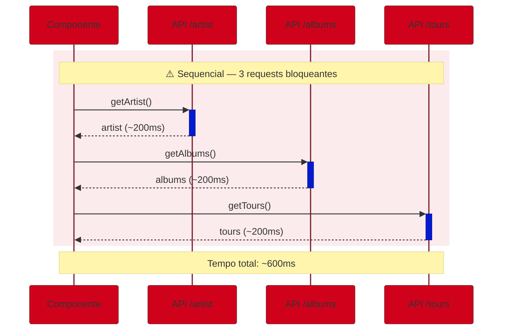
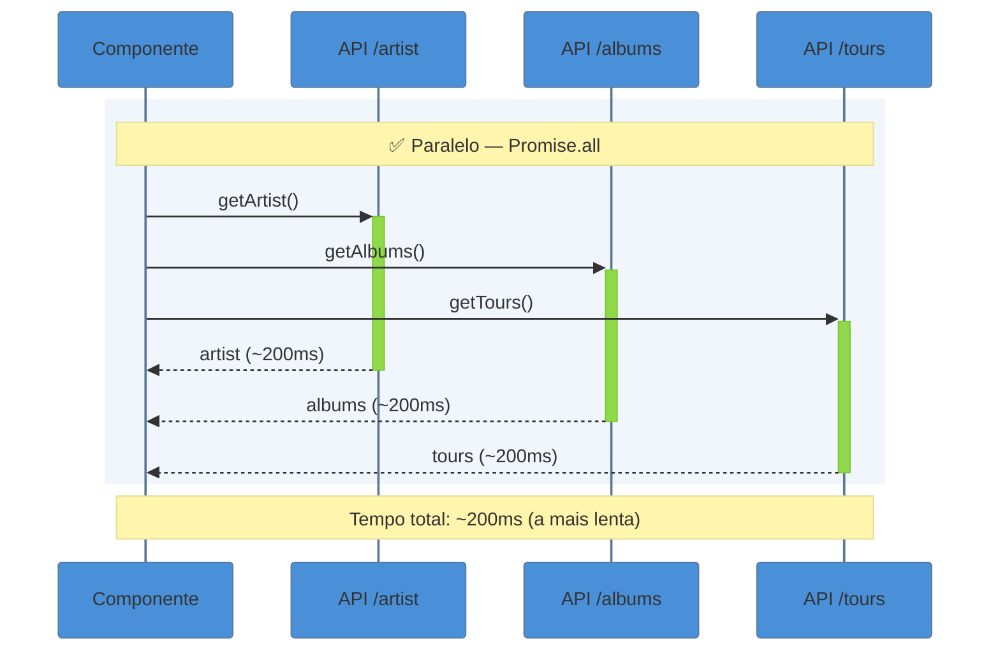

> [!abstract] TL;DR
> Em Server Components, você busca dados com `async`/`await` diretamente no componente — sem `useEffect`, sem estado, sem API route intermediária. O `fetch` no servidor é **uncached por padrão** no Next 15. Requests `fetch` GET idênticas no mesmo render são deduplicadas automaticamente (memoização por request). Múltiplos `await` em sequência criam waterfalls; `Promise.all` os evita. Dados chegam ao cliente via props serializáveis. Recursos ausentes respondem com `notFound()`; erros inesperados propagam para `error.tsx`.

> [!info] Pré-requisito — React core
> Esta nota foca em como o **Next.js cabeça** o data fetching no servidor. Para a primitiva `use()` e como consumir Promises em Client Components, veja [[03-Dominios/Tecnologia/React/React core/21 - O hook use()|React core 21 — O hook use()]]. Para Suspense e streaming de dados no cliente, veja [[03-Dominios/Tecnologia/React/React core/19 - Suspense e data fetching no cliente|React core 19]]. O modelo completo de caching persistente entre requests está em [[03-Dominios/Tecnologia/React/Next.js/07 - O modelo de caching do Next 15|nota 07 — O modelo de caching do Next 15]].

## O problema: onde buscar dados sem criar caos?

Antes do App Router, buscar dados em React era uma odisseia de escolhas ruins. Você tinha `useEffect` no cliente (waterfall garantido entre pai e filho, flash de estado vazio, credenciais expostas no bundle), `getServerSideProps` no Pages Router (amarrado ao arquivo de rota, impossível de compor, bloqueava a página inteira), ou `getStaticProps` (só build time, inútil para dados dinâmicos). Em qualquer cenário, um componente filho que precisasse de seus próprios dados dependia do pai para receber tudo via props — prop drilling ou Context como gambiarras de arquitetura.

O App Router resolve isso de forma elegante: **Server Components podem ser funções `async`**. Isso muda a equação. Um componente filho pode buscar exatamente o que precisa, diretamente no servidor, sem intermediários, sem criar requests duplicadas, sem expor segredos ao cliente.

Data fetching em uma frase: *no App Router, você busca dados onde usa, não onde consegue.*

## `async`/`await` em Server Components

A mudança mais fundamental é sintática: um Server Component é apenas uma função assíncrona.

```tsx
// app/produtos/page.tsx
type Produto = { id: string; nome: string; preco: number }

export default async function ProdutosPage() {
  const res = await fetch('https://api.loja.com/produtos')

  if (!res.ok) throw new Error('Falha ao buscar produtos')

  const produtos = (await res.json()) as Produto[]

  return (
    <ul>
      {produtos.map((p) => (
        <li key={p.id}>
          {p.nome} — R$ {p.preco.toFixed(2)}
        </li>
      ))}
    </ul>
  )
}
```

Nada de `useState`. Nada de `useEffect`. Nada de loading state manual no componente. O `async`/`await` suspende a renderização no servidor até os dados chegarem; o HTML que chega ao browser já tem o conteúdo renderizado. E as credenciais de API — `Authorization` header, API keys, connection strings — nunca entram no bundle do cliente.

O mesmo padrão funciona com ORMs e clients de banco, que muitas vezes são mais ergonômicos que `fetch` direto:

```tsx
// app/posts/page.tsx
import { db } from '@/lib/db'
import { posts } from '@/lib/schema'
import { desc } from 'drizzle-orm'

export default async function PostsPage() {
  // Roda só no servidor — conexão com banco nunca vai pro cliente
  const allPosts = await db.select().from(posts).orderBy(desc(posts.createdAt))

  return (
    <ul>
      {allPosts.map((post) => (
        <li key={post.id}>{post.title}</li>
      ))}
    </ul>
  )
}
```

> [!question]- E se a API for lenta? A página inteira trava?
> Sim — `await` bloqueia a renderização **do componente** até a resposta chegar. Se você tem um componente lento e outros rápidos, a solução é **streaming com Suspense** (detalhado na nota 09): envolva o componente lento em `<Suspense fallback={<Skeleton />}>` e o Next.js faz streaming do restante da página enquanto esse componente ainda carrega. O `loading.tsx` é um atalho para esse padrão no nível de rota inteira.

## `fetch` no servidor — opções e defaults do Next 15

O Next.js **estende** a Web `fetch` API com um namespace `next` para controle de caching. A assinatura é a mesma do browser, mas com semântica adicional no servidor:

```ts
// Opções de cache disponíveis no servidor:
fetch(url)                                    // padrão: auto no cache (Next 15)
fetch(url, { cache: 'no-store' })             // nunca usa cache persistente
fetch(url, { cache: 'force-cache' })          // usa/preenche o cache persistente
fetch(url, { next: { revalidate: 60 } })      // revalida a cada 60 segundos (ISR)
fetch(url, { next: { tags: ['posts'] } })     // tag para invalidação sob demanda
fetch(url, { next: { revalidate: 0 } })       // equivale a no-store
```

> [!info] Caching uncached por padrão — Next 15
> No Next 15, o padrão do `fetch` no servidor mudou para **`auto no cache`**: sem cache persistente entre requests. Cada request HTTP ao seu servidor dispara um novo `fetch` à API. Isso é uma **quebra de comportamento** em relação ao Next 14, onde o padrão era `force-cache`.
>
> O modelo completo dos 4 níveis de cache — Request Memoization, Data Cache, Full Route Cache e Router Cache — e como configurar cada um está em [[03-Dominios/Tecnologia/React/Next.js/07 - O modelo de caching do Next 15|nota 07 — O modelo de caching do Next 15]].

> [!warning] Mudança de padrão do Next 14 → Next 15
> **Next 14:** `fetch` era cached por padrão (`force-cache`). Uma rota que buscava dados com `fetch` simples gerava HTML estático em build e reutilizava em cache. **Next 15:** `fetch` é uncached por padrão. A mesma rota passa a buscar dados a cada request — latência maior, custos de API maiores.
>
> Se você migrou do 14 para o 15 e sua rota ficou lenta, verifique se dependia do cache implícito. Adicione `{ cache: 'force-cache' }` ou `{ next: { revalidate: N } }` onde o cache faz sentido.

## Busca sequencial vs paralela — anatomia de um waterfall

Aqui mora uma das armadilhas mais comuns do App Router, e ela é silenciosa: o código parece limpo, mas está criando latência desnecessária.

```tsx
// ⚠️ WATERFALL — requests sequenciais, mesmo sendo independentes
export default async function ArtistPage({
  params,
}: {
  params: Promise<{ username: string }>
}) {
  const { username } = await params

  const artist = await getArtist(username)   // espera... 200ms
  const albums  = await getAlbums(username)  // só começa depois... +200ms
  const tours   = await getTours(username)   // só começa depois... +200ms

  // Tempo total: ~600ms — poderia ser ~200ms
  return <ArtistProfile artist={artist} albums={albums} tours={tours} />
}
```

Cada `await` bloqueia o JavaScript. O runtime espera `getArtist` terminar para sequer iniciar `getAlbums`, mesmo que nenhum dado de `artist` seja necessário para `getAlbums`. Isso é um waterfall.



A correção: inicie todas as Promises **antes** de aguardar qualquer uma. Chamada sem `await` = request disparada imediatamente.

```tsx
// ✅ PARALELO — Promise.all elimina o waterfall
export default async function ArtistPage({
  params,
}: {
  params: Promise<{ username: string }>
}) {
  const { username } = await params

  // Dispara as 3 requests imediatamente — sem await
  const artistPromise = getArtist(username)
  const albumsPromise = getAlbums(username)
  const toursPromise  = getTours(username)

  // Aguarda todas de uma vez — termina quando a mais lenta terminar
  const [artist, albums, tours] = await Promise.all([
    artistPromise,
    albumsPromise,
    toursPromise,
  ])

  return <ArtistProfile artist={artist} albums={albums} tours={tours} />
}
```



> [!warning] `Promise.all` falha se qualquer request falhar
> Se `getArtist()` rejeitar, `Promise.all` rejeita imediatamente — você não recebe `albums` nem `tours`, mesmo que tenham completado com sucesso. Para requests independentes onde falhas parciais são aceitáveis, use `Promise.allSettled`:
>
> ```tsx
> const results = await Promise.allSettled([
>   albumsPromise,
>   toursPromise,
> ])
>
> const albums = results[0].status === 'fulfilled' ? results[0].value : []
> const tours  = results[1].status === 'fulfilled' ? results[1].value : []
> ```
>
> `Promise.allSettled` nunca rejeita — você inspeciona cada resultado individualmente.

### Quando a sequência é inevitável

Às vezes o segundo request genuinamente depende do primeiro. Nesse caso, use `<Suspense>` para não bloquear a página inteira — renderize o que está pronto e faça streaming do restante:

```tsx
// O Suspense permite que o nome do artista apareça imediatamente;
// as playlists chegam depois via streaming.
export default async function ArtistPage({
  params,
}: {
  params: Promise<{ username: string }>
}) {
  const { username } = await params
  const artist = await getArtist(username) // necessariamente primeiro

  return (
    <>
      <h1>{artist.name}</h1>
      <Suspense fallback={<PlaylistSkeleton />}>
        {/* Playlists começa a carregar assim que artist chega */}
        <Playlists artistId={artist.id} />
      </Suspense>
    </>
  )
}

async function Playlists({ artistId }: { artistId: string }) {
  const playlists = await getPlaylists(artistId) // depende do artistId
  return <PlaylistGrid playlists={playlists} />
}
```

> [!tip] Assista: Next.js App Router: Routing, Data Fetching, Caching
> **Canal:** Vercel | **Duração:** ~14min | **Idioma:** EN
>
> Demonstração oficial mostrando que estratégias de cache diferentes — estático, dinâmico (`no-store`) e ISR (`revalidate`) — podem coexistir no mesmo componente via `Promise.all`. A nota explica o *porquê* do padrão paralelo; este vídeo mostra o efeito ao vivo: dados que permanecem estáticos enquanto outros mudam a cada 5 segundos na mesma página. Trecho de destaque [11:03]: *"I'm using promise.all to fetch these in parallel and then I render out the name of the repository as well as the datetime."*
>
> 🎬 [Assistir no YouTube](https://www.youtube.com/watch?v=gSSsZReIFRk)

## Request memoization — deduplicação automática no render

Imagine uma aplicação com layout, página e componente filho que todos precisam dos dados do usuário autenticado. Sem algum mecanismo de deduplicação, você teria três requests idênticas ao mesmo endpoint.

O React e o Next.js resolvem isso automaticamente: **chamadas `fetch` GET com a mesma URL e opções são memoizadas durante o render pass do servidor**. O primeiro `fetch` executa normalmente; chamadas subsequentes idênticas retornam o resultado em memória, sem nova request de rede.

```tsx
// lib/data.ts
async function getCurrentUser(): Promise<User> {
  const res = await fetch('https://api.app.com/me', {
    headers: { Authorization: `Bearer ${getToken()}` },
  })
  return res.json()
}

// app/dashboard/layout.tsx — executa getCurrentUser() → 1 request real
export default async function DashboardLayout({ children }) {
  const user = await getCurrentUser()
  return (
    <div>
      <nav>Olá, {user.name}</nav>
      {children}
    </div>
  )
}

// app/dashboard/page.tsx — getCurrentUser() → memoizado, 0 requests extras
export default async function DashboardPage() {
  const user = await getCurrentUser()
  return <main>Dashboard de {user.name}</main>
}

// app/dashboard/profile/page.tsx — idem, memoizado
export default async function ProfilePage() {
  const user = await getCurrentUser()
  return <section>Editando perfil de {user.email}</section>
}
```

O layout e as duas páginas chamam `getCurrentUser()`, mas apenas **uma request de rede acontece**. Esse comportamento significa que você pode buscar dados onde usa, sem se preocupar com duplicação.

> [!warning] Memoização só vale para `fetch` GET — ORMs ficam de fora
> A memoização automática aplica-se apenas a chamadas `fetch`. Se você usa um ORM ou client de banco diretamente (`prisma.user.findUnique(...)`, queries Drizzle), cada chamada é independente. A solução é envolver com `React.cache`:
>
> ```tsx
> import { cache } from 'react'
> import { prisma } from '@/lib/prisma'
>
> // React.cache memoiza por combinação de argumentos, por request
> export const getUserById = cache(async (id: string) => {
>   return prisma.user.findUnique({ where: { id } })
> })
> ```
>
> Agora múltiplas chamadas a `getUserById('123')` no mesmo render retornam o mesmo objeto sem bater no banco de novo.

> [!info] Memoização é por render pass — não é caching persistente
> A memoização garante deduplicação **dentro de um único render do servidor**. Entre duas requisições HTTP distintas, não há compartilhamento — cada request inicia do zero. Isso é diferente do *Data Cache* que persiste resultados entre requests. O modelo completo está na [[03-Dominios/Tecnologia/React/Next.js/07 - O modelo de caching do Next 15|nota 07]].

> [!warning] Memoização não funciona em Route Handlers
> A deduplicação automática de `fetch` só ocorre dentro da árvore de React Server Components. Em `route.ts` (Route Handlers), não há memoização — cada chamada é independente, mesmo com URL e opções idênticas.

## Padrões de erro — `notFound()` e Error Boundaries

Quando algo dá errado na busca de dados, você tem duas categorias de resposta no App Router:

**Recurso não encontrado** — use `notFound()` do `next/navigation`:

```tsx
import { notFound } from 'next/navigation'

type Params = Promise<{ slug: string }>

export default async function PostPage({ params }: { params: Params }) {
  const { slug } = await params
  const post = await getPost(slug)

  if (!post) {
    notFound()
    // notFound() lança uma exceção especial — o Next captura
    // e renderiza o not-found.tsx mais próximo na hierarquia.
    // Retorna status HTTP 404.
  }

  return <Article post={post} />
}
```

```tsx
// app/posts/[slug]/not-found.tsx
export default function PostNotFound() {
  return (
    <div>
      <h2>Post não encontrado</h2>
      <p>O post que você procura não existe ou foi removido.</p>
    </div>
  )
}
```

**Erros inesperados** — deixe propagar para o `error.tsx`. Não é necessário try/catch em todo componente:

```tsx
// app/produtos/[id]/page.tsx
// Se fetchProduct() lançar exceção, o error.tsx mais próximo captura
export default async function ProductPage({
  params,
}: {
  params: Promise<{ id: string }>
}) {
  const { id } = await params
  const product = await fetchProduct(id) // pode lançar exceção
  return <ProductDetail product={product} />
}
```

```tsx
// app/produtos/[id]/error.tsx
'use client' // Error Boundaries devem ser Client Components

export default function ProductError({
  error,
  reset,
}: {
  error: Error & { digest?: string }
  reset: () => void
}) {
  return (
    <div>
      <h2>Erro ao carregar produto</h2>
      <p>{error.message}</p>
      <button onClick={reset}>Tentar novamente</button>
    </div>
  )
}
```

O `reset` chama a função fornecida pelo Next para tentar re-renderizar o segmento com erro. Para o padrão completo de Error Boundaries no React, veja [[03-Dominios/Tecnologia/React/React core/18 - Error boundaries|React core 18 — Error Boundaries]].

## Passando dados do servidor para o cliente

Server Components não podem usar hooks. Quando um componente filho precisa de interatividade com os dados buscados no servidor, o padrão é: **buscar no Server Component, passar via props serializáveis para o Client Component**.

```tsx
// app/carrinho/page.tsx — Server Component
import CartSummary from './CartSummary'

export default async function CarrinhoPage() {
  // Busca no servidor: seguro, com credenciais, sem expor ao cliente
  const cart = await getCartBySession()

  // Passa dados serializáveis (JSON-safe) como props
  return (
    <CartSummary
      items={cart.items}
      total={cart.total}
      couponCode={cart.couponCode ?? null}
    />
  )
}
```

```tsx
// app/carrinho/CartSummary.tsx — Client Component
'use client'
import { useState } from 'react'

type CartItem = { id: string; nome: string; quantidade: number; preco: number }

type Props = {
  items: CartItem[]
  total: number
  couponCode: string | null
}

export default function CartSummary({ items, total, couponCode }: Props) {
  const [expanded, setExpanded] = useState(false)

  return (
    <div>
      <button onClick={() => setExpanded(!expanded)}>
        {expanded ? 'Ocultar' : 'Ver'} itens ({items.length})
      </button>
      {expanded && (
        <ul>
          {items.map((item) => (
            <li key={item.id}>
              {item.nome} × {item.quantidade}
            </li>
          ))}
        </ul>
      )}
      <p>Total: R$ {total.toFixed(2)}</p>
      {couponCode && <p>Cupom aplicado: {couponCode}</p>}
    </div>
  )
}
```

> [!warning] Props do servidor para o cliente devem ser serializáveis
> O Next.js serializa props de Server para Client Component como JSON ao atravessar o boundary `'use client'`. Isso significa que **funções, classes com métodos, `Date` objects, `Map`, `Set`, `undefined` e referências circulares não podem ser passados diretamente**.
>
> Converta antes de passar: `date.toISOString()` em vez de `new Date(...)`, arrays de pares em vez de `Map`, números em vez de funções de formatação. Se precisar compartilhar uma Promise entre Server e Client (para streaming com `use()`), o padrão é `React.cache` + Context Provider.

> [!warning] Nunca use `fetch` em Client Components para dados sensíveis do servidor
> Um erro clássico ao migrar do Pages Router: buscar dados com `fetch` dentro de `'use client'`. Isso parece funcionar, mas os dados buscados no cliente ficam visíveis no Network tab do DevTools — tokens, preços internos, dados de sessão. Se o dado é sensível, busque no servidor e passe via props, ou use um Route Handler que valide a sessão. Client Components são para interatividade; data fetching sensível é server-first.

## Armadilhas comuns

> [!warning] `await params` é obrigatório no Next 15
> No Next 15, `params` e `searchParams` são `Promise` — mudança de comportamento em relação ao Next 14. Esquecer o `await` causa `TypeError` em runtime:
>
> ```tsx
> // ❌ Next 14 — quebra silenciosamente no Next 15
> export default async function Page({ params }: { params: { slug: string } }) {
>   const { slug } = params // TypeError no Next 15: params é uma Promise
> }
>
> // ✅ Next 15 — tipagem correta e await obrigatório
> export default async function Page({
>   params,
> }: {
>   params: Promise<{ slug: string }>
> }) {
>   const { slug } = await params
> }
> ```

> [!warning] Múltiplos `await` em sequência podem ser waterfalls disfarçados
> O código limpo com vários `await` enganam. O critério: "a request B precisa de dados de A para existir?" Se não, rodem em paralelo com `Promise.all`. Se sim, avalie se `<Suspense>` pode fazer streaming do componente dependente enquanto o resto da página já renderiza.

> [!warning] Componentes `async` não podem ser Client Components
> Client Components (marcados com `'use client'`) não podem ser funções `async`. `async` em Server Component = ok. `async` em Client Component = erro de build. Se precisar de dados assíncronos em um Client Component, busque no Server Component pai e passe via props, ou use `use()` com uma Promise passada como prop.

## Casos práticos

### Cenário 1: Página de produto com dados paralelos

Uma página de e-commerce precisa de dados do produto, avaliações e estoque — fontes independentes que podem buscar em paralelo:

```tsx
// app/produto/[id]/page.tsx
import { notFound } from 'next/navigation'
import ProductInfo from './ProductInfo'
import ReviewList from './ReviewList'
import StockIndicator from './StockIndicator'
import { Suspense } from 'react'

type Params = Promise<{ id: string }>

export default async function ProductPage({ params }: { params: Params }) {
  const { id } = await params

  // Dispara em paralelo — dados independentes
  const productPromise = getProduct(id)
  const stockPromise   = getStock(id)

  // Produto é obrigatório — aguarda antes de renderizar qualquer coisa
  const product = await productPromise

  if (!product) notFound()

  return (
    <div>
      <ProductInfo product={product} />
      <Suspense fallback={<StockSkeleton />}>
        {/* Estoque pode demorar mais — streaming separado */}
        <StockIndicatorServer stockPromise={stockPromise} />
      </Suspense>
      <Suspense fallback={<ReviewsSkeleton />}>
        {/* Avaliações buscam independentemente */}
        <ReviewList productId={id} />
      </Suspense>
    </div>
  )
}
```

### Cenário 2: Layout compartilhando dados com a página

Um layout de dashboard busca o usuário uma vez; a página o usa novamente via memoização:

```tsx
// lib/auth.ts
import { cache } from 'react'

export const getAuthUser = cache(async () => {
  const session = await getSession() // cookies, etc.
  if (!session) return null
  return getUserById(session.userId)
})

// app/dashboard/layout.tsx
export default async function DashboardLayout({ children }) {
  const user = await getAuthUser() // 1 request ou 1 query ao banco
  if (!user) redirect('/login')

  return (
    <div>
      <Sidebar userName={user.name} role={user.role} />
      <main>{children}</main>
    </div>
  )
}

// app/dashboard/settings/page.tsx
export default async function SettingsPage() {
  const user = await getAuthUser() // memoizado — zero requests extras
  return <SettingsForm email={user.email} preferences={user.preferences} />
}
```

## Como explicar em inglês

In Next.js App Router, Server Components are async functions — you `await` data directly in the component body. No `useEffect`, no loading state, no API middleware layer. Credentials stay on the server and never reach the client bundle.

The key patterns: kick off independent requests simultaneously with `Promise.all` to avoid waterfalls; rely on automatic request memoization so identical `fetch` calls within the same render don't hit the network twice; use `notFound()` for missing resources and `error.tsx` boundaries for unexpected failures; pass serializable data down to Client Components as props.

| PT | EN |
|----|----|
| busca de dados no servidor | server-side data fetching |
| waterfall de requisições | request waterfall |
| busca sequencial | sequential fetching |
| busca paralela | parallel fetching |
| memoização de request | request memoization |
| deduplicação automática | automatic deduplication |
| props serializáveis | serializable props |
| recurso não encontrado | not found |
| limite de erro | error boundary |
| fase de renderização | render pass |
| passa de servidor para cliente | passes from server to client |
| cache não persistente | uncached / no-store |

## O que vem a seguir

Com Server Components buscando dados eficientemente, o próximo passo natural é entender o que acontece quando queremos que o servidor guarde esses dados entre requests — e como escrever dados de volta ao servidor sem precisar de um Route Handler dedicado.

- [[03-Dominios/Tecnologia/React/Next.js/06 - Server Actions e mutations|06 - Server Actions e mutations]] — o par complementar de data fetching: como escrever, revalidar e invalidar dados
- [[03-Dominios/Tecnologia/React/Next.js/07 - O modelo de caching do Next 15|07 - O modelo de caching do Next 15]] — os 4 níveis de cache, `force-cache`, ISR e o futuro `use cache`
- [[03-Dominios/Tecnologia/React/Next.js/09 - Streaming, Suspense e loading.tsx|09 - Streaming, Suspense e loading.tsx]] — como exibir dados progressivamente enquanto o servidor ainda busca

## Fontes

- **Next.js Team** — [*Getting Started: Fetching Data*](https://nextjs.org/docs/app/getting-started/fetching-data) — documentação oficial: async/await em Server Components, paralelo vs sequencial, streaming, padrão `use()` com Suspense
- **Next.js Team** — [*Functions: fetch*](https://nextjs.org/docs/app/api-reference/functions/fetch) — referência completa de `options.cache`, `next.revalidate`, `next.tags`, memoização e como optar por sair dela
- **Next.js Blog** — [*Next.js 15*](https://nextjs.org/blog/next-15) — changelog com a mudança de padrão de cache (`force-cache` → `auto no cache`) e motivação
