# Server Actions e mutations

> [!info] Pré-requisito: Actions no React 19
> Esta nota foca em como o **Next.js cabeia** o mecanismo de Server Actions — transporte, cache, formulários e segurança. Para entender como o React 19 define a primitiva (`useActionState`, `startTransition`, protocolo de ação), leia antes [[03-Dominios/Tecnologia/React/React core/22 - Actions no React 19|React core 22]].

> [!abstract] TL;DR
> Server Actions são funções `async` marcadas com `'use server'` que executam **exclusivamente no servidor** — o cliente nunca vê o código, só um ID opaco. No Next.js, elas encaixam em `<form action={fn}>`, recebem `FormData` automaticamente, e desencadeiam revalidação de cache com `revalidatePath`/`revalidateTag`. O ciclo é: submit → action executa no server → cache invalidado → UI re-renderiza com dados frescos. O detalhe crítico de segurança: toda Server Action é um **endpoint público** acessível via POST direto — sem validação e checagem de autorização dentro da função, qualquer um pode chamá-la independente do que a UI mostre.

## O problema que Server Actions resolvem

Você tem um formulário de edição de perfil. A experiência clássica de SPA exigiria: um `<form>` controlado, um handler `onSubmit`, um `fetch` para uma rota de API separada, tratamento de estado de loading, tratamento de erro e, no final, uma invalidação de cache para que a UI reflita os dados novos.

São cinco camadas de responsabilidade para o que deveria ser uma operação trivial: "usuário edita → dado persiste → UI atualiza".

Server Actions colapsam esse ciclo. Você escreve uma função assíncrona marcada como server-only, passa ela pro atributo `action` do `<form>`, e o Next cuida do transporte, da serialização e da revalidação. O formulário até funciona sem JavaScript — o browser sabe enviar um `<form>` HTML nativo por conta própria.

## `'use server'`: onde a ação vive

A diretiva `'use server'` pode aparecer em dois lugares:

### Em arquivo separado (recomendado para projetos maiores)

```typescript
// app/actions/profile.ts
'use server'

import { revalidatePath } from 'next/cache'
import { redirect } from 'next/navigation'
import { db } from '@/lib/db'
import { auth } from '@/lib/auth'
import { z } from 'zod'

const UpdateProfileSchema = z.object({
  name: z.string().min(1).max(100),
  bio: z.string().max(500),
})

export async function updateProfile(formData: FormData) {
  // 1. Autenticação — quem está chamando?
  const session = await auth()
  if (!session?.user?.id) {
    throw new Error('Não autorizado')
  }

  // 2. Validação — o que está chegando?
  const parsed = UpdateProfileSchema.safeParse({
    name: formData.get('name'),
    bio: formData.get('bio'),
  })
  if (!parsed.success) {
    throw new Error('Dados inválidos')
  }

  // 3. Mutação
  await db.user.update({
    where: { id: session.user.id },
    data: parsed.data,
  })

  // 4. Revalidação + redirect
  revalidatePath('/profile')
  redirect('/profile')
}
```

Colocar `'use server'` no topo do **arquivo** marca todas as exportações como Server Actions. É o padrão preferido: separa o código de server do código de client, facilita importação de múltiplos componentes e torna mais fácil auditar a superfície de segurança.

### Inline (para ações pontuais em Server Components)

```typescript
// app/profile/page.tsx (Server Component)
export default function ProfilePage() {
  async function updateName(formData: FormData) {
    'use server'
    const name = formData.get('name') as string
    await db.user.update({ where: { id: '...' }, data: { name } })
    revalidatePath('/profile')
  }

  return (
    <form action={updateName}>
      <input name="name" />
      <button type="submit">Salvar</button>
    </form>
  )
}
```

Inline é conveniente para ações pontuais, mas dispersa lógica de server no código de renderização. Para ações chamadas de **Client Components**, a função deve obrigatoriamente vir de um arquivo com `'use server'` no topo — não é possível declarar Server Action inline dentro de um Client Component.

> [!question]- Por que não posso declarar Server Action inline em Client Component?
> Client Components são empacotados pelo bundler para rodar no browser. O `'use server'` inline criaria uma ambiguidade: o bundler precisaria varrer o Client Component em busca de código de server para extrair e hospedar no servidor. O modelo de compilação do Next não suporta essa mistura. A regra é: Server Actions em Client Components **sempre** vêm importadas de um arquivo separado marcado com `'use server'` no topo.

## O fluxo completo: form → action → cache → UI

```mermaid
%%{init: {"theme": "base", "themeVariables": {"primaryColor": "#4A90D9", "edgeLabelBackground": "#ffffff"}}}%%
sequenceDiagram
    participant B as Browser
    participant C as Next Router (client)
    participant S as Server (Action)
    participant DB as Banco de Dados
    participant K as Cache (Next)

    B->>C: submit <form action={fn}>
    C->>S: POST com FormData serializada
    S->>S: auth() → validação (Zod)
    S->>DB: INSERT / UPDATE / DELETE
    DB-->>S: OK
    S->>K: revalidatePath() ou revalidateTag()
    K-->>S: cache marcado como stale
    S-->>C: novo estado ou redirect
    C->>B: re-render com dados frescos
```



Por baixo, o Next gera um **ID não-determinístico e opaco** para cada Server Action, recalculado periodicamente entre builds. O cliente referencia só o ID — nunca o código. Antes de executar, o Next também valida que a requisição vem do mesmo host (comparação `Origin` vs `Host`), bloqueando chamadas cross-origin por padrão.

## `revalidatePath` e `revalidateTag`

Depois de mutar dados, você precisa dizer ao Next qual parte do cache não vale mais:

**`revalidatePath(path, type?)`** — invalida pelo caminho de rota:

```typescript
import { revalidatePath } from 'next/cache'

revalidatePath('/posts/123')          // invalida só /posts/123
revalidatePath('/posts', 'layout')    // invalida /posts e todas as rotas filhas
revalidatePath('/', 'layout')         // invalida todas as rotas da aplicação
```

**`revalidateTag(tag)`** — invalida por tag semântica (mais cirúrgico):

```typescript
import { revalidateTag } from 'next/cache'

// No fetch que busca os dados (Server Component ou action):
const posts = await fetch('/api/posts', {
  next: { tags: ['posts'] },
})

// Na Server Action que muta:
revalidateTag('posts') // invalida todos os fetches com essa tag
```

Tags são preferíveis quando o mesmo dado aparece em múltiplas rotas — você invalida uma tag e todos os `fetch` que a carregam são revalidados de uma vez, sem precisar conhecer os paths.

Para entender quais dos quatro caches do Next são afetados por cada chamada, veja [[03-Dominios/Tecnologia/React/Next.js/07 - O modelo de caching do Next 15|07 - O modelo de caching do Next 15]].

## `redirect()` pós-ação

```typescript
import { redirect } from 'next/navigation'

export async function createPost(formData: FormData) {
  'use server'

  const post = await db.post.create({
    data: { title: formData.get('title') as string },
  })

  revalidatePath('/posts')
  redirect(`/posts/${post.id}`) // lança exceção de controle de fluxo
  // nada aqui executa
}
```

`redirect()` usa uma exceção interna como mecanismo de controle de fluxo — padrão herdado do React. Consequências práticas:

- Qualquer código após `redirect()` nunca executa
- **Não** envolva `redirect()` em `try/catch` genérico — o `catch` captura o redirect junto com erros reais, e o usuário fica na página atual sem saber por quê
- Se precisar redirecionar condicionalmente, coloque `redirect()` fora do `try`, depois que a mutação foi concluída

## `useActionState` e `useFormStatus` no contexto Next

Essas primitivas vêm do React 19, mas é no Next onde ganham contexto completo de formulários progressivos.

### `useActionState` — estado, erro e pending juntos

Para que `useActionState` funcione com retorno de estado, a Server Action precisa de uma assinatura específica: primeiro parâmetro é o `prevState`, segundo é o `FormData`.

```typescript
// app/actions/task.ts
'use server'

import { z } from 'zod'
import { revalidatePath } from 'next/cache'

export type TaskState = {
  error?: string
  fieldErrors?: Record<string, string[]>
  success?: boolean
}

const Schema = z.object({ title: z.string().min(1, 'Título obrigatório') })

export async function updateTask(
  _prev: TaskState,
  formData: FormData
): Promise<TaskState> {
  const result = Schema.safeParse({ title: formData.get('title') })
  if (!result.success) {
    return { fieldErrors: result.error.flatten().fieldErrors }
  }

  await db.task.update({
    where: { id: formData.get('id') as string },
    data: { title: result.data.title },
  })

  revalidatePath('/tasks')
  return { success: true }
}
```

```typescript
// app/tasks/[id]/edit-form.tsx
'use client'

import { useActionState } from 'react'
import { updateTask, type TaskState } from '@/app/actions/task'

export function EditTaskForm({ taskId, currentTitle }: {
  taskId: string
  currentTitle: string
}) {
  const [state, action, isPending] = useActionState<TaskState, FormData>(
    updateTask,
    {}
  )

  return (
    <form action={action}>
      <input type="hidden" name="id" value={taskId} />
      <input name="title" defaultValue={currentTitle} disabled={isPending} />
      {state.fieldErrors?.title && (
        <span role="alert">{state.fieldErrors.title[0]}</span>
      )}
      {state.success && <p>Salvo!</p>}
      <button type="submit" disabled={isPending}>
        {isPending ? 'Salvando…' : 'Salvar'}
      </button>
    </form>
  )
}
```

### `useFormStatus` — pending no botão filho

```typescript
// app/components/SubmitButton.tsx
'use client'

import { useFormStatus } from 'react-dom'

export function SubmitButton({ label }: { label: string }) {
  const { pending } = useFormStatus()

  return (
    <button type="submit" disabled={pending} aria-busy={pending}>
      {pending ? 'Aguarde…' : label}
    </button>
  )
}
```

`useFormStatus` funciona em qualquer componente que seja **descendente direto** do `<form>` na árvore React — não importa se o componente é importado de fora. Isso permite um `<SubmitButton>` reutilizável sem acoplamento com a lógica específica de cada ação.

> [!tip] Assista: Next.js Forms Are Different Now (Server Actions, useActionState, Form Component)
> **Canal:** ByteGrad | **Duração:** ~14min | **Idioma:** EN
>
> O vídeo constrói ao vivo a progressão de form HTML puro → Server Action → `useActionState`, deixando visível o que a nota descreve em prosa: a mudança obrigatória na assinatura da ação (o `prevState` que vira primeiro parâmetro), como o hook devolve loading state, error state e a `action` pronta para o form, e a demo de progressive enhancement funcionando sem JavaScript no browser.
> Trecho de destaque [4:06]: *"The one tricky thing with this Hook is that if you use a Server Action your signature of your function actually changes — this is going to be the previous state, so basically what you returned from the function previously."*
>
> 🎬 [Assistir no YouTube](https://www.youtube.com/watch?v=DK7WqcL9Qq4)

## Progressive enhancement: funciona sem JavaScript

Quando um `<form action={serverAction}>` está num Server Component, o Next serializa a referência da ação no HTML de forma que o browser possa enviar o formulário como um `POST` HTML nativo — sem precisar do JavaScript do React.

Na prática:
- O usuário em rede lenta vê o formulário e pode submeter imediatamente (HTML puro)
- Se o bundle JS ainda não carregou, o submit vai pro server via HTTP clássico
- Quando o React hidratar, as transições de pending e otimistic entram em cena

Em **Client Components**, o Next enfileira as submissões se o JS ainda não carregou, garantindo que nenhuma seja perdida após a hidratação.

## Armadilhas comuns

A maior categoria de erro em Server Actions é tratar a função como "código interno" quando ela é, na prática, um endpoint HTTP público.

> [!warning] Server Action = endpoint público (armadilha central de segurança)
> **O que acontece:** uma ação que faz `db.deletePost(id)` sem verificar quem está chamando pode ser invocada por qualquer um via `fetch` com o payload correto — mesmo que o botão "Excluir" não apareça na UI para aquele usuário.
> **Por quê:** o Next gera um ID opaco para cada ação, mas IDs podem ser descobertos inspecionando o bundle. Esconder o botão na UI não protege a ação no servidor.
> **Como evitar:** **sempre** verificar autenticação e autorização dentro da Server Action, independente de o usuário "conseguir chegar" ao formulário. Trate cada ação como um endpoint de API que qualquer cliente pode chamar.

> [!warning] Nunca confiar no `FormData` sem validação de schema
> **O que acontece:** `formData.get('role')` pode retornar `"admin"` — qualquer string que o cliente quiser enviar.
> **Por quê:** campos hidden, campos injetados via DevTools, requisições diretas via `curl` — tudo chega como `FormData`. O cliente controla o payload inteiro.
> **Como evitar:** use Zod (ou similar) para validar **todo** dado vindo do `FormData` antes de qualquer leitura do banco. Nunca use `as string` sem checar o valor.

> [!warning] `redirect()` dentro de `try/catch` engole o redirect
> **O que acontece:** você envolve a mutação em `try/catch` para capturar erros do banco. O `redirect()` lança uma exceção interna — o `catch` genérico a captura junto e o redirect nunca acontece.
> **Por quê:** `redirect()` usa exceção como mecanismo de controle de fluxo no Next/React.
> **Como evitar:** coloque o `redirect()` **fora** do bloco `try/catch`, depois que a mutação passou com sucesso.

```typescript
// ✗ ERRADO — redirect nunca executa
export async function createPost(formData: FormData) {
  'use server'
  try {
    await db.post.create({ data: { title: formData.get('title') as string } })
    redirect('/posts') // ← capturado pelo catch genérico
  } catch (e) {
    console.error(e)
  }
}

// ✓ CORRETO — redirect fora do try
export async function createPost(formData: FormData) {
  'use server'
  try {
    await db.post.create({ data: { title: formData.get('title') as string } })
  } catch (e) {
    throw new Error('Falha ao criar post') // erro real re-lançado
  }
  redirect('/posts') // executa só se o try passou
}
```

## Casos práticos

### Cenário 1: formulário com validação de campo e feedback inline

Blog onde o autor cria posts. O título é obrigatório e o slug precisa ser único. O formulário mostra erro por campo sem recarregar a página, com o botão desabilitado durante o submit.

```typescript
// app/actions/post.ts
'use server'

import { z } from 'zod'
import { revalidateTag } from 'next/cache'
import { redirect } from 'next/navigation'
import { auth } from '@/lib/auth'
import { db } from '@/lib/db'

const PostSchema = z.object({
  title: z.string().min(3, 'Mínimo 3 caracteres').max(200),
  slug: z.string().regex(/^[a-z0-9-]+$/, 'Apenas letras minúsculas, números e hífens'),
})

export type PostState = { fieldErrors?: Record<string, string[]>; error?: string }

export async function createPost(
  _prev: PostState,
  formData: FormData
): Promise<PostState> {
  const session = await auth()
  if (!session?.user?.id) return { error: 'Faça login para criar posts' }

  const result = PostSchema.safeParse({
    title: formData.get('title'),
    slug: formData.get('slug'),
  })
  if (!result.success) {
    return { fieldErrors: result.error.flatten().fieldErrors }
  }

  const exists = await db.post.findUnique({ where: { slug: result.data.slug } })
  if (exists) return { fieldErrors: { slug: ['Este slug já está em uso'] } }

  const post = await db.post.create({
    data: { ...result.data, authorId: session.user.id },
  })

  revalidateTag('posts')
  redirect(`/posts/${post.slug}`)
}
```

```typescript
// app/posts/new/page.tsx
'use client'

import { useActionState } from 'react'
import { createPost, type PostState } from '@/app/actions/post'
import { SubmitButton } from '@/app/components/SubmitButton'

export default function NewPostPage() {
  const [state, action] = useActionState<PostState, FormData>(createPost, {})

  return (
    <form action={action} className="space-y-4">
      {state.error && <p role="alert" className="text-red-600">{state.error}</p>}
      <div>
        <label htmlFor="title">Título</label>
        <input id="title" name="title" />
        {state.fieldErrors?.title && (
          <span role="alert">{state.fieldErrors.title[0]}</span>
        )}
      </div>
      <div>
        <label htmlFor="slug">Slug</label>
        <input id="slug" name="slug" />
        {state.fieldErrors?.slug && (
          <span role="alert">{state.fieldErrors.slug[0]}</span>
        )}
      </div>
      <SubmitButton label="Publicar" />
    </form>
  )
}
```

### Cenário 2: exclusão com autorização e redirect — Server Component puro

Página de post com botão "Excluir" que só aparece pro dono. A ação verifica autorização no servidor antes de deletar — a checagem na UI é só cosmética.

```typescript
// app/actions/post.ts (adicionando à action anterior)
export async function deletePost(formData: FormData) {
  const session = await auth()
  if (!session?.user?.id) throw new Error('Não autorizado')

  const postId = formData.get('postId') as string

  // Autorização: buscar o post e checar dono — não confiar em campo hidden
  const post = await db.post.findUnique({ where: { id: postId } })
  if (!post || post.authorId !== session.user.id) {
    throw new Error('Proibido') // 403 semântico
  }

  await db.post.delete({ where: { id: postId } })

  revalidatePath('/posts', 'layout')
  redirect('/posts')
}
```

```typescript
// app/posts/[slug]/page.tsx (Server Component — sem 'use client')
import { deletePost } from '@/app/actions/post'
import { auth } from '@/lib/auth'

export default async function PostPage({ params }: { params: { slug: string } }) {
  const [session, post] = await Promise.all([
    auth(),
    db.post.findUnique({ where: { slug: params.slug } }),
  ])

  return (
    <article>
      <h1>{post?.title}</h1>
      {/* Botão só aparece pro dono — mas a ação protege no server de qualquer jeito */}
      {session?.user?.id === post?.authorId && (
        <form action={deletePost}>
          <input type="hidden" name="postId" value={post?.id} />
          <button type="submit">Excluir post</button>
        </form>
      )}
    </article>
  )
}
```

Repare: `PostPage` é um Server Component sem `'use client'`. O `<form action={deletePost}>` é renderizado como HTML puro — progressive enhancement incluso, sem um byte de JavaScript extra para esse botão.

## Server Actions em uma frase

Server Actions colapsam o ciclo formulário → API → cache → UI em uma função `async` de server, com progressive enhancement embutido e o custo de segurança sendo: toda ação é um endpoint público que você é responsável por proteger — validação e autorização dentro da função, sempre.

## Como explicar em inglês

*Server Actions let you run server-side mutations directly from form submissions without a separate API route. You mark an async function with `'use server'`, attach it to a form's `action` prop, and Next.js handles the transport, serialization, and cache invalidation. The critical point for interviews: every Server Action is a public HTTP endpoint — you must validate input and check authentication inside the function itself, not just hide the UI element from unauthorized users.*

| PT | EN |
|----|----|
| Ação de servidor | Server Action |
| Mutação de dados | Data mutation |
| Invalidar / revalidar cache | Invalidate / revalidate the cache |
| Revalidação por caminho | Path-based revalidation |
| Revalidação por tag | Tag-based revalidation |
| Melhoria progressiva | Progressive enhancement |
| Estado da ação | Action state |
| Autorização | Authorization |
| Validação de entrada | Input validation |
| Diretiva de servidor | Server directive (`'use server'`) |

## O que vem a seguir

Com as mutations no bolso, o próximo passo é entender o modelo de cache que elas invalidam. `revalidatePath` e `revalidateTag` fazem sentido pleno quando você sabe quais dos quatro caches do Next 15 estão sendo atingidos — e por que o modelo "uncached by default" muda o raciocínio em relação ao Next 14.

- [[03-Dominios/Tecnologia/React/Next.js/07 - O modelo de caching do Next 15|07 - O modelo de caching do Next 15]] — os 4 caches, defaults uncached do 15 e como revalidação se encaixa
- [[03-Dominios/Tecnologia/React/Next.js/05 - Data fetching no Server|05 - Data fetching no Server]] — leitura de dados no server, o par natural das mutations
- [[03-Dominios/Tecnologia/React/Next.js/12 - Navegação e o Router|12 - Navegação e o Router]] — `redirect()` e `useRouter` em detalhe; `staleTimes` do Router Cache
- [[03-Dominios/Tecnologia/React/React core/22 - Actions no React 19|React core 22]] — a primitiva React por baixo: `useActionState`, `startTransition` e o protocolo de ação

## Referências

- **Next.js Docs** — [*Server Actions and Mutations*](https://nextjs.org/docs/app/building-your-application/data-fetching/server-actions-and-mutations) — documentação canônica da API com exemplos completos
- **Next.js Docs** — [*How to Create Forms with Server Actions*](https://nextjs.org/docs/app/guides/forms) — guia de formulários com progressive enhancement e casos práticos
- **Next.js Docs** — [*Data Security*](https://nextjs.org/docs/app/guides/data-security) — modelo de segurança: DAL, Server Actions como endpoints públicos, validação obrigatória
- **Next.js Blog** — [*How to Think About Security in Next.js*](https://nextjs.org/blog/security-nextjs-server-components-actions) — análise da superfície de ataque em Server Components e Actions
- **Next.js Docs** — [*revalidatePath*](https://nextjs.org/docs/app/api-reference/functions/revalidatePath) — API de invalidação por path com opções de tipo
- **Next.js Docs** — [*use server directive*](https://nextjs.org/docs/app/api-reference/directives/use-server) — semântica da diretiva, arquivo vs inline, restrições
- **React Docs** — [*useActionState*](https://react.dev/reference/react/useActionState) — primitiva React base com assinatura completa
