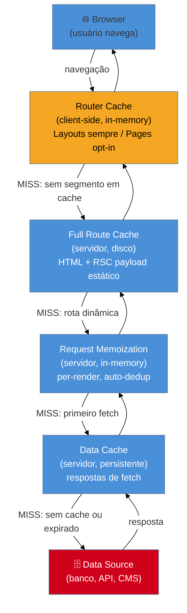
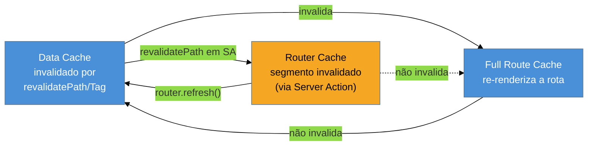

> [!abstract] TL;DR
> O App Router tem **4 camadas de cache** empilhadas: Request Memoization (dedup por render, servidor), Data Cache (persistente entre requests, servidor), Full Route Cache (HTML+RSC estático, servidor) e Router Cache (navegação, cliente). No **Next 15 o padrão mudou radicalmente**: `fetch` é **uncached por default** (`no-store`), Route Handlers GET não são mais cacheados automaticamente, e page segments no Router Cache não são mais mantidos entre navegações. Para cachear, você opta *in* explicitamente — `cache: 'force-cache'`, `next: { revalidate }` ou `next: { tags }`. Invalida-se com `revalidatePath` e `revalidateTag`, preferencialmente em Server Actions.

> [!info] Pré-requisito — Data fetching no servidor
> Esta nota explica o **mecanismo** de cache. Para entender como o `fetch` funciona em Server Components (async/await, sequencial vs paralelo, `notFound`), veja [[03-Dominios/Tecnologia/React/Next.js/05 - Data fetching no Server|nota 05 — Data fetching no Server]]. Para o modelo de RSC que torna tudo isso possível, veja [[03-Dominios/Tecnologia/React/React core/23 - Server Components (RSC)|React core 23 — Server Components]].

## O problema: o cache que morde sem avisar

Imagine que você acabou de publicar um e-commerce. Um usuário atualiza o preço de um produto às 10h. Às 11h, clientes ainda veem o preço antigo. Você não sabia que o Next cacheou a rota no build. Ou o oposto: você configurou cache mas cada usuário ainda bate no banco porque esqueceu de passar `force-cache`. O caching em Next.js historicamente foi o tema mais confuso do framework — e o mais perigoso.

No Next 14, o comportamento padrão era "cache tudo": `fetch` com `force-cache` implícito, Route Handlers GET cacheados, páginas estáticas por padrão. Parecia mágico até a primeira vez que dado stale apareceu em produção sem explicação.

O Next 15 virou a mesa. **Agora o padrão é "não cache nada"** — comportamento dinâmico por default, opt-in explícito para cache. Isso tornou o comportamento previsível; o custo é que você precisa entender os 4 mecanismos para recuperar a performance que antes era automática.

## Os 4 caches em perspectiva

Antes de entrar em cada um, vale visualizar o fluxo completo. Uma request passa por 4 camadas de cache em sequência — da mais rápida (cliente) à mais persistente (servidor).



Cada camada tem escopo, duração e regras de invalidação diferentes. Confundi-las é o erro número 1 ao debugar comportamento inesperado.

---

## Cache 1: Request Memoization

**Escopo:** servidor, dentro de um único render pass. **Duração:** até o fim da árvore de componentes renderizada. **Gerenciado por:** React (não pelo Next.js).

O problema que resolve: um layout busca `getUser()`, a página busca `getUser()`, e três componentes filhos também. Sem memoização, seriam 5 requests ao banco. Com memoização, são 1.

O mecanismo é simples: durante um render, React mantém um mapa de `(url, options) → resposta`. Se a mesma combinação aparecer de novo, o resultado em memória é retornado sem nova request. Ao fim do render, o mapa é descartado — não há persistência entre requests diferentes.

```tsx filename="app/dashboard/page.tsx"
// Pode chamar getUser em três lugares diferentes sem waterfall extra
async function getUser(id: string) {
  const res = await fetch(`https://api.example.com/users/${id}`)
  return res.json()
}

// Layout chama getUser(id) → cache MISS → fetch real
// Page chama getUser(id) → cache HIT → resposta em memória
// Card chama getUser(id) → cache HIT → resposta em memória
// Resultado: 1 fetch no banco, não 3
```

> [!question]- E se eu uso um cliente de banco diretamente (sem fetch)?
> `fetch` é memoizado automaticamente. Mas `db.user.findUnique()` não é. Para memoizar chamadas não-fetch, use `React.cache()`:
> ```ts
> import { cache } from 'react'
> import { db } from '@/lib/db'
>
> export const getUser = cache(async (id: string) => {
>   return db.user.findUnique({ where: { id } })
> })
> ```
> Funciona identicamente: 1 query por render, não importa quantas vezes `getUser` for chamado.

**Limites importantes:** só aplica a GET em `fetch`, e só dentro da árvore de componentes React (layouts, pages, Server Components). Route Handlers ficam *fora* da árvore — não são memoizados.

---

## Cache 2: Data Cache

**Escopo:** servidor, persistente entre requests e entre deployments. **Duração:** indefinida, até revalidação explícita. **Controlado por:** opções do `fetch` ou `unstable_cache`.

Este é o cache que a maioria pensa quando ouve "cache em Next.js". É onde os dados de `fetch` ficam guardados no filesystem do servidor (ou na camada de cache do Vercel) entre uma request e outra.

### Opt-in explícito no Next 15

No Next 15, **`fetch` sem opção é igual a `{ cache: 'no-store' }`** — busca sempre na fonte. Para cachear, você declara explicitamente:

```ts
// ❌ Next 15: sem opção = sem cache (equivale a no-store)
const data = await fetch('https://api.example.com/posts')

// ✅ Cache indefinido (força cache, nunca revalida automaticamente)
const data = await fetch('https://api.example.com/config', {
  cache: 'force-cache',
})

// ✅ Cache com revalidação temporal (stale-while-revalidate)
const data = await fetch('https://api.example.com/posts', {
  next: { revalidate: 3600 }, // revalida no máximo a cada hora
})

// ✅ Cache com tags (revalidação on-demand)
const data = await fetch('https://api.example.com/posts', {
  next: { tags: ['posts'] },
})
```

### Revalidação por tempo

`next: { revalidate: N }` define o TTL em segundos. O comportamento é **stale-while-revalidate**: quando o TTL expira, a próxima request recebe o dado stale e dispara uma revalidação em background. A request seguinte já recebe o dado fresco. Nunca há bloqueio.

Você pode definir o TTL no nível do segmento de rota (aplica a todos os `fetch` do segmento):

```ts filename="app/blog/layout.tsx"
// Todos os fetch deste layout e seus filhos revalidam a cada 60s
export const revalidate = 60
```

### Revalidação on-demand com tags

Tags permitem invalidar grupos de dados quando um evento acontece (ex.: CMS webhook, formulário de edição):

```ts filename="app/actions/posts.ts"
'use server'

import { revalidateTag } from 'next/cache'

export async function publishPost(id: string) {
  await db.post.update({ where: { id }, data: { published: true } })
  revalidateTag('posts')       // invalida todos os fetch com tag 'posts'
  revalidateTag(`post-${id}`) // invalida o post específico também
}
```

`revalidatePath('/blog')` faz o mesmo mas para uma rota específica — invalida o Data Cache e o Full Route Cache daquele path, e se chamado em Server Action, invalida também o Router Cache.

### Para dados não-fetch

Clientes de banco, CMS SDKs e GraphQL clients não passam pelo `fetch`. Use `unstable_cache`:

```ts
import { unstable_cache } from 'next/cache'
import { db } from '@/lib/db'

export const getCachedPosts = unstable_cache(
  async () => db.post.findMany({ where: { published: true } }),
  ['posts-list'],      // cache key
  { tags: ['posts'], revalidate: 3600 }
)
```

---

## Cache 3: Full Route Cache

**Escopo:** servidor, persistente entre requests. **Duração:** até novo deploy ou revalidação do Data Cache. **O que guarda:** HTML renderizado + RSC payload de rotas estáticas.

O Full Route Cache é o que torna uma página "estática" no sentido prático: ao invés de renderizar JSX para cada request, o Next.js guarda o resultado HTML+RSC do build e serve diretamente — sem executar código, sem bater em banco.

**Quando uma rota vai para o Full Route Cache:**
- Não usa Dynamic APIs (`cookies()`, `headers()`, `searchParams`)
- Não tem `fetch` uncached
- Não exporta `dynamic = 'force-dynamic'`

**Quando não vai (rota dinâmica):**
- Qualquer Dynamic API detectada durante o build
- `fetch` sem `force-cache` ou `revalidate`
- `dynamic = 'force-dynamic'` ou `revalidate = 0`

```tsx filename="app/blog/[slug]/page.tsx"
// Rota dinâmica mas pré-renderizável: gera HTML estático no build
export async function generateStaticParams() {
  const posts = await fetch('https://api.example.com/posts').then(r => r.json())
  return posts.map((p: { slug: string }) => ({ slug: p.slug }))
}

export default async function BlogPost({ params }: { params: Promise<{ slug: string }> }) {
  const { slug } = await params
  const post = await fetch(`https://api.example.com/posts/${slug}`, {
    next: { tags: [`post-${slug}`] },
  }).then(r => r.json())

  return <article>{post.content}</article>
}
```

---

## Cache 4: Router Cache (client-side)

**Escopo:** cliente (browser), in-memory por sessão. **Duração:** enquanto a aba estiver aberta; limpa no `refresh()`. **O que guarda:** RSC payload de segmentos visitados e pré-buscados.

O Router Cache é invisível para o servidor — vive inteiramente no JavaScript do cliente. Ele é o que torna a navegação entre páginas instantânea: ao navegar de `/blog` para `/about`, se os segmentos estiverem no Router Cache, não há request ao servidor.

### Regras do Next 15

No Next 15, o comportamento foi refinado:

| Tipo de segmento | Comportamento default |
|---|---|
| **Layouts** | Sempre cacheados e reutilizados em navegações parciais |
| **Loading states** | Cacheados, permitem navegação instantânea |
| **Pages** | **Não cacheados por default** no Next 15 |

Para cachear pages no Router Cache, configure `staleTimes` em `next.config.ts`:

```ts filename="next.config.ts"
const nextConfig = {
  experimental: {
    staleTimes: {
      dynamic: 30,   // páginas dinâmicas: 30 segundos (default: 0)
      static: 300,   // páginas estáticas: 5 minutos (default: 300)
    },
  },
}

export default nextConfig
```

Prefetch completo (`<Link prefetch={true}>` ou `router.prefetch()`) garante 5 minutos de cache para qualquer página (estática ou dinâmica), independente do `staleTimes`.

**Para limpar o Router Cache:**
- `router.refresh()` — limpa e refetch da rota atual
- `revalidatePath` / `revalidateTag` em Server Action — invalida o segmento associado
- `cookies.set` / `cookies.delete` em Server Action — invalida tudo (auth changes)
- Refresh da página (F5) — limpa completamente

---

## O modelo do Next 15: uncached-by-default

Esta seção é o núcleo sensível a versão. O que mudou entre 14 e 15, de forma isolada para facilitar a atualização quando o baseline mudar.

### Tabela de defaults: Next 14 vs Next 15

| Comportamento | Next 14 | Next 15 |
|---|---|---|
| `fetch` sem opção | `force-cache` (cacheado) | `no-store` (não cacheado) |
| Route Handlers GET | Cacheados por default | **Não cacheados** por default |
| Page segments no Router Cache | Cacheados | **Não cacheados** por default |
| `staleTimes.dynamic` default | 30s | **0** (sem cache) |
| `staleTimes.static` default | 5min | 5min (mantido) |

### Como migrar do Next 14

Se você está migrando do 14 para o 15 e quer manter o comportamento anterior, há três pontos de ação:

```ts
// 1. fetch que era cacheado implicitamente: adicionar force-cache
const data = await fetch('https://api.example.com/data', {
  cache: 'force-cache', // explicitamente
})

// 2. Route Handler GET que era cacheado: adicionar config estática
// app/api/products/route.ts
export const dynamic = 'force-static'
export async function GET() { ... }

// 3. Router Cache para páginas: adicionar staleTimes na config
// next.config.ts → experimental.staleTimes.dynamic: 30
```

> [!warning] Diff Next 14 → 15: fetch cacheado por padrão REMOVIDO
> No Next 14, `fetch('https://...')` sem opção era equivalente a `{ cache: 'force-cache' }`. No Next 15, é equivalente a `{ cache: 'no-store' }`. Código que dependia de caching implícito passou a fazer requests ao banco em cada render sem nenhum aviso de compilação. **Sempre declare a intenção de cache explicitamente.**

> [!warning] Diff Next 14 → 15: Route Handlers GET não mais cacheados
> Em Next 14, `export async function GET()` em `route.ts` era cacheado automaticamente. Em Next 15, o default mudou para dinâmico. Para restaurar: `export const dynamic = 'force-static'` no arquivo `route.ts`. Esse detalhe quebrou silenciosamente muitas APIs internas que dependiam do cache de Route Handlers.

> [!warning] Diff Next 14 → 15: Router Cache pages opt-out
> Em Next 14, page segments ficavam no Router Cache por 30s (dinâmico) ou 5min (estático). Em Next 15, pages são excluídas do Router Cache por default — cada navegação para uma page faz uma request ao servidor. Para restaurar caching: `experimental.staleTimes.dynamic` em `next.config.ts`. Layouts continuam cacheados igual ao comportamento anterior.

> [!tip] Assista: use cache — NextJS's Latest Take on Data Caching
> **Canal:** Jack Herrington | **Duração:** ~17min | **Idioma:** EN
>
> Jack compara os três modelos de caching do Next.js 15 (Pages Router, App Router padrão e dynamicIO experimental) usando um e-commerce real com 9 requests e requisitos de cache diferentes por dado — preço nunca cacheia, produtos cacheiam por hora. A demonstração mostra *por que* o Next 15 virou a mesa: quando você precisa de granularidade por fetch, o "cache tudo implicitamente" do Next 14 se torna um pesadelo de debugging. Trecho de destaque [6:23]: *"by default with Next.js 15 these fetches are uncached — with Next.js 14 all of the fetches were aggressively cached, so this time we have to ask for a cache"*
>
> 🎬 [Assistir no YouTube](https://www.youtube.com/watch?v=ZDRGEewXkrs)

---

## Interações entre os caches

Entender como os 4 caches se afetam é o que diferencia quem "acha que sabe" de quem realmente entende:



Regras práticas:

1. **Invalidar Data Cache invalida Full Route Cache** — se os dados mudaram, o HTML pre-renderizado fica stale e precisa ser re-gerado.
2. **Invalidar Full Route Cache NÃO invalida Data Cache** — você pode forçar re-render sem buscar dados novos (ex.: mudar layout, não dados).
3. **`revalidatePath`/`revalidateTag` em Server Action invalida Router Cache** — o client vê o dado atualizado na próxima navegação para aquela rota.
4. **`revalidatePath`/`revalidateTag` em Route Handler NÃO invalida Router Cache imediatamente** — o Router Handler não está amarrado a uma rota específica, então o cliente pode continuar vendo o cache antigo até refresh ou até o tempo de expiração.

---

## Casos práticos

### Cenário 1: blog com conteúdo do CMS

Você tem um blog onde posts mudam raramente, mas quando mudam, você quer que a mudança apareça imediatamente após publicação.

```tsx filename="app/blog/[slug]/page.tsx"
// Dados cacheados com tag específica por post
async function getPost(slug: string) {
  const res = await fetch(`https://cms.example.com/posts/${slug}`, {
    next: { tags: [`post-${slug}`, 'posts'] },
  })
  return res.json() as Promise<{ title: string; content: string }>
}

export async function generateStaticParams() {
  const res = await fetch('https://cms.example.com/posts')
  const posts: { slug: string }[] = await res.json()
  return posts.map(p => ({ slug: p.slug }))
}

export default async function BlogPost({
  params,
}: {
  params: Promise<{ slug: string }>
}) {
  const { slug } = await params
  const post = await getPost(slug)
  return <article><h1>{post.title}</h1><div>{post.content}</div></article>
}
```

```ts filename="app/api/revalidate/route.ts"
// Webhook do CMS chama este endpoint após publicação
import { revalidateTag } from 'next/cache'
import { NextRequest } from 'next/server'

export async function POST(request: NextRequest) {
  const { slug } = await request.json() as { slug: string }
  revalidateTag(`post-${slug}`)
  return Response.json({ revalidated: true })
}
```

O post é estático (Full Route Cache), mas ao publicar o CMS invalida a tag específica — só aquele post é re-renderizado, não o blog inteiro.

### Cenário 2: dashboard com dados mistos (estático + dinâmico)

Um dashboard onde o layout (menu, sidebar, dados da empresa) é estático, mas os KPIs em tempo real não devem ser cacheados.

```tsx filename="app/dashboard/page.tsx"
import { cookies } from 'next/headers'

// Dados estáticos: cacheados por 1 hora, tags para invalidação manual
async function getCompanyConfig() {
  return fetch('https://api.example.com/config', {
    next: { revalidate: 3600, tags: ['config'] },
  }).then(r => r.json()) as Promise<{ name: string; logoUrl: string }>
}

// KPIs em tempo real: sem cache, busca a cada request
async function getLiveMetrics(userId: string) {
  return fetch(`https://api.example.com/metrics/${userId}`, {
    cache: 'no-store',
  }).then(r => r.json()) as Promise<{ revenue: number; users: number }>
}

export default async function Dashboard() {
  const cookieStore = await cookies()
  const userId = cookieStore.get('user_id')?.value ?? ''

  // Paralelo: não cria waterfall
  const [config, metrics] = await Promise.all([
    getCompanyConfig(),
    getLiveMetrics(userId),
  ])

  return (
    <section>
      <h1>{config.name}</h1>
      <p>Receita: {metrics.revenue}</p>
      <p>Usuários: {metrics.users}</p>
    </section>
  )
}
```

A presença de `cookies()` torna a rota dinâmica (opt-out do Full Route Cache), mas os dados de `config` ainda usam o Data Cache individualmente. Híbrido: parte do dado é fresco sempre, parte é cacheada.

---

## Armadilhas comuns

> [!warning] Revalidar em Route Handler não atualiza o cliente imediatamente
> `revalidateTag` chamado dentro de um `route.ts` invalida o Data Cache e o Full Route Cache, mas **não invalida o Router Cache do cliente**. O usuário pode ver o dado antigo até navegar para outra página e voltar, ou até o tempo de expiração do Router Cache. Para garantir que o cliente veja o dado atualizado imediatamente, use `revalidateTag` em um **Server Action** (não em Route Handler).

> [!warning] `fetch` em middleware nunca é cacheado
> Qualquer `fetch` dentro de `middleware.ts` (ou `proxy.ts` no Next 16) é sempre uncached, independentemente das opções passadas. O Data Cache não aplica a middleware. Se você precisa de dados do middleware (ex.: sessão), use cookies ou headers — não `fetch` para uma API interna esperando cache.

> [!warning] `generateStaticParams` com `fetch` uncached quebra o Full Route Cache
> Se `generateStaticParams` busca os slugs com `cache: 'no-store'`, as rotas geradas ainda ficam no Full Route Cache no build. Mas se um `fetch` dentro do próprio componente da página usa `no-store`, a rota é marcada como dinâmica e **sai** do Full Route Cache — cada acesso re-executa o componente. Diagnóstico: `next build` mostra `○` (estático) ou `λ` (dinâmico) para cada rota.

> [!warning] `unstable_cache` com funções que capturam closures pode cachear dados errados
> `unstable_cache` usa a **key** para identificar o cache, não a função em si. Se você passar uma função que captura variáveis externas sem incluí-las na key, chamadas com valores diferentes retornam o mesmo cache:
> ```ts
> // ❌ Errado: userId não está na key — todos usuários veem os dados do primeiro
> const getProfile = unstable_cache(
>   async () => db.user.findUnique({ where: { id: userId } }),
>   ['user-profile'] // key sem userId!
> )
>
> // ✅ Correto: userId faz parte da key
> const getProfile = unstable_cache(
>   async (userId: string) => db.user.findUnique({ where: { id: userId } }),
>   ['user-profile', userId],
>   { tags: [`user-${userId}`] }
> )
> ```

---

## O que muda no Next 16

> [!info] Horizonte Next 16 — Cache Components (estável a partir de Out/2025)
> O Next 16 (lançado em outubro de 2025) torna o `'use cache'` **diretiva estável** e introduz **Cache Components** como novo modelo de caching. Em vez de opções do `fetch`, você marca funções e componentes inteiros como cacheáveis com a diretiva:
>
> ```ts filename="app/blog/page.tsx"
> 'use cache'
>
> // Todo o módulo é cacheável — o compilador gera a key automaticamente
> export default async function BlogPage() {
>   const posts = await db.post.findMany()
>   return <PostList posts={posts} />
> }
> ```
>
> Mudanças críticas do 16:
> - **`experimental.dynamicIO`** (flag que habilitava `use cache` no Next 15) **renomeado para `cacheComponents`** em `next.config.ts`
> - **`revalidateTag(tag)` agora exige segundo argumento**: `revalidateTag('posts', 'max')` — o perfil `cacheLife` define o comportamento stale-while-revalidate
> - **Novo `updateTag(tag)`** para Server Actions: garante read-your-writes (o usuário vê o dado atualizado imediatamente na mesma request)
> - **Novo `refresh()`** para Server Actions: refresha dados uncached sem tocar em cache
> - **PPR como default** quando Cache Components está ativo — rotas são híbridas estático+dinâmico por padrão
>
> Para promover este vault para baseline Next 16: substituir a seção "O modelo do Next 15" pelo modelo `'use cache'`, atualizar a tabela de defaults, e mover as opções de `fetch` para seção "modelo anterior".

---

## Como explicar em inglês

Next.js 15 introduced an uncached-by-default model: fetch requests no longer use the Data Cache unless you explicitly opt in with `force-cache` or a `revalidate` interval. There are four distinct caching layers — Request Memoization (per-render deduplication), Data Cache (persistent server-side), Full Route Cache (static HTML at build time), and Router Cache (client-side navigation). Stale content is handled either through time-based revalidation (stale-while-revalidate) or on-demand invalidation via cache tags.

| PT | EN |
|---|---|
| Cache de dados | Data Cache |
| Memoização por request | Request Memoization |
| Cache de rota completa | Full Route Cache |
| Cache do roteador (cliente) | Router Cache |
| Revalidação por tempo | Time-based revalidation |
| Revalidação on-demand | On-demand revalidation |
| Tag de cache | Cache tag |
| Não cacheado por default | Uncached by default |
| Stale-while-revalidate | Stale-while-revalidate (mesmo termo) |
| Opt-in de cache | Cache opt-in |
| Renderização estática | Static rendering |
| Rota dinâmica | Dynamic route |

---

## O caching do Next 15 em uma frase

O Next 15 adota *uncached-by-default*: sem declaração explícita, dados são sempre frescos e lentos — você recupera performance de forma cirúrgica com `force-cache`, `revalidate` ou tags, e invalida com `revalidatePath`/`revalidateTag` em Server Actions.

---

## O que vem a seguir

Os 4 caches determinam **quando** o Next.js busca dados, mas **como** o conteúdo é renderizado — estático no build, dinâmico por request, ou parcialmente ambos — é uma decisão separada. A nota seguinte explora exatamente isso.

- [[03-Dominios/Tecnologia/React/Next.js/08 - Rendering strategies - SSR, SSG, ISR, PPR|nota 08 — Rendering strategies: SSR, SSG, ISR, PPR]] — como o Next decide entre estático e dinâmico, `generateStaticParams`, ISR e Partial Prerendering
- [[03-Dominios/Tecnologia/React/Next.js/06 - Server Actions e mutations|nota 06 — Server Actions e mutations]] — `revalidatePath` e `revalidateTag` vistos em ação no contexto de mutations
- [[03-Dominios/Tecnologia/React/Next.js/12 - Navegação e o Router|nota 12 — Navegação e o Router]] — `staleTimes`, prefetch e como o Router Cache se comporta do ponto de vista do usuário

---

## Referências

- **Vercel / Next.js Team** — [*Caching in Next.js (v15 docs)*](https://nextjs.org/docs/15/app/guides/caching) — documentação oficial dos 4 mecanismos de cache, tabela de APIs e diagramas
- **Vercel / Next.js Team** — [*Next.js 15 Release Blog*](https://nextjs.org/blog/next-15) — anúncio oficial das mudanças de default (uncached-by-default, Router Cache pages)
- **Vercel / Next.js Team** — [*Next.js 16 Release Blog*](https://nextjs.org/blog/next-16) — Cache Components, `use cache` estável, `updateTag`, mudanças no `revalidateTag`
- **Vercel / Next.js Team** — [*Our Journey with Caching*](https://nextjs.org/blog/our-journey-with-caching) — blog post explicando a decisão de mudar para uncached-by-default
- **Next.js Docs** — [*fetch API Reference*](https://nextjs.org/docs/app/api-reference/functions/fetch) — opções `cache`, `next.revalidate`, `next.tags`
- **Next.js Docs** — [*staleTimes config*](https://nextjs.org/docs/app/api-reference/config/next-config-js/staleTimes) — configuração do Router Cache para page segments
