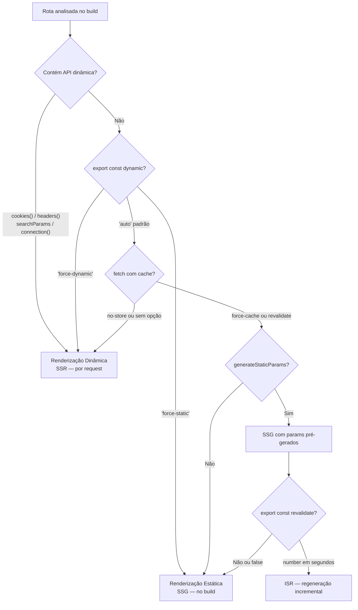
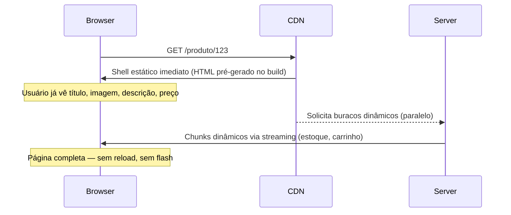

> [!abstract] TL;DR
> No App Router, **o Next.js decide estático ou dinâmico com base em código, não em declaração**. Por padrão, toda rota é estática. O Next muda para dinâmico quando encontra APIs de request (`cookies()`, `headers()`, `searchParams`, `connection()`) ou `export const dynamic = 'force-dynamic'`. SSG com rotas dinâmicas usa `generateStaticParams`. ISR usa `export const revalidate` (segundos) ou revalidação sob demanda via `revalidateTag`/`revalidatePath`. PPR combina shell estático com buracos dinâmicos via `<Suspense>` — é **experimental no Next 15** (flag `experimental.ppr`) e se torna **estável no Next 16** via `cacheComponents`.

> [!info] Caching e revalidação — nota irmã
> Esta nota cobre *quando* e *por quê* o Next escolhe cada estratégia de render. Para entender *como* os resultados são armazenados e invalidados (Data Cache, Full Route Cache, Router Cache), veja a [[03-Dominios/Tecnologia/React/Next.js/07 - O modelo de caching do Next 15|nota 07 — O modelo de caching do Next 15]]. Streaming e `loading.tsx` são detalhados na [[03-Dominios/Tecnologia/React/Next.js/09 - Streaming, Suspense e loading.tsx|nota 09]]. Para a primitiva `<Suspense>` no React, veja [[03-Dominios/Tecnologia/React/React core/19 - Suspense e data fetching no cliente|React core 19]].

## O problema: qual HTML servir?

Imagine um servidor encarando dois tipos de pergunta muito diferentes. A primeira: "qual é o conteúdo do post `/blog/introducao-ao-next`?" A resposta é sempre igual — independente de quem pergunta, a qualquer hora. Faz sentido calcular esse HTML uma vez, salvar, e servir direto do CDN para sempre. A segunda: "qual é o dashboard do usuário `josenaldo`?" Essa resposta muda por pessoa, por sessão, por momento — pré-calcular é impossível.

Frameworks mais antigos exigiam que você *declarasse* explicitamente qual era qual. No Pages Router, você escolhia entre `getStaticProps` (build time), `getServerSideProps` (por request) ou `getStaticPaths` + `revalidate` (ISR). A carga mental era alta: um erro de julgamento significava performance ruim ou dados velhos.

O App Router inverte o padrão: **tudo é estático por padrão**. O Next só muda para dinâmico quando encontra uma razão inequívoca no código — e você vai aprender exatamente quais são essas razões.

## Como o Next decide: estático vs dinâmico

A decisão acontece em dois momentos: no **build** (para SSG/ISR) e no **runtime** (para SSR). No build, o Next analisa o código de cada rota e aplica uma heurística baseada em evidências:



A regra de ouro: **qualquer API que lê informação exclusiva de uma request — cabeçalhos, cookies, parâmetros de URL — torna a rota dinâmica**. Isso é intencional. O Next não pode pré-calcular HTML que depende de dados que só existem quando alguém faz uma request.

### APIs dinâmicas que disparam SSR

```typescript
// Qualquer um desses, em qualquer Server Component na árvore da rota,
// força a rota inteira para renderização dinâmica no Next 15.

import { cookies, headers, connection } from 'next/headers'

// cookies() — lê cookie da request
const cookieStore = await cookies()
const token = cookieStore.get('auth-token')

// headers() — lê cabeçalho da request
const headerStore = await headers()
const userAgent = headerStore.get('user-agent')

// connection() — força dinâmico explicitamente, sem ler dado nenhum
await connection()
```

```typescript
// searchParams chega como prop em page.tsx — não é importado
// No Next 15 é uma Promise; precisa de await
export default async function Page({
  searchParams,
}: {
  searchParams: Promise<{ q?: string }>
}) {
  const { q } = await searchParams  // forçou dinâmico ao acessar searchParams
  return <SearchResults query={q} />
}
```

> [!warning] `searchParams` é prop, não import
> Em `page.tsx`, `searchParams` é recebido como **prop** (Promise no Next 15). Não existe `import { searchParams } from 'next/headers'`. Confundir com `cookies()`/`headers()` é o erro mais comum. Usar `searchParams` força dinâmico porque os parâmetros de URL só existem na request.

## Renderização estática — SSG

Quando nenhuma API dinâmica é detectada e não há `fetch` com `no-store`, o Next trata a rota como estática e gera o HTML no build. Para rotas sem parâmetros, isso acontece automaticamente. Para rotas dinâmicas (`[slug]`, `[id]`), você precisa fornecer a lista de parâmetros com `generateStaticParams`.

### `generateStaticParams` — SSG com rotas dinâmicas

```typescript
// app/blog/[slug]/page.tsx

export async function generateStaticParams() {
  // Executado no build — pode chamar qualquer fonte de dados
  const posts = await fetch('https://cms.example.com/posts').then(r => r.json())

  return posts.map((post: { slug: string }) => ({
    slug: post.slug,
  }))
}

// O que acontece com slugs não listados acima?
export const dynamicParams = true  // padrão — gera on-demand e cacheia
// export const dynamicParams = false // slug desconhecido → 404

export default async function BlogPost({
  params,
}: {
  params: Promise<{ slug: string }>
}) {
  const { slug } = await params  // await obrigatório no Next 15
  const post = await fetch(`https://cms.example.com/posts/${slug}`).then(r => r.json())

  return <article>{post.title}</article>
}
```

> [!info] `generateStaticParams` roda antes dos layouts e pages no build
> Isso significa que o Next pode paralelizar a geração das páginas. Se múltiplos `generateStaticParams` em rotas aninhadas retornarem params compatíveis, o Next combina automaticamente e evita trabalho duplicado.

## ISR — Incremental Static Regeneration

ISR é SSG com prazo de validade. A página é gerada estaticamente, mas após `revalidate` segundos o Next regenera em background na próxima request, sem bloquear ninguém:

```typescript
// app/produtos/page.tsx

// Regenerar no máximo a cada 60 segundos
export const revalidate = 60

export default async function Produtos() {
  const produtos = await fetch('https://api.example.com/produtos').then(r => r.json())
  return <ProductList items={produtos} />
}
```

O comportamento é *stale-while-revalidate*: enquanto o cache é válido, serve o HTML antigo imediatamente. Após expirar, o próximo request ainda recebe o HTML antigo, mas dispara regeneração em background. O request seguinte já recebe o conteúdo novo. Nenhum usuário espera o rerender.

### Revalidação sob demanda

Além do tempo, você pode invalidar caches por tag ou por path — ideal quando um CMS avisa via webhook que um post foi publicado:

```typescript
// app/api/revalidate/route.ts
import { revalidateTag, revalidatePath } from 'next/cache'
import { NextRequest, NextResponse } from 'next/server'

export async function POST(request: NextRequest) {
  const { tag, secret } = await request.json()

  if (secret !== process.env.REVALIDATE_SECRET) {
    return NextResponse.json({ error: 'Unauthorized' }, { status: 401 })
  }

  revalidateTag(tag)           // invalida todos os fetches com essa tag
  // revalidatePath('/blog')   // ou invalida o Full Route Cache de um path

  return NextResponse.json({ revalidated: true })
}
```

Para marcar um `fetch` com uma tag:

```typescript
const data = await fetch('https://cms.example.com/posts', {
  next: { tags: ['posts'], revalidate: 3600 }
})
```

## Renderização dinâmica — SSR

Quando uma rota é dinâmica, o Next gera o HTML a cada request no servidor. A forma mais explícita de forçar isso, sem depender de API dinâmica, é com `export const dynamic`:

```typescript
// app/dashboard/page.tsx
import { cookies } from 'next/headers'
import { redirect } from 'next/navigation'

// cookies() já força dinâmico — mas a declaração deixa a intenção clara
export const dynamic = 'force-dynamic'

export default async function Dashboard() {
  const cookieStore = await cookies()
  const session = cookieStore.get('session')?.value

  if (!session) redirect('/login')

  const stats = await fetch(`https://api.example.com/stats`, {
    headers: { Authorization: `Bearer ${session}` },
    cache: 'no-store', // sem cache — frescos a cada request
  }).then(r => r.json())

  return <DashboardView data={stats} />
}
```

## Route Segment Config — o painel de controle da rota

Cada `layout.tsx` ou `page.tsx` pode exportar constantes que configuram o comportamento da rota inteira. Essas configurações são inspecionadas no build:

| Export | Valores | Default | Efeito |
|--------|---------|---------|--------|
| `dynamic` | `'auto'` / `'force-dynamic'` / `'error'` / `'force-static'` | `'auto'` | Força ou proíbe renderização dinâmica |
| `revalidate` | `false` / `0` / número | `false` | TTL do cache em segundos; `false` = nunca revalida; `0` = sempre dinâmico |
| `fetchCache` | `'auto'` / `'default-cache'` / `'only-cache'` / `'force-cache'` / `'force-no-store'` / `'default-no-store'` / `'only-no-store'` | `'auto'` | Override global do cache de todos os `fetch` na rota |
| `runtime` | `'nodejs'` / `'edge'` | `'nodejs'` | Ambiente de execução da rota |
| `dynamicParams` | `true` / `false` | `true` | O que fazer com params não listados em `generateStaticParams` |

```typescript
// Exemplo de configuração explícita em uma rota ISR
export const dynamic = 'auto'       // padrão
export const revalidate = 3600      // regenerar a cada 1 hora
export const fetchCache = 'auto'    // respeitar opção de cada fetch
export const runtime = 'nodejs'     // padrão
export const dynamicParams = true   // on-demand para params não listados
```

> [!warning] `revalidate` e `runtime: 'edge'` são incompatíveis
> A revalidação ISR não funciona com `runtime = 'edge'`. Edge runtime não tem acesso ao sistema de arquivos nem ao mecanismo de regeneração em background. Se precisar de edge + ISR, use Vercel Edge Network diretamente ou mude o runtime para `'nodejs'`.

> [!warning] `fetchCache = 'force-no-store'` desabilita TODOS os fetches
> Isso inclui fetches de dependências e bibliotecas dentro da rota. O comportamento padrão `'auto'` respeita as opções individuais de cada `fetch`, que é muito mais previsível. Use `force-no-store` apenas quando precisar garantir que absolutamente nada é cacheado — e esteja ciente do impacto.

## PPR — Partial Prerendering: a ponte entre mundos

PPR é a resposta do Next à tensão fundamental entre estático e dinâmico. A ideia é simples: e se uma página pudesse ter partes estáticas **e** partes dinâmicas, viajando no mesmo response HTTP?

Pense em uma página de produto de e-commerce. O título, as imagens, a descrição, o preço — estáticos, iguais para todos. O estoque em tempo real, o carrinho do usuário, as recomendações personalizadas — dinâmicos, por request. Hoje, você escolhe: SSG (rápido, mas potencialmente desatualizado) ou SSR (fresco, mas mais lento). Com PPR, você escolhe as duas coisas ao mesmo tempo para partes diferentes da mesma página.

### Como funciona o PPR



Você marca os buracos dinâmicos com `<Suspense>`:

```typescript
// app/produto/[id]/page.tsx
import { Suspense } from 'react'

export async function generateStaticParams() {
  const ids = await fetch('https://api.example.com/product-ids').then(r => r.json())
  return ids.map((id: string) => ({ id }))
}

export default async function ProductPage({
  params,
}: {
  params: Promise<{ id: string }>
}) {
  const { id } = await params
  const product = await fetch(`https://api.example.com/products/${id}`).then(r => r.json())

  return (
    <div>
      {/* Shell estático — gerado no build, servido do CDN */}
      <h1>{product.name}</h1>
      
      <p>{product.description}</p>
      <p>R$ {product.price.toFixed(2)}</p>

      {/* Buracos dinâmicos — preenchidos por streaming na request */}
      <Suspense fallback={<div className="h-8 animate-pulse bg-gray-200 rounded" />}>
        <StockStatus productId={id} />
      </Suspense>

      <Suspense fallback={<div className="h-12 animate-pulse bg-gray-200 rounded" />}>
        <AddToCartButton productId={id} />
      </Suspense>
    </div>
  )
}
```

> [!tip] Assista: Partial Prerender - The Next.js Feature I've Wanted For Years
> **Canal:** Theo - t3.gg | **Duração:** ~25min | **Idioma:** EN
>
> Theo reage ao anúncio do PPR no Next.js Conf 2023 analisando ao vivo a demo de Lee Robinson e o blog post da equipe da Vercel. O vídeo explica o *porquê* do PPR existir — a tensão entre "a primeira resposta deve sempre vir de um CDN" e "conteúdo dinâmico precisa ser fresco" — e mostra como as `<Suspense>` boundaries são o único primitivo que decide o que é shell estático e o que é buraco dinâmico. Trecho de destaque [5:08]: *"you have that Dynamic control Now by using suspense as the boundary where things become Dynamic"*
>
> 🎬 [Assistir no YouTube](https://www.youtube.com/watch?v=Yp7Ldrnk8ic)

### Status do PPR em 2026

> [!warning] PPR é experimental no Next 15 — não use em produção sem avaliar
> No Next.js 15, PPR requer opt-in explícito em `next.config.ts`. A API pode mudar entre minor versions:
> ```typescript
> // next.config.ts
> import type { NextConfig } from 'next'
>
> const config: NextConfig = {
>   experimental: {
>     ppr: true,              // habilita PPR para todas as rotas
>     // ou: ppr: 'incremental' — adoção rota a rota
>   },
> }
> export default config
> ```
> Com `ppr: 'incremental'`, você adiciona `export const experimental_ppr = true` em cada rota que quer PPR. Isso permite adoção gradual em projetos grandes.

> [!info] Horizonte — Next 16: PPR estável via `cacheComponents` (out/2025)
> No Next.js 16 (lançado em outubro de 2025), PPR se torna **estável** e é o mecanismo padrão do App Router via `cacheComponents`. O flag `experimental.ppr` e a config `experimental_ppr` por rota foram **removidos** — não existem mais no Next 16.
>
> ```typescript
> // next.config.ts (Next 16+)
> const config: NextConfig = {
>   cacheComponents: true,
> }
> ```
>
> Se você está no Next 15 e quer preparar o código para a migração: o padrão de `<Suspense>` ao redor dos buracos dinâmicos **é exatamente o mesmo** — a única mudança é na config. Código pronto para PPR no 15 migra para o 16 com troca cirúrgica na config.

> [!warning] PPR exige `<Suspense>` nos buracos dinâmicos
> Sem `<Suspense>` ao redor das partes que usam APIs dinâmicas, o Next não consegue separar o shell dos buracos — a rota inteira vira dinâmica (comportamento de fallback silencioso). Use skeletons reais como `fallback` — eles são o que o usuário vê enquanto o streaming completa, e um skeleton mal feito arruína a percepção de velocidade.

## Casos práticos

### Caso 1: Blog com SSG puro

Blog onde posts mudam raramente e precisam de máximo SEO e performance:

```typescript
// app/blog/[slug]/page.tsx
import type { Metadata } from 'next'

export async function generateStaticParams() {
  const slugs: string[] = await fetch('https://cms.example.com/slugs').then(r => r.json())
  return slugs.map(slug => ({ slug }))
}

export const dynamicParams = false  // slug desconhecido = 404

export async function generateMetadata({
  params,
}: {
  params: Promise<{ slug: string }>
}): Promise<Metadata> {
  const { slug } = await params
  const post = await fetch(`https://cms.example.com/posts/${slug}`).then(r => r.json())
  return { title: post.title, description: post.excerpt }
}

export default async function BlogPost({
  params,
}: {
  params: Promise<{ slug: string }>
}) {
  const { slug } = await params
  const post = await fetch(`https://cms.example.com/posts/${slug}`).then(r => r.json())
  return <article dangerouslySetInnerHTML={{ __html: post.html }} />
}
```

**Por que funciona:** nenhuma API dinâmica, `generateStaticParams` fornece todos os slugs no build, `dynamicParams = false` protege de slugs inexistentes. HTML 100% estático — LCP instantâneo via CDN.

### Caso 2: Dashboard dinâmico com autenticação

Painel de analytics com dados em tempo real e sessão por usuário:

```typescript
// app/dashboard/page.tsx
import { cookies } from 'next/headers'
import { redirect } from 'next/navigation'
import type { Metadata } from 'next'

export const metadata: Metadata = { title: 'Dashboard' }
// cookies() já forçaria dinâmico — a linha abaixo é documentação de intenção
export const dynamic = 'force-dynamic'

export default async function Dashboard() {
  const cookieStore = await cookies()
  const session = cookieStore.get('session')?.value

  if (!session) redirect('/login')

  const data = await fetch('https://api.example.com/analytics', {
    headers: { Authorization: `Bearer ${session}` },
    cache: 'no-store',
  }).then(r => r.json())

  return <AnalyticsDashboard data={data} />
}
```

**Por que funciona:** `cookies()` força dinâmico; `redirect` sai antes de qualquer fetch caro; `cache: 'no-store'` garante dados frescos. O browser não cacheia nada — cada visita é fresh.

### Caso 3: E-commerce com PPR (Next 15 experimental)

Página de produto com shell estático (imagens, descrição) + buracos dinâmicos (estoque, carrinho):

```typescript
// next.config.ts
const config: NextConfig = { experimental: { ppr: 'incremental' } }

// app/produtos/[id]/page.tsx
export const experimental_ppr = true  // flag de adoção incremental

export async function generateStaticParams() {
  const ids: string[] = await fetch('https://api.example.com/product-ids').then(r => r.json())
  return ids.map(id => ({ id }))
}

export default async function ProductPage({
  params,
}: {
  params: Promise<{ id: string }>
}) {
  const { id } = await params
  const product = await fetch(`https://api.example.com/products/${id}`).then(r => r.json())

  return (
    <div>
      {/* Shell — gerado no build, CDN imediato */}
      <h1>{product.name}</h1>
      
      <p className="text-2xl font-bold">R$ {product.price.toFixed(2)}</p>
      <p>{product.description}</p>

      {/* Buracos — streaming na request */}
      <Suspense fallback={<StockSkeleton />}>
        <StockStatus productId={id} />
      </Suspense>

      <Suspense fallback={<CartSkeleton />}>
        <AddToCartButton productId={id} />
      </Suspense>
    </div>
  )
}
```

**Por que funciona:** `generateStaticParams` pré-gera os produtos no build; PPR serve o shell do CDN instantaneamente (LCP rápido); os `<Suspense>` são preenchidos por streaming sem bloquear a página. O usuário vê a página completa antes de o servidor terminar de processar tudo.

## Contraste com Pages Router

> [!warning] Mudança de paradigma: declarativo → inferido
> No Pages Router, você *declarava* a estratégia com funções especiais no arquivo `pages/`. No App Router, a estratégia é **inferida** do código — menos boilerplate, mas mais chance de comportamento inesperado se você não conhecer as regras.
>
> | Estratégia | Pages Router | App Router (Next 15) |
> |-----------|-------------|----------------------|
> | SSG sem parâmetros | `export async function getStaticProps()` | default (sem APIs dinâmicas) |
> | SSG com rotas dinâmicas | `getStaticPaths()` + `getStaticProps()` | `generateStaticParams()` |
> | ISR | `return { revalidate: N }` dentro de `getStaticProps` | `export const revalidate = N` |
> | SSR por request | `export async function getServerSideProps()` | API dinâmica detectada ou `force-dynamic` |
> | Dados do servidor → cliente | via `props` do `getServerSideProps` | via Server Component (render direto) |
> | PPR | Não existia | `experimental.ppr` (Next 15) / `cacheComponents` (Next 16) |
>
> Uma armadilha comum ao migrar: no Pages Router, `getStaticProps` em uma rota dinâmica **precisa** de `getStaticPaths`. No App Router, `generateStaticParams` é opcional — sem ele, a rota ainda funciona mas gera on-demand (com `dynamicParams: true`).

## Armadilhas comuns

> [!warning] API dinâmica em componente filho = rota inteira dinâmica
> A decisão de estático/dinâmico é tomada para a **rota inteira**, não por componente. Se um componente filho profundo chamar `cookies()` ou `headers()`, a page inteira vira dinâmica — mesmo que seja um widget pequeno de notificações. Para isolar comportamento dinâmico sem contaminar a rota, envolva o componente em `<Suspense>` e ative PPR.

> [!warning] `revalidate = 0` e `force-dynamic` não são sinônimos
> `revalidate = 0` significa "sem cache — regenerar sempre", mas o mecanismo ainda passa pelo Full Route Cache (com bypass). `force-dynamic` pula completamente o Full Route Cache e é mais explícito. Em cenários de alta frequência, prefira `force-dynamic` para evitar ambiguidade. Detalhe no [[03-Dominios/Tecnologia/React/Next.js/07 - O modelo de caching do Next 15|modelo de caching]].

> [!warning] `generateStaticParams` não funciona em `next dev`
> Em modo de desenvolvimento, o Next renderiza todas as rotas on-demand para agilizar o DX — `generateStaticParams` parece não ter efeito. O comportamento real de SSG só aparece em `next build` + `next start` (ou deploy na Vercel). Não teste SSG em desenvolvimento e assuma que está funcionando.

> [!warning] ISR em self-hosting: cache não é compartilhado entre instâncias
> O Full Route Cache do ISR é armazenado no filesystem do container. Com múltiplos containers (horizontal scaling), cada instância tem seu próprio cache — usuários podem receber versões diferentes da mesma página até a próxima regeneração. Na Vercel, isso é resolvido por infraestrutura. Em self-host, você precisa de cache externo compartilhado (Redis, S3) ou aceitar o trade-off. Detalhes na [[03-Dominios/Tecnologia/React/Next.js/15 - Deploy - Vercel e self-host|nota 15]].

## Como explicar em inglês

Em entrevistas, rendering strategies no Next é quase certeza. As perguntas partem de *"Walk me through how Next.js decides whether to render statically or dynamically"* ou *"What is PPR and how does it differ from SSR and SSG?"*

| Português | Inglês |
|-----------|--------|
| Renderização estática | Static rendering |
| Renderização dinâmica | Dynamic rendering |
| Geração estática de site | Static Site Generation (SSG) |
| Renderização no servidor por request | Server-Side Rendering (SSR) |
| Regeneração estática incremental | Incremental Static Regeneration (ISR) |
| Pré-renderização parcial | Partial Prerendering (PPR) |
| APIs dinâmicas | Dynamic APIs |
| Shell estático | Static shell |
| Buracos dinâmicos | Dynamic holes / Dynamic slots |
| Configuração de segmento de rota | Route Segment Config |
| Revalidação sob demanda | On-demand revalidation |
| Prazo de validade do cache | Cache TTL (Time To Live) |
| Waterfall de requests | Request waterfall |
| Comportamento padrão | Default behavior |

**Como explicar PPR em inglês (resposta de entrevista):**

*"PPR lets you split a single page into a static shell — pre-rendered at build time and served instantly from the CDN — and dynamic holes filled at request time through streaming. You wrap the dynamic parts in `<Suspense>` boundaries. The user sees the shell immediately, then the dynamic content streams in. It's experimental in Next 15 and becomes stable in Next 16 through Cache Components."*

**Como explicar a decisão estático/dinâmico:**

*"Next 15 defaults to static rendering for every route. It switches to dynamic when it detects dynamic APIs — cookies, headers, or searchParams — anywhere in the route's component tree. You can also explicitly override this with the `dynamic` route segment config. The key insight is that this is inferred from code, not declared — unlike Pages Router where you had to explicitly call `getServerSideProps`."*

## O que vem a seguir

Você entende agora como o Next decide a estratégia de render — e tem as ferramentas para controlar essa decisão. O próximo passo natural é entender o que acontece *enquanto* o Next renderiza dinamicamente: como o HTML chega em pedaços via streaming, como `loading.tsx` vira um Suspense boundary automático e como você compõe a UX progressiva sem esperar a página inteira.

Isso é a [[03-Dominios/Tecnologia/React/Next.js/09 - Streaming, Suspense e loading.tsx|nota 09 — Streaming, Suspense e `loading.tsx`]]: o complemento operacional desta nota. Se SSR/SSG/ISR responde a *"qual HTML gerar"*, streaming responde a *"como entregar esse HTML ao browser de forma progressiva"*.

Depois, quando chegar em [[03-Dominios/Tecnologia/React/Next.js/16 - Capstone - arquitetura, decisões e entrevista|nota 16 — Capstone]], você vai encontrar um decision tree consolidado cobrindo rendering + caching + composição — tudo junto, com as perguntas de entrevista mais comuns.

> [!tip] Leitura primária — PPR explicado pela equipe da Vercel
> O post oficial da Vercel explica a motivação e o design do PPR com diagramas e exemplos diretamente dos criadores — é a fonte primária mais completa sobre o tema: [Partial Prerendering with Next.js — creating a new default rendering model](https://vercel.com/blog/partial-prerendering-with-next-js-creating-a-new-default-rendering-model) Para vídeos: procure "Next.js Conf 2023 Partial Prerendering" no YouTube (canal oficial da Vercel) para a palestra de lançamento com demo ao vivo.

## Referências

- [Rendering: Server Components — Static Rendering](https://nextjs.org/docs/app/building-your-application/rendering/server-components#static-rendering-default) — Next.js docs
- [Functions: generateStaticParams](https://nextjs.org/docs/app/api-reference/functions/generate-static-params) — Next.js docs
- [Guides: ISR — Incremental Static Regeneration](https://nextjs.org/docs/app/guides/incremental-static-regeneration) — Next.js docs
- [File Conventions: Route Segment Config](https://nextjs.org/docs/app/api-reference/file-conventions/route-segment-config) — Next.js docs
- [Getting Started: Partial Prerendering](https://nextjs.org/docs/15/app/getting-started/partial-prerendering) — Next.js docs
- [Guides: PPR Platform Guide](https://nextjs.org/docs/app/guides/ppr-platform-guide) — Next.js docs
- [Next.js 16 — Cache Components e PPR estável](https://nextjs.org/blog/next-16) — Next.js blog (out/2025)
- [Guides: How Revalidation Works](https://nextjs.org/docs/app/guides/how-revalidation-works) — Next.js docs

---

*Resumo em 1 linha: No App Router, toda rota é estática por padrão — vira dinâmica quando encontra APIs de request (cookies/headers/searchParams), com ISR para atualização incremental e PPR (experimental no Next 15, estável no 16) para misturar shell estático com buracos dinâmicos via `<Suspense>` na mesma página.*
