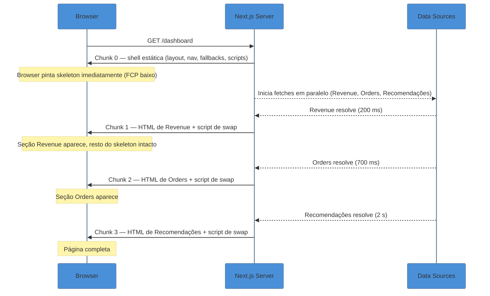

# Streaming, Suspense e `loading.tsx`

> [!abstract] TL;DR
> Streaming SSR envia o HTML em pedaços via *chunked transfer encoding*: o Next expede a **shell estática** (layouts + fallbacks dos Suspense) imediatamente, e cada `<Suspense>` boundary vira um ponto de streaming independente. `loading.tsx` é um atalho de arquivo que cria automaticamente um `<Suspense>` envolvendo a `page.tsx` do segmento, exibindo um skeleton enquanto o Server Component resolve. `<Suspense>` manual dá granularidade fina — seções distintas da página streamam em paralelo sem se bloquear. O resultado prático: TTFB cai para o custo de renderizar os layouts; FCP desacopla completamente da latência dos dados.

---

> [!info] Pré-requisito — Suspense no React core
> Esta nota foca em **como o Next.js cabeia o Suspense**. Se você ainda não conhece a primitiva, leia antes [[03-Dominios/Tecnologia/React/React core/19 - Suspense e data fetching no cliente|React core 19 — Suspense e data fetching no cliente]]. Aqui assumimos que você sabe o que é um Suspense boundary e quando um componente "suspende".

---

## O problema que o streaming resolve

Imagine um dashboard: o cabeçalho é estático, o gráfico de receita vem de um banco de dados (~700 ms), e as recomendações chegam de um serviço de ML (~2 s). No SSR tradicional o servidor esperaria os 2 segundos inteiros antes de enviar *qualquer* HTML. O usuário vê uma tela em branco enquanto o componente mais lento decide o ritmo da página inteira.

A pergunta certa é: por que o cabeçalho precisa esperar o serviço de ML? Ele não precisa. E por que as recomendações precisam esperar o gráfico de receita? Também não. Streaming resolve exatamente isso: cada parte chega quando fica pronta, sem travar o resto.

## Como a página chega ao navegador com streaming

Quando o browser requisita uma rota, o App Router trabalha com duas camadas simultâneas:

### A shell estática

Tudo que renderiza **antes** de qualquer trabalho assíncrono resolver é chamado de *shell estática*: layouts, navegação, e os fallbacks dos `<Suspense>` boundaries. Ela é enviada imediatamente, dando ao usuário algo para ver e interagir enquanto o conteúdo dinâmico ainda está a caminho. Se você usar *Cache Components* (`"use cache"`), a shell pode ser pré-renderizada em build time e servida do edge instantaneamente.

### O HTML stream

React produz HTML progressivamente, alinhado às `<Suspense>` boundaries. Quando um Server Component assíncrono resolve, React transmite o HTML completo junto com uma `<script>` inline que faz o swap do nó de fallback no DOM — **sem esperar o bundle JS ou a hidratação completar**. O browser executa o swap assim que o chunk chega; o usuário vê conteúdo real aparecendo progressivamente.

### O component payload

Representação serializada da árvore de componentes, usada pelo React para hidratar a página. Na carga inicial chega embutida no HTML stream (as tags `self.__next_f.push`). Em **navegações client-side**, só o payload é buscado (header `rsc: 1`), sem transferência de HTML. React atualiza a árvore in-place.

## Diagrama: shell → chunks independentes



Cada `<Suspense>` boundary é um ponto de streaming independente: boundaries diferentes não se bloqueiam nem dependem de ordem de resolução.

## `loading.tsx` — Suspense automático no nível do segmento

A forma mais simples de adicionar streaming é criar um arquivo `loading.tsx` ao lado do `page.tsx`:

```
app/
  dashboard/
    loading.tsx   ← fallback do Suspense automático
    page.tsx      ← Server Component assíncrono
    layout.tsx    ← parte da shell; NÃO envolvido pelo loading.tsx
```

O Next.js envolve automaticamente a `page.tsx` (e qualquer `layout.tsx` aninhado abaixo deste segmento) em um `<Suspense>` cujo fallback é o componente exportado pelo `loading.tsx`. Você não escreve o `<Suspense>` na mão — o file-system faz o trabalho.

```tsx
// app/dashboard/loading.tsx
export default function Loading() {
  return (
    <div className="animate-pulse space-y-4 p-6">
      <div className="h-8 w-48 bg-gray-200 rounded" />
      <div className="grid grid-cols-3 gap-4">
        <div className="h-32 bg-gray-200 rounded" />
        <div className="h-32 bg-gray-200 rounded" />
        <div className="h-32 bg-gray-200 rounded" />
      </div>
      <div className="h-64 bg-gray-200 rounded" />
    </div>
  )
}
```

```tsx
// app/dashboard/page.tsx
export default async function DashboardPage() {
  const data = await fetchDashboardData() // pode levar 700 ms
  return <DashboardView data={data} />
}
```

O skeleton aparece instantaneamente (faz parte da shell). Quando `DashboardPage` termina de resolver, o HTML real substitui o skeleton.

**O que o `loading.tsx` envolve vs. o que não envolve:**

| Arquivo no mesmo segmento | Envolto pelo `loading.tsx`? |
|---|---|
| `page.tsx` | ✅ Sim |
| `not-found.tsx` | ✅ Sim |
| Layouts filhos (aninhados abaixo) | ✅ Sim |
| `layout.tsx` do **mesmo** segmento | ❌ Não |
| `template.tsx` | ❌ Não |
| `error.tsx` | ❌ Não |

O `layout.tsx` fica fora do Suspense porque pertence à shell estática. Se ele ficasse dentro, toda navegação esperaria o layout resolver antes de mostrar qualquer coisa — destruindo o benefício de layouts persistentes.

> [!info] O fallback é prefetched
> Durante o `<Link>` prefetch, o Next.js faz prefetch do fallback do `loading.tsx`. Isso significa que, em navegações client-side, o skeleton aparece *instantaneamente* — sem esperar o servidor responder. A navegação também é **interrompível**: o usuário pode navegar para outra rota antes de a atual terminar de carregar.

## `<Suspense>` manual — granularidade fina

`loading.tsx` é tudo ou nada: ou a página inteira está carregando, ou não está. Para streamar **partes específicas** de forma independente enquanto o resto da página já está visível, use `<Suspense>` manualmente:

```tsx
// app/dashboard/page.tsx
import { Suspense } from 'react'
import { Revenue } from './_sections/revenue'
import { RecentOrders } from './_sections/recent-orders'
import { Recommendations } from './_sections/recommendations'
import {
  RevenueSkeleton,
  OrdersSkeleton,
  RecommendationsSkeleton,
} from './_components/skeletons'

export default function Dashboard() {
  return (
    <div>
      <h1 className="text-2xl font-bold">Dashboard</h1> {/* pinta na shell */}
      <div className="grid grid-cols-2 gap-4 mt-6">
        <Suspense fallback={<RevenueSkeleton />}>
          <Revenue />        {/* resolve em ~200 ms */}
        </Suspense>
        <Suspense fallback={<OrdersSkeleton />}>
          <RecentOrders />   {/* resolve em ~700 ms */}
        </Suspense>
      </div>
      <Suspense fallback={<RecommendationsSkeleton />}>
        <Recommendations />  {/* resolve em ~2 s */}
      </Suspense>
    </div>
  )
}
```

O `<h1>` faz parte da shell e pinta imediatamente. Cada seção aparece conforme seu dado chega, sem que uma bloqueie a outra.

### A técnica de passar a promise como prop

Para maximizar o paralelismo, inicie os fetches no pai e passe as *promises não resolvidas* como props. Assim todos os requests disparam ao mesmo tempo, em vez de sequencialmente:

```tsx
// app/dashboard/page.tsx
export default function Dashboard() {
  // Todos os fetches iniciam ao mesmo tempo
  const revenuePromise = fetchRevenue()
  const ordersPromise = fetchOrders()
  const recommendationsPromise = fetchRecommendations()

  return (
    <div className="grid grid-cols-3 gap-4">
      <Suspense fallback={<RevenueSkeleton />}>
        <Revenue dataPromise={revenuePromise} />
      </Suspense>
      <Suspense fallback={<OrdersSkeleton />}>
        <RecentOrders dataPromise={ordersPromise} />
      </Suspense>
      <Suspense fallback={<RecommendationsSkeleton />}>
        <Recommendations dataPromise={recommendationsPromise} />
      </Suspense>
    </div>
  )
}

// app/dashboard/_sections/revenue.tsx
import { use } from 'react'
import type { RevenueData } from '@/types'

type Props = { dataPromise: Promise<RevenueData> }

export function Revenue({ dataPromise }: Props) {
  const data = use(dataPromise) // suspende aqui
  return <RevenueChart data={data} />
}
```

O componente filho usa `use()` para ler a promise (ver [[03-Dominios/Tecnologia/React/React core/21 - O hook use()|React core 21]]). O `<Suspense>` pai captura a suspensão e mostra o fallback.

### Suspense aninhado para revelação progressiva

Você pode aninhar boundaries para criar uma experiência em camadas — parte do conteúdo aparece cedo, detalhes aparecem depois:

```tsx
// app/product/[id]/page.tsx
export default async function ProductPage({
  params,
}: {
  params: Promise<{ id: string }>
}) {
  const { id } = await params

  return (
    <div>
      <h1>Produto</h1>
      <Suspense fallback={<p>Carregando detalhes...</p>}>
        <ProductDetails id={id} />
        {/* Reviews só aparece depois que ProductDetails resolve */}
        <Suspense fallback={<p>Carregando avaliações...</p>}>
          <Reviews productId={id} />
        </Suspense>
      </Suspense>
    </div>
  )
}
```

O boundary externo mostra "Carregando detalhes..." até `ProductDetails` resolver. O boundary interno então aparece e mostra "Carregando avaliações..." até `Reviews` resolver. Revelação progressiva em duas etapas.

> [!tip] Assista: Next.js Streaming Tutorial — SSR, React Suspense & Loading Skeleton in Next.js 15
> **Canal:** logicBase Labs | **Duração:** ~25min | **Idioma:** EN
>
> O vídeo começa mostrando o problema real: página que trava enquanto todos os dados carregam de uma vez, incluindo o bug de "interação fantasma" que some após a hidratação. A segunda metade demonstra ao vivo a migração de `Promise.all` (tudo de uma vez) para o padrão de promise-por-componente dentro de `<Suspense>` individuais — o mesmo padrão com `use()` que a seção acima descreve, agora com código rodando na tela. Trecho de destaque [23:07]: *"If you want to stream at the page level, just use a loading.js file. That way the whole page shows a loading state. But if you want to stream things individually — different components or sections — you can simply wrap them in separate suspense boundaries and handle it your own way."*
>
> 🎬 [Assistir no YouTube](https://www.youtube.com/watch?v=xTT_Sd_xqh0)

## Como o streaming melhora os Core Web Vitals

**Sem streaming:** TTFB = tempo da query mais lenta. O browser espera o HTML completo antes de pintar qualquer coisa.

**Com streaming:** TTFB = tempo de renderizar a shell (layouts + fallbacks, geralmente < 50 ms). O browser pinta imediatamente.

| Métrica | Com SSR tradicional | Com streaming |
|---|---|---|
| **TTFB** | = latência da query mais lenta | = tempo de renderizar a shell |
| **FCP** | bloqueado pelos dados | desacoplado — pinta o skeleton |
| **LCP** | idem ao FCP | ✅ se o elemento LCP estiver na shell |
| **CLS** | sem shift (HTML completo) | potencial shift se skeleton ≠ tamanho real |
| **INP** | hidratação em bloco único | hidratação seletiva (por boundary) |

**LCP e posição do elemento:** se o seu elemento LCP (hero image, título principal, foto do produto) estiver dentro de um `<Suspense>` boundary, ele não aparece até a boundary resolver. Mantenha elementos LCP **fora** dos boundaries ou na shell.

**INP e hidratação seletiva:** cada `<Suspense>` é uma unidade de hidratação independente. O React prioriza hidratar o que o usuário está tocando/clicando, quebrando o trabalho em tarefas menores que cedem o main thread ao browser. Sem Suspense, o React hidrata a página inteira em um único bloco bloqueante.

## O contrato HTTP e suas implicações

Uma vez que streaming começa, os headers HTTP (incluindo o status code) já foram enviados. **Você não pode mudar o status code depois que o streaming inicia.**

Isso tem consequências diretas:

- **`notFound()` após um `await` que suspende** → o Next não consegue retornar 404. Em vez disso, injeta `<meta name="robots" content="noindex">` no HTML; o status permanece 200.
- **`redirect()` após o início do streaming** → vira um redirect client-side (JavaScript), não um HTTP 301/302.
- **Erros em componentes dentro de Suspense** → capturados pelo `error.tsx` mais próximo; só a seção que falhou é substituída; o resto da página permanece intacto.

Para garantir um status HTTP real, coloque as verificações **antes** de qualquer `<Suspense>` ou `await` que suspenda:

```tsx
// app/post/[slug]/page.tsx
export default async function PostPage({
  params,
}: {
  params: Promise<{ slug: string }>
}) {
  const { slug } = await params
  const exists = await checkSlugExists(slug) // verificação rápida
  if (!exists) notFound()                    // real 404 — antes de qualquer Suspense

  return (
    <Suspense fallback={<PostSkeleton />}>
      <PostContent slug={slug} />
    </Suspense>
  )
}
```

## Armadilhas comuns

> [!warning] `loading.tsx` não cobre o `layout.tsx` do mesmo segmento
> Se o `layout.tsx` faz `await cookies()`, `await headers()`, ou um `fetch` sem cache, o Next.js bloqueia a navegação até o layout terminar — e o `loading.tsx` não mostrará fallback para isso. O skeleton do segmento não aparece; a página simplesmente trava. Para streamar dados do layout, mova a lógica para a `page.tsx`, ou envolva a parte dinâmica do layout em um `<Suspense>` explícito com um fallback próprio.

> [!warning] `await` no topo da `page.tsx` bloqueia o streaming do segmento inteiro
> Se você desestrutura `await params` ou `await fetchData()` diretamente no corpo da `page.tsx` antes de qualquer `<Suspense>`, toda a página espera esse `await` antes de streamar — mesmo que o resto da página não precise desses dados. Passe a promise como prop e deixe o componente que realmente precisa resolver dentro do `<Suspense>`.
> ```tsx
> // ❌ Toda a página espera o `await params`
> export default async function Page({ params }: { params: Promise<{ id: string }> }) {
>   const { id } = await params
>   return <ProductDetails id={id} />
> }
>
> // ✅ Shell pinta; só ProductDetails espera
> export default function Page({ params }: { params: Promise<{ id: string }> }) {
>   return (
>     <Suspense fallback={<ProductSkeleton />}>
>       <ProductDetails paramsPromise={params} />
>     </Suspense>
>   )
> }
> ```

> [!warning] `notFound()` e `redirect()` devem vir antes de qualquer Suspense ou `await` que suspenda
> Depois que o primeiro chunk HTML sai, o status HTTP 200 está cravado. Chamadas a `notFound()` ou `redirect()` viram operações client-side, não HTTP responses. Coloque verificações de existência antes de qualquer boundary — ou use o arquivo `proxy` do segmento para checar antes de renderizar.

> [!warning] Proxies reversos e CDNs podem bufferizar o stream inteiro
> Nginx bufferiza respostas por padrão: o usuário recebe tudo de uma vez no final, perdendo o benefício progressivo. Desative com o header `X-Accel-Buffering: no` via `next.config.js`. CDNs podem ter restrições similares (verificar documentação). Ambientes serverless como AWS Lambda precisam de *response streaming mode* explicitamente habilitado.

> [!warning] Skeleton com tamanho diferente do conteúdo real causa CLS
> Quando o swap do fallback pelo conteúdo final acontece, se as dimensões forem diferentes, o layout se move — CLS negativo. Projete skeletons que **reservem o mesmo espaço** que o conteúdo que vão substituir. Use `min-height` fixo nos containers dos Suspense quando o tamanho final for variável.

## Casos práticos

### Cenário 1: Feed de posts com skeleton imediato

Blog com feed de posts de uma API externa (~800 ms). Com `loading.tsx`, navbar e cabeçalho pintam na hora; o skeleton do feed ocupa exatamente o espaço dos posts enquanto chegam:

```tsx
// app/feed/loading.tsx
export default function Loading() {
  return (
    <div className="space-y-4 p-4">
      {Array.from({ length: 5 }).map((_, i) => (
        <div key={i} className="animate-pulse flex gap-4">
          <div className="h-16 w-16 rounded-lg bg-gray-200 shrink-0" />
          <div className="flex-1 space-y-2 py-1">
            <div className="h-4 bg-gray-200 rounded w-3/4" />
            <div className="h-3 bg-gray-200 rounded w-full" />
            <div className="h-3 bg-gray-200 rounded w-1/2" />
          </div>
        </div>
      ))}
    </div>
  )
}

// app/feed/page.tsx
export default async function FeedPage() {
  const posts = await fetchPosts() // ~800 ms
  return <PostList posts={posts} />
}
```

UX: navbar pinta em < 50 ms; skeleton sem shift (mesmo tamanho dos posts); posts reais substituem o skeleton em ~800 ms.

### Cenário 2: Dashboard com seções que streamam independentemente

Três seções de fontes diferentes: receita (DB rápido, ~200 ms), pedidos recentes (DB lento, ~1 s), recomendações de ML (serviço externo, ~2,5 s). Com `<Suspense>` manual, cada seção aparece assim que seu dado chega:

```tsx
// app/admin/dashboard/page.tsx
import { Suspense } from 'react'
import { MonthlyRevenue } from './_sections/monthly-revenue'
import { RecentOrders } from './_sections/recent-orders'
import { MLRecommendations } from './_sections/ml-recommendations'

export default function AdminDashboard() {
  // Fetches iniciam em paralelo — sem await aqui
  const revenuePromise = fetchMonthlyRevenue()
  const ordersPromise = fetchRecentOrders()
  const recommendationsPromise = fetchMLRecommendations()

  return (
    <main className="grid grid-cols-3 gap-6 p-6">
      <h1 className="col-span-3 text-2xl font-bold">Admin Dashboard</h1>

      <Suspense fallback={<MetricCardSkeleton />}>
        <MonthlyRevenue dataPromise={revenuePromise} />
      </Suspense>

      <Suspense fallback={<TableSkeleton rows={10} />}>
        <RecentOrders dataPromise={ordersPromise} />
      </Suspense>

      <Suspense fallback={<RecommendationSkeleton />}>
        <MLRecommendations dataPromise={recommendationsPromise} />
      </Suspense>
    </main>
  )
}

// app/admin/dashboard/_sections/monthly-revenue.tsx
import { use } from 'react'
import type { RevenueData } from '@/types'

export function MonthlyRevenue({
  dataPromise,
}: {
  dataPromise: Promise<RevenueData>
}) {
  const revenue = use(dataPromise) // suspende; resolve em ~200 ms
  return <MetricCard title="Receita Mensal" value={revenue.total} />
}
```

UX: `<h1>` na shell pinta imediatamente; receita aparece em 200 ms; pedidos em 1 s; recomendações em 2,5 s. Os três fetches correm em paralelo porque as promises foram criadas antes dos `<Suspense>`.

## Resumo em uma frase

`loading.tsx` entrega Suspense de segmento inteiro com zero código; `<Suspense>` manual entrega granularidade cirúrgica — ambos dependem do mesmo mecanismo: o React serializa a árvore alinhada às boundaries e o Next.js transmite os chunks via HTTP conforme cada pedaço resolve.

## Como explicar em inglês

*"In Next.js, streaming SSR sends the static shell — layouts and Suspense fallbacks — immediately, then streams each section's HTML as its data resolves. `loading.tsx` is a file-system shortcut that wraps the page in a Suspense boundary automatically; manual `<Suspense>` gives fine-grained control so different sections stream independently without blocking each other. TTFB drops to the cost of rendering layouts, decoupling paint from data latency."*

*"The key pattern is to start fetches at the parent and pass unresolved promises as props. Each child reads the promise with `use()`, suspending inside its own boundary. This way all fetches run in parallel and each section appears as soon as its data arrives."*

| PT | EN |
|---|---|
| shell estática | static shell |
| ponto de streaming | streaming point |
| boundary Suspense | Suspense boundary |
| swap do fallback | fallback swap |
| hidratação seletiva | selective hydration |
| transferência chunked | chunked transfer encoding |
| skeleton de carregamento | loading skeleton |
| latência de dados | data latency |
| revelação progressiva | progressive reveal |
| `loading.tsx` automático | automatic `loading.tsx` (file-system Suspense) |
| granularidade fina | fine-grained control |
| promise passada como prop | promise prop / promise passthrough |
| suspender | to suspend |

## O que vem a seguir

Streaming melhora *quando* o conteúdo chega. Mas de onde ele vem — cache, renderização estática, servidor de borda — determina o quão rápido esse "quando" é. A próxima nota explora as estratégias de rendering (SSR, SSG, ISR, PPR) e como o Next decide qual usar em cada rota:

- [[03-Dominios/Tecnologia/React/Next.js/08 - Rendering strategies - SSR, SSG, ISR, PPR|08 — Rendering strategies: SSR, SSG, ISR, PPR]] — estático vs dinâmico; `generateStaticParams`; PPR como ponte entre os dois mundos
- [[03-Dominios/Tecnologia/React/Next.js/10 - Route Handlers e APIs|10 — Route Handlers e APIs]] — Route Handlers também streamam via Web Streams API; quando usar handler vs Server Action
- [[03-Dominios/Tecnologia/React/Next.js/05 - Data fetching no Server|05 — Data fetching no Server]] — a relação entre `async`/`await` em Server Components e os Suspense boundaries que habilitam o streaming

## Referências

- **Next.js Team** — [*Guides: Streaming*](https://nextjs.org/docs/app/guides/streaming) — documentação oficial completa do streaming no App Router, incluindo Web Vitals, HTTP contract, infraestrutura e streaming em Route Handlers; atualizada 2026-06-23
- **Next.js Team** — [*File-system conventions: loading.js*](https://nextjs.org/docs/app/api-reference/file-conventions/loading) — referência da API do `loading.tsx`: comportamento de navegação, hierarquia de componentes, SEO, status codes; atualizada 2026-03-13
- **Next.js Team** — [*App Router: Streaming (Learn)*](https://nextjs.org/learn/dashboard-app/streaming) — tutorial interativo do curso oficial com exemplos de `loading.tsx` e `<Suspense>` em dashboard real
