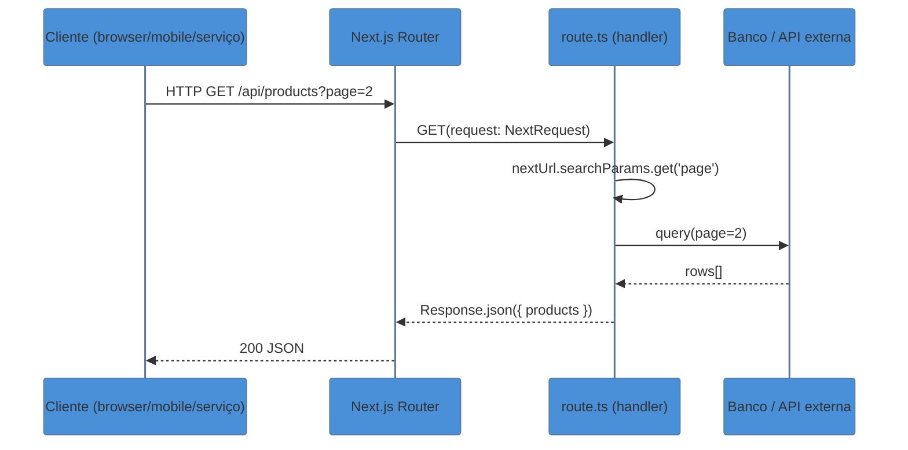
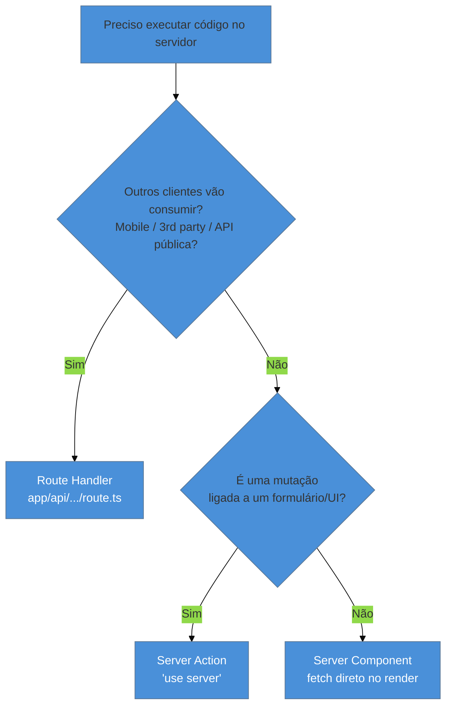

> [!abstract] TL;DR
> Route Handlers (`route.ts`) são a camada REST do App Router: você exporta funções nomeadas por método HTTP (`GET`, `POST`, etc.) e o Next as serve como endpoints. Eles usam a Web API padrão (`Request`/`Response`) com extensões do Next (`NextRequest`/`NextResponse`). No Next 15, GET handlers **não** são cacheados por padrão. Use Route Handlers para APIs públicas, webhooks e integrações externas. Para mutações ligadas à UI do próprio app, prefira Server Actions.

---

Você acabou de construir uma landing page bonita com o App Router. O design de produto pede um webhook do Stripe — uma URL que o Stripe vai chamar quando um pagamento for confirmado. E o time mobile quer um endpoint REST para buscar os planos de assinatura. Em ambos os casos, você precisa de um **endereço HTTP real, acessível de fora do app**. É aqui que entram os Route Handlers.

## O que é um Route Handler

Um Route Handler é um arquivo `route.ts` dentro da pasta `app/`. Cada arquivo representa um endpoint: você exporta funções com o nome do método HTTP que quer responder, e o Next cuida do roteamento.

```
app/
└── api/
    └── products/
        └── route.ts          ← /api/products (GET, POST, …)
    └── [id]/
        └── route.ts          ← /api/products/:id (GET, DELETE, …)
```

A convenção é simples: o **nome da pasta** vira a URL, o **nome da função exportada** vira o método.

> [!warning] `route.ts` e `page.tsx` não coexistem no mesmo segmento
> Se você tiver `app/products/page.tsx`, não pode ter `app/products/route.ts` na mesma pasta — há conflito de rota. A solução usual é mover o handler para `app/api/products/route.ts`.

### Métodos suportados

Next.js suporta `GET`, `POST`, `PUT`, `PATCH`, `DELETE`, `HEAD` e `OPTIONS`. Se um cliente chamar um método não exportado, o Next retorna `405 Method Not Allowed` automaticamente. O `OPTIONS` também tem implementação automática (baseada nos métodos que você exportou) se você não definir um.

```ts
// app/api/products/route.ts

export async function GET(request: Request) {
  return Response.json({ products: [] })
}

export async function POST(request: Request) {
  const body = await request.json()
  // salvar no banco…
  return Response.json({ created: true }, { status: 201 })
}
```

## `NextRequest` e `NextResponse`: o Request/Response turbinado

O parâmetro `request` pode ser tipado como o `Request` padrão da Web API — mas o Next injeta na verdade um `NextRequest`, que é uma extensão desse objeto. A diferença prática: `NextRequest` inclui `nextUrl`, uma URL parsed com helpers prontos para ler query strings, pathname e outros.

```ts
import type { NextRequest } from 'next/server'

export function GET(request: NextRequest) {
  // URL parsed com searchParams já disponível
  const query = request.nextUrl.searchParams.get('q')
  // vs. URL padrão que exigiria new URL(request.url).searchParams
  return Response.json({ query })
}
```

`NextResponse` estende `Response` com helpers como `NextResponse.redirect()` e `NextResponse.json()`, mas você pode usar o `Response` padrão tranquilamente — ambos funcionam.

> [!info] Web API pura vs. extensões do Next
> Você pode assinar a função como `(request: Request)` e usar `Response.json(...)` e o código roda igual. As extensões `NextRequest`/`NextResponse` entram quando você precisa de `nextUrl`, de manipular cookies inline ou de `.redirect()` com tipagem. Não é obrigatório usá-las.

## Lendo dados da requisição

### Query params

```ts
import type { NextRequest } from 'next/server'

export function GET(request: NextRequest) {
  const page = request.nextUrl.searchParams.get('page') ?? '1'
  const limit = request.nextUrl.searchParams.get('limit') ?? '10'
  return Response.json({ page, limit })
}
// GET /api/products?page=2&limit=20
```

### Body JSON e FormData

```ts
export async function POST(request: Request) {
  // JSON
  const { name, price } = await request.json()

  // FormData (upload de arquivos, formulários multipart)
  // const form = await request.formData()
  // const file = form.get('file') as File

  return Response.json({ name, price }, { status: 201 })
}
```

### Headers e cookies

```ts
import { headers, cookies } from 'next/headers'
import type { NextRequest } from 'next/server'

export async function GET(request: NextRequest) {
  // Via helpers do Next (funcionam em qualquer Server Function)
  const headersList = await headers()
  const authToken = headersList.get('authorization')

  const cookieStore = await cookies()
  const session = cookieStore.get('session-id')

  // Ou diretamente no request (Web API padrão)
  const userAgent = request.headers.get('user-agent')
  const tokenInline = request.cookies.get('token')?.value

  return Response.json({ authToken, session: session?.value, userAgent })
}
```

> [!warning] `headers()` e `cookies()` são assíncronos no Next 15
> A partir do Next 15, as funções `headers()` e `cookies()` de `next/headers` são `async` e precisam de `await`. Código do Next 14 que não usava `await` vai quebrar com um erro de tipagem/runtime.

## Segmentos dinâmicos

Para criar `/api/orders/:id`, basta usar a pasta `[id]`:

```
app/api/orders/[id]/route.ts
```

O segundo parâmetro da função é o `context`, cujo `params` é **uma Promise** no Next 15:

```ts
import type { NextRequest } from 'next/server'

export async function GET(
  request: NextRequest,
  { params }: { params: Promise<{ id: string }> }
) {
  const { id } = await params   // ← await obrigatório no Next 15
  return Response.json({ orderId: id })
}

export async function DELETE(
  _request: NextRequest,
  { params }: { params: Promise<{ id: string }> }
) {
  const { id } = await params
  // deletar do banco…
  return new Response(null, { status: 204 })
}
```

Você também pode usar o `RouteContext` helper do TypeScript para tipar com a rota literal:

```ts
// app/api/users/[id]/route.ts
export async function GET(_req: NextRequest, ctx: RouteContext<'/api/users/[id]'>) {
  const { id } = await ctx.params
  return Response.json({ id })
}
// RouteContext é gerado por `next typegen` / `next build` — globally available
```

> [!warning] `params` virou Promise no Next 15
> No Next 14, `params` era um objeto síncrono: `{ params: { id: string } }`. No Next 15, passou a ser `{ params: Promise<{ id: string }> }`. Sempre use `await params`. Um codemod oficial (`npx @next/codemod@canary next-async-request-api`) converte automaticamente.

## Caching de GET no Next 15

> [!info] Modelo de caching — leia a nota 07
> O comportamento de cache descrito aqui é parte do modelo maior do Next 15. Para entender Request Memoization, Data Cache, Full Route Cache e Router Cache, veja [[03-Dominios/Tecnologia/React/Next.js/07 - O modelo de caching do Next 15|nota 07]].

No Next 15, **GET handlers não são cacheados por padrão** — cada requisição aciona o handler. Isso é diferente do Next 14, onde GET handlers eram cacheados estaticamente por padrão, o que gerava confusão (dados desatualizados sem nenhum aviso).

Para **optar por cache** em um GET handler:

```ts
// Cache estático — roda em build time, não em runtime
export const dynamic = 'force-static'

export async function GET() {
  const data = await fetch('https://api.example.com/plans')
  return Response.json(await data.json())
}
```

Para **ISR** (revalidar periodicamente):

```ts
export const revalidate = 60  // revalida a cada 60 segundos

export async function GET() {
  const data = await fetch('https://api.example.com/plans')
  return Response.json(await data.json())
}
```

Por padrão (sem nenhum export de config), o handler roda a cada requisição — comportamento dinâmico, seguro para dados frescos.

## Fluxo request → handler → response



## Quando usar Route Handler vs Server Action

Essa é a pergunta de entrevista mais frequente sobre o App Router. A regra não é técnica — é de design:



| Situação | Use |
|----------|-----|
| API REST pública (mobile + web) | Route Handler |
| Webhook externo (Stripe, GitHub) | Route Handler |
| Streaming de IA para cliente externo | Route Handler |
| Mutação disparada por `<form>` | Server Action |
| Mutação chamada de Client Component | Server Action |
| Dados usados só pela UI do Next | Server Component (sem endpoint) |
| Proxy / BFF para serviço interno | Route Handler |

A distinção chave: Server Actions têm URL gerada e criptografada automaticamente — você não pode acessar `/api/...` no browser. Route Handlers têm URL pública e explícita. Para entender o modelo de Actions no React 19 (incluindo `useActionState`, progressive enhancement e o ciclo de transitions), veja [[03-Dominios/Tecnologia/React/React core/22 - Actions no React 19|React core 22 — Actions]].

> [!info] Quando precisar dos dois
> Se uma Server Action e um Route Handler compartilham a mesma lógica de negócio, mova essa lógica para uma **Data Access Layer** (`lib/data/orders.ts`) e chame a mesma função de ambos. Não duplique a implementação.

## CORS

Para APIs consumidas por outros domínios (mobile, SPA separada), configure os headers CORS na resposta:

```ts
// app/api/public/route.ts
export async function GET(request: Request) {
  return new Response(JSON.stringify({ ok: true }), {
    status: 200,
    headers: {
      'Access-Control-Allow-Origin': '*',
      'Access-Control-Allow-Methods': 'GET, POST, OPTIONS',
      'Access-Control-Allow-Headers': 'Content-Type, Authorization',
      'Content-Type': 'application/json',
    },
  })
}

// Preflight
export async function OPTIONS() {
  return new Response(null, {
    headers: {
      'Access-Control-Allow-Origin': '*',
      'Access-Control-Allow-Methods': 'GET, POST, OPTIONS',
      'Access-Control-Allow-Headers': 'Content-Type, Authorization',
    },
  })
}
```

Para aplicar CORS em múltiplos handlers, use `next.config.ts` (`headers`) ou um helper `withCors()` que envolve os handlers.

## Casos práticos

### Cenário 1 — Webhook de pagamento (Stripe)

O Stripe precisa de uma URL pública para notificar eventos. Não dá para usar Server Action aqui — o Stripe não sabe nada da UI do seu app.

```ts
// app/api/webhooks/stripe/route.ts
import Stripe from 'stripe'

const stripe = new Stripe(process.env.STRIPE_SECRET_KEY!)

export async function POST(request: Request) {
  const payload = await request.text()   // ← texto bruto para validar assinatura
  const sig = request.headers.get('stripe-signature')

  let event: Stripe.Event

  try {
    event = stripe.webhooks.constructEvent(
      payload,
      sig!,
      process.env.STRIPE_WEBHOOK_SECRET!
    )
  } catch (err) {
    return new Response(`Webhook error: ${(err as Error).message}`, {
      status: 400,
    })
  }

  if (event.type === 'payment_intent.succeeded') {
    const intent = event.data.object as Stripe.PaymentIntent
    // atualizar pedido no banco…
    console.log('Pago:', intent.id)
  }

  return new Response('ok', { status: 200 })
}
```

Pontos importantes:
- Leia o body com `request.text()`, não `.json()` — a verificação de assinatura precisa do payload bruto.
- Retorne `200` rápido; processe de forma assíncrona se necessário (fila).
- Route Handler porque o Stripe é externo — Server Action não serviria.

### Cenário 2 — Streaming de resposta de IA

Para uma feature de chat onde o front quer tokens conforme chegam (Server-Sent Events / streaming), você precisa de um endpoint público que o browser possa chamar via `fetch`:

```ts
// app/api/chat/route.ts
export async function POST(request: Request) {
  const { messages } = await request.json()

  const stream = new ReadableStream({
    async start(controller) {
      const encoder = new TextEncoder()

      // Chama LLM externo (exemplo sem lib)
      const res = await fetch('https://api.openai.com/v1/chat/completions', {
        method: 'POST',
        headers: {
          Authorization: `Bearer ${process.env.OPENAI_API_KEY}`,
          'Content-Type': 'application/json',
        },
        body: JSON.stringify({ model: 'gpt-4o', messages, stream: true }),
      })

      const reader = res.body!.getReader()

      while (true) {
        const { done, value } = await reader.read()
        if (done) break
        controller.enqueue(value)
      }

      controller.close()
    },
  })

  return new Response(stream, {
    headers: { 'Content-Type': 'text/event-stream' },
  })
}
```

No cliente (Client Component), você consome com `fetch` + `ReadableStream`. O Vercel AI SDK (`ai`) simplifica muito esse padrão com `StreamingTextResponse`.

## Armadilhas comuns

> [!warning] Não criar handler dentro de pasta que já tem `page.tsx`
> `app/products/page.tsx` e `app/products/route.ts` no mesmo nível → conflito, build falha. Mova o handler para `app/api/products/route.ts` ou crie uma subpasta dedicada.

> [!warning] GET cacheado no Next 14, não no Next 15 — comportamento invertido
> Se você migrou um projeto do Next 14, seus GET handlers que "funcionavam do cache" agora rodam a cada request. Isso é mais correto, mas pode aumentar carga no banco. Adicione `export const dynamic = 'force-static'` ou `export const revalidate = N` onde cache faz sentido.

> [!warning] `params` é Promise no Next 15 — não desestruture síncronamente
> ```ts
> // ❌ Next 14 — não funciona no 15
> export function GET(req: Request, { params }: { params: { id: string } }) {
>   const { id } = params
> }
>
> // ✅ Next 15
> export async function GET(
>   req: Request,
>   { params }: { params: Promise<{ id: string }> }
> ) {
>   const { id } = await params
> }
> ```

> [!warning] Não use `bodyParser` — ele não existe no App Router
> No Pages Router (`pages/api/`), era comum configurar `export const config = { api: { bodyParser: false } }`. No App Router, o corpo está disponível diretamente via `request.json()` / `request.formData()` / `request.text()`. Sem configuração extra.

## Como explicar em inglês

Route Handlers are `route.ts` files in the App Router that expose HTTP endpoints — you export named functions per HTTP method and Next.js wires them up automatically. Use them when you need a public REST API, to handle webhooks from external services, or to build a Backend for Frontend layer. For mutations tied to your own UI, prefer Server Actions instead, since they're auto-generated POST endpoints with encrypted URLs and tighter integration with React's transition model.

| PT | EN |
|---|---|
| Route Handler | Route Handler |
| Segmento dinâmico | Dynamic segment |
| Método HTTP | HTTP method |
| Webhook | Webhook |
| Body da requisição | Request body |
| Cabeçalhos | Headers |
| Cookies | Cookies |
| Streaming | Streaming |
| Backend for Frontend | Backend for Frontend (BFF) |
| Cacheado por padrão | Cached by default |
| Não cacheado por padrão | Not cached by default (Next 15) |

## Route Handlers em uma frase

Route Handlers são arquivos `route.ts` que expõem endpoints HTTP reais — use quando precisar de uma API pública, de webhooks ou de integração com clientes externos; para mutações internas ao app, prefira Server Actions.

## O que vem a seguir

Com Route Handlers você tem a camada de API. Agora que o Next serve dados, a próxima peça é como o framework apresenta esses dados nos diferentes modos de renderização — estático, dinâmico, ISR e Partial Prerendering:

- [[03-Dominios/Tecnologia/React/Next.js/11 - Metadata, SEO e assets sociais|11 - Metadata, SEO e assets sociais]] — como o Next gerencia `<head>`, OG images e sitemap
- [[03-Dominios/Tecnologia/React/Next.js/06 - Server Actions e mutations|06 - Server Actions e mutations]] — o contraponto ao Route Handler para mutações ligadas à UI
- [[03-Dominios/Tecnologia/React/Next.js/07 - O modelo de caching do Next 15|07 - O modelo de caching do Next 15]] — entender os 4 caches que afetam diretamente o comportamento dos handlers

## Referências

- **Vercel/Next.js Team** — [*Route Handlers (Getting Started)*](https://nextjs.org/docs/app/getting-started/route-handlers) — guia introdutório oficial, caching e convenções
- **Vercel/Next.js Team** — [*route.js API Reference*](https://nextjs.org/docs/app/api-reference/file-conventions/route) — referência completa de parâmetros, métodos, `RouteContext`, changelog de versões
- **Lee Robinson (Vercel)** — [*Building APIs with Next.js*](https://nextjs.org/blog/building-apis-with-nextjs) — guia canônico de quando usar Route Handler vs Server Action vs Server Component
